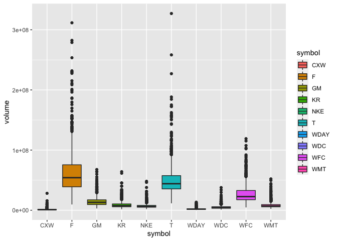
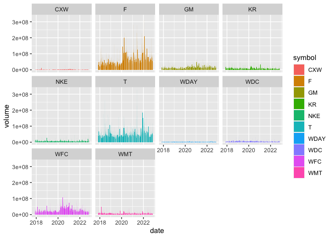

#### Libraries

```r
library(dplyr)
library(timetk)
library(ggplot2)
library(tidyquant)
library(tidyverse)
library(dygraphs)
library(lubridate)
```

# SECTION 1
### Tickers Today

```r
tickers_today <- tq_get(c("CXW", "F", "GM", "JCP", "KR", "WDC", "NKE","T", "WDAY", "WFC", "WMT"),get = "stock.prices", from = today()-years(5))
head(tickers_today)
```

```
## # A tibble: 6 × 8
##   symbol date        open  high   low close  volume adjusted
##   <chr>  <date>     <dbl> <dbl> <dbl> <dbl>   <dbl>    <dbl>
## 1 CXW    2017-11-03  24.5  24.7  24.4  24.5  502900     19.4
## 2 CXW    2017-11-06  24.7  25.2  24.5  24.9  588400     19.7
## 3 CXW    2017-11-07  24.9  25.3  24.7  25.0  581300     19.8
## 4 CXW    2017-11-08  24.9  26.1  24.8  26.0 1017500     20.6
## 5 CXW    2017-11-09  26    26.5  25.7  25.8 1092800     20.4
## 6 CXW    2017-11-10  25.5  25.6  24.4  24.6 1085800     19.5
```

### Build Interactive Visualizations
#### Win/Loss Each Day

```r
tickers <- tickers_today %>%
  group_by(symbol) %>%
  mutate(starting = open[1]) %>%
  select(symbol,date,open,close,volume,starting) %>%
  mutate(value = starting - close) %>%
  select(symbol,date,value) %>%
  pivot_wider(names_from = symbol, values_from = value) %>%
  tk_xts(date_var = date)
head(tickers)
```

```
##                  CXW    F        GM        KR      WDC       NKE         T
## 2017-11-03 -0.030001 0.05  0.259998 -0.200001 2.070000 -0.559997  0.030213
## 2017-11-06 -0.360001 0.08  0.459999 -0.030001 1.230004 -0.889999  0.362538
## 2017-11-07 -0.490000 0.25  0.899997 -0.010000 2.990006  0.000000  0.203928
## 2017-11-08 -1.510000 0.35  0.489997 -0.550001 1.959999 -0.609996 -0.075529
## 2017-11-09 -1.320000 0.37  0.489997 -0.650002 1.450005 -0.979999 -0.498489
## 2017-11-10 -0.110001 0.40 -0.060002 -0.780001 0.160004 -0.939998 -0.664652
##                 WDAY       WFC       WMT
## 2017-11-03 -2.099998 -0.099998 -0.660003
## 2017-11-06 -0.759994  0.070000  0.320000
## 2017-11-07 -0.869995  1.200001  0.070000
## 2017-11-08 -3.219993  1.990002 -1.240005
## 2017-11-09  1.510002  2.250000 -1.280006
## 2017-11-10  0.350006  2.439999 -1.900001
```
#### Value Each Day

```r
My_stockPrices <- tickers_today %>%
  select(symbol, date, adjusted) %>%
  pivot_wider(names_from = symbol, values_from = adjusted) %>%
  tk_xts(date_var = date)
head(My_stockPrices)
```

```
##                 CXW        F       GM       KR      WDC      NKE        T
## 2017-11-03 19.42742 10.35216 38.12933 19.39750 79.32120 53.00983 16.65141
## 2017-11-06 19.68878 10.32703 37.94922 19.24413 80.08695 53.32384 16.43139
## 2017-11-07 19.79174 10.18465 37.55298 19.22608 78.48247 52.47698 16.53639
## 2017-11-08 20.59956 10.10089 37.92220 19.71327 79.42145 53.05741 16.72141
## 2017-11-09 20.44909 10.08414 37.92220 19.80350 79.88638 53.40948 17.00144
## 2017-11-10 19.49078 10.05901 38.41750 19.92078 81.06238 53.37141 17.11144
##              WDAY      WFC      WMT
## 2017-11-03 109.76 49.09116 81.72143
## 2017-11-06 108.42 48.94306 80.82837
## 2017-11-07 108.53 47.95863 81.05618
## 2017-11-08 110.88 47.27039 82.24994
## 2017-11-09 106.15 47.04388 82.28640
## 2017-11-10 107.31 46.87836 82.85136
```
#### Graphs

```r
dygraph(tickers,main = "Stock Performance (Win/Loss ($))")
```

```{=html}
<div id="htmlwidget-ea7fc15dd99b453e9870" style="width:672px;height:480px;" class="dygraphs html-widget"></div>
<script type="application/json" data-for="htmlwidget-ea7fc15dd99b453e9870">{"x":{"attrs":{"title":"Stock Performance (Win/Loss ($))","labels":["day","CXW","F","GM","KR","WDC","NKE","T","WDAY","WFC","WMT"],"legend":"auto","retainDateWindow":false,"axes":{"x":{"pixelsPerLabel":60}}},"scale":"daily","annotations":[],"shadings":[],"events":[],"format":"date","data":[["2017-11-03T00:00:00.000Z","2017-11-06T00:00:00.000Z","2017-11-07T00:00:00.000Z","2017-11-08T00:00:00.000Z","2017-11-09T00:00:00.000Z","2017-11-10T00:00:00.000Z","2017-11-13T00:00:00.000Z","2017-11-14T00:00:00.000Z","2017-11-15T00:00:00.000Z","2017-11-16T00:00:00.000Z","2017-11-17T00:00:00.000Z","2017-11-20T00:00:00.000Z","2017-11-21T00:00:00.000Z","2017-11-22T00:00:00.000Z","2017-11-24T00:00:00.000Z","2017-11-27T00:00:00.000Z","2017-11-28T00:00:00.000Z","2017-11-29T00:00:00.000Z","2017-11-30T00:00:00.000Z","2017-12-01T00:00:00.000Z","2017-12-04T00:00:00.000Z","2017-12-05T00:00:00.000Z","2017-12-06T00:00:00.000Z","2017-12-07T00:00:00.000Z","2017-12-08T00:00:00.000Z","2017-12-11T00:00:00.000Z","2017-12-12T00:00:00.000Z","2017-12-13T00:00:00.000Z","2017-12-14T00:00:00.000Z","2017-12-15T00:00:00.000Z","2017-12-18T00:00:00.000Z","2017-12-19T00:00:00.000Z","2017-12-20T00:00:00.000Z","2017-12-21T00:00:00.000Z","2017-12-22T00:00:00.000Z","2017-12-26T00:00:00.000Z","2017-12-27T00:00:00.000Z","2017-12-28T00:00:00.000Z","2017-12-29T00:00:00.000Z","2018-01-02T00:00:00.000Z","2018-01-03T00:00:00.000Z","2018-01-04T00:00:00.000Z","2018-01-05T00:00:00.000Z","2018-01-08T00:00:00.000Z","2018-01-09T00:00:00.000Z","2018-01-10T00:00:00.000Z","2018-01-11T00:00:00.000Z","2018-01-12T00:00:00.000Z","2018-01-16T00:00:00.000Z","2018-01-17T00:00:00.000Z","2018-01-18T00:00:00.000Z","2018-01-19T00:00:00.000Z","2018-01-22T00:00:00.000Z","2018-01-23T00:00:00.000Z","2018-01-24T00:00:00.000Z","2018-01-25T00:00:00.000Z","2018-01-26T00:00:00.000Z","2018-01-29T00:00:00.000Z","2018-01-30T00:00:00.000Z","2018-01-31T00:00:00.000Z","2018-02-01T00:00:00.000Z","2018-02-02T00:00:00.000Z","2018-02-05T00:00:00.000Z","2018-02-06T00:00:00.000Z","2018-02-07T00:00:00.000Z","2018-02-08T00:00:00.000Z","2018-02-09T00:00:00.000Z","2018-02-12T00:00:00.000Z","2018-02-13T00:00:00.000Z","2018-02-14T00:00:00.000Z","2018-02-15T00:00:00.000Z","2018-02-16T00:00:00.000Z","2018-02-20T00:00:00.000Z","2018-02-21T00:00:00.000Z","2018-02-22T00:00:00.000Z","2018-02-23T00:00:00.000Z","2018-02-26T00:00:00.000Z","2018-02-27T00:00:00.000Z","2018-02-28T00:00:00.000Z","2018-03-01T00:00:00.000Z","2018-03-02T00:00:00.000Z","2018-03-05T00:00:00.000Z","2018-03-06T00:00:00.000Z","2018-03-07T00:00:00.000Z","2018-03-08T00:00:00.000Z","2018-03-09T00:00:00.000Z","2018-03-12T00:00:00.000Z","2018-03-13T00:00:00.000Z","2018-03-14T00:00:00.000Z","2018-03-15T00:00:00.000Z","2018-03-16T00:00:00.000Z","2018-03-19T00:00:00.000Z","2018-03-20T00:00:00.000Z","2018-03-21T00:00:00.000Z","2018-03-22T00:00:00.000Z","2018-03-23T00:00:00.000Z","2018-03-26T00:00:00.000Z","2018-03-27T00:00:00.000Z","2018-03-28T00:00:00.000Z","2018-03-29T00:00:00.000Z","2018-04-02T00:00:00.000Z","2018-04-03T00:00:00.000Z","2018-04-04T00:00:00.000Z","2018-04-05T00:00:00.000Z","2018-04-06T00:00:00.000Z","2018-04-09T00:00:00.000Z","2018-04-10T00:00:00.000Z","2018-04-11T00:00:00.000Z","2018-04-12T00:00:00.000Z","2018-04-13T00:00:00.000Z","2018-04-16T00:00:00.000Z","2018-04-17T00:00:00.000Z","2018-04-18T00:00:00.000Z","2018-04-19T00:00:00.000Z","2018-04-20T00:00:00.000Z","2018-04-23T00:00:00.000Z","2018-04-24T00:00:00.000Z","2018-04-25T00:00:00.000Z","2018-04-26T00:00:00.000Z","2018-04-27T00:00:00.000Z","2018-04-30T00:00:00.000Z","2018-05-01T00:00:00.000Z","2018-05-02T00:00:00.000Z","2018-05-03T00:00:00.000Z","2018-05-04T00:00:00.000Z","2018-05-07T00:00:00.000Z","2018-05-08T00:00:00.000Z","2018-05-09T00:00:00.000Z","2018-05-10T00:00:00.000Z","2018-05-11T00:00:00.000Z","2018-05-14T00:00:00.000Z","2018-05-15T00:00:00.000Z","2018-05-16T00:00:00.000Z","2018-05-17T00:00:00.000Z","2018-05-18T00:00:00.000Z","2018-05-21T00:00:00.000Z","2018-05-22T00:00:00.000Z","2018-05-23T00:00:00.000Z","2018-05-24T00:00:00.000Z","2018-05-25T00:00:00.000Z","2018-05-29T00:00:00.000Z","2018-05-30T00:00:00.000Z","2018-05-31T00:00:00.000Z","2018-06-01T00:00:00.000Z","2018-06-04T00:00:00.000Z","2018-06-05T00:00:00.000Z","2018-06-06T00:00:00.000Z","2018-06-07T00:00:00.000Z","2018-06-08T00:00:00.000Z","2018-06-11T00:00:00.000Z","2018-06-12T00:00:00.000Z","2018-06-13T00:00:00.000Z","2018-06-14T00:00:00.000Z","2018-06-15T00:00:00.000Z","2018-06-18T00:00:00.000Z","2018-06-19T00:00:00.000Z","2018-06-20T00:00:00.000Z","2018-06-21T00:00:00.000Z","2018-06-22T00:00:00.000Z","2018-06-25T00:00:00.000Z","2018-06-26T00:00:00.000Z","2018-06-27T00:00:00.000Z","2018-06-28T00:00:00.000Z","2018-06-29T00:00:00.000Z","2018-07-02T00:00:00.000Z","2018-07-03T00:00:00.000Z","2018-07-05T00:00:00.000Z","2018-07-06T00:00:00.000Z","2018-07-09T00:00:00.000Z","2018-07-10T00:00:00.000Z","2018-07-11T00:00:00.000Z","2018-07-12T00:00:00.000Z","2018-07-13T00:00:00.000Z","2018-07-16T00:00:00.000Z","2018-07-17T00:00:00.000Z","2018-07-18T00:00:00.000Z","2018-07-19T00:00:00.000Z","2018-07-20T00:00:00.000Z","2018-07-23T00:00:00.000Z","2018-07-24T00:00:00.000Z","2018-07-25T00:00:00.000Z","2018-07-26T00:00:00.000Z","2018-07-27T00:00:00.000Z","2018-07-30T00:00:00.000Z","2018-07-31T00:00:00.000Z","2018-08-01T00:00:00.000Z","2018-08-02T00:00:00.000Z","2018-08-03T00:00:00.000Z","2018-08-06T00:00:00.000Z","2018-08-07T00:00:00.000Z","2018-08-08T00:00:00.000Z","2018-08-09T00:00:00.000Z","2018-08-10T00:00:00.000Z","2018-08-13T00:00:00.000Z","2018-08-14T00:00:00.000Z","2018-08-15T00:00:00.000Z","2018-08-16T00:00:00.000Z","2018-08-17T00:00:00.000Z","2018-08-20T00:00:00.000Z","2018-08-21T00:00:00.000Z","2018-08-22T00:00:00.000Z","2018-08-23T00:00:00.000Z","2018-08-24T00:00:00.000Z","2018-08-27T00:00:00.000Z","2018-08-28T00:00:00.000Z","2018-08-29T00:00:00.000Z","2018-08-30T00:00:00.000Z","2018-08-31T00:00:00.000Z","2018-09-04T00:00:00.000Z","2018-09-05T00:00:00.000Z","2018-09-06T00:00:00.000Z","2018-09-07T00:00:00.000Z","2018-09-10T00:00:00.000Z","2018-09-11T00:00:00.000Z","2018-09-12T00:00:00.000Z","2018-09-13T00:00:00.000Z","2018-09-14T00:00:00.000Z","2018-09-17T00:00:00.000Z","2018-09-18T00:00:00.000Z","2018-09-19T00:00:00.000Z","2018-09-20T00:00:00.000Z","2018-09-21T00:00:00.000Z","2018-09-24T00:00:00.000Z","2018-09-25T00:00:00.000Z","2018-09-26T00:00:00.000Z","2018-09-27T00:00:00.000Z","2018-09-28T00:00:00.000Z","2018-10-01T00:00:00.000Z","2018-10-02T00:00:00.000Z","2018-10-03T00:00:00.000Z","2018-10-04T00:00:00.000Z","2018-10-05T00:00:00.000Z","2018-10-08T00:00:00.000Z","2018-10-09T00:00:00.000Z","2018-10-10T00:00:00.000Z","2018-10-11T00:00:00.000Z","2018-10-12T00:00:00.000Z","2018-10-15T00:00:00.000Z","2018-10-16T00:00:00.000Z","2018-10-17T00:00:00.000Z","2018-10-18T00:00:00.000Z","2018-10-19T00:00:00.000Z","2018-10-22T00:00:00.000Z","2018-10-23T00:00:00.000Z","2018-10-24T00:00:00.000Z","2018-10-25T00:00:00.000Z","2018-10-26T00:00:00.000Z","2018-10-29T00:00:00.000Z","2018-10-30T00:00:00.000Z","2018-10-31T00:00:00.000Z","2018-11-01T00:00:00.000Z","2018-11-02T00:00:00.000Z","2018-11-05T00:00:00.000Z","2018-11-06T00:00:00.000Z","2018-11-07T00:00:00.000Z","2018-11-08T00:00:00.000Z","2018-11-09T00:00:00.000Z","2018-11-12T00:00:00.000Z","2018-11-13T00:00:00.000Z","2018-11-14T00:00:00.000Z","2018-11-15T00:00:00.000Z","2018-11-16T00:00:00.000Z","2018-11-19T00:00:00.000Z","2018-11-20T00:00:00.000Z","2018-11-21T00:00:00.000Z","2018-11-23T00:00:00.000Z","2018-11-26T00:00:00.000Z","2018-11-27T00:00:00.000Z","2018-11-28T00:00:00.000Z","2018-11-29T00:00:00.000Z","2018-11-30T00:00:00.000Z","2018-12-03T00:00:00.000Z","2018-12-04T00:00:00.000Z","2018-12-06T00:00:00.000Z","2018-12-07T00:00:00.000Z","2018-12-10T00:00:00.000Z","2018-12-11T00:00:00.000Z","2018-12-12T00:00:00.000Z","2018-12-13T00:00:00.000Z","2018-12-14T00:00:00.000Z","2018-12-17T00:00:00.000Z","2018-12-18T00:00:00.000Z","2018-12-19T00:00:00.000Z","2018-12-20T00:00:00.000Z","2018-12-21T00:00:00.000Z","2018-12-24T00:00:00.000Z","2018-12-26T00:00:00.000Z","2018-12-27T00:00:00.000Z","2018-12-28T00:00:00.000Z","2018-12-31T00:00:00.000Z","2019-01-02T00:00:00.000Z","2019-01-03T00:00:00.000Z","2019-01-04T00:00:00.000Z","2019-01-07T00:00:00.000Z","2019-01-08T00:00:00.000Z","2019-01-09T00:00:00.000Z","2019-01-10T00:00:00.000Z","2019-01-11T00:00:00.000Z","2019-01-14T00:00:00.000Z","2019-01-15T00:00:00.000Z","2019-01-16T00:00:00.000Z","2019-01-17T00:00:00.000Z","2019-01-18T00:00:00.000Z","2019-01-22T00:00:00.000Z","2019-01-23T00:00:00.000Z","2019-01-24T00:00:00.000Z","2019-01-25T00:00:00.000Z","2019-01-28T00:00:00.000Z","2019-01-29T00:00:00.000Z","2019-01-30T00:00:00.000Z","2019-01-31T00:00:00.000Z","2019-02-01T00:00:00.000Z","2019-02-04T00:00:00.000Z","2019-02-05T00:00:00.000Z","2019-02-06T00:00:00.000Z","2019-02-07T00:00:00.000Z","2019-02-08T00:00:00.000Z","2019-02-11T00:00:00.000Z","2019-02-12T00:00:00.000Z","2019-02-13T00:00:00.000Z","2019-02-14T00:00:00.000Z","2019-02-15T00:00:00.000Z","2019-02-19T00:00:00.000Z","2019-02-20T00:00:00.000Z","2019-02-21T00:00:00.000Z","2019-02-22T00:00:00.000Z","2019-02-25T00:00:00.000Z","2019-02-26T00:00:00.000Z","2019-02-27T00:00:00.000Z","2019-02-28T00:00:00.000Z","2019-03-01T00:00:00.000Z","2019-03-04T00:00:00.000Z","2019-03-05T00:00:00.000Z","2019-03-06T00:00:00.000Z","2019-03-07T00:00:00.000Z","2019-03-08T00:00:00.000Z","2019-03-11T00:00:00.000Z","2019-03-12T00:00:00.000Z","2019-03-13T00:00:00.000Z","2019-03-14T00:00:00.000Z","2019-03-15T00:00:00.000Z","2019-03-18T00:00:00.000Z","2019-03-19T00:00:00.000Z","2019-03-20T00:00:00.000Z","2019-03-21T00:00:00.000Z","2019-03-22T00:00:00.000Z","2019-03-25T00:00:00.000Z","2019-03-26T00:00:00.000Z","2019-03-27T00:00:00.000Z","2019-03-28T00:00:00.000Z","2019-03-29T00:00:00.000Z","2019-04-01T00:00:00.000Z","2019-04-02T00:00:00.000Z","2019-04-03T00:00:00.000Z","2019-04-04T00:00:00.000Z","2019-04-05T00:00:00.000Z","2019-04-08T00:00:00.000Z","2019-04-09T00:00:00.000Z","2019-04-10T00:00:00.000Z","2019-04-11T00:00:00.000Z","2019-04-12T00:00:00.000Z","2019-04-15T00:00:00.000Z","2019-04-16T00:00:00.000Z","2019-04-17T00:00:00.000Z","2019-04-18T00:00:00.000Z","2019-04-22T00:00:00.000Z","2019-04-23T00:00:00.000Z","2019-04-24T00:00:00.000Z","2019-04-25T00:00:00.000Z","2019-04-26T00:00:00.000Z","2019-04-29T00:00:00.000Z","2019-04-30T00:00:00.000Z","2019-05-01T00:00:00.000Z","2019-05-02T00:00:00.000Z","2019-05-03T00:00:00.000Z","2019-05-06T00:00:00.000Z","2019-05-07T00:00:00.000Z","2019-05-08T00:00:00.000Z","2019-05-09T00:00:00.000Z","2019-05-10T00:00:00.000Z","2019-05-13T00:00:00.000Z","2019-05-14T00:00:00.000Z","2019-05-15T00:00:00.000Z","2019-05-16T00:00:00.000Z","2019-05-17T00:00:00.000Z","2019-05-20T00:00:00.000Z","2019-05-21T00:00:00.000Z","2019-05-22T00:00:00.000Z","2019-05-23T00:00:00.000Z","2019-05-24T00:00:00.000Z","2019-05-28T00:00:00.000Z","2019-05-29T00:00:00.000Z","2019-05-30T00:00:00.000Z","2019-05-31T00:00:00.000Z","2019-06-03T00:00:00.000Z","2019-06-04T00:00:00.000Z","2019-06-05T00:00:00.000Z","2019-06-06T00:00:00.000Z","2019-06-07T00:00:00.000Z","2019-06-10T00:00:00.000Z","2019-06-11T00:00:00.000Z","2019-06-12T00:00:00.000Z","2019-06-13T00:00:00.000Z","2019-06-14T00:00:00.000Z","2019-06-17T00:00:00.000Z","2019-06-18T00:00:00.000Z","2019-06-19T00:00:00.000Z","2019-06-20T00:00:00.000Z","2019-06-21T00:00:00.000Z","2019-06-24T00:00:00.000Z","2019-06-25T00:00:00.000Z","2019-06-26T00:00:00.000Z","2019-06-27T00:00:00.000Z","2019-06-28T00:00:00.000Z","2019-07-01T00:00:00.000Z","2019-07-02T00:00:00.000Z","2019-07-03T00:00:00.000Z","2019-07-05T00:00:00.000Z","2019-07-08T00:00:00.000Z","2019-07-09T00:00:00.000Z","2019-07-10T00:00:00.000Z","2019-07-11T00:00:00.000Z","2019-07-12T00:00:00.000Z","2019-07-15T00:00:00.000Z","2019-07-16T00:00:00.000Z","2019-07-17T00:00:00.000Z","2019-07-18T00:00:00.000Z","2019-07-19T00:00:00.000Z","2019-07-22T00:00:00.000Z","2019-07-23T00:00:00.000Z","2019-07-24T00:00:00.000Z","2019-07-25T00:00:00.000Z","2019-07-26T00:00:00.000Z","2019-07-29T00:00:00.000Z","2019-07-30T00:00:00.000Z","2019-07-31T00:00:00.000Z","2019-08-01T00:00:00.000Z","2019-08-02T00:00:00.000Z","2019-08-05T00:00:00.000Z","2019-08-06T00:00:00.000Z","2019-08-07T00:00:00.000Z","2019-08-08T00:00:00.000Z","2019-08-09T00:00:00.000Z","2019-08-12T00:00:00.000Z","2019-08-13T00:00:00.000Z","2019-08-14T00:00:00.000Z","2019-08-15T00:00:00.000Z","2019-08-16T00:00:00.000Z","2019-08-19T00:00:00.000Z","2019-08-20T00:00:00.000Z","2019-08-21T00:00:00.000Z","2019-08-22T00:00:00.000Z","2019-08-23T00:00:00.000Z","2019-08-26T00:00:00.000Z","2019-08-27T00:00:00.000Z","2019-08-28T00:00:00.000Z","2019-08-29T00:00:00.000Z","2019-08-30T00:00:00.000Z","2019-09-03T00:00:00.000Z","2019-09-04T00:00:00.000Z","2019-09-05T00:00:00.000Z","2019-09-06T00:00:00.000Z","2019-09-09T00:00:00.000Z","2019-09-10T00:00:00.000Z","2019-09-11T00:00:00.000Z","2019-09-12T00:00:00.000Z","2019-09-13T00:00:00.000Z","2019-09-16T00:00:00.000Z","2019-09-17T00:00:00.000Z","2019-09-18T00:00:00.000Z","2019-09-19T00:00:00.000Z","2019-09-20T00:00:00.000Z","2019-09-23T00:00:00.000Z","2019-09-24T00:00:00.000Z","2019-09-25T00:00:00.000Z","2019-09-26T00:00:00.000Z","2019-09-27T00:00:00.000Z","2019-09-30T00:00:00.000Z","2019-10-01T00:00:00.000Z","2019-10-02T00:00:00.000Z","2019-10-03T00:00:00.000Z","2019-10-04T00:00:00.000Z","2019-10-07T00:00:00.000Z","2019-10-08T00:00:00.000Z","2019-10-09T00:00:00.000Z","2019-10-10T00:00:00.000Z","2019-10-11T00:00:00.000Z","2019-10-14T00:00:00.000Z","2019-10-15T00:00:00.000Z","2019-10-16T00:00:00.000Z","2019-10-17T00:00:00.000Z","2019-10-18T00:00:00.000Z","2019-10-21T00:00:00.000Z","2019-10-22T00:00:00.000Z","2019-10-23T00:00:00.000Z","2019-10-24T00:00:00.000Z","2019-10-25T00:00:00.000Z","2019-10-28T00:00:00.000Z","2019-10-29T00:00:00.000Z","2019-10-30T00:00:00.000Z","2019-10-31T00:00:00.000Z","2019-11-01T00:00:00.000Z","2019-11-04T00:00:00.000Z","2019-11-05T00:00:00.000Z","2019-11-06T00:00:00.000Z","2019-11-07T00:00:00.000Z","2019-11-08T00:00:00.000Z","2019-11-11T00:00:00.000Z","2019-11-12T00:00:00.000Z","2019-11-13T00:00:00.000Z","2019-11-14T00:00:00.000Z","2019-11-15T00:00:00.000Z","2019-11-18T00:00:00.000Z","2019-11-19T00:00:00.000Z","2019-11-20T00:00:00.000Z","2019-11-21T00:00:00.000Z","2019-11-22T00:00:00.000Z","2019-11-25T00:00:00.000Z","2019-11-26T00:00:00.000Z","2019-11-27T00:00:00.000Z","2019-11-29T00:00:00.000Z","2019-12-02T00:00:00.000Z","2019-12-03T00:00:00.000Z","2019-12-04T00:00:00.000Z","2019-12-05T00:00:00.000Z","2019-12-06T00:00:00.000Z","2019-12-09T00:00:00.000Z","2019-12-10T00:00:00.000Z","2019-12-11T00:00:00.000Z","2019-12-12T00:00:00.000Z","2019-12-13T00:00:00.000Z","2019-12-16T00:00:00.000Z","2019-12-17T00:00:00.000Z","2019-12-18T00:00:00.000Z","2019-12-19T00:00:00.000Z","2019-12-20T00:00:00.000Z","2019-12-23T00:00:00.000Z","2019-12-24T00:00:00.000Z","2019-12-26T00:00:00.000Z","2019-12-27T00:00:00.000Z","2019-12-30T00:00:00.000Z","2019-12-31T00:00:00.000Z","2020-01-02T00:00:00.000Z","2020-01-03T00:00:00.000Z","2020-01-06T00:00:00.000Z","2020-01-07T00:00:00.000Z","2020-01-08T00:00:00.000Z","2020-01-09T00:00:00.000Z","2020-01-10T00:00:00.000Z","2020-01-13T00:00:00.000Z","2020-01-14T00:00:00.000Z","2020-01-15T00:00:00.000Z","2020-01-16T00:00:00.000Z","2020-01-17T00:00:00.000Z","2020-01-21T00:00:00.000Z","2020-01-22T00:00:00.000Z","2020-01-23T00:00:00.000Z","2020-01-24T00:00:00.000Z","2020-01-27T00:00:00.000Z","2020-01-28T00:00:00.000Z","2020-01-29T00:00:00.000Z","2020-01-30T00:00:00.000Z","2020-01-31T00:00:00.000Z","2020-02-03T00:00:00.000Z","2020-02-04T00:00:00.000Z","2020-02-05T00:00:00.000Z","2020-02-06T00:00:00.000Z","2020-02-07T00:00:00.000Z","2020-02-10T00:00:00.000Z","2020-02-11T00:00:00.000Z","2020-02-12T00:00:00.000Z","2020-02-13T00:00:00.000Z","2020-02-14T00:00:00.000Z","2020-02-18T00:00:00.000Z","2020-02-19T00:00:00.000Z","2020-02-20T00:00:00.000Z","2020-02-21T00:00:00.000Z","2020-02-24T00:00:00.000Z","2020-02-25T00:00:00.000Z","2020-02-26T00:00:00.000Z","2020-02-27T00:00:00.000Z","2020-02-28T00:00:00.000Z","2020-03-02T00:00:00.000Z","2020-03-03T00:00:00.000Z","2020-03-04T00:00:00.000Z","2020-03-05T00:00:00.000Z","2020-03-06T00:00:00.000Z","2020-03-09T00:00:00.000Z","2020-03-10T00:00:00.000Z","2020-03-11T00:00:00.000Z","2020-03-12T00:00:00.000Z","2020-03-13T00:00:00.000Z","2020-03-16T00:00:00.000Z","2020-03-17T00:00:00.000Z","2020-03-18T00:00:00.000Z","2020-03-19T00:00:00.000Z","2020-03-20T00:00:00.000Z","2020-03-23T00:00:00.000Z","2020-03-24T00:00:00.000Z","2020-03-25T00:00:00.000Z","2020-03-26T00:00:00.000Z","2020-03-27T00:00:00.000Z","2020-03-30T00:00:00.000Z","2020-03-31T00:00:00.000Z","2020-04-01T00:00:00.000Z","2020-04-02T00:00:00.000Z","2020-04-03T00:00:00.000Z","2020-04-06T00:00:00.000Z","2020-04-07T00:00:00.000Z","2020-04-08T00:00:00.000Z","2020-04-09T00:00:00.000Z","2020-04-13T00:00:00.000Z","2020-04-14T00:00:00.000Z","2020-04-15T00:00:00.000Z","2020-04-16T00:00:00.000Z","2020-04-17T00:00:00.000Z","2020-04-20T00:00:00.000Z","2020-04-21T00:00:00.000Z","2020-04-22T00:00:00.000Z","2020-04-23T00:00:00.000Z","2020-04-24T00:00:00.000Z","2020-04-27T00:00:00.000Z","2020-04-28T00:00:00.000Z","2020-04-29T00:00:00.000Z","2020-04-30T00:00:00.000Z","2020-05-01T00:00:00.000Z","2020-05-04T00:00:00.000Z","2020-05-05T00:00:00.000Z","2020-05-06T00:00:00.000Z","2020-05-07T00:00:00.000Z","2020-05-08T00:00:00.000Z","2020-05-11T00:00:00.000Z","2020-05-12T00:00:00.000Z","2020-05-13T00:00:00.000Z","2020-05-14T00:00:00.000Z","2020-05-15T00:00:00.000Z","2020-05-18T00:00:00.000Z","2020-05-19T00:00:00.000Z","2020-05-20T00:00:00.000Z","2020-05-21T00:00:00.000Z","2020-05-22T00:00:00.000Z","2020-05-26T00:00:00.000Z","2020-05-27T00:00:00.000Z","2020-05-28T00:00:00.000Z","2020-05-29T00:00:00.000Z","2020-06-01T00:00:00.000Z","2020-06-02T00:00:00.000Z","2020-06-03T00:00:00.000Z","2020-06-04T00:00:00.000Z","2020-06-05T00:00:00.000Z","2020-06-08T00:00:00.000Z","2020-06-09T00:00:00.000Z","2020-06-10T00:00:00.000Z","2020-06-11T00:00:00.000Z","2020-06-12T00:00:00.000Z","2020-06-15T00:00:00.000Z","2020-06-16T00:00:00.000Z","2020-06-17T00:00:00.000Z","2020-06-18T00:00:00.000Z","2020-06-19T00:00:00.000Z","2020-06-22T00:00:00.000Z","2020-06-23T00:00:00.000Z","2020-06-24T00:00:00.000Z","2020-06-25T00:00:00.000Z","2020-06-26T00:00:00.000Z","2020-06-29T00:00:00.000Z","2020-06-30T00:00:00.000Z","2020-07-01T00:00:00.000Z","2020-07-02T00:00:00.000Z","2020-07-06T00:00:00.000Z","2020-07-07T00:00:00.000Z","2020-07-08T00:00:00.000Z","2020-07-09T00:00:00.000Z","2020-07-10T00:00:00.000Z","2020-07-13T00:00:00.000Z","2020-07-14T00:00:00.000Z","2020-07-15T00:00:00.000Z","2020-07-16T00:00:00.000Z","2020-07-17T00:00:00.000Z","2020-07-20T00:00:00.000Z","2020-07-21T00:00:00.000Z","2020-07-22T00:00:00.000Z","2020-07-23T00:00:00.000Z","2020-07-24T00:00:00.000Z","2020-07-27T00:00:00.000Z","2020-07-28T00:00:00.000Z","2020-07-29T00:00:00.000Z","2020-07-30T00:00:00.000Z","2020-07-31T00:00:00.000Z","2020-08-03T00:00:00.000Z","2020-08-04T00:00:00.000Z","2020-08-05T00:00:00.000Z","2020-08-06T00:00:00.000Z","2020-08-07T00:00:00.000Z","2020-08-10T00:00:00.000Z","2020-08-11T00:00:00.000Z","2020-08-12T00:00:00.000Z","2020-08-13T00:00:00.000Z","2020-08-14T00:00:00.000Z","2020-08-17T00:00:00.000Z","2020-08-18T00:00:00.000Z","2020-08-19T00:00:00.000Z","2020-08-20T00:00:00.000Z","2020-08-21T00:00:00.000Z","2020-08-24T00:00:00.000Z","2020-08-25T00:00:00.000Z","2020-08-26T00:00:00.000Z","2020-08-27T00:00:00.000Z","2020-08-28T00:00:00.000Z","2020-08-31T00:00:00.000Z","2020-09-01T00:00:00.000Z","2020-09-02T00:00:00.000Z","2020-09-03T00:00:00.000Z","2020-09-04T00:00:00.000Z","2020-09-08T00:00:00.000Z","2020-09-09T00:00:00.000Z","2020-09-10T00:00:00.000Z","2020-09-11T00:00:00.000Z","2020-09-14T00:00:00.000Z","2020-09-15T00:00:00.000Z","2020-09-16T00:00:00.000Z","2020-09-17T00:00:00.000Z","2020-09-18T00:00:00.000Z","2020-09-21T00:00:00.000Z","2020-09-22T00:00:00.000Z","2020-09-23T00:00:00.000Z","2020-09-24T00:00:00.000Z","2020-09-25T00:00:00.000Z","2020-09-28T00:00:00.000Z","2020-09-29T00:00:00.000Z","2020-09-30T00:00:00.000Z","2020-10-01T00:00:00.000Z","2020-10-02T00:00:00.000Z","2020-10-05T00:00:00.000Z","2020-10-06T00:00:00.000Z","2020-10-07T00:00:00.000Z","2020-10-08T00:00:00.000Z","2020-10-09T00:00:00.000Z","2020-10-12T00:00:00.000Z","2020-10-13T00:00:00.000Z","2020-10-14T00:00:00.000Z","2020-10-15T00:00:00.000Z","2020-10-16T00:00:00.000Z","2020-10-19T00:00:00.000Z","2020-10-20T00:00:00.000Z","2020-10-21T00:00:00.000Z","2020-10-22T00:00:00.000Z","2020-10-23T00:00:00.000Z","2020-10-26T00:00:00.000Z","2020-10-27T00:00:00.000Z","2020-10-28T00:00:00.000Z","2020-10-29T00:00:00.000Z","2020-10-30T00:00:00.000Z","2020-11-02T00:00:00.000Z","2020-11-03T00:00:00.000Z","2020-11-04T00:00:00.000Z","2020-11-05T00:00:00.000Z","2020-11-06T00:00:00.000Z","2020-11-09T00:00:00.000Z","2020-11-10T00:00:00.000Z","2020-11-11T00:00:00.000Z","2020-11-12T00:00:00.000Z","2020-11-13T00:00:00.000Z","2020-11-16T00:00:00.000Z","2020-11-17T00:00:00.000Z","2020-11-18T00:00:00.000Z","2020-11-19T00:00:00.000Z","2020-11-20T00:00:00.000Z","2020-11-23T00:00:00.000Z","2020-11-24T00:00:00.000Z","2020-11-25T00:00:00.000Z","2020-11-27T00:00:00.000Z","2020-11-30T00:00:00.000Z","2020-12-01T00:00:00.000Z","2020-12-02T00:00:00.000Z","2020-12-03T00:00:00.000Z","2020-12-04T00:00:00.000Z","2020-12-07T00:00:00.000Z","2020-12-08T00:00:00.000Z","2020-12-09T00:00:00.000Z","2020-12-10T00:00:00.000Z","2020-12-11T00:00:00.000Z","2020-12-14T00:00:00.000Z","2020-12-15T00:00:00.000Z","2020-12-16T00:00:00.000Z","2020-12-17T00:00:00.000Z","2020-12-18T00:00:00.000Z","2020-12-21T00:00:00.000Z","2020-12-22T00:00:00.000Z","2020-12-23T00:00:00.000Z","2020-12-24T00:00:00.000Z","2020-12-28T00:00:00.000Z","2020-12-29T00:00:00.000Z","2020-12-30T00:00:00.000Z","2020-12-31T00:00:00.000Z","2021-01-04T00:00:00.000Z","2021-01-05T00:00:00.000Z","2021-01-06T00:00:00.000Z","2021-01-07T00:00:00.000Z","2021-01-08T00:00:00.000Z","2021-01-11T00:00:00.000Z","2021-01-12T00:00:00.000Z","2021-01-13T00:00:00.000Z","2021-01-14T00:00:00.000Z","2021-01-15T00:00:00.000Z","2021-01-19T00:00:00.000Z","2021-01-20T00:00:00.000Z","2021-01-21T00:00:00.000Z","2021-01-22T00:00:00.000Z","2021-01-25T00:00:00.000Z","2021-01-26T00:00:00.000Z","2021-01-27T00:00:00.000Z","2021-01-28T00:00:00.000Z","2021-01-29T00:00:00.000Z","2021-02-01T00:00:00.000Z","2021-02-02T00:00:00.000Z","2021-02-03T00:00:00.000Z","2021-02-04T00:00:00.000Z","2021-02-05T00:00:00.000Z","2021-02-08T00:00:00.000Z","2021-02-09T00:00:00.000Z","2021-02-10T00:00:00.000Z","2021-02-11T00:00:00.000Z","2021-02-12T00:00:00.000Z","2021-02-16T00:00:00.000Z","2021-02-17T00:00:00.000Z","2021-02-18T00:00:00.000Z","2021-02-19T00:00:00.000Z","2021-02-22T00:00:00.000Z","2021-02-23T00:00:00.000Z","2021-02-24T00:00:00.000Z","2021-02-25T00:00:00.000Z","2021-02-26T00:00:00.000Z","2021-03-01T00:00:00.000Z","2021-03-02T00:00:00.000Z","2021-03-03T00:00:00.000Z","2021-03-04T00:00:00.000Z","2021-03-05T00:00:00.000Z","2021-03-08T00:00:00.000Z","2021-03-09T00:00:00.000Z","2021-03-10T00:00:00.000Z","2021-03-11T00:00:00.000Z","2021-03-12T00:00:00.000Z","2021-03-15T00:00:00.000Z","2021-03-16T00:00:00.000Z","2021-03-17T00:00:00.000Z","2021-03-18T00:00:00.000Z","2021-03-19T00:00:00.000Z","2021-03-22T00:00:00.000Z","2021-03-23T00:00:00.000Z","2021-03-24T00:00:00.000Z","2021-03-25T00:00:00.000Z","2021-03-26T00:00:00.000Z","2021-03-29T00:00:00.000Z","2021-03-30T00:00:00.000Z","2021-03-31T00:00:00.000Z","2021-04-01T00:00:00.000Z","2021-04-05T00:00:00.000Z","2021-04-06T00:00:00.000Z","2021-04-07T00:00:00.000Z","2021-04-08T00:00:00.000Z","2021-04-09T00:00:00.000Z","2021-04-12T00:00:00.000Z","2021-04-13T00:00:00.000Z","2021-04-14T00:00:00.000Z","2021-04-15T00:00:00.000Z","2021-04-16T00:00:00.000Z","2021-04-19T00:00:00.000Z","2021-04-20T00:00:00.000Z","2021-04-21T00:00:00.000Z","2021-04-22T00:00:00.000Z","2021-04-23T00:00:00.000Z","2021-04-26T00:00:00.000Z","2021-04-27T00:00:00.000Z","2021-04-28T00:00:00.000Z","2021-04-29T00:00:00.000Z","2021-04-30T00:00:00.000Z","2021-05-03T00:00:00.000Z","2021-05-04T00:00:00.000Z","2021-05-05T00:00:00.000Z","2021-05-06T00:00:00.000Z","2021-05-07T00:00:00.000Z","2021-05-10T00:00:00.000Z","2021-05-11T00:00:00.000Z","2021-05-12T00:00:00.000Z","2021-05-13T00:00:00.000Z","2021-05-14T00:00:00.000Z","2021-05-17T00:00:00.000Z","2021-05-18T00:00:00.000Z","2021-05-19T00:00:00.000Z","2021-05-20T00:00:00.000Z","2021-05-21T00:00:00.000Z","2021-05-24T00:00:00.000Z","2021-05-25T00:00:00.000Z","2021-05-26T00:00:00.000Z","2021-05-27T00:00:00.000Z","2021-05-28T00:00:00.000Z","2021-06-01T00:00:00.000Z","2021-06-02T00:00:00.000Z","2021-06-03T00:00:00.000Z","2021-06-04T00:00:00.000Z","2021-06-07T00:00:00.000Z","2021-06-08T00:00:00.000Z","2021-06-09T00:00:00.000Z","2021-06-10T00:00:00.000Z","2021-06-11T00:00:00.000Z","2021-06-14T00:00:00.000Z","2021-06-15T00:00:00.000Z","2021-06-16T00:00:00.000Z","2021-06-17T00:00:00.000Z","2021-06-18T00:00:00.000Z","2021-06-21T00:00:00.000Z","2021-06-22T00:00:00.000Z","2021-06-23T00:00:00.000Z","2021-06-24T00:00:00.000Z","2021-06-25T00:00:00.000Z","2021-06-28T00:00:00.000Z","2021-06-29T00:00:00.000Z","2021-06-30T00:00:00.000Z","2021-07-01T00:00:00.000Z","2021-07-02T00:00:00.000Z","2021-07-06T00:00:00.000Z","2021-07-07T00:00:00.000Z","2021-07-08T00:00:00.000Z","2021-07-09T00:00:00.000Z","2021-07-12T00:00:00.000Z","2021-07-13T00:00:00.000Z","2021-07-14T00:00:00.000Z","2021-07-15T00:00:00.000Z","2021-07-16T00:00:00.000Z","2021-07-19T00:00:00.000Z","2021-07-20T00:00:00.000Z","2021-07-21T00:00:00.000Z","2021-07-22T00:00:00.000Z","2021-07-23T00:00:00.000Z","2021-07-26T00:00:00.000Z","2021-07-27T00:00:00.000Z","2021-07-28T00:00:00.000Z","2021-07-29T00:00:00.000Z","2021-07-30T00:00:00.000Z","2021-08-02T00:00:00.000Z","2021-08-03T00:00:00.000Z","2021-08-04T00:00:00.000Z","2021-08-05T00:00:00.000Z","2021-08-06T00:00:00.000Z","2021-08-09T00:00:00.000Z","2021-08-10T00:00:00.000Z","2021-08-11T00:00:00.000Z","2021-08-12T00:00:00.000Z","2021-08-13T00:00:00.000Z","2021-08-16T00:00:00.000Z","2021-08-17T00:00:00.000Z","2021-08-18T00:00:00.000Z","2021-08-19T00:00:00.000Z","2021-08-20T00:00:00.000Z","2021-08-23T00:00:00.000Z","2021-08-24T00:00:00.000Z","2021-08-25T00:00:00.000Z","2021-08-26T00:00:00.000Z","2021-08-27T00:00:00.000Z","2021-08-30T00:00:00.000Z","2021-08-31T00:00:00.000Z","2021-09-01T00:00:00.000Z","2021-09-02T00:00:00.000Z","2021-09-03T00:00:00.000Z","2021-09-07T00:00:00.000Z","2021-09-08T00:00:00.000Z","2021-09-09T00:00:00.000Z","2021-09-10T00:00:00.000Z","2021-09-13T00:00:00.000Z","2021-09-14T00:00:00.000Z","2021-09-15T00:00:00.000Z","2021-09-16T00:00:00.000Z","2021-09-17T00:00:00.000Z","2021-09-20T00:00:00.000Z","2021-09-21T00:00:00.000Z","2021-09-22T00:00:00.000Z","2021-09-23T00:00:00.000Z","2021-09-24T00:00:00.000Z","2021-09-27T00:00:00.000Z","2021-09-28T00:00:00.000Z","2021-09-29T00:00:00.000Z","2021-09-30T00:00:00.000Z","2021-10-01T00:00:00.000Z","2021-10-04T00:00:00.000Z","2021-10-05T00:00:00.000Z","2021-10-06T00:00:00.000Z","2021-10-07T00:00:00.000Z","2021-10-08T00:00:00.000Z","2021-10-11T00:00:00.000Z","2021-10-12T00:00:00.000Z","2021-10-13T00:00:00.000Z","2021-10-14T00:00:00.000Z","2021-10-15T00:00:00.000Z","2021-10-18T00:00:00.000Z","2021-10-19T00:00:00.000Z","2021-10-20T00:00:00.000Z","2021-10-21T00:00:00.000Z","2021-10-22T00:00:00.000Z","2021-10-25T00:00:00.000Z","2021-10-26T00:00:00.000Z","2021-10-27T00:00:00.000Z","2021-10-28T00:00:00.000Z","2021-10-29T00:00:00.000Z","2021-11-01T00:00:00.000Z","2021-11-02T00:00:00.000Z","2021-11-03T00:00:00.000Z","2021-11-04T00:00:00.000Z","2021-11-05T00:00:00.000Z","2021-11-08T00:00:00.000Z","2021-11-09T00:00:00.000Z","2021-11-10T00:00:00.000Z","2021-11-11T00:00:00.000Z","2021-11-12T00:00:00.000Z","2021-11-15T00:00:00.000Z","2021-11-16T00:00:00.000Z","2021-11-17T00:00:00.000Z","2021-11-18T00:00:00.000Z","2021-11-19T00:00:00.000Z","2021-11-22T00:00:00.000Z","2021-11-23T00:00:00.000Z","2021-11-24T00:00:00.000Z","2021-11-26T00:00:00.000Z","2021-11-29T00:00:00.000Z","2021-11-30T00:00:00.000Z","2021-12-01T00:00:00.000Z","2021-12-02T00:00:00.000Z","2021-12-03T00:00:00.000Z","2021-12-06T00:00:00.000Z","2021-12-07T00:00:00.000Z","2021-12-08T00:00:00.000Z","2021-12-09T00:00:00.000Z","2021-12-10T00:00:00.000Z","2021-12-13T00:00:00.000Z","2021-12-14T00:00:00.000Z","2021-12-15T00:00:00.000Z","2021-12-16T00:00:00.000Z","2021-12-17T00:00:00.000Z","2021-12-20T00:00:00.000Z","2021-12-21T00:00:00.000Z","2021-12-22T00:00:00.000Z","2021-12-23T00:00:00.000Z","2021-12-27T00:00:00.000Z","2021-12-28T00:00:00.000Z","2021-12-29T00:00:00.000Z","2021-12-30T00:00:00.000Z","2021-12-31T00:00:00.000Z","2022-01-03T00:00:00.000Z","2022-01-04T00:00:00.000Z","2022-01-05T00:00:00.000Z","2022-01-06T00:00:00.000Z","2022-01-07T00:00:00.000Z","2022-01-10T00:00:00.000Z","2022-01-11T00:00:00.000Z","2022-01-12T00:00:00.000Z","2022-01-13T00:00:00.000Z","2022-01-14T00:00:00.000Z","2022-01-18T00:00:00.000Z","2022-01-19T00:00:00.000Z","2022-01-20T00:00:00.000Z","2022-01-21T00:00:00.000Z","2022-01-24T00:00:00.000Z","2022-01-25T00:00:00.000Z","2022-01-26T00:00:00.000Z","2022-01-27T00:00:00.000Z","2022-01-28T00:00:00.000Z","2022-01-31T00:00:00.000Z","2022-02-01T00:00:00.000Z","2022-02-02T00:00:00.000Z","2022-02-03T00:00:00.000Z","2022-02-04T00:00:00.000Z","2022-02-07T00:00:00.000Z","2022-02-08T00:00:00.000Z","2022-02-09T00:00:00.000Z","2022-02-10T00:00:00.000Z","2022-02-11T00:00:00.000Z","2022-02-14T00:00:00.000Z","2022-02-15T00:00:00.000Z","2022-02-16T00:00:00.000Z","2022-02-17T00:00:00.000Z","2022-02-18T00:00:00.000Z","2022-02-22T00:00:00.000Z","2022-02-23T00:00:00.000Z","2022-02-24T00:00:00.000Z","2022-02-25T00:00:00.000Z","2022-02-28T00:00:00.000Z","2022-03-01T00:00:00.000Z","2022-03-02T00:00:00.000Z","2022-03-03T00:00:00.000Z","2022-03-04T00:00:00.000Z","2022-03-07T00:00:00.000Z","2022-03-08T00:00:00.000Z","2022-03-09T00:00:00.000Z","2022-03-10T00:00:00.000Z","2022-03-11T00:00:00.000Z","2022-03-14T00:00:00.000Z","2022-03-15T00:00:00.000Z","2022-03-16T00:00:00.000Z","2022-03-17T00:00:00.000Z","2022-03-18T00:00:00.000Z","2022-03-21T00:00:00.000Z","2022-03-22T00:00:00.000Z","2022-03-23T00:00:00.000Z","2022-03-24T00:00:00.000Z","2022-03-25T00:00:00.000Z","2022-03-28T00:00:00.000Z","2022-03-29T00:00:00.000Z","2022-03-30T00:00:00.000Z","2022-03-31T00:00:00.000Z","2022-04-01T00:00:00.000Z","2022-04-04T00:00:00.000Z","2022-04-05T00:00:00.000Z","2022-04-06T00:00:00.000Z","2022-04-07T00:00:00.000Z","2022-04-08T00:00:00.000Z","2022-04-11T00:00:00.000Z","2022-04-12T00:00:00.000Z","2022-04-13T00:00:00.000Z","2022-04-14T00:00:00.000Z","2022-04-18T00:00:00.000Z","2022-04-19T00:00:00.000Z","2022-04-20T00:00:00.000Z","2022-04-21T00:00:00.000Z","2022-04-22T00:00:00.000Z","2022-04-25T00:00:00.000Z","2022-04-26T00:00:00.000Z","2022-04-27T00:00:00.000Z","2022-04-28T00:00:00.000Z","2022-04-29T00:00:00.000Z","2022-05-02T00:00:00.000Z","2022-05-03T00:00:00.000Z","2022-05-04T00:00:00.000Z","2022-05-05T00:00:00.000Z","2022-05-06T00:00:00.000Z","2022-05-09T00:00:00.000Z","2022-05-10T00:00:00.000Z","2022-05-11T00:00:00.000Z","2022-05-12T00:00:00.000Z","2022-05-13T00:00:00.000Z","2022-05-16T00:00:00.000Z","2022-05-17T00:00:00.000Z","2022-05-18T00:00:00.000Z","2022-05-19T00:00:00.000Z","2022-05-20T00:00:00.000Z","2022-05-23T00:00:00.000Z","2022-05-24T00:00:00.000Z","2022-05-25T00:00:00.000Z","2022-05-26T00:00:00.000Z","2022-05-27T00:00:00.000Z","2022-05-31T00:00:00.000Z","2022-06-01T00:00:00.000Z","2022-06-02T00:00:00.000Z","2022-06-03T00:00:00.000Z","2022-06-06T00:00:00.000Z","2022-06-07T00:00:00.000Z","2022-06-08T00:00:00.000Z","2022-06-09T00:00:00.000Z","2022-06-10T00:00:00.000Z","2022-06-13T00:00:00.000Z","2022-06-14T00:00:00.000Z","2022-06-15T00:00:00.000Z","2022-06-16T00:00:00.000Z","2022-06-17T00:00:00.000Z","2022-06-21T00:00:00.000Z","2022-06-22T00:00:00.000Z","2022-06-23T00:00:00.000Z","2022-06-24T00:00:00.000Z","2022-06-27T00:00:00.000Z","2022-06-28T00:00:00.000Z","2022-06-29T00:00:00.000Z","2022-06-30T00:00:00.000Z","2022-07-01T00:00:00.000Z","2022-07-05T00:00:00.000Z","2022-07-06T00:00:00.000Z","2022-07-07T00:00:00.000Z","2022-07-08T00:00:00.000Z","2022-07-11T00:00:00.000Z","2022-07-12T00:00:00.000Z","2022-07-13T00:00:00.000Z","2022-07-14T00:00:00.000Z","2022-07-15T00:00:00.000Z","2022-07-18T00:00:00.000Z","2022-07-19T00:00:00.000Z","2022-07-20T00:00:00.000Z","2022-07-21T00:00:00.000Z","2022-07-22T00:00:00.000Z","2022-07-25T00:00:00.000Z","2022-07-26T00:00:00.000Z","2022-07-27T00:00:00.000Z","2022-07-28T00:00:00.000Z","2022-07-29T00:00:00.000Z","2022-08-01T00:00:00.000Z","2022-08-02T00:00:00.000Z","2022-08-03T00:00:00.000Z","2022-08-04T00:00:00.000Z","2022-08-05T00:00:00.000Z","2022-08-08T00:00:00.000Z","2022-08-09T00:00:00.000Z","2022-08-10T00:00:00.000Z","2022-08-11T00:00:00.000Z","2022-08-12T00:00:00.000Z","2022-08-15T00:00:00.000Z","2022-08-16T00:00:00.000Z","2022-08-17T00:00:00.000Z","2022-08-18T00:00:00.000Z","2022-08-19T00:00:00.000Z","2022-08-22T00:00:00.000Z","2022-08-23T00:00:00.000Z","2022-08-24T00:00:00.000Z","2022-08-25T00:00:00.000Z","2022-08-26T00:00:00.000Z","2022-08-29T00:00:00.000Z","2022-08-30T00:00:00.000Z","2022-08-31T00:00:00.000Z","2022-09-01T00:00:00.000Z","2022-09-02T00:00:00.000Z","2022-09-06T00:00:00.000Z","2022-09-07T00:00:00.000Z","2022-09-08T00:00:00.000Z","2022-09-09T00:00:00.000Z","2022-09-12T00:00:00.000Z","2022-09-13T00:00:00.000Z","2022-09-14T00:00:00.000Z","2022-09-15T00:00:00.000Z","2022-09-16T00:00:00.000Z","2022-09-19T00:00:00.000Z","2022-09-20T00:00:00.000Z","2022-09-21T00:00:00.000Z","2022-09-22T00:00:00.000Z","2022-09-23T00:00:00.000Z","2022-09-26T00:00:00.000Z","2022-09-27T00:00:00.000Z","2022-09-28T00:00:00.000Z","2022-09-29T00:00:00.000Z","2022-09-30T00:00:00.000Z","2022-10-03T00:00:00.000Z","2022-10-04T00:00:00.000Z","2022-10-05T00:00:00.000Z","2022-10-06T00:00:00.000Z","2022-10-07T00:00:00.000Z","2022-10-10T00:00:00.000Z","2022-10-11T00:00:00.000Z","2022-10-12T00:00:00.000Z","2022-10-13T00:00:00.000Z","2022-10-14T00:00:00.000Z","2022-10-17T00:00:00.000Z","2022-10-18T00:00:00.000Z","2022-10-19T00:00:00.000Z","2022-10-20T00:00:00.000Z","2022-10-21T00:00:00.000Z","2022-10-24T00:00:00.000Z","2022-10-25T00:00:00.000Z","2022-10-26T00:00:00.000Z","2022-10-27T00:00:00.000Z","2022-10-28T00:00:00.000Z","2022-10-31T00:00:00.000Z","2022-11-01T00:00:00.000Z","2022-11-02T00:00:00.000Z"],[-0.0300009999999986,-0.360001,-0.489999999999998,-1.51,-1.32,-0.110001,0.129999000000002,1.58,1.33,1.09,1.290001,1.290001,1.450001,1.299999,1.5,1.389999,1.059999,1.15,0.989999999999998,1.290001,1.35,2.02,2.110001,1.940001,1.950001,2.42,2.68,2.719999,2.73,2.42,1.969999,2.299999,2.549999,2.360001,2.139999,2.1,2.139999,2.139999,2,1.950001,1.639999,1.91,1.77,0.950001,2.059999,2.799999,1.889999,2.18,1.959999,2.280001,2.52,2.16,2.07,2.26,1.93,1.719999,0.469999000000001,1.440001,1.700001,1.290001,1.629999,2.190001,3.120001,3.780001,4.129999,4.58,4.360001,4.280001,3.24,2.84,3.030001,3.190001,3.23,2.870001,2.83,2.389999,2.639999,3.709999,3.709999,3.18,3.190001,3.209999,2.790001,2.74,3.290001,2.98,2.57,2.75,3.1,3.17,3.01,3.719999,3.73,3.530001,4.040001,5.01,5.23,5.09,4.440001,4.98,5.5,4.68,3.98,3.860001,3.77,3.67,3.879999,4.049999,4.41,4.549999,4.209999,4.030001,4.059999,4.16,4.24,4.34,4.42,4.190001,4.01,3.799999,4.34,4.059999,4.01,3.43,3.02,2.879999,3.629999,3.93,3.709999,3.629999,3.809999,3.99,3.52,3.950001,3.85,3.440001,3.58,3.41,3.49,3.41,3.08,2.82,2.98,2.83,2.860001,2.950001,3.16,3.1,3.059999,3.040001,3.08,3.610001,3.309999,3.049999,3.440001,3.27,2.52,1.969999,1.08,0.68,1.309999,1.51,0.790001,0.610001,0.93,0.700001,0.420000000000002,0.700001,0.73,0.52,-0.0199999999999996,-0.120000999999998,-0.34,-0.23,0.239999999999998,0.200001,-0.110001,-0.0700000000000003,-0.16,-0.0599990000000012,-0.280000999999999,-0.600000000000001,-0.809999000000001,-1.08,-1.139999,-1.129999,-1.26,-0.899999999999999,-1.280001,-1.299999,-1.09,-0.719999000000001,-0.870000999999998,-0.59,-0.25,0.129999000000002,-0.389999,-0.77,-0.809999000000001,-1.030001,-0.870000999999998,-0.469999000000001,-0.48,-0.879999000000002,-1.209999,-1.17,-1.459999,-1.389999,-0.93,-1.18,-1.25,-0.489999999999998,-0.190000999999999,-0.0400010000000002,-0.329999999999998,-0.639999,-0.73,-1.02,-0.989999999999998,-0.850000000000001,-1.290001,-0.59,-0.0700000000000003,0.110001,0.450001,0.34,0.170000000000002,0.389999,0.34,0.469999000000001,0.950001,1.110001,0.549999,0.350000000000001,0.690000999999999,1.1,2.129999,2.08,1.549999,1.379999,1.5,1.139999,1.1,0.709999,0.66,0.299999,0.760000000000002,0.899999999999999,0.889999,2.040001,1.959999,1.82,1.139999,2.709999,2.51,2.32,2.65,1.790001,1.959999,2.440001,2.75,3.08,3.1,3.25,3.280001,2.940001,2.58,3.129999,2.58,2.49,2.549999,2.209999,3.059999,2.33,2.379999,2.610001,2.780001,3.030001,2.99,3.49,4.58,4.41,5.73,5.280001,6.09,6.799999,6.360001,6.860001,6.370001,6.67,7.120001,6.99,6.59,6.33,5.75,5.49,5.209999,5.01,5.6,5.33,4.91,5.030001,5.01,5.41,5.4,5.309999,5.33,5.26,4.870001,4.93,4.629999,5,4.530001,4.440001,4.57,4.360001,4.219999,4.209999,4.49,4.41,4.5,4.16,4.030001,3.16,2.860001,2.459999,2.530001,2.9,3.040001,3.32,3.709999,3.43,3.620001,4.58,4.889999,5.02,4.74,5.01,5.27,5.299999,5.370001,5.370001,5.43,5.530001,5.01,5.309999,5.32,4.969999,5.120001,4.76,5.049999,4.780001,4.84,4.65,4.440001,4.17,4.190001,4.549999,4.16,4.23,4.15,3.9,4.27,3.969999,3.84,4.15,4,3.940001,4.16,3.940001,4.059999,3.690001,3.370001,3.76,3.200001,3.110001,3.790001,4.09,2.91,2.620001,2.809999,2.9,2.68,2.370001,2.42,2.34,2.110001,2.16,2.200001,2.17,2.49,2.790001,2.75,2.6,2.98,2.860001,2.879999,2.379999,1.719999,1.379999,0.969999000000001,0.77,0.5,0.700001,0.549999,0.43,0.600000000000001,0.700001,2.129999,2.309999,2.879999,3.83,3.66,3.74,4.299999,4.299999,4.360001,4.24,4.360001,4.860001,5.16,6.309999,6.32,6.57,7.030001,6.889999,7.5,7.870001,8.24,7.66,8.09,8.7,8.32,8.290001,7.93,7.530001,7.940001,7.9,7.700001,7.059999,6.77,6.48,6.809999,6.85,6.73,7.32,7.290001,6.83,6.950001,7.139999,7.18,7.219999,7.82,7.280001,7.85,7.48,7.42,7.549999,7.27,7.120001,7.110001,7.200001,6.9,6.6,6.200001,6.440001,6.690001,6.6,6.940001,7,7.17,7.139999,7.450001,7.209999,6.41,6.67,6.780001,7.219999,8.25,8.62,8.42,8.08,8.24,8.68,8.89,9.4,8.96,8.83,9.09,9.19,8.95,9.17,8.98,8.55,8.299999,8.61,8.67,8.9,9.03,9.03,9.24,8.79,8.360001,8.63,8.92,8.57,8.35,8.56,8.6,8.88,8.76,9.05,9.04,9.14,9.19,9.41,9.43,9.41,9.2,9.1,9.35,9.58,9.55,9.4,9.64,9.45,9.13,9.24,9.41,9.16,8.58,8.459999,7.780001,7.459999,7.42,7.059999,7.18,7.16,6.84,6.98,7.15,7.120001,7.23,8.379999,8.41,8.48,8.52,8.94,8.9,8.62,8.26,8.07,7.9,8.299999,8.309999,8.360001,8.17,8.27,8.280001,7.940001,8.08,8.08,8.55,8.450001,8.120001,7.68,7.66,7.91,7.719999,7.549999,7.110001,7.6,7.65,7.549999,7.74,7.290001,7.1,7.66,8.65,8.370001,8.74,9.69,8.42,8.79,7.959999,8.16,8.34,9.7,9.8,11.27,13.67,12.4,13.94,12.68,15.36,14.53,14.6,15.77,14.37,14.23,13.35,13.08,12.54,13.33,14.42,14.72,15.52,14.9,15.02,14.16,13.24,12.48,12.02,12.54,13.11,12.86,13.08,13.4,13.4,13.57,13.34,12.66,12,11.29,11.38,12.34,12.78,12.69,12.96,13.5,12.17,12.85,13.5,14.17,14.45,14.26,12.88,13.44,13.07,12.92,13.02,12.27,11.43,11.94,12.47,11.95,12.3,11.53,11.57,10.71,10.54,10.34,11.28,12.54,12.12,12,11.98,14.07,14.31,14.66,14.4,14.77,15.15,15.05,15.48,14.97,15.14,15.1,14.97,15.24,15.33,15.25,15.7,15.25,15.38,15.39,15.08,15.26,15.36,15.67,15.34,15.34,15.33,15.59,15.66,15.59,15.46,15.71,15.59,15.58,15.29,15.36,15.76,15.76,15.52,15.34,14.6,14.82,14.63,14.45,14.91,15.13,15.19,15.25,14.84,14.96,15.29,15.07,15.15,15.19,15.09,15.02,14.97,15.01,15,15.1,15.44,15.47,15.37,15.35,15.37,15.57,15.93,16.28,16.29,16.5,16.5,16.46,16.25,16.34,16.5,16.32,16.19,16.47,16.52,16.59,16.51,16.58,16.61,16.78,16.68,16.56,16.74,16.86,16.84,17.65,17.77,17.88,18.09,18.5,18.58,18.18,18.09,17.31,16.99,18.04,18.32,18.5,18.28,18.12,17.92,18.27,17.9,17.78,17.69,17.79,17.68,17.7,17.41,16.71,16.66,16.82,17.41,17.04,16.86,16.79,16.64,16.91,16.65,16.79,16.95,16.97,16.64,16.74,16.95,16.95,17.1,17.3,18.05,17.77,17.52,17.47,17.67,17.72,17.95,17.8,17.77,17.57,17.65,17.81,17.98,17.64,17.63,17.4,17.16,17.22,17.79,17.73,17.73,17.85,18.24,17.21,17.56,17.39,17.27,17.21,17.58,17.26,17.31,16.87,16.54,16.65,16.88,16.77,16.88,16.9,17.55,17.31,16.91,16.99,16.77,16.27,17.32,16.91,17.08,16.83,16.71,16.76,16.35,16.19,15.96,16.17,15.98,15.41,15.41,15.19,15.25,15.28,15.49,16.02,15.99,15.87,15.58,15.39,15.44,15.45,15.66,15.53,15.42,16.99,17.24,16.97,16.91,16.89,16.56,16.36,15.89,16.08,16.18,15.77,16.03,16.32,16.35,16.32,16.5,16.54,16.73,16.08,16.16,16.21,16.59,16.36,16.43,16.58,16.78,16.7,16.67,16.37,16.28,16.39,16.44,16.53,16.64,16.95,17.05,16.87,16.67,15.91,15.87,15.43,15.47,15.2,15.07,13.38,13.71,13.09,13.12,13.21,12.53,12.52,12.8,12.87,13.1,13.26,12.85,13.35,13.5,13.81,14.03,13.91,14.01,14.02,13.9,14.08,14.08,13.88,14.37,14.31,14.53,14.81,14.95,14.49,14.26,14.67,14.77,14.34,14.33,14.37,14.3,14.22,14.34,14.46,14.23,14.21,13.99,13.81,13.95,13.7,13.66,13.78,13.95,14.07,14.49,15.13,15.11,15.05,14.9,14.96,15.12,14.86,14.88,14.78,14.76,14.73,15,15.08,15.32,15.43,15.6,15.52,15.76,15.71,15.69,15.94,15.77,15.88,15.93,15.88,15.98,15.78,15.81,15.55,15.6,15.62,15.68,15.56,15.63,15.53,15.1,14.99,15.02,15.01,15.01,15.09,15.27,15.35,15.27,15.34,15.5,15.5,16.03,16.14,15.94,15.89,15.68,15.58,15.2,15.39,14.93,14.86,14.71,13.9,13.63,13.11,13.05,12.87,12.92,13.18,12.91,12.66,12.62,12.62,13.2,13.43,13.73,14.09,14.17,14.25,14.07,14.13,14.47,14.7,14.86,15.18,14.81,14.69,14.97,14.65,14.73,14.26,14.21,14.21,14.24,14.22,14.31,14.51,14.53,14.37,14.33,14.45,14.52,14.13,14.26,13.81,13.78,13.7,13.55,13.79,13.99,14.39,14.51,14.33,13.93,13.91,14.3,14.53,14.39,14.21,14.22,14.56,14.77,14.63,14.9,14.44,14.81,14.78,14.76,14.72,14.66,14.66,14.63,15.26,15.44,15.5,15.34,15.39,15.76,15.79,15.69,15.77,15.91,16.1,15.57,15.59,15.65,15.65,15.07,15.1,15.12,15.03,14.75,14.8,14.75,14.72,14.4,14.52,14.3,14.37,13.33,13.01,12.85,13.15,13.09,13.29,13.33,13.41,13.03,12.8,11.05,11.36,10.71,10.69,11.09,11.46,11.57,12.01,11.74,11.5,12.07,11.58,11.28,10.77,12.51,12.35,12.88,13.71,14.14,14.09,13.83,13.17,12.68,12.93,12.4,12.34,12.08,11.59,11.24,11.47,11.5,11.63,11.89,11.82,12.07,11.69,11.44,11.68,12.12,12.25,12.85,12.99,12.96,13.75,13.64,13.4,13.5,13.41,12.83,12.87,13.1,13.22,13.39,13.36,13.36,13.74,13.73,13.45,13.29,13.39,13.58,13.77,13.51,13.52,13.21,12.94,13.43,13.5,13.52,13.38,13.29,13.48,13.73,13.87,13.6,14.12,14.68,14.92,14.88,15,14.9,14.63,14.43,14.2,14.39,14.42,14.52,14.71,14.75,14.71,14.87,14.72,14.73,14.44,14.84,14.97,14.9,14.96,15.14,14.91,15.12,14.83,14.63,14.94,14.84,14.92,14.76,14.8,15.06,14.97,15.02,15.31,15.57,15.61,15.39,15.68,15.66,15.11,14.7,14.76,14.86,15.07,14.96,14.88,15.33,14.93,15.1,14.98,15,14.87,14.97,14.95,14.83,14.62,14.44,14.18,14.14,14.03,14.29,14.55],[0.0500000000000007,0.0800000000000001,0.25,0.35,0.370000000000001,0.4,0.25,0.390000000000001,0.41,0.370000000000001,0.4,0.279999999999999,0.290000000000001,0.34,0.31,0.300000000000001,0.199999999999999,-0.15,-0.109999999999999,-0.17,-0.220000000000001,-0.0199999999999996,0.0299999999999994,-0.119999999999999,-0.199999999999999,-0.17,-0.19,-0.220000000000001,-0.0500000000000007,-0.17,-0.25,-0.279999999999999,-0.31,-0.220000000000001,-0.17,-0.19,-0.0899999999999999,-0.17,-0.0800000000000001,-0.25,-0.35,-0.57,-0.789999999999999,-0.74,-0.67,-0.619999999999999,-0.75,-0.82,-0.69,0.23,0.34,0.41,0.390000000000001,0.449999999999999,0.359999999999999,0.84,0.76,1.29,1.35,1.44,1.49,1.7,2.17,1.65,1.65,1.98,1.88,1.71,1.82,1.67,1.65,1.8,1.78,1.81,1.78,1.71,1.52,1.8,1.8,2.12,2.01,1.83,1.78,1.78,1.8,1.68,1.6,1.63,1.39,1.34,1.26,1.4,1.42,1.31,1.66,1.85,1.58,1.58,1.55,1.33,1.55,1.26,1.08,1.06,1.23,1.16,0.960000000000001,0.98,1.1,1.13,1.03,1.03,1.08,1.45,1.59,1.37,1.45,1.3,0.98,0.92,1.17,1.15,1.2,1.21,1.05,1.07,1.14,1.35,1.2,1.22,1.23,1.19,1.01,0.949999999999999,1.08,0.9,0.890000000000001,0.970000000000001,0.790000000000001,0.9,0.970000000000001,0.859999999999999,0.859999999999999,0.699999999999999,0.67,0.58,0.44,0.380000000000001,0.31,0.380000000000001,0.300000000000001,0.390000000000001,0.52,0.529999999999999,0.42,0.52,0.540000000000001,0.699999999999999,0.76,0.91,0.890000000000001,0.99,1.13,1.34,1.31,1.42,1.36,1.35,1.21,1.16,1.34,1.36,1.43,1.56,1.55,1.54,1.59,1.85,1.94,1.84,1.89,2.52,2.48,2.34,2.37,2.51,2.49,2.37,2.38,2.33,2.36,2.5,2.67,2.95,2.91,2.96,2.9,2.86,2.69,2.55,2.72,2.78,2.73,2.42,2.4,2.44,2.71,2.93,2.94,2.92,2.98,3.14,3.03,3.1,3.07,3.04,2.96,2.86,2.83,2.63,2.6,2.56,2.82,3.02,3.14,3.18,3.16,3.09,3.21,3.28,3.26,3.29,3.15,3.46,3.59,3.6,3.77,3.6,3.61,3.65,3.9,3.91,4,3.82,4.23,3.42,3.43,3.13,2.95,2.86,3.12,3.03,2.88,2.87,2.81,2.95,3.03,2.92,2.87,2.87,3.1,3.36,3.16,3.35,3.3,3.28,3.01,3.13,3,3.04,3,2.81,3.23,3.39,3.59,3.89,3.87,3.77,3.91,3.89,3.91,3.94,4.09,4.15,4.36,4.78,4.56,4.56,4.6,4.76,4.51,4.63,4.33,4.12,4.04,3.69,3.74,3.59,3.42,3.57,4.12,4.05,3.83,3.91,4.07,3.81,3.55,3.75,3.65,3.7,3.61,3.69,3.71,3.66,3.69,4.1,4.02,4.08,3.95,4,3.99,3.87,3.58,3.47,3.7,3.7,3.65,3.53,3.63,3.64,3.62,3.6,3.64,3.83,3.93,3.99,3.8,3.84,3.88,4,3.98,3.84,3.71,3.9,3.72,3.87,3.9,3.65,3.79,3.64,3.63,3.43,3.4,3.28,3.17,3.16,3.11,3.2,3.08,3.02,2.96,3.08,3.05,2.91,2.86,2.91,2.91,2.84,3.01,2,2.09,1.96,2.11,2.07,2,2.04,2.03,2.07,2.21,2.03,2.33,2.17,2.05,2.01,2.12,2.13,2.17,2.44,2.56,2.58,2.63,2.7,2.67,2.89,2.8,2.49,2.63,2.66,2.65,2.59,2.49,2.56,2.35,2.43,2.36,2.31,2.37,2.37,2.42,2.46,2.57,2.5,2.21,2.18,2.26,2.29,2.21,2.21,2.21,2.27,2.3,2.22,1.92,1.99,1.9,2.08,2.15,2.21,2.39,2.24,2.08,2.85,2.84,2.81,2.86,2.88,3.1,3.13,3.18,2.93,2.88,2.85,2.96,3.12,3.15,3.41,3.55,3.45,3.38,3.45,3.37,3.37,3.64,3.59,3.65,3.41,3.29,3.24,3.31,3.21,3.07,3.07,2.87,2.99,2.99,3,2.96,3.11,3.13,3.16,3.31,3.24,3.25,3.3,3.21,3.27,3.33,3.25,3.51,3.8,3.7,3.67,3.73,3.87,3.85,3.79,3.63,3.59,3.34,3.34,3.3,3.12,3.38,3.34,3.2,3.81,3.69,3.8,3.77,3.87,3.82,3.52,3.41,3.39,3.49,3.52,3.37,3.33,3.37,3.6,3.62,3.46,3.46,3.51,3.68,3.7,3.52,3.41,3.4,3.31,3.35,3.4,3.52,3.46,3.48,3.39,3.4,3.34,3.3,3.09,3.18,3.02,3.02,2.87,3,2.93,2.97,2.94,2.96,3.05,3.16,3.11,2.99,3.2,3.25,3.16,3.16,3.15,3.16,3.17,3.12,3.22,3.24,3.25,3.2,3.25,3.27,3.41,3.52,3.44,3.55,3.57,3.59,3.43,3.23,4.1,4.16,4.3,4.35,4.31,4.17,4.16,4.31,4.35,4.41,4.38,4.52,4.84,5.18,5.2,5.44,5.45,5.21,5.44,5.33,5.67,5.92,6.51,6.15,6.51,7.06,6.78,7.4,7.4,7.91,7.94,8.08,8.4,7.46,7.02,7.16,7.22,7.38,7.58,8.01,8.05,8.17,7.88,7.7,7.38,7.04,7.25,7.12,7.38,7.47,7.29,7.43,7.64,7.64,7.52,7.54,7.24,7.03,7.15,7.32,7.49,7.55,7.44,7.54,7.54,7.17,7.29,7.43,7.69,7.52,7.51,7.1,7.11,6.92,6.78,6.76,6.57,6.38,6.56,6.7,6.54,6.51,6.22,5.84,5.07,4.88,5.17,5.6,6.28,5.95,5.91,5.86,6.08,6.08,6.18,6.13,6.26,6.46,6.38,6.5,6.4,6.33,6.43,6.36,6.22,6.29,6.32,6.57,6.31,6.35,6.05,5.67,5.55,5.61,5.75,5.73,5.57,5.43,5.53,5.48,5.4,5.49,5.67,5.8,5.72,5.55,5.45,5.48,5.55,5.32,5.18,5.3,5.38,5.37,5.43,5.52,5.54,5.57,5.75,5.43,5.47,5.59,5.5,5.47,5.59,5.58,5.46,5.59,5.51,5.38,5.44,5.5,5.41,5.29,5.37,5.39,5.13,5.18,5.54,5.63,5.77,5.75,5.9,5.72,5.81,5.75,5.66,5.52,5.39,5.43,5.18,5.06,5.16,4.74,4.65,4.84,4.79,4.74,4.82,4.67,4.56,4.2,4.25,4.38,4.49,4.71,4.51,4.68,4.7,4.53,4.77,4.42,4.62,4.21,4.03,4.08,4.2,3.87,3.61,3.66,3.59,3.59,3.67,3.55,2.96,3.33,3.32,3.33,3.17,3.21,3.2,3.07,3.19,3.16,2.96,3.29,3.39,3.5,3.26,3.37,3.33,3.46,3.48,3.62,3.42,3.55,3.52,3.59,3.55,3.62,3.89,3.76,3.57,3.35,3.41,3.11,2.63,2.63,2.24,2.58,2.39,1.55,0.880000000000001,0.890000000000001,1.12,1.22,1.62,1.69,1.88,1.58,1.55,1.21,1.04,0.9,0.85,0.48,0.65,0.960000000000001,0.960000000000001,0.870000000000001,0.93,0.98,0.83,0.710000000000001,0.790000000000001,0.140000000000001,0.65,0.710000000000001,0.43,-0.140000000000001,0.24,0.48,0.140000000000001,-0.24,-0.16,-0.5,-0.4,-0.959999999999999,-0.789999999999999,-0.0800000000000001,-0.279999999999999,-0.0800000000000001,-0.42,-0.44,0.199999999999999,0.27,0.0899999999999999,0.109999999999999,0.26,-0.0500000000000007,0.16,0.24,-0.289999999999999,-0.51,-0.32,-0.0999999999999996,-0.0999999999999996,0.0299999999999994,0.210000000000001,0.17,0.17,0.18,0.300000000000001,0.960000000000001,0.68,0.470000000000001,0.19,0.140000000000001,-0.0800000000000001,-0.0199999999999996,1.15,0.870000000000001,0.779999999999999,1,0.800000000000001,0.67,0.59,0.699999999999999,0.83,1.08,0.859999999999999,0.57,0.26,0.27,0.300000000000001,-0.0800000000000001,-0.92,-0.65,-0.4,-1.49,-2.47,-2.12,-2.4,-2.5,-3.58,-3.56,-3.47,-3.22,-3.07,-2.7,-2.87,-2.46,-2.59,-2.61,-2.36,-2.11,-2.37,-2.5,-3.01,-2.85,-2.78,-2.55,-2.6,-2.45,-2.5,-2.52,-2.09,-1.82,-1.65,-2.07,-2.2,-2.01,-1.84,-1.6,-1.2,-0.869999999999999,-1.5,-1.78,-1.5,-1.41,-1.62,-1.38,-1.45,-1.98,-1.54,-1.5,-1.61,-0.91,-1.3,-1.39,-1.34,-1.41,-1.52,-1.49,-1.18,-1.05,-0.58,-0.59,-0.26,-0.16,-0.32,-0.67,-0.76,-0.49,-0.9,-0.640000000000001,-0.619999999999999,-0.699999999999999,-0.6,-0.48,-0.539999999999999,-0.619999999999999,-0.35,-0.27,-0.58,-0.449999999999999,-0.81,-0.99,-1.14,-0.41,-0.359999999999999,-0.82,-1.3,-1.37,-1.75,-1.9,-1.89,-1.75,-1.75,-1.94,-1.88,-1.71,-2.48,-2.71,-2.68,-3.23,-3.1,-3.04,-3.29,-3.15,-3.01,-3.630001,-4.139999,-3.870001,-3.59,-3.53,-3.1,-4.450001,-4.67,-5.540001,-5.6,-6.219999,-7.01,-6.880001,-7.74,-7.710001,-6.950001,-7.139999,-7.09,-7.450001,-7.380001,-7.549999,-7.149999,-6.979999,-8.07,-7.790001,-7.84,-7.34,-7.26,-6.780001,-7.17,-7.460001,-6.729999,-6.809999,-7.549999,-7.399999,-7.16,-9.040001,-8.02,-7.639999,-7.780001,-7.94,-7.36,-7.01,-7.200001,-7.729999,-7.84,-8.389999,-8.35,-8.149999,-8.059999,-8.36,-9.36,-11.899999,-11.25,-12.049999,-12.030001,-11.44,-11.94,-12.059999,-12.61,-12.780001,-11.969999,-10.040001,-9.24,-8.24,-7.979999,-7.57,-7.5,-7.139999,-7.130001,-7.889999,-8.25,-8.219999,-7.479999,-5.549999,-5.479999,-5.309999,-5.94,-5.67,-5.139999,-5.049999,-5.67,-5.6,-5.130001,-5.630001,-4.880001,-4.540001,-4.74,-5.42,-5.149999,-4.290001,-5.69,-5.19,-4.44,-3.56,-3.620001,-3.960001,-3.92,-3.630001,-3.33,-3.649999,-4.17,-4.17,-4.450001,-4.07,-4.68,-4.27,-4.42,-4.059999,-4.26,-5.34,-4.86,-4.5,-4.24,-4.25,-3.41,-2.98,-2.55,-2.64,-2.87,-2.95,-3.1,-3.07,-3.26,-3.74,-3.639999,-3.29,-2.72,-2.78,-2.3,-2.44,-2.21,-1.75,-1.86,-2.15,-2.57,-2.12,-1.8,-0.959999999999999,-0.94,-0.42,-0.0299999999999994,-1.09,-0.640000000000001,-1.12,-0.369999999999999,-0.44,-0.0899999999999999,-0.42,-0.00999999999999979,-0.300000000000001,-0.709999999999999,-1.22,-1.27,-1.14,-1.48,-1.09,-1.05,-1.33,-1.12,-0.869999999999999,-0.34,0.6,0.210000000000001,0.140000000000001,1.16,1.18,0.949999999999999,0.93,0.85,0.4,0.370000000000001,0.6,0.890000000000001,1.28,1.09,1.21,1.35,0.76,0.790000000000001,1.12,0.85,0.9,1.02,0.529999999999999,0.449999999999999,-0.18,-0.32,-0.59,-0.41,-0.43,-0.129999999999999,-0.779999999999999,-1.59,-2.28,-2.93,-2.75,-3.28,-2.96,-2.89,-3.37,-2.78,-3.09,-3.42,-3.77,-3.91,-4.02,-3.620001,-3.74,-3.47,-2.67,-2.91,-3.11,-3.52,-3,-3.16,-3.04,-2.83,-2.78,-2.75,-2.62,-3.02,-3.06,-3.01,-3.13,-2.33,-2.25,-2.48,-2.31,-2.52,-0.68,-0.640000000000001,-0.359999999999999,0.0999999999999996,0.42,0.5,0.23,0.94,1.21,0.94,0.0500000000000007,-0.0999999999999996,0.0500000000000007,0.210000000000001,1.05,0.85,0.870000000000001,0.640000000000001,0.74,0.58,0.380000000000001,0.279999999999999,0.640000000000001,0.220000000000001,-0.0700000000000003,-0.42,-0.41,-0.59,-0.85,-0.959999999999999,-0.99,-0.65],[0.259997999999996,0.459998999999996,0.899996999999999,0.489997000000002,0.489997000000002,-0.0600019999999972,-0.970002000000001,-0.400002000000001,-0.260002999999998,-1,-1.280003,-2.280003,-2.370003,-1.690003,-1.860001,-1.57,-2.32,-1.210003,-0.490002000000004,-0.190002999999997,-0.450001,-0.200001,0.449995999999999,0.579997999999996,0.579997999999996,0.93,1.069999,1.199996,1.789997,1.649997,0.449995999999999,0.109996000000002,0.0799979999999962,0.439998000000003,0.579997999999996,0.799999,1.289997,1.219997,1.609996,0.799999,-0.220002000000001,-1.540001,-1.41,-1.620003,-1.450001,-0.400002000000001,-1.590001,-1.470002,-1.590001,-1.430001,-1.260003,-0.550004000000001,-0.690002999999997,-0.780003000000001,-1.560002,-0.560001999999997,-0.890003999999998,-0.420002000000004,-0.100003000000001,0.189998000000003,0.169998,1.599998,3.059997,0.739997000000002,0.209998999999996,1.849998,1.139999,0.599997999999999,1.199996,0.789997,0.75,1.509998,1.829998,2.039997,1.689998,1.689998,1.059997,2.43,3.25,4.809997,5.169998,4.859996,4.669998,4.859996,4.759998,4.759998,4.769996,4.59,4.909999,4.75,4.659999,5.59,5.709999,5.019996,6.25,7.43,6.609996,7.729999,7.129997,6.259998,6.84,5.659999,4.569999,4.599998,4.919998,4.769996,3.529998,3.599998,3.769996,3.869998,3.43,3.379997,3.669998,4.829998,4.989997,4.909999,4.669998,4.489997,4.349998,4.949996,5.859996,6.18,6.399997,6.449996,5.889999,6.259998,6.269996,6.329998,5.439998,5.709999,5.969997,5.659999,4.569999,4.299999,4.809997,4.509998,4.319999,4.75,4.209999,4.299999,5.219997,4.769996,-0.100003000000001,-0.600003000000001,-1.180001,-0.810001999999997,-1.330002,-1.41,-1.650002,-2.25,-1.580002,-1.850003,-0.970002000000001,-1.310002,-1.350003,0.339999999999996,0.649996999999999,1.479999,1.349998,1.989997,1.59,2.229999,2.079998,3.199996,3.099998,3.629997,3.129997,3.439998,2.849998,2.509998,3.299999,3.329998,3.239997,3.039997,2.569999,2.729999,3.289997,3.199996,3.329998,3.119998,4.949996,5.849998,5.069999,4.93,4.689998,5.459999,5.979999,4.869998,5,5.019996,4.939998,5.09,6.009998,6.439998,6.399997,6.659999,6.309997,6.219997,5.829998,5.689998,6.469997,6.93,6.649997,4.909999,5.279998,5.479999,6.239997,6.549999,7,7.309997,8.219997,8.689998,8.729999,8.829998,8.539997,8.349998,7.969997,7.579998,7.5,6.869998,6.519996,7.279998,7.849998,9.049999,8.869998,8.93,8.93,8.399997,9.299999,8.599998,8.349998,8.479999,8.349998,9.949996,10,10.289997,10.809997,10.479999,10.259998,10.669998,11.519998,11.399997,11.259998,10.479999,12.039999,10.599998,9.949996,9.469997,9.059997,6.009998,6.129997,6.569999,6.349998,6.139999,5.719997,6.029998,6.899997,6.909999,6.669998,7.369998,7.049999,6.849998,6.919998,7.509998,7.049999,6.669998,4.949996,5.909999,5.649997,5.84,4.649997,4.149997,6.079998,6.899997,7.909999,8.18,7.909999,6.919998,7.489997,7.5,7.939998,7.699996,7.669998,8.329998,9.619998,10.229999,9.079998,8.639999,8.68,9.149997,8.959999,10.349998,9.269996,8.239997,7.789997,7.419998,7.869998,5.419998,4.939998,5.049999,4.93,4.34,3.989997,4.449996,4.93,4.439998,3.959999,4.139999,4.129997,3.509998,3.579998,3.819999,3.669998,3.299999,2.689998,3.949996,3.899997,3.969997,3.569999,3.599998,3.709999,3.509998,3.069999,2.649997,2.979999,2.609996,2.459999,2.489997,2.599998,3.119998,3.069999,3.349998,3.319999,3.93,4.559997,4.609996,3.979999,3.979999,3.799999,4.569999,4.529998,4.619998,4.329998,5.599998,5.25,6.159999,5.849998,5.729999,5.989997,5.539997,5.5,4.84,4.789997,4.209999,3.809997,3.659999,3.539997,3.739997,3.349998,3.269996,2.889999,3.029998,2.939998,2.609996,2.299999,3.099998,2.769996,2.879997,3.489997,2.919998,2.59,3.649997,3.849998,4.349998,3.799999,4.509998,4.069999,4.389999,5.019996,4.709999,6.039997,5.559997,5.229999,5.219997,5.599998,5.629997,5.469997,7.049999,7.469997,7.479999,7.75,7.809997,7.779998,9.259998,8.899997,6.869998,6.759998,7.409999,7.109996,6.59,6.399997,6.93,6.579998,6.939998,6.459999,5.899997,5.819999,5.639999,5.68,5.639999,4.919998,4.469997,4.279998,4.069999,3.849998,4.259998,4.439998,4.099998,4.369998,4.519996,4.5,4.169998,3.389999,3.239997,3.169998,3.439998,3.479999,3.119998,2.739997,1.889999,1.719997,1.849998,1.829998,1.919998,2.169998,2.259998,2.449996,2.819999,3.59,3.519996,3.209999,2.5,2.989997,3.739997,3.59,5.409999,6.129997,5.599998,5.239997,5.639999,5.479999,5.34,6.539997,6.349998,6.709999,6.159999,5.689998,5.509998,5.689998,4.359996,3.869998,3.819999,3.019996,3.019996,3.139999,3.529998,3.739997,5.389999,4.309997,4.419998,4.819999,5.229999,5.359996,5.829998,5.489997,4.989997,5.18,5.119998,6.489997,7.919998,7.619998,7.689998,7.849998,8.719997,8.459999,7.939998,7.029998,7.099998,6.34,5.949996,6.409999,6.43,6.669998,6.289997,5.989997,6.779998,5.859996,5.959999,4.389999,4.689998,5.439998,4.629997,4.209999,4.369998,4.18,4.109996,3.93,3.879997,4.009998,5.409999,5.799999,5.709999,5.979999,6.219997,7.319999,7.93,7.269996,6.789997,6.689998,6.459999,6.599998,6.719997,7.069999,6.799999,7.289997,7.059997,7.219997,7.489997,7.359996,6.5,6.949996,6.489997,6.289997,5.289997,5.34,5.349998,5.829998,6.019996,6.119998,6.039997,6.159999,6,5.219997,6.279998,6.759998,7.449996,7.949996,7.519996,7.949996,7.619998,7.449996,7.449996,7.049999,7,7.609996,7.689998,7.719997,8.289997,9.189998,8.959999,9,9.269996,9.209999,8.879997,8.229999,7.569999,8.269996,8.969997,8.349998,7.59,7.109996,7.309997,7.84,8.189998,7.68,7.309997,7.949996,9.509998,10.849998,10.599998,11.889999,12.099998,11.179998,12.079998,11.069997,12.499998,13.909997,17.909997,15.479997,16.599998,19.559997,17.889999,21.599998,22.279998,25.799999,24.889999,24.459999,24.999998,21.489997,21.109998,20.039999,21.219999,21.279998,21.819997,23.339998,24.409997,24.559997,23.049999,21.299999,19.469999,18.539999,19.589998,19.619998,20.939998,21.729997,20.119998,20.219999,21.359998,21.299999,21.079998,20.649997,20.149997,20.419998,18.819997,20.309997,21.699998,21.849998,21.339998,20.709999,20.159997,18.669998,19.799999,20.039999,21.139999,20.289999,19.969999,17.789999,17.909997,17.119998,16.799999,16.619998,15.199998,14.809997,15.919998,16.719999,15.659997,15.189998,13.529998,13.439998,11.989997,11.919998,12.739997,13.849998,16.099998,14.639999,14.829998,14.819997,15.439998,15.509998,16.009998,16.229997,16.349998,17.319997,17.369998,18.139999,17.299999,17.299999,17.639999,17.359998,16.869998,17.469999,17.659997,19.179998,18.209999,17.739997,16.959999,15.719999,15.749998,16.149997,16.589998,16.449998,16.299999,15.839998,16.349998,16.899997,16.269998,16.709999,17.399997,17.709999,16.959999,16.799999,16.269998,15.979997,15.879999,14.619998,14.079998,14.569997,15.049999,14.739997,12.589998,12.759998,13.379999,13.769998,14.039999,12.289999,12.909997,13.119998,12.909997,12.579998,12.969999,12.809997,11.639999,13.119998,12.599998,10.219997,10.649997,12.429998,12.139999,11.419998,11.019998,10.809997,10.679998,11.099998,12.599998,13.159997,13.259998,13.489997,13.599998,13.159997,13.859998,13.009998,12.219999,12.139999,11.639999,12.199998,10.979997,10.389999,10.439998,10.389999,10.729997,10.929998,10.009998,9.149997,9.25,7,6.829998,5.189998,5.769996,6.779998,7.709999,8.509998,7.709999,8.069999,8.049999,7.25,7.359996,5.459999,5.129997,3.639999,1.519996,2.039997,3.279998,1.409999,0.469996999999999,0.619998000000002,-0.120003000000004,-0.220002000000001,-0.440002999999997,-2.170002,-3.860001,-2.860001,-2.460003,-1.240002,-2.080002,-1.980004,-1.490002,-1.800004,-1.710003,-1.200001,-1.830002,-0.270001000000001,0.68,0.979998999999999,0.939998000000003,1.18,0.569999000000003,1.59,1.389999,1.699996,0.149996999999999,1.019996,0.939998000000003,1.029998,0.759997999999996,0.959998999999996,2.09,0.939998000000003,-0.380001999999998,-0.720002000000001,-0.460003,-2.41,-5.220002,-6.130002,-8.930001,-7.370003,-12.240002,-13.260003,-12.480004,-12.800004,-10.790001,-9.440003,-6.740002,-8.440003,-8.080002,-8.91,-10.120003,-11.650002,-11.530003,-11.810002,-14.280003,-13.460003,-12.280003,-10.900002,-11,-10.860001,-10.290001,-9.560002,-9.970002,-9.380002,-8.510003,-10.300004,-8,-8.730004,-9.940003,-11.510003,-10.07,-9.230004,-11.150002,-12.380002,-12.050004,-14.230004,-13.730004,-16.66,-15.340001,-14.520001,-17.450001,-16.670002,-17.220002,-15.5,-13.560002,-13.210003,-14,-13.920002,-13.340001,-15.91,-14.860001,-15.200001,-18.440003,-19.340001,-18.230004,-17.490002,-17.560002,-17.060002,-15.890004,-15.880002,-16.010003,-16.110001,-15.280003,-13.170002,-14.890004,-14.060002,-14.930001,-15.610001,-16.370003,-15.950001,-13.970002,-14.620003,-14.550004,-12.740002,-14.980004,-16.120003,-16.390004,-14.810002,-13.130002,-11.16,-12,-13.400002,-13.440003,-13.290001,-12.930001,-12.91,-14.120003,-14,-14.16,-15.480004,-17.170002,-16.710003,-17.050004,-17.050004,-20.860001,-20.770001,-20.630002,-21.32,-20.170002,-18.740002,-18.890004,-18.190003,-18.210003,-19.16,-17.480004,-16.16,-16.700001,-16.640004,-17.520001,-17.440003,-17.700001,-16.040001,-16.230004,-16.57,-16.510003,-16.360001,-14.860001,-13.990002,-13.460003,-16.16,-16.370003,-16.130002,-15.400002,-14.350003,-12.860001,-11.580002,-13.550004,-14.450001,-13.040001,-12.340001,-13.170002,-12.400002,-12.890004,-14.680001,-14.240002,-14.430001,-15.280003,-10.120003,-11.840001,-12.450001,-11.350003,-11.66,-11.670002,-12.020001,-11.050004,-10.350003,-7.870003,-8.240002,-6.480004,-6.200001,-5.580002,-6.970002,-7.100003,-6.020001,-7.200001,-6.57,-6.41,-6.510003,-6.350003,-6.220002,-6.120003,-6.370003,-5.82,-6.890004,-8.220002,-8.140004,-9.220002,-8.920002,-8.730004,-6.770001,-6.770001,-8.180001,-9.32,-9.630002,-10.640004,-10.25,-10.330002,-10.110001,-10.530003,-11.380002,-11.740002,-11.330002,-13.840001,-15.970002,-15.490002,-16.360001,-15.170002,-15.090001,-15.400002,-14.290001,-14.25,-15.07,-15.810002,-15.170002,-15.16,-14.770001,-11.66,-11.640004,-11.830002,-12.890004,-12.990002,-13.400002,-16.040001,-15.920002,-17,-16.020001,-16.670002,-19.220002,-20.800004,-20.370003,-20.010003,-22.010003,-19.730004,-19.200001,-21.46,-20.450001,-19.590001,-17.57,-17.260003,-15.270001,-15.460003,-18.420002,-17.110001,-17.240002,-18.930001,-18.180001,-17.020001,-20.610001,-16.530003,-15.800004,-16.010003,-15.790001,-12.560002,-11.440003,-12.190003,-13.480004,-14.310002,-14.830002,-14.510003,-14.630002,-15.530003,-16.030003,-18.57,-23.14,-20.140004,-20.270001,-19.670002,-18.470002,-18.860001,-18.430001,-19.170002,-18.5,-16.190003,-13.640004,-12.050004,-10.680001,-10.040001,-9.300004,-9.75,-8.850003,-7.640004,-10.130002,-11.470002,-10.900002,-10.510003,-8.690003,-8.110001,-6.860001,-8.120003,-7.740002,-6.230004,-5.800004,-7.07,-7.830002,-6.220002,-6,-4.170002,-3.780003,-3.75,-4.830002,-4.120003,-1.920002,-3.720002,-2.300004,0.199995999999999,2.769996,2.399997,0.319999000000003,0.75,1.09,1.769996,0.469996999999999,-1.25,-1.060002,-2.220002,-1.010003,-1.960003,-1.180001,-1.75,-1.050004,-1.620003,-3.66,-2.620003,-1.140004,-0.360001000000004,-0.580002,1.18,3.099998,3.879997,3.25,2.269996,2.559997,2.379997,2.469997,1.969997,0.519995999999999,0.879996999999996,1.889999,2.759998,2.779998,4.559997,3.939998,3.849998,4.689998,4.149997,2.659999,1.43,2.649997,3.019996,4.34,3.899997,5.329998,7.039997,4.389999,5.5,4.5,6.769996,6.479999,7.199996,6.599998,7.389999,6.619998,5.18,4.029998,3.919998,4.329998,3.729999,4.989997,4.769996,4.229999,4.909999,5.949996,7.59,10.319999,9.399997,8.419998,11.179998,10.719999,9.959999,9.769996,9.609996,7.779998,7.969997,8.609996,9.149997,10.839998,10.409999,10.229999,11.329998,9.939998,10.289997,11.729997,11.069997,10.879999,11.009998,9.729999,9.979999,8.199996,7.84,7.469997,7.93,8.079998,9.259998,7.919998,6.859996,6.34,5.829998,6.469997,5.289997,6.369998,6.539997,5.039997,5.979999,4.649997,4.139999,3.119998,3.199996,3.609996,4.199996,3.879997,2.899997,4.049999,4.039997,3.349998,2.209999,3.369998,3.09,3.469997,4.389999,4.039997,4.129997,3.889999,2.489997,2.099998,1.309997,0.549999,2.069999,1.979999,1.939998,2.629997,1.209999,3.539997,4.919998,5.219997,7.119998,7.559997,7.889999,7.349998,9.34,10.509998,9.729999,6.799999,7.759998,7.969997,8.979999,10.309997,10.509998,10.399997,9.84,9.709999,9.029998,8.349998,8.969997,9.159999,7.599998,6.879997,5.59,4.739997,4.439998,3.75,3.349998,3.25,4.079998],[-0.200001,-0.0300009999999986,-0.0100000000000016,-0.550001000000002,-0.650002000000001,-0.780000999999999,-0.84,-0.720001,-0.310002000000001,-0.980001999999999,-2.110001,-1.900002,-1.480002,-1.84,-1.680001,-1.880001,-2.26,-3.08,-4.560002,-4.370001,-5.58,-4.92,-5.110001,-5.230002,-5.380001,-5.280001,-5.030001,-5.390002,-4.600001,-5.150002,-5.700001,-5.650002,-6.020001,-6.25,-6.950001,-6.5,-6.41,-6.350001,-6.150002,-7,-6.550001,-5.680001,-6.020001,-6.67,-6.470001,-6.690001,-6.780001,-6.84,-6.950001,-7.370001,-7.76,-8.42,-8.33,-8.01,-8.180001,-8.960001,-9.58,-10.040001,-9.530001,-9.060002,-8.91,-8.040001,-7.17,-7.770001,-7.600001,-6.270001,-6.360001,-5.900002,-6.820002,-7.100001,-7.490002,-7.390002,-6.190001,-6.110001,-5.92,-6.120001,-6.550001,-5.970001,-5.820002,-6.16,-6.050001,-6.690001,-6.710001,-4.930001,-1.680001,-2.780001,-2.690001,-2.710001,-2.140002,-2.33,-2.390002,-1.860001,-2.110001,-2.150002,-2.09,-1.980002,-2.570002,-2.17,-2.320002,-2.640002,-1.980002,-2.290001,-2.780001,-2.51,-2.470001,-2.240002,-2.16,-2.180001,-2.300001,-2.430001,-2.870001,-2.930001,-3.280001,-2.880001,-2.820002,-3.490002,-4.08,-4.33,-4.33,-4.220001,-3.890002,-3.460001,-3.25,-2.570002,-2.84,-2.680001,-2.790001,-3.060002,-3.060002,-3.270001,-3.430001,-3.450001,-3.640002,-4,-3.59,-3.470001,-3.400002,-3.270001,-3.26,-3.310002,-3.200001,-3.680001,-3.030001,-3.120001,-3.450001,-3.610001,-3.380001,-3.680001,-4.060002,-4.240002,-4.390002,-4.710001,-4.860001,-4.58,-4.710001,-4.690001,-4.880001,-7.430001,-8.390002,-8.030001,-7.700001,-7.710001,-7.130001,-7.150002,-6.92,-7.400002,-7.300001,-7.820002,-7.450001,-7.470001,-6.67,-6.650002,-6.75,-6.690001,-7.120001,-6.84,-6.820002,-6.84,-6.990002,-6.66,-6.980002,-7.34,-7.400002,-8.42,-7.700001,-7.390002,-8.440001,-8.630001,-8.610001,-8.700001,-9.310002,-8.520001,-8.84,-8.59,-9.150002,-8.76,-9.230002,-10.050001,-10.100001,-10.060002,-10.440001,-11.010002,-9.900002,-9.890002,-9.810002,-9.380001,-9.740002,-10.200001,-10.600001,-10.66,-11.260002,-11.07,-10.450001,-10.09,-10.430001,-7.280001,-6.5,-7.540001,-7.990002,-7.58,-7.880001,-8.650002,-8.310002,-7.960001,-8.09,-7.700001,-7.810002,-7.450001,-7.780001,-8.08,-7.480002,-7.770001,-8.050001,-6.620001,-6.430001,-5.440001,-5.620001,-6.200001,-5.900002,-5.990002,-6.060002,-6.26,-6.680001,-7.130001,-6.650002,-6.700001,-6.280001,-6.930001,-8.790001,-8.460001,-8.030001,-8.870001,-9.310002,-9.530001,-10.020001,-10.050001,-10.09,-10.070002,-10.08,-8.990002,-8.730002,-8.940001,-9.26,-8.290001,-8.230002,-8.390002,-8.270001,-8.740002,-8.950001,-9.060002,-8.360001,-8.460001,-7.34,-8.26,-7.870001,-7.490002,-7.940001,-8.450001,-8.460001,-8.25,-7.620001,-7.25,-6.930001,-6.380001,-6.100001,-5.300001,-6.430001,-6.08,-6.280001,-6.200001,-6,-6.050001,-6.360001,-6.620001,-7.16,-6.75,-7.180001,-7.130001,-7,-7.320002,-7.400002,-7.630001,-8.130001,-8.020001,-7.940001,-7.41,-6.820002,-6.92,-6.780001,-6.960001,-7.030001,-6.770001,-6.820002,-7,-6.990002,-6.880001,-6.530001,-6.25,-7.280001,-7.66,-7.66,-8.200001,-8.25,-7.450001,-7.280001,-7.220001,-7.550001,-7.620001,-8.5,-8.030001,-6.720001,-7.34,-7.620001,-7.140002,-4.310002,-3.17,-3.370001,-3.180001,-3.430001,-3.450001,-3.060002,-3.25,-3.030001,-2.690001,-3.020001,-3.040001,-2.850001,-3.17,-2.970001,-3.140002,-3.300001,-3.180001,-2.460001,-2.5,-2.380001,-2.600001,-2.560002,-2.640002,-3.680001,-4.440001,-4.370001,-4.17,-4.270001,-4.240002,-4.480002,-4.200001,-3.92,-4.270001,-4.470001,-3.700001,-4.270001,-4.480002,-4.280001,-4.480002,-4.440001,-4.41,-4.470001,-3.980002,-4.060002,-4.530001,-4.09,-3.950001,-3.91,-3.360001,-2.92,-2.770001,-3,-2.700001,-2.230002,-2.42,-2.320002,-1.730002,-1.480002,-1.51,-1.66,-2.33,-2.070002,-2.400002,-2.630001,-3.09,-3.360001,-3.33,-3.320002,-2.960001,-3.060002,-2.640002,-2.34,-1.83,-0.940000999999999,-0.780000999999999,-0.550001000000002,-0.130001,-0.0899999999999999,-0.41,-0.300001000000002,-0.140001999999999,-0.25,-0.450001,-0.5,-0.41,-0.350000999999999,-0.460001000000002,-0.59,-0.780000999999999,-0.66,-0.34,-0.360001,-0.390001999999999,0.439997999999999,0.479998999999999,0.0599990000000012,0.16,-0.180001000000001,-0.130001,-0.130001,0.139999,-0.220001,-0.940000999999999,-0.620001000000002,-0.980001999999999,-2.600001,-2.050001,-2.020001,-1.770001,-1.75,-0.810002000000001,-0.930001000000001,-1.360001,-1.690001,-1.610001,-2.040001,-2.370001,-1.990002,-2.620001,-1.820002,-2.210001,-2.370001,-2.380001,-2.710001,-3.360001,-3.530001,-3.400002,-3.890002,-4.520001,-4.270001,-4.290001,-4.930001,-4.680001,-4.350001,-3.92,-4.520001,-4.380001,-4.42,-4.51,-4.470001,-4.480002,-4.440001,-4.480002,-4.290001,-3.75,-3.290001,-3.490002,-3.540001,-3.16,-3.230002,-2.540001,-2.950001,-2.800001,-3.01,-3.210001,-3.130001,-2.640002,-2.810002,-3.550001,-3.680001,-3.630001,-3.980002,-4.030001,-3.33,-3.440001,-3.34,-3.690001,-3.690001,-6.530001,-5.700001,-5.560002,-5.720001,-5.310002,-5.700001,-5.76,-5.610001,-5.450001,-5.710001,-5.570002,-5.290001,-5.400002,-5.75,-5.700001,-5.740002,-5.930001,-6.040001,-6.440001,-6.09,-6.34,-5.5,-6.190001,-6.540001,-6.570002,-6.720001,-6.900002,-6.790001,-7.01,-7.400002,-7.030001,-7.460001,-7.700001,-7.59,-7.800001,-7.59,-7.460001,-7.76,-7.690001,-7.360001,-7.400002,-7.5,-7.290001,-7.120001,-7.140002,-7.060002,-7.120001,-7.540001,-6.990002,-6.780001,-6.850001,-7.110001,-7.070002,-7.140002,-6.890002,-7.030001,-7.030001,-6.150002,-6.25,-5.560002,-5.680001,-6.09,-6.780001,-6.75,-6.66,-6.84,-7.140002,-7.390002,-7.33,-6.930001,-8.41,-8.240002,-8.480002,-9.01,-8.970001,-8.370001,-7.450001,-7.060002,-6.83,-8.380001,-8.040001,-9.66,-12.170002,-10.740002,-9.950001,-11.299999,-9.290001,-7.820002,-9.41,-9.800001,-11.700001,-12.610001,-12.880001,-10.470001,-9.780001,-8.850001,-6.640002,-7.700001,-7.83,-8.350001,-8.820002,-9.200001,-10.300001,-10.990002,-11.330002,-10.560002,-9.720001,-9.76,-10.030001,-10.790001,-10.73,-10.650002,-10.630001,-10.630001,-10.869999,-11.010002,-11.580002,-11.66,-11.98,-11.060002,-10.220001,-10.310002,-10.66,-11.23,-11.510002,-11.48,-11.380001,-12.040001,-12.430001,-12.25,-12.799999,-11.48,-11.209999,-10.959999,-10.460001,-11,-10.82,-11.07,-10.070002,-11.98,-10.760002,-11.32,-11.190003,-11.700001,-11.380001,-11.810002,-11.180001,-11.709999,-11.619999,-11.270001,-11.400002,-10.959999,-10.780003,-11.23,-11.510002,-10.51,-10.940003,-10.770001,-10.799999,-11.520001,-11.48,-11.380001,-12.830002,-12.549999,-12.270001,-12.200001,-12.430001,-12.380001,-11.119999,-11.459999,-12.14,-11.98,-12.940003,-12.470001,-12.430001,-12.549999,-12.850003,-13.490002,-13.860001,-13.830002,-13.41,-13.459999,-13.930001,-13.810002,-13.110001,-13.490002,-13.799999,-14.09,-13.790001,-13.73,-13.940003,-13.73,-12.959999,-13.310002,-13.290001,-14.09,-14.700001,-14.940003,-14.920002,-14.619999,-14.610001,-14.760002,-14.780003,-15.07,-14.860001,-14,-14.380001,-14.100003,-15.299999,-14.810002,-14.170002,-13.32,-13.880001,-13.440003,-13.07,-11.540001,-11.420002,-10.720001,-11.209999,-11.91,-12.16,-12.440003,-11.98,-12.130001,-12.23,-12.400002,-12.470001,-12.610001,-12.720001,-12.770001,-13.23,-12.650002,-12.73,-12.990002,-13.150002,-13.330002,-13.5,-12.540001,-12.680001,-12.770001,-12.580002,-12.030003,-12.030003,-11.34,-11.459999,-11.860001,-11.040001,-10.860001,-10.959999,-10.91,-10.760002,-11.440003,-10.790001,-11.420002,-11.869999,-9.710001,-10.620001,-10.790001,-10.73,-10.84,-11,-10.600001,-10.740002,-11.459999,-11.14,-11.73,-11.39,-11.020001,-11.130001,-11.700001,-11.709999,-10.990002,-9.58,-9.280001,-9.650002,-10,-9.91,-9.91,-10.040001,-10,-9.890002,-9.67,-9.700001,-9.570002,-9.5,-9.59,-10.09,-10.230002,-10.09,-10.16,-10.25,-10.460001,-10.830002,-10.600001,-10.91,-10.520001,-10.33,-10.460001,-10.220001,-10.690001,-11.84,-12.400002,-12.32,-11.770001,-11.91,-12.260002,-13.270001,-15.770001,-17.450001,-14.080002,-13.200001,-12.400002,-11.799999,-12.66,-12.150002,-11.850003,-11.98,-12.290001,-12.310002,-12.100003,-12.650002,-12.360001,-13.07,-12.540001,-12.720001,-12.290001,-11.73,-11.450001,-11.110001,-10.91,-11.59,-11.260002,-11.950001,-12.790001,-13.14,-13.440003,-13.16,-13.940003,-13.64,-14.16,-14.57,-14.520001,-13.98,-13.39,-14.100003,-14.89,-15.34,-14.41,-15.190003,-15.930001,-16.650002,-16.780003,-14.690003,-14.650002,-15.430001,-15.59,-15.850003,-15.930001,-16.48,-16.670002,-16.280003,-15.940003,-15.89,-15.810002,-16.130001,-16.459999,-16.610001,-16.130001,-16.049999,-15.240002,-15.470001,-15.350003,-15.760002,-15.240002,-16.080002,-14.59,-15.170002,-16.39,-16.430001,-17.560002,-17.119999,-15.330002,-15.510002,-15.900002,-16.09,-15.900002,-15.100003,-15.060002,-15.290001,-15.299999,-15.16,-15.09,-14.990002,-15.680001,-15.98,-16.650002,-17.190003,-17.310002,-17.670002,-17.59,-16.98,-17.490002,-17.41,-17.100003,-16.57,-16.25,-17.880001,-17.450001,-18.280003,-18.530003,-17.89,-17.850003,-17.91,-18.060002,-17.549999,-17.010002,-16.830002,-17.07,-16.110001,-16.34,-16.580002,-16.970001,-17.010002,-16.770001,-17.020001,-17.540001,-18.060002,-19.770001,-19.270001,-18.810002,-18.430001,-18.59,-18.490002,-18.73,-18.73,-19.420002,-19.400002,-19.709999,-21.32,-20.619999,-20.57,-20.450001,-20.98,-21.48,-21.700001,-21.34,-21.510002,-22.150002,-24.14,-24.959999,-24.630001,-25.64,-25.440003,-24.450001,-24.5,-23.869999,-24.190003,-24.900002,-24.73,-24.440003,-26.010002,-25.350003,-24.690003,-24.990002,-24.830002,-21.369999,-21.580002,-20.490002,-19.799999,-19.57,-19.64,-19.110001,-19.150002,-18.799999,-18.880001,-18.680001,-18.89,-19.209999,-20.040001,-19.130001,-17.84,-18.330002,-18.580002,-18.25,-18.200001,-18.170002,-18.280003,-18.530003,-18.170002,-17.82,-17.290001,-17.91,-17.770001,-18.020001,-18,-18.930001,-19.030003,-18.66,-18.180001,-18.39,-18.720001,-19.150002,-19.400002,-21.650002,-22.119999,-21.020001,-20.400002,-20.630001,-21.170002,-20.970001,-21.130001,-21.360001,-20.39,-19.350003,-20.100003,-19.59,-21.560002,-21.760002,-21.240002,-21.84,-21.049999,-20.23,-18.91,-23.350003,-22.130001,-23.810002,-23.770001,-21.510002,-22.380001,-23.299999,-24.330002,-24.280003,-24.920002,-24.610001,-23.490002,-24.209999,-22.57,-22.220001,-21.91,-22.440003,-23.119999,-23.41,-23.84,-23.959999,-23.89,-24.869999,-25.510002,-25.82,-26.82,-27.799999,-26.41,-25.84,-28.180001,-27.82,-27.290001,-27.280003,-25.970001,-25.619999,-26.420002,-23.780003,-23.080002,-24.100003,-22.170002,-22.290001,-22.830002,-22.799999,-23.810002,-23.470001,-23.369999,-24.200001,-23.850003,-23.869999,-24.970001,-24.39,-25.110001,-23.270001,-23.930001,-24.290001,-23.740002,-23.23,-23.14,-25.16,-25.5,-27.049999,-28.07,-33.799999,-37.64,-36.520001,-34.41,-34.040001,-35.790001,-34.59,-34.119999,-34.89,-33.690003,-34.360001,-34.520001,-34.380001,-35.270001,-35.150002,-35.450001,-35.700001,-35.700001,-35.09,-35.07,-36.07,-36.180001,-36.14,-36.350003,-37.430001,-38.580002,-40.369999,-39.350003,-37.450001,-37.040001,-37.020001,-36.520001,-36.490002,-36.400002,-36.880001,-35.700001,-35.39,-34.420002,-34.280003,-34.190003,-32.66,-32.420002,-33.490002,-34.470001,-32.549999,-32.549999,-33.540001,-33.89,-33.030003,-32.920002,-32.09,-31.900002,-29.930001,-26.600003,-26.700001,-27.360001,-28.920002,-30.209999,-29.860001,-30.84,-31.66,-31.670002,-30.049999,-31.580002,-31.240002,-30.850003,-30.73,-29.920002,-29.130001,-29.790001,-29.030003,-29.09,-29.580002,-28.520001,-24.900002,-27.100003,-26.040001,-26.430001,-27.150002,-27.400002,-27.130001,-26.810002,-26.030003,-26.84,-25.930001,-26.100003,-27.440003,-26.720001,-26.600003,-26.299999,-26.650002,-26.200001,-26.450001,-26.23,-26,-25.900002,-24.98,-24.940003,-24.41,-24.720001,-24.64,-24.740002,-25.14,-25.440003,-25.48,-25.670002,-25.400002,-25.950001,-25.790001,-25.57,-25.490002,-25.89,-25.91,-26.220001,-27.780003,-27.25,-28.32,-28.200001,-28.82,-28.299999,-28.360001,-28.020001,-27.080002,-27,-26.209999,-26.64,-27.310002,-27.130001,-27.220001,-28.520001,-27.060002,-30.64,-29.240002,-28.07,-27.64,-26.580002,-25.98,-26.150002,-25.619999,-23.970001,-24.200001,-23.560002,-23.700001,-22.990002,-24.150002,-23.380001,-22.450001,-22.450001,-23.400002,-23.299999,-22.420002,-21.700001,-22.959999,-24.380001,-24.740002,-25.270001,-21.860001,-20.810002,-21.860001,-21.64,-20.869999,-22.330002,-22.690003,-23.470001,-24.14,-24.380001,-25.470001,-25.990002,-25.869999,-25.260002],[2.06999999999999,1.23000399999999,2.99000599999999,1.959999,1.45000499999999,0.160003999999986,0.639999999999986,-2.5,-1.279999,-2.129997,-2.22000100000001,-1.79999500000001,-3.26999600000001,-3.83000200000001,-3.69999700000001,2.52999899999999,2.19000299999999,8.08000199999999,10.220001,9.720001,11.970001,10.520004,11.220001,10.730004,7.610001,7.880005,7.31000499999999,5.45000499999999,6.44000299999999,7.459999,5.459999,4.84000399999999,6.31000499999999,8.25,8.40000199999999,9.08000199999999,8.120003,8.44000299999999,9.55000299999999,7.70000499999999,6.41000399999999,6.91000399999999,6.38999999999999,7.63999999999999,8.459999,8.16999799999999,6.83000199999999,5.959999,5.20000499999999,3.91999799999999,2.67999999999999,3.48000399999999,2.84000399999999,1.74000599999999,2.110001,1.09000399999999,-0.519996000000006,1.630005,2,0.0999989999999968,1.42999999999999,3.83000199999999,7.630005,4.83000199999999,5.370003,8.99000599999999,8.49000599999999,6.74000599999999,6.110001,5.75,4.54000099999999,4.16999799999999,2.620003,3.41000399999999,3.55000299999999,-0.0599970000000098,-0.139999000000003,1.88999999999999,2.04000099999999,1.81000499999999,0.830001999999993,-0.869995000000003,-4.72000100000001,-6.18999500000001,-8.139999,-10.470001,-13.779999,-13.830002,-14.119995,-13.150001,-17.369995,-14.080002,-14.589996,-13.759994,-11.75,-3.25999400000001,-5.18999500000001,-3.09999800000001,-1.72000100000001,-3.18999500000001,-0.909996000000007,-2.129997,-3.43000000000001,-1.44999700000001,1.31000499999999,0.520004,-1.639999,-0.54999500000001,-1.41999800000001,-0.849998000000014,-1.43999500000001,-2.290001,-2.619995,-0.430000000000007,-0.479996,2.08000199999999,2.65000199999999,3.16000399999999,1.16999799999999,8.20000499999999,10.290001,9.29000099999999,12.310005,12.099999,11.800003,10.560005,11.349999,10.630005,10.040001,10.279999,7.959999,6.099999,2.06000499999999,2.56000499999999,4.33000199999999,2.55000299999999,1.209999,0.580001999999993,1.620003,2.73000399999999,2.59000399999999,2.55000299999999,5.56999999999999,3.209999,4.23000399999999,3.17999999999999,4.360001,6.48000399999999,6.459999,6.08000199999999,6.959999,6.220001,6.52999899999999,8.48000399999999,8.81000499999999,8.56999999999999,8.860001,8.19000299999999,9.40000199999999,10.950005,10.57,11.779999,12.150002,11.669998,11.040001,12.209999,11.620003,11.150002,9.40000199999999,9,10.89,10.230004,9.56000499999999,10.650002,10.090004,10.300003,11.620003,12.440003,12.700005,13.970001,13.450005,11.990006,17.950005,19.050003,18.93,19.849999,20.560005,21.120003,20.779999,21.330002,22.029999,22.970001,24.290001,24.860001,24.090004,25.130001,24.020004,24.450005,25.060005,24.190003,25.060005,25.730004,25.270001,24.610001,24.410004,25.690003,25.800003,25.84,28.84,29.070004,31.290001,31.390003,32.030003,34.100002,32.510002,31.980004,32.120003,31.900002,30.980004,30.690003,29.030003,28.360001,29.160004,29.400002,30.140003,30.800003,30.540001,31.060002,31.360001,30.720001,32.470001,32.93,33.43,34.660004,34.93,34.950001,34.670002,34.580002,33.020001,33.320004,33.25,32.540001,33.720001,33.420002,36.740002,35.070004,44.890003,47.530003,47.710003,46.010002,42,41.34,40.720001,40.18,40.550003,41.520001,43.350002,45.620003,44.390003,44.030003,42.350002,42.480004,43.970001,43.400002,42.18,41.740002,41.160004,40.400002,40.93,43.560002,43.690003,42.710003,46.040001,45.480004,47.050003,47.420002,47.480004,48.110001,49.120003,50.300003,50.830002,50.360001,52.5,52.390003,53.18,54.020001,52.150002,52.190003,52.34,52.110001,50.820004,53.43,51.920002,50.600002,50.970001,49.290001,49.270001,49.050003,51.020001,51.400002,51.25,52.610001,49.880001,51.520001,51.460003,48.940003,45.920002,45.080002,46.530003,45.25,44.09,42.080002,41.230004,41.670002,41.080002,43.220001,42.370003,43.150002,41.820004,41.390003,41.100002,41.43,41.080002,40.620003,41.890003,39.59,37.720001,38.110001,40.540001,38.780003,37.420002,36.470001,38.34,40.960003,42.09,41.600002,39.420002,39.93,40.09,41.5,40.980004,40.790001,41.200001,41.910004,37.300003,40.690003,41.190003,42,43.700001,43.330002,41.020001,39.770001,38.700001,37.070004,37.68,37.040001,37.490002,38.970001,38.390003,38.25,37.25,37.220001,34.790001,34.630001,33.690003,34.870003,34.630001,35.140003,36.130001,38.160004,38.610001,37.960003,38.280003,39.320004,38.280003,39.520001,41.870003,42.380001,42.660004,43.220001,46.09,44.450001,43.59,43.990002,44.450001,47.130001,45.630001,46.890003,47.59,48.100002,49.5,49.420002,49.620003,51.860001,52,49.940003,51.18,51.09,52.140003,51.100002,50.670002,52.84,51.740002,52.75,52.810002,50.970001,50.240002,49.440003,49.040001,48.050003,47.980004,44.980004,44.530003,41.530003,39.43,40.75,41.140003,40.560002,39.210003,37.600002,35.040001,34.820004,33.780003,34.440003,37.59,37.59,36.200001,36.620003,33.770001,33.100002,31.720001,32.110001,32.580002,33.290001,32.490002,35.190003,33.570004,34.690003,36.330002,35.5,36.25,33.880001,34.820004,34.910004,33.480004,34.650002,35.020001,33.890003,31.830002,32.890003,32.730004,32.160004,34.450001,34.440003,36.420002,35.640003,34,31.810002,31.610001,29.75,27.130001,26.84,26.330002,26.810002,24.779999,24.380005,24.480004,26.09,25.170002,25.520001,26.43,28.400002,28.09,29.5,28.030003,27.280003,28.59,29.440003,30.490002,32.260002,31.300003,30.510002,31.09,33.560002,32.550003,31.740002,30.730004,29.800003,28.260002,29.620003,29.460003,30.950001,30.480004,30.220001,31.43,29.560002,27.850002,26.350002,26.290001,26.920002,37.43,35.25,34.120003,34.940003,35.360001,35.84,37.060002,37.09,36.540001,38.060002,38.700001,38.740002,39.570004,41.560002,40.580002,41.240002,40.620003,39.320004,40.370003,38.670002,38.75,40.580002,41.370003,41.640003,41.690003,40,41.020001,39.84,38.010002,35.350002,34.780003,32.580002,31.84,31.850002,30.310002,27.970001,26.380001,26.850002,26.280003,26.950001,26.700001,25.610001,23.459999,24.470001,25.710003,21.419998,20.440003,20.459999,21.14,19.950005,19.870003,22.410004,20.410004,20.82,20.290001,20.410004,18.150002,19.560005,22.419998,20.669998,22.32,22.120003,23.580002,21.840004,20.650002,20.970001,20.380005,22.050003,21.060005,20.160004,18.730004,19.5,19.830002,20.770004,19.520004,20.020004,22.099999,25.520001,29.550003,29.460003,33.910004,33.520001,29.040001,32.150002,29.940003,31.370003,34.350002,41.68,39.130001,43.940003,49.970001,47.260002,55.810002,55.030003,59.890001,57.740002,58.030003,54.710003,48.610001,47.450001,44.790001,46.830002,45.570004,47.460003,50.410004,50.68,50.870003,45.770001,46.220001,43.740002,44.030003,45.320004,44.310002,46.43,48,46.760002,49.530003,51.25,49.150002,49.690003,48.390003,45.990002,44.380001,41.350002,43,48.600002,49.410004,48.740002,48.450001,47.230004,44.880001,46.690003,48.100002,49.830002,48.740002,49.870003,46.700001,47.34,46.100002,46.390003,46.660004,44.010002,43.070004,45.460003,44.710003,46,45.080002,43.640003,43.100002,40.620003,40.550003,41.25,42.230004,46.730004,46.130001,46.150002,44.610001,45.370003,46.260002,44.690003,43.970001,45.570004,46.830002,46.510002,48.210003,47.09,44.93,46.630001,46.640003,46.130001,47.360001,46.280003,46.760002,46.770001,47.230004,47.030003,45.010002,45.280003,45.670002,45.5,44.910004,45.120003,42.920002,46.230004,45.350002,46.230004,46.660004,46.320004,45.980004,45.18,44.320004,44.610001,51.780003,52.09,51.720001,52.100002,52.310002,53.34,53.34,53.480004,54.370003,54.630001,54.980004,55.370003,54.540001,54.770001,54.780003,53.84,51.240002,50.660004,51.740002,50.220001,51.370003,50.920002,52.630001,52.530003,52.830002,51.710003,50.140003,51.300003,50.300003,50.800003,51.870003,52.990002,52.610001,50.160004,51.550003,50.610001,50.460003,49.760002,52.530003,52.75,53.120003,52.510002,52.820004,51.530003,50.380001,50.960003,50.760002,51.230004,51.350002,51.080002,51.140003,48.160004,47.670002,47.020001,46.140003,47.360001,48.59,48.760002,50.270001,50.970001,51.350002,52.050003,51.600002,51.570004,49.93,49.270001,47.600002,47.810002,48.480004,49.770001,47.610001,45.5,46.360001,46.59,46.470001,46.660004,44.600002,43.240002,43.820004,43.230004,44.200001,41.810002,41.360001,40.600002,37.330002,37.940003,36.660004,37.980004,37.470001,37.990002,37.940003,35.5,36.060002,35.620003,35.890003,36.870003,39.360001,39.150002,39.160004,39.020001,40.790001,39.550003,33.690003,36.850002,36.020001,35.670002,34.34,37.260002,37.520001,39.18,39.610001,38.710003,37.870003,37.09,37.260002,35.570004,38.370003,37.800003,37.020001,35.890003,36.43,32.650002,31.490002,31.170002,31.380001,29.820004,29.34,26.960003,27.390003,28.690003,25.120003,23.510002,22.419998,21.779999,20.370003,20.200005,21.220001,21.93,18.550003,21.290001,20.550003,16.870003,19.540001,19.410004,25.59,21.010002,20.220001,19.75,22.5,20.39,20.610001,20.480004,19.310005,17.779999,19.910004,18.5,18.75,23.620003,25.420002,25.029999,21.800003,23.730004,23.620003,22.330002,17.709999,17.040001,16.260002,16.860001,16.14,16.150002,17.650002,19.279999,20.39,20.349999,20.190003,20.770004,21.099999,19.620003,22.82,21.010002,17.669998,16.630005,18.480004,17.950005,18.450005,18.959999,21.800003,20.5,19.470001,17.43,20.459999,20.93,24.700005,22.709999,17.209999,12.660004,15.870003,17.82,16.130005,16.740006,15.169998,16.029999,14.32,13.220001,13.849999,13.529999,12.480004,12.300003,11.910004,12.950005,13.380005,14.220001,15.520004,14.300003,14.370003,14.160004,15.810005,18.310005,19.610001,19.880005,20.620003,19.840004,19.290001,18.330002,19.090004,18.43,17.910004,18.220001,18.870003,19.93,19.75,21.260002,18.910004,18.190003,19,19.07,22.169998,24.880005,26.09,24.440003,24.630005,26.030003,25.330002,24.810005,26.720001,25.560002,24.620003,24.150002,24.39,22.940003,24.14,22.010002,20.32,21.470001,23.580002,22.360001,26.700001,25.93,27.230004,27.940003,28.070004,29.510002,29.040001,26.800003,28.320004,23.580002,26.510002,25.84,27.010002,25.880001,28.040001,27.440003,27.670002,28.68,31,30.34,31.110001,30.570004,31.540001,30.820004,30.800003,31.160004,32.460003,33.610001,32.5,31.59,31.140003,30.020001,30.760002,32.380001,32.640003,31.990002,32.130001,32.120003,32.650002,31.690003,32.490002,32.910004,34.880001,34.870003,32.530003,33.670002,33.68,33.43,32.670002,32.280003,32.030003,32.25,32.760002,33.600002,31.800003,36.790001,34.900002,34.050003,33.310002,34.040001,32.900002,33.300003,32.830002,33.820004,30.260002,28.520001,30.150002,30.600002,32.59,33.380001,33.060002,32.150002,28.550003,29.210003,31.320004,30.09,31.240002,31.360001,32.130001,31.560002,32.020001,29.910004,30.080002,31.75,31.210003,33.350002,33.450001,32.730004,32.370003,32.230004,33.18,30.060002,29.290001,27.880001,26.990002,26.240002,22.950005,23.709999,23.870003,23.150002,21.459999,22.020004,24.340004,23.25,23.540001,23.060005,22.540001,22.57,22.440003,24.959999,27.140003,29.160004,31.270001,32.060002,33.990002,34.5,35.240002,39.18,37.34,36.510002,35.640003,36.790001,37.270001,37.230004,36.710003,34.600002,34.990002,35.350002,36.220001,33.210003,32.690003,32.630001,33.550003,35.660004,37.100002,37.25,36.130001,38.140003,39.59,37.240002,37.060002,38.810002,42.470001,43.310002,41.310002,42.490002,43.780003,44.610001,43.140003,40.830002,40.220001,39.780003,40.130001,39.350002,40.400002,38.580002,38.270001,38.380001,37.190003,38.460003,39.43,40.690003,39.740002,40.960003,41.220001,41.320004,41.880001,42.060002,41.580002,41.220001,42.740002,41.800003,40.130001,39.580002,38.84,39.620003,38.070004,39.5,39.030003,36.470001,36.010002,35.160004,27.360001,26.220001,27.890003,29.630001,32.550003,31.720001,33.330002,33.530003,30.630001,31.190003,27.890003,29.980004,31.070004,32.270001,31.740002,32.480004,29.980004,28.400002,26.830002,28.390003,28.800003,27.150002,29,29.360001,28.760002,31.260002,32.5,35.050003,38.720001,39.84,39.130001,42.730004,42.730004,42.580002,43.560002,43.160004,42.010002,41.5,42.34,43.68,44.25,45.660004,45.290001,45.310002,44.220001,43.84,44.260002,43.050003,42.770001,43.070004,41.670002,42.18,40.520001,39.490002,38.650002,41.860001,42.240002,42.130001,40.650002,40.360001,39.980004,39.960003,40.610001,39.690003,39.170002,41.990002,41.5,42.770001,41.400002,40.020001,38.410004,39.470001,39.84,40.880001,40.360001,41.410004,43.020001,43.230004,42.870003,41.170002,43.59,44.320004,45.720001,46.820004,47.09,47.43,48.110001,47.630001,46.670002,45.280003,45.810002,49.760002,50.75,51.310002,51.860001,52.460003,53.540001,54.300003,55.260002,55.240002,56.68,56.360001,55.93,56.900002,56.530003,55.030003,52.620003,51.910004,52.020001,53.34,54.420002,54.260002,54.800003,53.980004,55.360001,55.190003,55.470001,55.720001,55.610001,54.220001,54.160004,53.790001,53.800003,54.740002,53.580002,54.710003,53.380001,54.5],[-0.559997000000003,-0.889998999999996,0,-0.609996000000002,-0.979998999999999,-0.939998000000003,-0.759997999999996,-0.829997999999996,-1.479999,-2.079998,-4.039997,-4.099998,-4.239997,-3.919998,-4.169998,-4.479999,-4.43,-5.209999,-5.269996,-4.729999,-4.949996,-5.269996,-4.569999,-5.449996,-6.149997,-6.759998,-7.019996,-9.150001,-9.379997,-9.639999,-9.65999599999999,-9.089996,-8.439998,-9.619995,-8.139999,-8.5,-7.799999,-7.799999,-7.399997,-8.34,-8.329998,-8.289997,-8.829998,-9.400001,-8.939994,-9.069999,-9.139999,-9.51999600000001,-8.269996,-8.659999,-8.959999,-12.059997,-11.239997,-11.989997,-12.849998,-12.559997,-12.889999,-12.43,-12.18,-13.069999,-12.5,-12.069999,-9.239997,-10.069999,-10.479995,-7.34,-10.339996,-10.830001,-10.720001,-12.809997,-13.139999,-13.150001,-12.339996,-11.900001,-11.979995,-13.010002,-14.5,-12.879997,-11.879997,-11.169998,-10.739997,-9.900001,-10.089996,-9.01999600000001,-9.959999,-11.150001,-11.669998,-11.019996,-11.049995,-11.239997,-10.760002,-10.559997,-11.650001,-11.199996,-9.26999600000001,-9.479995,-10.75,-11.019996,-10.29,-11.29,-8.970001,-11.549995,-13.269996,-14.439994,-12.400001,-12.029998,-11.849998,-11.68,-12.619995,-12.099998,-11.909996,-12.36,-11.049995,-10.580001,-10.939994,-11.729995,-11.819999,-11.519996,-12.900001,-14.409996,-13.239997,-12.949996,-13.11,-11.75,-12.949996,-14.189994,-13.309997,-12.799995,-12.769996,-13.279998,-13.689994,-14.349998,-16.189994,-15.79,-16.169998,-16.229995,-16.159996,-16.189994,-17.029998,-17.099998,-15.769996,-17.080001,-16.650001,-17.61,-18.68,-18.900001,-19.599998,-19.61,-19.75,-19.439994,-19.139999,-18.959999,-19.549995,-20.689994,-20.459999,-19.11,-19.569999,-18.79,-18.279998,-17.199996,-17.409996,-16.199996,-16.549995,-24.529998,-23.199996,-21.129997,-21.400001,-21.330001,-22.129997,-22.419998,-22.209999,-22.220001,-22.229995,-22.599998,-22.319999,-21.439994,-21.799995,-21.809997,-21.439994,-20.379997,-22.010002,-23,-21.739997,-20.809997,-21.760002,-22.389999,-23.5,-23.589996,-24.36,-25.379997,-25.349998,-26.11,-25.580001,-25,-24.989997,-24.419998,-24.900001,-24.599998,-27.029998,-27.799995,-27.489997,-27.760002,-27.299995,-27.5,-27.43,-27.639999,-26.25,-27.049995,-24.449996,-24.769996,-25.25,-25.150001,-26.949996,-27.479995,-27.849998,-28.319999,-28.339996,-28.11,-30.11,-29.279998,-30.220001,-30.400001,-29.119995,-29.639999,-28.549995,-29.389999,-29.569999,-29.309997,-27.619995,-27.349998,-25.029998,-24.970001,-25.080001,-25.269996,-19.79,-19.36,-20.760002,-19.839996,-22.330001,-21.330001,-20.449996,-19.059997,-19.75,-18.199996,-16.970001,-17.949996,-16.919998,-17.04,-19.36,-19.889999,-21.639999,-21.43,-22.379997,-21.419998,-22.819999,-22.629997,-21.209999,-19.949996,-20.049995,-20.049995,-19.18,-19.589996,-17.369995,-15.970001,-17.220001,-16.339996,-17.559997,-16.939994,-19.510002,-19.189994,-19.970001,-22.79,-20.639999,-20.389999,-18.189994,-17.36,-18.419998,-19.169998,-17.779998,-17.379997,-14.75,-16,-13.819999,-12.379997,-17.220001,-12.949996,-17.86,-18.519996,-18.189994,-18.989997,-18.909996,-17.599998,-19.5,-20.569999,-21.580001,-21.439994,-21.269996,-20.889999,-20.939994,-22.729995,-22.529998,-23.979995,-25.299995,-25.599998,-25.349998,-25.29,-25.459999,-25.169998,-25.069999,-26.129997,-26.729995,-26.36,-26.839996,-27.709999,-27.559997,-27.239997,-27.209999,-28.529998,-29.559997,-30.25,-29.529998,-30.229995,-29.419998,-29.689994,-28.799995,-29.61,-30.019996,-30.650001,-31.019996,-30.580001,-32.010002,-30.489997,-30.29,-29.979995,-30.11,-29.650001,-30.669998,-30.279998,-30.779998,-31.720001,-31.650001,-32.669998,-32.54,-31.54,-32.86,-27.04,-27.18,-28.229995,-27.939994,-28.889999,-29.059997,-30.080001,-29.220001,-29.319999,-30.129997,-30.25,-29.580001,-29.129997,-29.729995,-29.849998,-31.089996,-31.68,-32.650001,-33.580001,-34.049995,-32.209999,-32.279998,-33.239997,-32.409996,-33.159996,-33.11,-32.68,-30.75,-30.119995,-30.549995,-28.419998,-27.389999,-27.619995,-27.830001,-28.799995,-27.379997,-28.519996,-28.86,-29.129997,-29.419998,-27.699996,-28.489997,-28.049995,-27.489997,-27.010002,-26.049995,-23.720001,-24.11,-21.989997,-22.809997,-26.470001,-27.569999,-27.299995,-28.260002,-27.43,-28.11,-27.479995,-28.459999,-28.29,-26.959999,-29.150001,-28.400001,-30.089996,-30.599998,-29.349998,-27.470001,-27.400001,-28.510002,-28.799995,-30.260002,-29.809997,-31.049995,-31.669998,-33.330001,-32.889999,-32.29,-33.139999,-33.970001,-34.330001,-33.449996,-32.349998,-32.29,-31.400001,-30.819999,-31.549995,-31.549995,-32.129997,-32.389999,-32.470001,-32.049995,-30.879997,-27.970001,-25.989997,-23.819999,-26.150001,-26.129997,-27.849998,-26.830001,-26.5,-28.169998,-25.879997,-24.36,-25.129997,-25.979995,-25.379997,-27.589996,-28.159996,-25.29,-27.099998,-26.879997,-28.330001,-30.229995,-29.349998,-29.519996,-31.199996,-33.269996,-33.54,-33.519996,-31.68,-31.599998,-32.519996,-32.169998,-32.119995,-32.439994,-32.93,-32.549995,-31.529998,-32.54,-32.029998,-35.659996,-37.019996,-37.159996,-38.769996,-37.129997,-36.339996,-37.069999,-37.919998,-38.019996,-36.599998,-37.369995,-37.849998,-38.729995,-39.729995,-39.639999,-39.729995,-40.409996,-40.949996,-41.069999,-40.449996,-37.169998,-36.349998,-35.769996,-35.699996,-34.129997,-35.04,-34.400001,-34.029998,-34.709999,-34.729995,-34.330001,-35.25,-34.659996,-34.900001,-34.349998,-36.139999,-36.119995,-37.889999,-39.029998,-38.459999,-37.900001,-37.010002,-38.189994,-37.75,-38.18,-38.989997,-38.339996,-38.409996,-37.309997,-38.569999,-40.639999,-41.849998,-41.479995,-41.86,-42.029998,-42.569999,-42.619995,-43.659996,-44.5,-45.419998,-46,-44.809997,-44.889999,-44.989997,-45.559997,-46.419998,-45.650001,-46.159996,-47.049995,-46.769996,-46.68,-46.629997,-46.400001,-46.330001,-45.75,-47.010002,-47.769996,-47.639999,-48.220001,-49.379997,-49.43,-49.339996,-47.869995,-46.879997,-45.089996,-45.260002,-44.689994,-43.04,-41.150001,-44.119995,-46.229995,-45.389999,-45.119995,-44.29,-44.869995,-44.869995,-47.849998,-48.220001,-48.389999,-46.849998,-47.309997,-47.379997,-45.099998,-40.760002,-37.75,-36.849998,-33.400001,-34.229995,-37.529998,-35.779998,-38.639999,-35.43,-33.209999,-28.959999,-33.150001,-28.849998,-19.049995,-20.43,-11.639999,-14.689994,-12.889999,-15.189994,-12.299995,-7.649997,-17.18,-23.86,-29.150001,-28.080001,-30.229995,-27.589996,-24.080001,-24.989997,-23.709999,-29.479995,-29.010002,-30.150001,-31.639999,-29.309997,-32.319999,-29.889999,-31.150001,-34.760002,-32.75,-30.049995,-33.619995,-32.199996,-33.220001,-34.220001,-33.650001,-32.919998,-32.029998,-30.389999,-30.599998,-32.049995,-33.29,-33.409996,-35.309997,-35.779998,-33.11,-30.869995,-31.400001,-31.839996,-35.889999,-36.36,-37.799995,-39.11,-38.599998,-41.470001,-44.720001,-43.309997,-43.43,-44.389999,-45.589996,-48.959999,-46.129997,-47.559997,-49.139999,-47.479995,-46.970001,-40.019996,-41.279998,-42.689994,-43.889999,-44.059997,-43.299995,-40.629997,-44.36,-46.769996,-44.93,-46.25,-38.519996,-40.720001,-42.900001,-42.25,-43.279998,-44.799995,-41.919998,-43.689994,-41.839996,-42.839996,-41.309997,-41.61,-43.389999,-42.11,-41.129997,-40.5,-43.209999,-43.760002,-43.150001,-43.279998,-42.059997,-41.119995,-41.819999,-41.669998,-42.459999,-43.18,-42.18,-45.79,-45.299995,-46.709999,-50.260002,-49.970001,-50.069999,-51.369995,-51.279998,-50.510002,-51.819999,-53.239997,-52.86,-54.599998,-56.68,-56.36,-56.379997,-55.689994,-57.139999,-56.739997,-59.689994,-61.650001,-57.699996,-57.25,-57.569999,-59.75,-59.639999,-62.849998,-64.129997,-64.119995,-63.439994,-61.209999,-59.510002,-58.220001,-61.720001,-71.959999,-69.599998,-69.080001,-69.169998,-71.199996,-70.389999,-71.489997,-71.489997,-72.760002,-72.5,-74.909996,-74.560005,-75.829994,-74.310005,-74.049995,-72.510002,-73.849998,-72.849998,-72.279998,-73.340003,-74.279991,-74.870002,-74.840003,-73.219993,-72.839996,-66.93,-67.709999,-64.93,-67.239997,-69.439994,-72.189994,-74.549995,-73.749992,-73.799995,-72.559997,-72.510002,-71.489997,-73.129997,-74.959999,-77.060005,-76.480003,-76.760002,-77.829994,-78.980003,-79.549995,-80.389991,-79.099998,-79.549995,-80.29,-80.43,-81.810005,-82.04,-83.599998,-83.969993,-83.639991,-82.43,-82.260002,-81.129997,-84.239997,-83.189994,-85.349998,-82.129997,-88.870002,-87.299995,-86.609993,-86.450004,-87.279991,-86.420005,-86.43,-86.319999,-84.950004,-86.079994,-87.200004,-89.799995,-91.200004,-91.900001,-89.900001,-87.889991,-86.150001,-85.569999,-84.120002,-87.650001,-86.459999,-84.200004,-82.400001,-79.950004,-75.870002,-79.569999,-78.439994,-80.560005,-84.439994,-83.480003,-85.480003,-89.959999,-88.260002,-86.639991,-87.310005,-88.389991,-86.969993,-86.560005,-88.840003,-89.939994,-86.870002,-81.519996,-80.980003,-80.499992,-80.389991,-79.629997,-82.499992,-81.870002,-79.109993,-76.889991,-78.200004,-79.409996,-80.799995,-82.439994,-86.04,-85.299995,-89.79,-89.499992,-89.670005,-88.019996,-82.340003,-83.120002,-81.969993,-78.010002,-73.489997,-77.840003,-78.340003,-77.799995,-77.739997,-77.379997,-79.969993,-82.010002,-81.389991,-78.529991,-80.299995,-81.489997,-78.389991,-77.109993,-78.519996,-79.159996,-77.420005,-71.959999,-74.749992,-74.029991,-75.04,-76.450004,-76.959999,-75.560005,-78.109993,-77.469993,-77.879997,-76.400001,-77.060005,-78.340003,-82.659996,-81.249992,-81.969993,-78.239997,-78.459999,-80.779991,-81.260002,-80.409996,-77.810005,-78.120002,-77.510002,-78.909996,-79.170005,-81.739997,-81.409996,-81.310005,-79.359993,-79.019996,-79.019996,-78.590003,-78.799995,-78.200004,-76.689994,-75.829994,-76.79,-76.209999,-75.139991,-75.249992,-73.769996,-73.260002,-74.93,-77.329994,-77.950004,-78.450004,-99.200004,-97.209999,-100.799995,-99.340003,-102.849998,-104.590003,-104.959999,-105.010002,-105.480003,-105.849998,-106.670005,-106.439994,-106.389991,-106.54,-104.700004,-102.719993,-104.590003,-105.93,-108.529991,-111.209999,-109.939994,-109.420005,-110.310005,-111.840003,-112.359993,-113.599998,-116.079994,-116.760002,-118.700004,-117.650001,-116.620002,-117.120002,-116.120002,-115.489997,-116.54,-117.209999,-115.510002,-113.659996,-110.439994,-112.639991,-114.569999,-114.829994,-114.689994,-111.769996,-112.43,-112.879997,-109.590003,-109.409996,-108.519996,-108.139991,-107.489997,-105.560005,-108.189994,-108.439994,-104.370002,-103.609993,-102.760002,-102.450004,-101.269996,-99.099998,-99.870002,-102.29,-104.43,-94.439994,-92.889991,-90.150001,-90.870002,-90.079994,-91.909996,-91.989997,-94.310005,-93.650001,-96.700004,-97.329994,-95.129997,-98.200004,-101.150001,-101.989997,-102.859993,-104.279991,-102.670005,-103.299995,-107.029991,-108.329994,-109.069999,-108.639991,-107.200004,-109.310005,-112.139991,-111.18,-112.68,-117.349998,-120.29,-122.359993,-116.700004,-118.670005,-113.109993,-111.819999,-113.939994,-113.700004,-116.68,-116.590003,-116.200004,-119.730003,-119.090003,-116.999992,-116.879997,-112.870002,-114.719993,-114.090003,-111.549995,-114.849998,-115.090003,-113.760002,-116.139991,-115.099998,-112.950004,-113.909996,-111.689994,-110.249992,-108.749992,-107.569999,-106.209999,-101.829994,-111.480003,-110.29,-110.519996,-112.43,-111.269996,-113.629997,-112.340003,-111.519996,-109.519996,-111.239997,-107.099998,-105.889991,-101.819999,-95.29,-95.150001,-97.060005,-94.439994,-93.029991,-91.799995,-89.959999,-87.579994,-87.799995,-90.849998,-90.329994,-88.840003,-89.489997,-90.760002,-92.920005,-93.069999,-93.560005,-90.159996,-90.239997,-89.989997,-88.379997,-91.109993,-89.670005,-85.029991,-86.439994,-90.43,-91.340003,-87.650001,-87.799995,-83.04,-81.68,-82.019996,-83.650001,-81.400001,-77.069999,-80.529991,-78.819999,-76.029991,-69.29,-66.059997,-71.799995,-70.879997,-67.479995,-62.419998,-64.25,-70.04,-72.260002,-76.090003,-75.04,-77.939994,-77.849998,-76.93,-78.549995,-79.659996,-83.989997,-83.389991,-79.409996,-78.370002,-79.189994,-77.150001,-73.209999,-74.230003,-72.999992,-69.830001,-69.889999,-72.339996,-78.310005,-76.480003,-81.900001,-80.719993,-80.310005,-73.920005,-72.79,-65.369995,-66.089996,-71.900001,-69.549995,-70.93,-67.709999,-70.909996,-63.479995,-59.339996,-56.059997,-54.339996,-52.769996,-52.75,-57.86,-57.449996,-60.75,-54.220001,-51.29,-52.849998,-53.479995,-52.139999,-53.049995,-57.79,-60.839996,-63.699996,-63.529998,-68.260002,-65.799995,-65.080001,-66.519996,-67.25,-63.449996,-59.580001,-55.29,-55.569999,-58.29,-51.970001,-52.189994,-53.529998,-49.769996,-52.849998,-57.760002,-55.349998,-47.629997,-48.099998,-47.049995,-46.029998,-49.169998,-49.080001,-52.979995,-52.779998,-49.959999,-48.61,-49.959999,-48.069999,-49.549995,-48.79,-54.04,-55.959999,-56.470001,-53.970001,-54.129997,-50.049995,-52.709999,-57.080001,-59.769996,-59.150001,-56.619995,-59.129997,-59.330001,-58.720001,-58.849998,-54.959999,-57.989997,-58.949996,-60.919998,-61.169998,-62.909996,-61.889999,-60.86,-58.010002,-55.189994,-55.529998,-56.260002,-58.069999,-53.129997,-52.729995,-52.709999,-51.299995,-51.339996,-50.589996,-50,-53.330001,-53.580001,-55.819999,-57.229995,-50.569999,-51.849998,-50.349998,-48.970001,-52.059997,-47.269996,-44.639999,-43.400001,-41.869995,-40.909996,-41.139999,-43.549995,-40.18,-27.970001,-30.25,-33.489997,-35.949996,-35.019996,-32.010002,-31.54,-32.839996,-33.36,-34.409996,-32.400001,-34.819999,-34.529998,-33.419998,-31.68,-33.349998,-32.86,-36.569999,-37.239997,-35.389999,-38.68,-37.529998,-38.619995,-35.150001],[0.0302129999999998,0.362538000000001,0.203928000000001,-0.0755289999999995,-0.498488999999999,-0.664652,-0.626888000000001,-0.287009999999999,-0.354986,-0.891238999999999,-0.883686000000001,-0.981871999999999,-0.747734000000001,-1.15559,-1.110271,-1.012085,-1.570997,-2.371601,-2.296072,-2.386707,-2.968279,-2.424471,-2.092146,-2.137462,-2.560423,-2.688821,-3.595167,-3.549848,-3.323263,-3.700906,-3.867069,-3.557401,-3.935045,-4.18429,-4.229606,-4.320242,-4.191843,-4.410877,-4.18429,-3.927492,-3.255287,-3.519638,-3.625377,-3.70846,-3.134441,-2.47734,-2.371601,-2.688821,-2.552869,-2.651058,-2.877643,-2.922962,-3.421449,-2.907856,-2.779457,-3.104229,-3.383686,-2.960725,-3.096677,-3.104229,-4.395771,-3.572508,-2.484893,-2.635952,-2.711481,-1.68429,-2.046829,-2.288521,-2.462236,-2.318731,-2.764351,-2.87009,-2.590633,-2.243202,-2.364048,-2.552869,-3.111782,-2.666162,-2.235649,-2.009063,-2.273414,-2.537763,-2.666162,-2.696375,-2.847433,-2.802114,-3.036255,-3.058912,-2.78701,-2.794561,-2.764351,-2.44713,-2.265861,-2.009063,-1.533233,-1.027191,-1.019638,-1.178247,-1.676737,-1.744713,-1.329305,-1.533233,-1.918428,-2.114805,-1.729606,-1.382175,-1.865558,-1.442598,-1.374622,-1.359516,-1.737159,-1.52568,-1.412388,-1.117824,-1.004532,-1.170696,-1.253776,-1.404834,0.181269,0.226586000000001,0.483383,0.604229,0.966767000000001,1.057402,0.906345999999999,0.981873,1.238671,1.465258,1.102719,0.793051000000002,0.868580000000001,0.944109000000001,0.785499999999999,1.064955,0.974319999999999,0.566466000000002,0.687311000000001,0.762841000000002,0.422961000000001,0.626889000000002,0.762841000000002,0.581572000000001,0.770394,0.657098999999999,0.702418000000002,0.49849,-0.0302100000000003,-0.354986,-0.370090000000001,-0.634440999999999,-0.762840000000001,0.845922999999999,0.619335,0.143505000000001,0.868580000000001,0.717524000000001,1.012085,1.3142,1.246224,1.231118,1.299094,1.276434,0.868580000000001,0.929003000000002,0.853474000000002,0.475830000000002,0.558913,0.49849,0.898793000000001,0.634442,1.110272,0.838370000000001,1.261328,1.087612,1.193354,1.231118,1.563444,1.691843,1.767372,1.253777,2.333838,2.258309,1.70695,1.012085,1.034743,1.087612,1.125378,0.808157000000001,0.929003000000002,0.709970999999999,0.740181,0.641995000000001,0.815709999999999,0.853474000000002,0.830817,0.657098999999999,0.188822000000002,0.234138999999999,0.173715999999999,-0.0453159999999997,0.49849,0.641995000000001,0.528700000000001,0.385195,0.506043000000002,0.838370000000001,1.042296,1.057402,1.117825,0.996979,0.876132999999999,0.92145,0.717524000000001,0.506043000000002,-0.0604230000000001,-0.256796999999999,-0.196375,-0.211480999999999,-0.287009999999999,-0.0226569999999988,-0.0755289999999995,-0.332326999999999,-0.430513000000001,-0.317219999999999,-0.00755299999999792,-0.0604230000000001,-0.181267999999999,-0.113292000000001,-0.438065999999999,-0.438065999999999,-0.589123999999998,-0.490936000000001,-0.581571,-0.120844999999999,0.370090999999999,1.200905,0.823263000000001,0.740181,0.717524000000001,0.581572000000001,0.634442,0.354984999999999,0.506043000000002,0.241692,2.250756,2.537764,3.209971,2.794562,2.167673,2.009064,2.152567,2.12991,2.046828,1.797583,1.691843,1.73716,2.001511,1.933535,2.273415,2.137463,2.432024,2.303625,2.258309,2.960724,2.696375,3.006043,2.560423,2.190333,1.963745,2.092144,1.586104,1.231118,1.971299,2.122357,2.416918,2.590636,2.749245,2.401814,2.590636,2.356495,2.628399,2.711479,2.65861,3.542296,3.799094,4.516615,3.972809,3.919939,3.685801,3.625378,2.870091,2.839878,2.265862,1.850453,1.555891,2.447131,2.220543,1.865559,2.054381,2.069487,2.099697,2.039275,1.797583,2.084591,1.850453,2.069487,2.024168,2.016615,1.993958,2.99849,2.477343,2.52266,2.817221,2.802115,2.854985,2.938067,2.862538,2.741692,2.666163,2.643505,2.681269,2.167673,2.046828,1.880665,1.895771,1.65408,1.669184,1.60121,1.722054,1.676737,1.903323,2.537764,2.560423,2.666163,2.583083,2.55287,2.356495,2.046828,2.311179,2.311179,2.016615,1.918429,2.009064,2.137463,1.722054,1.714503,1.941088,1.472809,1.465258,1.759819,1.495468,1.049849,1.29154,1.110272,1.02719,0.747734000000001,0.717524000000001,1.200905,1.102719,0.861027,0.861027,0.996979,0.823263000000001,1.049849,0.989426000000002,0.951661999999999,0.936556,1.925982,2.265862,2.009064,1.858006,1.797583,1.925982,2.054381,1.993958,2.077038,2.122357,2.296072,2.235649,2.054381,2.167673,1.699396,1.578551,1.299094,1.163142,0.868580000000001,0.702418000000002,0.800604,0.906345999999999,0.808157000000001,1.064955,1.080061,1.117825,2.084591,1.699396,1.404833,1.253777,0.936556,0.641995000000001,1.064955,0.929003000000002,0.876132999999999,0.793051000000002,0.747734000000001,0.785499999999999,0.679758,0.702418000000002,0.604229,0.672205000000002,0.574019,0.596675999999999,0.611782000000002,0.271902000000001,-0.128398999999998,-0.067975999999998,-0.377642999999999,-0.483384999999998,-0.725073999999999,-0.687311000000001,-0.151057999999999,-0.317219999999999,-0.0906330000000004,-0.234137999999998,-0.279457000000001,-0.181267999999999,0.0604230000000001,0.188822000000002,0.415407000000002,0.913896999999999,0.944109000000001,0.0755289999999995,-0.354986,-0.611781999999998,-0.755286999999999,-0.634440999999999,-0.536255000000001,-0.589123999999998,-0.626888000000001,-0.113292000000001,-0.468278999999999,-0.543807999999999,-0.906343,-0.906343,-0.861025999999999,-1.148037,-0.566465000000001,-0.755286999999999,-1.231119,-1.540785,-1.238672,-1.374622,-1.548338,-1.117824,-1.200906,-1.042295,-1.223566,-1.367069,-1.450151,-1.540785,-1.797582,-1.925981,-2.197885,-2.605739,-3.202417,-4.07855,-3.806646,-3.451662,-2.998489,-2.885196,-2.583082,-2.877643,-3.451662,-3.217523,-3.051359,-3.051359,-3.051359,-3.089124,-3.39879,-3.074018,-2.824773,-2.907856,-3.149547,-3.26284,-3.126888,-2.802114,-3.081571,-3.202417,-3.119335,-3.444109,-3.361026,-3.376133,-3.874622,-3.693353,-3.648037,-3.323263,-2.628399,-2.696375,-3.889728,-3.564954,-3.670696,-3.889728,-4.237159,-4.191843,-4.403324,-4.463747,-4.592146,-4.561933,-4.55438,-4.403324,-4.395771,-4.237159,-4.652569,-4.750755,-3.519638,-2.900303,-3.217523,-3.330816,-2.960725,-3.066465,-3.26284,-3.051359,-3.006042,-3.179758,-3.595167,-3.663143,-3.670696,-3.549848,-3.564954,-3.648037,-3.783989,-3.716013,-3.965257,-3.897281,-4.07855,-4.222053,-4.388218,-4.327795,-4.244713,-4.395771,-4.456194,-4.305135,-4.335348,-4.169183,-4.320242,-4.350452,-4.463747,-4.55438,-4.123867,-3.950151,-3.595167,-3.587614,-3.421449,-3.542295,-3.806646,-3.912388,-4.305135,-3.995468,-3.897281,-3.70846,-3.957704,-2.802114,-3.089124,-3.232628,-2.734138,-3.240181,-3.376133,-3.851965,-3.859516,-3.776436,-3.648037,-3.549848,-3.753776,-3.70846,-3.716013,-3.851965,-3.980362,-3.935045,-3.557401,-3.028701,-2.83988,-1.805135,-1.419939,-2.900303,-2.235649,-3.65559,-2.900303,-2.78701,-1.019638,-1.895771,-0.891238999999999,1.518128,-0.853473000000001,1.155588,-0.302114,0.370090999999999,1.65408,3.693354,4.962237,3.965258,3.731118,2.069487,2.643505,2.348942,3.164652,3.995468,3.459215,4.441088,2.94562,2.462237,2.60574,1.971299,2.379155,1.669184,2.454684,2.401814,1.593657,1.782477,2.620846,2.922961,2.900301,2.741692,2.114804,2.031721,1.442599,2.167673,2.598187,2.824774,2.719033,3.436556,3.361027,2.681269,2.990937,3.361027,3.965258,3.595166,3.799094,2.938067,3.308157,2.832325,2.696375,2.613293,1.903323,1.125378,1.722054,1.873112,1.820242,1.774926,1.382176,1.163142,0.430513999999999,0.083083000000002,0.543806,0.906345999999999,2.394261,2.145014,2.145014,1.933535,2.326285,2.258309,2.288519,2.439577,2.333838,2.960724,2.734139,3.217524,2.590636,2.348942,2.598187,2.462237,2.152567,2.280966,2.175227,2.870091,2.424471,2.703928,2.55287,2.515107,2.228096,2.333838,2.635952,2.333838,2.401814,2.598187,2.847431,3.058913,2.756798,2.854985,2.847431,2.839878,2.809668,2.515107,2.635952,2.643505,2.507553,2.371601,2.371601,2.386708,2.590636,2.515107,2.635952,2.681269,2.726586,2.771902,2.756798,2.5,2.598187,2.530213,2.598187,2.492447,2.666163,2.922961,2.749245,2.832325,2.960724,2.892748,2.99849,3.345923,3.277947,3.172205,3.187311,3.096676,3.225075,3.330817,3.557402,3.648035,4.13142,4.003022,4.003022,3.746224,3.806647,3.648035,3.663142,3.519638,3.52719,3.496979,3.429003,3.572508,3.79154,3.935046,4.222054,4.418429,4.448641,4.539275,4.879155,4.96979,5,3.821753,4.169184,4.501511,4.848942,5.166163,4.96979,4.773415,4.531721,4.441088,4.758309,4.403323,4.456192,3.806647,3.391239,3.481873,3.700905,3.345923,3.300604,3.255287,3.564955,3.821753,3.79154,3.564955,3.104229,3.2855,3.255287,3.466767,3.376133,3.209971,3.104229,2.870091,2.794562,1.910876,1.419939,2.001511,1.759819,2.107251,2.084591,2.303625,2.809668,2.97583,3.270394,3.731118,3.466767,3.512085,3.617825,3.625378,3.663142,3.459215,2.94562,3.081572,2.651059,2.590636,3.262841,3.376133,3.466767,3.572508,3.058913,3.149548,3.31571,3.308157,3.406346,3.330817,3.194865,2.711479,3.172205,3.429003,3.557402,3.542296,3.625378,3.648035,3.361027,3.330817,3.451662,3.564955,3.617825,3.512085,3.429003,3.300604,2.847431,3.104229,3.277947,3.036253,3.141995,2.990937,3.557402,4.116314,3.965258,3.86707,3.489426,3.33837,2.809668,2.530213,2.794562,2.530213,2.870091,2.666163,2.575529,2.530213,2.409367,2.515107,2.703928,2.530213,2.52266,2.530213,2.462237,2.288519,2.099697,1.971299,2.318732,2.167673,1.986405,1.782477,1.820242,2.52266,2.492447,2.55287,2.802115,2.726586,2.711479,2.560423,2.530213,2.60574,2.439577,1.495468,1.465258,1.835348,1.941088,1.797583,1.510575,1.457705,1.389729,0.996979,0.989426000000002,0.702418000000002,0.891238999999999,0.536253000000002,0.815709999999999,1.034743,0.853474000000002,0.830817,1.487915,2.862538,3.308157,2.794562,2.515107,2.711479,2.885195,2.862538,2.741692,2.953171,3.036253,2.817221,3.104229,3.074019,3.217524,3.293051,3.270394,3.141995,3.036253,3.209971,3.066466,3.232628,3.47432,3.542296,3.330817,3.444109,3.542296,3.436556,3.361027,3.444109,3.534743,3.444109,3.194865,3.104229,3.262841,3.330817,3.89728,3.693354,3.670695,3.829304,3.836857,3.708458,3.776434,4.191843,4.10121,4.108761,4.025681,3.919939,3.89728,3.882176,4.025681,3.8142,3.995468,3.950152,3.889729,4.146527,4.078551,4.063444,4.146527,3.965258,3.912386,4.018128,3.889729,3.882176,3.889729,4.161633,4.388218,4.358006,4.395771,4.448641,4.463745,4.773415,4.690333,4.614804,4.471299,4.645014,4.305136,4.365559,4.471299,4.335348,4.471299,4.652567,4.395771,4.539275,4.358006,4.335348,4.388218,4.62991,4.818732,4.780966,4.645014,4.690333,4.486405,4.607251,4.486405,4.780966,4.667673,4.599697,4.524168,4.554381,4.720543,4.962237,5.521147,5.97432,6.072508,5.830817,5.770394,6.049849,5.853474,5.611782,5.725075,5.929003,5.81571,6.019638,6.253777,5.883686,6.102719,6.019638,6.125378,6.163142,6.450152,6.223564,6.389729,6.518128,6.336857,6.359516,6.34441,6.450152,6.555891,6.555891,6.759819,6.956192,6.525681,6.480362,6.699396,6.888218,7.137463,7.938067,8.391239,7.771902,7.462237,7.598187,7.749245,7.681269,7.854985,7.930514,8.232628,8.345923,8.436556,7.273415,7.220543,6.910876,6.699396,6.465258,6.39728,6.465258,6.435046,6.570998,6.465258,6.60121,5.97432,5.81571,5.385195,5.460724,5.324774,5.196375,5.287009,5.203928,4.939577,4.652567,4.554381,4.577038,4.773415,5.083083,5.287009,5.181269,6.865559,6.963745,6.140484,5.92145,6.73716,6.646527,6.63142,6.993958,7.107251,7.099697,6.676737,6.865559,6.956192,7.016615,6.797583,7.099697,7.235649,7.152567,7.243203,7.424471,7.635952,7.122357,7.288519,7.409367,7.190333,7.122357,7.152567,7.379155,7.809668,7.613293,7.666163,7.666163,7.892748,7.741692,7.666163,7.666163,7.643505,7.688822,7.651059,7.651059,7.560423,7.175227,7.152567,7.061934,6.948641,7.333838,7.069487,6.918429,7.137463,7.031721,7.258309,6.948641,5.55127,5.62127,5.761269,5.641268,5.72127,5.691269,5.751269,4.97127,5.661269,5.671269,5.88127,6.111269,5.761269,6.321268,6.061268,5.851269,5.231268,5.231268,5.151268,5.63127,5.821268,5.751269,5.46127,5.341269,4.901268,4.611269,4.951269,4.97127,4.781269,4.441269,4.021269,3.88127,3.861269,3.891268,3.891268,3.96127,3.991268,4.281269,4.241268,4.04127,4.13127,4.30127,4.491268,5.421269,5.731268,5.741268,6.22127,5.80127,5.22127,4.861269,4.571268,4.191269,4.401268,4.571268,4.231268,4.22127,3.87127,4.011269,4.091269,4.031269,4.38127,4.521269,4.581269,4.731268,4.851269,4.611269,4.651268,4.38127,4.701269,6.261269,6.781269,6.651268,6.88127,6.79127,6.601269,6.401268,6.451269,6.821268,6.811268,6.911269,6.831269,7.181269,7.081269,7.171269,7.141268,6.911269,6.79127,6.611269,6.761269,6.751269,6.751269,7.05127,7.12127,7.171269,7.091269,7.29127,7.401268,7.361269,7.641268,7.681269,7.991268,8.391268,8.311268,8.411269,8.151268,7.80127,8.351269,8.411269,8.421269,8.441269,8.421269,8.62127,8.931269,8.941269,9.171269,9.511269,9.451269,9.351269,9.651269,9.841269,9.281269,9.091269,9.251269,9.861269,10.241269,10.281269,10.371269,10.551269,10.061269,10.191269,9.871269,9.581269,9.641269,8.441269,8.081269,7.671269,7.491268,7.04127,7.151268,6.701269,6.951269,6.831269,6.751269],[-2.099998,-0.759994000000006,-0.869995000000003,-3.219993,1.510002,0.350006000000008,1.49000599999999,0.190003000000004,1.050003,-1.679992,-4.01999600000001,-6.139999,-7.629997,-7.489998,-8.479995,-7.27999800000001,-7.099998,1.120003,4.660004,7.140007,11.080002,8.460007,5.310006,3.460007,2.810006,2.85000600000001,5.170006,6.190003,4.310006,4.190003,4.010002,4.73000399999999,5.660004,4.770005,5.34000400000001,4.73000399999999,4.60000600000001,5.460007,5.920006,4.260002,2.49000599999999,-1.589996,-1.65999599999999,-2.27999800000001,-2.039993,-6.479995,-6.579994,-5.239998,-2.429992,-4.599998,-5.619995,-6.449997,-7.639999,-9.549995,-8.209999,-7.65999599999999,-11.149994,-8.859993,-12.599998,-12.229995,-11.369995,-9.829994,-7.089996,-8.40999599999999,-10.109993,-3.309997,-5.299995,-7.969993,-8.969993,-13.049995,-16.649994,-16.349998,-18.359993,-18.009994,-16.699997,-19.669998,-20.139999,-20.550003,-19.009994,-16.289993,-23.619995,-25.259994,-28.289993,-29.919998,-29.279998,-29.959991,-31.410003,-29.679992,-31.129989,-28.759994,-27.669998,-23.940002,-25.419998,-25.769989,-23.559997,-19.979995,-24.080001,-18.779998,-16.109993,-19.449997,-17.579994,-17.349998,-18.379997,-18.339996,-14.919998,-15.629997,-18.839996,-18.969993,-20.569992,-17.049995,-19.169998,-24.910003,-24.940002,-24.309997,-22.869995,-22.169998,-17.899994,-14.919998,-18.269996,-16.579994,-17.179992,-17.959999,-18.709999,-21.039993,-22.389999,-25.470001,-27.129989,-28.839996,-30.349991,-28.080001,-26.300003,-25.769989,-26.309997,-25.259994,-26.819992,-24.039993,-22.690002,-21.86,-22.839996,-23.129989,-22.75,-24.119995,-23.300003,-18.629997,-20.48999,-21.050003,-20.649994,-15.709999,-16.239998,-15.579994,-18.929992,-18.779998,-20.539993,-20.429992,-23.470001,-21.899994,-20.519989,-18.099998,-16.349998,-13.059997,-14.159996,-10.059997,-12.25,-13.459999,-16.599998,-16.079994,-18.729995,-21.089996,-21.440002,-21.479995,-23.959991,-29.649994,-27.099991,-25.220001,-25.539993,-25.529998,-25.319992,-24.669998,-26.259994,-23.25,-26.009994,-26.75,-22.889999,-16.239998,-16.359993,-18.719993,-23.119995,-21.5,-23.889999,-25.089996,-27.349991,-28.869995,-29.509994,-29.429992,-29.73999,-31.539993,-32.389999,-34.98999,-35.629989,-37.349991,-38.479995,-38.019989,-43.339996,-44.019989,-44.599991,-46.119995,-46.149994,-46.879989,-49.029998,-34.550003,-36.86,-37.269989,-36,-38.48999,-40.550003,-42.879989,-43.410003,-37.069992,-36.019989,-33,-34,-30.970001,-33.839996,-36.129989,-36.849991,-38.309997,-38.319992,-38.209991,-35.23999,-38,-32.099991,-32.309997,-24.759994,-24.009994,-16.639999,-17.089996,-20.649994,-19.339996,-26.529998,-29.589996,-22.769989,-20.039993,-22.059997,-21.119995,-14.449997,-18.179992,-12.989998,-15.089996,-20.36,-25.36,-30.229995,-25.179992,-22.660003,-27.319992,-36.580001,-38.330001,-32.269989,-25.440002,-27.399994,-24.729995,-28.519989,-26.569992,-16.409996,-19.149994,-25.440002,-27.599991,-32.569992,-31.089996,-38.169998,-37.639999,-56.339996,-60.139999,-57.36,-60.470001,-52.769989,-52.019989,-55.279998,-57.86,-56.98999,-54.369995,-46.099991,-48.050003,-48.029998,-44.399994,-37.269989,-34.75,-46.149994,-50.830001,-51.899994,-52.019989,-52.080001,-46.36,-55.690002,-55.839996,-59.289993,-58.519989,-60.300003,-59.800003,-55.669998,-56.809997,-57.679992,-58.919998,-64.419998,-63.11,-64,-63.539993,-67.919998,-64.839996,-59.029998,-64.959991,-73.869995,-78.399994,-79.119995,-81.629989,-80.819992,-78.949997,-81.75,-82.639999,-81.86,-80.089996,-80.879989,-83.129989,-85.080001,-80.98999,-81.809997,-87.039993,-88.569992,-87.459991,-89.789993,-90.269989,-81.479995,-71.559997,-74.300003,-74.769989,-74.089996,-73.949997,-77.839996,-79.679992,-78.5,-79.379989,-79.029998,-79.849991,-83.869995,-85.050003,-89.919998,-83.419998,-83.039993,-84.979995,-82.019989,-82.539993,-85.190002,-85.089996,-86.119995,-85.839996,-77.809997,-78.629989,-79.449997,-83.139999,-87.440002,-88.209991,-88.089996,-85.25,-88.129989,-83.36,-80.169998,-81.709991,-87.539993,-87.709991,-91.160003,-96.75,-96.849991,-97.970001,-93.519989,-90.98999,-95.459991,-95.319992,-90.879989,-89.259994,-92.690002,-95.869995,-86.419998,-93.619995,-97.330001,-104.339996,-102.720001,-95.149994,-99.169998,-102.75,-97.660003,-103.059997,-105.209991,-95.569992,-100.25,-96.459991,-84.220001,-88.129989,-91.940002,-96.449997,-103.809997,-106.029998,-98.11,-101.789993,-100.800003,-100.339996,-101.369995,-105.580001,-108.099991,-112.449997,-108.669998,-101.410003,-96.86,-96.919998,-98.599991,-97.919998,-105.809997,-106.300003,-109.139999,-108.349991,-107.61,-111.080001,-111.569992,-116.639999,-114.509994,-110.339996,-105.839996,-110.349991,-110.220001,-106.580001,-106.679992,-104.309997,-106.929992,-107.349991,-108.229995,-104.839996,-98.309997,-92.319992,-96.199997,-88.169998,-80.179992,-79.669998,-79.48999,-85.129989,-83.86,-82.080001,-84.48999,-78.11,-78.330001,-84.729995,-79.979995,-78.48999,-83.259994,-85.709991,-84.470001,-86.199997,-80.690002,-77.649994,-79.98999,-69.619995,-67.319992,-66.009994,-68.23999,-64.639999,-63.379989,-66.229995,-64.899994,-62.720001,-59.929992,-65.339996,-67.410003,-67.849991,-65.080001,-67.309997,-66.789993,-59.849991,-62.319992,-66.779998,-60.98999,-62.300003,-61.080001,-58.149994,-64.429992,-66.220001,-70.179992,-61.830001,-65.629989,-66.660003,-72.779998,-72.580001,-73.300003,-52.800003,-50.169998,-46.879989,-46.429992,-45.36,-44.629989,-50.929992,-53.089996,-51.73999,-50.449997,-56.440002,-54.5,-57.669998,-57.529998,-53.720001,-53.889999,-52.779998,-54.759994,-56.309997,-56.050003,-58.720001,-57.139999,-58.319992,-56.339996,-59.229995,-64.899994,-63.849991,-65.179992,-68.789993,-70.330001,-72.019989,-71.459991,-64.269989,-65.839996,-57.729995,-53.309997,-58.559997,-55.970001,-55.559997,-57.339996,-52.080001,-51.800003,-52.789993,-51.949997,-53.819992,-53.910003,-59.5,-57.949997,-58.529998,-57.699997,-58.190002,-56.179992,-56.789993,-59.800003,-60.779998,-61.830001,-65.289993,-71.050003,-71.819992,-72.449997,-74.259994,-72.319992,-71.519989,-75.119995,-73.399994,-74.649994,-74.75,-76.720001,-78.410003,-76.300003,-79.019989,-75.949997,-80.48999,-76.970001,-80.910003,-87.039993,-80.809997,-79.839996,-84.419998,-87.199997,-85.410003,-86.73999,-87.009994,-89.330001,-91.720001,-89.919998,-82.899994,-76.199997,-69.449997,-67.809997,-67.699997,-63.539993,-65.589996,-65.229995,-58.899994,-63.229995,-57.649994,-51.019989,-35.309997,-42.649994,-34.369995,-23.629989,-30.099991,-12.529998,-16.359993,-6.209999,-19.079994,-17.339996,-19.489998,-24.729995,-28.069992,-37.619995,-28.550003,-29.639999,-22.559997,-18.619995,-14.709999,-8.41999799999999,-22.649994,-24.139999,-34.449997,-37.75,-33.519989,-41.789993,-38.410003,-34.919998,-41.639999,-43.23999,-32.48999,-38.160003,-35.940002,-37.300003,-40.440002,-37.410003,-47.11,-46.23999,-39,-40.809997,-44.519989,-44.619995,-53,-57.889999,-58.919998,-52.069992,-46.099991,-47.569992,-46.639999,-42.899994,-49.759994,-51.879989,-56.169998,-60.48999,-60.679992,-62.720001,-74.899994,-75.769989,-70.300003,-71.169998,-74.050003,-67.639999,-71.009994,-73.569992,-72.099991,-75.389999,-65.839996,-65.889999,-70.339996,-73.479995,-74.899994,-80.149994,-75.899994,-77.279998,-77.679992,-72.410003,-78.599991,-79.819992,-78.519989,-79.699997,-83.809997,-80.789993,-83.129989,-83.940002,-90.639999,-89.899994,-88.220001,-77.11,-78.019989,-75.569992,-74.050003,-75.169998,-86.330001,-80.839996,-80.910003,-77.709991,-75.119995,-76.099991,-72.720001,-76.25,-72.919998,-73.259994,-73.929992,-73.830001,-76.330001,-76.029998,-69.809997,-73.389999,-69.889999,-70.589996,-76.099991,-73.919998,-77.580001,-83.899994,-83.539993,-86.660003,-84.98999,-83.940002,-86.369995,-105.959991,-108.970001,-136.220001,-132.050003,-134.089996,-125.819992,-115.339996,-108.139999,-100.919998,-103.089996,-99.649994,-98.539993,-100.75,-99.970001,-97.959991,-95.529998,-92.789993,-95.889999,-104.139999,-99.729995,-101.029998,-108.119995,-112.679992,-113.119995,-107.470001,-112.86,-111.319992,-114.379989,-109.349991,-119.550003,-116.379989,-118.069992,-120.529998,-125.23999,-122.879989,-119.009994,-121.789993,-119.979995,-116.769989,-116.649994,-113.190002,-116.479995,-102.669998,-106.509994,-102.039993,-109.970001,-102.459991,-97.819992,-101.519989,-107.580001,-117.569992,-117.339996,-115.73999,-106.23999,-110.959991,-112.149994,-114.339996,-117.309997,-119.119995,-115.949997,-123.139999,-101.73999,-99.440002,-105.479995,-107.220001,-116.199997,-117.129989,-118.039993,-117.769989,-116.509994,-114.519989,-119.619995,-120.509994,-111.819992,-110.629989,-111.580001,-112.709991,-112.589996,-122.929992,-132.149994,-133.729995,-134.660003,-150.049987,-141.099991,-141.099991,-134.259994,-130.059997,-129.269989,-131.949997,-120.419998,-117.699997,-112.339996,-118.550003,-119.98999,-121.169998,-117.959991,-121.410003,-119.669998,-114.899994,-113.379989,-119.129989,-121.729995,-127.869995,-127.330001,-127.940002,-115.789993,-120.899994,-119.869995,-129.029998,-150.100006,-150.970001,-156.529998,-156.290008,-165.130005,-167.709991,-166.429992,-168.329986,-173.699981,-167.209991,-163.389984,-165.130005,-168.679992,-162.290008,-154.070007,-155.119995,-143.529998,-137.519989,-145.139999,-140.300003,-129.039993,-122.690002,-129.36,-123.410003,-138.259994,-135.050003,-149.609985,-145.069992,-147.220001,-149.459991,-153.059997,-141.479995,-143.569992,-149.609985,-149.730011,-138.410003,-138.48999,-142,-135.459991,-135.569992,-140.769989,-147.309997,-147.339996,-147.23999,-144.269989,-149.380005,-149.949981,-151.850006,-158.269989,-152.190002,-152.630005,-148.690002,-146.849991,-142.259994,-143.959991,-145.289993,-147.139999,-151.579986,-153.669983,-153.230011,-147.009994,-139.339996,-136.089996,-129.5,-128.279998,-127.269989,-129.050003,-124.629989,-129.23999,-116.839996,-114.919998,-121.11,-121.789993,-117.429992,-118.339996,-125.769989,-123.759994,-126.339996,-128.910003,-129.410003,-121.690002,-121.059997,-118.75,-119.169998,-113.580001,-115.649994,-117.98999,-117.059997,-117.800003,-121.410003,-122.429992,-124.619995,-124.149994,-122.539993,-127.379989,-128.830001,-129.269989,-131.309997,-131.029998,-134.050003,-135.339996,-135.25,-138.729995,-131.080001,-127.849991,-130.639999,-130.889999,-130.98999,-129.429992,-132.279998,-128.729995,-125.330001,-124.369995,-121.039993,-119.869995,-118.48999,-123.169998,-129.699997,-130.259994,-132.73999,-130.949997,-123,-126.729995,-127.589996,-126.73999,-125.98999,-127.699997,-124.569992,-128.339996,-128.059997,-126.529998,-123.039993,-123.709991,-127.669998,-129.019989,-124.919998,-123.699997,-123.919998,-124.23999,-128.289993,-134.959991,-138.149994,-138.449997,-139.099991,-161.619995,-163.709991,-165.5,-165.709991,-163.660003,-170.079986,-166.709991,-164.540008,-162.339996,-159.869995,-160.089996,-162.119995,-162.190002,-163.410003,-160.850006,-159.529998,-162.519989,-163.049987,-162.410003,-160.769989,-156.119995,-144.709991,-141.849991,-142.229995,-146.889999,-142.019989,-144.389999,-148.669983,-150.199981,-148.23999,-146.009994,-149.529998,-158.940002,-163.449981,-163.329986,-165.010009,-169.609985,-169.600006,-173.350006,-173.130005,-174.48999,-175.100006,-175.470001,-179.079986,-182.320007,-180.410003,-183.619995,-181.299987,-182.820007,-182.260009,-185.070007,-185.820007,-183.350006,-187.579986,-188.790008,-187.940002,-192.179992,-193.23999,-191.429992,-178.940002,-167.089996,-166.619995,-170.220001,-169.889984,-173.929992,-166.570007,-153.199981,-159,-159.329986,-161.429992,-172.579986,-174.639984,-171.690002,-172.019989,-173.260009,-165.690002,-171.559997,-164.570007,-166.220001,-162.040008,-171.199981,-170.220001,-170.389984,-171.690002,-168.139984,-168.089996,-168.839996,-165.519989,-156.059997,-145.399994,-140.599991,-142.970001,-142.580001,-144.649994,-148.059997,-150.299987,-141.75,-146.649994,-138.199997,-141.800003,-144.11,-138.029998,-139.970001,-128.449997,-117.379989,-118.519989,-130.519989,-145.349991,-145.080001,-135.190002,-125.36,-129.129989,-128.789993,-130.849991,-135.789993,-131.979995,-125.11,-125.319992,-127.800003,-120.649994,-109.050003,-106.809997,-110.429992,-105.349991,-114.699997,-117.569992,-121.389999,-132.669998,-140.729995,-137.709991,-132.550003,-116.75,-112.23999,-125.869995,-120.789993,-117.25,-113.25,-113.759994,-119.809997,-127.639999,-135.940002,-135.179992,-136.48999,-129.119995,-133.569992,-130.429992,-136.569992,-138.599991,-133.899994,-131.800003,-130.269989,-135.339996,-132.059997,-122.479995,-125.589996,-121.11,-119.550003,-118.309997,-121,-117.009994,-111.839996,-116.959991,-112.479995,-104.789993,-98.470001,-101.470001,-94.23999,-99.059997,-107.800003,-99.039993,-100.75,-93.639999,-100.099991,-88.160003,-81.800003,-68.550003,-76.009994,-65.479995,-64.259994,-74.629989,-68.399994,-65.679992,-55.289993,-56.86,-58.330001,-58.129989,-51.11,-56.849991,-60.48999,-51.129989,-48.639999,-48.899994,-61.779998,-54.470001,-51.199997,-51.589996,-52.379989,-46.169998,-41.619995,-34.569992,-31.720001,-35.149994,-29.199997,-31.720001,-30.940002,-28.929992,-34.529998,-44.389999,-40.389999,-36.589996,-38.649994,-31.919998,-34.690002,-38.709991,-38.279998,-39.940002,-40.349991,-37.879989,-30.119995,-32.389999,-30.259994,-33.050003,-31.080001,-34.179992,-39.639999,-42.119995,-40.339996,-37.779998,-33.25,-42.440002,-45.149994,-47.440002,-47.919998,-47.399994,-52.699997,-54.879989,-54.050003,-59.139999,-58.769989,-63.669998,-58.419998,-68.569992,-71.889999,-70.129989,-68.229995,-65.470001,-60.519989,-53.190002,-50,-52.720001,-54.699997,-58.800003,-53.229995,-56.61,-56.899994,-53.429992,-50.879989,-52.23999,-58.11,-59.919998,-62.300003,-62.089996,-52.449997,-52.470001,-46.669998,-44.629989,-47.339996,-44.98999,-43.319992,-42.830001,-43.580001,-39.309997,-41.519989,-49.190002,-48.599991,-44.559997,-46.589996,-51.339996,-51.789993,-51.839996,-45.220001,-40.169998,-35.039993,-36.269989,-35.050003,-31.929992,-41.279998,-44.949997,-38.839996,-37.759994,-41.819992,-40.289993,-48.519989,-47.069992,-47.580001,-49.98999,-48.160003,-43.940002,-35.849991],[-0.0999979999999994,0.0700000000000003,1.200001,1.990002,2.25,2.439999,2.529999,2.209999,2.5,1.650002,2.099998,2.200001,1.73,2.189999,2.16,2.299999,0.68,-0.43,-0.220001000000003,0.0499989999999997,-1.139999,-2.299999,-2.32,-3.110001,-3.060001,-2.619999,-4.080002,-3.150002,-2.970001,-3.619999,-4.669998,-4.110001,-3.889999,-5.360001,-5.299999,-4.880001,-4.700001,-5.049999,-4.419998,-4.84,-5.310001,-6.080002,-6.5,-5.790001,-6.009998,-6.869999,-6.759998,-6.299999,-6.25,-7.630001,-7.700001,-7.970001,-8.480003,-8.239998,-9.230003,-9.400002,-9.68000000000001,-9.56999999999999,-9.029999,-9.529999,-9.260002,-7.81999999999999,-1.91,-1.029999,-1.290001,0.849997999999999,0.119999,-0.25,-1.75,-3.299999,-3.77,-3.700001,-3.700001,-3.48,-2.560001,-2.919998,-3.720001,-2.959999,-2.16,-1.060001,-1.16,-1.34,-0.82,-0.349997999999999,-0.470001000000003,-1.98,-1.77,-1.310001,-0.380001,-0.580002,0.349997999999999,0.770000000000003,1.349998,1.459999,3.720001,5.27,3.959999,5.150002,4.77,3.84,4.900002,4.169998,3.34,2.990002,4.02,4,3.630001,4.32,3.549999,5.360001,5.450001,5.68,5.860001,4.709999,3.689999,3.639999,3.740002,3.139999,3.810001,3.889999,4.290001,3.689999,4.060001,4.709999,3.84,3.59,3.060001,2.490002,1.599998,1.799999,1.77,1.5,1.209999,2.029999,2.549999,1.709999,0.990001999999997,0.0700000000000003,1.580002,1.349998,3.299999,2.02,2.259998,1.560001,1.419998,1.75,0.669998,0.619999,0.57,0.740001999999997,0.869999,1.09,1.509998,1.27,1.169998,1.169998,1.77,1.880001,2.310001,2.290001,2.82,2.970001,2.619999,0.810001,-0.0700000000000003,0.689999,1.009998,0.360000999999997,-0.520000000000003,-0.369999,0.18,0.220001000000003,0.889999000000003,-0.740001999999997,-0.310001,-0.32,-0.0800020000000004,-0.159999999999997,-1.75,-2.099998,-1.98,-2.060001,-2.380001,-2.240002,-1.040001,-1.400002,-2.040001,-2.580002,-2.639999,-2.57,-2.939999,-2.189999,-1.799999,-1.360001,-1.82,-1.740002,-2.41,-2.610001,-2.779999,-2.709999,-2.919998,-2.369999,-2.439999,-2.849998,-2.82,-2.709999,-2.209999,-2.23,-2.549999,-2.700001,-1.68,-1.150002,-1.209999,-1.130001,0.310001,1.25,1.52,1.939999,1.75,1.029999,0.700001,1.259998,1.990002,2.02,3.09,3.43,3.689999,4,4.119999,3.599998,2.740002,3.060001,2.580002,2.720001,3.82,4.810001,4.139999,3.009998,2.52,1.790001,3.150002,3.360001,4.599998,4.689999,6.060001,4.389999,5,4.02,3.560001,3.02,2.689999,2.639999,2.59,2.700001,2.669998,3.09,3.209999,3.900002,3.509998,4.099998,3.43,3.310001,2.93,3.709999,3.82,4.419998,3.369999,3.060001,1.900002,2.209999,1.970001,2.009998,4.470001,5.16,5.990002,7.450001,8.490002,8.509998,9.220001,9.709999,9.639999,9.73,10.580002,10.209999,11.130001,12.650002,10.66,10.720001,10.470001,10.169998,9.310001,9.68,8.299999,8.610001,8.709999,8.450001,8.5,8.380001,7.830002,8.580002,7.310001,7.02,6.240002,6.389999,6.130001,6.27,6.119999,6.43,6.400002,6.16,7.34,7.34,7.189999,6.98,7.029999,8.169998,8.599998,8.599998,7.200001,7.23,7.73,7.029999,6.869999,6.439999,6.689999,7.23,6.59,6.66,6.349998,6.360001,6.220001,6.139999,6.360001,6.43,6.57,6.450001,6.490002,6.599998,6.330002,5.900002,5.59,4.52,4.84,5.849998,6.389999,7.939999,8.169998,7.240002,7.48,7.16,7.93,7.439999,8.040001,7.389999,7.080002,7.470001,7.369999,8.110001,8.459999,8.509998,9.759998,9.48,8.599998,8.700001,8.669998,8.990002,8.900002,8.77,8.740002,8.290001,7.98,7.84,8.02,7.950001,7.599998,7.82,9.080002,9.25,9.509998,9.099998,9.919998,9.759998,10.41,10.349998,10.549999,10.799999,9.919998,10.150002,10.689999,10.080002,10.66,10.77,11.200001,11.880001,11.73,10.57,10.389999,10.330002,10.619999,9.98,9.990002,11.34,10.959999,10.66,10.98,10.150002,10.599998,10.389999,9.360001,9.98,10.110001,10.450001,9.959999,8.93,8.560001,9.02,8.59,8.48,8.720001,8.419998,9.099998,9.110001,8.889999,9.540001,10.950001,11.040001,10.43,10.220001,9.77,9.049999,7.799999,8.16,6.950001,7.970001,7.700001,7.84,9.189999,8.810001,10.110001,9.32,10.439999,9.849998,9.950001,10.82,10.290001,12.279999,12.869999,11.860001,11,11.57,11.25,10.630001,11.830002,11.27,11.5,10.779999,10.060001,9.68,10.16,9.75,8.630001,9.099998,7.84,7.939999,7.400002,7.599998,7.330002,7.27,7.490002,7.32,7.34,7.619999,7.290001,7.599998,6.990002,7.380001,5.540001,5.810001,7.189999,7.779999,7.77,7.040001,7.439999,8.43,8.099998,7.599998,7.040001,6.98,6.139999,6.66,6.639999,6.279999,5.790001,5.630001,5.32,5.150002,4.68,4.599998,4.080002,4.220001,4.619999,4.07,3.529999,2.950001,2.450001,2.25,2.150002,2.200001,2.029999,2.959999,2.759998,2.450001,2.25,2.220001,2.709999,2.689999,1.970001,2.040001,2.439999,1.91,1.790001,2.630001,3.669998,3.009998,3.02,1.880001,2.330002,2.560001,3.080002,1.889999,2.459999,2.029999,1.91,2.580002,2.619999,2.919998,2.439999,2.43,2.099998,2.330002,2.650002,2.450001,2.5,2.830002,3.150002,3.59,3.43,3.52,3.75,4.139999,6.950001,7.93,7,7.07,7.310001,7.689999,8.029999,8.68,9.150002,8.880001,8.98,8.34,9.310001,9.130001,8.990002,7.939999,8.27,8.41,8.48,8.259998,8.459999,8.130001,8.029999,9.259998,9.16,8.91,8.549999,9.860001,11.130001,12.110001,13.779999,15.400002,13.990002,15.720001,14.849998,17.349998,19.16,23.77,21.169998,23.919998,29.049999,25.360001,29.75,26.620001,28.129999,27.959999,29.75,31,27.33,27.280001,25.35,25.969999,26.33,27.549999,29.68,29.030001,30.02,27.620001,27.48,25.969999,23.049999,24.82,26.07,27.809999,29.360001,27.870001,28.57,29.41,29.450001,29.719999,29.33,27.84,27.379999,26.25,27.200001,28.66,28.9,29.93,30.639999,31.02,30.82,31.469999,32.209999,33.719999,32.190001,32.889999,30.84,32.299999,31.73,31.790001,32.08,29.99,28.299999,29.030001,29.780001,29.16,28.85,27.42,26.030001,24.58,22.93,23.619999,26.540001,29.459999,28.280001,28.040001,27.73,28.799999,28.700001,28.65,28.9,29.02,30.129999,28.879999,30.91,30.549999,30.65,31.16,30.91,30.76,31.790001,31.700001,32.209999,30.780001,30.84,32,30.9,30.790001,31.299999,31.68,30.049999,29.99,29.9,29.99,30.76,30.719999,30.469999,31.6,31.99,31.959999,32.030001,31.85,32.01,31.18,31.549999,30.93,31.059999,31.23,30.950001,31.780001,32.209999,32.18,32.5,32.610001,31.76,31.639999,32.209999,31.66,31.559999,32.1,32.200001,31.68,31.73,31.459999,32.280001,32.41,32.299999,31.98,31.440001,31.370001,30.540001,31.139999,31.120001,32.209999,32.6,33.42,32.93,32.610001,32.43,32.99,32.74,32.690001,32.26,31.799999,32.07,31.440001,30.950001,30.950001,30.57,31.51,33,33.299999,33.389999,33.709999,33.440001,33.549999,33,32.969999,33.549999,34.43,35.07,35.110001,34.799999,34.35,34.16,34.370001,33.92,34.34,32.030001,32.059999,32.059999,32.440001,32.18,31.35,31.209999,31.190001,30.09,30.77,29.950001,27.639999,27.66,27.790001,28.9,28.190001,27.379999,27.09,26.700001,26.91,27.309999,27.200001,26.76,27.17,27.610001,26.52,26.6,26.780001,27.24,26.700001,27.290001,25.9,26.41,26.32,26.469999,26.5,26.07,26.549999,25.719999,23.560001,22.82,23.060001,23.009998,22.310001,22.450001,21.5,24.209999,23.619999,23.790001,24.25,24.35,24.009998,24.870001,26.08,25.440001,26.370001,26.26,25.5,24.549999,23.59,23.689999,22.849998,22.990002,23.049999,23.529999,22.720001,21.459999,19.66,19.290001,18.419998,18.990002,19.110001,17.959999,18.689999,20.080002,19.16,19.110001,18.560001,19.09,18.82,17.580002,18.119999,16.669998,17.369999,16.279999,16.549999,16.900002,16.41,15.439999,16.619999,17.279999,18.009998,18.130001,16.950001,16.490002,17.810001,16.860001,17.18,16.619999,16.77,16.400002,16.259998,16.220001,15.75,15.48,16.459999,14.259998,14.009998,12.41,12.369999,13.709999,13.009998,13.549999,12.389999,12.110001,11.16,11.169998,10.009998,11.200001,10.77,10.509998,10.310001,9.619999,9.709999,9.650002,10.529999,10.610001,9.849998,9.290001,8.349998,9.389999,10.080002,10.52,10.369999,10.009998,10.16,9.849998,9.490002,9.529999,8.990002,9.439999,9.790001,9.290001,9.139999,9.639999,10.330002,11.16,10.57,11.099998,10.790001,10.68,13.459999,14.5,12.970001,12.709999,12.290001,11.07,9.869999,10.459999,11.459999,10.959999,10.84,11.18,12.759998,12.849998,13.93,12.34,12.09,13.02,11.299999,11.25,11.970001,13.200001,11.41,10.450001,11.220001,11.66,11.240002,11.110001,10.740002,9.75,10.310001,10.459999,9.419998,10.099998,9.259998,7.48,7.599998,6.619999,5.59,5.099998,5.880001,6.84,7.540001,8.279999,9,8.830002,8.639999,7.889999,6.959999,7.200001,6.439999,7.84,10.549999,12.799999,11.68,12.080002,11.939999,12.43,11.889999,11.919998,10.490002,10.200001,9.610001,9.970001,9.779999,10.439999,10.400002,9.169998,8.450001,8.330002,8.689999,10.330002,9.220001,9.84,9.23,9.23,8.290001,8.380001,8.490002,8.25,8.970001,9.599998,10.200001,10.939999,7.869999,6.82,5.91,6.09,5.919998,5.59,5.630001,5.619999,6.200001,4.889999,5.09,4.540001,4.950001,4.25,5.630001,5.810001,5.380001,6.360001,5.889999,5.66,5.290001,5.169998,5.880001,6.41,6.349998,7.43,5.91,4.849998,4.939999,7.82,7.09,8.470001,9.040001,7.34,8.5,7.439999,6,6.84,6.560001,6.049999,7.689999,7.360001,7.310001,5.950001,8.299999,9.400002,8.439999,8.220001,7.889999,7.48,7.830002,7.799999,8.150002,8.27,5.52,3.5,3.959999,2.619999,1.48,0.900002000000001,0.189999,-0.150002000000001,0.25,-1.810001,-0.439999,0.68,1.25,2.580002,2.93,2.66,2.110001,2.490002,2.060001,2.450001,0.650002000000001,0.32,1.080002,-0.0800020000000004,-1.080002,-2.5,-2.810001,-2.799999,-2.060001,-1.599998,-2.130001,-1.889999,0.0999979999999994,0.619999,0.970001000000003,2.299999,3.540001,2.139999,2.880001,5.959999,4.029999,5.009998,7.459999,10.439999,9.790001,7.09,7.240002,7.779999,6.389999,6.139999,4.650002,4.77,4.830002,5.110001,2.860001,5.130001,4.919998,3.689999,4.439999,4.650002,6.139999,7.790001,7.540001,7.790001,8.130001,8.360001,8.509998,7.52,6.919998,7.830002,7.709999,9.900002,9.080002,8.419998,7.599998,8.470001,9.91,10.419998,11.669998,11.669998,11.080002,12.619999,12.580002,12.09,10.27,11.490002,11.700001,12.290001,13.169998,13.68,14.439999,13.610001,14.040001,12.540001,14.139999,14.25,14.580002,12.43,12.959999,12.130001,10.650002,10.360001,10.48,11.09,10.919998,11.43,11.130001,10.779999,11.619999,13.580002,16.169998,17.259998,18.82,18.080002,18.599998,17.77,17.259998,17.650002,18.349998,15.490002,16.009998,16.07,16.540001,17.080002,16.330002,16.150002,16.75,16.130001,16.07,16.459999,16.650002,17.18,17.509998,15.119999,15.060001,13.349998,13.529999,12.970001,13.080002,12.75,13.349998,12.540001,12.93,12.380001,12.709999,13.369999,12.360001,13.48,12.490002,13.060001,12.849998,11.919998,11,10.310001,10.5,10.189999,10.110001,10.110001,10.900002,11.84,11.880001,11.610001,10.860001,12.279999,12.330002,12.110001,12.540001,12.549999,12.869999,13.369999,12.41,11.02,10.919998,10.720001,13.029999,12.970001,12.110001,12.310001,11.93,12.84,13.98,14.73,15.84,16.240002,16.220001,15.439999,15.75,16.029999,14.669998,12.709999,12.939999,14.009998,14.459999,14.799999,16.02,15.740002,13.869999,13.080002,12.290001,11.580002,12.630001,12.599998,11.419998,11.049999,10.880001,10.549999,10.599998,9.900002,10.259998,9.299999,9.369999],[-0.660003000000003,0.320000000000007,0.0700000000000074,-1.240005,-1.280006,-1.900001,-1.970001,-2.069999,-0.81000499999999,-10.600006,-8.45000399999999,-8.46000599999999,-7.5,-7.390007,-7.60000599999999,-7.60000599999999,-7.75,-8.54000099999999,-8.21000599999999,-8.330001,-7.990005,-8.81000499999999,-8.260002,-7.760002,-7.530006,-7.910003,-7.67999999999999,-8.740005,-8.11,-8.09000399999999,-8.880005,-9.780006,-9.730003,-9.04000099999999,-9.19000199999999,-10.140007,-10.240005,-10.380005,-9.730003,-9.569999,-10.43,-10.520004,-11.11,-12.590004,-11.370002,-10.650001,-11,-11.850006,-11.670005,-13.68,-15.280006,-15.569999,-16.43,-16.880005,-16.770004,-17.580001,-19.370002,-20.530006,-18.710006,-17.580001,-16.5,-15.460006,-11.069999,-11.880005,-13.830001,-11,-10.350006,-10.530006,-11.960006,-12.68,-14.210006,-15.760002,-5.09000399999999,-2.5,-3.75,-3.870002,-4.10000599999999,-2.5,-0.990004999999996,-0.0600049999999896,0.25,-0.960005999999993,-0.0400009999999895,1.279999,1.099999,0.299996000000007,0.94999700000001,0.719994,1.349999,1.509995,-0.150001000000003,1.57000000000001,1.07000000000001,0.839996999999997,1.879998,3.599999,1.519997,2.969994,1.25,0.0499960000000073,3.469994,2.219994,1.79999600000001,1.20999900000001,2.329995,2.739998,2.57000000000001,3.109993,3.589997,3,2.180001,1.119995,1.44999700000001,1.129998,2.03999400000001,2.919999,2.489998,1.849999,1.079995,1.729996,0.559998000000007,1.609993,2.680001,2.78999400000001,1.489998,3.54999600000001,3.279999,5.95999900000001,6.329995,5.64,4.629998,4.5,2.89,4.529999,5.379998,4.509995,5.64999400000001,6.009995,6.169999,6.55999800000001,6.619995,4.89999400000001,6.479996,6.029999,3.599999,4.39999400000001,4.45999900000001,4.07000000000001,4.65999600000001,4.719994,4.919999,4.930001,5.229996,5.32000000000001,6.019997,5.40999600000001,5.40999600000001,4.80999800000001,4.19999700000001,2.54999600000001,3.03999400000001,2.129998,3.15999600000001,3.369995,5.019997,4.579995,4.44999700000001,4.509995,3.089997,1.80999800000001,2.489998,2.5,1.32000000000001,1.379998,0.829994999999997,0.94999700000001,1.29999600000001,0.95999900000001,1.39,1.05999800000001,1.119995,0.789994000000007,0.890000000000001,0.140000000000001,-0.210005999999993,0.779999000000004,0.259995000000004,-0.580000999999996,-0.650001000000003,-0.75,-1.030006,0.00999500000000353,-1.160003,-0.620001999999999,-1.830001,-1.20000399999999,-9.620002,-8.830001,-6.980003,-7.06000499999999,-6.650001,-6.160003,-5.92999999999999,-5.520004,-7.05000299999999,-6.620002,-7.080001,-6.84000399999999,-6.34000399999999,-7.60000599999999,-7.42999999999999,-6.81000499999999,-7.880005,-7.620002,-6.95000399999999,-6.10000599999999,-5.569999,-5.80000299999999,-6.410003,-6.220001,-6.730003,-6.880005,-5.900001,-6.080001,-5.569999,-5.11,-4.890007,-5.380005,-6.130005,-5.05000299999999,-5.19000199999999,-4.29000099999999,-5.670005,-8.06000499999999,-6.740005,-4.900001,-5.79000099999999,-4.80000299999999,-6.79000099999999,-7.54000099999999,-7.150001,-8.130005,-8.120002,-8.780006,-8.54000099999999,-10.160003,-9.920005,-10.780006,-13.400001,-11.260002,-11.560005,-12.319999,-13.890007,-14.310005,-15.300003,-15.86,-16.540001,-14.850006,-13.920005,-12.510002,-10.520004,-8.670005,-7.760002,-5.140007,-5.150001,-6.080001,-6.130005,-6.020004,-8.44000199999999,-8.270004,-8.630005,-9.730003,-6.79000099999999,-5.75,-4.170005,-4.920005,-4.830001,-4.09000399999999,-3.94000199999999,-2.830001,-1.75,-2.06000499999999,-1.530006,1.739998,1.89,3.19999700000001,-1.390007,-2.569999,-3.11,-4.130005,-4.319999,-3.84000399999999,-4.420005,-5.520004,-6.17999999999999,-5.870002,-5.94000199999999,-5.819999,-5.92999999999999,-7.230003,-7.330001,-7.720001,-8.71000599999999,-8.470001,-9.69000199999999,-9.34000399999999,-7.920005,-8.04000099999999,-7.69000199999999,-5.780006,-6.81000499999999,-4.84000399999999,-5.75,-6.580001,-6.620002,-7.71000599999999,-6.56000499999999,-7.17999999999999,-7.95000399999999,-8.920005,-9.5,-10.970001,-13.18,-10.86,-10.370002,-10.530006,-10.100006,-9.670005,-9.09000399999999,-9.970001,-8.910003,-8.830001,-9.319999,-9.240005,-8.42999999999999,-8.569999,-9.46000599999999,-9.35000599999999,-10.010002,-9.20000399999999,-9.400001,-10.640007,-10.830001,-9.620002,-10.040001,-9.260002,-9.150001,-9.30000299999999,-8.19000199999999,-8.11,-8.510002,-8.80000299999999,-7.920005,-8.170005,-9.09000399999999,-9.81000499999999,-10.210006,-9.670005,-10.580001,-11.780006,-12.540001,-13.410003,-13.910003,-14.140007,-14.160003,-13.350006,-14.050003,-14.510002,-14.5,-12.510002,-12.540001,-13.819999,-12.340004,-12.130005,-13.060005,-13.440002,-12.280006,-11.280006,-10.520004,-12.890007,-10.870002,-11.270004,-10.86,-12.290001,-11.840004,-12.5,-12.100006,-13.210006,-12.840004,-13.650001,-13.400001,-13.100006,-13.170005,-12.420005,-12.940002,-13.540001,-15.400001,-16.090004,-17.040001,-18.5,-18.920005,-19.800003,-19.630005,-20.050003,-20.140007,-20.630005,-20.600006,-21.300003,-22.11,-22.220001,-21.700004,-21.140007,-21.080001,-21.470001,-21.600006,-22.580001,-23.300003,-22.960006,-23.700004,-23.86,-23.960006,-24.900001,-25.580001,-25.960006,-25.740005,-25.580001,-25.700004,-24.880005,-23.800003,-23.069999,-22.980003,-23.200004,-24,-23.25,-23.040001,-21.36,-20.36,-20.380005,-16.800003,-18.25,-19.18,-19.5,-18.260002,-16.200004,-18.390007,-17.18,-23.670005,-23.970001,-24.790001,-23.030006,-23,-22.890007,-21.810005,-22.970001,-23.400001,-23.700004,-25.060005,-25.240005,-25.620002,-26.890007,-26.420005,-25.710006,-27.310005,-27.030006,-27,-27.900001,-28.410003,-26.550003,-27.490005,-28.140007,-28.090004,-27.960006,-28.600006,-29.380005,-29.450004,-29.280006,-29.43,-29.660003,-28.830001,-27.100006,-27.290001,-29.140007,-28.210006,-28.560005,-29.910003,-30.590004,-31.220001,-30.150001,-30.510002,-30.400001,-30.819999,-30.120002,-30.720001,-30.560005,-30.330001,-30.080001,-30.020004,-30.200004,-28.130005,-29.080001,-28.240005,-28.600006,-28.550003,-29.840004,-30.480003,-31.210006,-30.420005,-30.020004,-30.100006,-31.960006,-31.630005,-29.850006,-31.230003,-30.870002,-30.11,-30.840004,-30.340004,-29.900001,-30.170005,-29.740005,-30.069999,-30.260002,-29.650001,-29.670005,-29.640007,-30.760002,-30.340004,-30.120002,-29.980003,-30.740005,-31.270004,-31.520004,-32.260002,-30.840004,-31.060005,-31.270004,-30.010002,-30.490005,-30.5,-30.569999,-30.380005,-29.819999,-29.920005,-28.870002,-28.630005,-27.540001,-27.140007,-28.340004,-27.36,-26.86,-27.160003,-26.260002,-26.880005,-25.940002,-26.569999,-27.080001,-26.790001,-25.350006,-26.840004,-27.580001,-26.870002,-27.560005,-25.470001,-25.25,-26.25,-27.790001,-27.290001,-27.43,-26.230003,-26.380005,-26.830001,-28.420005,-28.870002,-30.61,-28.660003,-28.670005,-29.560005,-27.300003,-25.370002,-24.760002,-21.380005,-18.660003,-26.86,-23.890007,-27.75,-26.900001,-28.210006,-28.140007,-30.770004,-25.410003,-15.030006,-25.080001,-17.740005,-30.240005,-33.560005,-30.43,-24.950004,-25.260002,-26.010002,-20.380005,-20.800003,-20.560005,-26.170005,-24.600006,-25.120002,-29.630005,-30.460006,-37.050003,-32.970001,-32.819999,-32.780006,-36.280006,-39.980003,-39.739998,-43.310005,-43.099998,-40.830009,-40.19001,-42.569999,-39.510002,-40.420005,-39.280006,-38.980003,-34.580001,-32.530006,-33.900001,-34.68,-35.710006,-34.280006,-32.870002,-33.920005,-34.650001,-34.760002,-34.690002,-34.400001,-36.920005,-38.640007,-35.93,-36.43,-35.970001,-35.310005,-34.840004,-33.460006,-34.670005,-35.040001,-34.940002,-34.920005,-34.450004,-33.090004,-32.540001,-32.220001,-32.330001,-32.140007,-31.069999,-28.720001,-29.060005,-30.630005,-30.010002,-28.970001,-30.830001,-32.660003,-32.050003,-31.280006,-30.690002,-29.300003,-30.040001,-30.760002,-30.670005,-30.190002,-29.870002,-37.93,-35.420005,-38.730003,-41.659996,-40.500007,-42.989998,-42.980003,-43.18,-42.720008,-42.450004,-43.310005,-43.640007,-42.620002,-42.220008,-42.19001,-42.739998,-41.670005,-41.099998,-40.379997,-40.280006,-42.620002,-40.790001,-40.330009,-40.950004,-42.860008,-41.18,-42.870002,-42.830009,-43.580009,-46.580009,-45.69001,-43.390007,-41.55001,-42.610008,-42.310005,-41.610008,-41.68,-47.610008,-51.280006,-49.830009,-58.569999,-58.659996,-55.519996,-53.810005,-49.43,-50.870002,-47.790001,-47.68,-48.30001,-48.340004,-47.239998,-47.670005,-46.269996,-48.05001,-49.290001,-46.970008,-47.68,-48.250007,-48.230003,-48.120002,-50.890007,-54.060005,-51.480003,-52.780006,-51.610008,-51.870002,-52.340004,-53.760002,-55.230003,-57.209999,-54.920005,-55.510002,-55.69001,-53.93,-54.879997,-55.379997,-54.530006,-54.830009,-53.140007,-53.849998,-51.019996,-50.900001,-49.730003,-51.379997,-53.760002,-52.94001,-54.450004,-56.750007,-54.519996,-56.540001,-58.959999,-59.209999,-61.519996,-63.420005,-60.349998,-60.069999,-63.099998,-61.220008,-61.909996,-62.340004,-62.810005,-62.580009,-63.769996,-63.620002,-61.500007,-60.280006,-59.890007,-59.090004,-60.43,-59.250007,-58.019996,-57.980003,-56.629997,-56.560005,-56.409996,-57.080009,-56.93,-56.950004,-55.18,-54.200004,-54.480003,-56.200004,-55.280006,-55.159996,-55.129997,-57.510002,-56.730003,-57.640007,-57.629997,-57.610008,-58.269996,-59.950004,-58.43,-57.950004,-55.620002,-54.370002,-56.489998,-55.830009,-57.310005,-57.18,-58.489998,-54.819999,-54.730003,-51.470008,-50.250007,-51.750007,-52.18,-53.510002,-55.340004,-56.010002,-56.810005,-55.110008,-55.000007,-55.450004,-56.640007,-58.18,-48.640007,-49.319999,-48.670005,-46.450004,-44.19001,-42.93,-40.900001,-42.349998,-41.090004,-38.569999,-38.510002,-40.099998,-38.86,-39.870002,-43.159996,-43.110008,-45.099998,-44.409996,-44.370002,-43.260002,-40.989998,-42.720008,-43.349998,-44.920005,-44.090004,-44.989998,-46.110008,-47.650001,-46.720008,-46.810005,-46.599998,-50.409996,-51.080009,-50.780006,-50.69001,-50.760002,-50.780006,-50.349998,-50.30001,-51.140007,-51.590004,-50.69001,-51.769996,-52.18,-50.650001,-50.879997,-48.890007,-49.360008,-48.870002,-50.610008,-50.890007,-53.099998,-51.700004,-51.580009,-52.030006,-51.18,-51.80001,-50.530006,-46.920005,-49.220008,-50.500007,-49.870002,-52.890007,-52.900001,-53.400001,-52.730003,-52.739998,-53.319999,-53.150001,-52.670005,-53.010002,-52.640007,-52.330009,-52.580009,-52.830009,-51.879997,-50.810005,-50.060005,-50.860008,-51.730003,-51.540001,-50.980003,-48.129997,-48.700004,-46.150001,-47.379997,-48.010002,-46.94001,-47.890007,-49.510002,-49.080009,-48.280006,-52.000007,-50.30001,-51.090004,-50.920005,-50.69001,-50.569999,-51.280006,-51.030006,-51.560005,-52.530006,-52.640007,-52.540001,-52.209999,-52.849998,-52.150001,-52.250007,-53.409996,-53.610008,-53.620002,-53.040001,-53.220008,-53.530006,-53.200004,-54.80001,-53.819999,-56.470008,-56.209999,-56.560005,-59.659996,-60.989998,-60.040001,-60.510002,-61.730003,-61.68,-60.080009,-61.090004,-62.43,-61.43,-59.879997,-59.94001,-58.330009,-57.500007,-58.68,-59.080009,-58.760002,-59.540001,-60.230003,-58.250007,-58.44001,-57.400001,-56.870002,-56.040001,-55.280006,-55.530006,-56.010002,-55.709999,-53.720008,-54.000007,-53.670005,-53.750007,-54.150001,-53.230003,-51.480003,-51.420005,-50.360008,-48.030006,-46.709999,-47.599998,-48.599998,-50.220008,-50.640007,-50.510002,-50.360008,-49.349998,-50.849998,-51.530006,-52.659996,-55.670005,-56.980003,-57.790001,-59.319999,-61.040001,-59.730003,-58.510002,-59.43,-60.400001,-60.769996,-60.700004,-61.159996,-62.260002,-61.209999,-60.250007,-60.769996,-59.420005,-59.480003,-58.739998,-57.890007,-54.150001,-52.920005,-54.140007,-53.370002,-55.760002,-56.790001,-57.519996,-55.879997,-53.610008,-51.610008,-48.120002,-46.450004,-48.489998,-49.980003,-49.530006,-48.129997,-49.480003,-52.010002,-54.55001,-55.920005,-56.750007,-54.319999,-49.730003,-50.18,-50.599998,-50.780006,-50.470008,-51.739998,-53.760002,-53.69001,-54.150001,-55.670005,-55.629997,-52.980003,-54.900001,-54.500007,-55.870002,-55.590004,-55.18,-54.420005,-56.450004,-56.040001,-53.500007,-54.920005,-52.200004,-51.170005,-51.18,-48.129997,-46.730003,-46.819999,-48.500007,-50.790001,-51.890007,-51.830009,-51.970008,-50.310005,-48.94001,-48.970008,-48.670005,-47.060005,-46.310005,-44.93,-45.349998,-44.510002,-49.860008,-48.970008,-47.43,-46.030006,-45.510002,-47.360008,-46.140007,-46.970008,-47.140007,-50.269996,-53.80001,-52.650001,-49.720008,-50.44001,-53.610008,-53.05001,-55.030006,-56.760002,-56.330009,-55.989998,-56.420005,-55.209999,-54.780006,-52.93,-53.810005,-54.43,-56.980003,-58.209999,-60.849998,-59.900001,-61.989998,-62.019996,-62.450004,-65.970008,-67.519996,-68.390007,-65.269996,-64.209999,-68.200004,-68.060005,-66.860008,-68.629997,-70.610008,-70.849998,-67.840004,-67.920005,-66.280006,-65.220008,-67.19001,-63.970008,-62.959999,-63.489998,-65.599998,-63.720008,-60.540001,-62.290001,-60.159996,-58.599998,-58.459999,-59.030006,-59.19001,-42.330009,-33.410003,-30.050003,-30.18,-33.580001,-35.11,-34.350006,-36.980003,-39.459999,-39.610008,-36.43,-38.490005,-36.300003,-35.850006,-34.350006,-33.280006,-32,-32.68,-30.390007,-30.440002,-30.36,-31.600006,-29.270004,-33.150001,-31.670005,-34.600006,-34.700004,-35.100006,-33.350006,-32.900001,-32.560005,-33.61,-35.230003,-36.11,-36.300003,-36.380005,-36.43,-36.050003,-36.350006,-38.800003,-40.05001,-39.750007,-40.540001,-41.620002,-43.530006,-43.19001,-43.000007,-32.960006,-37.569999,-40.730003,-43.030006,-43.519996,-43.659996,-41.480003,-36.550003,-37.560005,-38.590004,-39.849998,-40.120002,-40.80001,-43.200004,-43.580009,-50.349998,-50.500007,-50.05001,-48.000007,-45.55001,-44.980003,-45.950004,-46.849998,-42.580009,-43.860008,-43.459999,-43.530006,-45.459999,-43.980003,-43.319999,-46.720008,-47.409996,-47.819999,-49.05001,-46.200004,-45.900001,-44.450004,-44.170005,-45.310005,-44.530006,-45.750007,-44.370002,-41.040001,-42.290001,-41.93,-44.090004,-43.230003,-40.68,-43.510002,-45.230003,-43.900001,-42.659996,-39.540001,-40.30001,-43.650001,-42.150001,-43.260002,-41.409996,-42.349998,-45.120002,-44.739998,-45.069999,-47.780006,-50.390007,-51.05001,-52.120002,-51.709999,-53.489998,-53.310005,-52.670005,-51.730003]]},"evals":[],"jsHooks":[]}</script>
```

```r
dygraph(My_stockPrices, main = "Stock Performance (Percentage)") %>%
  dyRebase(percent = TRUE) 
```

```{=html}
<div id="htmlwidget-2bedd2b59733cb61066f" style="width:672px;height:480px;" class="dygraphs html-widget"></div>
<script type="application/json" data-for="htmlwidget-2bedd2b59733cb61066f">{"x":{"attrs":{"title":"Stock Performance (Percentage)","labels":["day","CXW","F","GM","KR","WDC","NKE","T","WDAY","WFC","WMT"],"legend":"auto","retainDateWindow":false,"axes":{"x":{"pixelsPerLabel":60}}},"scale":"daily","annotations":[],"shadings":[],"events":[],"format":"date","data":[["2017-11-03T00:00:00.000Z","2017-11-06T00:00:00.000Z","2017-11-07T00:00:00.000Z","2017-11-08T00:00:00.000Z","2017-11-09T00:00:00.000Z","2017-11-10T00:00:00.000Z","2017-11-13T00:00:00.000Z","2017-11-14T00:00:00.000Z","2017-11-15T00:00:00.000Z","2017-11-16T00:00:00.000Z","2017-11-17T00:00:00.000Z","2017-11-20T00:00:00.000Z","2017-11-21T00:00:00.000Z","2017-11-22T00:00:00.000Z","2017-11-24T00:00:00.000Z","2017-11-27T00:00:00.000Z","2017-11-28T00:00:00.000Z","2017-11-29T00:00:00.000Z","2017-11-30T00:00:00.000Z","2017-12-01T00:00:00.000Z","2017-12-04T00:00:00.000Z","2017-12-05T00:00:00.000Z","2017-12-06T00:00:00.000Z","2017-12-07T00:00:00.000Z","2017-12-08T00:00:00.000Z","2017-12-11T00:00:00.000Z","2017-12-12T00:00:00.000Z","2017-12-13T00:00:00.000Z","2017-12-14T00:00:00.000Z","2017-12-15T00:00:00.000Z","2017-12-18T00:00:00.000Z","2017-12-19T00:00:00.000Z","2017-12-20T00:00:00.000Z","2017-12-21T00:00:00.000Z","2017-12-22T00:00:00.000Z","2017-12-26T00:00:00.000Z","2017-12-27T00:00:00.000Z","2017-12-28T00:00:00.000Z","2017-12-29T00:00:00.000Z","2018-01-02T00:00:00.000Z","2018-01-03T00:00:00.000Z","2018-01-04T00:00:00.000Z","2018-01-05T00:00:00.000Z","2018-01-08T00:00:00.000Z","2018-01-09T00:00:00.000Z","2018-01-10T00:00:00.000Z","2018-01-11T00:00:00.000Z","2018-01-12T00:00:00.000Z","2018-01-16T00:00:00.000Z","2018-01-17T00:00:00.000Z","2018-01-18T00:00:00.000Z","2018-01-19T00:00:00.000Z","2018-01-22T00:00:00.000Z","2018-01-23T00:00:00.000Z","2018-01-24T00:00:00.000Z","2018-01-25T00:00:00.000Z","2018-01-26T00:00:00.000Z","2018-01-29T00:00:00.000Z","2018-01-30T00:00:00.000Z","2018-01-31T00:00:00.000Z","2018-02-01T00:00:00.000Z","2018-02-02T00:00:00.000Z","2018-02-05T00:00:00.000Z","2018-02-06T00:00:00.000Z","2018-02-07T00:00:00.000Z","2018-02-08T00:00:00.000Z","2018-02-09T00:00:00.000Z","2018-02-12T00:00:00.000Z","2018-02-13T00:00:00.000Z","2018-02-14T00:00:00.000Z","2018-02-15T00:00:00.000Z","2018-02-16T00:00:00.000Z","2018-02-20T00:00:00.000Z","2018-02-21T00:00:00.000Z","2018-02-22T00:00:00.000Z","2018-02-23T00:00:00.000Z","2018-02-26T00:00:00.000Z","2018-02-27T00:00:00.000Z","2018-02-28T00:00:00.000Z","2018-03-01T00:00:00.000Z","2018-03-02T00:00:00.000Z","2018-03-05T00:00:00.000Z","2018-03-06T00:00:00.000Z","2018-03-07T00:00:00.000Z","2018-03-08T00:00:00.000Z","2018-03-09T00:00:00.000Z","2018-03-12T00:00:00.000Z","2018-03-13T00:00:00.000Z","2018-03-14T00:00:00.000Z","2018-03-15T00:00:00.000Z","2018-03-16T00:00:00.000Z","2018-03-19T00:00:00.000Z","2018-03-20T00:00:00.000Z","2018-03-21T00:00:00.000Z","2018-03-22T00:00:00.000Z","2018-03-23T00:00:00.000Z","2018-03-26T00:00:00.000Z","2018-03-27T00:00:00.000Z","2018-03-28T00:00:00.000Z","2018-03-29T00:00:00.000Z","2018-04-02T00:00:00.000Z","2018-04-03T00:00:00.000Z","2018-04-04T00:00:00.000Z","2018-04-05T00:00:00.000Z","2018-04-06T00:00:00.000Z","2018-04-09T00:00:00.000Z","2018-04-10T00:00:00.000Z","2018-04-11T00:00:00.000Z","2018-04-12T00:00:00.000Z","2018-04-13T00:00:00.000Z","2018-04-16T00:00:00.000Z","2018-04-17T00:00:00.000Z","2018-04-18T00:00:00.000Z","2018-04-19T00:00:00.000Z","2018-04-20T00:00:00.000Z","2018-04-23T00:00:00.000Z","2018-04-24T00:00:00.000Z","2018-04-25T00:00:00.000Z","2018-04-26T00:00:00.000Z","2018-04-27T00:00:00.000Z","2018-04-30T00:00:00.000Z","2018-05-01T00:00:00.000Z","2018-05-02T00:00:00.000Z","2018-05-03T00:00:00.000Z","2018-05-04T00:00:00.000Z","2018-05-07T00:00:00.000Z","2018-05-08T00:00:00.000Z","2018-05-09T00:00:00.000Z","2018-05-10T00:00:00.000Z","2018-05-11T00:00:00.000Z","2018-05-14T00:00:00.000Z","2018-05-15T00:00:00.000Z","2018-05-16T00:00:00.000Z","2018-05-17T00:00:00.000Z","2018-05-18T00:00:00.000Z","2018-05-21T00:00:00.000Z","2018-05-22T00:00:00.000Z","2018-05-23T00:00:00.000Z","2018-05-24T00:00:00.000Z","2018-05-25T00:00:00.000Z","2018-05-29T00:00:00.000Z","2018-05-30T00:00:00.000Z","2018-05-31T00:00:00.000Z","2018-06-01T00:00:00.000Z","2018-06-04T00:00:00.000Z","2018-06-05T00:00:00.000Z","2018-06-06T00:00:00.000Z","2018-06-07T00:00:00.000Z","2018-06-08T00:00:00.000Z","2018-06-11T00:00:00.000Z","2018-06-12T00:00:00.000Z","2018-06-13T00:00:00.000Z","2018-06-14T00:00:00.000Z","2018-06-15T00:00:00.000Z","2018-06-18T00:00:00.000Z","2018-06-19T00:00:00.000Z","2018-06-20T00:00:00.000Z","2018-06-21T00:00:00.000Z","2018-06-22T00:00:00.000Z","2018-06-25T00:00:00.000Z","2018-06-26T00:00:00.000Z","2018-06-27T00:00:00.000Z","2018-06-28T00:00:00.000Z","2018-06-29T00:00:00.000Z","2018-07-02T00:00:00.000Z","2018-07-03T00:00:00.000Z","2018-07-05T00:00:00.000Z","2018-07-06T00:00:00.000Z","2018-07-09T00:00:00.000Z","2018-07-10T00:00:00.000Z","2018-07-11T00:00:00.000Z","2018-07-12T00:00:00.000Z","2018-07-13T00:00:00.000Z","2018-07-16T00:00:00.000Z","2018-07-17T00:00:00.000Z","2018-07-18T00:00:00.000Z","2018-07-19T00:00:00.000Z","2018-07-20T00:00:00.000Z","2018-07-23T00:00:00.000Z","2018-07-24T00:00:00.000Z","2018-07-25T00:00:00.000Z","2018-07-26T00:00:00.000Z","2018-07-27T00:00:00.000Z","2018-07-30T00:00:00.000Z","2018-07-31T00:00:00.000Z","2018-08-01T00:00:00.000Z","2018-08-02T00:00:00.000Z","2018-08-03T00:00:00.000Z","2018-08-06T00:00:00.000Z","2018-08-07T00:00:00.000Z","2018-08-08T00:00:00.000Z","2018-08-09T00:00:00.000Z","2018-08-10T00:00:00.000Z","2018-08-13T00:00:00.000Z","2018-08-14T00:00:00.000Z","2018-08-15T00:00:00.000Z","2018-08-16T00:00:00.000Z","2018-08-17T00:00:00.000Z","2018-08-20T00:00:00.000Z","2018-08-21T00:00:00.000Z","2018-08-22T00:00:00.000Z","2018-08-23T00:00:00.000Z","2018-08-24T00:00:00.000Z","2018-08-27T00:00:00.000Z","2018-08-28T00:00:00.000Z","2018-08-29T00:00:00.000Z","2018-08-30T00:00:00.000Z","2018-08-31T00:00:00.000Z","2018-09-04T00:00:00.000Z","2018-09-05T00:00:00.000Z","2018-09-06T00:00:00.000Z","2018-09-07T00:00:00.000Z","2018-09-10T00:00:00.000Z","2018-09-11T00:00:00.000Z","2018-09-12T00:00:00.000Z","2018-09-13T00:00:00.000Z","2018-09-14T00:00:00.000Z","2018-09-17T00:00:00.000Z","2018-09-18T00:00:00.000Z","2018-09-19T00:00:00.000Z","2018-09-20T00:00:00.000Z","2018-09-21T00:00:00.000Z","2018-09-24T00:00:00.000Z","2018-09-25T00:00:00.000Z","2018-09-26T00:00:00.000Z","2018-09-27T00:00:00.000Z","2018-09-28T00:00:00.000Z","2018-10-01T00:00:00.000Z","2018-10-02T00:00:00.000Z","2018-10-03T00:00:00.000Z","2018-10-04T00:00:00.000Z","2018-10-05T00:00:00.000Z","2018-10-08T00:00:00.000Z","2018-10-09T00:00:00.000Z","2018-10-10T00:00:00.000Z","2018-10-11T00:00:00.000Z","2018-10-12T00:00:00.000Z","2018-10-15T00:00:00.000Z","2018-10-16T00:00:00.000Z","2018-10-17T00:00:00.000Z","2018-10-18T00:00:00.000Z","2018-10-19T00:00:00.000Z","2018-10-22T00:00:00.000Z","2018-10-23T00:00:00.000Z","2018-10-24T00:00:00.000Z","2018-10-25T00:00:00.000Z","2018-10-26T00:00:00.000Z","2018-10-29T00:00:00.000Z","2018-10-30T00:00:00.000Z","2018-10-31T00:00:00.000Z","2018-11-01T00:00:00.000Z","2018-11-02T00:00:00.000Z","2018-11-05T00:00:00.000Z","2018-11-06T00:00:00.000Z","2018-11-07T00:00:00.000Z","2018-11-08T00:00:00.000Z","2018-11-09T00:00:00.000Z","2018-11-12T00:00:00.000Z","2018-11-13T00:00:00.000Z","2018-11-14T00:00:00.000Z","2018-11-15T00:00:00.000Z","2018-11-16T00:00:00.000Z","2018-11-19T00:00:00.000Z","2018-11-20T00:00:00.000Z","2018-11-21T00:00:00.000Z","2018-11-23T00:00:00.000Z","2018-11-26T00:00:00.000Z","2018-11-27T00:00:00.000Z","2018-11-28T00:00:00.000Z","2018-11-29T00:00:00.000Z","2018-11-30T00:00:00.000Z","2018-12-03T00:00:00.000Z","2018-12-04T00:00:00.000Z","2018-12-06T00:00:00.000Z","2018-12-07T00:00:00.000Z","2018-12-10T00:00:00.000Z","2018-12-11T00:00:00.000Z","2018-12-12T00:00:00.000Z","2018-12-13T00:00:00.000Z","2018-12-14T00:00:00.000Z","2018-12-17T00:00:00.000Z","2018-12-18T00:00:00.000Z","2018-12-19T00:00:00.000Z","2018-12-20T00:00:00.000Z","2018-12-21T00:00:00.000Z","2018-12-24T00:00:00.000Z","2018-12-26T00:00:00.000Z","2018-12-27T00:00:00.000Z","2018-12-28T00:00:00.000Z","2018-12-31T00:00:00.000Z","2019-01-02T00:00:00.000Z","2019-01-03T00:00:00.000Z","2019-01-04T00:00:00.000Z","2019-01-07T00:00:00.000Z","2019-01-08T00:00:00.000Z","2019-01-09T00:00:00.000Z","2019-01-10T00:00:00.000Z","2019-01-11T00:00:00.000Z","2019-01-14T00:00:00.000Z","2019-01-15T00:00:00.000Z","2019-01-16T00:00:00.000Z","2019-01-17T00:00:00.000Z","2019-01-18T00:00:00.000Z","2019-01-22T00:00:00.000Z","2019-01-23T00:00:00.000Z","2019-01-24T00:00:00.000Z","2019-01-25T00:00:00.000Z","2019-01-28T00:00:00.000Z","2019-01-29T00:00:00.000Z","2019-01-30T00:00:00.000Z","2019-01-31T00:00:00.000Z","2019-02-01T00:00:00.000Z","2019-02-04T00:00:00.000Z","2019-02-05T00:00:00.000Z","2019-02-06T00:00:00.000Z","2019-02-07T00:00:00.000Z","2019-02-08T00:00:00.000Z","2019-02-11T00:00:00.000Z","2019-02-12T00:00:00.000Z","2019-02-13T00:00:00.000Z","2019-02-14T00:00:00.000Z","2019-02-15T00:00:00.000Z","2019-02-19T00:00:00.000Z","2019-02-20T00:00:00.000Z","2019-02-21T00:00:00.000Z","2019-02-22T00:00:00.000Z","2019-02-25T00:00:00.000Z","2019-02-26T00:00:00.000Z","2019-02-27T00:00:00.000Z","2019-02-28T00:00:00.000Z","2019-03-01T00:00:00.000Z","2019-03-04T00:00:00.000Z","2019-03-05T00:00:00.000Z","2019-03-06T00:00:00.000Z","2019-03-07T00:00:00.000Z","2019-03-08T00:00:00.000Z","2019-03-11T00:00:00.000Z","2019-03-12T00:00:00.000Z","2019-03-13T00:00:00.000Z","2019-03-14T00:00:00.000Z","2019-03-15T00:00:00.000Z","2019-03-18T00:00:00.000Z","2019-03-19T00:00:00.000Z","2019-03-20T00:00:00.000Z","2019-03-21T00:00:00.000Z","2019-03-22T00:00:00.000Z","2019-03-25T00:00:00.000Z","2019-03-26T00:00:00.000Z","2019-03-27T00:00:00.000Z","2019-03-28T00:00:00.000Z","2019-03-29T00:00:00.000Z","2019-04-01T00:00:00.000Z","2019-04-02T00:00:00.000Z","2019-04-03T00:00:00.000Z","2019-04-04T00:00:00.000Z","2019-04-05T00:00:00.000Z","2019-04-08T00:00:00.000Z","2019-04-09T00:00:00.000Z","2019-04-10T00:00:00.000Z","2019-04-11T00:00:00.000Z","2019-04-12T00:00:00.000Z","2019-04-15T00:00:00.000Z","2019-04-16T00:00:00.000Z","2019-04-17T00:00:00.000Z","2019-04-18T00:00:00.000Z","2019-04-22T00:00:00.000Z","2019-04-23T00:00:00.000Z","2019-04-24T00:00:00.000Z","2019-04-25T00:00:00.000Z","2019-04-26T00:00:00.000Z","2019-04-29T00:00:00.000Z","2019-04-30T00:00:00.000Z","2019-05-01T00:00:00.000Z","2019-05-02T00:00:00.000Z","2019-05-03T00:00:00.000Z","2019-05-06T00:00:00.000Z","2019-05-07T00:00:00.000Z","2019-05-08T00:00:00.000Z","2019-05-09T00:00:00.000Z","2019-05-10T00:00:00.000Z","2019-05-13T00:00:00.000Z","2019-05-14T00:00:00.000Z","2019-05-15T00:00:00.000Z","2019-05-16T00:00:00.000Z","2019-05-17T00:00:00.000Z","2019-05-20T00:00:00.000Z","2019-05-21T00:00:00.000Z","2019-05-22T00:00:00.000Z","2019-05-23T00:00:00.000Z","2019-05-24T00:00:00.000Z","2019-05-28T00:00:00.000Z","2019-05-29T00:00:00.000Z","2019-05-30T00:00:00.000Z","2019-05-31T00:00:00.000Z","2019-06-03T00:00:00.000Z","2019-06-04T00:00:00.000Z","2019-06-05T00:00:00.000Z","2019-06-06T00:00:00.000Z","2019-06-07T00:00:00.000Z","2019-06-10T00:00:00.000Z","2019-06-11T00:00:00.000Z","2019-06-12T00:00:00.000Z","2019-06-13T00:00:00.000Z","2019-06-14T00:00:00.000Z","2019-06-17T00:00:00.000Z","2019-06-18T00:00:00.000Z","2019-06-19T00:00:00.000Z","2019-06-20T00:00:00.000Z","2019-06-21T00:00:00.000Z","2019-06-24T00:00:00.000Z","2019-06-25T00:00:00.000Z","2019-06-26T00:00:00.000Z","2019-06-27T00:00:00.000Z","2019-06-28T00:00:00.000Z","2019-07-01T00:00:00.000Z","2019-07-02T00:00:00.000Z","2019-07-03T00:00:00.000Z","2019-07-05T00:00:00.000Z","2019-07-08T00:00:00.000Z","2019-07-09T00:00:00.000Z","2019-07-10T00:00:00.000Z","2019-07-11T00:00:00.000Z","2019-07-12T00:00:00.000Z","2019-07-15T00:00:00.000Z","2019-07-16T00:00:00.000Z","2019-07-17T00:00:00.000Z","2019-07-18T00:00:00.000Z","2019-07-19T00:00:00.000Z","2019-07-22T00:00:00.000Z","2019-07-23T00:00:00.000Z","2019-07-24T00:00:00.000Z","2019-07-25T00:00:00.000Z","2019-07-26T00:00:00.000Z","2019-07-29T00:00:00.000Z","2019-07-30T00:00:00.000Z","2019-07-31T00:00:00.000Z","2019-08-01T00:00:00.000Z","2019-08-02T00:00:00.000Z","2019-08-05T00:00:00.000Z","2019-08-06T00:00:00.000Z","2019-08-07T00:00:00.000Z","2019-08-08T00:00:00.000Z","2019-08-09T00:00:00.000Z","2019-08-12T00:00:00.000Z","2019-08-13T00:00:00.000Z","2019-08-14T00:00:00.000Z","2019-08-15T00:00:00.000Z","2019-08-16T00:00:00.000Z","2019-08-19T00:00:00.000Z","2019-08-20T00:00:00.000Z","2019-08-21T00:00:00.000Z","2019-08-22T00:00:00.000Z","2019-08-23T00:00:00.000Z","2019-08-26T00:00:00.000Z","2019-08-27T00:00:00.000Z","2019-08-28T00:00:00.000Z","2019-08-29T00:00:00.000Z","2019-08-30T00:00:00.000Z","2019-09-03T00:00:00.000Z","2019-09-04T00:00:00.000Z","2019-09-05T00:00:00.000Z","2019-09-06T00:00:00.000Z","2019-09-09T00:00:00.000Z","2019-09-10T00:00:00.000Z","2019-09-11T00:00:00.000Z","2019-09-12T00:00:00.000Z","2019-09-13T00:00:00.000Z","2019-09-16T00:00:00.000Z","2019-09-17T00:00:00.000Z","2019-09-18T00:00:00.000Z","2019-09-19T00:00:00.000Z","2019-09-20T00:00:00.000Z","2019-09-23T00:00:00.000Z","2019-09-24T00:00:00.000Z","2019-09-25T00:00:00.000Z","2019-09-26T00:00:00.000Z","2019-09-27T00:00:00.000Z","2019-09-30T00:00:00.000Z","2019-10-01T00:00:00.000Z","2019-10-02T00:00:00.000Z","2019-10-03T00:00:00.000Z","2019-10-04T00:00:00.000Z","2019-10-07T00:00:00.000Z","2019-10-08T00:00:00.000Z","2019-10-09T00:00:00.000Z","2019-10-10T00:00:00.000Z","2019-10-11T00:00:00.000Z","2019-10-14T00:00:00.000Z","2019-10-15T00:00:00.000Z","2019-10-16T00:00:00.000Z","2019-10-17T00:00:00.000Z","2019-10-18T00:00:00.000Z","2019-10-21T00:00:00.000Z","2019-10-22T00:00:00.000Z","2019-10-23T00:00:00.000Z","2019-10-24T00:00:00.000Z","2019-10-25T00:00:00.000Z","2019-10-28T00:00:00.000Z","2019-10-29T00:00:00.000Z","2019-10-30T00:00:00.000Z","2019-10-31T00:00:00.000Z","2019-11-01T00:00:00.000Z","2019-11-04T00:00:00.000Z","2019-11-05T00:00:00.000Z","2019-11-06T00:00:00.000Z","2019-11-07T00:00:00.000Z","2019-11-08T00:00:00.000Z","2019-11-11T00:00:00.000Z","2019-11-12T00:00:00.000Z","2019-11-13T00:00:00.000Z","2019-11-14T00:00:00.000Z","2019-11-15T00:00:00.000Z","2019-11-18T00:00:00.000Z","2019-11-19T00:00:00.000Z","2019-11-20T00:00:00.000Z","2019-11-21T00:00:00.000Z","2019-11-22T00:00:00.000Z","2019-11-25T00:00:00.000Z","2019-11-26T00:00:00.000Z","2019-11-27T00:00:00.000Z","2019-11-29T00:00:00.000Z","2019-12-02T00:00:00.000Z","2019-12-03T00:00:00.000Z","2019-12-04T00:00:00.000Z","2019-12-05T00:00:00.000Z","2019-12-06T00:00:00.000Z","2019-12-09T00:00:00.000Z","2019-12-10T00:00:00.000Z","2019-12-11T00:00:00.000Z","2019-12-12T00:00:00.000Z","2019-12-13T00:00:00.000Z","2019-12-16T00:00:00.000Z","2019-12-17T00:00:00.000Z","2019-12-18T00:00:00.000Z","2019-12-19T00:00:00.000Z","2019-12-20T00:00:00.000Z","2019-12-23T00:00:00.000Z","2019-12-24T00:00:00.000Z","2019-12-26T00:00:00.000Z","2019-12-27T00:00:00.000Z","2019-12-30T00:00:00.000Z","2019-12-31T00:00:00.000Z","2020-01-02T00:00:00.000Z","2020-01-03T00:00:00.000Z","2020-01-06T00:00:00.000Z","2020-01-07T00:00:00.000Z","2020-01-08T00:00:00.000Z","2020-01-09T00:00:00.000Z","2020-01-10T00:00:00.000Z","2020-01-13T00:00:00.000Z","2020-01-14T00:00:00.000Z","2020-01-15T00:00:00.000Z","2020-01-16T00:00:00.000Z","2020-01-17T00:00:00.000Z","2020-01-21T00:00:00.000Z","2020-01-22T00:00:00.000Z","2020-01-23T00:00:00.000Z","2020-01-24T00:00:00.000Z","2020-01-27T00:00:00.000Z","2020-01-28T00:00:00.000Z","2020-01-29T00:00:00.000Z","2020-01-30T00:00:00.000Z","2020-01-31T00:00:00.000Z","2020-02-03T00:00:00.000Z","2020-02-04T00:00:00.000Z","2020-02-05T00:00:00.000Z","2020-02-06T00:00:00.000Z","2020-02-07T00:00:00.000Z","2020-02-10T00:00:00.000Z","2020-02-11T00:00:00.000Z","2020-02-12T00:00:00.000Z","2020-02-13T00:00:00.000Z","2020-02-14T00:00:00.000Z","2020-02-18T00:00:00.000Z","2020-02-19T00:00:00.000Z","2020-02-20T00:00:00.000Z","2020-02-21T00:00:00.000Z","2020-02-24T00:00:00.000Z","2020-02-25T00:00:00.000Z","2020-02-26T00:00:00.000Z","2020-02-27T00:00:00.000Z","2020-02-28T00:00:00.000Z","2020-03-02T00:00:00.000Z","2020-03-03T00:00:00.000Z","2020-03-04T00:00:00.000Z","2020-03-05T00:00:00.000Z","2020-03-06T00:00:00.000Z","2020-03-09T00:00:00.000Z","2020-03-10T00:00:00.000Z","2020-03-11T00:00:00.000Z","2020-03-12T00:00:00.000Z","2020-03-13T00:00:00.000Z","2020-03-16T00:00:00.000Z","2020-03-17T00:00:00.000Z","2020-03-18T00:00:00.000Z","2020-03-19T00:00:00.000Z","2020-03-20T00:00:00.000Z","2020-03-23T00:00:00.000Z","2020-03-24T00:00:00.000Z","2020-03-25T00:00:00.000Z","2020-03-26T00:00:00.000Z","2020-03-27T00:00:00.000Z","2020-03-30T00:00:00.000Z","2020-03-31T00:00:00.000Z","2020-04-01T00:00:00.000Z","2020-04-02T00:00:00.000Z","2020-04-03T00:00:00.000Z","2020-04-06T00:00:00.000Z","2020-04-07T00:00:00.000Z","2020-04-08T00:00:00.000Z","2020-04-09T00:00:00.000Z","2020-04-13T00:00:00.000Z","2020-04-14T00:00:00.000Z","2020-04-15T00:00:00.000Z","2020-04-16T00:00:00.000Z","2020-04-17T00:00:00.000Z","2020-04-20T00:00:00.000Z","2020-04-21T00:00:00.000Z","2020-04-22T00:00:00.000Z","2020-04-23T00:00:00.000Z","2020-04-24T00:00:00.000Z","2020-04-27T00:00:00.000Z","2020-04-28T00:00:00.000Z","2020-04-29T00:00:00.000Z","2020-04-30T00:00:00.000Z","2020-05-01T00:00:00.000Z","2020-05-04T00:00:00.000Z","2020-05-05T00:00:00.000Z","2020-05-06T00:00:00.000Z","2020-05-07T00:00:00.000Z","2020-05-08T00:00:00.000Z","2020-05-11T00:00:00.000Z","2020-05-12T00:00:00.000Z","2020-05-13T00:00:00.000Z","2020-05-14T00:00:00.000Z","2020-05-15T00:00:00.000Z","2020-05-18T00:00:00.000Z","2020-05-19T00:00:00.000Z","2020-05-20T00:00:00.000Z","2020-05-21T00:00:00.000Z","2020-05-22T00:00:00.000Z","2020-05-26T00:00:00.000Z","2020-05-27T00:00:00.000Z","2020-05-28T00:00:00.000Z","2020-05-29T00:00:00.000Z","2020-06-01T00:00:00.000Z","2020-06-02T00:00:00.000Z","2020-06-03T00:00:00.000Z","2020-06-04T00:00:00.000Z","2020-06-05T00:00:00.000Z","2020-06-08T00:00:00.000Z","2020-06-09T00:00:00.000Z","2020-06-10T00:00:00.000Z","2020-06-11T00:00:00.000Z","2020-06-12T00:00:00.000Z","2020-06-15T00:00:00.000Z","2020-06-16T00:00:00.000Z","2020-06-17T00:00:00.000Z","2020-06-18T00:00:00.000Z","2020-06-19T00:00:00.000Z","2020-06-22T00:00:00.000Z","2020-06-23T00:00:00.000Z","2020-06-24T00:00:00.000Z","2020-06-25T00:00:00.000Z","2020-06-26T00:00:00.000Z","2020-06-29T00:00:00.000Z","2020-06-30T00:00:00.000Z","2020-07-01T00:00:00.000Z","2020-07-02T00:00:00.000Z","2020-07-06T00:00:00.000Z","2020-07-07T00:00:00.000Z","2020-07-08T00:00:00.000Z","2020-07-09T00:00:00.000Z","2020-07-10T00:00:00.000Z","2020-07-13T00:00:00.000Z","2020-07-14T00:00:00.000Z","2020-07-15T00:00:00.000Z","2020-07-16T00:00:00.000Z","2020-07-17T00:00:00.000Z","2020-07-20T00:00:00.000Z","2020-07-21T00:00:00.000Z","2020-07-22T00:00:00.000Z","2020-07-23T00:00:00.000Z","2020-07-24T00:00:00.000Z","2020-07-27T00:00:00.000Z","2020-07-28T00:00:00.000Z","2020-07-29T00:00:00.000Z","2020-07-30T00:00:00.000Z","2020-07-31T00:00:00.000Z","2020-08-03T00:00:00.000Z","2020-08-04T00:00:00.000Z","2020-08-05T00:00:00.000Z","2020-08-06T00:00:00.000Z","2020-08-07T00:00:00.000Z","2020-08-10T00:00:00.000Z","2020-08-11T00:00:00.000Z","2020-08-12T00:00:00.000Z","2020-08-13T00:00:00.000Z","2020-08-14T00:00:00.000Z","2020-08-17T00:00:00.000Z","2020-08-18T00:00:00.000Z","2020-08-19T00:00:00.000Z","2020-08-20T00:00:00.000Z","2020-08-21T00:00:00.000Z","2020-08-24T00:00:00.000Z","2020-08-25T00:00:00.000Z","2020-08-26T00:00:00.000Z","2020-08-27T00:00:00.000Z","2020-08-28T00:00:00.000Z","2020-08-31T00:00:00.000Z","2020-09-01T00:00:00.000Z","2020-09-02T00:00:00.000Z","2020-09-03T00:00:00.000Z","2020-09-04T00:00:00.000Z","2020-09-08T00:00:00.000Z","2020-09-09T00:00:00.000Z","2020-09-10T00:00:00.000Z","2020-09-11T00:00:00.000Z","2020-09-14T00:00:00.000Z","2020-09-15T00:00:00.000Z","2020-09-16T00:00:00.000Z","2020-09-17T00:00:00.000Z","2020-09-18T00:00:00.000Z","2020-09-21T00:00:00.000Z","2020-09-22T00:00:00.000Z","2020-09-23T00:00:00.000Z","2020-09-24T00:00:00.000Z","2020-09-25T00:00:00.000Z","2020-09-28T00:00:00.000Z","2020-09-29T00:00:00.000Z","2020-09-30T00:00:00.000Z","2020-10-01T00:00:00.000Z","2020-10-02T00:00:00.000Z","2020-10-05T00:00:00.000Z","2020-10-06T00:00:00.000Z","2020-10-07T00:00:00.000Z","2020-10-08T00:00:00.000Z","2020-10-09T00:00:00.000Z","2020-10-12T00:00:00.000Z","2020-10-13T00:00:00.000Z","2020-10-14T00:00:00.000Z","2020-10-15T00:00:00.000Z","2020-10-16T00:00:00.000Z","2020-10-19T00:00:00.000Z","2020-10-20T00:00:00.000Z","2020-10-21T00:00:00.000Z","2020-10-22T00:00:00.000Z","2020-10-23T00:00:00.000Z","2020-10-26T00:00:00.000Z","2020-10-27T00:00:00.000Z","2020-10-28T00:00:00.000Z","2020-10-29T00:00:00.000Z","2020-10-30T00:00:00.000Z","2020-11-02T00:00:00.000Z","2020-11-03T00:00:00.000Z","2020-11-04T00:00:00.000Z","2020-11-05T00:00:00.000Z","2020-11-06T00:00:00.000Z","2020-11-09T00:00:00.000Z","2020-11-10T00:00:00.000Z","2020-11-11T00:00:00.000Z","2020-11-12T00:00:00.000Z","2020-11-13T00:00:00.000Z","2020-11-16T00:00:00.000Z","2020-11-17T00:00:00.000Z","2020-11-18T00:00:00.000Z","2020-11-19T00:00:00.000Z","2020-11-20T00:00:00.000Z","2020-11-23T00:00:00.000Z","2020-11-24T00:00:00.000Z","2020-11-25T00:00:00.000Z","2020-11-27T00:00:00.000Z","2020-11-30T00:00:00.000Z","2020-12-01T00:00:00.000Z","2020-12-02T00:00:00.000Z","2020-12-03T00:00:00.000Z","2020-12-04T00:00:00.000Z","2020-12-07T00:00:00.000Z","2020-12-08T00:00:00.000Z","2020-12-09T00:00:00.000Z","2020-12-10T00:00:00.000Z","2020-12-11T00:00:00.000Z","2020-12-14T00:00:00.000Z","2020-12-15T00:00:00.000Z","2020-12-16T00:00:00.000Z","2020-12-17T00:00:00.000Z","2020-12-18T00:00:00.000Z","2020-12-21T00:00:00.000Z","2020-12-22T00:00:00.000Z","2020-12-23T00:00:00.000Z","2020-12-24T00:00:00.000Z","2020-12-28T00:00:00.000Z","2020-12-29T00:00:00.000Z","2020-12-30T00:00:00.000Z","2020-12-31T00:00:00.000Z","2021-01-04T00:00:00.000Z","2021-01-05T00:00:00.000Z","2021-01-06T00:00:00.000Z","2021-01-07T00:00:00.000Z","2021-01-08T00:00:00.000Z","2021-01-11T00:00:00.000Z","2021-01-12T00:00:00.000Z","2021-01-13T00:00:00.000Z","2021-01-14T00:00:00.000Z","2021-01-15T00:00:00.000Z","2021-01-19T00:00:00.000Z","2021-01-20T00:00:00.000Z","2021-01-21T00:00:00.000Z","2021-01-22T00:00:00.000Z","2021-01-25T00:00:00.000Z","2021-01-26T00:00:00.000Z","2021-01-27T00:00:00.000Z","2021-01-28T00:00:00.000Z","2021-01-29T00:00:00.000Z","2021-02-01T00:00:00.000Z","2021-02-02T00:00:00.000Z","2021-02-03T00:00:00.000Z","2021-02-04T00:00:00.000Z","2021-02-05T00:00:00.000Z","2021-02-08T00:00:00.000Z","2021-02-09T00:00:00.000Z","2021-02-10T00:00:00.000Z","2021-02-11T00:00:00.000Z","2021-02-12T00:00:00.000Z","2021-02-16T00:00:00.000Z","2021-02-17T00:00:00.000Z","2021-02-18T00:00:00.000Z","2021-02-19T00:00:00.000Z","2021-02-22T00:00:00.000Z","2021-02-23T00:00:00.000Z","2021-02-24T00:00:00.000Z","2021-02-25T00:00:00.000Z","2021-02-26T00:00:00.000Z","2021-03-01T00:00:00.000Z","2021-03-02T00:00:00.000Z","2021-03-03T00:00:00.000Z","2021-03-04T00:00:00.000Z","2021-03-05T00:00:00.000Z","2021-03-08T00:00:00.000Z","2021-03-09T00:00:00.000Z","2021-03-10T00:00:00.000Z","2021-03-11T00:00:00.000Z","2021-03-12T00:00:00.000Z","2021-03-15T00:00:00.000Z","2021-03-16T00:00:00.000Z","2021-03-17T00:00:00.000Z","2021-03-18T00:00:00.000Z","2021-03-19T00:00:00.000Z","2021-03-22T00:00:00.000Z","2021-03-23T00:00:00.000Z","2021-03-24T00:00:00.000Z","2021-03-25T00:00:00.000Z","2021-03-26T00:00:00.000Z","2021-03-29T00:00:00.000Z","2021-03-30T00:00:00.000Z","2021-03-31T00:00:00.000Z","2021-04-01T00:00:00.000Z","2021-04-05T00:00:00.000Z","2021-04-06T00:00:00.000Z","2021-04-07T00:00:00.000Z","2021-04-08T00:00:00.000Z","2021-04-09T00:00:00.000Z","2021-04-12T00:00:00.000Z","2021-04-13T00:00:00.000Z","2021-04-14T00:00:00.000Z","2021-04-15T00:00:00.000Z","2021-04-16T00:00:00.000Z","2021-04-19T00:00:00.000Z","2021-04-20T00:00:00.000Z","2021-04-21T00:00:00.000Z","2021-04-22T00:00:00.000Z","2021-04-23T00:00:00.000Z","2021-04-26T00:00:00.000Z","2021-04-27T00:00:00.000Z","2021-04-28T00:00:00.000Z","2021-04-29T00:00:00.000Z","2021-04-30T00:00:00.000Z","2021-05-03T00:00:00.000Z","2021-05-04T00:00:00.000Z","2021-05-05T00:00:00.000Z","2021-05-06T00:00:00.000Z","2021-05-07T00:00:00.000Z","2021-05-10T00:00:00.000Z","2021-05-11T00:00:00.000Z","2021-05-12T00:00:00.000Z","2021-05-13T00:00:00.000Z","2021-05-14T00:00:00.000Z","2021-05-17T00:00:00.000Z","2021-05-18T00:00:00.000Z","2021-05-19T00:00:00.000Z","2021-05-20T00:00:00.000Z","2021-05-21T00:00:00.000Z","2021-05-24T00:00:00.000Z","2021-05-25T00:00:00.000Z","2021-05-26T00:00:00.000Z","2021-05-27T00:00:00.000Z","2021-05-28T00:00:00.000Z","2021-06-01T00:00:00.000Z","2021-06-02T00:00:00.000Z","2021-06-03T00:00:00.000Z","2021-06-04T00:00:00.000Z","2021-06-07T00:00:00.000Z","2021-06-08T00:00:00.000Z","2021-06-09T00:00:00.000Z","2021-06-10T00:00:00.000Z","2021-06-11T00:00:00.000Z","2021-06-14T00:00:00.000Z","2021-06-15T00:00:00.000Z","2021-06-16T00:00:00.000Z","2021-06-17T00:00:00.000Z","2021-06-18T00:00:00.000Z","2021-06-21T00:00:00.000Z","2021-06-22T00:00:00.000Z","2021-06-23T00:00:00.000Z","2021-06-24T00:00:00.000Z","2021-06-25T00:00:00.000Z","2021-06-28T00:00:00.000Z","2021-06-29T00:00:00.000Z","2021-06-30T00:00:00.000Z","2021-07-01T00:00:00.000Z","2021-07-02T00:00:00.000Z","2021-07-06T00:00:00.000Z","2021-07-07T00:00:00.000Z","2021-07-08T00:00:00.000Z","2021-07-09T00:00:00.000Z","2021-07-12T00:00:00.000Z","2021-07-13T00:00:00.000Z","2021-07-14T00:00:00.000Z","2021-07-15T00:00:00.000Z","2021-07-16T00:00:00.000Z","2021-07-19T00:00:00.000Z","2021-07-20T00:00:00.000Z","2021-07-21T00:00:00.000Z","2021-07-22T00:00:00.000Z","2021-07-23T00:00:00.000Z","2021-07-26T00:00:00.000Z","2021-07-27T00:00:00.000Z","2021-07-28T00:00:00.000Z","2021-07-29T00:00:00.000Z","2021-07-30T00:00:00.000Z","2021-08-02T00:00:00.000Z","2021-08-03T00:00:00.000Z","2021-08-04T00:00:00.000Z","2021-08-05T00:00:00.000Z","2021-08-06T00:00:00.000Z","2021-08-09T00:00:00.000Z","2021-08-10T00:00:00.000Z","2021-08-11T00:00:00.000Z","2021-08-12T00:00:00.000Z","2021-08-13T00:00:00.000Z","2021-08-16T00:00:00.000Z","2021-08-17T00:00:00.000Z","2021-08-18T00:00:00.000Z","2021-08-19T00:00:00.000Z","2021-08-20T00:00:00.000Z","2021-08-23T00:00:00.000Z","2021-08-24T00:00:00.000Z","2021-08-25T00:00:00.000Z","2021-08-26T00:00:00.000Z","2021-08-27T00:00:00.000Z","2021-08-30T00:00:00.000Z","2021-08-31T00:00:00.000Z","2021-09-01T00:00:00.000Z","2021-09-02T00:00:00.000Z","2021-09-03T00:00:00.000Z","2021-09-07T00:00:00.000Z","2021-09-08T00:00:00.000Z","2021-09-09T00:00:00.000Z","2021-09-10T00:00:00.000Z","2021-09-13T00:00:00.000Z","2021-09-14T00:00:00.000Z","2021-09-15T00:00:00.000Z","2021-09-16T00:00:00.000Z","2021-09-17T00:00:00.000Z","2021-09-20T00:00:00.000Z","2021-09-21T00:00:00.000Z","2021-09-22T00:00:00.000Z","2021-09-23T00:00:00.000Z","2021-09-24T00:00:00.000Z","2021-09-27T00:00:00.000Z","2021-09-28T00:00:00.000Z","2021-09-29T00:00:00.000Z","2021-09-30T00:00:00.000Z","2021-10-01T00:00:00.000Z","2021-10-04T00:00:00.000Z","2021-10-05T00:00:00.000Z","2021-10-06T00:00:00.000Z","2021-10-07T00:00:00.000Z","2021-10-08T00:00:00.000Z","2021-10-11T00:00:00.000Z","2021-10-12T00:00:00.000Z","2021-10-13T00:00:00.000Z","2021-10-14T00:00:00.000Z","2021-10-15T00:00:00.000Z","2021-10-18T00:00:00.000Z","2021-10-19T00:00:00.000Z","2021-10-20T00:00:00.000Z","2021-10-21T00:00:00.000Z","2021-10-22T00:00:00.000Z","2021-10-25T00:00:00.000Z","2021-10-26T00:00:00.000Z","2021-10-27T00:00:00.000Z","2021-10-28T00:00:00.000Z","2021-10-29T00:00:00.000Z","2021-11-01T00:00:00.000Z","2021-11-02T00:00:00.000Z","2021-11-03T00:00:00.000Z","2021-11-04T00:00:00.000Z","2021-11-05T00:00:00.000Z","2021-11-08T00:00:00.000Z","2021-11-09T00:00:00.000Z","2021-11-10T00:00:00.000Z","2021-11-11T00:00:00.000Z","2021-11-12T00:00:00.000Z","2021-11-15T00:00:00.000Z","2021-11-16T00:00:00.000Z","2021-11-17T00:00:00.000Z","2021-11-18T00:00:00.000Z","2021-11-19T00:00:00.000Z","2021-11-22T00:00:00.000Z","2021-11-23T00:00:00.000Z","2021-11-24T00:00:00.000Z","2021-11-26T00:00:00.000Z","2021-11-29T00:00:00.000Z","2021-11-30T00:00:00.000Z","2021-12-01T00:00:00.000Z","2021-12-02T00:00:00.000Z","2021-12-03T00:00:00.000Z","2021-12-06T00:00:00.000Z","2021-12-07T00:00:00.000Z","2021-12-08T00:00:00.000Z","2021-12-09T00:00:00.000Z","2021-12-10T00:00:00.000Z","2021-12-13T00:00:00.000Z","2021-12-14T00:00:00.000Z","2021-12-15T00:00:00.000Z","2021-12-16T00:00:00.000Z","2021-12-17T00:00:00.000Z","2021-12-20T00:00:00.000Z","2021-12-21T00:00:00.000Z","2021-12-22T00:00:00.000Z","2021-12-23T00:00:00.000Z","2021-12-27T00:00:00.000Z","2021-12-28T00:00:00.000Z","2021-12-29T00:00:00.000Z","2021-12-30T00:00:00.000Z","2021-12-31T00:00:00.000Z","2022-01-03T00:00:00.000Z","2022-01-04T00:00:00.000Z","2022-01-05T00:00:00.000Z","2022-01-06T00:00:00.000Z","2022-01-07T00:00:00.000Z","2022-01-10T00:00:00.000Z","2022-01-11T00:00:00.000Z","2022-01-12T00:00:00.000Z","2022-01-13T00:00:00.000Z","2022-01-14T00:00:00.000Z","2022-01-18T00:00:00.000Z","2022-01-19T00:00:00.000Z","2022-01-20T00:00:00.000Z","2022-01-21T00:00:00.000Z","2022-01-24T00:00:00.000Z","2022-01-25T00:00:00.000Z","2022-01-26T00:00:00.000Z","2022-01-27T00:00:00.000Z","2022-01-28T00:00:00.000Z","2022-01-31T00:00:00.000Z","2022-02-01T00:00:00.000Z","2022-02-02T00:00:00.000Z","2022-02-03T00:00:00.000Z","2022-02-04T00:00:00.000Z","2022-02-07T00:00:00.000Z","2022-02-08T00:00:00.000Z","2022-02-09T00:00:00.000Z","2022-02-10T00:00:00.000Z","2022-02-11T00:00:00.000Z","2022-02-14T00:00:00.000Z","2022-02-15T00:00:00.000Z","2022-02-16T00:00:00.000Z","2022-02-17T00:00:00.000Z","2022-02-18T00:00:00.000Z","2022-02-22T00:00:00.000Z","2022-02-23T00:00:00.000Z","2022-02-24T00:00:00.000Z","2022-02-25T00:00:00.000Z","2022-02-28T00:00:00.000Z","2022-03-01T00:00:00.000Z","2022-03-02T00:00:00.000Z","2022-03-03T00:00:00.000Z","2022-03-04T00:00:00.000Z","2022-03-07T00:00:00.000Z","2022-03-08T00:00:00.000Z","2022-03-09T00:00:00.000Z","2022-03-10T00:00:00.000Z","2022-03-11T00:00:00.000Z","2022-03-14T00:00:00.000Z","2022-03-15T00:00:00.000Z","2022-03-16T00:00:00.000Z","2022-03-17T00:00:00.000Z","2022-03-18T00:00:00.000Z","2022-03-21T00:00:00.000Z","2022-03-22T00:00:00.000Z","2022-03-23T00:00:00.000Z","2022-03-24T00:00:00.000Z","2022-03-25T00:00:00.000Z","2022-03-28T00:00:00.000Z","2022-03-29T00:00:00.000Z","2022-03-30T00:00:00.000Z","2022-03-31T00:00:00.000Z","2022-04-01T00:00:00.000Z","2022-04-04T00:00:00.000Z","2022-04-05T00:00:00.000Z","2022-04-06T00:00:00.000Z","2022-04-07T00:00:00.000Z","2022-04-08T00:00:00.000Z","2022-04-11T00:00:00.000Z","2022-04-12T00:00:00.000Z","2022-04-13T00:00:00.000Z","2022-04-14T00:00:00.000Z","2022-04-18T00:00:00.000Z","2022-04-19T00:00:00.000Z","2022-04-20T00:00:00.000Z","2022-04-21T00:00:00.000Z","2022-04-22T00:00:00.000Z","2022-04-25T00:00:00.000Z","2022-04-26T00:00:00.000Z","2022-04-27T00:00:00.000Z","2022-04-28T00:00:00.000Z","2022-04-29T00:00:00.000Z","2022-05-02T00:00:00.000Z","2022-05-03T00:00:00.000Z","2022-05-04T00:00:00.000Z","2022-05-05T00:00:00.000Z","2022-05-06T00:00:00.000Z","2022-05-09T00:00:00.000Z","2022-05-10T00:00:00.000Z","2022-05-11T00:00:00.000Z","2022-05-12T00:00:00.000Z","2022-05-13T00:00:00.000Z","2022-05-16T00:00:00.000Z","2022-05-17T00:00:00.000Z","2022-05-18T00:00:00.000Z","2022-05-19T00:00:00.000Z","2022-05-20T00:00:00.000Z","2022-05-23T00:00:00.000Z","2022-05-24T00:00:00.000Z","2022-05-25T00:00:00.000Z","2022-05-26T00:00:00.000Z","2022-05-27T00:00:00.000Z","2022-05-31T00:00:00.000Z","2022-06-01T00:00:00.000Z","2022-06-02T00:00:00.000Z","2022-06-03T00:00:00.000Z","2022-06-06T00:00:00.000Z","2022-06-07T00:00:00.000Z","2022-06-08T00:00:00.000Z","2022-06-09T00:00:00.000Z","2022-06-10T00:00:00.000Z","2022-06-13T00:00:00.000Z","2022-06-14T00:00:00.000Z","2022-06-15T00:00:00.000Z","2022-06-16T00:00:00.000Z","2022-06-17T00:00:00.000Z","2022-06-21T00:00:00.000Z","2022-06-22T00:00:00.000Z","2022-06-23T00:00:00.000Z","2022-06-24T00:00:00.000Z","2022-06-27T00:00:00.000Z","2022-06-28T00:00:00.000Z","2022-06-29T00:00:00.000Z","2022-06-30T00:00:00.000Z","2022-07-01T00:00:00.000Z","2022-07-05T00:00:00.000Z","2022-07-06T00:00:00.000Z","2022-07-07T00:00:00.000Z","2022-07-08T00:00:00.000Z","2022-07-11T00:00:00.000Z","2022-07-12T00:00:00.000Z","2022-07-13T00:00:00.000Z","2022-07-14T00:00:00.000Z","2022-07-15T00:00:00.000Z","2022-07-18T00:00:00.000Z","2022-07-19T00:00:00.000Z","2022-07-20T00:00:00.000Z","2022-07-21T00:00:00.000Z","2022-07-22T00:00:00.000Z","2022-07-25T00:00:00.000Z","2022-07-26T00:00:00.000Z","2022-07-27T00:00:00.000Z","2022-07-28T00:00:00.000Z","2022-07-29T00:00:00.000Z","2022-08-01T00:00:00.000Z","2022-08-02T00:00:00.000Z","2022-08-03T00:00:00.000Z","2022-08-04T00:00:00.000Z","2022-08-05T00:00:00.000Z","2022-08-08T00:00:00.000Z","2022-08-09T00:00:00.000Z","2022-08-10T00:00:00.000Z","2022-08-11T00:00:00.000Z","2022-08-12T00:00:00.000Z","2022-08-15T00:00:00.000Z","2022-08-16T00:00:00.000Z","2022-08-17T00:00:00.000Z","2022-08-18T00:00:00.000Z","2022-08-19T00:00:00.000Z","2022-08-22T00:00:00.000Z","2022-08-23T00:00:00.000Z","2022-08-24T00:00:00.000Z","2022-08-25T00:00:00.000Z","2022-08-26T00:00:00.000Z","2022-08-29T00:00:00.000Z","2022-08-30T00:00:00.000Z","2022-08-31T00:00:00.000Z","2022-09-01T00:00:00.000Z","2022-09-02T00:00:00.000Z","2022-09-06T00:00:00.000Z","2022-09-07T00:00:00.000Z","2022-09-08T00:00:00.000Z","2022-09-09T00:00:00.000Z","2022-09-12T00:00:00.000Z","2022-09-13T00:00:00.000Z","2022-09-14T00:00:00.000Z","2022-09-15T00:00:00.000Z","2022-09-16T00:00:00.000Z","2022-09-19T00:00:00.000Z","2022-09-20T00:00:00.000Z","2022-09-21T00:00:00.000Z","2022-09-22T00:00:00.000Z","2022-09-23T00:00:00.000Z","2022-09-26T00:00:00.000Z","2022-09-27T00:00:00.000Z","2022-09-28T00:00:00.000Z","2022-09-29T00:00:00.000Z","2022-09-30T00:00:00.000Z","2022-10-03T00:00:00.000Z","2022-10-04T00:00:00.000Z","2022-10-05T00:00:00.000Z","2022-10-06T00:00:00.000Z","2022-10-07T00:00:00.000Z","2022-10-10T00:00:00.000Z","2022-10-11T00:00:00.000Z","2022-10-12T00:00:00.000Z","2022-10-13T00:00:00.000Z","2022-10-14T00:00:00.000Z","2022-10-17T00:00:00.000Z","2022-10-18T00:00:00.000Z","2022-10-19T00:00:00.000Z","2022-10-20T00:00:00.000Z","2022-10-21T00:00:00.000Z","2022-10-24T00:00:00.000Z","2022-10-25T00:00:00.000Z","2022-10-26T00:00:00.000Z","2022-10-27T00:00:00.000Z","2022-10-28T00:00:00.000Z","2022-10-31T00:00:00.000Z","2022-11-01T00:00:00.000Z","2022-11-02T00:00:00.000Z"],[19.427423,19.688776,19.791739,20.599562,20.449085,19.49078,19.300705,18.152325,18.350323,18.5404,18.382,18.382,18.255281,18.374081,18.215683,18.302801,18.564157,18.492878,18.619596,18.382,18.334478,17.803852,17.732567,17.867208,17.859289,17.487057,17.281139,17.24946,17.241539,17.487057,17.843451,17.582094,17.3841,17.534573,17.708809,17.740492,17.708809,17.708809,18.160814,18.20117,18.451387,18.233459,18.346458,19.00832,18.112387,17.515095,18.249601,18.015528,18.193104,17.934813,17.741096,18.031672,18.104315,17.950956,18.217314,18.386816,19.39575,18.612816,18.402958,18.733889,18.459459,18.007458,17.256807,16.724092,16.441593,16.078375,16.255947,16.320515,17.159954,17.482813,17.329453,17.20031,17.168024,17.458593,17.490885,17.846027,17.644239,16.780594,16.780594,17.208378,17.20031,17.18417,17.523169,17.563524,17.119596,17.36981,17.700743,17.555456,17.272953,17.216452,17.345594,16.77252,16.764452,16.925877,16.514233,15.731301,15.553731,15.666732,16.191374,16.100641,15.671733,16.348093,16.925472,17.02445,17.098684,17.18117,17.007956,16.867735,16.570797,16.455318,16.735764,16.884228,16.859488,16.777004,16.71102,16.628532,16.56255,16.752258,16.900728,17.073942,16.628532,16.859488,16.900728,17.379129,17.717308,17.832785,17.214163,16.966715,17.148176,17.214163,17.065693,16.917225,17.304892,16.950216,17.0327,17.370878,17.255402,17.395624,17.329638,17.395624,17.66782,17.882271,17.750299,17.874027,17.849277,17.775045,17.60183,17.651318,17.684317,17.700808,17.66782,17.230659,17.478107,17.692564,17.370878,17.511099,18.129719,18.583376,19.317476,19.647406,19.127766,18.962797,19.556673,20.069111,19.800291,19.993504,20.228724,19.993504,19.968306,20.144718,20.598352,20.68236,20.867172,20.774765,20.379936,20.413536,20.673956,20.640356,20.71596,20.631954,20.816769,21.08559,21.262003,21.488821,21.539221,21.530821,21.640032,21.337606,21.65683,21.673634,21.497221,21.186396,21.312407,21.077187,20.791567,20.472343,20.909176,21.228401,21.262003,21.446817,21.312407,20.976377,20.984779,21.320805,21.598028,21.564425,21.808039,21.749237,21.36281,21.572826,21.631628,20.993183,20.741161,20.615156,20.85877,21.119194,21.194798,21.438417,21.413214,21.295607,21.665236,21.077187,20.640356,20.489141,20.20352,20.295927,20.809101,20.620939,20.663702,20.552515,20.141977,20.005131,20.484091,20.655149,20.364351,20.013685,19.132742,19.175503,19.628807,19.774206,19.67157,19.979475,20.013685,20.347248,20.390011,20.697916,20.30448,20.184742,20.193295,19.209717,19.278139,19.397881,19.979475,18.636677,18.80773,18.970236,18.687992,19.423536,19.278139,18.867601,18.602463,18.320221,18.303112,18.174818,18.149162,18.43996,18.747862,18.277456,18.747862,18.824839,18.773523,19.064318,18.337326,18.961683,18.918921,18.722202,18.576805,18.36298,18.397196,17.969551,17.037291,17.18269,16.053711,16.438589,15.74581,15.138556,15.51488,15.087237,15.50633,15.620218,15.225989,15.339877,15.690303,15.918081,16.426195,16.653973,16.899271,17.074482,16.557608,16.794144,17.162088,17.056961,17.074482,16.724058,16.732819,16.811665,16.794144,16.855467,17.197132,17.144569,17.407387,17.083244,17.494995,17.573839,17.459951,17.643923,17.766573,17.775335,17.530037,17.600121,17.521275,17.819138,17.933025,18.695202,18.958021,19.308447,19.247122,18.922977,18.800329,18.555031,18.213366,18.458664,18.292212,17.451191,17.179611,17.065723,17.311022,17.074482,16.846708,16.820425,16.759098,16.759098,16.706535,16.618931,17.074482,16.811665,16.802906,17.109528,16.978115,17.293499,17.427904,17.669834,17.616072,17.786318,17.974485,18.216415,18.198494,17.875923,18.225378,18.162653,18.234337,18.458347,18.126814,18.395624,18.512108,18.234337,18.368742,18.422504,18.225378,18.422504,18.314981,18.646513,18.933243,18.583792,19.085571,19.166214,18.55691,18.288099,19.345421,19.605274,19.435026,19.354383,19.55151,19.829281,19.784479,19.856161,20.06225,20.01745,19.981609,20.008488,19.721756,19.452946,19.488787,19.623192,19.2827,19.390223,19.372303,19.82032,20.411705,20.716358,21.083735,21.262939,21.504869,21.325661,21.460068,21.567591,21.415264,21.325661,20.044331,19.883045,19.372303,18.521069,18.673395,19.002926,18.490322,18.490322,18.4354,18.545244,18.4354,17.977718,17.70311,16.650444,16.641291,16.412449,15.991382,16.119534,15.561162,15.222476,14.883793,15.414705,15.021096,14.462727,14.810564,14.838024,15.167555,15.5337,15.158402,15.195018,15.378088,15.963922,16.229376,16.494833,16.192762,16.156149,16.265989,15.725927,15.753387,16.174454,16.06461,15.890693,15.854078,15.817463,15.268245,15.762543,15.240785,15.57947,15.63439,15.515394,15.771693,15.909,15.918152,15.835771,16.110378,16.384987,16.751133,16.531446,16.302605,16.384987,16.073765,16.018841,15.863231,15.890693,15.60693,15.826617,16.558907,16.320913,16.220222,16.220224,15.253392,14.906085,15.093819,15.412966,15.262779,14.849764,14.652643,14.173923,14.586936,14.708963,14.46491,14.371043,14.596323,14.389815,14.568163,14.971791,15.20646,14.915472,14.859151,14.643257,14.52123,14.52123,14.324109,14.746511,15.150138,14.896698,14.624483,14.953018,15.159525,14.962404,14.924858,14.66203,14.774671,14.502456,14.511843,14.417975,14.371043,14.164536,14.145761,14.164536,14.361656,14.455523,14.220855,14.004961,14.033121,14.173923,13.94864,14.126988,14.427362,14.324109,14.164536,14.399202,14.943631,15.056273,15.694567,15.994944,16.032488,16.370409,16.257769,16.276543,16.576918,16.445505,16.285931,16.314089,16.210836,15.526958,15.49806,15.430635,15.392107,14.987559,15.026088,15.295786,15.642542,15.825552,15.989298,15.604014,15.594381,15.54622,15.729231,15.632909,15.623277,15.950768,15.81592,15.81592,15.363211,15.459531,15.77739,16.201204,16.220469,15.979666,16.162676,16.326422,16.750233,16.278261,16.230101,16.326422,16.143412,16.576855,16.759867,16.220469,15.26689,15.536588,15.180201,14.265151,15.488428,15.13204,15.931506,15.738863,15.565485,14.255519,14.159197,12.743278,10.431572,11.65485,10.171505,11.38515,8.803746,9.603211,9.535786,8.408829,9.757324,9.892175,10.739799,10.999866,11.52,11.17,10.08,9.78,8.98,9.6,9.48,10.34,11.26,12.02,12.48,11.96,11.39,11.64,11.42,11.1,11.1,10.93,11.16,11.84,12.5,13.21,13.12,12.16,11.72,11.81,11.54,11,12.33,11.65,11,10.33,10.05,10.24,11.62,11.06,11.43,11.58,11.48,12.23,13.07,12.56,12.03,12.55,12.2,12.97,12.93,13.79,13.96,14.16,13.22,11.96,12.38,12.5,12.52,10.43,10.19,9.84,10.1,9.73,9.35,9.45,9.02,9.53,9.36,9.4,9.53,9.26,9.17,9.25,8.8,9.25,9.12,9.11,9.42,9.24,9.14,8.83,9.16,9.16,9.17,8.91,8.84,8.91,9.04,8.79,8.91,8.92,9.21,9.14,8.74,8.74,8.98,9.16,9.9,9.68,9.87,10.05,9.59,9.37,9.31,9.25,9.66,9.54,9.21,9.43,9.35,9.31,9.41,9.48,9.53,9.49,9.5,9.4,9.06,9.03,9.13,9.15,9.13,8.93,8.57,8.22,8.21,8,8,8.04,8.25,8.16,8,8.18,8.31,8.03,7.98,7.91,7.99,7.92,7.89,7.72,7.82,7.94,7.76,7.64,7.66,6.85,6.73,6.62,6.41,6,5.92,6.32,6.41,7.19,7.51,6.46,6.18,6,6.22,6.38,6.58,6.23,6.6,6.72,6.81,6.71,6.82,6.8,7.09,7.79,7.84,7.68,7.09,7.46,7.64,7.71,7.86,7.59,7.85,7.71,7.55,7.53,7.86,7.76,7.55,7.55,7.4,7.2,6.45,6.73,6.98,7.03,6.83,6.78,6.55,6.7,6.73,6.93,6.85,6.69,6.52,6.86,6.87,7.1,7.34,7.28,6.71,6.77,6.77,6.65,6.26,7.29,6.94,7.11,7.23,7.29,6.92,7.24,7.19,7.63,7.96,7.85,7.62,7.73,7.62,7.6,6.95,7.19,7.59,7.51,7.73,8.23,7.18,7.59,7.42,7.67,7.79,7.74,8.15,8.31,8.54,8.33,8.52,9.09,9.09,9.31,9.25,9.22,9.01,8.48,8.51,8.63,8.92,9.11,9.06,9.05,8.84,8.97,9.08,7.51,7.26,7.53,7.59,7.61,7.94,8.14,8.61,8.42,8.32,8.73,8.47,8.18,8.15,8.18,8,7.96,7.77,8.42,8.34,8.29,7.91,8.14,8.07,7.92,7.72,7.8,7.83,8.13,8.22,8.11,8.06,7.97,7.86,7.55,7.45,7.63,7.83,8.59,8.63,9.07,9.03,9.3,9.43,11.12,10.79,11.41,11.38,11.29,11.97,11.98,11.7,11.63,11.4,11.24,11.65,11.15,11,10.69,10.47,10.59,10.49,10.48,10.6,10.42,10.42,10.62,10.13,10.19,9.97,9.69,9.55,10.01,10.24,9.83,9.73,10.16,10.17,10.13,10.2,10.28,10.16,10.04,10.27,10.29,10.51,10.69,10.55,10.8,10.84,10.72,10.55,10.43,10.01,9.37,9.39,9.45,9.6,9.54,9.38,9.64,9.62,9.72,9.74,9.77,9.5,9.42,9.18,9.07,8.9,8.98,8.74,8.79,8.81,8.56,8.73,8.62,8.57,8.62,8.52,8.72,8.69,8.95,8.9,8.88,8.82,8.94,8.87,8.97,9.4,9.51,9.48,9.49,9.49,9.41,9.23,9.15,9.23,9.16,9,9,8.47,8.36,8.56,8.61,8.82,8.92,9.3,9.11,9.57,9.64,9.79,10.6,10.87,11.39,11.45,11.63,11.58,11.32,11.59,11.84,11.88,11.88,11.3,11.07,10.77,10.41,10.33,10.25,10.43,10.37,10.03,9.8,9.64,9.32,9.69,9.81,9.53,9.85,9.77,10.24,10.29,10.29,10.26,10.28,10.19,9.99,9.97,10.13,10.17,10.05,9.98,10.37,10.24,10.69,10.72,10.8,10.95,10.71,10.51,10.11,9.99,10.17,10.57,10.59,10.2,9.97,10.11,10.29,10.28,9.94,9.73,9.87,9.6,10.06,9.69,9.72,9.74,9.78,9.84,9.84,9.87,9.24,9.06,9,9.16,9.11,8.74,8.71,8.81,8.73,8.59,8.4,8.93,8.91,8.85,8.85,9.43,9.4,9.38,9.47,9.75,9.7,9.75,9.78,10.1,9.98,10.2,10.13,11.17,11.49,11.65,11.35,11.41,11.21,11.17,11.09,11.47,11.7,13.45,13.14,13.79,13.81,13.41,13.04,12.93,12.49,12.76,13,12.43,12.92,13.22,13.73,11.99,12.15,11.62,10.79,10.36,10.41,10.67,11.33,11.82,11.57,12.1,12.16,12.42,12.91,13.26,13.03,13,12.87,12.61,12.68,12.43,12.81,13.06,12.82,12.38,12.25,11.65,11.51,11.54,10.75,10.86,11.1,11,11.09,11.67,11.63,11.4,11.28,11.11,11.14,11.14,10.76,10.77,11.05,11.21,11.11,10.92,10.73,10.99,10.98,11.29,11.56,11.07,11,10.98,11.12,11.21,11.02,10.77,10.63,10.9,10.38,9.82,9.58,9.62,9.5,9.6,9.87,10.07,10.3,10.11,10.08,9.98,9.79,9.75,9.79,9.63,9.78,9.77,10.06,9.66,9.53,9.6,9.54,9.36,9.59,9.38,9.67,9.87,9.56,9.66,9.58,9.74,9.7,9.44,9.53,9.48,9.19,8.93,8.89,9.11,8.82,8.84,9.39,9.8,9.74,9.64,9.43,9.54,9.62,9.17,9.57,9.4,9.52,9.5,9.63,9.53,9.55,9.67,9.88,10.06,10.32,10.36,10.47,10.21,9.95],[10.352157,10.327029,10.184648,10.100892,10.084141,10.059013,10.184648,10.067389,10.050637,10.084141,10.059013,10.15952,10.151144,10.109266,10.134394,10.142768,10.226522,10.519668,10.486167,10.536419,10.578297,10.410786,10.368906,10.49454,10.561545,10.536419,10.553169,10.578297,10.435911,10.536419,10.603421,10.628549,10.653676,10.578297,10.536419,10.553169,10.469414,10.536419,10.461039,10.603421,10.68718,10.871439,11.0557,11.013824,10.955195,10.913318,11.022198,11.080827,10.971945,10.201397,10.109266,10.050637,10.067389,10.017134,10.092515,9.690489,9.757492,9.542948,9.491459,9.414222,9.371313,9.191095,8.787751,9.234005,9.234005,8.950807,9.036626,9.182513,9.088114,9.21684,9.234005,9.105278,9.122441,9.096696,9.122441,9.182513,9.34557,9.105278,9.105278,8.830661,8.92506,9.079532,9.122441,9.122441,9.105278,9.20826,9.276913,9.251169,9.457131,9.50004,9.568695,9.448549,9.431386,9.525786,9.225423,9.062368,9.294077,9.294077,9.319822,9.508621,9.319822,9.568695,9.723166,9.74033,9.594441,9.654512,9.826149,9.808986,9.706002,9.680258,9.766074,9.766074,9.723166,9.531834,9.410077,9.60141,9.531834,9.662288,9.940591,9.992771,9.77535,9.792742,9.749258,9.740559,9.87971,9.862319,9.801439,9.618804,9.749258,9.731864,9.723168,9.757955,9.9145,9.966681,9.853621,10.010165,10.018864,9.949286,10.105831,10.010165,9.949286,10.044952,10.044952,10.184104,10.210195,10.288467,10.410225,10.462405,10.523285,10.462405,10.531981,10.45371,10.340651,10.331951,10.427618,10.340651,10.323255,10.184104,10.131921,10.001468,10.018864,9.931892,9.810136,9.627501,9.653592,9.557925,9.610106,9.618804,9.740559,9.784045,9.627501,9.610106,9.549229,9.436168,9.444865,9.453561,9.410077,9.313066,9.233693,9.321886,9.27779,8.722179,8.757457,8.880925,8.854469,8.730999,8.748636,8.854469,8.845649,8.889746,8.863287,8.739818,8.589892,8.342955,8.378231,8.334134,8.387051,8.422328,8.572254,8.695723,8.545795,8.492881,8.536978,8.810372,8.828011,8.792734,8.554617,8.360594,8.351772,8.369411,8.316497,8.175391,8.272404,8.210667,8.237126,8.263582,8.334134,8.422328,8.448787,8.625169,8.651628,8.686903,8.457603,8.28122,8.175391,8.140114,8.157753,8.219488,8.113656,8.051922,8.069559,8.043103,8.166571,7.893176,7.778527,7.769708,7.619783,7.769708,7.760889,7.725612,7.505132,7.496312,7.550178,7.711776,7.343694,8.070881,8.061902,8.331231,8.492829,8.573627,8.34021,8.421007,8.555671,8.564651,8.618517,8.492829,8.421007,8.51976,8.564651,8.564651,8.358164,8.124746,8.3043,8.133724,8.178612,8.196567,8.438963,8.331231,8.447941,8.41203,8.447941,8.618517,8.241456,8.097815,7.918261,7.648932,7.666888,7.756665,7.630978,7.648932,7.630978,7.604046,7.469379,7.415514,7.226984,6.849925,7.047432,7.047432,7.011521,6.867879,7.09232,6.984589,7.253917,7.442447,7.514268,7.828485,7.783596,7.918261,8.070881,7.936217,7.442447,7.505291,7.702798,7.630978,7.487336,7.720753,7.95417,7.774619,7.864395,7.955736,8.037943,7.96487,7.9466,7.992272,7.96487,7.590376,7.663447,7.608643,7.727385,7.681714,7.690849,7.800457,8.065343,8.165818,7.955736,7.955736,8.001407,8.111014,8.019673,8.010541,8.028808,8.047075,8.010541,7.836993,7.745652,7.690849,7.864395,7.82786,7.791322,7.681714,7.699984,7.82786,7.9466,7.773055,7.937468,7.800457,7.773055,8.001407,7.873529,8.010541,8.019673,8.202353,8.229756,8.339366,8.43984,8.448974,8.494643,8.412436,8.522046,8.576848,8.631654,8.522046,8.549447,8.677323,8.722995,8.677323,8.816532,8.881496,8.723726,9.661062,9.577538,9.698185,9.558975,9.5961,9.661062,9.62394,9.633221,9.5961,9.466171,9.633221,9.354805,9.503294,9.614659,9.651781,9.549695,9.540416,9.503294,9.252718,9.141352,9.12279,9.076387,9.011424,9.039265,8.835093,8.918616,9.206315,9.076387,9.048547,9.057827,9.113509,9.206315,9.141352,9.336244,9.261998,9.326962,9.373365,9.317682,9.317682,9.271279,9.234157,9.132071,9.197035,9.466171,9.494013,9.419767,9.391927,9.466171,9.466171,9.466171,9.410487,9.382646,9.456889,9.735307,9.670343,9.753868,9.586818,9.521854,9.466171,9.437913,9.5792,9.729905,9.004637,9.014056,9.042314,8.995218,8.976377,8.769159,8.740901,8.693806,8.929283,8.976377,9.004637,8.901027,8.750321,8.722064,8.477168,8.3453,8.439491,8.505424,8.439491,8.514843,8.514843,8.26053,8.307624,8.251111,8.477168,8.590197,8.637293,8.571361,8.665549,8.797417,8.797417,8.985798,8.872769,8.872769,8.863351,8.901027,8.759741,8.740901,8.712646,8.571361,8.637293,8.627872,8.580777,8.665549,8.609035,8.552521,8.627872,8.382977,8.109824,8.204015,8.232271,8.175758,8.043891,8.06273,8.119243,8.269948,8.307624,8.543101,8.543101,8.580777,8.750321,8.645011,8.683306,8.817337,8.233344,8.348228,8.242918,8.27164,8.175902,8.223771,8.510981,8.61629,8.635438,8.539702,8.510981,8.654584,8.69288,8.654584,8.434391,8.415243,8.568421,8.568421,8.520553,8.357801,8.338655,8.510981,8.61629,8.625864,8.712029,8.673733,8.625864,8.510981,8.568421,8.549274,8.635438,8.625864,8.683306,8.7216,8.922647,8.836483,8.989662,8.989662,9.133267,9.008811,9.075826,9.03753,9.066253,9.047105,8.960941,8.855632,8.903501,9.018384,8.817337,8.769468,8.855632,8.855632,8.865206,8.855632,8.846059,8.893927,8.798189,8.779043,8.769468,8.817337,8.769468,8.750322,8.61629,8.510981,8.587569,8.626514,8.607042,8.587568,8.743352,8.938082,8.09101,8.03259,7.89628,7.847598,7.886543,8.022854,8.03259,7.886543,7.847598,7.789178,7.818387,7.682077,7.370511,7.03947,7.019997,6.786322,6.776585,7.010261,6.786322,6.893423,6.562383,6.318971,5.744519,6.095032,5.744519,5.209013,5.481634,4.877973,4.877973,4.381413,4.352203,4.215893,3.904326,4.819554,5.247959,5.111649,5.05323,4.897446,4.702716,4.284049,4.245102,4.128264,4.410622,4.585879,4.897446,5.228486,5.02402,5.150594,4.897446,4.809818,4.985074,4.848763,4.644298,4.644298,4.761135,4.741662,5.033757,5.238223,5.121385,4.955865,4.790345,4.731925,4.839027,4.741662,4.741662,5.101912,4.985074,4.848763,4.595615,4.761135,4.770872,5.170067,5.160331,5.345323,5.481634,5.501108,5.6861,5.871093,5.695837,5.559526,5.71531,5.744519,6.026877,6.396863,7.146572,7.331565,7.049206,6.630538,5.968458,6.289762,6.328707,6.37739,6.163187,6.163187,6.065823,6.114505,5.987931,5.793202,5.871093,5.754256,5.85162,5.919775,5.822411,5.890566,6.026877,5.958722,5.929513,5.6861,5.939249,5.900302,6.192397,6.562383,6.679221,6.620802,6.484491,6.503963,6.659747,6.796058,6.698693,6.747375,6.825268,6.737639,6.562383,6.435809,6.5137,6.679221,6.776585,6.747375,6.679221,6.90316,7.03947,6.922632,6.84474,6.854477,6.796058,6.70843,6.688957,6.659747,6.484491,6.796058,6.757113,6.640275,6.727903,6.757113,6.640275,6.650011,6.766849,6.640275,6.718166,6.84474,6.786322,6.727903,6.815531,6.932369,6.854477,6.835004,7.088153,7.03947,6.688957,6.601329,6.465018,6.484491,6.338444,6.5137,6.426072,6.484491,6.572119,6.70843,6.835004,6.796058,7.03947,7.156307,7.058943,7.467875,7.555504,7.370511,7.419192,7.467875,7.389983,7.53603,7.643131,7.993644,7.944962,7.818387,7.711287,7.497084,7.691814,7.526294,7.506821,7.67234,7.438665,7.779441,7.584713,7.983908,8.159163,8.110482,7.993644,8.314948,8.568097,8.519414,8.587568,8.587568,8.509677,8.626514,9.200967,8.840717,8.850454,8.840717,8.996502,8.957555,8.967292,9.093864,8.977029,9.006238,9.200967,8.879663,8.7823,8.675198,8.908872,8.801771,8.840717,8.714143,8.69467,8.55836,8.75309,8.626514,8.655725,8.587568,8.626514,8.55836,8.295475,8.422049,8.607042,8.821244,8.762825,9.054921,9.52227,9.52227,9.901993,9.570952,9.755945,10.57381,11.226152,11.216418,10.992478,10.895113,10.505654,10.4375,10.252506,10.5446,10.57381,10.904849,11.07037,11.20668,11.255363,11.615613,11.450092,11.148262,11.148262,11.235888,11.17747,11.128788,11.274836,11.391673,11.313782,11.946652,11.450092,11.391673,11.664294,12.219273,11.849286,11.615613,11.946652,12.316638,12.238746,12.569786,12.472423,13.017665,12.852144,12.160854,12.355584,12.160854,12.491895,12.511367,11.888233,11.820078,11.995334,11.975863,11.829815,12.131646,11.927179,11.849286,12.36532,12.579524,12.39453,12.180327,12.180327,12.053754,11.878498,11.917443,11.917443,11.907706,11.790868,11.148262,11.420882,11.625348,11.897969,11.946652,12.160854,12.102437,10.963268,11.235888,11.323519,11.109316,11.304044,11.430619,11.508512,11.40141,11.274836,11.031425,11.245626,11.527984,11.829815,11.820078,11.790868,12.160854,12.978719,12.715835,12.472423,13.533697,14.487872,14.147095,14.419717,14.517081,15.568621,15.549149,15.461519,15.218108,15.07206,14.711811,14.87733,14.478135,14.604709,14.624183,14.380771,14.137359,14.390508,14.517081,15.013641,14.857859,14.789701,14.565764,14.614447,14.468398,14.517081,14.536554,14.117887,13.855001,13.689481,14.098413,14.224987,14.039993,13.874474,13.640799,13.251339,12.930036,13.543433,13.816054,13.543433,13.455807,13.660271,13.426596,13.494751,14.010785,13.582379,13.543433,13.650536,12.968982,13.348705,13.436333,13.38765,13.455807,13.562908,13.533697,13.231868,13.105291,12.647678,12.657414,12.336111,12.238746,12.39453,12.735306,12.822935,12.560049,12.959246,12.706098,12.686625,12.764517,12.667151,12.550314,12.608732,12.686625,12.42374,12.345848,12.647678,12.521105,12.871618,13.046873,13.192922,12.482158,12.433476,12.881352,13.348705,13.41686,13.786846,13.932893,13.923157,13.786846,13.786846,13.97184,13.91342,13.7479,14.497609,14.721547,14.692338,15.227844,15.10127,15.04285,15.286263,15.149952,15.013641,15.617303,16.113863,15.850979,15.578357,15.519938,15.10127,16.415693,16.629896,17.476971,17.535387,18.139048,18.908232,18.781656,19.618992,19.589785,18.849812,19.034803,18.986124,19.336637,19.268482,19.434,19.140434,18.974081,20.040699,19.766708,19.815634,19.326359,19.248075,18.778374,19.160006,19.443785,18.729445,18.807726,19.531855,19.385071,19.150221,20.989895,19.991774,19.619923,19.756922,19.913488,19.34593,19.003439,19.189363,19.707993,19.815634,20.353836,20.314695,20.118986,20.030914,20.32448,21.303032,23.788546,23.152489,23.935328,23.915758,23.338415,23.82769,23.945114,24.483318,24.649672,23.857044,21.968445,21.185604,20.207052,19.952631,19.551426,19.482927,19.130648,19.219173,19.966692,20.320784,20.291275,19.563425,17.665113,17.596262,17.429052,18.04871,17.783144,17.261845,17.173323,17.783144,17.714293,17.25201,17.743801,17.006115,16.6717,16.868412,17.537249,17.271681,16.425802,17.802816,17.311026,16.573339,15.707788,15.766803,16.101221,16.061876,15.77664,15.481564,15.796309,16.307774,16.307774,16.583174,16.209414,16.809399,16.40613,16.553667,16.199577,16.396296,17.458561,16.986444,16.632353,16.376621,16.386457,15.56025,15.137312,14.714372,14.802894,15.029117,15.107802,15.255341,15.225833,15.412713,15.884832,15.786473,15.442221,14.881579,15.039999,14.564739,14.703358,14.475628,14.020171,14.129085,14.416222,14.832073,14.386517,14.069677,13.237972,13.21817,12.703304,12.317155,13.366689,12.921132,13.396392,12.653798,12.723107,12.376563,12.703304,12.297354,12.58449,12.99044,13.495404,13.544911,13.416195,13.752837,13.366689,13.327084,13.604318,13.396392,13.148861,12.624095,11.693377,12.079526,12.148835,11.138906,11.119104,11.346833,11.366635,11.445847,11.891402,11.921105,11.693377,11.406241,11.020092,11.208216,11.0894,10.950784,11.534957,11.505253,11.178512,11.445847,11.396339,11.277525,11.762686,11.841896,12.465674,12.604292,12.871626,12.693403,12.713206,12.416168,13.05975,13.861751,14.544937,15.188519,15.010296,15.535062,15.218222,15.148913,15.624173,15.039999,15.5,15.83,16.18,16.32,16.43,16.030001,16.15,15.88,15.08,15.32,15.52,15.93,15.41,15.57,15.45,15.24,15.19,15.16,15.03,15.43,15.47,15.42,15.54,14.74,14.66,14.89,14.72,14.93,13.09,13.05,12.77,12.31,11.99,11.91,12.18,11.47,11.2,11.47,12.36,12.51,12.36,12.2,11.36,11.56,11.54,11.77,11.67,11.83,12.03,12.13,11.77,12.19,12.48,12.83,12.82,13,13.26,13.37,13.4,13.06],[38.129326,37.949215,37.552975,37.922203,37.922203,38.417503,39.237003,38.723694,38.59761,39.264019,39.516174,40.416725,40.49778,39.885395,40.03849,39.777325,40.45274,39.453136,38.804741,38.53458,38.768719,38.543583,37.958225,38.18541,38.18541,37.86734,37.740124,37.621994,37.085835,37.213051,38.303543,38.612518,38.639774,38.31263,38.18541,37.985481,37.540199,37.603813,37.249405,37.985481,38.912403,40.111946,39.993805,40.184647,40.030151,39.07597,40.157383,40.048332,40.157383,40.011982,39.857498,39.212292,39.339512,39.421299,40.130127,39.221375,39.521263,39.094154,38.803356,38.539822,38.558002,37.258495,35.931725,38.040016,38.521641,37.031303,37.676506,38.167236,37.621994,37.994572,38.030914,37.340271,37.049473,36.858646,37.176701,37.176701,37.74921,36.504234,35.759068,34.341427,34.014275,34.295986,34.468647,34.295986,34.736618,34.736618,34.727436,34.892681,34.598923,34.7458,34.828419,33.974689,33.864529,34.49794,33.368816,32.285595,33.038345,32.010197,32.560993,33.359638,32.827206,33.910427,34.91103,34.883495,34.589745,34.727436,35.865742,35.801483,35.645428,35.553627,35.957539,36.003448,35.737221,34.672359,34.525486,34.598923,34.819241,34.984474,35.112995,34.562206,33.726841,33.433075,33.231121,33.185223,33.699295,33.359638,33.350456,33.295376,34.112389,33.864529,33.625847,33.910427,34.91103,35.15889,34.69072,34.966118,35.140526,34.7458,35.241512,35.15889,34.314342,34.727436,39.198032,39.657028,40.189461,39.849804,40.327152,40.753113,40.975353,41.530949,40.910542,41.160549,40.34568,40.660515,40.697556,39.132618,38.845562,38.076984,38.197369,37.604733,37.975132,37.382488,37.521389,36.484276,36.576874,36.086094,36.549091,36.262035,36.808372,37.123215,36.39167,36.363895,36.447235,36.632427,37.067646,36.919487,36.400936,36.484276,36.363895,36.55835,34.863777,34.03038,34.752659,34.882294,35.104534,34.391518,33.91,34.937859,34.817478,34.798958,34.873035,34.734135,33.882221,33.484047,33.521084,33.280319,33.604416,33.687763,34.048901,34.178535,33.456257,33.030308,33.289581,34.900814,34.558201,34.373001,33.669247,33.382175,32.965488,32.678421,32.182308,31.742348,31.704903,31.6113,31.882763,32.060612,32.416328,32.781391,32.856277,33.446007,33.77364,33.062214,32.52866,31.405361,31.573856,31.517685,31.517685,32.013817,31.171339,31.826601,32.060612,31.938927,32.060612,30.562893,30.516092,30.244627,29.757868,30.066771,30.272709,29.888918,29.093252,29.205582,29.336636,30.066771,28.606495,29.954441,30.562893,31.012213,31.396002,34.251034,34.138706,33.726826,33.932758,34.129345,34.522499,34.232311,33.417923,33.408562,33.633224,32.97797,33.277515,33.464733,33.399208,32.846916,33.277515,33.633224,35.243275,34.344639,34.58802,34.410168,35.524097,35.992138,34.185513,33.769302,32.813923,32.558525,32.813923,33.750389,33.211212,33.201748,32.785549,33.012569,33.040947,32.416637,31.196404,30.619392,31.707201,32.123405,32.085567,31.640989,31.820707,30.505884,31.527481,32.501774,32.927433,33.277424,32.851761,35.169258,35.623302,35.519253,35.632759,36.190853,36.521931,36.086803,35.632759,36.096264,36.550304,36.380039,36.389496,36.975971,36.909756,36.682732,36.824619,37.17461,37.751621,36.559765,36.607059,36.54084,36.919209,36.890835,36.786781,36.975971,37.392174,37.789459,37.477303,37.827297,37.969181,37.940807,37.836758,37.344875,37.392174,37.127316,37.155693,36.578678,36.339851,36.292091,36.893932,36.893932,37.065887,36.330299,36.368515,36.282539,36.559578,35.346336,35.680691,34.811363,35.107513,35.222141,34.97377,35.403656,35.441864,36.072369,36.120132,36.674213,37.056339,37.199627,37.31427,37.123207,37.495773,37.572205,37.935219,37.801476,37.887455,38.202705,38.498844,37.7346,38.04985,37.944767,37.362034,37.906555,38.221806,37.209183,37.018124,36.54047,37.065887,36.387619,36.807957,36.502258,35.900414,36.196556,34.926003,35.384548,35.699802,35.709354,35.346336,35.31768,35.470531,33.96114,33.559914,33.550358,33.292423,33.235111,33.263767,31.849915,32.193825,34.133099,34.238178,33.977482,34.267147,34.76923,34.952682,34.440941,34.778885,34.431286,34.894753,35.435455,35.512695,35.686497,35.647873,35.686497,36.381687,36.816185,36.999634,37.202396,37.414818,37.018948,36.84515,37.173431,36.912735,36.767906,36.787212,37.105843,37.858971,38.003803,38.071384,37.810692,37.772068,38.119663,38.486572,39.307281,39.471424,39.345909,39.365219,39.278316,39.03693,38.950035,38.766582,38.409328,37.665859,37.733448,38.032768,38.7183,38.24519,37.521027,37.665859,35.908569,35.213383,35.725121,36.072716,35.686497,35.840981,35.976154,34.817505,35.000957,34.653362,35.18441,35.638218,35.812016,35.638218,36.92239,37.770847,37.819607,38.599796,38.599796,38.482765,38.102425,37.897625,36.288486,37.341743,37.234467,36.844368,36.444527,36.317749,35.859383,36.190964,36.678585,36.493286,36.551804,35.215733,33.821144,34.113716,34.045448,33.889412,33.040958,33.294514,33.80164,34.689102,34.620838,35.362015,35.742355,35.293747,35.274242,35.040188,35.410778,35.70335,34.932911,35.830132,35.732605,37.263718,36.971153,36.239727,37.029667,37.439266,37.28323,37.468517,37.536789,37.712334,37.761093,37.634312,36.268982,35.888641,35.97641,35.7131,35.47905,34.406281,33.811394,34.455048,34.923161,35.020679,35.244984,35.108456,34.991428,34.650093,34.913403,34.804981,35.031693,34.873978,34.607841,34.735985,35.583679,35.140118,35.593536,35.79068,36.776379,36.727089,36.717236,36.244099,36.05682,35.958244,36.037106,35.918816,36.07653,36.845375,35.800533,35.327396,34.64727,34.154423,34.57827,34.154423,34.479698,34.64727,34.64727,35.04155,35.090832,34.489559,34.410702,34.381134,33.819283,32.932156,33.158863,33.119434,32.853298,32.912437,33.23772,33.878422,34.528984,33.838997,33.14901,33.760139,34.50927,34.982407,34.785267,34.262844,33.91785,34.420555,34.785267,34.154423,32.616734,31.295898,31.542322,30.270771,30.063774,30.970617,30.08349,31.079044,30.031435,28.624647,24.633759,27.058224,25.940775,22.987518,24.653711,20.952164,20.273712,16.76173,17.669657,18.098679,17.55991,21.061914,21.441048,22.50861,21.331297,21.271435,20.732666,19.216127,18.148565,17.998907,19.505466,21.25148,23.077311,24.005194,22.957586,22.927652,21.610661,20.82246,22.428793,22.32902,21.191616,21.25148,21.47098,21.900002,22.398861,22.129477,23.725832,22.239225,20.852392,20.702734,21.211573,21.840136,22.388884,23.87549,22.748062,22.50861,21.411116,22.25918,22.578449,24.753485,24.633759,25.421959,25.74123,25.92082,27.337585,27.726698,26.619226,25.821047,26.878633,27.347563,29.00378,29.093576,30.540274,30.610113,29.791983,28.684509,26.439636,27.896309,27.706743,27.716721,27.098131,27.028292,26.52943,26.309933,26.190205,25.222416,25.172527,24.404282,25.242369,25.242369,24.903143,25.182505,25.671389,25.072756,24.88319,23.366652,24.33444,24.803371,25.581594,26.818769,26.788839,26.38975,25.950752,26.090433,26.240089,26.699043,26.190205,25.641459,26.270023,25.831024,25.142597,24.833302,25.581594,25.74123,26.270023,26.559362,26.659134,27.916264,28.455034,27.96615,27.487244,27.796537,29.941641,29.772028,29.153439,28.764328,28.494942,30.240955,29.62237,29.412848,29.62237,29.951618,29.562504,29.722141,30.889475,29.412848,29.931664,32.306244,31.877222,30.101276,30.390614,31.108974,31.508064,31.717587,31.84729,31.428246,29.931664,29.372938,29.273167,29.04369,28.933941,29.372938,28.674532,29.522596,30.310797,30.390614,30.889475,30.330751,31.547974,32.136627,32.086742,32.136627,31.797403,31.597858,32.515762,33.373806,33.274029,35.518906,35.688519,37.324783,36.746105,35.738403,34.810524,34.012344,34.810524,34.451344,34.471298,35.269474,35.159729,37.055397,37.384647,38.87125,40.986423,40.467609,39.230431,41.096172,42.034031,41.884373,42.622688,42.722458,42.941959,44.668018,46.354168,45.356445,44.957359,43.740135,44.578224,44.478451,43.989567,44.298862,44.209068,43.700226,44.328793,42.772346,41.824509,41.525192,41.565102,41.325645,41.934258,40.91658,41.116127,40.806835,42.353302,41.485287,41.565102,41.475307,41.744694,41.545147,40.417721,41.565102,42.882095,43.221321,42.961914,44.907471,47.711071,48.618996,51.412617,49.856174,54.71508,55.732758,54.954533,55.273804,53.268383,51.921459,49.227608,50.923737,50.564556,51.392662,52.599911,54.126423,54.006699,54.28606,56.750435,55.932301,54.75499,53.378132,53.477901,53.338223,52.76952,52.041183,52.450249,51.861595,50.993576,52.779499,50.484737,51.213078,52.420319,53.986744,52.550022,51.711937,53.627563,54.854759,54.525513,56.700546,56.201687,59.125008,57.808018,56.989883,59.913212,59.134987,59.683735,57.967651,56.032074,55.682873,56.471069,56.391254,55.812572,58.376717,57.329109,57.668335,60.900959,61.798904,60.691437,59.953121,60.022961,59.524101,58.356766,58.346786,58.476494,58.576263,57.748154,55.64296,57.359043,56.530933,57.398952,58.0774,58.835674,58.416626,56.441139,57.089661,57.019817,55.21394,57.448841,58.586243,58.855629,57.279224,55.60305,53.637539,54.475624,55.872437,55.912346,55.762688,55.403507,55.383553,56.590797,56.471069,56.630703,57.947701,59.63385,59.1749,59.514126,59.514126,63.315441,63.225647,63.085968,63.774395,62.627014,61.200272,61.349934,60.651527,60.671482,61.619316,59.943146,58.626148,59.164921,59.105057,59.983051,59.903236,60.16264,58.506424,58.695992,59.035213,58.975353,58.825695,57.329109,56.461094,55.932301,58.626148,58.835674,58.596218,57.867882,56.820274,55.333668,54.056583,56.022099,56.920044,55.513256,54.81485,55.64296,54.874714,55.363602,57.149521,56.710526,56.900089,57.748154,52.599911,54.31599,54.924599,53.827106,54.136398,54.146378,54.495579,53.52779,52.829384,50.355034,50.72419,48.968201,48.688839,48.070251,49.457085,49.586788,48.509247,49.686558,49.057995,48.898357,48.998131,48.838497,48.708794,48.60902,48.858452,48.3097,49.37727,50.704235,50.62442,51.701958,51.402641,51.213078,49.257538,49.257538,50.664326,51.801727,52.111023,53.118725,52.72961,52.809429,52.589931,53.008976,53.857037,54.216217,53.807152,56.311432,58.436581,57.957676,58.825695,57.638405,57.558586,57.867882,56.76041,56.720501,57.538631,58.276947,57.638405,57.628426,57.239315,54.136398,54.116447,54.306015,55.363602,55.463371,55.872437,58.506424,58.386696,59.464233,58.486469,59.134987,61.67918,63.255581,62.826561,62.467381,64.462822,62.188019,61.659225,63.914074,62.906376,62.048336,60.032936,59.723644,57.738174,57.927746,60.881001,59.573986,59.70369,61.389839,60.641548,59.484188,63.066013,58.995308,58.266972,58.476494,58.256992,55.034351,53.916904,54.665195,55.952255,56.780365,57.299179,56.979908,57.099636,57.997585,58.496449,61.030659,65.590248,62.597084,62.726788,62.128155,60.930889,61.32,60.89098,61.629295,60.960819,58.656082,56.111893,54.525513,53.15863,52.520092,51.781776,52.230751,51.332802,50.125561,52.609886,53.946835,53.378132,52.989021,51.173168,50.594486,49.347332,50.604465,50.22533,48.718773,48.289749,49.556854,50.315125,48.708794,48.489292,46.663464,46.274353,46.244419,47.32196,46.613579,44.418587,46.214485,44.797722,42.303417,39.739273,40.108429,42.183689,41.754669,41.415443,40.736996,42.034031,43.750111,43.560547,44.717903,43.510662,44.458496,43.680271,44.248974,43.550571,44.11927,46.154621,45.116993,43.640366,42.862141,43.081638,41.325645,39.410023,38.631802,39.260365,40.238132,39.948792,40.128384,40.038589,40.537449,41.984146,41.624966,40.617264,39.749249,39.729294,37.95335,38.571938,38.661732,37.823643,38.362415,39.849018,41.076218,39.858997,39.489841,38.172844,38.611847,37.185104,35.479,38.122959,37.015488,38.01321,35.748383,36.03772,35.319363,35.917995,35.129795,35.898041,37.334759,38.48214,38.591892,38.182823,38.781456,37.52433,37.743828,38.282597,37.604145,36.566517,34.930248,32.206467,33.124374,34.102142,31.348429,31.807379,32.565647,32.755219,32.914852,34.740685,34.551117,33.912575,33.373806,31.687654,32.116673,32.296265,31.198771,32.585602,32.236401,30.799683,31.458178,31.647743,31.518042,32.795124,32.545692,34.32164,34.680817,35.049976,34.591022,34.441368,33.264053,34.601002,35.658588,36.177402,36.686241,36.047699,37.225014,36.147472,35.977859,37.474442,36.536583,37.863556,38.372391,39.390068,39.310253,38.901184,38.312531,38.631802,39.60957,38.462185,38.472164,39.160591,40.297993,39.140636,39.419998,39.130001,38.209999,38.560001,38.470001,38.709999,40.110001,40.5,41.290001,42.049999,40.529999,40.619999,40.66,39.970001,41.389999,39.060001,37.68,37.380001,35.48,35.040001,34.709999,35.25,33.259998,32.09,32.869999,35.799999,34.84,34.630001,33.619999,32.290001,32.09,32.200001,32.759998,32.889999,33.57,34.25,33.630001,33.439999,35,35.720001,37.009998,37.860001,38.16,38.849998,39.25,39.349998,38.52],[19.397503,19.244129,19.226082,19.713274,19.803499,19.920784,19.974918,19.979454,19.607447,20.215361,21.240643,21.050106,20.669025,20.995663,20.850494,21.031958,21.376745,22.120758,23.463612,23.291214,24.389088,23.790245,23.962643,24.071524,24.207623,24.116892,23.890049,24.216694,23.499903,23.998934,24.497969,24.452602,24.788319,24.997002,25.63213,25.223833,25.142178,25.087732,24.906265,25.677502,25.269201,24.47982,24.788319,25.378078,25.196613,25.396223,25.477886,25.532328,25.63213,26.013212,26.367075,26.965912,26.884254,26.593903,26.748154,27.45587,28.018417,28.435791,27.973047,27.546604,27.410503,26.62112,25.831745,26.376148,26.221901,25.015148,25.096807,24.679432,25.514181,25.883289,26.238735,26.147593,25.05393,24.981018,24.807861,24.990135,25.382032,24.853428,24.716721,25.026587,24.926336,25.509621,25.527849,23.90559,20.943594,21.946119,21.864092,21.882317,21.362829,21.535992,21.590675,21.107639,21.335482,21.371944,21.317257,21.217007,21.754728,21.390169,21.526875,21.818523,21.217007,21.499535,21.946119,21.700045,21.663586,21.453966,21.381056,21.399286,21.50865,21.627129,22.028141,22.082819,22.40181,22.037252,21.982569,22.593195,23.130911,23.358759,23.358759,23.258509,22.95775,22.565853,22.374462,21.754728,22.000799,21.854977,21.955231,22.201298,22.201298,22.392691,22.653763,22.672081,22.846134,23.175909,22.800331,22.690407,22.626284,22.5072,22.498037,22.543839,22.443075,22.882776,22.287344,22.369791,22.672081,22.818651,22.60796,22.882776,23.230873,23.395765,23.533165,23.826298,23.963707,23.707212,23.826298,23.80798,23.982025,26.317938,27.197342,26.867567,26.565269,26.574432,26.043125,26.061449,25.85076,26.290459,26.198851,26.675198,26.336258,26.354584,25.621744,25.603428,25.69503,25.64007,26.03397,25.77747,25.759157,25.77747,25.914885,25.612587,25.905722,26.235497,26.290459,27.224825,26.565269,26.2813,27.243141,27.417194,27.398869,27.481314,28.0401,27.316425,27.60956,27.380552,28.024799,27.665859,28.098427,28.853117,28.899134,28.862324,29.212059,29.736658,28.715065,28.705864,28.632231,28.236479,28.56781,28.991171,29.359312,29.414532,29.966749,29.791882,29.22126,28.889933,29.202848,26.303738,25.585855,26.543028,26.957193,26.57984,26.855947,27.564625,27.251701,26.929575,27.049221,26.690285,26.791525,26.460194,26.763912,27.040022,26.48781,26.754709,27.012409,25.696302,25.521433,24.610283,24.775949,25.309755,25.033646,25.11648,25.180904,25.364977,25.751522,26.165684,25.723915,25.76993,25.383381,25.981613,27.69347,27.389757,26.994001,27.767097,28.172054,28.374535,28.825508,28.853117,28.889933,28.871525,28.880724,28.002478,27.76211,27.956249,28.252087,27.355341,27.299871,27.447788,27.336845,27.771357,27.965494,28.067188,27.420052,27.512499,26.477085,27.327602,26.96706,26.615757,27.031773,27.503256,27.512499,27.318359,26.735935,26.393883,26.098047,25.589584,25.330732,24.59115,25.635809,25.312239,25.497135,25.42318,25.238281,25.284508,25.571093,25.811459,26.310677,25.931643,26.329166,26.282944,26.162758,26.458593,26.532549,26.745184,27.207422,27.105734,27.031773,26.541796,25.996355,26.088802,25.959381,26.125784,26.190496,25.950132,25.996355,26.162758,26.153521,26.051825,25.728254,25.469398,26.421616,26.772921,26.902977,27.404613,27.451065,26.707888,26.549963,26.494228,26.800785,26.86581,27.683308,27.246691,26.029741,26.605703,26.86581,26.419909,23.790922,22.731899,22.917692,22.741184,22.973429,22.99201,22.629709,22.806211,22.601839,22.285992,22.592548,22.61113,22.434628,22.731899,22.546103,22.704025,22.852663,22.741184,22.072327,22.109489,21.998011,22.202387,22.165222,22.239548,23.205675,23.911688,23.846663,23.660866,23.753767,23.725899,23.948847,23.688736,23.428625,23.753767,23.939556,23.224253,23.753767,23.948847,23.763054,23.948847,23.911688,23.883821,23.939556,23.484364,23.558678,23.995296,23.586548,23.586548,23.549185,23.035418,22.624403,22.484287,22.699133,22.418898,21.979864,22.157345,22.063936,21.512802,21.279268,21.307291,21.447411,22.073273,21.830397,22.13866,22.35351,22.783205,23.035418,23.007393,22.998053,22.66177,22.755182,22.362854,22.082617,21.606213,20.774843,20.625385,20.41054,20.018211,19.980841,20.279762,20.17701,20.027548,20.130301,20.317129,20.363832,20.279762,20.223713,20.326468,20.447903,20.625385,20.513292,20.214375,20.233053,20.26108,19.48576,19.448393,19.840723,19.747313,20.064915,20.018211,20.018211,19.765997,20.102276,20.774843,20.475927,20.812212,22.325487,21.811722,21.783695,21.550163,21.531485,20.797777,20.910652,21.315132,21.625547,21.550295,21.954777,22.265188,21.907743,22.500351,21.747835,22.114685,22.265188,22.274597,22.585011,23.196432,23.356344,23.234062,23.694981,24.28759,24.052423,24.071238,24.673254,24.438091,24.127678,23.723198,24.28759,24.155895,24.193525,24.278181,24.240555,24.249962,24.212336,24.249962,24.071238,23.563286,23.13059,23.318722,23.365751,23.008307,23.07415,22.4251,22.810768,22.66967,22.867205,23.05534,22.980085,22.519169,22.679073,23.375158,23.497442,23.450411,23.779638,23.82667,23.168215,23.271687,23.17762,23.506851,23.506851,26.178297,25.397551,25.265865,25.41637,25.030703,25.397551,25.453991,25.463461,25.312057,25.558083,25.42561,25.16066,25.264748,25.595932,25.548618,25.586472,25.766254,25.870344,26.24884,25.917654,26.154215,25.359367,26.01228,26.343466,26.371853,26.513794,26.684114,26.580027,26.788198,27.157234,26.807127,27.214008,27.441107,27.337025,27.535734,27.337025,27.214008,27.497885,27.431646,27.119387,27.157234,27.251856,27.053152,26.892286,26.911211,26.835516,26.892286,27.289711,26.769276,26.57056,26.636801,26.882826,26.844975,26.911211,26.674652,26.807127,26.807127,25.97443,26.069056,25.416145,25.529696,25.917654,26.57056,26.542177,26.457012,26.627337,26.911211,27.147778,27.242929,26.862307,28.270605,28.108841,28.337212,28.841536,28.803473,28.232546,27.357115,26.98601,26.767153,28.242058,27.91853,29.460043,31.848438,30.487722,29.735994,31.020588,29.107975,27.70919,29.222155,29.593264,31.401213,32.267128,32.52404,30.230804,29.574232,28.689289,26.586361,27.594999,27.718704,28.213511,28.660744,29.022333,30.069038,30.725609,31.049137,30.316442,29.517139,29.555199,29.812119,30.535299,30.478203,30.402081,30.383047,30.383047,30.611423,30.744638,31.287024,31.36315,31.667643,30.792217,29.992914,30.078552,30.411596,30.953983,31.220421,31.191868,31.09671,31.724739,32.09584,31.924562,32.447918,31.338913,31.080784,30.841774,30.363756,30.880013,30.707924,30.946936,29.990902,31.816931,30.65057,31.185951,31.061666,31.549244,31.243307,31.654402,31.052101,31.558798,31.472754,31.138144,31.262428,30.841774,30.669689,31.099907,31.367599,30.411554,30.822653,30.660124,30.688807,31.377155,31.338913,31.243307,32.629566,32.361874,32.094181,32.027256,32.247147,32.199348,30.994736,31.319786,31.969896,31.816931,32.73473,32.285393,32.247147,32.361874,32.648685,33.260548,33.614281,33.585602,33.184063,33.231865,33.681198,33.566483,32.897255,33.260548,33.556919,33.834175,33.547363,33.489998,33.690765,33.489998,32.753845,33.088467,33.242226,34.011059,34.597286,34.827946,34.808716,34.520401,34.510792,34.654949,34.674171,34.952869,34.751057,33.924564,34.289757,34.020668,35.173904,34.703003,34.08794,33.271057,33.809246,33.386383,33.0308,31.560413,31.445093,30.772367,31.243275,31.915998,32.156261,32.425354,31.983269,32.12743,32.223526,32.386902,32.454182,32.58873,32.694443,32.742485,33.184563,32.627159,32.704044,32.953922,33.107677,33.28067,33.444046,32.52145,32.655994,32.742485,32.559895,32.031319,32.031319,31.368212,31.483526,31.867947,31.079895,30.906912,31.003014,30.954964,30.81081,31.46431,30.83964,31.445093,31.877554,29.80172,30.67626,30.83964,30.955612,31.06192,31.216553,30.829975,30.965277,31.661121,31.351858,31.922068,31.593468,31.235884,31.342197,31.893078,31.902737,31.206892,29.844187,29.554251,29.911839,30.250097,30.163118,30.163118,30.288759,30.250097,30.143789,29.931168,29.960159,29.834524,29.766869,29.853849,30.33708,30.472383,30.33708,30.404732,30.491713,30.69467,31.052259,30.829975,31.129576,30.752657,30.569031,30.69467,30.462721,30.916956,32.028374,32.569592,32.492275,31.96072,32.096035,32.434292,33.410416,35.826553,37.450207,34.193241,33.342762,32.569592,31.989717,32.820873,32.327988,32.038044,32.163685,32.463284,32.482609,32.453468,32.987877,32.706097,33.395973,32.880997,33.055893,32.638081,32.093948,31.821884,31.491518,31.29719,31.95792,31.63727,32.307713,33.123909,33.463989,33.755493,33.483421,34.241318,33.949818,34.455086,34.853466,34.804882,34.280186,33.706905,34.396782,35.164394,35.601646,34.697998,35.455894,36.174927,36.874523,37.000835,34.970066,34.931202,35.689095,35.844563,36.097195,36.174927,36.709335,36.893951,36.515007,36.184647,36.136059,36.058327,36.369259,36.689907,36.835651,36.369259,36.291523,35.504478,35.727959,35.611366,36.009743,35.504478,36.320675,34.872898,35.436466,36.621883,36.660755,37.758736,37.331196,35.59193,35.943455,36.324272,36.509796,36.324272,35.543106,35.504047,35.728626,35.7384,35.601692,35.53334,35.435692,36.109447,36.40239,37.056618,37.583904,37.70108,38.052608,37.974491,37.378845,37.876839,37.798721,37.496025,36.978497,36.666031,38.25766,37.83778,38.648243,38.892361,38.267422,38.228367,38.286953,38.433422,37.935429,37.408138,37.23238,37.466728,36.529327,36.753914,36.988262,37.36908,37.408138,37.173794,37.417904,37.925667,38.433422,40.103168,39.614937,39.165764,38.794716,38.950947,38.853302,39.087646,39.087646,39.76141,39.741882,40.044579,41.616676,40.933155,40.884335,40.767159,41.284679,41.772911,41.987732,41.840546,42.007359,42.635357,44.588047,45.392673,45.068859,46.059925,45.86367,44.892235,44.941299,44.323109,44.637112,45.333797,45.166985,44.882423,46.422985,45.775364,45.127735,45.422112,45.265114,41.86998,42.076046,41.006481,40.329422,40.103725,40.172417,39.652351,39.691605,39.348167,39.42667,39.230415,39.436478,39.750481,40.564919,39.671978,38.406162,38.886978,39.132294,38.808479,38.759415,38.72998,38.837917,39.083233,38.72998,38.386539,37.866482,38.474854,38.337479,38.58279,38.563168,39.475731,39.573853,39.210793,38.739792,38.945854,39.269669,39.691605,39.936924,42.144733,42.605919,41.526543,40.918167,41.143856,41.673733,41.477482,41.842358,42.069172,41.112606,40.087009,40.826622,40.323685,42.266403,42.463634,41.950832,42.542522,41.763462,40.954823,39.653103,44.031612,42.82851,44.485237,44.445797,42.217098,43.075043,43.982304,44.998039,44.94873,45.579868,45.274162,44.16967,44.879696,43.262413,42.917263,42.611549,43.134216,43.804798,44.090782,44.514824,44.63316,44.564133,45.530556,46.161697,46.4674,47.453552,48.419975,47.049229,46.487122,48.794716,48.439701,47.917046,47.907185,46.615326,46.270172,47.05909,44.455658,43.76535,44.771225,42.867958,42.98629,43.51881,43.489227,44.485237,44.149948,44.051334,44.869839,44.524685,44.544403,45.629177,45.262634,45.975899,44.153111,44.806938,45.16357,44.618717,44.113487,44.024326,46.025433,46.362251,47.897751,48.908211,54.584618,58.388699,57.279179,55.188911,54.822376,56.556004,55.367226,54.901623,55.664421,54.475647,55.139381,55.297882,55.159195,56.040867,55.921993,56.219185,56.466846,56.466846,55.862553,55.842739,56.833385,56.942356,56.902733,57.110767,58.180668,59.319912,61.093163,60.082706,58.200481,57.794315,57.774502,57.279179,57.249458,57.160301,57.635811,56.466846,56.159744,55.198822,55.060131,54.970974,53.45528,53.217529,54.277519,55.248352,53.34631,53.34631,54.327053,54.673775,53.821819,53.921268,53.09584,52.906891,50.947742,47.636089,47.735538,48.391903,49.94331,51.226196,50.878128,51.85273,52.668209,52.678158,51.067081,52.588654,52.250526,51.862675,51.743332,50.937798,50.152149,50.808514,50.052704,50.11237,50.59967,49.545509,45.945457,48.133335,47.079174,47.467026,48.18306,48.431683,48.16317,47.844933,47.069233,47.874767,46.96978,47.138847,48.471462,47.755428,47.636089,47.337742,47.685814,47.238293,47.486916,47.268127,47.039394,46.939945,46.025013,45.985237,45.458153,45.766449,45.686886,45.786339,46.184132,46.482483,46.522259,46.711216,46.442703,46.98967,46.830551,46.611763,46.532207,46.93,47.209999,47.52,49.080002,48.549999,49.619999,49.5,50.119999,49.599998,49.66,49.32,48.380001,48.299999,47.509998,47.939999,48.610001,48.43,48.52,49.82,48.360001,51.939999,50.540001,49.369999,48.939999,47.880001,47.279999,47.450001,46.919998,45.27,45.5,44.860001,45,44.290001,45.450001,44.68,43.75,43.75,44.700001,44.599998,43.720001,43,44.259998,45.68,46.040001,46.57,43.16,42.110001,43.16,42.939999,42.169998,43.630001,43.990002,44.77,45.439999,45.68,46.77,47.290001,47.169998,46.560001],[79.321198,80.086945,78.482468,79.421455,79.886375,81.062378,80.624817,83.487343,82.375153,83.150032,83.232071,82.849182,84.189308,84.699814,84.581284,78.901817,79.211769,73.842262,71.891365,72.347183,70.296005,71.617874,70.979729,71.42643,74.270721,74.024574,74.54422,76.239845,75.337326,74.407471,76.230743,76.795959,75.455849,73.687294,73.550545,72.930626,73.805786,73.970909,72.952698,74.649696,75.833023,75.374367,75.851372,74.704742,73.95256,74.218582,75.447769,76.245796,76.94294,78.117096,79.254547,78.520706,79.107773,80.116798,79.777405,80.713051,82.189896,80.217705,79.878304,81.621178,80.401161,78.199661,74.713913,77.282356,76.787003,73.466393,73.925041,75.530304,76.1082,76.438438,77.548355,77.887779,79.309578,78.584908,78.456474,81.767937,81.841324,79.97921,79.841606,80.052589,80.951538,82.510948,86.042542,87.390968,89.179718,91.317017,94.353264,94.399139,94.665138,93.775368,97.646362,94.628456,95.096268,94.3349,92.491158,84.703285,86.473679,84.556526,83.744896,85.10067,82.997833,84.123039,85.322037,83.49588,80.950317,81.678932,83.671112,82.665794,83.468208,82.942497,83.486656,84.270615,84.574974,82.555138,82.60125,80.240158,79.714447,79.244072,81.07946,74.595665,72.668053,73.59037,70.805016,70.998703,71.275391,72.419022,71.690437,72.354485,72.898643,72.677292,74.817032,76.532516,80.258598,79.79744,78.164986,79.806671,81.042557,81.623604,80.664413,79.640663,79.769775,79.806671,77.021332,79.197952,78.257202,79.225624,78.137306,76.18203,76.200478,76.550949,75.739326,76.421837,76.135925,74.337433,74.033066,74.254433,73.986946,74.604897,73.488914,72.059341,72.409821,71.293839,71.41452,71.860115,72.444939,71.358818,71.906509,72.342827,73.967361,74.338684,72.584175,73.196861,73.818832,72.806976,73.326813,73.131882,71.906509,71.145302,70.903954,69.725006,70.20771,71.563042,66.030342,65.009209,65.120613,64.266579,63.607464,63.087616,63.403248,62.892677,62.242867,61.370255,60.144894,59.615757,60.330559,59.365116,60.395531,59.996361,59.430096,60.23772,59.430096,58.808132,59.235149,59.847839,60.033497,58.845261,58.743149,58.70602,55.921108,55.707596,53.646759,53.553925,52.959812,51.038219,52.514225,53.006229,52.876259,53.08049,53.934532,54.203743,55.744724,56.366688,55.624046,55.401253,54.714306,54.56451,54.807934,54.321083,54.040211,54.639412,53.000977,52.570301,52.102177,50.950588,50.697811,50.679081,50.941231,51.025494,52.486038,52.205162,52.270706,52.93544,51.830666,52.111542,49.003201,50.56673,41.37278,38.901085,38.732563,40.324184,44.078541,44.696465,45.276936,45.782513,45.436092,44.527939,42.814602,40.68932,41.8409,42.177948,43.750851,43.629135,42.234127,42.767792,43.910011,44.32196,44.864983,45.57653,45.080322,42.617992,42.496277,43.413799,40.296097,40.820396,39.350483,39.004074,38.947899,38.358063,37.412453,36.307678,35.81147,36.251507,34.247936,34.350922,33.61129,32.824844,34.575623,35.012207,34.869846,35.088139,36.312469,33.835323,35.268463,36.521271,36.170109,37.764591,37.783573,37.992374,36.122658,35.761997,35.904362,34.61359,37.204624,35.648106,35.705048,38.096771,40.963051,41.760296,40.384098,41.598953,42.699902,44.607582,45.414314,44.996716,45.556686,43.525616,44.332344,43.592052,44.854347,45.262463,45.537704,45.224499,45.556686,45.993267,44.787914,46.970837,48.745651,48.375504,46.069199,47.739605,49.030376,49.932018,48.157215,45.67057,44.598091,45.063148,47.132179,46.648144,46.496288,45.158062,45.651588,45.831921,45.442791,44.768932,49.144268,45.926826,45.452282,44.683514,43.070045,43.904961,46.121807,47.321392,48.348244,49.912502,49.327106,49.941296,49.509441,48.08913,48.645737,48.78009,49.739761,49.768555,52.100555,52.254108,53.156193,52.023781,52.254108,51.764671,50.814594,48.866459,48.434616,49.058395,48.751301,47.753242,48.751301,47.56131,45.30608,44.816647,44.547939,44.010529,41.256271,42.830128,43.655449,43.271576,42.830128,40.258213,41.69772,40.488533,39.816761,39.327332,37.983791,38.060562,37.868629,35.718967,35.58461,37.561531,36.371544,36.457912,35.450253,36.448318,36.860977,34.778488,35.834126,34.864861,34.807278,36.573074,37.273632,38.04137,38.42524,39.375309,39.44249,42.321503,43.243645,46.155678,48.194099,46.912807,46.534237,47.097237,48.407646,49.970436,52.455368,52.668919,53.678417,53.037773,49.980145,49.980145,51.329384,50.9217,53.688133,54.338482,55.678017,55.299454,54.843235,54.154053,54.930592,52.309769,53.882263,52.795105,51.203194,52.008858,51.280849,53.581356,52.668919,52.581554,53.969624,52.833935,52.474785,53.571644,55.571239,54.54232,54.697632,55.250919,53.028069,53.037773,51.115833,51.872959,53.464874,55.590656,55.78479,57.590252,60.133423,60.414921,60.909962,60.444042,62.414513,62.80278,62.705708,61.142929,62.03595,61.696217,60.812901,58.900661,59.201576,57.83292,59.259811,59.98782,58.716232,57.891159,56.871948,55.153851,56.583622,57.357262,56.789272,54.370415,55.359501,56.152733,57.141819,58.052559,59.560677,58.228836,58.385521,56.926376,57.386642,57.641262,56.456314,58.287594,59.962185,61.431129,61.489887,60.872929,50.580547,52.715412,53.82201,53.01899,52.607685,52.137627,50.942886,50.913509,51.452122,49.963593,49.336845,49.297672,48.484856,46.536064,47.49577,46.849438,47.4566,48.729679,47.70142,49.366222,49.28788,47.49577,46.722126,46.457718,46.408752,48.063763,47.064884,48.220451,50.012558,52.617481,53.175674,55.330124,56.054802,56.04501,57.55312,59.844669,61.401752,60.941479,61.499676,60.843552,61.088375,62.155804,64.771545,63.774597,62.550629,66.785164,67.752487,67.73275,67.061546,68.236153,68.315117,65.807961,67.782104,67.377403,67.900551,67.782104,70.012878,68.621109,65.798096,67.525467,65.896797,66.094215,64.653091,66.37059,67.545204,67.229347,67.811714,66.163307,67.140503,68.02887,69.440376,68.680336,68.354607,67.426758,68.660591,68.167061,66.11396,62.738174,58.760281,58.849117,54.456654,54.841614,59.263687,56.193901,58.375324,56.963814,54.022346,46.787125,49.30415,44.556343,38.604313,41.27927,32.839821,33.609737,28.812576,30.934776,30.648525,33.925598,39.946728,41.091728,43.717335,41.703712,42.947418,41.081856,38.169998,38.400002,38.209999,43.310001,42.860001,45.34,45.049999,43.759998,44.77,42.650002,41.080002,42.32,39.549999,37.830002,39.93,39.389999,40.689999,43.09,44.700001,47.73,46.080002,40.48,39.669998,40.34,40.630001,41.849998,44.200001,42.389999,40.98,39.25,40.34,39.209999,42.380001,41.740002,42.98,42.689999,42.419998,45.07,46.009998,43.619999,44.369999,43.080002,44,45.439999,45.98,48.459999,48.529999,47.830002,46.849998,42.349998,42.950001,42.93,44.470001,43.709999,42.82,44.389999,45.110001,43.509998,42.25,42.57,40.869999,41.990002,44.150002,42.450001,42.439999,42.950001,41.720001,42.799999,42.32,42.310001,41.849998,42.049999,44.07,43.799999,43.41,43.580002,44.169998,43.959999,46.16,42.849998,43.73,42.849998,42.419998,42.759998,43.099998,43.900002,44.759998,44.470001,37.299999,36.990002,37.360001,36.98,36.77,35.740002,35.740002,35.599998,34.709999,34.450001,34.099998,33.709999,34.540001,34.310001,34.299999,35.240002,37.84,38.419998,37.34,38.860001,37.709999,38.16,36.450001,36.549999,36.25,37.369999,38.939999,37.779999,38.779999,38.279999,37.209999,36.09,36.470001,38.919998,37.529999,38.470001,38.619999,39.32,36.549999,36.330002,35.959999,36.57,36.259998,37.549999,38.700001,38.119999,38.32,37.849998,37.73,38,37.939999,40.919998,41.41,42.060001,42.939999,41.720001,40.490002,40.32,38.810001,38.110001,37.73,37.029999,37.48,37.509998,39.150002,39.810001,41.48,41.27,40.599998,39.310001,41.470001,43.580002,42.720001,42.490002,42.610001,42.419998,44.48,45.84,45.259998,45.849998,44.880001,47.27,47.720001,48.48,51.75,51.139999,52.419998,51.099998,51.610001,51.09,51.139999,53.580002,53.02,53.459999,53.189999,52.209999,49.720001,49.93,49.919998,50.060001,48.290001,49.529999,55.389999,52.23,53.060001,53.41,54.740002,51.82,51.560001,49.900002,49.470001,50.369999,51.209999,51.990002,51.82,53.509998,50.709999,51.279999,52.060001,53.189999,52.650002,56.43,57.59,57.91,57.700001,59.259998,59.740002,62.119999,61.689999,60.389999,63.959999,65.57,66.660004,67.300003,68.709999,68.879997,67.860001,67.150002,70.529999,67.790001,68.529999,72.209999,69.540001,69.669998,63.490002,68.07,68.860001,69.330002,66.580002,68.690002,68.470001,68.599998,69.769997,71.300003,69.169998,70.580002,70.330002,65.459999,63.66,64.050003,67.279999,65.349998,65.459999,66.75,71.370003,72.040001,72.82,72.220001,72.940002,72.93,71.43,69.800003,68.690002,68.730003,68.889999,68.309998,67.980003,69.459999,66.260002,68.07,71.410004,72.449997,70.599998,71.129997,70.629997,70.120003,67.279999,68.580002,69.610001,71.650002,68.620003,68.150002,64.379997,66.370003,71.870003,76.419998,73.209999,71.260002,72.949997,72.339996,73.910004,73.050003,74.760002,75.860001,75.230003,75.550003,76.599998,76.779999,77.169998,76.129997,75.699997,74.860001,73.559998,74.779999,74.709999,74.919998,73.269997,70.769997,69.470001,69.199997,68.459999,69.239998,69.790001,70.75,69.989998,70.650002,71.169998,70.860001,70.209999,69.150002,69.330002,67.82,70.169998,70.889999,70.080002,70.010002,66.910004,64.199997,62.990002,64.639999,64.449997,63.049999,63.75,64.269997,62.360001,63.52,64.459999,64.93,64.690002,66.139999,64.940002,67.07,68.760002,67.610001,65.5,66.720001,62.380001,63.150002,61.849998,61.139999,61.009998,59.57,60.040001,62.279999,60.759998,65.5,62.57,63.240002,62.07,63.200001,61.040001,61.639999,61.41,60.400002,58.080002,58.740002,57.970001,58.509998,57.540001,58.259998,58.279999,57.919998,56.619999,55.470001,56.580002,57.490002,57.939999,59.060001,58.32,56.700001,56.439999,57.09,56.950001,56.959999,56.43,57.389999,56.59,56.169998,54.200001,54.209999,56.549999,55.41,55.400002,55.650002,56.41,56.799999,57.049999,56.830002,56.32,55.48,57.279999,52.290001,54.18,55.029999,55.77,55.040001,56.18,55.779999,56.25,55.259998,58.82,60.560001,58.93,58.48,56.490002,55.700001,56.02,56.93,60.529999,59.869999,57.759998,58.990002,57.84,57.720001,56.950001,57.52,57.060001,59.169998,59,57.330002,57.869999,55.73,55.630001,56.349998,56.709999,56.849998,55.900002,59.02,59.790001,61.200001,62.09,62.84,66.129997,65.370003,65.209999,65.93,67.620003,67.059998,64.739998,65.830002,65.540001,66.019997,66.540001,66.510002,66.639999,64.120003,61.939999,59.919998,57.810001,57.02,55.09,54.580002,53.84,49.900002,51.740002,52.57,53.439999,52.290001,51.810001,51.849998,52.369999,54.48,54.09,53.73,52.860001,55.869999,56.389999,56.450001,55.529999,53.419998,51.98,51.830002,52.950001,50.939999,49.490002,51.84,52.02,50.27,46.610001,45.77,47.77,46.59,45.299999,44.470001,45.939999,48.25,48.860001,49.299999,48.950001,49.73,48.68,50.5,50.810001,50.700001,51.889999,50.619999,49.650002,48.389999,49.34,48.119999,47.860001,47.759998,47.200001,47.02,47.5,47.860001,46.34,47.279999,48.950001,49.5,50.240002,49.459999,51.009998,49.580002,50.049999,52.610001,53.07,53.919998,61.720001,62.860001,61.189999,59.450001,56.529999,57.360001,55.75,55.549999,58.450001,57.889999,61.189999,59.099998,58.009998,56.810001,57.34,56.599998,59.099998,60.68,62.25,60.689999,60.279999,61.93,60.080002,59.720001,60.32,57.82,56.580002,54.029999,50.360001,49.240002,49.950001,46.349998,46.349998,46.5,45.52,45.919998,47.07,47.580002,46.740002,45.400002,44.830002,43.419998,43.790001,43.77,44.860001,45.240002,44.82,46.029999,46.310001,46.009998,47.41,46.900002,48.560001,49.59,50.43,47.220001,46.84,46.950001,48.43,48.720001,49.099998,49.119999,48.470001,49.389999,49.91,47.09,47.580002,46.310001,47.68,49.060001,50.669998,49.610001,49.240002,48.200001,48.720001,47.669998,46.060001,45.849998,46.209999,47.91,45.490002,44.759998,43.360001,42.259998,41.990002,41.650002,40.970001,41.450001,42.41,43.799999,43.27,39.32,38.330002,37.77,37.220001,36.619999,35.540001,34.779999,33.82,33.84,32.400002,32.720001,33.150002,32.18,32.549999,34.049999,36.459999,37.169998,37.060001,35.740002,34.66,34.82,34.279999,35.099998,33.720001,33.889999,33.610001,33.360001,33.470001,34.860001,34.919998,35.290001,35.279999,34.34,35.5,34.369999,35.700001,34.580002],[53.009834,53.323837,52.476982,53.057411,53.409477,53.371414,53.200146,53.266754,53.885254,54.456165,56.321167,56.378258,56.511467,56.206985,56.444862,56.739845,56.692265,57.43446,57.491547,57.166954,57.376987,57.682487,57.01421,57.854324,58.522614,59.104977,59.353195,61.386707,61.606277,61.854492,61.873581,61.329407,60.708858,61.835388,60.422455,60.766144,60.097855,60.097855,59.715981,60.613403,60.603848,60.565647,61.081188,61.625381,61.186211,61.310318,61.377151,61.739929,60.54657,60.918896,61.205311,64.164848,63.382008,64.098015,64.919052,64.642174,64.957237,64.518089,64.279411,65.129089,64.584915,64.1744,61.47261,62.265022,62.656433,59.65871,62.522778,62.990593,62.885563,64.880875,65.195908,65.205467,64.432167,64.012093,64.08847,65.071793,66.494316,64.947685,63.993,63.315178,63.094933,62.290569,62.472496,61.447887,62.348015,63.487545,63.985477,63.363052,63.391769,63.57373,63.114086,62.922558,63.966328,63.535404,61.687286,61.888371,63.104507,63.363052,62.664009,63.621609,61.400017,63.87056,65.517609,66.637962,64.684525,64.3302,64.157845,63.995037,64.895187,64.397247,64.215271,64.646217,63.391769,62.941708,63.286449,64.042931,64.129112,63.841843,65.163315,66.609245,65.488876,65.211182,65.364395,64.062103,65.211182,66.398575,65.555908,65.067543,65.038818,65.527184,65.919792,66.551788,68.313744,67.930717,68.294594,68.352051,68.285027,68.313744,69.118111,69.185135,67.911552,69.165977,68.754227,69.868118,70.895607,71.106857,71.779022,71.788628,71.92305,71.625381,71.337311,71.164444,71.73101,72.825699,72.604851,71.308502,71.750221,71.001236,70.51149,69.474419,69.676056,68.514153,68.850235,76.513069,75.235939,73.248222,73.507484,73.440277,74.208473,74.486938,74.285294,74.294884,74.30452,74.659805,74.390907,73.545898,73.891594,73.901199,73.545898,72.528023,74.093246,75.043892,73.833961,72.940948,73.853188,74.458138,75.52401,75.610443,76.349831,77.3293,77.300491,78.030281,77.521355,76.964409,76.954788,76.407433,76.868393,76.580315,78.913727,79.653107,79.355453,79.614716,79.172989,79.365036,79.297829,79.499489,78.164726,79.127342,76.624519,76.932564,77.39463,77.298363,79.03109,79.54126,79.897438,80.349869,80.369118,80.14772,82.07296,81.273972,82.178833,82.352135,81.119957,81.620544,80.571274,81.37986,81.553154,81.302856,79.676033,79.41613,77.182838,77.125084,77.230988,77.413879,72.138718,71.724792,73.072472,72.186852,74.583778,73.621162,72.77404,71.43602,72.100227,70.608139,69.424133,70.3675,69.375999,69.491508,71.724792,72.234962,73.919571,73.717422,74.631912,73.707794,75.055473,74.872566,73.505638,72.292747,72.388992,72.388992,71.551529,71.946205,69.809174,68.461517,69.66481,68.817665,69.992088,69.395256,71.869194,71.561134,72.526634,75.249275,73.173492,72.932129,70.80806,70.006721,71.030151,71.754257,70.412239,70.026039,67.486832,68.693687,66.588943,65.198647,69.871574,65.748978,70.489464,71.126686,70.80806,71.580452,71.50322,70.238441,72.072861,73.105934,74.081047,73.945877,73.781746,73.414879,73.463135,75.191345,74.998253,76.398201,77.672615,77.962265,77.720894,77.662979,77.827103,77.547096,77.450546,78.473969,79.053246,78.69603,79.159447,79.99942,79.854576,79.545654,79.51667,80.791107,81.785553,82.451721,81.756577,82.432426,81.650375,81.911064,81.051781,81.833824,82.229675,82.837921,83.195129,82.77034,84.36747,82.896164,82.702591,82.402504,82.528351,82.083099,83.070412,82.692902,83.176857,84.086769,84.019012,85.006332,84.880501,83.912529,85.190239,79.556709,79.692223,80.70858,80.427864,81.347427,81.511986,82.499313,81.66687,81.763657,82.547707,82.663864,82.015335,81.57975,82.16053,82.276665,83.476959,84.048058,84.986977,85.887169,86.342117,84.561066,84.628822,85.558067,84.754654,85.480621,85.432243,85.015999,83.147842,82.53801,82.954254,80.892502,79.895493,80.118118,80.321396,81.260315,79.885818,80.989281,81.318405,81.57975,81.860443,80.195557,80.960243,80.534325,79.992287,79.527679,78.598427,76.343086,76.720581,74.876343,75.672264,79.224876,80.292603,80.03051,80.962357,80.156708,80.816757,80.205231,81.156487,80.991478,79.7005,81.826233,81.098244,82.73864,83.233673,82.020355,80.195534,80.127579,81.205017,81.486488,82.903671,82.46685,83.670464,84.27227,85.883568,85.45649,84.874084,85.69915,86.504791,86.85421,86.000031,84.932312,84.874084,84.010201,83.447235,84.155792,84.155792,84.718781,84.971153,85.048813,84.641129,83.505447,80.68087,78.758949,76.652641,78.914276,78.894844,80.564369,79.574303,79.253998,80.874985,78.652191,77.176796,77.924202,78.749245,78.166847,80.311996,80.865273,78.079529,79.83638,79.622833,81.030281,82.874542,82.232239,82.397682,84.032593,86.04705,86.309807,86.290337,84.499725,84.42186,85.317184,84.976578,84.927902,85.239326,85.716171,85.346375,84.353737,85.336639,84.840324,88.372917,89.696396,89.832642,91.399429,89.803452,89.034653,89.745071,90.572258,90.669579,89.287682,90.037003,90.504128,91.360519,92.333664,92.246094,92.333664,92.995422,93.520935,93.637711,93.034355,89.842377,89.04438,88.47995,88.411827,86.883957,87.769539,87.146721,86.786644,87.448402,87.467865,87.078583,87.973923,87.39975,87.633301,87.098061,88.840027,88.820534,90.54306,91.652458,91.097755,90.552788,89.686684,90.834999,90.40683,90.825279,91.613541,91.218376,91.286682,90.213394,91.44278,93.462479,94.643097,94.282082,94.65284,94.818718,95.345589,95.394371,96.409103,97.228706,98.126343,98.692268,97.531166,97.60923,97.706802,98.262939,99.102036,98.350769,98.848366,99.716751,99.443542,99.355728,99.306938,99.08255,99.014236,98.448341,99.677719,100.419235,100.292404,100.858315,101.990135,102.038918,101.951103,100.516808,99.55088,97.804375,97.970222,97.414078,95.804184,93.960106,96.857918,98.916656,98.097076,97.833633,97.023804,97.589706,97.589706,100.497314,100.858315,101.024185,99.521599,99.970421,100.038719,97.814125,93.57959,90.642723,89.76458,86.398415,87.450203,90.678947,88.966736,91.764992,88.624298,86.452225,82.293976,86.393517,82.186356,72.597946,73.948158,65.347931,68.332092,66.570946,68.821281,65.993698,61.444084,70.768341,77.3041,82.479881,81.432983,83.53656,80.95356,77.519348,78.409698,77.157333,82.802765,82.342896,83.458298,84.916122,82.636429,85.581436,83.203903,84.436691,87.96875,86.002159,83.360443,86.853378,85.464027,86.462021,87.440414,86.882729,86.168472,85.297707,83.693115,83.898567,85.317268,86.53051,86.647896,88.506882,88.966736,86.354378,84.162743,84.681297,85.111809,89.074348,89.53421,90.943108,92.224831,91.725838,94.533897,97.713722,96.334152,96.692169,97.633781,98.810799,102.116264,99.340454,100.743073,102.292809,100.664604,100.164375,93.347466,94.583336,95.966324,97.143349,97.310104,96.564651,93.945778,97.604355,99.968208,98.163437,99.458168,91.876183,94.034065,96.17231,95.534744,96.545036,98.035927,95.211075,96.947182,95.132599,96.113457,94.61277,94.907013,96.652924,95.397446,94.436203,93.818268,96.476364,97.015846,96.417526,96.545036,95.348381,94.426392,95.112991,94.965874,95.740738,96.446953,95.466103,99.006981,98.526352,99.909355,103.391357,103.106934,103.204987,104.480103,104.391838,103.636581,104.921486,106.314301,105.941589,107.648247,109.688416,109.374557,109.394157,108.717369,110.383598,109.990402,112.890305,114.817047,110.934097,110.491745,110.806297,112.949287,112.841164,115.996651,117.254921,117.245087,116.576645,114.384499,112.713371,111.445267,114.885849,124.951988,122.632057,122.120895,122.209373,124.204887,123.408638,124.489967,124.489967,125.738419,125.482834,127.851898,127.507843,128.756287,127.262108,127.006508,125.492653,126.809929,125.826889,125.266563,126.308571,127.232582,127.812599,127.783104,126.190605,125.817055,120.007393,120.774147,118.041344,120.312126,122.47477,125.178093,127.498039,126.711594,126.760735,125.541801,125.492653,124.489967,126.102135,127.90107,129.965424,129.395279,129.670502,130.722351,131.852829,132.413132,133.238861,131.970764,132.413132,133.140579,133.278183,134.63475,135.132202,136.668793,137.033234,136.708191,135.516342,135.348892,134.23584,137.299194,136.264938,138.392563,135.22084,141.859726,140.313293,139.633636,139.476059,140.293579,139.446487,139.456345,139.347992,137.998566,139.111618,140.214813,142.775803,144.1548,144.844299,142.874298,140.894424,139.180542,138.609253,137.181,140.658051,139.485886,137.259811,135.486801,133.073517,129.054764,132.699265,131.586197,133.674393,137.49617,136.550613,138.520599,142.933395,141.258911,139.663193,140.323135,141.386932,139.988235,139.584396,141.830215,142.913681,139.88974,134.61998,134.088104,133.615295,133.506927,133.028259,135.860962,135.239136,132.514999,130.323868,131.616837,132.811111,134.183044,135.801727,139.354935,138.624527,143.056198,142.769943,142.937775,141.309189,135.703033,136.4729,135.33783,131.429321,126.96804,131.261536,131.75502,131.222015,131.162811,130.807495,133.363815,135.377319,134.765366,131.942551,133.689545,134.864059,131.804352,130.540985,131.932663,132.564346,130.84697,125.457939,128.21167,127.501022,128.497894,129.889587,130.392944,129.011169,131.527985,130.896332,131.300995,129.840225,130.491638,131.75502,136.018875,134.627182,135.33783,131.656311,131.873459,134.163315,134.637054,133.798096,131.231903,131.537872,130.935806,132.317596,132.574219,135.110809,134.78511,134.958176,133.029648,132.69339,132.69339,132.268127,132.4758,131.882431,130.389023,129.538513,130.48793,129.914307,128.856094,128.96489,127.50116,126.99678,128.648407,131.021988,131.635178,132.129684,152.651306,150.683212,154.233688,152.789764,156.261124,157.981964,158.347885,158.397339,158.862183,159.228119,160.039093,159.811615,159.762161,159.910507,158.090775,156.132538,157.981964,159.30722,161.878616,164.529129,163.273087,162.75882,163.639023,165.152176,165.666443,166.892822,169.345535,170.018051,171.936691,170.898254,169.879578,170.374084,169.385086,168.762024,169.800461,170.463074,168.781815,166.952148,163.767578,165.943375,167.852142,168.109283,167.970825,165.082977,166.009201,166.454956,163.195816,163.017502,162.135849,161.759384,161.115494,159.203583,161.808945,162.05658,158.02475,157.271851,156.42984,156.122742,154.953781,152.804138,153.566925,155.964249,158.084167,148.187805,146.652344,143.938034,144.651291,143.868698,145.681519,145.760773,148.059036,147.405228,150.42662,151.050735,148.871353,151.912582,154.83493,155.667038,156.5289,157.935562,156.340683,156.964767,160.65979,161.947601,162.680679,162.2547,160.828217,162.918442,165.721909,164.770905,166.256866,170.883072,173.795517,175.8461,170.239166,172.190704,166.682816,165.404907,167.505035,167.267288,170.21936,170.130188,169.743851,173.240753,172.606766,170.536362,170.417465,166.445068,168.277725,167.653625,165.137436,168.406494,168.947357,167.627457,169.98938,168.957306,166.823624,167.776321,165.573196,164.144104,162.655487,161.484467,160.134796,155.78804,165.364777,164.183807,164.412048,166.307571,165.156357,167.498444,166.218262,165.40448,163.419662,165.126587,161.018036,159.8172,155.778122,149.297699,149.158768,151.054276,148.454147,147.054855,145.834198,144.008179,141.64624,141.864578,144.891403,144.375366,142.896698,143.541748,144.802109,146.945709,147.094574,147.580856,144.206665,144.286057,144.037949,142.44017,145.149445,143.720398,139.115601,140.514908,144.474609,145.377701,141.715714,141.864578,137.140717,135.791046,136.128464,137.746094,135.513184,131.216049,134.649765,132.952759,130.481003,123.776924,120.564133,126.273544,125.358452,121.976563,116.943527,118.763779,124.522926,126.731094,130.540695,129.496292,132.380829,132.291306,131.376205,132.987579,134.091675,138.39859,137.801788,133.843002,132.808548,133.624161,131.595047,127.676033,128.690613,127.467148,124.314049,124.373726,126.810661,132.748871,130.928619,136.319733,135.146011,134.73822,128.382263,127.258278,119.877808,120.593971,126.373024,124.035538,125.408188,122.205345,125.388283,117.997879,113.879944,110.617416,108.906586,107.344948,107.325058,112.407829,112.000008,115.282425,108.787224,105.872841,107.424522,108.051163,106.718307,107.623451,112.338203,115.371948,118.216705,118.047615,122.752411,120.603584,119.885651,121.321518,122.049431,118.260315,114.401405,110.123688,110.402885,113.115097,106.813194,107.032562,108.368729,104.619492,107.690674,112.586617,110.183517,102.485626,102.954277,101.90728,100.890205,104.021217,103.931473,107.820297,107.620872,104.808952,103.462822,104.808952,102.92437,104.400124,103.642303,108.877266,110.791771,111.300308,108.807472,108.96701,104.898689,107.551079,111.908562,114.590851,113.972633,111.449875,113.95269,114.152115,113.543861,113.673492,109.794632,112.815956,113.773201,115.737564,115.986847,117.721863,116.704781,115.677734,112.835899,110.023972,110.362999,111.090912,112.895729,107.969872,107.571014,107.551079,106.145111,106.184998,105.739998,105.150002,108.480003,108.730003,110.970001,112.379997,105.720001,107,105.5,104.120003,107.209999,102.419998,99.790001,98.550003,97.019997,96.059998,96.290001,98.699997,95.330002,83.120003,85.400002,88.639999,91.099998,90.169998,87.160004,86.690002,87.989998,88.510002,89.559998,87.550003,89.970001,89.68,88.57,86.830002,88.5,88.010002,91.720001,92.389999,90.540001,93.830002,92.68,93.769997,90.300003],[16.651405,16.431389,16.536394,16.721411,17.001436,17.111443,17.086441,16.861422,16.906427,17.261457,17.256453,17.321465,17.166447,17.43647,17.406471,17.341461,17.711496,18.241537,18.191534,18.251539,18.636572,18.276543,18.056526,18.086529,18.36655,18.451557,19.051609,19.021606,18.871593,19.121616,19.231625,19.026608,19.27663,19.441639,19.471642,19.531649,19.446642,19.591656,19.441639,19.271624,18.826593,19.001602,19.071608,19.126614,19.076748,18.634048,18.562807,18.776525,18.684931,18.75108,18.903738,18.934271,19.270107,18.924093,18.837589,19.056395,19.244665,18.959713,19.051306,19.056395,19.926525,19.371883,18.639133,18.740908,18.79179,18.099756,18.344002,18.506836,18.623875,18.527189,18.827412,18.898651,18.710375,18.476305,18.55772,18.684931,19.06148,18.761257,18.471216,18.318562,18.49666,18.674753,18.761257,18.781612,18.883387,18.852854,19.010597,19.025864,18.84268,18.847765,18.827412,18.613695,18.491571,18.318562,17.997988,17.657057,17.651972,17.758825,18.094666,18.140465,17.860603,17.997988,18.257502,18.389801,18.130287,18.23502,18.566851,18.276501,18.229834,18.219465,18.478704,18.33353,18.255758,18.053553,17.975782,18.089846,18.146879,18.250574,17.161762,17.130657,16.954372,16.871412,16.622543,16.560324,16.664021,16.612171,16.43589,16.280344,16.529215,16.741793,16.689945,16.638098,16.746975,16.555138,16.617353,16.897337,16.814381,16.762531,16.995848,16.855858,16.762531,16.886967,16.757345,16.835115,16.804008,16.944004,17.306938,17.529886,17.540257,17.721725,17.809866,16.705498,16.861044,17.187683,16.689945,16.793634,16.591429,16.384037,16.4307,16.441072,16.394409,16.409966,16.689945,16.648464,16.700314,16.959555,16.902525,16.944004,17.013855,17.199076,16.865679,17.056192,16.759842,16.881557,16.807463,16.781004,16.548159,16.458195,16.405273,16.765131,16.008371,16.061287,16.447603,16.934475,16.918596,16.881557,16.855095,17.07736,16.992685,17.146152,17.124987,17.193785,17.072069,17.045609,17.061483,17.183195,17.511305,17.479553,17.521889,17.67536,17.294338,17.193785,17.273163,17.373713,17.28904,17.056192,16.913305,16.902721,16.860388,16.945057,17.02973,16.99798,17.140862,17.28904,17.68594,17.82354,17.7812,17.791782,17.844702,17.659483,17.696526,17.876457,17.945251,17.865875,17.648897,17.68594,17.770613,17.722986,17.950542,17.950542,18.056385,17.987589,18.05109,18.079153,17.728365,17.134722,17.404558,17.463924,17.480112,17.577255,17.53948,17.739164,17.631224,17.820112,16.384573,16.179495,15.699182,15.996004,16.443937,16.55727,16.454731,16.470919,16.530287,16.708378,16.783932,16.751551,16.562666,16.611237,16.36838,16.465521,16.255047,16.346794,16.379173,15.877277,16.066166,15.844896,16.163305,16.427746,16.589651,16.497904,16.859484,17.113134,16.584251,16.476318,16.265844,16.141718,16.028383,16.276636,16.141718,16.309017,16.114735,16.055368,16.093147,15.461725,15.278235,14.765545,15.154109,15.191889,15.359184,15.402361,15.942038,15.963625,16.373777,16.670601,16.881073,16.602655,16.768133,17.027376,16.889481,16.87845,16.856384,16.900511,17.077019,16.86742,17.038408,16.87845,16.911545,16.917059,16.933605,16.200003,16.580591,16.547499,16.332382,16.343414,16.304798,16.244127,16.299288,16.387541,16.442699,16.459246,16.431665,16.806742,16.894997,17.016346,17.00531,17.18182,17.17079,17.220427,17.132175,17.165274,16.999798,16.536467,16.519918,16.442699,16.503368,16.525436,16.668844,16.894997,16.701941,16.701941,16.917059,16.988764,16.922577,16.828802,17.132175,17.137691,16.972221,17.314201,17.319714,17.104595,17.297653,17.623087,17.446583,17.57896,17.639637,17.843718,17.86578,17.885637,17.958868,18.139133,18.139133,18.037733,18.167297,17.998302,18.043364,18.071531,18.0828,17.344839,17.091345,17.282875,17.395538,17.440607,17.344839,17.249077,17.29414,17.232176,17.198376,17.06881,17.113878,17.249077,17.164574,17.513838,17.60397,17.812405,17.913803,18.133499,18.257429,18.184202,18.105331,18.178568,17.987034,17.975765,17.947601,17.22654,17.513838,17.733538,17.846203,18.0828,18.302498,17.987034,18.08843,18.127867,18.189833,18.223631,18.195463,18.274332,18.257429,18.33066,18.279964,18.353193,18.336298,18.325027,18.578529,18.87709,18.832024,19.06299,19.141857,19.322117,19.293955,19.273975,19.400402,19.228003,19.337187,19.37167,19.296963,19.113071,19.015383,18.842983,18.463713,18.440725,19.101582,19.429138,19.624517,19.733698,19.641758,19.567055,19.607277,19.636013,19.245243,19.515335,19.572798,19.848631,19.848631,19.814154,20.032524,19.59004,19.733698,20.095739,20.331345,20.101482,20.20492,20.33709,20.009535,20.072748,19.95207,20.089989,20.199171,20.262386,20.331345,20.526728,20.624418,20.831295,21.141605,21.595589,22.26219,22.055313,21.785225,21.440434,21.354235,21.124374,21.348486,21.785225,21.607084,21.480658,21.480658,21.480658,21.509386,21.744999,21.497898,21.308262,21.371471,21.555363,21.641563,21.538124,21.681639,21.898163,21.991793,21.927422,22.179054,22.114685,22.12639,22.512617,22.372171,22.337063,22.085426,21.547041,21.59971,22.524326,22.272688,22.354618,22.524326,22.793514,22.758402,22.922258,22.969078,23.06856,23.045151,23.039299,22.922258,22.916407,22.793514,23.115372,23.19145,22.237576,21.757711,22.003498,22.091276,21.804529,21.886456,22.03861,21.874752,21.839642,21.974236,22.296093,22.348764,22.354618,22.260983,22.272688,22.337063,22.442396,22.389729,22.582844,22.530176,22.670624,22.781809,22.910557,22.863739,22.799366,22.916407,22.963224,22.846184,22.869591,22.740849,22.857887,22.881294,22.969078,23.039299,23.109867,22.972878,22.692934,22.686983,22.555943,22.651241,22.859709,22.943096,23.252817,23.008614,22.931183,22.78228,22.97883,22.067539,22.293873,22.40704,22.013935,22.412996,22.52021,22.895445,22.901402,22.835884,22.734631,22.657198,22.818014,22.78228,22.788233,22.895445,22.996698,22.960964,22.663155,22.246225,22.097322,21.281324,20.977562,22.144968,21.620827,22.740583,22.144968,22.05563,20.66189,21.352806,20.560635,18.66062,20.530851,18.94652,20.096058,19.56596,18.55341,16.94525,15.944618,16.730831,16.915472,18.225822,17.773157,18.005444,17.362183,16.707005,17.12989,16.355589,17.534908,17.9161,18.219959,18.731998,18.402832,18.975826,18.341873,18.384542,19.036779,18.884388,18.207769,17.963942,17.982231,18.110237,18.61618,18.683233,19.158691,18.573509,18.226055,18.043186,18.128525,17.549435,17.610395,18.159004,17.909081,17.610395,17.122738,17.421427,17.256842,17.95175,17.653063,18.03709,18.146814,18.213865,18.786858,19.414713,18.933155,18.811243,18.85391,18.890484,19.207458,19.384235,19.975513,20.255915,19.884079,19.591486,18.390638,18.591799,18.591799,18.762474,18.445498,18.500362,18.475979,18.354063,18.439405,17.933466,18.116335,17.72621,18.232149,18.427212,18.226055,18.335777,18.585703,18.482075,18.567413,18.423023,18.790983,18.560228,18.684961,18.716145,18.953135,18.865824,18.61636,18.865824,18.809692,18.647541,18.441732,18.267107,18.516575,18.435497,18.441732,18.447969,18.472916,18.716145,18.61636,18.610121,18.72238,18.834642,18.834642,18.822168,18.653774,18.716145,18.61636,18.578939,18.541517,18.504099,18.516575,18.728617,18.647541,18.703669,18.647541,18.734856,18.591412,18.379366,18.522808,18.454205,18.348185,18.404314,18.316999,18.030115,18.086243,18.173557,18.161085,18.235926,18.129902,18.042587,17.855486,17.780649,17.381504,17.487526,17.487526,17.699572,17.649679,17.780649,17.768175,17.886671,17.880436,17.905382,17.961512,18.280008,18.094719,17.973318,17.730524,17.564398,17.538841,17.462172,17.174646,17.097975,17.072418,18.06916,17.775248,17.494114,17.200205,16.931852,17.097975,17.264099,17.468561,17.545231,17.276878,17.577177,17.532452,18.08194,18.433355,18.356682,18.171391,18.471689,18.510029,18.548363,18.2864,18.06916,18.094719,18.2864,18.676151,18.522804,18.548363,18.369459,18.446133,18.586699,18.676151,18.87422,18.938116,19.685673,20.100983,19.608997,19.813457,19.519547,19.538715,19.353426,18.925335,18.784771,18.535582,18.145834,18.369459,18.331123,18.241673,18.235287,18.203337,18.375849,18.810328,18.695318,19.059513,19.110626,18.978834,18.880735,18.802258,18.710699,19.155416,19.076933,18.933058,18.939598,18.854576,18.919975,19.037697,19.456251,19.057314,18.834959,18.723778,18.73686,18.664921,18.645298,18.893816,18.919975,18.815338,18.717239,18.671459,18.763018,18.834959,18.946138,19.338531,19.116175,18.965755,19.175035,19.083475,19.214273,18.723778,18.239826,18.370623,18.455645,18.78264,18.913437,19.371229,19.613205,19.384312,19.613205,19.318911,19.495489,19.573969,19.613205,19.717842,19.626287,19.46279,19.613205,19.619747,19.613205,19.672066,19.822485,19.985983,20.097162,19.796324,19.927122,20.084082,20.26066,20.227961,20.06641,20.093168,20.039656,19.818926,19.885813,19.899195,20.032967,20.059723,19.992836,20.139988,20.976089,21.002842,20.675093,20.581448,20.70854,20.962709,21.009533,21.069731,21.417549,21.42424,21.67841,21.511192,21.825567,21.578083,21.384108,21.54464,21.564703,20.982777,19.765417,19.370777,19.825615,20.073101,19.899195,19.745352,19.765417,19.872437,19.685152,19.611572,19.805548,19.551373,19.578131,19.451038,19.384153,19.404219,19.517927,19.611572,19.457729,19.584818,19.437664,19.223621,19.163424,19.35071,19.25038,19.163424,19.257065,19.323954,19.25038,19.170111,19.25038,19.471107,19.551373,19.410908,19.35071,19.308558,19.493555,19.514112,19.370224,19.363371,19.479855,19.418186,19.041334,19.123556,19.116705,19.192074,19.288004,19.308558,19.32226,19.192074,19.383926,19.219482,19.260593,19.315405,19.082443,19.144112,19.157816,19.082443,19.246887,19.294853,19.198925,19.315405,19.32226,19.315405,19.068741,18.863186,18.890593,18.856331,18.808369,18.794668,18.513741,18.589109,18.657629,18.787815,18.630222,18.938557,18.883739,18.787815,18.911148,18.787815,18.623373,18.856331,18.726151,18.890593,18.911148,18.863186,18.643925,18.472628,18.506891,18.630222,18.589109,18.774113,18.664482,18.774113,18.506891,18.609665,18.671333,18.739851,18.712444,19.041742,18.816811,18.296663,17.874918,17.783537,18.008469,18.064699,17.804626,17.987381,18.212311,18.106876,17.917089,18.022526,17.832743,17.614841,17.959265,17.755424,17.832743,17.734335,17.69919,17.432085,17.642958,17.488316,17.368822,17.537521,17.516434,17.530493,17.432085,17.333677,17.333677,17.143894,16.961138,17.361794,17.403969,17.200125,17.024399,16.792439,16.047359,15.625614,16.202,16.490189,16.363668,16.223085,16.286346,16.124681,16.054388,15.773226,15.667789,15.58344,16.665916,16.71512,17.003313,17.200125,17.418026,17.481291,17.418026,17.446144,17.31962,17.418026,17.291502,17.874918,18.022526,18.423183,18.352894,18.979885,19.102615,19.015984,19.095396,19.348076,19.622417,19.716269,19.694611,19.506905,19.210909,19.015984,19.117054,17.507122,17.413271,18.200188,18.409552,17.629852,17.716484,17.730925,17.384394,17.276102,17.283319,17.687609,17.507122,17.420488,17.362736,17.572096,17.283319,17.153372,17.232784,17.146151,16.972885,16.770741,17.261662,17.102835,16.98732,17.196686,17.261662,17.232784,17.016201,16.604692,16.792398,16.741863,16.741863,16.52528,16.669668,16.741863,16.741863,16.763519,16.720203,16.7563,16.7563,16.842936,17.211124,17.232784,17.319416,17.427708,17.059515,17.312197,17.456585,17.247221,17.348295,17.131712,17.427708,18.763388,18.69648,18.83029,18.946646,18.869074,18.898165,18.839987,19.596298,18.927254,18.917557,18.713932,18.490917,18.83029,18.287294,18.5394,18.743023,19.344196,19.344196,19.421766,18.956341,18.772112,18.839987,19.121178,19.237535,19.664173,19.945368,19.615692,19.596298,19.780531,20.110207,20.517452,20.6532,20.672594,20.643505,20.643505,20.57563,20.546541,20.265347,20.304134,20.498058,20.410791,20.245955,20.061724,19.159964,18.859379,18.849682,18.384256,18.791502,19.353889,19.702961,19.984154,20.352613,20.148993,19.984154,20.313829,20.323524,20.662895,20.527147,20.449577,20.507755,20.437012,20.299456,20.240503,20.093121,19.975214,20.211025,20.171724,20.437012,20.122597,18.589821,18.078896,18.206627,17.98064,18.069069,18.255754,18.452265,18.403135,18.039595,18.049419,17.951164,18.029768,17.685875,17.78413,17.695702,17.725178,17.951164,18.069069,18.245928,18.098547,18.108372,18.108372,17.813606,17.744827,17.695702,17.774305,17.577795,17.469715,17.509016,17.233904,17.194601,16.890013,16.496992,16.575596,16.477341,16.732803,17.076694,16.536293,16.477341,16.467516,16.447865,16.467516,16.271006,15.966415,15.95659,15.730604,15.396538,15.45549,15.553745,15.258981,15.072296,15.622523,15.809208,15.652,15.32,14.94,14.9,14.81,14.63,15.12,14.99,15.31,15.6,15.54,16.74,17.1,17.51,17.690001,18.139999,18.030001,18.48,18.23,18.35,18.43],[109.760002,108.419998,108.529999,110.879997,106.150002,107.309998,106.169998,107.470001,106.610001,109.339996,111.68,113.800003,115.290001,115.150002,116.139999,114.940002,114.760002,106.540001,103,100.519997,96.580002,99.199997,102.349998,104.199997,104.849998,104.809998,102.489998,101.470001,103.349998,103.470001,103.650002,102.93,102,102.889999,102.32,102.93,103.059998,102.199997,101.739998,103.400002,105.169998,109.25,109.32,109.940002,109.699997,114.139999,114.239998,112.900002,110.089996,112.260002,113.279999,114.110001,115.300003,117.209999,115.870003,115.32,118.809998,116.519997,120.260002,119.889999,119.029999,117.489998,114.75,116.07,117.769997,110.970001,112.959999,115.629997,116.629997,120.709999,124.309998,124.010002,126.019997,125.669998,124.360001,127.330002,127.800003,128.210007,126.669998,123.949997,131.279999,132.919998,135.949997,137.580002,136.940002,137.619995,139.070007,137.339996,138.789993,136.419998,135.330002,131.600006,133.080002,133.429993,131.220001,127.639999,131.740005,126.440002,123.769997,127.110001,125.239998,125.010002,126.040001,126,122.580002,123.290001,126.5,126.629997,128.229996,124.709999,126.830002,132.570007,132.600006,131.970001,130.529999,129.830002,125.559998,122.580002,125.93,124.239998,124.839996,125.620003,126.370003,128.699997,130.050003,133.130005,134.789993,136.5,138.009995,135.740005,133.960007,133.429993,133.970001,132.919998,134.479996,131.699997,130.350006,129.520004,130.5,130.789993,130.410004,131.779999,130.960007,126.290001,128.149994,128.710007,128.309998,123.370003,123.900002,123.239998,126.589996,126.440002,128.199997,128.089996,131.130005,129.559998,128.179993,125.760002,124.010002,120.720001,121.82,117.720001,119.910004,121.120003,124.260002,123.739998,126.389999,128.75,129.100006,129.139999,131.619995,137.309998,134.759995,132.880005,133.199997,133.190002,132.979996,132.330002,133.919998,130.910004,133.669998,134.410004,130.550003,123.900002,124.019997,126.379997,130.779999,129.160004,131.550003,132.75,135.009995,136.529999,137.169998,137.089996,137.399994,139.199997,140.050003,142.649994,143.289993,145.009995,146.139999,145.679993,151,151.679993,152.259995,153.779999,153.809998,154.539993,156.690002,142.210007,144.520004,144.929993,143.660004,146.149994,148.210007,150.539993,151.070007,144.729996,143.679993,140.660004,141.660004,138.630005,141.5,143.789993,144.509995,145.970001,145.979996,145.869995,142.899994,145.660004,139.759995,139.970001,132.419998,131.669998,124.300003,124.75,128.309998,127,134.190002,137.25,130.429993,127.699997,129.720001,128.779999,122.110001,125.839996,120.650002,122.75,128.020004,133.020004,137.889999,132.839996,130.320007,134.979996,144.240005,145.990005,139.929993,133.100006,135.059998,132.389999,136.179993,134.229996,124.07,126.809998,133.100006,135.259995,140.229996,138.75,145.830002,145.300003,164,167.800003,165.020004,168.130005,160.429993,159.679993,162.940002,165.520004,164.649994,162.029999,153.759995,155.710007,155.690002,152.059998,144.929993,142.410004,153.809998,158.490005,159.559998,159.679993,159.740005,154.020004,163.350006,163.5,166.949997,166.179993,167.960007,167.460007,163.330002,164.470001,165.339996,166.580002,172.080002,170.770004,171.660004,171.199997,175.580002,172.5,166.690002,172.619995,181.529999,186.059998,186.779999,189.289993,188.479996,186.610001,189.410004,190.300003,189.520004,187.75,188.539993,190.789993,192.740005,188.649994,189.470001,194.699997,196.229996,195.119995,197.449997,197.929993,189.139999,179.220001,181.960007,182.429993,181.75,181.610001,185.5,187.339996,186.160004,187.039993,186.690002,187.509995,191.529999,192.710007,197.580002,191.080002,190.699997,192.639999,189.679993,190.199997,192.850006,192.75,193.779999,193.5,185.470001,186.289993,187.110001,190.800003,195.100006,195.869995,195.75,192.910004,195.789993,191.020004,187.830002,189.369995,195.199997,195.369995,198.820007,204.410004,204.509995,205.630005,201.179993,198.649994,203.119995,202.979996,198.539993,196.919998,200.350006,203.529999,194.080002,201.279999,204.990005,212,210.380005,202.809998,206.830002,210.410004,205.320007,210.720001,212.869995,203.229996,207.910004,204.119995,191.880005,195.789993,199.600006,204.110001,211.470001,213.690002,205.770004,209.449997,208.460007,208,209.029999,213.240005,215.759995,220.110001,216.330002,209.070007,204.520004,204.580002,206.259995,205.580002,213.470001,213.960007,216.800003,216.009995,215.270004,218.740005,219.229996,224.300003,222.169998,218,213.5,218.009995,217.880005,214.240005,214.339996,211.970001,214.589996,215.009995,215.889999,212.5,205.970001,199.979996,203.860001,195.830002,187.839996,187.330002,187.149994,192.789993,191.520004,189.740005,192.149994,185.770004,185.990005,192.389999,187.639999,186.149994,190.919998,193.369995,192.130005,193.860001,188.350006,185.309998,187.649994,177.279999,174.979996,173.669998,175.899994,172.300003,171.039993,173.889999,172.559998,170.380005,167.589996,173,175.070007,175.509995,172.740005,174.970001,174.449997,167.509995,169.979996,174.440002,168.649994,169.960007,168.740005,165.809998,172.089996,173.880005,177.839996,169.490005,173.289993,174.320007,180.440002,180.240005,180.960007,160.460007,157.830002,154.539993,154.089996,153.020004,152.289993,158.589996,160.75,159.399994,158.110001,164.100006,162.160004,165.330002,165.190002,161.380005,161.550003,160.440002,162.419998,163.970001,163.710007,166.380005,164.800003,165.979996,164,166.889999,172.559998,171.509995,172.839996,176.449997,177.990005,179.679993,179.119995,171.929993,173.5,165.389999,160.970001,166.220001,163.630005,163.220001,165,159.740005,159.460007,160.449997,159.610001,161.479996,161.570007,167.160004,165.610001,166.190002,165.360001,165.850006,163.839996,164.449997,167.460007,168.440002,169.490005,172.949997,178.710007,179.479996,180.110001,181.919998,179.979996,179.179993,182.779999,181.059998,182.309998,182.410004,184.380005,186.070007,183.960007,186.679993,183.610001,188.149994,184.630005,188.570007,194.699997,188.470001,187.5,192.080002,194.860001,193.070007,194.399994,194.669998,196.990005,199.380005,197.580002,190.559998,183.860001,177.110001,175.470001,175.360001,171.199997,173.25,172.889999,166.559998,170.889999,165.309998,158.679993,142.970001,150.309998,142.029999,131.289993,137.759995,120.190002,124.019997,113.870003,126.739998,125,127.150002,132.389999,135.729996,145.279999,136.210007,137.300003,130.220001,126.279999,122.370003,116.080002,130.309998,131.800003,142.110001,145.410004,141.179993,149.449997,146.070007,142.580002,149.300003,150.899994,140.149994,145.820007,143.600006,144.960007,148.100006,145.070007,154.770004,153.899994,146.660004,148.470001,152.179993,152.279999,160.660004,165.550003,166.580002,159.729996,153.759995,155.229996,154.300003,150.559998,157.419998,159.539993,163.830002,168.149994,168.339996,170.380005,182.559998,183.429993,177.960007,178.830002,181.710007,175.300003,178.669998,181.229996,179.759995,183.050003,173.5,173.550003,178,181.139999,182.559998,187.809998,183.559998,184.940002,185.339996,180.070007,186.259995,187.479996,186.179993,187.360001,191.470001,188.449997,190.789993,191.600006,198.300003,197.559998,195.880005,184.770004,185.679993,183.229996,181.710007,182.830002,193.990005,188.5,188.570007,185.369995,182.779999,183.759995,180.380005,183.910004,180.580002,180.919998,181.589996,181.490005,183.990005,183.690002,177.470001,181.050003,177.550003,178.25,183.759995,181.580002,185.240005,191.559998,191.199997,194.320007,192.649994,191.600006,194.029999,213.619995,216.630005,243.880005,239.710007,241.75,233.479996,223,215.800003,208.580002,210.75,207.309998,206.199997,208.410004,207.630005,205.619995,203.190002,200.449997,203.550003,211.800003,207.389999,208.690002,215.779999,220.339996,220.779999,215.130005,220.520004,218.979996,222.039993,217.009995,227.210007,224.039993,225.729996,228.190002,232.899994,230.539993,226.669998,229.449997,227.639999,224.429993,224.309998,220.850006,224.139999,210.330002,214.169998,209.699997,217.630005,210.119995,205.479996,209.179993,215.240005,225.229996,225,223.399994,213.899994,218.619995,219.809998,222,224.970001,226.779999,223.610001,230.800003,209.399994,207.100006,213.139999,214.880005,223.860001,224.789993,225.699997,225.429993,224.169998,222.179993,227.279999,228.169998,219.479996,218.289993,219.240005,220.369995,220.25,230.589996,239.809998,241.389999,242.320007,257.709991,248.759995,248.759995,241.919998,237.720001,236.929993,239.610001,228.080002,225.360001,220,226.210007,227.649994,228.830002,225.619995,229.070007,227.330002,222.559998,221.039993,226.789993,229.389999,235.529999,234.990005,235.600006,223.449997,228.559998,227.529999,236.690002,257.76001,258.630005,264.190002,263.950012,272.790009,275.369995,274.089996,275.98999,281.359985,274.869995,271.049988,272.790009,276.339996,269.950012,261.730011,262.779999,251.190002,245.179993,252.800003,247.960007,236.699997,230.350006,237.020004,231.070007,245.919998,242.710007,257.269989,252.729996,254.880005,257.119995,260.720001,249.139999,251.229996,257.269989,257.390015,246.070007,246.149994,249.660004,243.119995,243.229996,248.429993,254.970001,255,254.899994,251.929993,257.040009,257.609985,259.51001,265.929993,259.850006,260.290009,256.350006,254.509995,249.919998,251.619995,252.949997,254.800003,259.23999,261.329987,260.890015,254.669998,247,243.75,237.160004,235.940002,234.929993,236.710007,232.289993,236.899994,224.5,222.580002,228.770004,229.449997,225.089996,226,233.429993,231.419998,234,236.570007,237.070007,229.350006,228.720001,226.410004,226.830002,221.240005,223.309998,225.649994,224.720001,225.460007,229.070007,230.089996,232.279999,231.809998,230.199997,235.039993,236.490005,236.929993,238.970001,238.690002,241.710007,243,242.910004,246.389999,238.740005,235.509995,238.300003,238.550003,238.649994,237.089996,239.940002,236.389999,232.990005,232.029999,228.699997,227.529999,226.149994,230.830002,237.360001,237.919998,240.399994,238.610001,230.660004,234.389999,235.25,234.399994,233.649994,235.360001,232.229996,236,235.720001,234.190002,230.699997,231.369995,235.330002,236.679993,232.580002,231.360001,231.580002,231.899994,235.949997,242.619995,245.809998,246.110001,246.759995,269.279999,271.369995,273.160004,273.369995,271.320007,277.73999,274.369995,272.200012,270,267.529999,267.75,269.779999,269.850006,271.070007,268.51001,267.190002,270.179993,270.709991,270.070007,268.429993,263.779999,252.369995,249.509995,249.889999,254.550003,249.679993,252.050003,256.329987,257.859985,255.899994,253.669998,257.190002,266.600006,271.109985,270.98999,272.670013,277.269989,277.26001,281.01001,280.790009,282.149994,282.76001,283.130005,286.73999,289.980011,288.070007,291.279999,288.959991,290.480011,289.920013,292.730011,293.480011,291.01001,295.23999,296.450012,295.600006,299.839996,300.899994,299.089996,286.600006,274.75,274.279999,277.880005,277.549988,281.589996,274.230011,260.859985,266.660004,266.98999,269.089996,280.23999,282.299988,279.350006,279.679993,280.920013,273.350006,279.220001,272.230011,273.880005,269.700012,278.859985,277.880005,278.049988,279.350006,275.799988,275.75,276.5,273.179993,263.720001,253.059998,248.259995,250.630005,250.240005,252.309998,255.720001,257.959991,249.410004,254.309998,245.860001,249.460007,251.770004,245.690002,247.630005,236.110001,225.039993,226.179993,238.179993,253.009995,252.740005,242.850006,233.020004,236.789993,236.449997,238.509995,243.449997,239.639999,232.770004,232.979996,235.460007,228.309998,216.710007,214.470001,218.089996,213.009995,222.360001,225.229996,229.050003,240.330002,248.389999,245.369995,240.210007,224.410004,219.899994,233.529999,228.449997,224.910004,220.910004,221.419998,227.470001,235.300003,243.600006,242.839996,244.149994,236.779999,241.229996,238.089996,244.229996,246.259995,241.559998,239.460007,237.929993,243,239.720001,230.139999,233.25,228.770004,227.210007,225.970001,228.660004,224.669998,219.5,224.619995,220.139999,212.449997,206.130005,209.130005,201.899994,206.720001,215.460007,206.699997,208.410004,201.300003,207.759995,195.820007,189.460007,176.210007,183.669998,173.139999,171.919998,182.289993,176.059998,173.339996,162.949997,164.520004,165.990005,165.789993,158.770004,164.509995,168.149994,158.789993,156.300003,156.559998,169.440002,162.130005,158.860001,159.25,160.039993,153.830002,149.279999,142.229996,139.380005,142.809998,136.860001,139.380005,138.600006,136.589996,142.190002,152.050003,148.050003,144.25,146.309998,139.580002,142.350006,146.369995,145.940002,147.600006,148.009995,145.539993,137.779999,140.050003,137.919998,140.710007,138.740005,141.839996,147.300003,149.779999,148,145.440002,140.910004,150.100006,152.809998,155.100006,155.580002,155.059998,160.360001,162.539993,161.710007,166.800003,166.429993,171.330002,166.080002,176.229996,179.550003,177.789993,175.889999,173.130005,168.179993,160.850006,157.660004,160.380005,162.360001,166.460007,160.889999,164.270004,164.559998,161.089996,158.539993,159.899994,165.770004,167.580002,169.960007,169.75,160.110001,160.130005,154.330002,152.289993,155,152.649994,150.979996,150.490005,151.240005,146.970001,149.179993,156.850006,156.259995,152.220001,154.25,159,159.449997,159.5,152.880005,147.830002,142.699997,143.929993,142.710007,139.589996,148.940002,152.610001,146.5,145.419998,149.479996,147.949997,156.179993,154.729996,155.240005,157.649994,155.820007,151.600006,143.509995],[49.09116,48.943058,47.95863,47.270393,47.04388,46.878361,46.799953,47.078728,46.826092,47.566597,47.174564,47.087448,47.49691,47.096165,47.122292,47.000328,48.411648,49.378658,49.195702,48.960491,49.9972,51.007759,51.025185,51.713428,51.669872,51.286545,52.558479,51.74828,51.591465,52.15773,53.072472,52.58461,52.392948,53.673592,53.621311,53.255428,53.098606,53.403519,52.854683,53.220573,53.630035,54.300846,54.666737,54.048191,54.239853,54.989079,54.893246,54.4925,54.448944,55.651173,55.712151,55.94738,56.391689,56.18259,57.045067,57.19318,57.437103,57.34127,56.870827,57.306427,57.411591,56.149605,50.970211,50.198986,50.426849,48.551395,49.191147,49.515415,50.829987,52.188362,52.600273,52.538918,52.538918,52.346111,51.539852,51.85535,52.556454,51.890396,51.189301,50.225288,50.312916,50.470661,50.01495,49.603046,49.708214,51.031555,50.847511,50.444374,49.629341,49.804615,48.989582,48.62151,48.113205,48.016811,46.036186,44.677803,45.825867,44.782967,45.115997,45.931023,45.002056,45.641811,46.369217,46.675941,45.773281,45.790802,46.115059,45.510357,46.185169,44.598923,44.52005,44.318485,44.160736,45.168571,46.062481,46.1063,46.018669,46.544491,45.957317,45.887207,45.536659,46.062481,45.738228,45.508644,46.27684,46.497581,46.965561,47.468857,48.254704,48.078106,48.10461,48.343002,48.599072,47.875034,47.415874,48.157581,48.793324,49.605659,48.272362,48.475452,46.753639,47.883862,47.671944,48.290024,48.413647,48.122253,49.075874,49.120022,49.164181,49.014065,48.899277,48.705017,48.334171,48.546093,48.634384,48.634384,48.10461,48.007477,47.627796,47.645451,47.177471,47.045033,47.354069,48.952251,49.729271,49.05822,48.775658,49.349583,50.126625,49.994175,49.508541,49.473213,48.881615,50.320877,49.941189,49.95002,49.73811,49.80875,51.212685,51.521721,51.415764,51.486397,51.768963,51.645336,50.585762,50.903645,51.468746,51.945557,51.998524,51.936726,52.26342,51.978806,51.631927,51.240562,51.649712,51.578552,52.17448,52.352371,52.503574,52.441307,52.62809,52.138897,52.201164,52.565823,52.53915,52.441307,51.99659,52.014385,52.299,52.432419,51.525192,51.053791,51.107151,51.036007,49.755207,48.919136,48.678982,48.305416,48.474411,49.114815,49.408318,48.91024,48.260944,48.234272,47.28257,46.980152,46.748901,46.473175,46.36644,46.828953,47.593864,47.30925,47.736176,47.611652,46.633278,45.752728,46.348656,47.353714,47.789539,48.438831,47.229195,47.042416,45.939518,45.859467,44.640934,46.126293,45.58374,46.455383,46.864517,47.344826,47.63834,47.682804,47.727287,47.629448,47.656136,47.6651,47.557507,46.938824,47.288506,46.759491,47.360245,47.467834,47.808556,47.109184,47.010544,46.47258,47.41404,47.69199,48.732086,48.454132,48.669331,48.633457,46.427742,45.809063,45.064861,43.755775,42.823269,42.80534,42.16872,41.729378,41.792141,41.711441,40.949303,41.281063,40.456158,39.093266,40.877571,40.823772,41.047928,41.316929,42.08802,41.756275,42.993641,42.715675,42.626011,42.859131,42.814304,42.921894,43.415051,42.742577,43.881298,44.141323,44.840694,44.7062,44.939323,44.813801,44.948292,44.670341,44.697224,44.912434,44.251953,44.251953,44.387665,44.577667,44.532425,43.500996,43.111958,43.111958,44.378624,44.351482,43.899097,44.532425,44.677185,45.066238,44.84005,44.351482,44.930523,44.867188,45.147659,45.138618,45.265285,45.337669,45.138618,45.075287,44.94862,45.05719,45.021,44.921478,45.165756,45.554817,45.835289,46.803383,46.513859,45.600056,45.111488,43.709095,43.500996,44.34243,44.125294,44.414814,43.718143,44.161476,43.618626,44.206711,44.487186,44.134327,44.224812,43.555286,43.238625,43.193375,42.062428,42.315758,43.111958,43.021473,43.048615,42.759102,42.840519,42.958141,42.985287,43.392426,43.672897,43.79958,43.636707,43.700043,44.016712,43.817665,42.67767,42.523853,42.697426,43.071957,42.322884,42.469048,41.875263,41.930073,41.747372,41.518993,42.322884,42.112774,41.619488,42.176723,41.646877,41.546406,41.153595,40.532406,40.669434,41.729095,41.893536,41.948338,41.683426,42.268074,42.258934,41.025703,41.372829,41.646877,41.354565,42.112774,41.701698,41.893536,42.834446,42.268074,42.149315,41.838722,42.28635,43.227257,43.565254,43.145039,43.537849,43.638332,43.419094,43.693153,43.071957,43.062832,43.263798,42.670017,41.381969,41.299751,41.856991,42.048836,42.459911,43.11763,44.259529,43.930656,45.036007,44.104225,44.350876,44.222992,42.989742,43.336876,42.149315,42.870991,41.847862,42.864033,42.771648,41.967949,42.457561,40.619217,40.074177,41.007206,41.801666,41.275105,41.570724,42.143471,41.03492,41.552242,41.339771,42.004906,42.670036,43.02108,42.577656,42.956413,43.991055,43.556881,44.720856,44.628479,45.127331,44.942566,45.191982,45.247417,45.044178,45.201233,45.182751,44.924095,45.228947,44.942566,45.506088,45.145805,46.845581,46.596157,45.321331,44.776283,44.785526,45.459892,45.090378,44.175823,44.480671,44.942566,45.459892,45.51532,46.291309,45.810928,45.829411,46.161983,46.614639,46.762436,47.04882,47.20586,47.640049,47.713951,48.194328,48.064995,47.695477,48.203568,48.702408,49.238209,49.700108,50.362278,50.455536,50.408913,50.567463,49.700104,49.886639,50.175755,50.362278,50.390255,49.93327,49.951923,50.623413,50.558128,50.185081,50.679375,50.79129,50.007877,49.037941,49.653481,49.64415,50.707355,50.287659,50.073162,49.588184,50.698032,50.166431,50.567463,50.679375,50.054508,50.017208,49.737423,50.185081,50.194401,50.502182,50.287659,49.98922,50.175755,50.129116,49.821346,49.522903,49.112549,49.261761,49.177834,48.963322,48.599598,45.978901,45.064919,45.932262,45.866978,45.643143,45.28875,44.971645,44.36544,43.927097,44.178905,44.085644,44.682537,43.777878,43.945751,44.076321,45.055588,45.225246,45.093285,45.027309,45.23468,45.046169,45.357208,45.451466,44.292088,44.386353,44.62199,44.96133,43.726543,42.529453,41.605724,40.031609,38.50462,39.83366,38.202991,39.023045,36.66658,34.960499,30.615181,33.065899,30.473791,25.638325,29.116463,24.978516,27.928808,26.505507,26.665743,24.978516,23.800283,27.259575,27.306704,29.125893,28.541491,28.202158,27.052208,25.044497,25.657179,24.72402,26.986225,27.118189,28.541491,31.293846,29.625465,28.447229,26.807131,25.346123,26.750576,26.090767,25.298994,25.26129,25.006792,25.374401,26.778852,27.212446,28.277567,27.382109,26.005938,25.779715,24.808851,24.139616,24.264641,24.456989,23.83186,23.120173,21.66795,23.139406,22.466192,24.43775,23.033615,23.581804,23.524101,23.245199,25.255232,26.880566,26.178501,25.457197,26.053474,26.351612,27.726894,29.063711,30.458231,32.045097,31.3815,28.573225,25.764956,26.899801,27.130619,27.428757,26.399698,26.495871,26.543957,26.303524,26.188116,25.12059,26.32276,24.370432,24.716656,24.620483,24.129999,24.370432,24.514692,23.524101,23.610657,23.120173,24.495457,24.43775,23.322136,24.380051,24.485836,23.995354,23.629894,25.197525,25.255232,25.341787,25.255232,24.514692,24.55316,24.793598,23.706835,23.331755,23.360607,23.293282,23.466398,23.408457,24.209984,23.85268,24.451406,24.325867,24.161703,24.432093,23.630566,23.215317,23.244287,22.935266,22.829037,23.649881,23.765766,23.215317,23.746449,23.843019,23.321541,23.224976,23.727135,23.67885,23.93959,23.147718,23.022179,23.128405,23.437428,23.958902,24.026501,24.82803,24.248611,24.267925,23.215317,22.838696,22.046825,22.520018,22.829037,23.002863,22.462076,22.703499,22.751781,23.16703,23.61125,23.350515,23.958902,24.432093,24.432093,24.799059,23.891304,22.452417,22.16271,22.075798,21.766775,22.027512,21.921288,22.452417,22.481388,21.921288,21.071474,20.453428,20.414801,20.714167,21.148727,21.332212,21.129412,21.662987,21.255531,23.496529,23.46743,23.46743,23.098772,23.351009,24.156218,24.292038,24.31144,25.37858,24.718893,25.514399,27.755398,27.735996,27.609877,26.533033,27.221827,28.007631,28.288969,28.667318,28.463591,28.075541,28.182253,28.609112,28.211359,27.784502,28.84194,28.764332,28.589708,28.143448,28.667318,28.09494,29.443424,28.948656,29.035969,28.89045,28.861347,29.2785,28.812838,29.618046,31.713524,32.431419,32.198593,32.247093,32.926186,32.790367,33.71199,31.082943,31.655319,31.490396,31.044136,30.947123,31.276968,30.442654,29.268801,29.889679,28.987459,29.094175,29.831472,30.753099,31.784693,31.68737,32.50486,32.36861,32.310215,31.843079,32.631367,33.857605,35.609364,35.96944,36.816135,36.26141,36.144615,37.263802,36.553364,35.200619,36.095963,36.144615,36.679882,36.164082,36.426846,37.633617,37.108086,38.51923,37.837986,38.898773,38.636005,38.295387,38.772259,39.716267,38.567886,37.925575,37.215141,37.098354,38.246731,38.694401,37.409779,38.334324,38.022896,38.567886,38.421906,38.78199,38.91824,38.957165,39.41457,39.677338,38.723598,40.864643,41.107944,42.665054,42.703987,41.399895,42.081135,41.555611,42.684521,42.957016,43.881557,43.871822,45.000732,43.842628,44.261105,44.514133,44.708775,45.479279,45.391502,45.450016,44.59174,44.51371,45.254959,45.801132,46.717941,45.703602,45.030628,44.60149,44.747787,45.098904,44.952606,45.254959,45.606068,45.567059,46.093731,45.654835,45.313469,45.801132,45.947433,45.459774,44.786797,43.977283,44.552723,44.035801,44.33815,44.445438,41.734043,40.719704,42.211952,42.465534,42.875172,44.065063,45.235451,44.660011,43.684685,44.172344,44.289391,43.957771,42.416767,42.328991,41.275642,42.826401,43.070232,42.163181,43.840736,43.8895,43.187271,41.987625,43.733452,44.669765,43.918762,43.489624,43.899258,44.026047,44.386921,45.352489,44.806305,44.660011,45.674343,45.011127,46.029873,47.773502,47.655956,48.615932,49.624886,50.104877,49.340809,48.400429,47.714729,46.989849,46.284561,46.451088,46.637207,47.371883,48.282875,48.047783,48.792255,47.42086,44.766235,42.562202,43.659321,43.267494,43.404636,42.924644,43.453613,43.424225,44.825008,45.109081,45.687023,45.334381,45.5205,44.873985,44.913162,46.118038,46.823318,46.940872,46.58823,44.981735,46.069057,45.461723,46.059261,46.059261,46.980049,46.891895,46.784138,47.019238,46.313946,45.696823,45.109081,44.384201,47.391476,48.420017,49.311424,49.135101,49.301632,49.624886,49.585701,49.595497,49.027351,50.310585,50.114666,50.653431,50.251808,50.937508,49.777153,49.600151,50.022991,49.059307,49.521484,49.747654,50.111496,50.229496,49.531319,49.010143,49.069145,48.007122,49.501816,50.544167,50.455669,47.623619,48.341465,46.984444,46.423935,48.095631,46.954945,47.997292,49.413315,48.587303,48.86264,49.364147,47.751457,48.075958,48.12513,49.462482,47.151615,46.069927,47.013943,47.230278,47.554787,47.957958,47.613785,47.643288,47.299114,47.18111,49.885323,51.871689,51.41935,52.737038,53.858055,54.428398,55.126579,55.460918,55.067574,57.093277,55.746082,54.644733,54.084225,52.776367,52.432198,52.697704,53.238544,52.864872,53.287712,52.904205,54.674236,54.998741,54.49498,55.640789,56.628555,58.031178,58.337387,58.327507,57.596565,57.142189,57.665707,57.428642,55.462994,54.949356,54.603634,53.289906,52.065079,53.447948,52.717003,49.67469,51.581074,50.613068,48.193043,45.249504,45.891548,48.558517,48.410347,47.876957,49.24995,49.496895,50.968658,50.850128,50.790859,50.51429,52.736759,50.494534,50.701969,51.91692,51.176094,50.968658,49.496895,47.867077,48.114021,47.867077,47.531239,47.304054,47.155891,48.133778,48.726437,47.827564,47.946102,45.782894,46.592861,47.244789,48.05476,47.1954,45.773018,45.26926,44.034557,44.034557,44.617332,43.09618,43.135685,43.61969,45.417423,44.454052,44.245487,43.659519,42.785538,42.279022,41.52422,42.348541,41.921482,43.411228,41.822166,41.712917,41.385174,43.520477,42.994102,43.818428,45.288311,45.576328,45.45715,44.851318,45.020157,44.513641,44.811592,45.159203,44.324944,42.378338,39.806046,38.723495,37.174156,37.909096,37.392654,38.216976,38.723495,38.336155,37.640945,40.481392,39.964951,39.905357,39.438572,38.90226,39.647133,39.825905,39.230007,39.845768,39.905357,39.518024,39.329323,38.802944,38.475204,40.848866,40.908455,42.60677,42.427998,42.984169,42.87492,43.202663,42.60677,43.411228,43.023895,43.570137,43.242393,42.586903,43.59,42.77,43.759998,43.189999,43.400002,44.330002,45.25,45.939999,45.75,46.060001,46.139999,46.139999,45.349998,44.41,44.369999,44.639999,45.389999,43.970001,43.919998,44.139999,43.709999,43.700001,43.380001,42.880001,43.84,45.23,45.330002,45.529999,43.220001,43.279999,44.139999,43.939999,44.32,43.41,42.27,41.52,40.41,40.009998,40.029999,40.810001,40.5,40.220001,41.580002,43.540001,43.310001,42.240002,41.790001,41.450001,40.23,40.509998,42.380001,43.169998,43.959999,44.669998,43.619999,43.650002,44.830002,45.200001,45.369999,45.700001,45.650002,46.349998,45.990002,46.950001,46.880001],[81.721428,80.828369,81.056183,82.249939,82.2864,82.851364,82.915169,83.006302,81.858093,90.779289,88.820107,88.829193,87.954407,87.854164,88.045517,88.045517,88.182213,88.9021,88.601395,88.710739,88.400925,89.148132,88.646965,88.656128,88.445427,88.793518,88.582817,89.553864,88.97673,88.958405,89.682114,90.506546,90.460747,89.828644,89.966087,90.836327,90.927933,91.05619,90.460747,90.314171,91.102005,91.184441,91.724892,93.080681,91.963074,91.303513,91.624138,92.402802,92.2379,94.079185,95.544876,95.810524,96.598335,97.010567,96.909798,97.651787,99.29155,100.354172,98.686951,97.651787,96.662453,95.70977,91.688271,92.430283,94.216591,91.624138,91.028717,91.193596,92.503555,93.163101,94.56469,95.984573,86.210236,83.837639,84.982735,85.092644,85.303329,83.837639,82.454399,81.602478,81.318489,82.426918,81.58416,80.374947,81.02002,81.757225,81.158249,81.370201,80.789635,80.642197,82.171913,80.586906,81.047668,81.259605,80.301224,78.716194,80.632973,79.296761,80.88179,81.987617,78.836029,79.987907,80.374947,80.91864,79.886551,79.508698,79.665375,79.167755,78.725426,79.269127,80.024773,81.001579,80.697479,80.992355,80.153793,79.342842,79.739098,80.328857,81.038452,80.439445,81.517632,80.550034,79.564003,79.462654,80.660622,78.762291,79.011108,76.541428,76.680542,77.320366,78.256958,78.37751,79.870529,78.349716,77.561485,78.368271,77.311119,76.977272,76.828888,76.467224,76.411613,78.006615,76.541428,76.958725,79.21212,78.470276,78.414627,78.776276,78.229141,78.173508,77.988037,77.978783,77.700562,77.617119,76.968002,77.533653,77.533653,78.090065,78.655724,80.185814,79.731415,80.575287,79.62014,79.425407,77.895325,78.303352,78.423904,78.368271,79.685066,80.872032,80.241447,80.232178,81.326416,81.270782,81.780807,81.669533,81.344963,81.660255,81.261505,81.567528,81.511879,81.817894,81.725174,82.42067,82.745224,81.827179,82.309402,83.088341,83.153252,83.245979,83.505623,83.020638,84.1119,83.608261,84.736809,84.1492,92.002632,91.265785,89.540283,89.614906,89.232475,88.775452,88.560928,88.178513,89.605553,89.204498,89.633537,89.409706,88.943344,90.118561,89.959999,89.381721,90.379723,90.137207,89.512299,88.719498,88.225166,88.439659,89.008636,88.831413,89.307091,89.447006,88.532944,88.700836,88.225166,87.796097,87.590904,88.047958,88.747475,87.740143,87.870712,87.031281,88.318428,90.547607,89.316429,87.600243,88.430351,87.506958,89.363068,90.062592,89.698845,90.612892,90.603584,91.219154,90.995308,92.50631,92.282448,93.084595,95.528282,93.53228,93.812088,94.520966,95.985306,96.377052,97.300438,97.822777,98.456993,96.88073,96.013306,94.698181,92.842079,91.116554,90.267776,87.824097,87.83342,88.700836,88.747475,88.644867,90.902046,90.743477,91.079239,92.105225,89.363068,88.875404,87.393677,88.097038,88.012627,87.318649,87.177979,86.137024,85.124191,85.414902,84.917885,81.851273,81.710594,80.482094,84.786591,85.893181,86.399597,87.356186,87.534348,87.084206,87.628143,88.659714,89.278656,88.987953,89.053581,88.94104,89.044212,90.263344,90.357132,90.722885,91.651299,91.426224,92.570328,92.242111,90.910446,91.022972,90.694748,88.903542,89.869469,88.022003,88.875404,89.653793,89.691292,90.713493,89.635033,90.216461,90.938576,91.848236,92.392166,93.770729,95.843262,93.667564,93.208046,93.358101,92.954834,92.551582,92.007668,92.832932,91.838867,91.76384,92.223358,92.148338,91.388725,91.520004,92.354668,92.251495,92.870445,92.606438,92.795013,93.964142,94.143288,93.002441,93.398438,92.663025,92.559303,92.700722,91.654167,91.578751,91.955872,92.229301,91.399605,91.635315,92.502731,93.181564,93.558731,93.049576,93.907555,95.038986,95.755562,96.575836,97.047264,97.264107,97.282959,96.519279,97.179253,97.612946,97.603539,95.727264,95.755562,96.962402,95.566994,95.36898,96.245819,96.604118,95.510429,94.567574,94.349548,96.59597,94.681297,95.060448,94.671822,96.02726,95.600723,96.226311,95.847168,96.899284,96.548576,97.316345,97.079376,96.795029,96.861382,96.15049,96.643364,97.212082,98.975082,99.62912,100.529572,101.913437,102.311539,103.145668,102.98452,103.382622,103.467926,103.932381,103.903946,104.567451,105.335197,105.439461,104.946587,104.415779,104.358917,104.728569,104.851799,105.780701,106.463142,106.140877,106.8423,106.993942,107.088745,107.979713,108.624275,108.984444,108.775909,108.624275,108.737991,107.96077,106.93708,106.24514,106.159843,106.368378,107.126648,106.415741,106.216705,104.624298,103.676453,103.695419,100.302086,101.676468,102.557976,103.367622,102.186493,100.224312,102.310326,101.157776,107.339645,107.625397,108.406471,106.730026,106.701447,106.596672,105.567947,106.672874,107.082458,107.368225,108.663651,108.835098,109.19706,110.406754,109.959068,109.282784,110.806816,110.540115,110.511543,111.368797,111.854607,110.082901,110.978279,111.597412,111.549789,111.425964,112.035576,112.778534,112.845207,112.683281,112.826157,113.045242,112.254639,110.606796,110.787773,112.549934,111.664093,111.997467,113.283379,113.931084,114.531166,113.511986,113.854881,113.750107,114.150169,113.483398,114.054909,113.902512,113.683418,113.445305,113.388145,113.559593,111.587883,112.492775,111.692657,112.035576,111.987938,113.216705,113.826302,114.52166,113.76915,113.388145,113.464348,115.236053,114.921707,113.226212,114.54071,114.1978,113.473877,114.16922,113.692947,113.273857,113.531029,113.121452,113.43576,113.616753,113.035721,113.054764,113.53318,114.604774,114.202911,113.992424,113.858475,114.58564,115.092743,115.331932,116.039963,114.68132,114.891808,115.092743,113.887177,114.346436,114.35601,114.422981,114.241173,113.705383,113.801056,112.796425,112.566795,111.523895,111.141174,112.289337,111.351677,110.873276,111.160309,110.299194,110.89241,109.993027,110.595795,111.083763,110.806297,109.42852,110.854134,111.562164,110.882843,111.54303,109.543327,109.332832,110.289635,111.763092,111.284706,111.41864,110.270493,110.414017,110.844574,112.365868,112.796425,114.46125,112.595505,112.605072,113.456619,111.294266,109.447662,108.864014,105.630035,103.027557,110.873276,108.031586,111.724838,110.911552,112.164955,112.097977,114.614349,109.485931,99.554413,109.170181,102.147316,114.107231,117.283791,114.794724,109.52829,109.826218,110.546989,105.136406,105.540039,105.309395,110.70076,109.191948,109.691666,114.025902,114.823563,121.156723,117.235748,117.091583,117.053154,120.416748,123.972565,123.74189,127.172783,126.970947,124.789413,124.174362,126.461594,123.520859,124.395393,123.299828,123.011528,118.782997,116.812897,118.129494,118.879097,119.868958,118.494705,117.654915,118.668434,119.373062,119.479233,119.411674,119.131752,121.564201,123.224434,120.608597,121.091217,120.647217,120.010139,119.556465,118.224411,119.392372,119.749512,119.652992,119.633705,119.180031,117.867287,117.336372,117.027512,117.13369,116.950279,115.91745,113.649109,113.977287,115.492744,114.894295,113.890411,115.685799,117.452209,116.863396,116.120171,115.550652,114.208961,114.923248,115.618233,115.531372,115.068031,114.759148,122.539101,120.11631,123.311302,126.139496,125.019814,127.423286,127.413651,127.606682,127.162682,126.902061,127.73217,128.050705,127.066154,126.680054,126.651093,127.181953,126.149155,125.598953,124.903969,124.807457,127.066154,125.299721,124.855721,125.454185,127.297821,125.676163,127.307472,127.792099,128.519012,131.426666,130.564056,128.334839,126.551468,127.57885,127.288086,126.609627,126.677467,132.424973,135.982025,134.57666,143.047623,143.134872,140.091537,138.434128,134.188934,135.584625,132.599426,132.492798,133.093735,133.132507,132.066345,132.483124,131.12619,132.851425,134.053253,131.804672,132.492798,133.045258,133.025894,132.919266,135.604019,138.676453,136.175858,137.435852,136.301865,136.553864,137.009384,138.385681,139.810455,141.729507,139.509979,140.081802,140.256271,138.550446,139.471191,139.955826,139.132004,139.42276,137.78476,138.4729,135.730026,135.613708,134.479736,136.078934,138.385681,137.590927,139.054459,141.283676,139.122269,141.080109,143.425674,143.667953,145.90686,147.748383,144.772858,144.50148,147.438232,145.616089,146.284821,146.70163,147.157166,146.93425,148.087616,147.942215,145.887482,144.705032,144.327011,143.551636,144.850403,143.706711,143.035492,142.996613,141.683365,141.615265,141.469315,142.121124,141.975189,141.994644,140.272842,139.31955,139.591904,141.265076,140.370148,140.253387,140.224213,142.539398,141.78064,142.665848,142.656128,142.636688,143.278702,144.912949,143.434326,142.967422,140.700867,139.484924,141.547165,140.905182,142.344864,142.218399,143.492706,139.922668,139.835114,136.663879,135.477142,136.936279,137.354568,138.648361,140.428497,141.080246,141.858475,140.204773,140.097748,140.535507,141.6931,143.191147,133.910965,134.572449,133.940155,131.780594,129.582169,128.356491,126.381767,127.792282,126.566597,124.115211,124.056847,125.603561,124.397316,125.379799,128.580215,128.531586,130.467392,129.796173,129.757263,128.67749,126.997337,128.687256,129.302643,130.836288,130.025513,130.904648,131.998688,133.503006,132.594574,132.682495,132.477341,136.199036,136.853531,136.560486,136.47258,136.540939,136.560486,136.140457,136.091614,136.91214,137.35173,136.47258,137.527542,137.928055,136.433517,136.658173,134.714279,135.173386,134.694733,136.394424,136.667923,138.826721,137.459167,137.341949,138.322601,137.489044,138.097076,136.851608,133.311432,135.56694,136.822189,136.204376,139.165985,139.175812,139.666107,139.009064,139.01886,139.587662,139.420944,138.950226,139.283661,138.920822,138.616821,138.861954,139.107132,138.175507,137.126205,136.390701,137.175247,138.028397,137.842087,137.292923,134.498032,135.056976,132.55632,133.762512,134.380325,133.331039,134.262665,135.851318,135.429657,134.645111,138.293182,136.626083,137.400787,137.23407,137.008514,136.890854,137.587112,137.341949,137.86171,138.812927,138.920822,138.822754,138.499115,139.12674,138.440292,138.538345,139.675903,139.87207,139.881851,139.313065,139.489609,139.793625,139.469986,141.039063,140.077988,142.676758,142.421783,142.765015,145.805069,147.109344,146.715637,147.178253,148.379074,148.329865,146.755005,147.749146,149.068054,148.083786,146.558151,146.617233,145.032532,144.215591,145.377029,145.770752,145.455765,146.223495,146.902649,144.953812,145.140823,144.117142,143.59549,142.778549,142.030518,142.276581,142.749023,142.453751,140.495041,140.770645,140.445831,140.524582,140.918274,140.012756,138.290268,138.231216,137.187881,134.894531,133.595306,134.471283,135.455566,137.050095,137.46347,137.335526,137.187881,136.193771,137.670166,138.339478,139.451706,142.414368,143.703766,144.501022,146.006958,147.699921,146.410507,145.209702,146.11525,147.069992,147.434174,147.36525,147.818008,148.900726,147.867233,146.922348,147.434174,146.105392,146.164459,145.436081,144.599457,140.918274,139.707642,140.908432,140.150543,142.50296,143.516754,144.235275,142.621063,140.38678,138.418228,134.983109,133.339371,135.347275,136.813873,136.370926,134.992966,136.870605,139.370834,141.880966,143.234848,144.055084,141.653641,137.117661,137.562363,137.977417,138.155319,137.848953,139.104004,141.100235,141.031082,141.485657,142.987793,142.948257,140.329422,142.226837,141.831558,143.185425,142.908722,142.50354,141.752487,143.758606,143.353424,140.843323,142.246597,139.558609,138.540726,138.550598,135.536484,134.152954,134.241898,135.90213,138.165176,139.252258,139.192963,139.331314,137.690842,136.33696,136.366608,136.070145,134.47908,133.7379,132.37413,132.7892,131.959076,137.246124,136.366608,134.844727,133.461197,132.947311,134.775543,133.569901,134.390137,134.558151,137.651306,141.139786,140.003311,137.107788,137.819305,140.952026,140.398621,142.355316,144.064941,143.64003,143.858261,144.284851,143.084457,142.657883,140.822571,141.695602,142.310654,144.840408,146.060638,148.679672,147.737213,149.810608,149.840378,150.266968,153.759003,155.296677,156.15979,153.06456,152.012985,155.971298,155.832413,154.641937,156.397873,158.362152,158.600235,155.614151,155.693512,154.066559,153.014969,154.96933,151.774902,150.772919,151.298706,153.391937,152.077667,148.911453,150.65387,148.533096,146.979858,146.840469,147.408005,147.567322,130.780426,121.899101,118.553673,118.683105,122.068359,123.591728,122.83503,125.453621,127.922859,128.07222,124.905998,126.957077,124.776566,124.328522,122.83503,121.769669,120.495209,121.172264,118.892197,118.941978,118.86232,120.096954,117.777054,121.640228,120.166649,123.083939,123.18351,123.581772,121.839363,121.391312,121.052788,122.098228,123.711205,124.587387,124.776566,124.856224,124.905998,124.527649,124.826355,127.265724,128.510315,128.211609,128.998184,130.073502,131.97522,131.636703,131.447525,121.451057,126.041054,129.187363,131.477386,131.965256,132.104645,129.934113,125.025482,126.031105,127.056641,128.311172,128.580002,129.820007,132.220001,132.600006,139.369995,139.520004,139.070007,137.020004,134.570007,134,134.970001,135.869995,131.600006,132.880005,132.479996,132.550003,134.479996,133,132.339996,135.740005,136.429993,136.839996,138.070007,135.220001,134.919998,133.470001,133.190002,134.330002,133.550003,134.770004,133.389999,130.059998,131.309998,130.949997,133.110001,132.25,129.699997,132.529999,134.25,132.919998,131.679993,128.559998,129.320007,132.669998,131.169998,132.279999,130.429993,131.369995,134.139999,133.759995,134.089996,136.800003,139.410004,140.070007,141.139999,140.729996,142.509995,142.330002,141.690002,140.75]],"plugins":{"Rebase":"percent"}},"evals":[],"jsHooks":[]}</script>
```


### Volume
#### Dataset with Volume

```r
My_volume <- tickers_today %>%
  select(symbol,date,volume)
head(My_volume)
```

```
## # A tibble: 6 × 3
##   symbol date        volume
##   <chr>  <date>       <dbl>
## 1 CXW    2017-11-03  502900
## 2 CXW    2017-11-06  588400
## 3 CXW    2017-11-07  581300
## 4 CXW    2017-11-08 1017500
## 5 CXW    2017-11-09 1092800
## 6 CXW    2017-11-10 1085800
```
#### Graphs

```r
ggplot(My_volume,mapping = aes(x = symbol,y=volume,fill=symbol)) +
  geom_boxplot()
```

<!-- -->

```r
ggplot(My_volume,mapping = aes(x = date,y=volume,fill=symbol)) +
  geom_col() +
  facet_wrap(~symbol)
```

<!-- -->


# SECTION 2
### Enter number list of stocks

```r
#x <- c()
```
### Tickers Today

```r
#tickers_today1 <- tq_get(x,get = "stock.prices", from = today()-years(5))
#head(tickers_today1)
```

### Build Interactive Visualizations
#### Win/Loss Each Day

```r
#tickers1 <- tickers_today1 %>%
 # group_by(symbol) %>%
  #mutate(starting = open[1]) %>%
  #select(symbol,date,open,close,volume,starting) %>%
  #mutate(value = starting - close) %>%
  #select(symbol,date,value) %>%
  #pivot_wider(names_from = symbol, values_from = value) %>%
  #tk_xts(date_var = date)
#tickers1
```
#### Value Each Day

```r
#My_stockPrices1 <- tickers_today1 %>%
 # select(symbol, date, adjusted) %>%
  #pivot_wider(names_from = symbol, values_from = adjusted) %>%
  #tk_xts(date_var = date)
#My_stockPrices1
```
#### Graphs

```r
#dygraph(tickers1,main = "Stock Performance (Win/Loss ($)")


#dygraph(My_stockPrices1, main = "Stock Performance (Percentage)") %>%
 # dyRebase(percent = TRUE) 
```


### Volume
#### Dataset with Volume

```r
#My_volume1 <- tickers_today1 %>%
 # select(symbol,date,volume)
#My_volume1
```
#### Graphs

```r
#ggplot(My_volume1,mapping = aes(x = symbol,y=volume,fill=symbol)) +
 # geom_boxplot()

#ggplot(My_volume1,mapping = aes(x = date,y=volume,fill=symbol)) +
#  geom_col() +
#  facet_wrap(~symbol)
```

After looking at the performance in percentage interactive graph for one stock, I've determined that KR is the best choice, it has been performing well for the entire 5 year period and survived the pandemic. WDAY and WMT are also performing well at 2nd and 3rd place. CXW is performing the worst. I decided to make a win loss graphic as well because not all stock prices are equal. A 5% drop in a 1000 dollar stock is far worse than a 5% drop in a 100 dollar stock. For volume, I used a box plot and faceted bar chart to show the disribution of volume with each stock.
