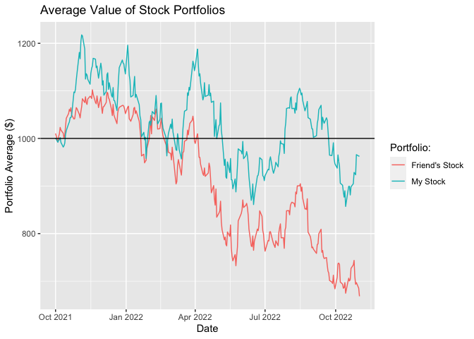
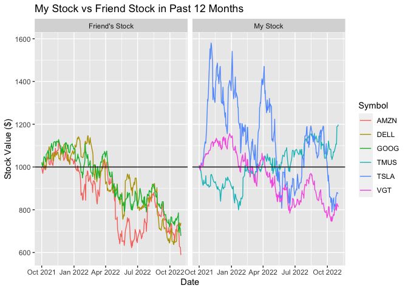

#### Libraries

```r
library(tidyquant) # for data sets and special functions
library(tidyverse) # for pipes, graphs, etc
library(lubridate) # for adding dates
```

### My Stocks:
TMobile, Tesla, Vanguard Information Technology

```r
(TMobile <- tq_get("TMUS", get = "stock.prices", from = "2021-10-01"))
```

```
## # A tibble: 274 × 8
##    symbol date        open  high   low close  volume adjusted
##    <chr>  <date>     <dbl> <dbl> <dbl> <dbl>   <dbl>    <dbl>
##  1 TMUS   2021-10-01  127.  128.  126.  127. 4126700     127.
##  2 TMUS   2021-10-04  127.  128.  125.  125. 4753000     125.
##  3 TMUS   2021-10-05  125.  126.  124.  125. 3051100     125.
##  4 TMUS   2021-10-06  124.  125.  123.  125. 4160400     125.
##  5 TMUS   2021-10-07  126.  126.  123.  123. 5431700     123.
##  6 TMUS   2021-10-08  124.  124.  121.  121. 5975800     121.
##  7 TMUS   2021-10-11  121.  122.  117.  117. 9884200     117.
##  8 TMUS   2021-10-12  118.  119.  116.  116. 7095400     116.
##  9 TMUS   2021-10-13  117.  118.  116   116. 6845800     116.
## 10 TMUS   2021-10-14  118.  120.  118.  119. 9698500     119.
## # … with 264 more rows
```

```r
(Tesla <- tq_get("TSLA", get = "stock.prices", from = "2021-10-01"))
```

```
## # A tibble: 274 × 8
##    symbol date        open  high   low close   volume adjusted
##    <chr>  <date>     <dbl> <dbl> <dbl> <dbl>    <dbl>    <dbl>
##  1 TSLA   2021-10-01  259.  260.  255.  258. 51094200     258.
##  2 TSLA   2021-10-04  266.  269.  259.  261. 91449900     261.
##  3 TSLA   2021-10-05  262.  266.  258.  260. 55297800     260.
##  4 TSLA   2021-10-06  259.  262.  258.  261. 43898400     261.
##  5 TSLA   2021-10-07  262.  268.  261.  265. 57587400     265.
##  6 TSLA   2021-10-08  265.  265.  260.  262. 50215800     262.
##  7 TSLA   2021-10-11  263.  267.  262.  264. 42600900     264.
##  8 TSLA   2021-10-12  267.  271.  266.  269. 66060000     269.
##  9 TSLA   2021-10-13  270.  272.  269.  270. 42360300     270.
## 10 TSLA   2021-10-14  272.  273.  271.  273. 36741600     273.
## # … with 264 more rows
```

```r
(VITIF <- tq_get("VGT", get = "stock.prices", from = "2021-10-01"))
```

```
## # A tibble: 274 × 8
##    symbol date        open  high   low close  volume adjusted
##    <chr>  <date>     <dbl> <dbl> <dbl> <dbl>   <dbl>    <dbl>
##  1 VGT    2021-10-01  403.  408.  399.  407.  687100     404.
##  2 VGT    2021-10-04  405.  405.  394.  397.  873700     394.
##  3 VGT    2021-10-05  398.  405   398.  403.  475800     400.
##  4 VGT    2021-10-06  399.  406.  397.  406. 1894200     402.
##  5 VGT    2021-10-07  409.  413.  409.  410. 1655900     407.
##  6 VGT    2021-10-08  412.  412.  407.  408.  249000     405.
##  7 VGT    2021-10-11  406.  411.  406.  406.  257100     403.
##  8 VGT    2021-10-12  408.  408   404.  405.  227300     402.
##  9 VGT    2021-10-13  407.  408.  405.  408.  608100     405.
## 10 VGT    2021-10-14  413.  417.  412.  417.  595700     414.
## # … with 264 more rows
```

### My Friend's Stocks:
Amazon, Google, Dell

```r
(Amazon <- tq_get("AMZN", get = "stock.prices", from = "2021-10-01"))
```

```
## # A tibble: 274 × 8
##    symbol date        open  high   low close   volume adjusted
##    <chr>  <date>     <dbl> <dbl> <dbl> <dbl>    <dbl>    <dbl>
##  1 AMZN   2021-10-01  164.  165.  163.  164. 56712000     164.
##  2 AMZN   2021-10-04  164.  164.  159.  159. 90462000     159.
##  3 AMZN   2021-10-05  160.  163.  160.  161. 65384000     161.
##  4 AMZN   2021-10-06  161.  163.  160.  163. 50660000     163.
##  5 AMZN   2021-10-07  165.  166.  164.  165. 48182000     165.
##  6 AMZN   2021-10-08  166.  166.  164.  164. 39964000     164.
##  7 AMZN   2021-10-11  164.  165.  162.  162. 40684000     162.
##  8 AMZN   2021-10-12  163.  163.  162.  162. 36392000     162.
##  9 AMZN   2021-10-13  163.  164.  163.  164. 48402000     164.
## 10 AMZN   2021-10-14  165.  166.  165.  165. 42190000     165.
## # … with 264 more rows
```

```r
(Google <- tq_get("GOOG", get = "stock.prices", from = "2021-10-01"))
```

```
## # A tibble: 274 × 8
##    symbol date        open  high   low close   volume adjusted
##    <chr>  <date>     <dbl> <dbl> <dbl> <dbl>    <dbl>    <dbl>
##  1 GOOG   2021-10-01  134.  137.  133.  136. 28388000     136.
##  2 GOOG   2021-10-04  136.  136.  131.  134. 31530000     134.
##  3 GOOG   2021-10-05  134   137.  134   136. 24126000     136.
##  4 GOOG   2021-10-06  135.  138.  134.  137. 19764000     137.
##  5 GOOG   2021-10-07  139.  140.  139.  139. 18250000     139.
##  6 GOOG   2021-10-08  140.  140.  139.  140. 18924000     140.
##  7 GOOG   2021-10-11  140.  141.  139.  139. 16584000     139.
##  8 GOOG   2021-10-12  140.  140.  136.  137. 22536000     137.
##  9 GOOG   2021-10-13  138.  139.  137.  138. 16380000     138.
## 10 GOOG   2021-10-14  140.  142.  139.  141. 21426000     141.
## # … with 264 more rows
```

```r
(Dell <- tq_get("DELL", get = "stock.prices", from = "2021-10-01"))
```

```
## # A tibble: 274 × 8
##    symbol date        open  high   low close  volume adjusted
##    <chr>  <date>     <dbl> <dbl> <dbl> <dbl>   <dbl>    <dbl>
##  1 DELL   2021-10-01  53.0  53.9  52.8  53.6 3768825     52.3
##  2 DELL   2021-10-04  53.8  54.0  52.9  53.3 4091805     52.1
##  3 DELL   2021-10-05  53.7  54.0  53.1  53.7 3353114     52.4
##  4 DELL   2021-10-06  53.0  53.6  52.7  53.5 3063674     52.2
##  5 DELL   2021-10-07  53.8  54.5  53.5  54.3 4105024     53.0
##  6 DELL   2021-10-08  54.5  54.7  52.8  53.2 5286654     52.0
##  7 DELL   2021-10-11  53.3  53.9  53.1  53.3 2772065     52.0
##  8 DELL   2021-10-12  53.3  53.5  52.4  52.6 3830579     51.3
##  9 DELL   2021-10-13  52.7  53.0  52.2  52.5 5377017     51.3
## 10 DELL   2021-10-14  52.8  53.9  52.8  53.7 3618679     52.4
## # … with 264 more rows
```


### Merge Data For Analysis

```r
merge1 <- tq_get(c("TMUS",'TSLA','VGT',"AMZN",'GOOG','DELL'), get = "stock.prices", from = "2021-10-01") %>%
  mutate(who = case_when(
    symbol == 'TMUS' | symbol == 'TSLA' | symbol == 'VGT' ~ "My Stock",
    symbol == 'AMZN' | symbol == 'GOOG' | symbol == 'DELL' ~ "Friend's Stock"
  )) %>%
  group_by(symbol) %>%
  mutate(starting = open[1]) %>%
  select(symbol,date,open,close,starting,who) %>%
  mutate(pchange = close/starting,money = pchange*1000)
head(merge1)
```

```
## # A tibble: 6 × 8
## # Groups:   symbol [1]
##   symbol date        open close starting who      pchange money
##   <chr>  <date>     <dbl> <dbl>    <dbl> <chr>      <dbl> <dbl>
## 1 TMUS   2021-10-01  127.  127.     127. My Stock   0.997  997.
## 2 TMUS   2021-10-04  127.  125.     127. My Stock   0.987  987.
## 3 TMUS   2021-10-05  125.  125.     127. My Stock   0.987  987.
## 4 TMUS   2021-10-06  124.  125.     127. My Stock   0.980  980.
## 5 TMUS   2021-10-07  126.  123.     127. My Stock   0.969  969.
## 6 TMUS   2021-10-08  124.  121.     127. My Stock   0.954  954.
```
This Dataset gives the percentage change and total value for each stock for each day.

### Merge Data For Analysis 2

```r
merge2 <- merge1 %>%
  group_by(who,date) %>%
  summarise(money = mean(money))
head(merge2)
```

```
## # A tibble: 6 × 3
## # Groups:   who [1]
##   who            date       money
##   <chr>          <date>     <dbl>
## 1 Friend's Stock 2021-10-01 1010.
## 2 Friend's Stock 2021-10-04  993.
## 3 Friend's Stock 2021-10-05 1004.
## 4 Friend's Stock 2021-10-06 1010.
## 5 Friend's Stock 2021-10-07 1023.
## 6 Friend's Stock 2021-10-08 1018.
```
This Data set shows the average portfolio value for each day for each group of stocks (My stock vs Friend Stock)


## Who is winning each day of the competetion?

```r
ggplot() +
  geom_line(merge2,mapping = aes(x=date,y=money,color=who)) +
  geom_hline(yintercept = 1000) +
  labs(x = "Date", y = "Portfolio Average ($)",title = "Average Value of Stock Portfolios",color = "Portfolio: ")
```

<!-- -->

The visualization shows the average value of me and my friends portfolio. As you can see, me and my friend both lost money in the long run. Neither of us broke even at $1000 average stock value. To answer the question, my friend was winning at the very begginning until between October 2021 - November 2021. I have been winning the competition ever since.

## Which stock is helping win the competition?

```r
ggplot() +
  geom_line(merge1,mapping = aes(x=date,y=money,color=symbol)) +
  geom_hline(yintercept = 1000) +
  facet_wrap(~who) +
  labs(x = "Date",y="Stock Value ($)",title = "My Stock vs Friend Stock in Past 12 Months",color = 'Symbol')
```

<!-- -->

This visualization looks at the difference between the individual performances of me and my friends stocks. Tesla is responsible for my lead the majoirty of the time. However, Tesla takes a large plunge and it is actually TMobile that saves me at the end. TMobile is the only one out of the 6 stocks to have a positive ROI. All 3 of my friends stocks had similar patterns. They started of promising at the begginning of the competition, but somewhere between Jan 2022 - April 2022 all of their stocks declined. I hold Tesla responsible for my winning for the majority of the competion and TMobile at the end of the competition.
