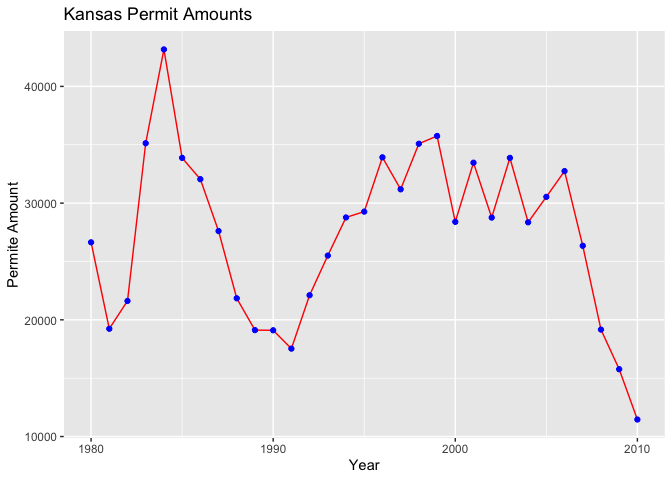

#### Libraries

```r
library(remotes)
library(devtools)
library(sf)
library(ggsflabel)
library(maps)
library(USAboundaries)
library(USAboundariesData)
library(tidyverse)
library(ggplot2)
library(readr)
```

#### Read in Permit and County Data

```r
permits <- read_csv("https://github.com/WJC-Data-Science/DTS350/raw/master/permits.csv")
head(permits)
```

```
## # A tibble: 6 × 8
##    ...1 state StateAbbr county countyname     variable     year value
##   <dbl> <dbl> <chr>      <dbl> <chr>          <chr>       <dbl> <dbl>
## 1     1     1 AL             1 Autauga County All Permits  2010   191
## 2     2     1 AL             1 Autauga County All Permits  2009   110
## 3     3     1 AL             1 Autauga County All Permits  2008   173
## 4     4     1 AL             1 Autauga County All Permits  2007   260
## 5     5     1 AL             1 Autauga County All Permits  2006   347
## 6     6     1 AL             1 Autauga County All Permits  2005   313
```

```r
county1 <- us_counties()
```

#### FIPS

```r
FIPS <- permits %>%
  mutate(state=as.character(state),stateFIPS=str_pad(state,2,pad="0")) %>%
  mutate(county=as.character(county),countyFIPS=str_pad(county,3,pad="0")) %>%
  mutate(geoid=paste0(stateFIPS,countyFIPS))
FIPS
```

```
## # A tibble: 327,422 × 11
##     ...1 state StateA…¹ county count…² varia…³  year value state…⁴ count…⁵ geoid
##    <dbl> <chr> <chr>    <chr>  <chr>   <chr>   <dbl> <dbl> <chr>   <chr>   <chr>
##  1     1 1     AL       1      Autaug… All Pe…  2010   191 01      001     01001
##  2     2 1     AL       1      Autaug… All Pe…  2009   110 01      001     01001
##  3     3 1     AL       1      Autaug… All Pe…  2008   173 01      001     01001
##  4     4 1     AL       1      Autaug… All Pe…  2007   260 01      001     01001
##  5     5 1     AL       1      Autaug… All Pe…  2006   347 01      001     01001
##  6     6 1     AL       1      Autaug… All Pe…  2005   313 01      001     01001
##  7     7 1     AL       1      Autaug… All Pe…  2004   367 01      001     01001
##  8     8 1     AL       1      Autaug… All Pe…  2003   283 01      001     01001
##  9     9 1     AL       1      Autaug… All Pe…  2002   276 01      001     01001
## 10    10 1     AL       1      Autaug… All Pe…  2001   400 01      001     01001
## # … with 327,412 more rows, and abbreviated variable names ¹​StateAbbr,
## #   ²​countyname, ³​variable, ⁴​stateFIPS, ⁵​countyFIPS
```

#### Merge Data

```r
merge1 <- merge(FIPS,county1,by="geoid") %>%
  group_by(state_name,year) %>%
  summarise(across(value,sum)) %>%
  ungroup() %>%
  group_by(year) %>%
  mutate(country = mean(value))
merge1
```

```
## # A tibble: 1,580 × 4
## # Groups:   year [31]
##    state_name  year value country
##    <chr>      <dbl> <dbl>   <dbl>
##  1 Alabama     1980 38954  56321.
##  2 Alabama     1981 24592  47186.
##  3 Alabama     1982 21454  48468.
##  4 Alabama     1983 43537  77318.
##  5 Alabama     1984 37676  80647.
##  6 Alabama     1985 41725  83034.
##  7 Alabama     1986 46008  82859.
##  8 Alabama     1987 32894  70175.
##  9 Alabama     1988 28649  66155.
## 10 Alabama     1989 27634  60504.
## # … with 1,570 more rows
```

#### US PLOT

```r
US <- ggplot(data = merge1,mapping=aes(x=year,y=value,color = state_name)) +
  geom_line() +
  geom_line(mapping = aes(x=year,y=country,size = 3)) +
  theme(legend.position = "none")
US
```

<!-- -->

#### KS and MO Data

```r
KS <- merge1 %>%
  filter(state_name == 'Kansas')
KS
```

```
## # A tibble: 31 × 4
## # Groups:   year [31]
##    state_name  year value country
##    <chr>      <dbl> <dbl>   <dbl>
##  1 Kansas      1980 26642  56321.
##  2 Kansas      1981 19235  47186.
##  3 Kansas      1982 21618  48468.
##  4 Kansas      1983 35131  77318.
##  5 Kansas      1984 43169  80647.
##  6 Kansas      1985 33875  83034.
##  7 Kansas      1986 32049  82859.
##  8 Kansas      1987 27609  70175.
##  9 Kansas      1988 21844  66155.
## 10 Kansas      1989 19117  60504.
## # … with 21 more rows
```

```r
MO <- merge1 %>%
  filter(state_name == 'Missouri')
MO
```

```
## # A tibble: 31 × 4
## # Groups:   year [31]
##    state_name  year value country
##    <chr>      <dbl> <dbl>   <dbl>
##  1 Missouri    1980 32595  56321.
##  2 Missouri    1981 23359  47186.
##  3 Missouri    1982 28797  48468.
##  4 Missouri    1983 43854  77318.
##  5 Missouri    1984 61985  80647.
##  6 Missouri    1985 68004  83034.
##  7 Missouri    1986 82182  82859.
##  8 Missouri    1987 69215  70175.
##  9 Missouri    1988 54340  66155.
## 10 Missouri    1989 40081  60504.
## # … with 21 more rows
```

#### KS PLOT

```r
KS1 <- ggplot(data = KS,mapping = aes(x = year,y = value)) +
  geom_line(color='red') +
  geom_point(color="blue") +
  labs(x = "Year", y = "Permite Amount",title = 'Kansas Permit Amounts')
KS1
```

<!-- -->

#### MO PLOT

```r
MO1 <- ggplot(data = MO,mapping = aes(x = year,y = value)) +
  geom_line(color='gold') +
  geom_point(color="black") +
  labs(x = "Year", y = "Permite Amount",title = 'Missouri Permit Amounts')
MO1
```

<!-- -->

#### KS vs MO PLOT

```r
KvM <- ggplot() +
  geom_line(data = MO,mapping = aes(x = year,y = value),color='gold') +
  geom_point(data = MO,mapping = aes(x = year,y = value),color="black") +
  geom_line(data = KS,mapping = aes(x = year,y = value),color='red') +
  geom_point(data = KS,mapping = aes(x = year,y = value),color="blue") +
  labs(x = "Year", y = "Permite Amount",title = 'Kansas vs Missouri Permit Amounts')
KvM
```

<!-- -->

For all of my graphics I chose to use line graphs because they were the best choice for 2 numeric variables and the amount of data. To start things off I made a graph showing all the states over time with a average line. Most of the states showed a decline in the mid 1980's until the early 1990's. The numbers inlined steadily until just before the 2008 crash. I compared Kansas and Missouri because they are the two states I have lived in throughout my life and saw that they both have very similar line graphs in terms of trends. When I compared them by merging the graphs together, Missouri seemed to have larger numbers. However, I confirmed that the trends were the same.
