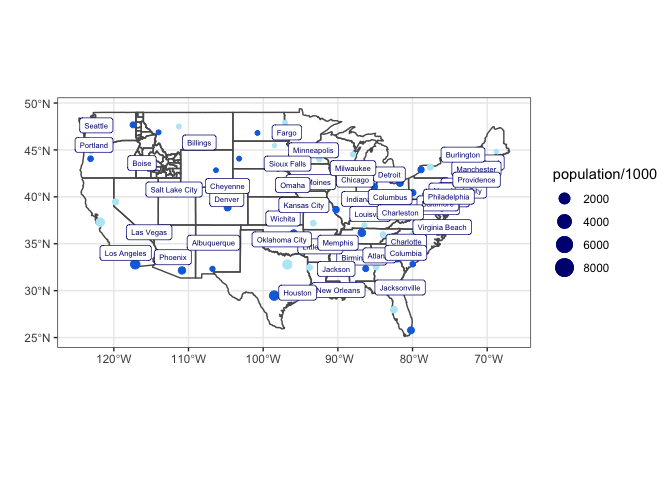

#### Libraries

```r
library(remotes)
library(devtools)
library(sf)
library(ggsflabel)
library(maps)
library(USAboundaries)
library(USAboundariesData)
library(tidyverse)
library(ggplot2)
```

### Data for Map

```r
cities <- us_cities() 
states <- us_states()
county <- us_counties()
idaho <- us_counties(states = "ID")
map1 <- sf::st_as_sf(maps::map("state", plot = FALSE, fill = TRUE))
head(map1)
```

```
## Simple feature collection with 6 features and 1 field
## Geometry type: MULTIPOLYGON
## Dimension:     XY
## Bounding box:  xmin: -124.3834 ymin: 30.24071 xmax: -71.78015 ymax: 42.04937
## Geodetic CRS:  WGS 84
##            ID                           geom
## 1     alabama MULTIPOLYGON (((-87.46201 3...
## 2     arizona MULTIPOLYGON (((-114.6374 3...
## 3    arkansas MULTIPOLYGON (((-94.05103 3...
## 4  california MULTIPOLYGON (((-120.006 42...
## 5    colorado MULTIPOLYGON (((-102.0552 4...
## 6 connecticut MULTIPOLYGON (((-73.49902 4...
```

```r
cities1 <- cities %>%
  filter(state_name != 'Alaska', state_name != 'Hawaii') %>%
  group_by(state_name) %>%
  arrange(desc(population)) %>%
  slice(1:3)
cities1
```

```
## Simple feature collection with 145 features and 12 fields
## Geometry type: POINT
## Dimension:     XY
## Bounding box:  xmin: -123.1162 ymin: 25.77516 xmax: -68.7924 ymax: 47.91279
## Geodetic CRS:  WGS 84
## # A tibble: 145 × 13
## # Groups:   state_name [49]
##    city   state…¹ state…² county count…³ stplf…⁴ name_…⁵ city_…⁶ popul…⁷ place…⁸
##    <chr>  <chr>   <chr>   <chr>  <chr>   <chr>   <chr>   <chr>   <chr>   <chr>  
##  1 Birmi… Alabama AL      JEFFE… Jeffer… 0107000 Birmin… US Cen… US Cen… Incorp…
##  2 Montg… Alabama AL      MONTG… Montgo… 0151000 Montgo… US Cen… US Cen… Incorp…
##  3 Mobile Alabama AL      MOBILE Mobile  0150000 Mobile… US Cen… US Cen… Incorp…
##  4 Phoen… Arizona AZ      MARIC… Marico… 0455000 Phoeni… US Cen… US Cen… Incorp…
##  5 Tucson Arizona AZ      PIMA   Pima    0477000 Tucson… US Cen… US Cen… Incorp…
##  6 Mesa   Arizona AZ      MARIC… Marico… 0446000 Mesa c… US Cen… US Cen… Incorp…
##  7 Littl… Arkans… AR      PULAS… Pulaski 0541000 Little… US Cen… US Cen… Incorp…
##  8 Fort … Arkans… AR      SEBAS… Sebast… 0524550 Fort S… US Cen… US Cen… Incorp…
##  9 Fayet… Arkans… AR      WASHI… Washin… 0523290 Fayett… US Cen… US Cen… Incorp…
## 10 Los A… Califo… CA      LOS A… Los An… 0644000 Los An… US Cen… US Cen… Incorp…
## # … with 135 more rows, 3 more variables: year <int>, population <int>,
## #   geometry <POINT [°]>, and abbreviated variable names ¹​state_name,
## #   ²​state_abbr, ³​county_name, ⁴​stplfips_2010, ⁵​name_2010, ⁶​city_source,
## #   ⁷​population_source, ⁸​place_type
```

### City Data

```r
big <- cities1 %>%
  slice(1:1)
med <- cities1 %>%
  slice(2:2)
sml <- cities1 %>%
  slice(3:3)
```

### Plot

```r
ggplot() +
  geom_sf(data = map1, fill = NA) +
  geom_sf(data = idaho, fill = NA) +
  geom_sf(data = sml, aes(size = population/1000), color = "#B7E9F7") +
  geom_sf(data = med, aes(size = population/1000), color = "#0C71E0") +
  geom_sf(data = big, aes(size = population/1000), color = "#000080") +
  geom_sf_label(data = big, aes(label = city), color = '#000080', size = 2)+
  theme_bw() +
  labs(x="",y="")
```

<!-- -->

