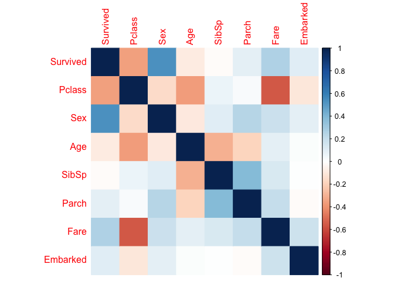
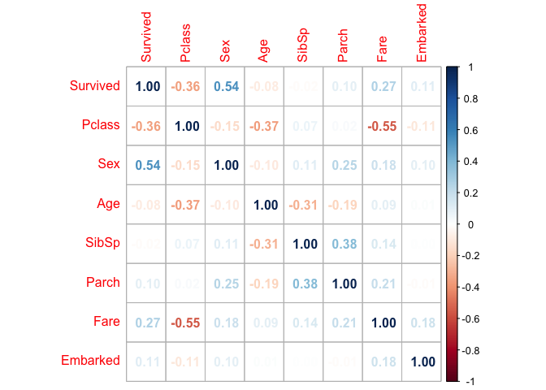
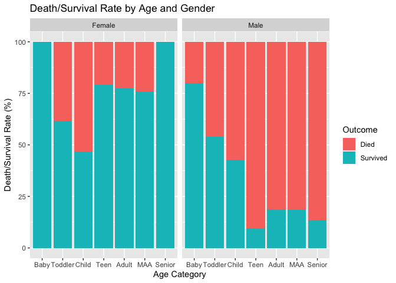
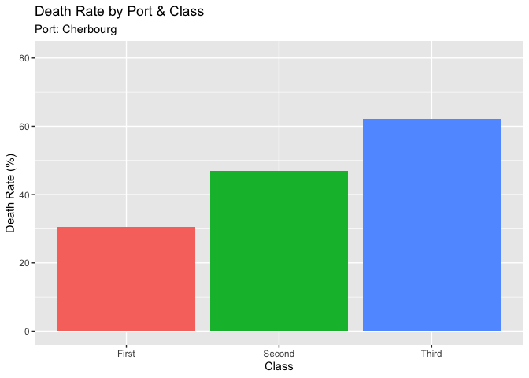
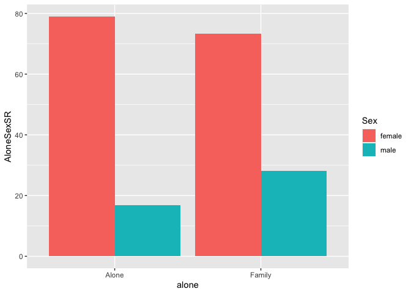
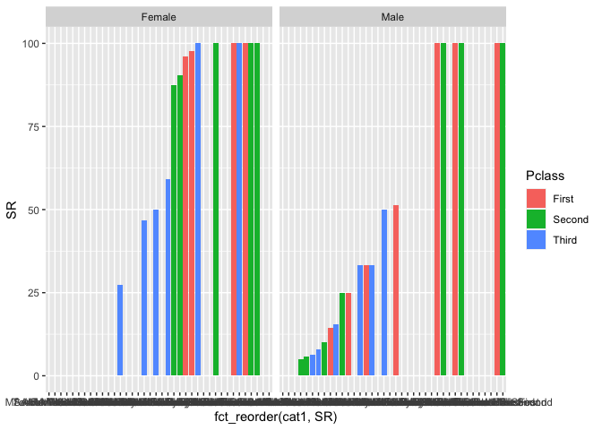
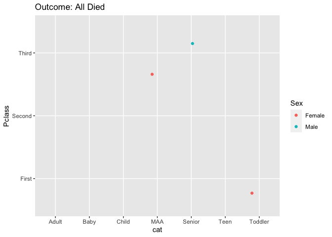

##### Libraries


##### Download Data


## Introduction
I chose to do my final project on the Titanic Data Set. I chose this particular dataset because of it's popularity among young data scientists. It is one of the easiest datasets to begin with for learning to build a predictive model. I wanted to get familar with it so that I can do this myself in the near future, but also thought it would be a fun topic to do the project on.

My Question is:
What variables are most important for indicating whether or not someone survived the Titanic disaster?


# Exploring Relationships
### Make cateogorical Data Numeric

```
## # A tibble: 6 × 8
##   Survived Pclass   Sex   Age SibSp Parch  Fare Embarked
##      <dbl>  <dbl> <dbl> <dbl> <dbl> <dbl> <dbl>    <dbl>
## 1        0      3     1    22     1     0  7.25        1
## 2        1      1     2    38     1     0 71.3         2
## 3        1      3     2    26     0     0  7.92        1
## 4        1      1     2    35     1     0 53.1         1
## 5        0      3     1    35     0     0  8.05        1
## 6        0      1     1    54     0     0 51.9         1
```
## Corrplot
<!-- --><!-- -->

#### Some correlations to note are:
-Class & Fare Price: Class is cateogorical and is split into 3 categories of (1,2,3). Fare is numeric. There is a moderate negative correlation (-0.55) between the two variables. This indicates that as the price of the fare increases, class decreases. The assumption that higher fares are associated with 1st class (1) can already be made, but it is nice knowing that it is statistically correct as well.

-Age & Class: Low negative correlation (-0.37). Indicates as Age increases, class decreases (closer to 1st class). This assumption can be made that older people have more money than younger passengers.


#### The corrplot shows a few relationships when it comes to the 'Survived' variable:
-Class: 'Class' has a low negative correlation (-0.36). Class gets worse (economically) as it increases. (1st class is 1, 2nd is 2, and 3rd is 3). Therefore, wealthier people are more likely to be part of first class. 'Survived' indicates that the passenger died (0) or survived (1), meaning the higher the variable, the better chances of survival. Therefore, the correlation indicates that as survival increases, class decreases. This indicates that wealthier people (people of 1st class), or more likely to survive

-Sex: 'Sex' has a moderate positive correlation (0.54). As sex increases (man (1) to woman (2)), so does survival (death (1) to survival (2)). This indicates that women were more likely to survive.


# Summary of Passengers


```{=html}
<div id="htmlwidget-c98c8b6e3d49e3f12a20" style="width:672px;height:480px;" class="plotly html-widget"></div>
<script type="application/json" data-for="htmlwidget-c98c8b6e3d49e3f12a20">{"x":{"data":[{"orientation":"v","width":[0.45,0.45,0.45,0.45,0.449999999999999,0.449999999999999,0.449999999999999],"base":[0,0,0,0,0,0,0],"x":[0.775,1.775,2.775,3.775,4.775,5.775,6.775],"y":[4,13,15,43,132,50,4],"text":["Count:  4","Count:  13","Count:  15","Count:  43","Count:  132","Count:  50","Count:  4"],"type":"bar","textposition":"none","marker":{"autocolorscale":false,"color":"rgba(248,118,109,1)","line":{"width":1.88976377952756,"color":"transparent"}},"name":"Female","legendgroup":"Female","showlegend":true,"xaxis":"x","yaxis":"y","hoverinfo":"text","frame":null},{"orientation":"v","width":[0.45,0.45,0.45,0.45,0.449999999999999,0.449999999999999,0.449999999999999],"base":[0,0,0,0,0,0,0],"x":[1.225,2.225,3.225,4.225,5.225,6.225,7.225],"y":[10,13,14,52,255,87,22],"text":["Count:  10","Count:  13","Count:  14","Count:  52","Count:  255","Count:  87","Count:  22"],"type":"bar","textposition":"none","marker":{"autocolorscale":false,"color":"rgba(0,191,196,1)","line":{"width":1.88976377952756,"color":"transparent"}},"name":"Male","legendgroup":"Male","showlegend":true,"xaxis":"x","yaxis":"y","hoverinfo":"text","frame":null}],"layout":{"margin":{"t":26.2283105022831,"r":7.30593607305936,"b":40.1826484018265,"l":43.1050228310502},"plot_bgcolor":"rgba(235,235,235,1)","paper_bgcolor":"rgba(255,255,255,1)","font":{"color":"rgba(0,0,0,1)","family":"","size":14.6118721461187},"xaxis":{"domain":[0,1],"automargin":true,"type":"linear","autorange":false,"range":[0.4,7.6],"tickmode":"array","ticktext":["Baby","Toddler","Child","Teen","Adult","MAA","Senior"],"tickvals":[1,2,3,4,5,6,7],"categoryorder":"array","categoryarray":["Baby","Toddler","Child","Teen","Adult","MAA","Senior"],"nticks":null,"ticks":"outside","tickcolor":"rgba(51,51,51,1)","ticklen":3.65296803652968,"tickwidth":0.66417600664176,"showticklabels":true,"tickfont":{"color":"rgba(77,77,77,1)","family":"","size":11.689497716895},"tickangle":-0,"showline":false,"linecolor":null,"linewidth":0,"showgrid":true,"gridcolor":"rgba(255,255,255,1)","gridwidth":0.66417600664176,"zeroline":false,"anchor":"y","title":{"text":"Age Category","font":{"color":"rgba(0,0,0,1)","family":"","size":14.6118721461187}},"hoverformat":".2f"},"yaxis":{"domain":[0,1],"automargin":true,"type":"linear","autorange":false,"range":[-12.75,267.75],"tickmode":"array","ticktext":["0","100","200"],"tickvals":[0,100,200],"categoryorder":"array","categoryarray":["0","100","200"],"nticks":null,"ticks":"outside","tickcolor":"rgba(51,51,51,1)","ticklen":3.65296803652968,"tickwidth":0.66417600664176,"showticklabels":true,"tickfont":{"color":"rgba(77,77,77,1)","family":"","size":11.689497716895},"tickangle":-0,"showline":false,"linecolor":null,"linewidth":0,"showgrid":true,"gridcolor":"rgba(255,255,255,1)","gridwidth":0.66417600664176,"zeroline":false,"anchor":"x","title":{"text":"Number of Passengers","font":{"color":"rgba(0,0,0,1)","family":"","size":14.6118721461187}},"hoverformat":".2f"},"shapes":[{"type":"rect","fillcolor":null,"line":{"color":null,"width":0,"linetype":[]},"yref":"paper","xref":"paper","x0":0,"x1":1,"y0":0,"y1":1}],"showlegend":true,"legend":{"bgcolor":"rgba(255,255,255,1)","bordercolor":"transparent","borderwidth":1.88976377952756,"font":{"color":"rgba(0,0,0,1)","family":"","size":11.689497716895},"title":{"text":"Sex","font":{"color":"rgba(0,0,0,1)","family":"","size":14.6118721461187}}},"hovermode":"closest","barmode":"relative"},"config":{"doubleClick":"reset","modeBarButtonsToAdd":["hoverclosest","hovercompare"],"showSendToCloud":false},"source":"A","attrs":{"fb663a22a80d":{"x":{},"fill":{},"text":{},"type":"bar"}},"cur_data":"fb663a22a80d","visdat":{"fb663a22a80d":["function (y) ","x"]},"highlight":{"on":"plotly_click","persistent":false,"dynamic":false,"selectize":false,"opacityDim":0.2,"selected":{"opacity":1},"debounce":0},"shinyEvents":["plotly_hover","plotly_click","plotly_selected","plotly_relayout","plotly_brushed","plotly_brushing","plotly_clickannotation","plotly_doubleclick","plotly_deselect","plotly_afterplot","plotly_sunburstclick"],"base_url":"https://plot.ly"},"evals":[],"jsHooks":[]}</script>
```
Age Categories:
  -Baby (0-2)
  -Toddler (2-5)
  -Child (5-13)
  -Teen (13-20)
  -Adult (20-40)
  -MAA (40-60)
  -Senior (60+)
This plot shows that mostly Adults (Ages 20-40) were on board. Middle-Aged Adults the second most common age category. There appears to be an upwards trend until Adults, and a downwards trend following Adults. There are also more male passengers than female passengers in just about every age category.


```{=html}
<div id="htmlwidget-288b4e07fa5fc588e33d" style="width:672px;height:480px;" class="leaflet html-widget"></div>
<script type="application/json" data-for="htmlwidget-288b4e07fa5fc588e33d">{"x":{"options":{"crs":{"crsClass":"L.CRS.EPSG3857","code":null,"proj4def":null,"projectedBounds":null,"options":{}}},"calls":[{"method":"addTiles","args":["https://{s}.tile.openstreetmap.org/{z}/{x}/{y}.png",null,null,{"minZoom":0,"maxZoom":18,"tileSize":256,"subdomains":"abc","errorTileUrl":"","tms":false,"noWrap":false,"zoomOffset":0,"zoomReverse":false,"opacity":1,"zIndex":1,"detectRetina":false,"attribution":"&copy; <a href=\"https://openstreetmap.org/copyright/\">OpenStreetMap<\/a>,  <a href=\"https://opendatacommons.org/licenses/odbl/\">ODbL<\/a>"}]},{"method":"addCircleMarkers","args":[[49.63,49.63,49.63,49.63,49.63,49.63,49.63,49.63,49.63,49.63,49.63,49.63,49.63,49.63,49.63,49.63,49.63,49.63,49.63,49.63,49.63,49.63,49.63,49.63,49.63,49.63,49.63,49.63,49.63,49.63,49.63,49.63,49.63,49.63,49.63,49.63,49.63,49.63,49.63,49.63,49.63,49.63,49.63,49.63,49.63,49.63,49.63,49.63,49.63,49.63,49.63,49.63,49.63,49.63,49.63,49.63,49.63,49.63,49.63,49.63,49.63,49.63,49.63,49.63,49.63,49.63,49.63,49.63,49.63,49.63,49.63,49.63,49.63,49.63,49.63,49.63,49.63,49.63,49.63,49.63,49.63,49.63,49.63,49.63,49.63,49.63,49.63,49.63,49.63,49.63,49.63,49.63,49.63,49.63,49.63,49.63,49.63,49.63,49.63,49.63,49.63,49.63,49.63,49.63,49.63,49.63,49.63,49.63,49.63,49.63,49.63,49.63,49.63,49.63,49.63,49.63,49.63,49.63,49.63,49.63,49.63,49.63,49.63,49.63,49.63,49.63,49.63,49.63,49.63,49.63,49.63,49.63,49.63,49.63,49.63,49.63,49.63,49.63,49.63,49.63,49.63,49.63,49.63,49.63,49.63,49.63,49.63,49.63,49.63,49.63,49.63,49.63,49.63,49.63,49.63,49.63,49.63,49.63,49.63,49.63,49.63,49.63,49.63,49.63,49.63,49.63,49.63,49.63,51.85,51.85,51.85,51.85,51.85,51.85,51.85,51.85,51.85,51.85,51.85,51.85,51.85,51.85,51.85,51.85,51.85,51.85,51.85,51.85,51.85,51.85,51.85,51.85,51.85,51.85,51.85,51.85,51.85,51.85,51.85,51.85,51.85,51.85,51.85,51.85,51.85,51.85,51.85,51.85,51.85,51.85,51.85,51.85,51.85,51.85,51.85,51.85,51.85,51.85,51.85,51.85,51.85,51.85,51.85,51.85,51.85,51.85,51.85,51.85,51.85,51.85,51.85,51.85,51.85,51.85,51.85,51.85,51.85,51.85,51.85,51.85,51.85,51.85,51.85,51.85,51.85,50.91,50.91,50.91,50.91,50.91,50.91,50.91,50.91,50.91,50.91,50.91,50.91,50.91,50.91,50.91,50.91,50.91,50.91,50.91,50.91,50.91,50.91,50.91,50.91,50.91,50.91,50.91,50.91,50.91,50.91,50.91,50.91,50.91,50.91,50.91,50.91,50.91,50.91,50.91,50.91,50.91,50.91,50.91,50.91,50.91,50.91,50.91,50.91,50.91,50.91,50.91,50.91,50.91,50.91,50.91,50.91,50.91,50.91,50.91,50.91,50.91,50.91,50.91,50.91,50.91,50.91,50.91,50.91,50.91,50.91,50.91,50.91,50.91,50.91,50.91,50.91,50.91,50.91,50.91,50.91,50.91,50.91,50.91,50.91,50.91,50.91,50.91,50.91,50.91,50.91,50.91,50.91,50.91,50.91,50.91,50.91,50.91,50.91,50.91,50.91,50.91,50.91,50.91,50.91,50.91,50.91,50.91,50.91,50.91,50.91,50.91,50.91,50.91,50.91,50.91,50.91,50.91,50.91,50.91,50.91,50.91,50.91,50.91,50.91,50.91,50.91,50.91,50.91,50.91,50.91,50.91,50.91,50.91,50.91,50.91,50.91,50.91,50.91,50.91,50.91,50.91,50.91,50.91,50.91,50.91,50.91,50.91,50.91,50.91,50.91,50.91,50.91,50.91,50.91,50.91,50.91,50.91,50.91,50.91,50.91,50.91,50.91,50.91,50.91,50.91,50.91,50.91,50.91,50.91,50.91,50.91,50.91,50.91,50.91,50.91,50.91,50.91,50.91,50.91,50.91,50.91,50.91,50.91,50.91,50.91,50.91,50.91,50.91,50.91,50.91,50.91,50.91,50.91,50.91,50.91,50.91,50.91,50.91,50.91,50.91,50.91,50.91,50.91,50.91,50.91,50.91,50.91,50.91,50.91,50.91,50.91,50.91,50.91,50.91,50.91,50.91,50.91,50.91,50.91,50.91,50.91,50.91,50.91,50.91,50.91,50.91,50.91,50.91,50.91,50.91,50.91,50.91,50.91,50.91,50.91,50.91,50.91,50.91,50.91,50.91,50.91,50.91,50.91,50.91,50.91,50.91,50.91,50.91,50.91,50.91,50.91,50.91,50.91,50.91,50.91,50.91,50.91,50.91,50.91,50.91,50.91,50.91,50.91,50.91,50.91,50.91,50.91,50.91,50.91,50.91,50.91,50.91,50.91,50.91,50.91,50.91,50.91,50.91,50.91,50.91,50.91,50.91,50.91,50.91,50.91,50.91,50.91,50.91,50.91,50.91,50.91,50.91,50.91,50.91,50.91,50.91,50.91,50.91,50.91,50.91,50.91,50.91,50.91,50.91,50.91,50.91,50.91,50.91,50.91,50.91,50.91,50.91,50.91,50.91,50.91,50.91,50.91,50.91,50.91,50.91,50.91,50.91,50.91,50.91,50.91,50.91,50.91,50.91,50.91,50.91,50.91,50.91,50.91,50.91,50.91,50.91,50.91,50.91,50.91,50.91,50.91,50.91,50.91,50.91,50.91,50.91,50.91,50.91,50.91,50.91,50.91,50.91,50.91,50.91,50.91,50.91,50.91,50.91,50.91,50.91,50.91,50.91,50.91,50.91,50.91,50.91,50.91,50.91,50.91,50.91,50.91,50.91,50.91,50.91,50.91,50.91,50.91,50.91,50.91,50.91,50.91,50.91,50.91,50.91,50.91,50.91,50.91,50.91,50.91,50.91,50.91,50.91,50.91,50.91,50.91,50.91,50.91,50.91,50.91,50.91,50.91,50.91,50.91,50.91,50.91,50.91,50.91,50.91,50.91,50.91,50.91,50.91,50.91,50.91,50.91,50.91,50.91,50.91,50.91,50.91,50.91,50.91,50.91,50.91,50.91,50.91,50.91,50.91,50.91,50.91,50.91,50.91,50.91,50.91,50.91,50.91,50.91,50.91,50.91,50.91,50.91,50.91,50.91,50.91,50.91,50.91,50.91,50.91,50.91,50.91,50.91,50.91,50.91,50.91,50.91,50.91,50.91,50.91,50.91,50.91,50.91,50.91,50.91,50.91,50.91,50.91,50.91,50.91,50.91,50.91,50.91,50.91,50.91,50.91,50.91,50.91,50.91,50.91,50.91,50.91,50.91,50.91,50.91,50.91,50.91,50.91,50.91,50.91,50.91,50.91,50.91,50.91,50.91,50.91,50.91,50.91,50.91,50.91,50.91,50.91,50.91,50.91,50.91,50.91,50.91,50.91,50.91,50.91,50.91,50.91,50.91,50.91,50.91,50.91,50.91,50.91,50.91,50.91,50.91,50.91,50.91,50.91,50.91,50.91,50.91,50.91,50.91,50.91,50.91,50.91,50.91,50.91,50.91,50.91,50.91,50.91,50.91,50.91,50.91,50.91,50.91,50.91,50.91,50.91,50.91,50.91,50.91,50.91,50.91,50.91,50.91,50.91,50.91,50.91,50.91,50.91,50.91,50.91,50.91,50.91,50.91,50.91,50.91,50.91,50.91,50.91,50.91,50.91,50.91,50.91,50.91,50.91,50.91,50.91,50.91,50.91,50.91,50.91,50.91,50.91,50.91,50.91,50.91,50.91,50.91,50.91,50.91,50.91,50.91,50.91,50.91,50.91,50.91,50.91,50.91,50.91,50.91,50.91,50.91,50.91,50.91,50.91,50.91,50.91,50.91,50.91,50.91,50.91,50.91,50.91,50.91,50.91,50.91,50.91,50.91,50.91,50.91,50.91,50.91,50.91,50.91,50.91,50.91,50.91,50.91,50.91,50.91,50.91,50.91,50.91,50.91,50.91,50.91,50.91,50.91,50.91,50.91,50.91,50.91,50.91,50.91,50.91,50.91,50.91],[-1.62,-1.62,-1.62,-1.62,-1.62,-1.62,-1.62,-1.62,-1.62,-1.62,-1.62,-1.62,-1.62,-1.62,-1.62,-1.62,-1.62,-1.62,-1.62,-1.62,-1.62,-1.62,-1.62,-1.62,-1.62,-1.62,-1.62,-1.62,-1.62,-1.62,-1.62,-1.62,-1.62,-1.62,-1.62,-1.62,-1.62,-1.62,-1.62,-1.62,-1.62,-1.62,-1.62,-1.62,-1.62,-1.62,-1.62,-1.62,-1.62,-1.62,-1.62,-1.62,-1.62,-1.62,-1.62,-1.62,-1.62,-1.62,-1.62,-1.62,-1.62,-1.62,-1.62,-1.62,-1.62,-1.62,-1.62,-1.62,-1.62,-1.62,-1.62,-1.62,-1.62,-1.62,-1.62,-1.62,-1.62,-1.62,-1.62,-1.62,-1.62,-1.62,-1.62,-1.62,-1.62,-1.62,-1.62,-1.62,-1.62,-1.62,-1.62,-1.62,-1.62,-1.62,-1.62,-1.62,-1.62,-1.62,-1.62,-1.62,-1.62,-1.62,-1.62,-1.62,-1.62,-1.62,-1.62,-1.62,-1.62,-1.62,-1.62,-1.62,-1.62,-1.62,-1.62,-1.62,-1.62,-1.62,-1.62,-1.62,-1.62,-1.62,-1.62,-1.62,-1.62,-1.62,-1.62,-1.62,-1.62,-1.62,-1.62,-1.62,-1.62,-1.62,-1.62,-1.62,-1.62,-1.62,-1.62,-1.62,-1.62,-1.62,-1.62,-1.62,-1.62,-1.62,-1.62,-1.62,-1.62,-1.62,-1.62,-1.62,-1.62,-1.62,-1.62,-1.62,-1.62,-1.62,-1.62,-1.62,-1.62,-1.62,-1.62,-1.62,-1.62,-1.62,-1.62,-1.62,-8.29,-8.29,-8.29,-8.29,-8.29,-8.29,-8.29,-8.29,-8.29,-8.29,-8.29,-8.29,-8.29,-8.29,-8.29,-8.29,-8.29,-8.29,-8.29,-8.29,-8.29,-8.29,-8.29,-8.29,-8.29,-8.29,-8.29,-8.29,-8.29,-8.29,-8.29,-8.29,-8.29,-8.29,-8.29,-8.29,-8.29,-8.29,-8.29,-8.29,-8.29,-8.29,-8.29,-8.29,-8.29,-8.29,-8.29,-8.29,-8.29,-8.29,-8.29,-8.29,-8.29,-8.29,-8.29,-8.29,-8.29,-8.29,-8.29,-8.29,-8.29,-8.29,-8.29,-8.29,-8.29,-8.29,-8.29,-8.29,-8.29,-8.29,-8.29,-8.29,-8.29,-8.29,-8.29,-8.29,-8.29,-1.4,-1.4,-1.4,-1.4,-1.4,-1.4,-1.4,-1.4,-1.4,-1.4,-1.4,-1.4,-1.4,-1.4,-1.4,-1.4,-1.4,-1.4,-1.4,-1.4,-1.4,-1.4,-1.4,-1.4,-1.4,-1.4,-1.4,-1.4,-1.4,-1.4,-1.4,-1.4,-1.4,-1.4,-1.4,-1.4,-1.4,-1.4,-1.4,-1.4,-1.4,-1.4,-1.4,-1.4,-1.4,-1.4,-1.4,-1.4,-1.4,-1.4,-1.4,-1.4,-1.4,-1.4,-1.4,-1.4,-1.4,-1.4,-1.4,-1.4,-1.4,-1.4,-1.4,-1.4,-1.4,-1.4,-1.4,-1.4,-1.4,-1.4,-1.4,-1.4,-1.4,-1.4,-1.4,-1.4,-1.4,-1.4,-1.4,-1.4,-1.4,-1.4,-1.4,-1.4,-1.4,-1.4,-1.4,-1.4,-1.4,-1.4,-1.4,-1.4,-1.4,-1.4,-1.4,-1.4,-1.4,-1.4,-1.4,-1.4,-1.4,-1.4,-1.4,-1.4,-1.4,-1.4,-1.4,-1.4,-1.4,-1.4,-1.4,-1.4,-1.4,-1.4,-1.4,-1.4,-1.4,-1.4,-1.4,-1.4,-1.4,-1.4,-1.4,-1.4,-1.4,-1.4,-1.4,-1.4,-1.4,-1.4,-1.4,-1.4,-1.4,-1.4,-1.4,-1.4,-1.4,-1.4,-1.4,-1.4,-1.4,-1.4,-1.4,-1.4,-1.4,-1.4,-1.4,-1.4,-1.4,-1.4,-1.4,-1.4,-1.4,-1.4,-1.4,-1.4,-1.4,-1.4,-1.4,-1.4,-1.4,-1.4,-1.4,-1.4,-1.4,-1.4,-1.4,-1.4,-1.4,-1.4,-1.4,-1.4,-1.4,-1.4,-1.4,-1.4,-1.4,-1.4,-1.4,-1.4,-1.4,-1.4,-1.4,-1.4,-1.4,-1.4,-1.4,-1.4,-1.4,-1.4,-1.4,-1.4,-1.4,-1.4,-1.4,-1.4,-1.4,-1.4,-1.4,-1.4,-1.4,-1.4,-1.4,-1.4,-1.4,-1.4,-1.4,-1.4,-1.4,-1.4,-1.4,-1.4,-1.4,-1.4,-1.4,-1.4,-1.4,-1.4,-1.4,-1.4,-1.4,-1.4,-1.4,-1.4,-1.4,-1.4,-1.4,-1.4,-1.4,-1.4,-1.4,-1.4,-1.4,-1.4,-1.4,-1.4,-1.4,-1.4,-1.4,-1.4,-1.4,-1.4,-1.4,-1.4,-1.4,-1.4,-1.4,-1.4,-1.4,-1.4,-1.4,-1.4,-1.4,-1.4,-1.4,-1.4,-1.4,-1.4,-1.4,-1.4,-1.4,-1.4,-1.4,-1.4,-1.4,-1.4,-1.4,-1.4,-1.4,-1.4,-1.4,-1.4,-1.4,-1.4,-1.4,-1.4,-1.4,-1.4,-1.4,-1.4,-1.4,-1.4,-1.4,-1.4,-1.4,-1.4,-1.4,-1.4,-1.4,-1.4,-1.4,-1.4,-1.4,-1.4,-1.4,-1.4,-1.4,-1.4,-1.4,-1.4,-1.4,-1.4,-1.4,-1.4,-1.4,-1.4,-1.4,-1.4,-1.4,-1.4,-1.4,-1.4,-1.4,-1.4,-1.4,-1.4,-1.4,-1.4,-1.4,-1.4,-1.4,-1.4,-1.4,-1.4,-1.4,-1.4,-1.4,-1.4,-1.4,-1.4,-1.4,-1.4,-1.4,-1.4,-1.4,-1.4,-1.4,-1.4,-1.4,-1.4,-1.4,-1.4,-1.4,-1.4,-1.4,-1.4,-1.4,-1.4,-1.4,-1.4,-1.4,-1.4,-1.4,-1.4,-1.4,-1.4,-1.4,-1.4,-1.4,-1.4,-1.4,-1.4,-1.4,-1.4,-1.4,-1.4,-1.4,-1.4,-1.4,-1.4,-1.4,-1.4,-1.4,-1.4,-1.4,-1.4,-1.4,-1.4,-1.4,-1.4,-1.4,-1.4,-1.4,-1.4,-1.4,-1.4,-1.4,-1.4,-1.4,-1.4,-1.4,-1.4,-1.4,-1.4,-1.4,-1.4,-1.4,-1.4,-1.4,-1.4,-1.4,-1.4,-1.4,-1.4,-1.4,-1.4,-1.4,-1.4,-1.4,-1.4,-1.4,-1.4,-1.4,-1.4,-1.4,-1.4,-1.4,-1.4,-1.4,-1.4,-1.4,-1.4,-1.4,-1.4,-1.4,-1.4,-1.4,-1.4,-1.4,-1.4,-1.4,-1.4,-1.4,-1.4,-1.4,-1.4,-1.4,-1.4,-1.4,-1.4,-1.4,-1.4,-1.4,-1.4,-1.4,-1.4,-1.4,-1.4,-1.4,-1.4,-1.4,-1.4,-1.4,-1.4,-1.4,-1.4,-1.4,-1.4,-1.4,-1.4,-1.4,-1.4,-1.4,-1.4,-1.4,-1.4,-1.4,-1.4,-1.4,-1.4,-1.4,-1.4,-1.4,-1.4,-1.4,-1.4,-1.4,-1.4,-1.4,-1.4,-1.4,-1.4,-1.4,-1.4,-1.4,-1.4,-1.4,-1.4,-1.4,-1.4,-1.4,-1.4,-1.4,-1.4,-1.4,-1.4,-1.4,-1.4,-1.4,-1.4,-1.4,-1.4,-1.4,-1.4,-1.4,-1.4,-1.4,-1.4,-1.4,-1.4,-1.4,-1.4,-1.4,-1.4,-1.4,-1.4,-1.4,-1.4,-1.4,-1.4,-1.4,-1.4,-1.4,-1.4,-1.4,-1.4,-1.4,-1.4,-1.4,-1.4,-1.4,-1.4,-1.4,-1.4,-1.4,-1.4,-1.4,-1.4,-1.4,-1.4,-1.4,-1.4,-1.4,-1.4,-1.4,-1.4,-1.4,-1.4,-1.4,-1.4,-1.4,-1.4,-1.4,-1.4,-1.4,-1.4,-1.4,-1.4,-1.4,-1.4,-1.4,-1.4,-1.4,-1.4,-1.4,-1.4,-1.4,-1.4,-1.4,-1.4,-1.4,-1.4,-1.4,-1.4,-1.4,-1.4,-1.4,-1.4,-1.4,-1.4,-1.4,-1.4,-1.4,-1.4,-1.4,-1.4,-1.4,-1.4,-1.4,-1.4,-1.4,-1.4,-1.4,-1.4,-1.4,-1.4,-1.4,-1.4,-1.4,-1.4,-1.4,-1.4,-1.4,-1.4,-1.4,-1.4,-1.4,-1.4,-1.4,-1.4,-1.4,-1.4,-1.4,-1.4,-1.4,-1.4,-1.4,-1.4,-1.4,-1.4,-1.4,-1.4,-1.4,-1.4,-1.4,-1.4,-1.4,-1.4,-1.4,-1.4,-1.4,-1.4,-1.4,-1.4,-1.4,-1.4,-1.4,-1.4,-1.4,-1.4,-1.4,-1.4,-1.4,-1.4],[3.36,3.36,3.36,3.36,3.36,3.36,3.36,3.36,3.36,3.36,3.36,3.36,3.36,3.36,3.36,3.36,3.36,3.36,3.36,3.36,3.36,3.36,3.36,3.36,3.36,3.36,3.36,3.36,3.36,3.36,3.36,3.36,3.36,3.36,3.36,3.36,3.36,3.36,3.36,3.36,3.36,3.36,3.36,3.36,3.36,3.36,3.36,3.36,3.36,3.36,3.36,3.36,3.36,3.36,3.36,3.36,3.36,3.36,3.36,3.36,3.36,3.36,3.36,3.36,3.36,3.36,3.36,3.36,3.36,3.36,3.36,3.36,3.36,3.36,3.36,3.36,3.36,3.36,3.36,3.36,3.36,3.36,3.36,3.36,3.36,3.36,3.36,3.36,3.36,3.36,3.36,3.36,3.36,3.36,3.36,3.36,3.36,3.36,3.36,3.36,3.36,3.36,3.36,3.36,3.36,3.36,3.36,3.36,3.36,3.36,3.36,3.36,3.36,3.36,3.36,3.36,3.36,3.36,3.36,3.36,3.36,3.36,3.36,3.36,3.36,3.36,3.36,3.36,3.36,3.36,3.36,3.36,3.36,3.36,3.36,3.36,3.36,3.36,3.36,3.36,3.36,3.36,3.36,3.36,3.36,3.36,3.36,3.36,3.36,3.36,3.36,3.36,3.36,3.36,3.36,3.36,3.36,3.36,3.36,3.36,3.36,3.36,3.36,3.36,3.36,3.36,3.36,3.36,1.54,1.54,1.54,1.54,1.54,1.54,1.54,1.54,1.54,1.54,1.54,1.54,1.54,1.54,1.54,1.54,1.54,1.54,1.54,1.54,1.54,1.54,1.54,1.54,1.54,1.54,1.54,1.54,1.54,1.54,1.54,1.54,1.54,1.54,1.54,1.54,1.54,1.54,1.54,1.54,1.54,1.54,1.54,1.54,1.54,1.54,1.54,1.54,1.54,1.54,1.54,1.54,1.54,1.54,1.54,1.54,1.54,1.54,1.54,1.54,1.54,1.54,1.54,1.54,1.54,1.54,1.54,1.54,1.54,1.54,1.54,1.54,1.54,1.54,1.54,1.54,1.54,12.88,12.88,12.88,12.88,12.88,12.88,12.88,12.88,12.88,12.88,12.88,12.88,12.88,12.88,12.88,12.88,12.88,12.88,12.88,12.88,12.88,12.88,12.88,12.88,12.88,12.88,12.88,12.88,12.88,12.88,12.88,12.88,12.88,12.88,12.88,12.88,12.88,12.88,12.88,12.88,12.88,12.88,12.88,12.88,12.88,12.88,12.88,12.88,12.88,12.88,12.88,12.88,12.88,12.88,12.88,12.88,12.88,12.88,12.88,12.88,12.88,12.88,12.88,12.88,12.88,12.88,12.88,12.88,12.88,12.88,12.88,12.88,12.88,12.88,12.88,12.88,12.88,12.88,12.88,12.88,12.88,12.88,12.88,12.88,12.88,12.88,12.88,12.88,12.88,12.88,12.88,12.88,12.88,12.88,12.88,12.88,12.88,12.88,12.88,12.88,12.88,12.88,12.88,12.88,12.88,12.88,12.88,12.88,12.88,12.88,12.88,12.88,12.88,12.88,12.88,12.88,12.88,12.88,12.88,12.88,12.88,12.88,12.88,12.88,12.88,12.88,12.88,12.88,12.88,12.88,12.88,12.88,12.88,12.88,12.88,12.88,12.88,12.88,12.88,12.88,12.88,12.88,12.88,12.88,12.88,12.88,12.88,12.88,12.88,12.88,12.88,12.88,12.88,12.88,12.88,12.88,12.88,12.88,12.88,12.88,12.88,12.88,12.88,12.88,12.88,12.88,12.88,12.88,12.88,12.88,12.88,12.88,12.88,12.88,12.88,12.88,12.88,12.88,12.88,12.88,12.88,12.88,12.88,12.88,12.88,12.88,12.88,12.88,12.88,12.88,12.88,12.88,12.88,12.88,12.88,12.88,12.88,12.88,12.88,12.88,12.88,12.88,12.88,12.88,12.88,12.88,12.88,12.88,12.88,12.88,12.88,12.88,12.88,12.88,12.88,12.88,12.88,12.88,12.88,12.88,12.88,12.88,12.88,12.88,12.88,12.88,12.88,12.88,12.88,12.88,12.88,12.88,12.88,12.88,12.88,12.88,12.88,12.88,12.88,12.88,12.88,12.88,12.88,12.88,12.88,12.88,12.88,12.88,12.88,12.88,12.88,12.88,12.88,12.88,12.88,12.88,12.88,12.88,12.88,12.88,12.88,12.88,12.88,12.88,12.88,12.88,12.88,12.88,12.88,12.88,12.88,12.88,12.88,12.88,12.88,12.88,12.88,12.88,12.88,12.88,12.88,12.88,12.88,12.88,12.88,12.88,12.88,12.88,12.88,12.88,12.88,12.88,12.88,12.88,12.88,12.88,12.88,12.88,12.88,12.88,12.88,12.88,12.88,12.88,12.88,12.88,12.88,12.88,12.88,12.88,12.88,12.88,12.88,12.88,12.88,12.88,12.88,12.88,12.88,12.88,12.88,12.88,12.88,12.88,12.88,12.88,12.88,12.88,12.88,12.88,12.88,12.88,12.88,12.88,12.88,12.88,12.88,12.88,12.88,12.88,12.88,12.88,12.88,12.88,12.88,12.88,12.88,12.88,12.88,12.88,12.88,12.88,12.88,12.88,12.88,12.88,12.88,12.88,12.88,12.88,12.88,12.88,12.88,12.88,12.88,12.88,12.88,12.88,12.88,12.88,12.88,12.88,12.88,12.88,12.88,12.88,12.88,12.88,12.88,12.88,12.88,12.88,12.88,12.88,12.88,12.88,12.88,12.88,12.88,12.88,12.88,12.88,12.88,12.88,12.88,12.88,12.88,12.88,12.88,12.88,12.88,12.88,12.88,12.88,12.88,12.88,12.88,12.88,12.88,12.88,12.88,12.88,12.88,12.88,12.88,12.88,12.88,12.88,12.88,12.88,12.88,12.88,12.88,12.88,12.88,12.88,12.88,12.88,12.88,12.88,12.88,12.88,12.88,12.88,12.88,12.88,12.88,12.88,12.88,12.88,12.88,12.88,12.88,12.88,12.88,12.88,12.88,12.88,12.88,12.88,12.88,12.88,12.88,12.88,12.88,12.88,12.88,12.88,12.88,12.88,12.88,12.88,12.88,12.88,12.88,12.88,12.88,12.88,12.88,12.88,12.88,12.88,12.88,12.88,12.88,12.88,12.88,12.88,12.88,12.88,12.88,12.88,12.88,12.88,12.88,12.88,12.88,12.88,12.88,12.88,12.88,12.88,12.88,12.88,12.88,12.88,12.88,12.88,12.88,12.88,12.88,12.88,12.88,12.88,12.88,12.88,12.88,12.88,12.88,12.88,12.88,12.88,12.88,12.88,12.88,12.88,12.88,12.88,12.88,12.88,12.88,12.88,12.88,12.88,12.88,12.88,12.88,12.88,12.88,12.88,12.88,12.88,12.88,12.88,12.88,12.88,12.88,12.88,12.88,12.88,12.88,12.88,12.88,12.88,12.88,12.88,12.88,12.88,12.88,12.88,12.88,12.88,12.88,12.88,12.88,12.88,12.88,12.88,12.88,12.88,12.88,12.88,12.88,12.88,12.88,12.88,12.88,12.88,12.88,12.88,12.88,12.88,12.88,12.88,12.88,12.88,12.88,12.88,12.88,12.88,12.88,12.88,12.88,12.88,12.88,12.88,12.88,12.88,12.88,12.88,12.88,12.88,12.88,12.88,12.88,12.88,12.88,12.88,12.88,12.88,12.88,12.88,12.88,12.88,12.88,12.88,12.88,12.88,12.88,12.88,12.88,12.88,12.88,12.88,12.88,12.88,12.88,12.88,12.88,12.88,12.88,12.88,12.88,12.88,12.88,12.88,12.88,12.88,12.88,12.88,12.88,12.88,12.88,12.88,12.88,12.88,12.88,12.88,12.88,12.88,12.88,12.88,12.88,12.88],null,null,{"interactive":true,"className":"","stroke":true,"color":["#F01E2C","#F01E2C","#F01E2C","#F01E2C","#F01E2C","#F01E2C","#F01E2C","#F01E2C","#F01E2C","#F01E2C","#F01E2C","#F01E2C","#F01E2C","#F01E2C","#F01E2C","#F01E2C","#F01E2C","#F01E2C","#F01E2C","#F01E2C","#F01E2C","#F01E2C","#F01E2C","#F01E2C","#F01E2C","#F01E2C","#F01E2C","#F01E2C","#F01E2C","#F01E2C","#F01E2C","#F01E2C","#F01E2C","#F01E2C","#F01E2C","#F01E2C","#F01E2C","#F01E2C","#F01E2C","#F01E2C","#F01E2C","#F01E2C","#F01E2C","#F01E2C","#F01E2C","#F01E2C","#F01E2C","#F01E2C","#F01E2C","#F01E2C","#F01E2C","#F01E2C","#F01E2C","#F01E2C","#F01E2C","#F01E2C","#F01E2C","#F01E2C","#F01E2C","#F01E2C","#F01E2C","#F01E2C","#F01E2C","#F01E2C","#F01E2C","#F01E2C","#F01E2C","#F01E2C","#F01E2C","#F01E2C","#F01E2C","#F01E2C","#F01E2C","#F01E2C","#F01E2C","#F01E2C","#F01E2C","#F01E2C","#F01E2C","#F01E2C","#F01E2C","#F01E2C","#F01E2C","#F01E2C","#F01E2C","#F01E2C","#F01E2C","#F01E2C","#F01E2C","#F01E2C","#F01E2C","#F01E2C","#F01E2C","#F01E2C","#F01E2C","#F01E2C","#F01E2C","#F01E2C","#F01E2C","#F01E2C","#F01E2C","#F01E2C","#F01E2C","#F01E2C","#F01E2C","#F01E2C","#F01E2C","#F01E2C","#F01E2C","#F01E2C","#F01E2C","#F01E2C","#F01E2C","#F01E2C","#F01E2C","#F01E2C","#F01E2C","#F01E2C","#F01E2C","#F01E2C","#F01E2C","#F01E2C","#F01E2C","#F01E2C","#F01E2C","#F01E2C","#F01E2C","#F01E2C","#F01E2C","#F01E2C","#F01E2C","#F01E2C","#F01E2C","#F01E2C","#F01E2C","#F01E2C","#F01E2C","#F01E2C","#F01E2C","#F01E2C","#F01E2C","#F01E2C","#F01E2C","#F01E2C","#F01E2C","#F01E2C","#F01E2C","#F01E2C","#F01E2C","#F01E2C","#F01E2C","#F01E2C","#F01E2C","#F01E2C","#F01E2C","#F01E2C","#F01E2C","#F01E2C","#F01E2C","#F01E2C","#F01E2C","#F01E2C","#F01E2C","#F01E2C","#F01E2C","#F01E2C","#F01E2C","#F01E2C","#F94449","#F94449","#F94449","#F94449","#F94449","#F94449","#F94449","#F94449","#F94449","#F94449","#F94449","#F94449","#F94449","#F94449","#F94449","#F94449","#F94449","#F94449","#F94449","#F94449","#F94449","#F94449","#F94449","#F94449","#F94449","#F94449","#F94449","#F94449","#F94449","#F94449","#F94449","#F94449","#F94449","#F94449","#F94449","#F94449","#F94449","#F94449","#F94449","#F94449","#F94449","#F94449","#F94449","#F94449","#F94449","#F94449","#F94449","#F94449","#F94449","#F94449","#F94449","#F94449","#F94449","#F94449","#F94449","#F94449","#F94449","#F94449","#F94449","#F94449","#F94449","#F94449","#F94449","#F94449","#F94449","#F94449","#F94449","#F94449","#F94449","#F94449","#F94449","#F94449","#F94449","#F94449","#F94449","#F94449","#F94449","#C30010","#C30010","#C30010","#C30010","#C30010","#C30010","#C30010","#C30010","#C30010","#C30010","#C30010","#C30010","#C30010","#C30010","#C30010","#C30010","#C30010","#C30010","#C30010","#C30010","#C30010","#C30010","#C30010","#C30010","#C30010","#C30010","#C30010","#C30010","#C30010","#C30010","#C30010","#C30010","#C30010","#C30010","#C30010","#C30010","#C30010","#C30010","#C30010","#C30010","#C30010","#C30010","#C30010","#C30010","#C30010","#C30010","#C30010","#C30010","#C30010","#C30010","#C30010","#C30010","#C30010","#C30010","#C30010","#C30010","#C30010","#C30010","#C30010","#C30010","#C30010","#C30010","#C30010","#C30010","#C30010","#C30010","#C30010","#C30010","#C30010","#C30010","#C30010","#C30010","#C30010","#C30010","#C30010","#C30010","#C30010","#C30010","#C30010","#C30010","#C30010","#C30010","#C30010","#C30010","#C30010","#C30010","#C30010","#C30010","#C30010","#C30010","#C30010","#C30010","#C30010","#C30010","#C30010","#C30010","#C30010","#C30010","#C30010","#C30010","#C30010","#C30010","#C30010","#C30010","#C30010","#C30010","#C30010","#C30010","#C30010","#C30010","#C30010","#C30010","#C30010","#C30010","#C30010","#C30010","#C30010","#C30010","#C30010","#C30010","#C30010","#C30010","#C30010","#C30010","#C30010","#C30010","#C30010","#C30010","#C30010","#C30010","#C30010","#C30010","#C30010","#C30010","#C30010","#C30010","#C30010","#C30010","#C30010","#C30010","#C30010","#C30010","#C30010","#C30010","#C30010","#C30010","#C30010","#C30010","#C30010","#C30010","#C30010","#C30010","#C30010","#C30010","#C30010","#C30010","#C30010","#C30010","#C30010","#C30010","#C30010","#C30010","#C30010","#C30010","#C30010","#C30010","#C30010","#C30010","#C30010","#C30010","#C30010","#C30010","#C30010","#C30010","#C30010","#C30010","#C30010","#C30010","#C30010","#C30010","#C30010","#C30010","#C30010","#C30010","#C30010","#C30010","#C30010","#C30010","#C30010","#C30010","#C30010","#C30010","#C30010","#C30010","#C30010","#C30010","#C30010","#C30010","#C30010","#C30010","#C30010","#C30010","#C30010","#C30010","#C30010","#C30010","#C30010","#C30010","#C30010","#C30010","#C30010","#C30010","#C30010","#C30010","#C30010","#C30010","#C30010","#C30010","#C30010","#C30010","#C30010","#C30010","#C30010","#C30010","#C30010","#C30010","#C30010","#C30010","#C30010","#C30010","#C30010","#C30010","#C30010","#C30010","#C30010","#C30010","#C30010","#C30010","#C30010","#C30010","#C30010","#C30010","#C30010","#C30010","#C30010","#C30010","#C30010","#C30010","#C30010","#C30010","#C30010","#C30010","#C30010","#C30010","#C30010","#C30010","#C30010","#C30010","#C30010","#C30010","#C30010","#C30010","#C30010","#C30010","#C30010","#C30010","#C30010","#C30010","#C30010","#C30010","#C30010","#C30010","#C30010","#C30010","#C30010","#C30010","#C30010","#C30010","#C30010","#C30010","#C30010","#C30010","#C30010","#C30010","#C30010","#C30010","#C30010","#C30010","#C30010","#C30010","#C30010","#C30010","#C30010","#C30010","#C30010","#C30010","#C30010","#C30010","#C30010","#C30010","#C30010","#C30010","#C30010","#C30010","#C30010","#C30010","#C30010","#C30010","#C30010","#C30010","#C30010","#C30010","#C30010","#C30010","#C30010","#C30010","#C30010","#C30010","#C30010","#C30010","#C30010","#C30010","#C30010","#C30010","#C30010","#C30010","#C30010","#C30010","#C30010","#C30010","#C30010","#C30010","#C30010","#C30010","#C30010","#C30010","#C30010","#C30010","#C30010","#C30010","#C30010","#C30010","#C30010","#C30010","#C30010","#C30010","#C30010","#C30010","#C30010","#C30010","#C30010","#C30010","#C30010","#C30010","#C30010","#C30010","#C30010","#C30010","#C30010","#C30010","#C30010","#C30010","#C30010","#C30010","#C30010","#C30010","#C30010","#C30010","#C30010","#C30010","#C30010","#C30010","#C30010","#C30010","#C30010","#C30010","#C30010","#C30010","#C30010","#C30010","#C30010","#C30010","#C30010","#C30010","#C30010","#C30010","#C30010","#C30010","#C30010","#C30010","#C30010","#C30010","#C30010","#C30010","#C30010","#C30010","#C30010","#C30010","#C30010","#C30010","#C30010","#C30010","#C30010","#C30010","#C30010","#C30010","#C30010","#C30010","#C30010","#C30010","#C30010","#C30010","#C30010","#C30010","#C30010","#C30010","#C30010","#C30010","#C30010","#C30010","#C30010","#C30010","#C30010","#C30010","#C30010","#C30010","#C30010","#C30010","#C30010","#C30010","#C30010","#C30010","#C30010","#C30010","#C30010","#C30010","#C30010","#C30010","#C30010","#C30010","#C30010","#C30010","#C30010","#C30010","#C30010","#C30010","#C30010","#C30010","#C30010","#C30010","#C30010","#C30010","#C30010","#C30010","#C30010","#C30010","#C30010","#C30010","#C30010","#C30010","#C30010","#C30010","#C30010","#C30010","#C30010","#C30010","#C30010","#C30010","#C30010","#C30010","#C30010","#C30010","#C30010","#C30010","#C30010","#C30010","#C30010","#C30010","#C30010","#C30010","#C30010","#C30010","#C30010","#C30010","#C30010","#C30010","#C30010","#C30010","#C30010","#C30010","#C30010","#C30010","#C30010","#C30010","#C30010","#C30010","#C30010","#C30010","#C30010","#C30010","#C30010","#C30010","#C30010","#C30010","#C30010","#C30010","#C30010","#C30010","#C30010","#C30010","#C30010","#C30010","#C30010","#C30010","#C30010","#C30010","#C30010","#C30010","#C30010","#C30010","#C30010","#C30010","#C30010","#C30010","#C30010","#C30010","#C30010","#C30010","#C30010","#C30010","#C30010","#C30010","#C30010","#C30010","#C30010","#C30010","#C30010","#C30010","#C30010","#C30010","#C30010","#C30010","#C30010","#C30010","#C30010","#C30010","#C30010","#C30010","#C30010","#C30010","#C30010","#C30010","#C30010","#C30010","#C30010","#C30010","#C30010","#C30010","#C30010","#C30010","#C30010","#C30010","#C30010","#C30010","#C30010","#C30010","#C30010","#C30010","#C30010","#C30010","#C30010","#C30010","#C30010","#C30010","#C30010","#C30010","#C30010","#C30010","#C30010","#C30010","#C30010","#C30010","#C30010","#C30010","#C30010","#C30010","#C30010","#C30010","#C30010","#C30010","#C30010","#C30010","#C30010","#C30010","#C30010","#C30010","#C30010","#C30010","#C30010","#C30010","#C30010","#C30010","#C30010","#C30010","#C30010","#C30010","#C30010","#C30010","#C30010","#C30010","#C30010","#C30010","#C30010","#C30010","#C30010","#C30010","#C30010","#C30010","#C30010","#C30010","#C30010","#C30010","#C30010","#C30010","#C30010","#C30010","#C30010","#C30010","#C30010","#C30010","#C30010","#C30010","#C30010","#C30010","#C30010","#C30010","#C30010","#C30010","#C30010","#C30010","#C30010","#C30010","#C30010","#C30010"],"weight":5,"opacity":0.5,"fill":true,"fillColor":["#F01E2C","#F01E2C","#F01E2C","#F01E2C","#F01E2C","#F01E2C","#F01E2C","#F01E2C","#F01E2C","#F01E2C","#F01E2C","#F01E2C","#F01E2C","#F01E2C","#F01E2C","#F01E2C","#F01E2C","#F01E2C","#F01E2C","#F01E2C","#F01E2C","#F01E2C","#F01E2C","#F01E2C","#F01E2C","#F01E2C","#F01E2C","#F01E2C","#F01E2C","#F01E2C","#F01E2C","#F01E2C","#F01E2C","#F01E2C","#F01E2C","#F01E2C","#F01E2C","#F01E2C","#F01E2C","#F01E2C","#F01E2C","#F01E2C","#F01E2C","#F01E2C","#F01E2C","#F01E2C","#F01E2C","#F01E2C","#F01E2C","#F01E2C","#F01E2C","#F01E2C","#F01E2C","#F01E2C","#F01E2C","#F01E2C","#F01E2C","#F01E2C","#F01E2C","#F01E2C","#F01E2C","#F01E2C","#F01E2C","#F01E2C","#F01E2C","#F01E2C","#F01E2C","#F01E2C","#F01E2C","#F01E2C","#F01E2C","#F01E2C","#F01E2C","#F01E2C","#F01E2C","#F01E2C","#F01E2C","#F01E2C","#F01E2C","#F01E2C","#F01E2C","#F01E2C","#F01E2C","#F01E2C","#F01E2C","#F01E2C","#F01E2C","#F01E2C","#F01E2C","#F01E2C","#F01E2C","#F01E2C","#F01E2C","#F01E2C","#F01E2C","#F01E2C","#F01E2C","#F01E2C","#F01E2C","#F01E2C","#F01E2C","#F01E2C","#F01E2C","#F01E2C","#F01E2C","#F01E2C","#F01E2C","#F01E2C","#F01E2C","#F01E2C","#F01E2C","#F01E2C","#F01E2C","#F01E2C","#F01E2C","#F01E2C","#F01E2C","#F01E2C","#F01E2C","#F01E2C","#F01E2C","#F01E2C","#F01E2C","#F01E2C","#F01E2C","#F01E2C","#F01E2C","#F01E2C","#F01E2C","#F01E2C","#F01E2C","#F01E2C","#F01E2C","#F01E2C","#F01E2C","#F01E2C","#F01E2C","#F01E2C","#F01E2C","#F01E2C","#F01E2C","#F01E2C","#F01E2C","#F01E2C","#F01E2C","#F01E2C","#F01E2C","#F01E2C","#F01E2C","#F01E2C","#F01E2C","#F01E2C","#F01E2C","#F01E2C","#F01E2C","#F01E2C","#F01E2C","#F01E2C","#F01E2C","#F01E2C","#F01E2C","#F01E2C","#F01E2C","#F01E2C","#F01E2C","#F01E2C","#F01E2C","#F01E2C","#F94449","#F94449","#F94449","#F94449","#F94449","#F94449","#F94449","#F94449","#F94449","#F94449","#F94449","#F94449","#F94449","#F94449","#F94449","#F94449","#F94449","#F94449","#F94449","#F94449","#F94449","#F94449","#F94449","#F94449","#F94449","#F94449","#F94449","#F94449","#F94449","#F94449","#F94449","#F94449","#F94449","#F94449","#F94449","#F94449","#F94449","#F94449","#F94449","#F94449","#F94449","#F94449","#F94449","#F94449","#F94449","#F94449","#F94449","#F94449","#F94449","#F94449","#F94449","#F94449","#F94449","#F94449","#F94449","#F94449","#F94449","#F94449","#F94449","#F94449","#F94449","#F94449","#F94449","#F94449","#F94449","#F94449","#F94449","#F94449","#F94449","#F94449","#F94449","#F94449","#F94449","#F94449","#F94449","#F94449","#F94449","#C30010","#C30010","#C30010","#C30010","#C30010","#C30010","#C30010","#C30010","#C30010","#C30010","#C30010","#C30010","#C30010","#C30010","#C30010","#C30010","#C30010","#C30010","#C30010","#C30010","#C30010","#C30010","#C30010","#C30010","#C30010","#C30010","#C30010","#C30010","#C30010","#C30010","#C30010","#C30010","#C30010","#C30010","#C30010","#C30010","#C30010","#C30010","#C30010","#C30010","#C30010","#C30010","#C30010","#C30010","#C30010","#C30010","#C30010","#C30010","#C30010","#C30010","#C30010","#C30010","#C30010","#C30010","#C30010","#C30010","#C30010","#C30010","#C30010","#C30010","#C30010","#C30010","#C30010","#C30010","#C30010","#C30010","#C30010","#C30010","#C30010","#C30010","#C30010","#C30010","#C30010","#C30010","#C30010","#C30010","#C30010","#C30010","#C30010","#C30010","#C30010","#C30010","#C30010","#C30010","#C30010","#C30010","#C30010","#C30010","#C30010","#C30010","#C30010","#C30010","#C30010","#C30010","#C30010","#C30010","#C30010","#C30010","#C30010","#C30010","#C30010","#C30010","#C30010","#C30010","#C30010","#C30010","#C30010","#C30010","#C30010","#C30010","#C30010","#C30010","#C30010","#C30010","#C30010","#C30010","#C30010","#C30010","#C30010","#C30010","#C30010","#C30010","#C30010","#C30010","#C30010","#C30010","#C30010","#C30010","#C30010","#C30010","#C30010","#C30010","#C30010","#C30010","#C30010","#C30010","#C30010","#C30010","#C30010","#C30010","#C30010","#C30010","#C30010","#C30010","#C30010","#C30010","#C30010","#C30010","#C30010","#C30010","#C30010","#C30010","#C30010","#C30010","#C30010","#C30010","#C30010","#C30010","#C30010","#C30010","#C30010","#C30010","#C30010","#C30010","#C30010","#C30010","#C30010","#C30010","#C30010","#C30010","#C30010","#C30010","#C30010","#C30010","#C30010","#C30010","#C30010","#C30010","#C30010","#C30010","#C30010","#C30010","#C30010","#C30010","#C30010","#C30010","#C30010","#C30010","#C30010","#C30010","#C30010","#C30010","#C30010","#C30010","#C30010","#C30010","#C30010","#C30010","#C30010","#C30010","#C30010","#C30010","#C30010","#C30010","#C30010","#C30010","#C30010","#C30010","#C30010","#C30010","#C30010","#C30010","#C30010","#C30010","#C30010","#C30010","#C30010","#C30010","#C30010","#C30010","#C30010","#C30010","#C30010","#C30010","#C30010","#C30010","#C30010","#C30010","#C30010","#C30010","#C30010","#C30010","#C30010","#C30010","#C30010","#C30010","#C30010","#C30010","#C30010","#C30010","#C30010","#C30010","#C30010","#C30010","#C30010","#C30010","#C30010","#C30010","#C30010","#C30010","#C30010","#C30010","#C30010","#C30010","#C30010","#C30010","#C30010","#C30010","#C30010","#C30010","#C30010","#C30010","#C30010","#C30010","#C30010","#C30010","#C30010","#C30010","#C30010","#C30010","#C30010","#C30010","#C30010","#C30010","#C30010","#C30010","#C30010","#C30010","#C30010","#C30010","#C30010","#C30010","#C30010","#C30010","#C30010","#C30010","#C30010","#C30010","#C30010","#C30010","#C30010","#C30010","#C30010","#C30010","#C30010","#C30010","#C30010","#C30010","#C30010","#C30010","#C30010","#C30010","#C30010","#C30010","#C30010","#C30010","#C30010","#C30010","#C30010","#C30010","#C30010","#C30010","#C30010","#C30010","#C30010","#C30010","#C30010","#C30010","#C30010","#C30010","#C30010","#C30010","#C30010","#C30010","#C30010","#C30010","#C30010","#C30010","#C30010","#C30010","#C30010","#C30010","#C30010","#C30010","#C30010","#C30010","#C30010","#C30010","#C30010","#C30010","#C30010","#C30010","#C30010","#C30010","#C30010","#C30010","#C30010","#C30010","#C30010","#C30010","#C30010","#C30010","#C30010","#C30010","#C30010","#C30010","#C30010","#C30010","#C30010","#C30010","#C30010","#C30010","#C30010","#C30010","#C30010","#C30010","#C30010","#C30010","#C30010","#C30010","#C30010","#C30010","#C30010","#C30010","#C30010","#C30010","#C30010","#C30010","#C30010","#C30010","#C30010","#C30010","#C30010","#C30010","#C30010","#C30010","#C30010","#C30010","#C30010","#C30010","#C30010","#C30010","#C30010","#C30010","#C30010","#C30010","#C30010","#C30010","#C30010","#C30010","#C30010","#C30010","#C30010","#C30010","#C30010","#C30010","#C30010","#C30010","#C30010","#C30010","#C30010","#C30010","#C30010","#C30010","#C30010","#C30010","#C30010","#C30010","#C30010","#C30010","#C30010","#C30010","#C30010","#C30010","#C30010","#C30010","#C30010","#C30010","#C30010","#C30010","#C30010","#C30010","#C30010","#C30010","#C30010","#C30010","#C30010","#C30010","#C30010","#C30010","#C30010","#C30010","#C30010","#C30010","#C30010","#C30010","#C30010","#C30010","#C30010","#C30010","#C30010","#C30010","#C30010","#C30010","#C30010","#C30010","#C30010","#C30010","#C30010","#C30010","#C30010","#C30010","#C30010","#C30010","#C30010","#C30010","#C30010","#C30010","#C30010","#C30010","#C30010","#C30010","#C30010","#C30010","#C30010","#C30010","#C30010","#C30010","#C30010","#C30010","#C30010","#C30010","#C30010","#C30010","#C30010","#C30010","#C30010","#C30010","#C30010","#C30010","#C30010","#C30010","#C30010","#C30010","#C30010","#C30010","#C30010","#C30010","#C30010","#C30010","#C30010","#C30010","#C30010","#C30010","#C30010","#C30010","#C30010","#C30010","#C30010","#C30010","#C30010","#C30010","#C30010","#C30010","#C30010","#C30010","#C30010","#C30010","#C30010","#C30010","#C30010","#C30010","#C30010","#C30010","#C30010","#C30010","#C30010","#C30010","#C30010","#C30010","#C30010","#C30010","#C30010","#C30010","#C30010","#C30010","#C30010","#C30010","#C30010","#C30010","#C30010","#C30010","#C30010","#C30010","#C30010","#C30010","#C30010","#C30010","#C30010","#C30010","#C30010","#C30010","#C30010","#C30010","#C30010","#C30010","#C30010","#C30010","#C30010","#C30010","#C30010","#C30010","#C30010","#C30010","#C30010","#C30010","#C30010","#C30010","#C30010","#C30010","#C30010","#C30010","#C30010","#C30010","#C30010","#C30010","#C30010","#C30010","#C30010","#C30010","#C30010","#C30010","#C30010","#C30010","#C30010","#C30010","#C30010","#C30010","#C30010","#C30010","#C30010","#C30010","#C30010","#C30010","#C30010","#C30010","#C30010","#C30010","#C30010","#C30010","#C30010","#C30010","#C30010","#C30010","#C30010","#C30010","#C30010","#C30010","#C30010","#C30010","#C30010","#C30010","#C30010","#C30010","#C30010","#C30010","#C30010","#C30010","#C30010","#C30010","#C30010","#C30010","#C30010","#C30010","#C30010","#C30010","#C30010","#C30010","#C30010","#C30010","#C30010","#C30010","#C30010","#C30010","#C30010","#C30010","#C30010","#C30010","#C30010","#C30010","#C30010","#C30010","#C30010","#C30010"],"fillOpacity":1000},null,null,["<b>City<b>: Cherbourg <br> Passengers:  168 <br> First Class:  85 <br> Second Class:  17 <br> Third Class:  66","<b>City<b>: Cherbourg <br> Passengers:  168 <br> First Class:  85 <br> Second Class:  17 <br> Third Class:  66","<b>City<b>: Cherbourg <br> Passengers:  168 <br> First Class:  85 <br> Second Class:  17 <br> Third Class:  66","<b>City<b>: Cherbourg <br> Passengers:  168 <br> First Class:  85 <br> Second Class:  17 <br> Third Class:  66","<b>City<b>: Cherbourg <br> Passengers:  168 <br> First Class:  85 <br> Second Class:  17 <br> Third Class:  66","<b>City<b>: Cherbourg <br> Passengers:  168 <br> First Class:  85 <br> Second Class:  17 <br> Third Class:  66","<b>City<b>: Cherbourg <br> Passengers:  168 <br> First Class:  85 <br> Second Class:  17 <br> Third Class:  66","<b>City<b>: Cherbourg <br> Passengers:  168 <br> First Class:  85 <br> Second Class:  17 <br> Third Class:  66","<b>City<b>: Cherbourg <br> Passengers:  168 <br> First Class:  85 <br> Second Class:  17 <br> Third Class:  66","<b>City<b>: Cherbourg <br> Passengers:  168 <br> First Class:  85 <br> Second Class:  17 <br> Third Class:  66","<b>City<b>: Cherbourg <br> Passengers:  168 <br> First Class:  85 <br> Second Class:  17 <br> Third Class:  66","<b>City<b>: Cherbourg <br> Passengers:  168 <br> First Class:  85 <br> Second Class:  17 <br> Third Class:  66","<b>City<b>: Cherbourg <br> Passengers:  168 <br> First Class:  85 <br> Second Class:  17 <br> Third Class:  66","<b>City<b>: Cherbourg <br> Passengers:  168 <br> First Class:  85 <br> Second Class:  17 <br> Third Class:  66","<b>City<b>: Cherbourg <br> Passengers:  168 <br> First Class:  85 <br> Second Class:  17 <br> Third Class:  66","<b>City<b>: Cherbourg <br> Passengers:  168 <br> First Class:  85 <br> Second Class:  17 <br> Third Class:  66","<b>City<b>: Cherbourg <br> Passengers:  168 <br> First Class:  85 <br> Second Class:  17 <br> Third Class:  66","<b>City<b>: Cherbourg <br> Passengers:  168 <br> First Class:  85 <br> Second Class:  17 <br> Third Class:  66","<b>City<b>: Cherbourg <br> Passengers:  168 <br> First Class:  85 <br> Second Class:  17 <br> Third Class:  66","<b>City<b>: Cherbourg <br> Passengers:  168 <br> First Class:  85 <br> Second Class:  17 <br> Third Class:  66","<b>City<b>: Cherbourg <br> Passengers:  168 <br> First Class:  85 <br> Second Class:  17 <br> Third Class:  66","<b>City<b>: Cherbourg <br> Passengers:  168 <br> First Class:  85 <br> Second Class:  17 <br> Third Class:  66","<b>City<b>: Cherbourg <br> Passengers:  168 <br> First Class:  85 <br> Second Class:  17 <br> Third Class:  66","<b>City<b>: Cherbourg <br> Passengers:  168 <br> First Class:  85 <br> Second Class:  17 <br> Third Class:  66","<b>City<b>: Cherbourg <br> Passengers:  168 <br> First Class:  85 <br> Second Class:  17 <br> Third Class:  66","<b>City<b>: Cherbourg <br> Passengers:  168 <br> First Class:  85 <br> Second Class:  17 <br> Third Class:  66","<b>City<b>: Cherbourg <br> Passengers:  168 <br> First Class:  85 <br> Second Class:  17 <br> Third Class:  66","<b>City<b>: Cherbourg <br> Passengers:  168 <br> First Class:  85 <br> Second Class:  17 <br> Third Class:  66","<b>City<b>: Cherbourg <br> Passengers:  168 <br> First Class:  85 <br> Second Class:  17 <br> Third Class:  66","<b>City<b>: Cherbourg <br> Passengers:  168 <br> First Class:  85 <br> Second Class:  17 <br> Third Class:  66","<b>City<b>: Cherbourg <br> Passengers:  168 <br> First Class:  85 <br> Second Class:  17 <br> Third Class:  66","<b>City<b>: Cherbourg <br> Passengers:  168 <br> First Class:  85 <br> Second Class:  17 <br> Third Class:  66","<b>City<b>: Cherbourg <br> Passengers:  168 <br> First Class:  85 <br> Second Class:  17 <br> Third Class:  66","<b>City<b>: Cherbourg <br> Passengers:  168 <br> First Class:  85 <br> Second Class:  17 <br> Third Class:  66","<b>City<b>: Cherbourg <br> Passengers:  168 <br> First Class:  85 <br> Second Class:  17 <br> Third Class:  66","<b>City<b>: Cherbourg <br> Passengers:  168 <br> First Class:  85 <br> Second Class:  17 <br> Third Class:  66","<b>City<b>: Cherbourg <br> Passengers:  168 <br> First Class:  85 <br> Second Class:  17 <br> Third Class:  66","<b>City<b>: Cherbourg <br> Passengers:  168 <br> First Class:  85 <br> Second Class:  17 <br> Third Class:  66","<b>City<b>: Cherbourg <br> Passengers:  168 <br> First Class:  85 <br> Second Class:  17 <br> Third Class:  66","<b>City<b>: Cherbourg <br> Passengers:  168 <br> First Class:  85 <br> Second Class:  17 <br> Third Class:  66","<b>City<b>: Cherbourg <br> Passengers:  168 <br> First Class:  85 <br> Second Class:  17 <br> Third Class:  66","<b>City<b>: Cherbourg <br> Passengers:  168 <br> First Class:  85 <br> Second Class:  17 <br> Third Class:  66","<b>City<b>: Cherbourg <br> Passengers:  168 <br> First Class:  85 <br> Second Class:  17 <br> Third Class:  66","<b>City<b>: Cherbourg <br> Passengers:  168 <br> First Class:  85 <br> Second Class:  17 <br> Third Class:  66","<b>City<b>: Cherbourg <br> Passengers:  168 <br> First Class:  85 <br> Second Class:  17 <br> Third Class:  66","<b>City<b>: Cherbourg <br> Passengers:  168 <br> First Class:  85 <br> Second Class:  17 <br> Third Class:  66","<b>City<b>: Cherbourg <br> Passengers:  168 <br> First Class:  85 <br> Second Class:  17 <br> Third Class:  66","<b>City<b>: Cherbourg <br> Passengers:  168 <br> First Class:  85 <br> Second Class:  17 <br> Third Class:  66","<b>City<b>: Cherbourg <br> Passengers:  168 <br> First Class:  85 <br> Second Class:  17 <br> Third Class:  66","<b>City<b>: Cherbourg <br> Passengers:  168 <br> First Class:  85 <br> Second Class:  17 <br> Third Class:  66","<b>City<b>: Cherbourg <br> Passengers:  168 <br> First Class:  85 <br> Second Class:  17 <br> Third Class:  66","<b>City<b>: Cherbourg <br> Passengers:  168 <br> First Class:  85 <br> Second Class:  17 <br> Third Class:  66","<b>City<b>: Cherbourg <br> Passengers:  168 <br> First Class:  85 <br> Second Class:  17 <br> Third Class:  66","<b>City<b>: Cherbourg <br> Passengers:  168 <br> First Class:  85 <br> Second Class:  17 <br> Third Class:  66","<b>City<b>: Cherbourg <br> Passengers:  168 <br> First Class:  85 <br> Second Class:  17 <br> Third Class:  66","<b>City<b>: Cherbourg <br> Passengers:  168 <br> First Class:  85 <br> Second Class:  17 <br> Third Class:  66","<b>City<b>: Cherbourg <br> Passengers:  168 <br> First Class:  85 <br> Second Class:  17 <br> Third Class:  66","<b>City<b>: Cherbourg <br> Passengers:  168 <br> First Class:  85 <br> Second Class:  17 <br> Third Class:  66","<b>City<b>: Cherbourg <br> Passengers:  168 <br> First Class:  85 <br> Second Class:  17 <br> Third Class:  66","<b>City<b>: Cherbourg <br> Passengers:  168 <br> First Class:  85 <br> Second Class:  17 <br> Third Class:  66","<b>City<b>: Cherbourg <br> Passengers:  168 <br> First Class:  85 <br> Second Class:  17 <br> Third Class:  66","<b>City<b>: Cherbourg <br> Passengers:  168 <br> First Class:  85 <br> Second Class:  17 <br> Third Class:  66","<b>City<b>: Cherbourg <br> Passengers:  168 <br> First Class:  85 <br> Second Class:  17 <br> Third Class:  66","<b>City<b>: Cherbourg <br> Passengers:  168 <br> First Class:  85 <br> Second Class:  17 <br> Third Class:  66","<b>City<b>: Cherbourg <br> Passengers:  168 <br> First Class:  85 <br> Second Class:  17 <br> Third Class:  66","<b>City<b>: Cherbourg <br> Passengers:  168 <br> First Class:  85 <br> Second Class:  17 <br> Third Class:  66","<b>City<b>: Cherbourg <br> Passengers:  168 <br> First Class:  85 <br> Second Class:  17 <br> Third Class:  66","<b>City<b>: Cherbourg <br> Passengers:  168 <br> First Class:  85 <br> Second Class:  17 <br> Third Class:  66","<b>City<b>: Cherbourg <br> Passengers:  168 <br> First Class:  85 <br> Second Class:  17 <br> Third Class:  66","<b>City<b>: Cherbourg <br> Passengers:  168 <br> First Class:  85 <br> Second Class:  17 <br> Third Class:  66","<b>City<b>: Cherbourg <br> Passengers:  168 <br> First Class:  85 <br> Second Class:  17 <br> Third Class:  66","<b>City<b>: Cherbourg <br> Passengers:  168 <br> First Class:  85 <br> Second Class:  17 <br> Third Class:  66","<b>City<b>: Cherbourg <br> Passengers:  168 <br> First Class:  85 <br> Second Class:  17 <br> Third Class:  66","<b>City<b>: Cherbourg <br> Passengers:  168 <br> First Class:  85 <br> Second Class:  17 <br> Third Class:  66","<b>City<b>: Cherbourg <br> Passengers:  168 <br> First Class:  85 <br> Second Class:  17 <br> Third Class:  66","<b>City<b>: Cherbourg <br> Passengers:  168 <br> First Class:  85 <br> Second Class:  17 <br> Third Class:  66","<b>City<b>: Cherbourg <br> Passengers:  168 <br> First Class:  85 <br> Second Class:  17 <br> Third Class:  66","<b>City<b>: Cherbourg <br> Passengers:  168 <br> First Class:  85 <br> Second Class:  17 <br> Third Class:  66","<b>City<b>: Cherbourg <br> Passengers:  168 <br> First Class:  85 <br> Second Class:  17 <br> Third Class:  66","<b>City<b>: Cherbourg <br> Passengers:  168 <br> First Class:  85 <br> Second Class:  17 <br> Third Class:  66","<b>City<b>: Cherbourg <br> Passengers:  168 <br> First Class:  85 <br> Second Class:  17 <br> Third Class:  66","<b>City<b>: Cherbourg <br> Passengers:  168 <br> First Class:  85 <br> Second Class:  17 <br> Third Class:  66","<b>City<b>: Cherbourg <br> Passengers:  168 <br> First Class:  85 <br> Second Class:  17 <br> Third Class:  66","<b>City<b>: Cherbourg <br> Passengers:  168 <br> First Class:  85 <br> Second Class:  17 <br> Third Class:  66","<b>City<b>: Cherbourg <br> Passengers:  168 <br> First Class:  85 <br> Second Class:  17 <br> Third Class:  66","<b>City<b>: Cherbourg <br> Passengers:  168 <br> First Class:  85 <br> Second Class:  17 <br> Third Class:  66","<b>City<b>: Cherbourg <br> Passengers:  168 <br> First Class:  85 <br> Second Class:  17 <br> Third Class:  66","<b>City<b>: Cherbourg <br> Passengers:  168 <br> First Class:  85 <br> Second Class:  17 <br> Third Class:  66","<b>City<b>: Cherbourg <br> Passengers:  168 <br> First Class:  85 <br> Second Class:  17 <br> Third Class:  66","<b>City<b>: Cherbourg <br> Passengers:  168 <br> First Class:  85 <br> Second Class:  17 <br> Third Class:  66","<b>City<b>: Cherbourg <br> Passengers:  168 <br> First Class:  85 <br> Second Class:  17 <br> Third Class:  66","<b>City<b>: Cherbourg <br> Passengers:  168 <br> First Class:  85 <br> Second Class:  17 <br> Third Class:  66","<b>City<b>: Cherbourg <br> Passengers:  168 <br> First Class:  85 <br> Second Class:  17 <br> Third Class:  66","<b>City<b>: Cherbourg <br> Passengers:  168 <br> First Class:  85 <br> Second Class:  17 <br> Third Class:  66","<b>City<b>: Cherbourg <br> Passengers:  168 <br> First Class:  85 <br> Second Class:  17 <br> Third Class:  66","<b>City<b>: Cherbourg <br> Passengers:  168 <br> First Class:  85 <br> Second Class:  17 <br> Third Class:  66","<b>City<b>: Cherbourg <br> Passengers:  168 <br> First Class:  85 <br> Second Class:  17 <br> Third Class:  66","<b>City<b>: Cherbourg <br> Passengers:  168 <br> First Class:  85 <br> Second Class:  17 <br> Third Class:  66","<b>City<b>: Cherbourg <br> Passengers:  168 <br> First Class:  85 <br> Second Class:  17 <br> Third Class:  66","<b>City<b>: Cherbourg <br> Passengers:  168 <br> First Class:  85 <br> Second Class:  17 <br> Third Class:  66","<b>City<b>: Cherbourg <br> Passengers:  168 <br> First Class:  85 <br> Second Class:  17 <br> Third Class:  66","<b>City<b>: Cherbourg <br> Passengers:  168 <br> First Class:  85 <br> Second Class:  17 <br> Third Class:  66","<b>City<b>: Cherbourg <br> Passengers:  168 <br> First Class:  85 <br> Second Class:  17 <br> Third Class:  66","<b>City<b>: Cherbourg <br> Passengers:  168 <br> First Class:  85 <br> Second Class:  17 <br> Third Class:  66","<b>City<b>: Cherbourg <br> Passengers:  168 <br> First Class:  85 <br> Second Class:  17 <br> Third Class:  66","<b>City<b>: Cherbourg <br> Passengers:  168 <br> First Class:  85 <br> Second Class:  17 <br> Third Class:  66","<b>City<b>: Cherbourg <br> Passengers:  168 <br> First Class:  85 <br> Second Class:  17 <br> Third Class:  66","<b>City<b>: Cherbourg <br> Passengers:  168 <br> First Class:  85 <br> Second Class:  17 <br> Third Class:  66","<b>City<b>: Cherbourg <br> Passengers:  168 <br> First Class:  85 <br> Second Class:  17 <br> Third Class:  66","<b>City<b>: Cherbourg <br> Passengers:  168 <br> First Class:  85 <br> Second Class:  17 <br> Third Class:  66","<b>City<b>: Cherbourg <br> Passengers:  168 <br> First Class:  85 <br> Second Class:  17 <br> Third Class:  66","<b>City<b>: Cherbourg <br> Passengers:  168 <br> First Class:  85 <br> Second Class:  17 <br> Third Class:  66","<b>City<b>: Cherbourg <br> Passengers:  168 <br> First Class:  85 <br> Second Class:  17 <br> Third Class:  66","<b>City<b>: Cherbourg <br> Passengers:  168 <br> First Class:  85 <br> Second Class:  17 <br> Third Class:  66","<b>City<b>: Cherbourg <br> Passengers:  168 <br> First Class:  85 <br> Second Class:  17 <br> Third Class:  66","<b>City<b>: Cherbourg <br> Passengers:  168 <br> First Class:  85 <br> Second Class:  17 <br> Third Class:  66","<b>City<b>: Cherbourg <br> Passengers:  168 <br> First Class:  85 <br> Second Class:  17 <br> Third Class:  66","<b>City<b>: Cherbourg <br> Passengers:  168 <br> First Class:  85 <br> Second Class:  17 <br> Third Class:  66","<b>City<b>: Cherbourg <br> Passengers:  168 <br> First Class:  85 <br> Second Class:  17 <br> Third Class:  66","<b>City<b>: Cherbourg <br> Passengers:  168 <br> First Class:  85 <br> Second Class:  17 <br> Third Class:  66","<b>City<b>: Cherbourg <br> Passengers:  168 <br> First Class:  85 <br> Second Class:  17 <br> Third Class:  66","<b>City<b>: Cherbourg <br> Passengers:  168 <br> First Class:  85 <br> Second Class:  17 <br> Third Class:  66","<b>City<b>: Cherbourg <br> Passengers:  168 <br> First Class:  85 <br> Second Class:  17 <br> Third Class:  66","<b>City<b>: Cherbourg <br> Passengers:  168 <br> First Class:  85 <br> Second Class:  17 <br> Third Class:  66","<b>City<b>: Cherbourg <br> Passengers:  168 <br> First Class:  85 <br> Second Class:  17 <br> Third Class:  66","<b>City<b>: Cherbourg <br> Passengers:  168 <br> First Class:  85 <br> Second Class:  17 <br> Third Class:  66","<b>City<b>: Cherbourg <br> Passengers:  168 <br> First Class:  85 <br> Second Class:  17 <br> Third Class:  66","<b>City<b>: Cherbourg <br> Passengers:  168 <br> First Class:  85 <br> Second Class:  17 <br> Third Class:  66","<b>City<b>: Cherbourg <br> Passengers:  168 <br> First Class:  85 <br> Second Class:  17 <br> Third Class:  66","<b>City<b>: Cherbourg <br> Passengers:  168 <br> First Class:  85 <br> Second Class:  17 <br> Third Class:  66","<b>City<b>: Cherbourg <br> Passengers:  168 <br> First Class:  85 <br> Second Class:  17 <br> Third Class:  66","<b>City<b>: Cherbourg <br> Passengers:  168 <br> First Class:  85 <br> Second Class:  17 <br> Third Class:  66","<b>City<b>: Cherbourg <br> Passengers:  168 <br> First Class:  85 <br> Second Class:  17 <br> Third Class:  66","<b>City<b>: Cherbourg <br> Passengers:  168 <br> First Class:  85 <br> Second Class:  17 <br> Third Class:  66","<b>City<b>: Cherbourg <br> Passengers:  168 <br> First Class:  85 <br> Second Class:  17 <br> Third Class:  66","<b>City<b>: Cherbourg <br> Passengers:  168 <br> First Class:  85 <br> Second Class:  17 <br> Third Class:  66","<b>City<b>: Cherbourg <br> Passengers:  168 <br> First Class:  85 <br> Second Class:  17 <br> Third Class:  66","<b>City<b>: Cherbourg <br> Passengers:  168 <br> First Class:  85 <br> Second Class:  17 <br> Third Class:  66","<b>City<b>: Cherbourg <br> Passengers:  168 <br> First Class:  85 <br> Second Class:  17 <br> Third Class:  66","<b>City<b>: Cherbourg <br> Passengers:  168 <br> First Class:  85 <br> Second Class:  17 <br> Third Class:  66","<b>City<b>: Cherbourg <br> Passengers:  168 <br> First Class:  85 <br> Second Class:  17 <br> Third Class:  66","<b>City<b>: Cherbourg <br> Passengers:  168 <br> First Class:  85 <br> Second Class:  17 <br> Third Class:  66","<b>City<b>: Cherbourg <br> Passengers:  168 <br> First Class:  85 <br> Second Class:  17 <br> Third Class:  66","<b>City<b>: Cherbourg <br> Passengers:  168 <br> First Class:  85 <br> Second Class:  17 <br> Third Class:  66","<b>City<b>: Cherbourg <br> Passengers:  168 <br> First Class:  85 <br> Second Class:  17 <br> Third Class:  66","<b>City<b>: Cherbourg <br> Passengers:  168 <br> First Class:  85 <br> Second Class:  17 <br> Third Class:  66","<b>City<b>: Cherbourg <br> Passengers:  168 <br> First Class:  85 <br> Second Class:  17 <br> Third Class:  66","<b>City<b>: Cherbourg <br> Passengers:  168 <br> First Class:  85 <br> Second Class:  17 <br> Third Class:  66","<b>City<b>: Cherbourg <br> Passengers:  168 <br> First Class:  85 <br> Second Class:  17 <br> Third Class:  66","<b>City<b>: Cherbourg <br> Passengers:  168 <br> First Class:  85 <br> Second Class:  17 <br> Third Class:  66","<b>City<b>: Cherbourg <br> Passengers:  168 <br> First Class:  85 <br> Second Class:  17 <br> Third Class:  66","<b>City<b>: Cherbourg <br> Passengers:  168 <br> First Class:  85 <br> Second Class:  17 <br> Third Class:  66","<b>City<b>: Cherbourg <br> Passengers:  168 <br> First Class:  85 <br> Second Class:  17 <br> Third Class:  66","<b>City<b>: Cherbourg <br> Passengers:  168 <br> First Class:  85 <br> Second Class:  17 <br> Third Class:  66","<b>City<b>: Cherbourg <br> Passengers:  168 <br> First Class:  85 <br> Second Class:  17 <br> Third Class:  66","<b>City<b>: Cherbourg <br> Passengers:  168 <br> First Class:  85 <br> Second Class:  17 <br> Third Class:  66","<b>City<b>: Cherbourg <br> Passengers:  168 <br> First Class:  85 <br> Second Class:  17 <br> Third Class:  66","<b>City<b>: Cherbourg <br> Passengers:  168 <br> First Class:  85 <br> Second Class:  17 <br> Third Class:  66","<b>City<b>: Cherbourg <br> Passengers:  168 <br> First Class:  85 <br> Second Class:  17 <br> Third Class:  66","<b>City<b>: Cherbourg <br> Passengers:  168 <br> First Class:  85 <br> Second Class:  17 <br> Third Class:  66","<b>City<b>: Cherbourg <br> Passengers:  168 <br> First Class:  85 <br> Second Class:  17 <br> Third Class:  66","<b>City<b>: Cherbourg <br> Passengers:  168 <br> First Class:  85 <br> Second Class:  17 <br> Third Class:  66","<b>City<b>: Cherbourg <br> Passengers:  168 <br> First Class:  85 <br> Second Class:  17 <br> Third Class:  66","<b>City<b>: Cherbourg <br> Passengers:  168 <br> First Class:  85 <br> Second Class:  17 <br> Third Class:  66","<b>City<b>: Cherbourg <br> Passengers:  168 <br> First Class:  85 <br> Second Class:  17 <br> Third Class:  66","<b>City<b>: Cherbourg <br> Passengers:  168 <br> First Class:  85 <br> Second Class:  17 <br> Third Class:  66","<b>City<b>: Cherbourg <br> Passengers:  168 <br> First Class:  85 <br> Second Class:  17 <br> Third Class:  66","<b>City<b>: Cherbourg <br> Passengers:  168 <br> First Class:  85 <br> Second Class:  17 <br> Third Class:  66","<b>City<b>: Queenstown <br> Passengers:  77 <br> First Class:  2 <br> Second Class:  3 <br> Third Class:  72","<b>City<b>: Queenstown <br> Passengers:  77 <br> First Class:  2 <br> Second Class:  3 <br> Third Class:  72","<b>City<b>: Queenstown <br> Passengers:  77 <br> First Class:  2 <br> Second Class:  3 <br> Third Class:  72","<b>City<b>: Queenstown <br> Passengers:  77 <br> First Class:  2 <br> Second Class:  3 <br> Third Class:  72","<b>City<b>: Queenstown <br> Passengers:  77 <br> First Class:  2 <br> Second Class:  3 <br> Third Class:  72","<b>City<b>: Queenstown <br> Passengers:  77 <br> First Class:  2 <br> Second Class:  3 <br> Third Class:  72","<b>City<b>: Queenstown <br> Passengers:  77 <br> First Class:  2 <br> Second Class:  3 <br> Third Class:  72","<b>City<b>: Queenstown <br> Passengers:  77 <br> First Class:  2 <br> Second Class:  3 <br> Third Class:  72","<b>City<b>: Queenstown <br> Passengers:  77 <br> First Class:  2 <br> Second Class:  3 <br> Third Class:  72","<b>City<b>: Queenstown <br> Passengers:  77 <br> First Class:  2 <br> Second Class:  3 <br> Third Class:  72","<b>City<b>: Queenstown <br> Passengers:  77 <br> First Class:  2 <br> Second Class:  3 <br> Third Class:  72","<b>City<b>: Queenstown <br> Passengers:  77 <br> First Class:  2 <br> Second Class:  3 <br> Third Class:  72","<b>City<b>: Queenstown <br> Passengers:  77 <br> First Class:  2 <br> Second Class:  3 <br> Third Class:  72","<b>City<b>: Queenstown <br> Passengers:  77 <br> First Class:  2 <br> Second Class:  3 <br> Third Class:  72","<b>City<b>: Queenstown <br> Passengers:  77 <br> First Class:  2 <br> Second Class:  3 <br> Third Class:  72","<b>City<b>: Queenstown <br> Passengers:  77 <br> First Class:  2 <br> Second Class:  3 <br> Third Class:  72","<b>City<b>: Queenstown <br> Passengers:  77 <br> First Class:  2 <br> Second Class:  3 <br> Third Class:  72","<b>City<b>: Queenstown <br> Passengers:  77 <br> First Class:  2 <br> Second Class:  3 <br> Third Class:  72","<b>City<b>: Queenstown <br> Passengers:  77 <br> First Class:  2 <br> Second Class:  3 <br> Third Class:  72","<b>City<b>: Queenstown <br> Passengers:  77 <br> First Class:  2 <br> Second Class:  3 <br> Third Class:  72","<b>City<b>: Queenstown <br> Passengers:  77 <br> First Class:  2 <br> Second Class:  3 <br> Third Class:  72","<b>City<b>: Queenstown <br> Passengers:  77 <br> First Class:  2 <br> Second Class:  3 <br> Third Class:  72","<b>City<b>: Queenstown <br> Passengers:  77 <br> First Class:  2 <br> Second Class:  3 <br> Third Class:  72","<b>City<b>: Queenstown <br> Passengers:  77 <br> First Class:  2 <br> Second Class:  3 <br> Third Class:  72","<b>City<b>: Queenstown <br> Passengers:  77 <br> First Class:  2 <br> Second Class:  3 <br> Third Class:  72","<b>City<b>: Queenstown <br> Passengers:  77 <br> First Class:  2 <br> Second Class:  3 <br> Third Class:  72","<b>City<b>: Queenstown <br> Passengers:  77 <br> First Class:  2 <br> Second Class:  3 <br> Third Class:  72","<b>City<b>: Queenstown <br> Passengers:  77 <br> First Class:  2 <br> Second Class:  3 <br> Third Class:  72","<b>City<b>: Queenstown <br> Passengers:  77 <br> First Class:  2 <br> Second Class:  3 <br> Third Class:  72","<b>City<b>: Queenstown <br> Passengers:  77 <br> First Class:  2 <br> Second Class:  3 <br> Third Class:  72","<b>City<b>: Queenstown <br> Passengers:  77 <br> First Class:  2 <br> Second Class:  3 <br> Third Class:  72","<b>City<b>: Queenstown <br> Passengers:  77 <br> First Class:  2 <br> Second Class:  3 <br> Third Class:  72","<b>City<b>: Queenstown <br> Passengers:  77 <br> First Class:  2 <br> Second Class:  3 <br> Third Class:  72","<b>City<b>: Queenstown <br> Passengers:  77 <br> First Class:  2 <br> Second Class:  3 <br> Third Class:  72","<b>City<b>: Queenstown <br> Passengers:  77 <br> First Class:  2 <br> Second Class:  3 <br> Third Class:  72","<b>City<b>: Queenstown <br> Passengers:  77 <br> First Class:  2 <br> Second Class:  3 <br> Third Class:  72","<b>City<b>: Queenstown <br> Passengers:  77 <br> First Class:  2 <br> Second Class:  3 <br> Third Class:  72","<b>City<b>: Queenstown <br> Passengers:  77 <br> First Class:  2 <br> Second Class:  3 <br> Third Class:  72","<b>City<b>: Queenstown <br> Passengers:  77 <br> First Class:  2 <br> Second Class:  3 <br> Third Class:  72","<b>City<b>: Queenstown <br> Passengers:  77 <br> First Class:  2 <br> Second Class:  3 <br> Third Class:  72","<b>City<b>: Queenstown <br> Passengers:  77 <br> First Class:  2 <br> Second Class:  3 <br> Third Class:  72","<b>City<b>: Queenstown <br> Passengers:  77 <br> First Class:  2 <br> Second Class:  3 <br> Third Class:  72","<b>City<b>: Queenstown <br> Passengers:  77 <br> First Class:  2 <br> Second Class:  3 <br> Third Class:  72","<b>City<b>: Queenstown <br> Passengers:  77 <br> First Class:  2 <br> Second Class:  3 <br> Third Class:  72","<b>City<b>: Queenstown <br> Passengers:  77 <br> First Class:  2 <br> Second Class:  3 <br> Third Class:  72","<b>City<b>: Queenstown <br> Passengers:  77 <br> First Class:  2 <br> Second Class:  3 <br> Third Class:  72","<b>City<b>: Queenstown <br> Passengers:  77 <br> First Class:  2 <br> Second Class:  3 <br> Third Class:  72","<b>City<b>: Queenstown <br> Passengers:  77 <br> First Class:  2 <br> Second Class:  3 <br> Third Class:  72","<b>City<b>: Queenstown <br> Passengers:  77 <br> First Class:  2 <br> Second Class:  3 <br> Third Class:  72","<b>City<b>: Queenstown <br> Passengers:  77 <br> First Class:  2 <br> Second Class:  3 <br> Third Class:  72","<b>City<b>: Queenstown <br> Passengers:  77 <br> First Class:  2 <br> Second Class:  3 <br> Third Class:  72","<b>City<b>: Queenstown <br> Passengers:  77 <br> First Class:  2 <br> Second Class:  3 <br> Third Class:  72","<b>City<b>: Queenstown <br> Passengers:  77 <br> First Class:  2 <br> Second Class:  3 <br> Third Class:  72","<b>City<b>: Queenstown <br> Passengers:  77 <br> First Class:  2 <br> Second Class:  3 <br> Third Class:  72","<b>City<b>: Queenstown <br> Passengers:  77 <br> First Class:  2 <br> Second Class:  3 <br> Third Class:  72","<b>City<b>: Queenstown <br> Passengers:  77 <br> First Class:  2 <br> Second Class:  3 <br> Third Class:  72","<b>City<b>: Queenstown <br> Passengers:  77 <br> First Class:  2 <br> Second Class:  3 <br> Third Class:  72","<b>City<b>: Queenstown <br> Passengers:  77 <br> First Class:  2 <br> Second Class:  3 <br> Third Class:  72","<b>City<b>: Queenstown <br> Passengers:  77 <br> First Class:  2 <br> Second Class:  3 <br> Third Class:  72","<b>City<b>: Queenstown <br> Passengers:  77 <br> First Class:  2 <br> Second Class:  3 <br> Third Class:  72","<b>City<b>: Queenstown <br> Passengers:  77 <br> First Class:  2 <br> Second Class:  3 <br> Third Class:  72","<b>City<b>: Queenstown <br> Passengers:  77 <br> First Class:  2 <br> Second Class:  3 <br> Third Class:  72","<b>City<b>: Queenstown <br> Passengers:  77 <br> First Class:  2 <br> Second Class:  3 <br> Third Class:  72","<b>City<b>: Queenstown <br> Passengers:  77 <br> First Class:  2 <br> Second Class:  3 <br> Third Class:  72","<b>City<b>: Queenstown <br> Passengers:  77 <br> First Class:  2 <br> Second Class:  3 <br> Third Class:  72","<b>City<b>: Queenstown <br> Passengers:  77 <br> First Class:  2 <br> Second Class:  3 <br> Third Class:  72","<b>City<b>: Queenstown <br> Passengers:  77 <br> First Class:  2 <br> Second Class:  3 <br> Third Class:  72","<b>City<b>: Queenstown <br> Passengers:  77 <br> First Class:  2 <br> Second Class:  3 <br> Third Class:  72","<b>City<b>: Queenstown <br> Passengers:  77 <br> First Class:  2 <br> Second Class:  3 <br> Third Class:  72","<b>City<b>: Queenstown <br> Passengers:  77 <br> First Class:  2 <br> Second Class:  3 <br> Third Class:  72","<b>City<b>: Queenstown <br> Passengers:  77 <br> First Class:  2 <br> Second Class:  3 <br> Third Class:  72","<b>City<b>: Queenstown <br> Passengers:  77 <br> First Class:  2 <br> Second Class:  3 <br> Third Class:  72","<b>City<b>: Queenstown <br> Passengers:  77 <br> First Class:  2 <br> Second Class:  3 <br> Third Class:  72","<b>City<b>: Queenstown <br> Passengers:  77 <br> First Class:  2 <br> Second Class:  3 <br> Third Class:  72","<b>City<b>: Queenstown <br> Passengers:  77 <br> First Class:  2 <br> Second Class:  3 <br> Third Class:  72","<b>City<b>: Queenstown <br> Passengers:  77 <br> First Class:  2 <br> Second Class:  3 <br> Third Class:  72","<b>City<b>: Queenstown <br> Passengers:  77 <br> First Class:  2 <br> Second Class:  3 <br> Third Class:  72","<b>City<b>: Southampton <br> Passengers:  644 <br> First Class:  127 <br> Second Class:  164 <br> Third Class:  353","<b>City<b>: Southampton <br> Passengers:  644 <br> First Class:  127 <br> Second Class:  164 <br> Third Class:  353","<b>City<b>: Southampton <br> Passengers:  644 <br> First Class:  127 <br> Second Class:  164 <br> Third Class:  353","<b>City<b>: Southampton <br> Passengers:  644 <br> First Class:  127 <br> Second Class:  164 <br> Third Class:  353","<b>City<b>: Southampton <br> Passengers:  644 <br> First Class:  127 <br> Second Class:  164 <br> Third Class:  353","<b>City<b>: Southampton <br> Passengers:  644 <br> First Class:  127 <br> Second Class:  164 <br> Third Class:  353","<b>City<b>: Southampton <br> Passengers:  644 <br> First Class:  127 <br> Second Class:  164 <br> Third Class:  353","<b>City<b>: Southampton <br> Passengers:  644 <br> First Class:  127 <br> Second Class:  164 <br> Third Class:  353","<b>City<b>: Southampton <br> Passengers:  644 <br> First Class:  127 <br> Second Class:  164 <br> Third Class:  353","<b>City<b>: Southampton <br> Passengers:  644 <br> First Class:  127 <br> Second Class:  164 <br> Third Class:  353","<b>City<b>: Southampton <br> Passengers:  644 <br> First Class:  127 <br> Second Class:  164 <br> Third Class:  353","<b>City<b>: Southampton <br> Passengers:  644 <br> First Class:  127 <br> Second Class:  164 <br> Third Class:  353","<b>City<b>: Southampton <br> Passengers:  644 <br> First Class:  127 <br> Second Class:  164 <br> Third Class:  353","<b>City<b>: Southampton <br> Passengers:  644 <br> First Class:  127 <br> Second Class:  164 <br> Third Class:  353","<b>City<b>: Southampton <br> Passengers:  644 <br> First Class:  127 <br> Second Class:  164 <br> Third Class:  353","<b>City<b>: Southampton <br> Passengers:  644 <br> First Class:  127 <br> Second Class:  164 <br> Third Class:  353","<b>City<b>: Southampton <br> Passengers:  644 <br> First Class:  127 <br> Second Class:  164 <br> Third Class:  353","<b>City<b>: Southampton <br> Passengers:  644 <br> First Class:  127 <br> Second Class:  164 <br> Third Class:  353","<b>City<b>: Southampton <br> Passengers:  644 <br> First Class:  127 <br> Second Class:  164 <br> Third Class:  353","<b>City<b>: Southampton <br> Passengers:  644 <br> First Class:  127 <br> Second Class:  164 <br> Third Class:  353","<b>City<b>: Southampton <br> Passengers:  644 <br> First Class:  127 <br> Second Class:  164 <br> Third Class:  353","<b>City<b>: Southampton <br> Passengers:  644 <br> First Class:  127 <br> Second Class:  164 <br> Third Class:  353","<b>City<b>: Southampton <br> Passengers:  644 <br> First Class:  127 <br> Second Class:  164 <br> Third Class:  353","<b>City<b>: Southampton <br> Passengers:  644 <br> First Class:  127 <br> Second Class:  164 <br> Third Class:  353","<b>City<b>: Southampton <br> Passengers:  644 <br> First Class:  127 <br> Second Class:  164 <br> Third Class:  353","<b>City<b>: Southampton <br> Passengers:  644 <br> First Class:  127 <br> Second Class:  164 <br> Third Class:  353","<b>City<b>: Southampton <br> Passengers:  644 <br> First Class:  127 <br> Second Class:  164 <br> Third Class:  353","<b>City<b>: Southampton <br> Passengers:  644 <br> First Class:  127 <br> Second Class:  164 <br> Third Class:  353","<b>City<b>: Southampton <br> Passengers:  644 <br> First Class:  127 <br> Second Class:  164 <br> Third Class:  353","<b>City<b>: Southampton <br> Passengers:  644 <br> First Class:  127 <br> Second Class:  164 <br> Third Class:  353","<b>City<b>: Southampton <br> Passengers:  644 <br> First Class:  127 <br> Second Class:  164 <br> Third Class:  353","<b>City<b>: Southampton <br> Passengers:  644 <br> First Class:  127 <br> Second Class:  164 <br> Third Class:  353","<b>City<b>: Southampton <br> Passengers:  644 <br> First Class:  127 <br> Second Class:  164 <br> Third Class:  353","<b>City<b>: Southampton <br> Passengers:  644 <br> First Class:  127 <br> Second Class:  164 <br> Third Class:  353","<b>City<b>: Southampton <br> Passengers:  644 <br> First Class:  127 <br> Second Class:  164 <br> Third Class:  353","<b>City<b>: Southampton <br> Passengers:  644 <br> First Class:  127 <br> Second Class:  164 <br> Third Class:  353","<b>City<b>: Southampton <br> Passengers:  644 <br> First Class:  127 <br> Second Class:  164 <br> Third Class:  353","<b>City<b>: Southampton <br> Passengers:  644 <br> First Class:  127 <br> Second Class:  164 <br> Third Class:  353","<b>City<b>: Southampton <br> Passengers:  644 <br> First Class:  127 <br> Second Class:  164 <br> Third Class:  353","<b>City<b>: Southampton <br> Passengers:  644 <br> First Class:  127 <br> Second Class:  164 <br> Third Class:  353","<b>City<b>: Southampton <br> Passengers:  644 <br> First Class:  127 <br> Second Class:  164 <br> Third Class:  353","<b>City<b>: Southampton <br> Passengers:  644 <br> First Class:  127 <br> Second Class:  164 <br> Third Class:  353","<b>City<b>: Southampton <br> Passengers:  644 <br> First Class:  127 <br> Second Class:  164 <br> Third Class:  353","<b>City<b>: Southampton <br> Passengers:  644 <br> First Class:  127 <br> Second Class:  164 <br> Third Class:  353","<b>City<b>: Southampton <br> Passengers:  644 <br> First Class:  127 <br> Second Class:  164 <br> Third Class:  353","<b>City<b>: Southampton <br> Passengers:  644 <br> First Class:  127 <br> Second Class:  164 <br> Third Class:  353","<b>City<b>: Southampton <br> Passengers:  644 <br> First Class:  127 <br> Second Class:  164 <br> Third Class:  353","<b>City<b>: Southampton <br> Passengers:  644 <br> First Class:  127 <br> Second Class:  164 <br> Third Class:  353","<b>City<b>: Southampton <br> Passengers:  644 <br> First Class:  127 <br> Second Class:  164 <br> Third Class:  353","<b>City<b>: Southampton <br> Passengers:  644 <br> First Class:  127 <br> Second Class:  164 <br> Third Class:  353","<b>City<b>: Southampton <br> Passengers:  644 <br> First Class:  127 <br> Second Class:  164 <br> Third Class:  353","<b>City<b>: Southampton <br> Passengers:  644 <br> First Class:  127 <br> Second Class:  164 <br> Third Class:  353","<b>City<b>: Southampton <br> Passengers:  644 <br> First Class:  127 <br> Second Class:  164 <br> Third Class:  353","<b>City<b>: Southampton <br> Passengers:  644 <br> First Class:  127 <br> Second Class:  164 <br> Third Class:  353","<b>City<b>: Southampton <br> Passengers:  644 <br> First Class:  127 <br> Second Class:  164 <br> Third Class:  353","<b>City<b>: Southampton <br> Passengers:  644 <br> First Class:  127 <br> Second Class:  164 <br> Third Class:  353","<b>City<b>: Southampton <br> Passengers:  644 <br> First Class:  127 <br> Second Class:  164 <br> Third Class:  353","<b>City<b>: Southampton <br> Passengers:  644 <br> First Class:  127 <br> Second Class:  164 <br> Third Class:  353","<b>City<b>: Southampton <br> Passengers:  644 <br> First Class:  127 <br> Second Class:  164 <br> Third Class:  353","<b>City<b>: Southampton <br> Passengers:  644 <br> First Class:  127 <br> Second Class:  164 <br> Third Class:  353","<b>City<b>: Southampton <br> Passengers:  644 <br> First Class:  127 <br> Second Class:  164 <br> Third Class:  353","<b>City<b>: Southampton <br> Passengers:  644 <br> First Class:  127 <br> Second Class:  164 <br> Third Class:  353","<b>City<b>: Southampton <br> Passengers:  644 <br> First Class:  127 <br> Second Class:  164 <br> Third Class:  353","<b>City<b>: Southampton <br> Passengers:  644 <br> First Class:  127 <br> Second Class:  164 <br> Third Class:  353","<b>City<b>: Southampton <br> Passengers:  644 <br> First Class:  127 <br> Second Class:  164 <br> Third Class:  353","<b>City<b>: Southampton <br> Passengers:  644 <br> First Class:  127 <br> Second Class:  164 <br> Third Class:  353","<b>City<b>: Southampton <br> Passengers:  644 <br> First Class:  127 <br> Second Class:  164 <br> Third Class:  353","<b>City<b>: Southampton <br> Passengers:  644 <br> First Class:  127 <br> Second Class:  164 <br> Third Class:  353","<b>City<b>: Southampton <br> Passengers:  644 <br> First Class:  127 <br> Second Class:  164 <br> Third Class:  353","<b>City<b>: Southampton <br> Passengers:  644 <br> First Class:  127 <br> Second Class:  164 <br> Third Class:  353","<b>City<b>: Southampton <br> Passengers:  644 <br> First Class:  127 <br> Second Class:  164 <br> Third Class:  353","<b>City<b>: Southampton <br> Passengers:  644 <br> First Class:  127 <br> Second Class:  164 <br> Third Class:  353","<b>City<b>: Southampton <br> Passengers:  644 <br> First Class:  127 <br> Second Class:  164 <br> Third Class:  353","<b>City<b>: Southampton <br> Passengers:  644 <br> First Class:  127 <br> Second Class:  164 <br> Third Class:  353","<b>City<b>: Southampton <br> Passengers:  644 <br> First Class:  127 <br> Second Class:  164 <br> Third Class:  353","<b>City<b>: Southampton <br> Passengers:  644 <br> First Class:  127 <br> Second Class:  164 <br> Third Class:  353","<b>City<b>: Southampton <br> Passengers:  644 <br> First Class:  127 <br> Second Class:  164 <br> Third Class:  353","<b>City<b>: Southampton <br> Passengers:  644 <br> First Class:  127 <br> Second Class:  164 <br> Third Class:  353","<b>City<b>: Southampton <br> Passengers:  644 <br> First Class:  127 <br> Second Class:  164 <br> Third Class:  353","<b>City<b>: Southampton <br> Passengers:  644 <br> First Class:  127 <br> Second Class:  164 <br> Third Class:  353","<b>City<b>: Southampton <br> Passengers:  644 <br> First Class:  127 <br> Second Class:  164 <br> Third Class:  353","<b>City<b>: Southampton <br> Passengers:  644 <br> First Class:  127 <br> Second Class:  164 <br> Third Class:  353","<b>City<b>: Southampton <br> Passengers:  644 <br> First Class:  127 <br> Second Class:  164 <br> Third Class:  353","<b>City<b>: Southampton <br> Passengers:  644 <br> First Class:  127 <br> Second Class:  164 <br> Third Class:  353","<b>City<b>: Southampton <br> Passengers:  644 <br> First Class:  127 <br> Second Class:  164 <br> Third Class:  353","<b>City<b>: Southampton <br> Passengers:  644 <br> First Class:  127 <br> Second Class:  164 <br> Third Class:  353","<b>City<b>: Southampton <br> Passengers:  644 <br> First Class:  127 <br> Second Class:  164 <br> Third Class:  353","<b>City<b>: Southampton <br> Passengers:  644 <br> First Class:  127 <br> Second Class:  164 <br> Third Class:  353","<b>City<b>: Southampton <br> Passengers:  644 <br> First Class:  127 <br> Second Class:  164 <br> Third Class:  353","<b>City<b>: Southampton <br> Passengers:  644 <br> First Class:  127 <br> Second Class:  164 <br> Third Class:  353","<b>City<b>: Southampton <br> Passengers:  644 <br> First Class:  127 <br> Second Class:  164 <br> Third Class:  353","<b>City<b>: Southampton <br> Passengers:  644 <br> First Class:  127 <br> Second Class:  164 <br> Third Class:  353","<b>City<b>: Southampton <br> Passengers:  644 <br> First Class:  127 <br> Second Class:  164 <br> Third Class:  353","<b>City<b>: Southampton <br> Passengers:  644 <br> First Class:  127 <br> Second Class:  164 <br> Third Class:  353","<b>City<b>: Southampton <br> Passengers:  644 <br> First Class:  127 <br> Second Class:  164 <br> Third Class:  353","<b>City<b>: Southampton <br> Passengers:  644 <br> First Class:  127 <br> Second Class:  164 <br> Third Class:  353","<b>City<b>: Southampton <br> Passengers:  644 <br> First Class:  127 <br> Second Class:  164 <br> Third Class:  353","<b>City<b>: Southampton <br> Passengers:  644 <br> First Class:  127 <br> Second Class:  164 <br> Third Class:  353","<b>City<b>: Southampton <br> Passengers:  644 <br> First Class:  127 <br> Second Class:  164 <br> Third Class:  353","<b>City<b>: Southampton <br> Passengers:  644 <br> First Class:  127 <br> Second Class:  164 <br> Third Class:  353","<b>City<b>: Southampton <br> Passengers:  644 <br> First Class:  127 <br> Second Class:  164 <br> Third Class:  353","<b>City<b>: Southampton <br> Passengers:  644 <br> First Class:  127 <br> Second Class:  164 <br> Third Class:  353","<b>City<b>: Southampton <br> Passengers:  644 <br> First Class:  127 <br> Second Class:  164 <br> Third Class:  353","<b>City<b>: Southampton <br> Passengers:  644 <br> First Class:  127 <br> Second Class:  164 <br> Third Class:  353","<b>City<b>: Southampton <br> Passengers:  644 <br> First Class:  127 <br> Second Class:  164 <br> Third Class:  353","<b>City<b>: Southampton <br> Passengers:  644 <br> First Class:  127 <br> Second Class:  164 <br> Third Class:  353","<b>City<b>: Southampton <br> Passengers:  644 <br> First Class:  127 <br> Second Class:  164 <br> Third Class:  353","<b>City<b>: Southampton <br> Passengers:  644 <br> First Class:  127 <br> Second Class:  164 <br> Third Class:  353","<b>City<b>: Southampton <br> Passengers:  644 <br> First Class:  127 <br> Second Class:  164 <br> Third Class:  353","<b>City<b>: Southampton <br> Passengers:  644 <br> First Class:  127 <br> Second Class:  164 <br> Third Class:  353","<b>City<b>: Southampton <br> Passengers:  644 <br> First Class:  127 <br> Second Class:  164 <br> Third Class:  353","<b>City<b>: Southampton <br> Passengers:  644 <br> First Class:  127 <br> Second Class:  164 <br> Third Class:  353","<b>City<b>: Southampton <br> Passengers:  644 <br> First Class:  127 <br> Second Class:  164 <br> Third Class:  353","<b>City<b>: Southampton <br> Passengers:  644 <br> First Class:  127 <br> Second Class:  164 <br> Third Class:  353","<b>City<b>: Southampton <br> Passengers:  644 <br> First Class:  127 <br> Second Class:  164 <br> Third Class:  353","<b>City<b>: Southampton <br> Passengers:  644 <br> First Class:  127 <br> Second Class:  164 <br> Third Class:  353","<b>City<b>: Southampton <br> Passengers:  644 <br> First Class:  127 <br> Second Class:  164 <br> Third Class:  353","<b>City<b>: Southampton <br> Passengers:  644 <br> First Class:  127 <br> Second Class:  164 <br> Third Class:  353","<b>City<b>: Southampton <br> Passengers:  644 <br> First Class:  127 <br> Second Class:  164 <br> Third Class:  353","<b>City<b>: Southampton <br> Passengers:  644 <br> First Class:  127 <br> Second Class:  164 <br> Third Class:  353","<b>City<b>: Southampton <br> Passengers:  644 <br> First Class:  127 <br> Second Class:  164 <br> Third Class:  353","<b>City<b>: Southampton <br> Passengers:  644 <br> First Class:  127 <br> Second Class:  164 <br> Third Class:  353","<b>City<b>: Southampton <br> Passengers:  644 <br> First Class:  127 <br> Second Class:  164 <br> Third Class:  353","<b>City<b>: Southampton <br> Passengers:  644 <br> First Class:  127 <br> Second Class:  164 <br> Third Class:  353","<b>City<b>: Southampton <br> Passengers:  644 <br> First Class:  127 <br> Second Class:  164 <br> Third Class:  353","<b>City<b>: Southampton <br> Passengers:  644 <br> First Class:  127 <br> Second Class:  164 <br> Third Class:  353","<b>City<b>: Southampton <br> Passengers:  644 <br> First Class:  127 <br> Second Class:  164 <br> Third Class:  353","<b>City<b>: Southampton <br> Passengers:  644 <br> First Class:  127 <br> Second Class:  164 <br> Third Class:  353","<b>City<b>: Southampton <br> Passengers:  644 <br> First Class:  127 <br> Second Class:  164 <br> Third Class:  353","<b>City<b>: Southampton <br> Passengers:  644 <br> First Class:  127 <br> Second Class:  164 <br> Third Class:  353","<b>City<b>: Southampton <br> Passengers:  644 <br> First Class:  127 <br> Second Class:  164 <br> Third Class:  353","<b>City<b>: Southampton <br> Passengers:  644 <br> First Class:  127 <br> Second Class:  164 <br> Third Class:  353","<b>City<b>: Southampton <br> Passengers:  644 <br> First Class:  127 <br> Second Class:  164 <br> Third Class:  353","<b>City<b>: Southampton <br> Passengers:  644 <br> First Class:  127 <br> Second Class:  164 <br> Third Class:  353","<b>City<b>: Southampton <br> Passengers:  644 <br> First Class:  127 <br> Second Class:  164 <br> Third Class:  353","<b>City<b>: Southampton <br> Passengers:  644 <br> First Class:  127 <br> Second Class:  164 <br> Third Class:  353","<b>City<b>: Southampton <br> Passengers:  644 <br> First Class:  127 <br> Second Class:  164 <br> Third Class:  353","<b>City<b>: Southampton <br> Passengers:  644 <br> First Class:  127 <br> Second Class:  164 <br> Third Class:  353","<b>City<b>: Southampton <br> Passengers:  644 <br> First Class:  127 <br> Second Class:  164 <br> Third Class:  353","<b>City<b>: Southampton <br> Passengers:  644 <br> First Class:  127 <br> Second Class:  164 <br> Third Class:  353","<b>City<b>: Southampton <br> Passengers:  644 <br> First Class:  127 <br> Second Class:  164 <br> Third Class:  353","<b>City<b>: Southampton <br> Passengers:  644 <br> First Class:  127 <br> Second Class:  164 <br> Third Class:  353","<b>City<b>: Southampton <br> Passengers:  644 <br> First Class:  127 <br> Second Class:  164 <br> Third Class:  353","<b>City<b>: Southampton <br> Passengers:  644 <br> First Class:  127 <br> Second Class:  164 <br> Third Class:  353","<b>City<b>: Southampton <br> Passengers:  644 <br> First Class:  127 <br> Second Class:  164 <br> Third Class:  353","<b>City<b>: Southampton <br> Passengers:  644 <br> First Class:  127 <br> Second Class:  164 <br> Third Class:  353","<b>City<b>: Southampton <br> Passengers:  644 <br> First Class:  127 <br> Second Class:  164 <br> Third Class:  353","<b>City<b>: Southampton <br> Passengers:  644 <br> First Class:  127 <br> Second Class:  164 <br> Third Class:  353","<b>City<b>: Southampton <br> Passengers:  644 <br> First Class:  127 <br> Second Class:  164 <br> Third Class:  353","<b>City<b>: Southampton <br> Passengers:  644 <br> First Class:  127 <br> Second Class:  164 <br> Third Class:  353","<b>City<b>: Southampton <br> Passengers:  644 <br> First Class:  127 <br> Second Class:  164 <br> Third Class:  353","<b>City<b>: Southampton <br> Passengers:  644 <br> First Class:  127 <br> Second Class:  164 <br> Third Class:  353","<b>City<b>: Southampton <br> Passengers:  644 <br> First Class:  127 <br> Second Class:  164 <br> Third Class:  353","<b>City<b>: Southampton <br> Passengers:  644 <br> First Class:  127 <br> Second Class:  164 <br> Third Class:  353","<b>City<b>: Southampton <br> Passengers:  644 <br> First Class:  127 <br> Second Class:  164 <br> Third Class:  353","<b>City<b>: Southampton <br> Passengers:  644 <br> First Class:  127 <br> Second Class:  164 <br> Third Class:  353","<b>City<b>: Southampton <br> Passengers:  644 <br> First Class:  127 <br> Second Class:  164 <br> Third Class:  353","<b>City<b>: Southampton <br> Passengers:  644 <br> First Class:  127 <br> Second Class:  164 <br> Third Class:  353","<b>City<b>: Southampton <br> Passengers:  644 <br> First Class:  127 <br> Second Class:  164 <br> Third Class:  353","<b>City<b>: Southampton <br> Passengers:  644 <br> First Class:  127 <br> Second Class:  164 <br> Third Class:  353","<b>City<b>: Southampton <br> Passengers:  644 <br> First Class:  127 <br> Second Class:  164 <br> Third Class:  353","<b>City<b>: Southampton <br> Passengers:  644 <br> First Class:  127 <br> Second Class:  164 <br> Third Class:  353","<b>City<b>: Southampton <br> Passengers:  644 <br> First Class:  127 <br> Second Class:  164 <br> Third Class:  353","<b>City<b>: Southampton <br> Passengers:  644 <br> First Class:  127 <br> Second Class:  164 <br> Third Class:  353","<b>City<b>: Southampton <br> Passengers:  644 <br> First Class:  127 <br> Second Class:  164 <br> Third Class:  353","<b>City<b>: Southampton <br> Passengers:  644 <br> First Class:  127 <br> Second Class:  164 <br> Third Class:  353","<b>City<b>: Southampton <br> Passengers:  644 <br> First Class:  127 <br> Second Class:  164 <br> Third Class:  353","<b>City<b>: Southampton <br> Passengers:  644 <br> First Class:  127 <br> Second Class:  164 <br> Third Class:  353","<b>City<b>: Southampton <br> Passengers:  644 <br> First Class:  127 <br> Second Class:  164 <br> Third Class:  353","<b>City<b>: Southampton <br> Passengers:  644 <br> First Class:  127 <br> Second Class:  164 <br> Third Class:  353","<b>City<b>: Southampton <br> Passengers:  644 <br> First Class:  127 <br> Second Class:  164 <br> Third Class:  353","<b>City<b>: Southampton <br> Passengers:  644 <br> First Class:  127 <br> Second Class:  164 <br> Third Class:  353","<b>City<b>: Southampton <br> Passengers:  644 <br> First Class:  127 <br> Second Class:  164 <br> Third Class:  353","<b>City<b>: Southampton <br> Passengers:  644 <br> First Class:  127 <br> Second Class:  164 <br> Third Class:  353","<b>City<b>: Southampton <br> Passengers:  644 <br> First Class:  127 <br> Second Class:  164 <br> Third Class:  353","<b>City<b>: Southampton <br> Passengers:  644 <br> First Class:  127 <br> Second Class:  164 <br> Third Class:  353","<b>City<b>: Southampton <br> Passengers:  644 <br> First Class:  127 <br> Second Class:  164 <br> Third Class:  353","<b>City<b>: Southampton <br> Passengers:  644 <br> First Class:  127 <br> Second Class:  164 <br> Third Class:  353","<b>City<b>: Southampton <br> Passengers:  644 <br> First Class:  127 <br> Second Class:  164 <br> Third Class:  353","<b>City<b>: Southampton <br> Passengers:  644 <br> First Class:  127 <br> Second Class:  164 <br> Third Class:  353","<b>City<b>: Southampton <br> Passengers:  644 <br> First Class:  127 <br> Second Class:  164 <br> Third Class:  353","<b>City<b>: Southampton <br> Passengers:  644 <br> First Class:  127 <br> Second Class:  164 <br> Third Class:  353","<b>City<b>: Southampton <br> Passengers:  644 <br> First Class:  127 <br> Second Class:  164 <br> Third Class:  353","<b>City<b>: Southampton <br> Passengers:  644 <br> First Class:  127 <br> Second Class:  164 <br> Third Class:  353","<b>City<b>: Southampton <br> Passengers:  644 <br> First Class:  127 <br> Second Class:  164 <br> Third Class:  353","<b>City<b>: Southampton <br> Passengers:  644 <br> First Class:  127 <br> Second Class:  164 <br> Third Class:  353","<b>City<b>: Southampton <br> Passengers:  644 <br> First Class:  127 <br> Second Class:  164 <br> Third Class:  353","<b>City<b>: Southampton <br> Passengers:  644 <br> First Class:  127 <br> Second Class:  164 <br> Third Class:  353","<b>City<b>: Southampton <br> Passengers:  644 <br> First Class:  127 <br> Second Class:  164 <br> Third Class:  353","<b>City<b>: Southampton <br> Passengers:  644 <br> First Class:  127 <br> Second Class:  164 <br> Third Class:  353","<b>City<b>: Southampton <br> Passengers:  644 <br> First Class:  127 <br> Second Class:  164 <br> Third Class:  353","<b>City<b>: Southampton <br> Passengers:  644 <br> First Class:  127 <br> Second Class:  164 <br> Third Class:  353","<b>City<b>: Southampton <br> Passengers:  644 <br> First Class:  127 <br> Second Class:  164 <br> Third Class:  353","<b>City<b>: Southampton <br> Passengers:  644 <br> First Class:  127 <br> Second Class:  164 <br> Third Class:  353","<b>City<b>: Southampton <br> Passengers:  644 <br> First Class:  127 <br> Second Class:  164 <br> Third Class:  353","<b>City<b>: Southampton <br> Passengers:  644 <br> First Class:  127 <br> Second Class:  164 <br> Third Class:  353","<b>City<b>: Southampton <br> Passengers:  644 <br> First Class:  127 <br> Second Class:  164 <br> Third Class:  353","<b>City<b>: Southampton <br> Passengers:  644 <br> First Class:  127 <br> Second Class:  164 <br> Third Class:  353","<b>City<b>: Southampton <br> Passengers:  644 <br> First Class:  127 <br> Second Class:  164 <br> Third Class:  353","<b>City<b>: Southampton <br> Passengers:  644 <br> First Class:  127 <br> Second Class:  164 <br> Third Class:  353","<b>City<b>: Southampton <br> Passengers:  644 <br> First Class:  127 <br> Second Class:  164 <br> Third Class:  353","<b>City<b>: Southampton <br> Passengers:  644 <br> First Class:  127 <br> Second Class:  164 <br> Third Class:  353","<b>City<b>: Southampton <br> Passengers:  644 <br> First Class:  127 <br> Second Class:  164 <br> Third Class:  353","<b>City<b>: Southampton <br> Passengers:  644 <br> First Class:  127 <br> Second Class:  164 <br> Third Class:  353","<b>City<b>: Southampton <br> Passengers:  644 <br> First Class:  127 <br> Second Class:  164 <br> Third Class:  353","<b>City<b>: Southampton <br> Passengers:  644 <br> First Class:  127 <br> Second Class:  164 <br> Third Class:  353","<b>City<b>: Southampton <br> Passengers:  644 <br> First Class:  127 <br> Second Class:  164 <br> Third Class:  353","<b>City<b>: Southampton <br> Passengers:  644 <br> First Class:  127 <br> Second Class:  164 <br> Third Class:  353","<b>City<b>: Southampton <br> Passengers:  644 <br> First Class:  127 <br> Second Class:  164 <br> Third Class:  353","<b>City<b>: Southampton <br> Passengers:  644 <br> First Class:  127 <br> Second Class:  164 <br> Third Class:  353","<b>City<b>: Southampton <br> Passengers:  644 <br> First Class:  127 <br> Second Class:  164 <br> Third Class:  353","<b>City<b>: Southampton <br> Passengers:  644 <br> First Class:  127 <br> Second Class:  164 <br> Third Class:  353","<b>City<b>: Southampton <br> Passengers:  644 <br> First Class:  127 <br> Second Class:  164 <br> Third Class:  353","<b>City<b>: Southampton <br> Passengers:  644 <br> First Class:  127 <br> Second Class:  164 <br> Third Class:  353","<b>City<b>: Southampton <br> Passengers:  644 <br> First Class:  127 <br> Second Class:  164 <br> Third Class:  353","<b>City<b>: Southampton <br> Passengers:  644 <br> First Class:  127 <br> Second Class:  164 <br> Third Class:  353","<b>City<b>: Southampton <br> Passengers:  644 <br> First Class:  127 <br> Second Class:  164 <br> Third Class:  353","<b>City<b>: Southampton <br> Passengers:  644 <br> First Class:  127 <br> Second Class:  164 <br> Third Class:  353","<b>City<b>: Southampton <br> Passengers:  644 <br> First Class:  127 <br> Second Class:  164 <br> Third Class:  353","<b>City<b>: Southampton <br> Passengers:  644 <br> First Class:  127 <br> Second Class:  164 <br> Third Class:  353","<b>City<b>: Southampton <br> Passengers:  644 <br> First Class:  127 <br> Second Class:  164 <br> Third Class:  353","<b>City<b>: Southampton <br> Passengers:  644 <br> First Class:  127 <br> Second Class:  164 <br> Third Class:  353","<b>City<b>: Southampton <br> Passengers:  644 <br> First Class:  127 <br> Second Class:  164 <br> Third Class:  353","<b>City<b>: Southampton <br> Passengers:  644 <br> First Class:  127 <br> Second Class:  164 <br> Third Class:  353","<b>City<b>: Southampton <br> Passengers:  644 <br> First Class:  127 <br> Second Class:  164 <br> Third Class:  353","<b>City<b>: Southampton <br> Passengers:  644 <br> First Class:  127 <br> Second Class:  164 <br> Third Class:  353","<b>City<b>: Southampton <br> Passengers:  644 <br> First Class:  127 <br> Second Class:  164 <br> Third Class:  353","<b>City<b>: Southampton <br> Passengers:  644 <br> First Class:  127 <br> Second Class:  164 <br> Third Class:  353","<b>City<b>: Southampton <br> Passengers:  644 <br> First Class:  127 <br> Second Class:  164 <br> Third Class:  353","<b>City<b>: Southampton <br> Passengers:  644 <br> First Class:  127 <br> Second Class:  164 <br> Third Class:  353","<b>City<b>: Southampton <br> Passengers:  644 <br> First Class:  127 <br> Second Class:  164 <br> Third Class:  353","<b>City<b>: Southampton <br> Passengers:  644 <br> First Class:  127 <br> Second Class:  164 <br> Third Class:  353","<b>City<b>: Southampton <br> Passengers:  644 <br> First Class:  127 <br> Second Class:  164 <br> Third Class:  353","<b>City<b>: Southampton <br> Passengers:  644 <br> First Class:  127 <br> Second Class:  164 <br> Third Class:  353","<b>City<b>: Southampton <br> Passengers:  644 <br> First Class:  127 <br> Second Class:  164 <br> Third Class:  353","<b>City<b>: Southampton <br> Passengers:  644 <br> First Class:  127 <br> Second Class:  164 <br> Third Class:  353","<b>City<b>: Southampton <br> Passengers:  644 <br> First Class:  127 <br> Second Class:  164 <br> Third Class:  353","<b>City<b>: Southampton <br> Passengers:  644 <br> First Class:  127 <br> Second Class:  164 <br> Third Class:  353","<b>City<b>: Southampton <br> Passengers:  644 <br> First Class:  127 <br> Second Class:  164 <br> Third Class:  353","<b>City<b>: Southampton <br> Passengers:  644 <br> First Class:  127 <br> Second Class:  164 <br> Third Class:  353","<b>City<b>: Southampton <br> Passengers:  644 <br> First Class:  127 <br> Second Class:  164 <br> Third Class:  353","<b>City<b>: Southampton <br> Passengers:  644 <br> First Class:  127 <br> Second Class:  164 <br> Third Class:  353","<b>City<b>: Southampton <br> Passengers:  644 <br> First Class:  127 <br> Second Class:  164 <br> Third Class:  353","<b>City<b>: Southampton <br> Passengers:  644 <br> First Class:  127 <br> Second Class:  164 <br> Third Class:  353","<b>City<b>: Southampton <br> Passengers:  644 <br> First Class:  127 <br> Second Class:  164 <br> Third Class:  353","<b>City<b>: Southampton <br> Passengers:  644 <br> First Class:  127 <br> Second Class:  164 <br> Third Class:  353","<b>City<b>: Southampton <br> Passengers:  644 <br> First Class:  127 <br> Second Class:  164 <br> Third Class:  353","<b>City<b>: Southampton <br> Passengers:  644 <br> First Class:  127 <br> Second Class:  164 <br> Third Class:  353","<b>City<b>: Southampton <br> Passengers:  644 <br> First Class:  127 <br> Second Class:  164 <br> Third Class:  353","<b>City<b>: Southampton <br> Passengers:  644 <br> First Class:  127 <br> Second Class:  164 <br> Third Class:  353","<b>City<b>: Southampton <br> Passengers:  644 <br> First Class:  127 <br> Second Class:  164 <br> Third Class:  353","<b>City<b>: Southampton <br> Passengers:  644 <br> First Class:  127 <br> Second Class:  164 <br> Third Class:  353","<b>City<b>: Southampton <br> Passengers:  644 <br> First Class:  127 <br> Second Class:  164 <br> Third Class:  353","<b>City<b>: Southampton <br> Passengers:  644 <br> First Class:  127 <br> Second Class:  164 <br> Third Class:  353","<b>City<b>: Southampton <br> Passengers:  644 <br> First Class:  127 <br> Second Class:  164 <br> Third Class:  353","<b>City<b>: Southampton <br> Passengers:  644 <br> First Class:  127 <br> Second Class:  164 <br> Third Class:  353","<b>City<b>: Southampton <br> Passengers:  644 <br> First Class:  127 <br> Second Class:  164 <br> Third Class:  353","<b>City<b>: Southampton <br> Passengers:  644 <br> First Class:  127 <br> Second Class:  164 <br> Third Class:  353","<b>City<b>: Southampton <br> Passengers:  644 <br> First Class:  127 <br> Second Class:  164 <br> Third Class:  353","<b>City<b>: Southampton <br> Passengers:  644 <br> First Class:  127 <br> Second Class:  164 <br> Third Class:  353","<b>City<b>: Southampton <br> Passengers:  644 <br> First Class:  127 <br> Second Class:  164 <br> Third Class:  353","<b>City<b>: Southampton <br> Passengers:  644 <br> First Class:  127 <br> Second Class:  164 <br> Third Class:  353","<b>City<b>: Southampton <br> Passengers:  644 <br> First Class:  127 <br> Second Class:  164 <br> Third Class:  353","<b>City<b>: Southampton <br> Passengers:  644 <br> First Class:  127 <br> Second Class:  164 <br> Third Class:  353","<b>City<b>: Southampton <br> Passengers:  644 <br> First Class:  127 <br> Second Class:  164 <br> Third Class:  353","<b>City<b>: Southampton <br> Passengers:  644 <br> First Class:  127 <br> Second Class:  164 <br> Third Class:  353","<b>City<b>: Southampton <br> Passengers:  644 <br> First Class:  127 <br> Second Class:  164 <br> Third Class:  353","<b>City<b>: Southampton <br> Passengers:  644 <br> First Class:  127 <br> Second Class:  164 <br> Third Class:  353","<b>City<b>: Southampton <br> Passengers:  644 <br> First Class:  127 <br> Second Class:  164 <br> Third Class:  353","<b>City<b>: Southampton <br> Passengers:  644 <br> First Class:  127 <br> Second Class:  164 <br> Third Class:  353","<b>City<b>: Southampton <br> Passengers:  644 <br> First Class:  127 <br> Second Class:  164 <br> Third Class:  353","<b>City<b>: Southampton <br> Passengers:  644 <br> First Class:  127 <br> Second Class:  164 <br> Third Class:  353","<b>City<b>: Southampton <br> Passengers:  644 <br> First Class:  127 <br> Second Class:  164 <br> Third Class:  353","<b>City<b>: Southampton <br> Passengers:  644 <br> First Class:  127 <br> Second Class:  164 <br> Third Class:  353","<b>City<b>: Southampton <br> Passengers:  644 <br> First Class:  127 <br> Second Class:  164 <br> Third Class:  353","<b>City<b>: Southampton <br> Passengers:  644 <br> First Class:  127 <br> Second Class:  164 <br> Third Class:  353","<b>City<b>: Southampton <br> Passengers:  644 <br> First Class:  127 <br> Second Class:  164 <br> Third Class:  353","<b>City<b>: Southampton <br> Passengers:  644 <br> First Class:  127 <br> Second Class:  164 <br> Third Class:  353","<b>City<b>: Southampton <br> Passengers:  644 <br> First Class:  127 <br> Second Class:  164 <br> Third Class:  353","<b>City<b>: Southampton <br> Passengers:  644 <br> First Class:  127 <br> Second Class:  164 <br> Third Class:  353","<b>City<b>: Southampton <br> Passengers:  644 <br> First Class:  127 <br> Second Class:  164 <br> Third Class:  353","<b>City<b>: Southampton <br> Passengers:  644 <br> First Class:  127 <br> Second Class:  164 <br> Third Class:  353","<b>City<b>: Southampton <br> Passengers:  644 <br> First Class:  127 <br> Second Class:  164 <br> Third Class:  353","<b>City<b>: Southampton <br> Passengers:  644 <br> First Class:  127 <br> Second Class:  164 <br> Third Class:  353","<b>City<b>: Southampton <br> Passengers:  644 <br> First Class:  127 <br> Second Class:  164 <br> Third Class:  353","<b>City<b>: Southampton <br> Passengers:  644 <br> First Class:  127 <br> Second Class:  164 <br> Third Class:  353","<b>City<b>: Southampton <br> Passengers:  644 <br> First Class:  127 <br> Second Class:  164 <br> Third Class:  353","<b>City<b>: Southampton <br> Passengers:  644 <br> First Class:  127 <br> Second Class:  164 <br> Third Class:  353","<b>City<b>: Southampton <br> Passengers:  644 <br> First Class:  127 <br> Second Class:  164 <br> Third Class:  353","<b>City<b>: Southampton <br> Passengers:  644 <br> First Class:  127 <br> Second Class:  164 <br> Third Class:  353","<b>City<b>: Southampton <br> Passengers:  644 <br> First Class:  127 <br> Second Class:  164 <br> Third Class:  353","<b>City<b>: Southampton <br> Passengers:  644 <br> First Class:  127 <br> Second Class:  164 <br> Third Class:  353","<b>City<b>: Southampton <br> Passengers:  644 <br> First Class:  127 <br> Second Class:  164 <br> Third Class:  353","<b>City<b>: Southampton <br> Passengers:  644 <br> First Class:  127 <br> Second Class:  164 <br> Third Class:  353","<b>City<b>: Southampton <br> Passengers:  644 <br> First Class:  127 <br> Second Class:  164 <br> Third Class:  353","<b>City<b>: Southampton <br> Passengers:  644 <br> First Class:  127 <br> Second Class:  164 <br> Third Class:  353","<b>City<b>: Southampton <br> Passengers:  644 <br> First Class:  127 <br> Second Class:  164 <br> Third Class:  353","<b>City<b>: Southampton <br> Passengers:  644 <br> First Class:  127 <br> Second Class:  164 <br> Third Class:  353","<b>City<b>: Southampton <br> Passengers:  644 <br> First Class:  127 <br> Second Class:  164 <br> Third Class:  353","<b>City<b>: Southampton <br> Passengers:  644 <br> First Class:  127 <br> Second Class:  164 <br> Third Class:  353","<b>City<b>: Southampton <br> Passengers:  644 <br> First Class:  127 <br> Second Class:  164 <br> Third Class:  353","<b>City<b>: Southampton <br> Passengers:  644 <br> First Class:  127 <br> Second Class:  164 <br> Third Class:  353","<b>City<b>: Southampton <br> Passengers:  644 <br> First Class:  127 <br> Second Class:  164 <br> Third Class:  353","<b>City<b>: Southampton <br> Passengers:  644 <br> First Class:  127 <br> Second Class:  164 <br> Third Class:  353","<b>City<b>: Southampton <br> Passengers:  644 <br> First Class:  127 <br> Second Class:  164 <br> Third Class:  353","<b>City<b>: Southampton <br> Passengers:  644 <br> First Class:  127 <br> Second Class:  164 <br> Third Class:  353","<b>City<b>: Southampton <br> Passengers:  644 <br> First Class:  127 <br> Second Class:  164 <br> Third Class:  353","<b>City<b>: Southampton <br> Passengers:  644 <br> First Class:  127 <br> Second Class:  164 <br> Third Class:  353","<b>City<b>: Southampton <br> Passengers:  644 <br> First Class:  127 <br> Second Class:  164 <br> Third Class:  353","<b>City<b>: Southampton <br> Passengers:  644 <br> First Class:  127 <br> Second Class:  164 <br> Third Class:  353","<b>City<b>: Southampton <br> Passengers:  644 <br> First Class:  127 <br> Second Class:  164 <br> Third Class:  353","<b>City<b>: Southampton <br> Passengers:  644 <br> First Class:  127 <br> Second Class:  164 <br> Third Class:  353","<b>City<b>: Southampton <br> Passengers:  644 <br> First Class:  127 <br> Second Class:  164 <br> Third Class:  353","<b>City<b>: Southampton <br> Passengers:  644 <br> First Class:  127 <br> Second Class:  164 <br> Third Class:  353","<b>City<b>: Southampton <br> Passengers:  644 <br> First Class:  127 <br> Second Class:  164 <br> Third Class:  353","<b>City<b>: Southampton <br> Passengers:  644 <br> First Class:  127 <br> Second Class:  164 <br> Third Class:  353","<b>City<b>: Southampton <br> Passengers:  644 <br> First Class:  127 <br> Second Class:  164 <br> Third Class:  353","<b>City<b>: Southampton <br> Passengers:  644 <br> First Class:  127 <br> Second Class:  164 <br> Third Class:  353","<b>City<b>: Southampton <br> Passengers:  644 <br> First Class:  127 <br> Second Class:  164 <br> Third Class:  353","<b>City<b>: Southampton <br> Passengers:  644 <br> First Class:  127 <br> Second Class:  164 <br> Third Class:  353","<b>City<b>: Southampton <br> Passengers:  644 <br> First Class:  127 <br> Second Class:  164 <br> Third Class:  353","<b>City<b>: Southampton <br> Passengers:  644 <br> First Class:  127 <br> Second Class:  164 <br> Third Class:  353","<b>City<b>: Southampton <br> Passengers:  644 <br> First Class:  127 <br> Second Class:  164 <br> Third Class:  353","<b>City<b>: Southampton <br> Passengers:  644 <br> First Class:  127 <br> Second Class:  164 <br> Third Class:  353","<b>City<b>: Southampton <br> Passengers:  644 <br> First Class:  127 <br> Second Class:  164 <br> Third Class:  353","<b>City<b>: Southampton <br> Passengers:  644 <br> First Class:  127 <br> Second Class:  164 <br> Third Class:  353","<b>City<b>: Southampton <br> Passengers:  644 <br> First Class:  127 <br> Second Class:  164 <br> Third Class:  353","<b>City<b>: Southampton <br> Passengers:  644 <br> First Class:  127 <br> Second Class:  164 <br> Third Class:  353","<b>City<b>: Southampton <br> Passengers:  644 <br> First Class:  127 <br> Second Class:  164 <br> Third Class:  353","<b>City<b>: Southampton <br> Passengers:  644 <br> First Class:  127 <br> Second Class:  164 <br> Third Class:  353","<b>City<b>: Southampton <br> Passengers:  644 <br> First Class:  127 <br> Second Class:  164 <br> Third Class:  353","<b>City<b>: Southampton <br> Passengers:  644 <br> First Class:  127 <br> Second Class:  164 <br> Third Class:  353","<b>City<b>: Southampton <br> Passengers:  644 <br> First Class:  127 <br> Second Class:  164 <br> Third Class:  353","<b>City<b>: Southampton <br> Passengers:  644 <br> First Class:  127 <br> Second Class:  164 <br> Third Class:  353","<b>City<b>: Southampton <br> Passengers:  644 <br> First Class:  127 <br> Second Class:  164 <br> Third Class:  353","<b>City<b>: Southampton <br> Passengers:  644 <br> First Class:  127 <br> Second Class:  164 <br> Third Class:  353","<b>City<b>: Southampton <br> Passengers:  644 <br> First Class:  127 <br> Second Class:  164 <br> Third Class:  353","<b>City<b>: Southampton <br> Passengers:  644 <br> First Class:  127 <br> Second Class:  164 <br> Third Class:  353","<b>City<b>: Southampton <br> Passengers:  644 <br> First Class:  127 <br> Second Class:  164 <br> Third Class:  353","<b>City<b>: Southampton <br> Passengers:  644 <br> First Class:  127 <br> Second Class:  164 <br> Third Class:  353","<b>City<b>: Southampton <br> Passengers:  644 <br> First Class:  127 <br> Second Class:  164 <br> Third Class:  353","<b>City<b>: Southampton <br> Passengers:  644 <br> First Class:  127 <br> Second Class:  164 <br> Third Class:  353","<b>City<b>: Southampton <br> Passengers:  644 <br> First Class:  127 <br> Second Class:  164 <br> Third Class:  353","<b>City<b>: Southampton <br> Passengers:  644 <br> First Class:  127 <br> Second Class:  164 <br> Third Class:  353","<b>City<b>: Southampton <br> Passengers:  644 <br> First Class:  127 <br> Second Class:  164 <br> Third Class:  353","<b>City<b>: Southampton <br> Passengers:  644 <br> First Class:  127 <br> Second Class:  164 <br> Third Class:  353","<b>City<b>: Southampton <br> Passengers:  644 <br> First Class:  127 <br> Second Class:  164 <br> Third Class:  353","<b>City<b>: Southampton <br> Passengers:  644 <br> First Class:  127 <br> Second Class:  164 <br> Third Class:  353","<b>City<b>: Southampton <br> Passengers:  644 <br> First Class:  127 <br> Second Class:  164 <br> Third Class:  353","<b>City<b>: Southampton <br> Passengers:  644 <br> First Class:  127 <br> Second Class:  164 <br> Third Class:  353","<b>City<b>: Southampton <br> Passengers:  644 <br> First Class:  127 <br> Second Class:  164 <br> Third Class:  353","<b>City<b>: Southampton <br> Passengers:  644 <br> First Class:  127 <br> Second Class:  164 <br> Third Class:  353","<b>City<b>: Southampton <br> Passengers:  644 <br> First Class:  127 <br> Second Class:  164 <br> Third Class:  353","<b>City<b>: Southampton <br> Passengers:  644 <br> First Class:  127 <br> Second Class:  164 <br> Third Class:  353","<b>City<b>: Southampton <br> Passengers:  644 <br> First Class:  127 <br> Second Class:  164 <br> Third Class:  353","<b>City<b>: Southampton <br> Passengers:  644 <br> First Class:  127 <br> Second Class:  164 <br> Third Class:  353","<b>City<b>: Southampton <br> Passengers:  644 <br> First Class:  127 <br> Second Class:  164 <br> Third Class:  353","<b>City<b>: Southampton <br> Passengers:  644 <br> First Class:  127 <br> Second Class:  164 <br> Third Class:  353","<b>City<b>: Southampton <br> Passengers:  644 <br> First Class:  127 <br> Second Class:  164 <br> Third Class:  353","<b>City<b>: Southampton <br> Passengers:  644 <br> First Class:  127 <br> Second Class:  164 <br> Third Class:  353","<b>City<b>: Southampton <br> Passengers:  644 <br> First Class:  127 <br> Second Class:  164 <br> Third Class:  353","<b>City<b>: Southampton <br> Passengers:  644 <br> First Class:  127 <br> Second Class:  164 <br> Third Class:  353","<b>City<b>: Southampton <br> Passengers:  644 <br> First Class:  127 <br> Second Class:  164 <br> Third Class:  353","<b>City<b>: Southampton <br> Passengers:  644 <br> First Class:  127 <br> Second Class:  164 <br> Third Class:  353","<b>City<b>: Southampton <br> Passengers:  644 <br> First Class:  127 <br> Second Class:  164 <br> Third Class:  353","<b>City<b>: Southampton <br> Passengers:  644 <br> First Class:  127 <br> Second Class:  164 <br> Third Class:  353","<b>City<b>: Southampton <br> Passengers:  644 <br> First Class:  127 <br> Second Class:  164 <br> Third Class:  353","<b>City<b>: Southampton <br> Passengers:  644 <br> First Class:  127 <br> Second Class:  164 <br> Third Class:  353","<b>City<b>: Southampton <br> Passengers:  644 <br> First Class:  127 <br> Second Class:  164 <br> Third Class:  353","<b>City<b>: Southampton <br> Passengers:  644 <br> First Class:  127 <br> Second Class:  164 <br> Third Class:  353","<b>City<b>: Southampton <br> Passengers:  644 <br> First Class:  127 <br> Second Class:  164 <br> Third Class:  353","<b>City<b>: Southampton <br> Passengers:  644 <br> First Class:  127 <br> Second Class:  164 <br> Third Class:  353","<b>City<b>: Southampton <br> Passengers:  644 <br> First Class:  127 <br> Second Class:  164 <br> Third Class:  353","<b>City<b>: Southampton <br> Passengers:  644 <br> First Class:  127 <br> Second Class:  164 <br> Third Class:  353","<b>City<b>: Southampton <br> Passengers:  644 <br> First Class:  127 <br> Second Class:  164 <br> Third Class:  353","<b>City<b>: Southampton <br> Passengers:  644 <br> First Class:  127 <br> Second Class:  164 <br> Third Class:  353","<b>City<b>: Southampton <br> Passengers:  644 <br> First Class:  127 <br> Second Class:  164 <br> Third Class:  353","<b>City<b>: Southampton <br> Passengers:  644 <br> First Class:  127 <br> Second Class:  164 <br> Third Class:  353","<b>City<b>: Southampton <br> Passengers:  644 <br> First Class:  127 <br> Second Class:  164 <br> Third Class:  353","<b>City<b>: Southampton <br> Passengers:  644 <br> First Class:  127 <br> Second Class:  164 <br> Third Class:  353","<b>City<b>: Southampton <br> Passengers:  644 <br> First Class:  127 <br> Second Class:  164 <br> Third Class:  353","<b>City<b>: Southampton <br> Passengers:  644 <br> First Class:  127 <br> Second Class:  164 <br> Third Class:  353","<b>City<b>: Southampton <br> Passengers:  644 <br> First Class:  127 <br> Second Class:  164 <br> Third Class:  353","<b>City<b>: Southampton <br> Passengers:  644 <br> First Class:  127 <br> Second Class:  164 <br> Third Class:  353","<b>City<b>: Southampton <br> Passengers:  644 <br> First Class:  127 <br> Second Class:  164 <br> Third Class:  353","<b>City<b>: Southampton <br> Passengers:  644 <br> First Class:  127 <br> Second Class:  164 <br> Third Class:  353","<b>City<b>: Southampton <br> Passengers:  644 <br> First Class:  127 <br> Second Class:  164 <br> Third Class:  353","<b>City<b>: Southampton <br> Passengers:  644 <br> First Class:  127 <br> Second Class:  164 <br> Third Class:  353","<b>City<b>: Southampton <br> Passengers:  644 <br> First Class:  127 <br> Second Class:  164 <br> Third Class:  353","<b>City<b>: Southampton <br> Passengers:  644 <br> First Class:  127 <br> Second Class:  164 <br> Third Class:  353","<b>City<b>: Southampton <br> Passengers:  644 <br> First Class:  127 <br> Second Class:  164 <br> Third Class:  353","<b>City<b>: Southampton <br> Passengers:  644 <br> First Class:  127 <br> Second Class:  164 <br> Third Class:  353","<b>City<b>: Southampton <br> Passengers:  644 <br> First Class:  127 <br> Second Class:  164 <br> Third Class:  353","<b>City<b>: Southampton <br> Passengers:  644 <br> First Class:  127 <br> Second Class:  164 <br> Third Class:  353","<b>City<b>: Southampton <br> Passengers:  644 <br> First Class:  127 <br> Second Class:  164 <br> Third Class:  353","<b>City<b>: Southampton <br> Passengers:  644 <br> First Class:  127 <br> Second Class:  164 <br> Third Class:  353","<b>City<b>: Southampton <br> Passengers:  644 <br> First Class:  127 <br> Second Class:  164 <br> Third Class:  353","<b>City<b>: Southampton <br> Passengers:  644 <br> First Class:  127 <br> Second Class:  164 <br> Third Class:  353","<b>City<b>: Southampton <br> Passengers:  644 <br> First Class:  127 <br> Second Class:  164 <br> Third Class:  353","<b>City<b>: Southampton <br> Passengers:  644 <br> First Class:  127 <br> Second Class:  164 <br> Third Class:  353","<b>City<b>: Southampton <br> Passengers:  644 <br> First Class:  127 <br> Second Class:  164 <br> Third Class:  353","<b>City<b>: Southampton <br> Passengers:  644 <br> First Class:  127 <br> Second Class:  164 <br> Third Class:  353","<b>City<b>: Southampton <br> Passengers:  644 <br> First Class:  127 <br> Second Class:  164 <br> Third Class:  353","<b>City<b>: Southampton <br> Passengers:  644 <br> First Class:  127 <br> Second Class:  164 <br> Third Class:  353","<b>City<b>: Southampton <br> Passengers:  644 <br> First Class:  127 <br> Second Class:  164 <br> Third Class:  353","<b>City<b>: Southampton <br> Passengers:  644 <br> First Class:  127 <br> Second Class:  164 <br> Third Class:  353","<b>City<b>: Southampton <br> Passengers:  644 <br> First Class:  127 <br> Second Class:  164 <br> Third Class:  353","<b>City<b>: Southampton <br> Passengers:  644 <br> First Class:  127 <br> Second Class:  164 <br> Third Class:  353","<b>City<b>: Southampton <br> Passengers:  644 <br> First Class:  127 <br> Second Class:  164 <br> Third Class:  353","<b>City<b>: Southampton <br> Passengers:  644 <br> First Class:  127 <br> Second Class:  164 <br> Third Class:  353","<b>City<b>: Southampton <br> Passengers:  644 <br> First Class:  127 <br> Second Class:  164 <br> Third Class:  353","<b>City<b>: Southampton <br> Passengers:  644 <br> First Class:  127 <br> Second Class:  164 <br> Third Class:  353","<b>City<b>: Southampton <br> Passengers:  644 <br> First Class:  127 <br> Second Class:  164 <br> Third Class:  353","<b>City<b>: Southampton <br> Passengers:  644 <br> First Class:  127 <br> Second Class:  164 <br> Third Class:  353","<b>City<b>: Southampton <br> Passengers:  644 <br> First Class:  127 <br> Second Class:  164 <br> Third Class:  353","<b>City<b>: Southampton <br> Passengers:  644 <br> First Class:  127 <br> Second Class:  164 <br> Third Class:  353","<b>City<b>: Southampton <br> Passengers:  644 <br> First Class:  127 <br> Second Class:  164 <br> Third Class:  353","<b>City<b>: Southampton <br> Passengers:  644 <br> First Class:  127 <br> Second Class:  164 <br> Third Class:  353","<b>City<b>: Southampton <br> Passengers:  644 <br> First Class:  127 <br> Second Class:  164 <br> Third Class:  353","<b>City<b>: Southampton <br> Passengers:  644 <br> First Class:  127 <br> Second Class:  164 <br> Third Class:  353","<b>City<b>: Southampton <br> Passengers:  644 <br> First Class:  127 <br> Second Class:  164 <br> Third Class:  353","<b>City<b>: Southampton <br> Passengers:  644 <br> First Class:  127 <br> Second Class:  164 <br> Third Class:  353","<b>City<b>: Southampton <br> Passengers:  644 <br> First Class:  127 <br> Second Class:  164 <br> Third Class:  353","<b>City<b>: Southampton <br> Passengers:  644 <br> First Class:  127 <br> Second Class:  164 <br> Third Class:  353","<b>City<b>: Southampton <br> Passengers:  644 <br> First Class:  127 <br> Second Class:  164 <br> Third Class:  353","<b>City<b>: Southampton <br> Passengers:  644 <br> First Class:  127 <br> Second Class:  164 <br> Third Class:  353","<b>City<b>: Southampton <br> Passengers:  644 <br> First Class:  127 <br> Second Class:  164 <br> Third Class:  353","<b>City<b>: Southampton <br> Passengers:  644 <br> First Class:  127 <br> Second Class:  164 <br> Third Class:  353","<b>City<b>: Southampton <br> Passengers:  644 <br> First Class:  127 <br> Second Class:  164 <br> Third Class:  353","<b>City<b>: Southampton <br> Passengers:  644 <br> First Class:  127 <br> Second Class:  164 <br> Third Class:  353","<b>City<b>: Southampton <br> Passengers:  644 <br> First Class:  127 <br> Second Class:  164 <br> Third Class:  353","<b>City<b>: Southampton <br> Passengers:  644 <br> First Class:  127 <br> Second Class:  164 <br> Third Class:  353","<b>City<b>: Southampton <br> Passengers:  644 <br> First Class:  127 <br> Second Class:  164 <br> Third Class:  353","<b>City<b>: Southampton <br> Passengers:  644 <br> First Class:  127 <br> Second Class:  164 <br> Third Class:  353","<b>City<b>: Southampton <br> Passengers:  644 <br> First Class:  127 <br> Second Class:  164 <br> Third Class:  353","<b>City<b>: Southampton <br> Passengers:  644 <br> First Class:  127 <br> Second Class:  164 <br> Third Class:  353","<b>City<b>: Southampton <br> Passengers:  644 <br> First Class:  127 <br> Second Class:  164 <br> Third Class:  353","<b>City<b>: Southampton <br> Passengers:  644 <br> First Class:  127 <br> Second Class:  164 <br> Third Class:  353","<b>City<b>: Southampton <br> Passengers:  644 <br> First Class:  127 <br> Second Class:  164 <br> Third Class:  353","<b>City<b>: Southampton <br> Passengers:  644 <br> First Class:  127 <br> Second Class:  164 <br> Third Class:  353","<b>City<b>: Southampton <br> Passengers:  644 <br> First Class:  127 <br> Second Class:  164 <br> Third Class:  353","<b>City<b>: Southampton <br> Passengers:  644 <br> First Class:  127 <br> Second Class:  164 <br> Third Class:  353","<b>City<b>: Southampton <br> Passengers:  644 <br> First Class:  127 <br> Second Class:  164 <br> Third Class:  353","<b>City<b>: Southampton <br> Passengers:  644 <br> First Class:  127 <br> Second Class:  164 <br> Third Class:  353","<b>City<b>: Southampton <br> Passengers:  644 <br> First Class:  127 <br> Second Class:  164 <br> Third Class:  353","<b>City<b>: Southampton <br> Passengers:  644 <br> First Class:  127 <br> Second Class:  164 <br> Third Class:  353","<b>City<b>: Southampton <br> Passengers:  644 <br> First Class:  127 <br> Second Class:  164 <br> Third Class:  353","<b>City<b>: Southampton <br> Passengers:  644 <br> First Class:  127 <br> Second Class:  164 <br> Third Class:  353","<b>City<b>: Southampton <br> Passengers:  644 <br> First Class:  127 <br> Second Class:  164 <br> Third Class:  353","<b>City<b>: Southampton <br> Passengers:  644 <br> First Class:  127 <br> Second Class:  164 <br> Third Class:  353","<b>City<b>: Southampton <br> Passengers:  644 <br> First Class:  127 <br> Second Class:  164 <br> Third Class:  353","<b>City<b>: Southampton <br> Passengers:  644 <br> First Class:  127 <br> Second Class:  164 <br> Third Class:  353","<b>City<b>: Southampton <br> Passengers:  644 <br> First Class:  127 <br> Second Class:  164 <br> Third Class:  353","<b>City<b>: Southampton <br> Passengers:  644 <br> First Class:  127 <br> Second Class:  164 <br> Third Class:  353","<b>City<b>: Southampton <br> Passengers:  644 <br> First Class:  127 <br> Second Class:  164 <br> Third Class:  353","<b>City<b>: Southampton <br> Passengers:  644 <br> First Class:  127 <br> Second Class:  164 <br> Third Class:  353","<b>City<b>: Southampton <br> Passengers:  644 <br> First Class:  127 <br> Second Class:  164 <br> Third Class:  353","<b>City<b>: Southampton <br> Passengers:  644 <br> First Class:  127 <br> Second Class:  164 <br> Third Class:  353","<b>City<b>: Southampton <br> Passengers:  644 <br> First Class:  127 <br> Second Class:  164 <br> Third Class:  353","<b>City<b>: Southampton <br> Passengers:  644 <br> First Class:  127 <br> Second Class:  164 <br> Third Class:  353","<b>City<b>: Southampton <br> Passengers:  644 <br> First Class:  127 <br> Second Class:  164 <br> Third Class:  353","<b>City<b>: Southampton <br> Passengers:  644 <br> First Class:  127 <br> Second Class:  164 <br> Third Class:  353","<b>City<b>: Southampton <br> Passengers:  644 <br> First Class:  127 <br> Second Class:  164 <br> Third Class:  353","<b>City<b>: Southampton <br> Passengers:  644 <br> First Class:  127 <br> Second Class:  164 <br> Third Class:  353","<b>City<b>: Southampton <br> Passengers:  644 <br> First Class:  127 <br> Second Class:  164 <br> Third Class:  353","<b>City<b>: Southampton <br> Passengers:  644 <br> First Class:  127 <br> Second Class:  164 <br> Third Class:  353","<b>City<b>: Southampton <br> Passengers:  644 <br> First Class:  127 <br> Second Class:  164 <br> Third Class:  353","<b>City<b>: Southampton <br> Passengers:  644 <br> First Class:  127 <br> Second Class:  164 <br> Third Class:  353","<b>City<b>: Southampton <br> Passengers:  644 <br> First Class:  127 <br> Second Class:  164 <br> Third Class:  353","<b>City<b>: Southampton <br> Passengers:  644 <br> First Class:  127 <br> Second Class:  164 <br> Third Class:  353","<b>City<b>: Southampton <br> Passengers:  644 <br> First Class:  127 <br> Second Class:  164 <br> Third Class:  353","<b>City<b>: Southampton <br> Passengers:  644 <br> First Class:  127 <br> Second Class:  164 <br> Third Class:  353","<b>City<b>: Southampton <br> Passengers:  644 <br> First Class:  127 <br> Second Class:  164 <br> Third Class:  353","<b>City<b>: Southampton <br> Passengers:  644 <br> First Class:  127 <br> Second Class:  164 <br> Third Class:  353","<b>City<b>: Southampton <br> Passengers:  644 <br> First Class:  127 <br> Second Class:  164 <br> Third Class:  353","<b>City<b>: Southampton <br> Passengers:  644 <br> First Class:  127 <br> Second Class:  164 <br> Third Class:  353","<b>City<b>: Southampton <br> Passengers:  644 <br> First Class:  127 <br> Second Class:  164 <br> Third Class:  353","<b>City<b>: Southampton <br> Passengers:  644 <br> First Class:  127 <br> Second Class:  164 <br> Third Class:  353","<b>City<b>: Southampton <br> Passengers:  644 <br> First Class:  127 <br> Second Class:  164 <br> Third Class:  353","<b>City<b>: Southampton <br> Passengers:  644 <br> First Class:  127 <br> Second Class:  164 <br> Third Class:  353","<b>City<b>: Southampton <br> Passengers:  644 <br> First Class:  127 <br> Second Class:  164 <br> Third Class:  353","<b>City<b>: Southampton <br> Passengers:  644 <br> First Class:  127 <br> Second Class:  164 <br> Third Class:  353","<b>City<b>: Southampton <br> Passengers:  644 <br> First Class:  127 <br> Second Class:  164 <br> Third Class:  353","<b>City<b>: Southampton <br> Passengers:  644 <br> First Class:  127 <br> Second Class:  164 <br> Third Class:  353","<b>City<b>: Southampton <br> Passengers:  644 <br> First Class:  127 <br> Second Class:  164 <br> Third Class:  353","<b>City<b>: Southampton <br> Passengers:  644 <br> First Class:  127 <br> Second Class:  164 <br> Third Class:  353","<b>City<b>: Southampton <br> Passengers:  644 <br> First Class:  127 <br> Second Class:  164 <br> Third Class:  353","<b>City<b>: Southampton <br> Passengers:  644 <br> First Class:  127 <br> Second Class:  164 <br> Third Class:  353","<b>City<b>: Southampton <br> Passengers:  644 <br> First Class:  127 <br> Second Class:  164 <br> Third Class:  353","<b>City<b>: Southampton <br> Passengers:  644 <br> First Class:  127 <br> Second Class:  164 <br> Third Class:  353","<b>City<b>: Southampton <br> Passengers:  644 <br> First Class:  127 <br> Second Class:  164 <br> Third Class:  353","<b>City<b>: Southampton <br> Passengers:  644 <br> First Class:  127 <br> Second Class:  164 <br> Third Class:  353","<b>City<b>: Southampton <br> Passengers:  644 <br> First Class:  127 <br> Second Class:  164 <br> Third Class:  353","<b>City<b>: Southampton <br> Passengers:  644 <br> First Class:  127 <br> Second Class:  164 <br> Third Class:  353","<b>City<b>: Southampton <br> Passengers:  644 <br> First Class:  127 <br> Second Class:  164 <br> Third Class:  353","<b>City<b>: Southampton <br> Passengers:  644 <br> First Class:  127 <br> Second Class:  164 <br> Third Class:  353","<b>City<b>: Southampton <br> Passengers:  644 <br> First Class:  127 <br> Second Class:  164 <br> Third Class:  353","<b>City<b>: Southampton <br> Passengers:  644 <br> First Class:  127 <br> Second Class:  164 <br> Third Class:  353","<b>City<b>: Southampton <br> Passengers:  644 <br> First Class:  127 <br> Second Class:  164 <br> Third Class:  353","<b>City<b>: Southampton <br> Passengers:  644 <br> First Class:  127 <br> Second Class:  164 <br> Third Class:  353","<b>City<b>: Southampton <br> Passengers:  644 <br> First Class:  127 <br> Second Class:  164 <br> Third Class:  353","<b>City<b>: Southampton <br> Passengers:  644 <br> First Class:  127 <br> Second Class:  164 <br> Third Class:  353","<b>City<b>: Southampton <br> Passengers:  644 <br> First Class:  127 <br> Second Class:  164 <br> Third Class:  353","<b>City<b>: Southampton <br> Passengers:  644 <br> First Class:  127 <br> Second Class:  164 <br> Third Class:  353","<b>City<b>: Southampton <br> Passengers:  644 <br> First Class:  127 <br> Second Class:  164 <br> Third Class:  353","<b>City<b>: Southampton <br> Passengers:  644 <br> First Class:  127 <br> Second Class:  164 <br> Third Class:  353","<b>City<b>: Southampton <br> Passengers:  644 <br> First Class:  127 <br> Second Class:  164 <br> Third Class:  353","<b>City<b>: Southampton <br> Passengers:  644 <br> First Class:  127 <br> Second Class:  164 <br> Third Class:  353","<b>City<b>: Southampton <br> Passengers:  644 <br> First Class:  127 <br> Second Class:  164 <br> Third Class:  353","<b>City<b>: Southampton <br> Passengers:  644 <br> First Class:  127 <br> Second Class:  164 <br> Third Class:  353","<b>City<b>: Southampton <br> Passengers:  644 <br> First Class:  127 <br> Second Class:  164 <br> Third Class:  353","<b>City<b>: Southampton <br> Passengers:  644 <br> First Class:  127 <br> Second Class:  164 <br> Third Class:  353","<b>City<b>: Southampton <br> Passengers:  644 <br> First Class:  127 <br> Second Class:  164 <br> Third Class:  353","<b>City<b>: Southampton <br> Passengers:  644 <br> First Class:  127 <br> Second Class:  164 <br> Third Class:  353","<b>City<b>: Southampton <br> Passengers:  644 <br> First Class:  127 <br> Second Class:  164 <br> Third Class:  353","<b>City<b>: Southampton <br> Passengers:  644 <br> First Class:  127 <br> Second Class:  164 <br> Third Class:  353","<b>City<b>: Southampton <br> Passengers:  644 <br> First Class:  127 <br> Second Class:  164 <br> Third Class:  353","<b>City<b>: Southampton <br> Passengers:  644 <br> First Class:  127 <br> Second Class:  164 <br> Third Class:  353","<b>City<b>: Southampton <br> Passengers:  644 <br> First Class:  127 <br> Second Class:  164 <br> Third Class:  353","<b>City<b>: Southampton <br> Passengers:  644 <br> First Class:  127 <br> Second Class:  164 <br> Third Class:  353","<b>City<b>: Southampton <br> Passengers:  644 <br> First Class:  127 <br> Second Class:  164 <br> Third Class:  353","<b>City<b>: Southampton <br> Passengers:  644 <br> First Class:  127 <br> Second Class:  164 <br> Third Class:  353","<b>City<b>: Southampton <br> Passengers:  644 <br> First Class:  127 <br> Second Class:  164 <br> Third Class:  353","<b>City<b>: Southampton <br> Passengers:  644 <br> First Class:  127 <br> Second Class:  164 <br> Third Class:  353","<b>City<b>: Southampton <br> Passengers:  644 <br> First Class:  127 <br> Second Class:  164 <br> Third Class:  353","<b>City<b>: Southampton <br> Passengers:  644 <br> First Class:  127 <br> Second Class:  164 <br> Third Class:  353","<b>City<b>: Southampton <br> Passengers:  644 <br> First Class:  127 <br> Second Class:  164 <br> Third Class:  353","<b>City<b>: Southampton <br> Passengers:  644 <br> First Class:  127 <br> Second Class:  164 <br> Third Class:  353","<b>City<b>: Southampton <br> Passengers:  644 <br> First Class:  127 <br> Second Class:  164 <br> Third Class:  353","<b>City<b>: Southampton <br> Passengers:  644 <br> First Class:  127 <br> Second Class:  164 <br> Third Class:  353","<b>City<b>: Southampton <br> Passengers:  644 <br> First Class:  127 <br> Second Class:  164 <br> Third Class:  353","<b>City<b>: Southampton <br> Passengers:  644 <br> First Class:  127 <br> Second Class:  164 <br> Third Class:  353","<b>City<b>: Southampton <br> Passengers:  644 <br> First Class:  127 <br> Second Class:  164 <br> Third Class:  353","<b>City<b>: Southampton <br> Passengers:  644 <br> First Class:  127 <br> Second Class:  164 <br> Third Class:  353","<b>City<b>: Southampton <br> Passengers:  644 <br> First Class:  127 <br> Second Class:  164 <br> Third Class:  353","<b>City<b>: Southampton <br> Passengers:  644 <br> First Class:  127 <br> Second Class:  164 <br> Third Class:  353","<b>City<b>: Southampton <br> Passengers:  644 <br> First Class:  127 <br> Second Class:  164 <br> Third Class:  353","<b>City<b>: Southampton <br> Passengers:  644 <br> First Class:  127 <br> Second Class:  164 <br> Third Class:  353","<b>City<b>: Southampton <br> Passengers:  644 <br> First Class:  127 <br> Second Class:  164 <br> Third Class:  353","<b>City<b>: Southampton <br> Passengers:  644 <br> First Class:  127 <br> Second Class:  164 <br> Third Class:  353","<b>City<b>: Southampton <br> Passengers:  644 <br> First Class:  127 <br> Second Class:  164 <br> Third Class:  353","<b>City<b>: Southampton <br> Passengers:  644 <br> First Class:  127 <br> Second Class:  164 <br> Third Class:  353","<b>City<b>: Southampton <br> Passengers:  644 <br> First Class:  127 <br> Second Class:  164 <br> Third Class:  353","<b>City<b>: Southampton <br> Passengers:  644 <br> First Class:  127 <br> Second Class:  164 <br> Third Class:  353","<b>City<b>: Southampton <br> Passengers:  644 <br> First Class:  127 <br> Second Class:  164 <br> Third Class:  353","<b>City<b>: Southampton <br> Passengers:  644 <br> First Class:  127 <br> Second Class:  164 <br> Third Class:  353","<b>City<b>: Southampton <br> Passengers:  644 <br> First Class:  127 <br> Second Class:  164 <br> Third Class:  353","<b>City<b>: Southampton <br> Passengers:  644 <br> First Class:  127 <br> Second Class:  164 <br> Third Class:  353","<b>City<b>: Southampton <br> Passengers:  644 <br> First Class:  127 <br> Second Class:  164 <br> Third Class:  353","<b>City<b>: Southampton <br> Passengers:  644 <br> First Class:  127 <br> Second Class:  164 <br> Third Class:  353","<b>City<b>: Southampton <br> Passengers:  644 <br> First Class:  127 <br> Second Class:  164 <br> Third Class:  353","<b>City<b>: Southampton <br> Passengers:  644 <br> First Class:  127 <br> Second Class:  164 <br> Third Class:  353","<b>City<b>: Southampton <br> Passengers:  644 <br> First Class:  127 <br> Second Class:  164 <br> Third Class:  353","<b>City<b>: Southampton <br> Passengers:  644 <br> First Class:  127 <br> Second Class:  164 <br> Third Class:  353","<b>City<b>: Southampton <br> Passengers:  644 <br> First Class:  127 <br> Second Class:  164 <br> Third Class:  353","<b>City<b>: Southampton <br> Passengers:  644 <br> First Class:  127 <br> Second Class:  164 <br> Third Class:  353","<b>City<b>: Southampton <br> Passengers:  644 <br> First Class:  127 <br> Second Class:  164 <br> Third Class:  353","<b>City<b>: Southampton <br> Passengers:  644 <br> First Class:  127 <br> Second Class:  164 <br> Third Class:  353","<b>City<b>: Southampton <br> Passengers:  644 <br> First Class:  127 <br> Second Class:  164 <br> Third Class:  353","<b>City<b>: Southampton <br> Passengers:  644 <br> First Class:  127 <br> Second Class:  164 <br> Third Class:  353","<b>City<b>: Southampton <br> Passengers:  644 <br> First Class:  127 <br> Second Class:  164 <br> Third Class:  353","<b>City<b>: Southampton <br> Passengers:  644 <br> First Class:  127 <br> Second Class:  164 <br> Third Class:  353","<b>City<b>: Southampton <br> Passengers:  644 <br> First Class:  127 <br> Second Class:  164 <br> Third Class:  353","<b>City<b>: Southampton <br> Passengers:  644 <br> First Class:  127 <br> Second Class:  164 <br> Third Class:  353","<b>City<b>: Southampton <br> Passengers:  644 <br> First Class:  127 <br> Second Class:  164 <br> Third Class:  353","<b>City<b>: Southampton <br> Passengers:  644 <br> First Class:  127 <br> Second Class:  164 <br> Third Class:  353","<b>City<b>: Southampton <br> Passengers:  644 <br> First Class:  127 <br> Second Class:  164 <br> Third Class:  353","<b>City<b>: Southampton <br> Passengers:  644 <br> First Class:  127 <br> Second Class:  164 <br> Third Class:  353","<b>City<b>: Southampton <br> Passengers:  644 <br> First Class:  127 <br> Second Class:  164 <br> Third Class:  353","<b>City<b>: Southampton <br> Passengers:  644 <br> First Class:  127 <br> Second Class:  164 <br> Third Class:  353","<b>City<b>: Southampton <br> Passengers:  644 <br> First Class:  127 <br> Second Class:  164 <br> Third Class:  353","<b>City<b>: Southampton <br> Passengers:  644 <br> First Class:  127 <br> Second Class:  164 <br> Third Class:  353","<b>City<b>: Southampton <br> Passengers:  644 <br> First Class:  127 <br> Second Class:  164 <br> Third Class:  353","<b>City<b>: Southampton <br> Passengers:  644 <br> First Class:  127 <br> Second Class:  164 <br> Third Class:  353","<b>City<b>: Southampton <br> Passengers:  644 <br> First Class:  127 <br> Second Class:  164 <br> Third Class:  353","<b>City<b>: Southampton <br> Passengers:  644 <br> First Class:  127 <br> Second Class:  164 <br> Third Class:  353","<b>City<b>: Southampton <br> Passengers:  644 <br> First Class:  127 <br> Second Class:  164 <br> Third Class:  353","<b>City<b>: Southampton <br> Passengers:  644 <br> First Class:  127 <br> Second Class:  164 <br> Third Class:  353","<b>City<b>: Southampton <br> Passengers:  644 <br> First Class:  127 <br> Second Class:  164 <br> Third Class:  353","<b>City<b>: Southampton <br> Passengers:  644 <br> First Class:  127 <br> Second Class:  164 <br> Third Class:  353","<b>City<b>: Southampton <br> Passengers:  644 <br> First Class:  127 <br> Second Class:  164 <br> Third Class:  353","<b>City<b>: Southampton <br> Passengers:  644 <br> First Class:  127 <br> Second Class:  164 <br> Third Class:  353","<b>City<b>: Southampton <br> Passengers:  644 <br> First Class:  127 <br> Second Class:  164 <br> Third Class:  353","<b>City<b>: Southampton <br> Passengers:  644 <br> First Class:  127 <br> Second Class:  164 <br> Third Class:  353","<b>City<b>: Southampton <br> Passengers:  644 <br> First Class:  127 <br> Second Class:  164 <br> Third Class:  353","<b>City<b>: Southampton <br> Passengers:  644 <br> First Class:  127 <br> Second Class:  164 <br> Third Class:  353","<b>City<b>: Southampton <br> Passengers:  644 <br> First Class:  127 <br> Second Class:  164 <br> Third Class:  353","<b>City<b>: Southampton <br> Passengers:  644 <br> First Class:  127 <br> Second Class:  164 <br> Third Class:  353","<b>City<b>: Southampton <br> Passengers:  644 <br> First Class:  127 <br> Second Class:  164 <br> Third Class:  353","<b>City<b>: Southampton <br> Passengers:  644 <br> First Class:  127 <br> Second Class:  164 <br> Third Class:  353","<b>City<b>: Southampton <br> Passengers:  644 <br> First Class:  127 <br> Second Class:  164 <br> Third Class:  353","<b>City<b>: Southampton <br> Passengers:  644 <br> First Class:  127 <br> Second Class:  164 <br> Third Class:  353","<b>City<b>: Southampton <br> Passengers:  644 <br> First Class:  127 <br> Second Class:  164 <br> Third Class:  353","<b>City<b>: Southampton <br> Passengers:  644 <br> First Class:  127 <br> Second Class:  164 <br> Third Class:  353","<b>City<b>: Southampton <br> Passengers:  644 <br> First Class:  127 <br> Second Class:  164 <br> Third Class:  353","<b>City<b>: Southampton <br> Passengers:  644 <br> First Class:  127 <br> Second Class:  164 <br> Third Class:  353","<b>City<b>: Southampton <br> Passengers:  644 <br> First Class:  127 <br> Second Class:  164 <br> Third Class:  353","<b>City<b>: Southampton <br> Passengers:  644 <br> First Class:  127 <br> Second Class:  164 <br> Third Class:  353","<b>City<b>: Southampton <br> Passengers:  644 <br> First Class:  127 <br> Second Class:  164 <br> Third Class:  353","<b>City<b>: Southampton <br> Passengers:  644 <br> First Class:  127 <br> Second Class:  164 <br> Third Class:  353","<b>City<b>: Southampton <br> Passengers:  644 <br> First Class:  127 <br> Second Class:  164 <br> Third Class:  353","<b>City<b>: Southampton <br> Passengers:  644 <br> First Class:  127 <br> Second Class:  164 <br> Third Class:  353","<b>City<b>: Southampton <br> Passengers:  644 <br> First Class:  127 <br> Second Class:  164 <br> Third Class:  353","<b>City<b>: Southampton <br> Passengers:  644 <br> First Class:  127 <br> Second Class:  164 <br> Third Class:  353","<b>City<b>: Southampton <br> Passengers:  644 <br> First Class:  127 <br> Second Class:  164 <br> Third Class:  353","<b>City<b>: Southampton <br> Passengers:  644 <br> First Class:  127 <br> Second Class:  164 <br> Third Class:  353","<b>City<b>: Southampton <br> Passengers:  644 <br> First Class:  127 <br> Second Class:  164 <br> Third Class:  353","<b>City<b>: Southampton <br> Passengers:  644 <br> First Class:  127 <br> Second Class:  164 <br> Third Class:  353","<b>City<b>: Southampton <br> Passengers:  644 <br> First Class:  127 <br> Second Class:  164 <br> Third Class:  353","<b>City<b>: Southampton <br> Passengers:  644 <br> First Class:  127 <br> Second Class:  164 <br> Third Class:  353","<b>City<b>: Southampton <br> Passengers:  644 <br> First Class:  127 <br> Second Class:  164 <br> Third Class:  353","<b>City<b>: Southampton <br> Passengers:  644 <br> First Class:  127 <br> Second Class:  164 <br> Third Class:  353","<b>City<b>: Southampton <br> Passengers:  644 <br> First Class:  127 <br> Second Class:  164 <br> Third Class:  353","<b>City<b>: Southampton <br> Passengers:  644 <br> First Class:  127 <br> Second Class:  164 <br> Third Class:  353","<b>City<b>: Southampton <br> Passengers:  644 <br> First Class:  127 <br> Second Class:  164 <br> Third Class:  353","<b>City<b>: Southampton <br> Passengers:  644 <br> First Class:  127 <br> Second Class:  164 <br> Third Class:  353","<b>City<b>: Southampton <br> Passengers:  644 <br> First Class:  127 <br> Second Class:  164 <br> Third Class:  353","<b>City<b>: Southampton <br> Passengers:  644 <br> First Class:  127 <br> Second Class:  164 <br> Third Class:  353","<b>City<b>: Southampton <br> Passengers:  644 <br> First Class:  127 <br> Second Class:  164 <br> Third Class:  353","<b>City<b>: Southampton <br> Passengers:  644 <br> First Class:  127 <br> Second Class:  164 <br> Third Class:  353","<b>City<b>: Southampton <br> Passengers:  644 <br> First Class:  127 <br> Second Class:  164 <br> Third Class:  353","<b>City<b>: Southampton <br> Passengers:  644 <br> First Class:  127 <br> Second Class:  164 <br> Third Class:  353","<b>City<b>: Southampton <br> Passengers:  644 <br> First Class:  127 <br> Second Class:  164 <br> Third Class:  353","<b>City<b>: Southampton <br> Passengers:  644 <br> First Class:  127 <br> Second Class:  164 <br> Third Class:  353","<b>City<b>: Southampton <br> Passengers:  644 <br> First Class:  127 <br> Second Class:  164 <br> Third Class:  353","<b>City<b>: Southampton <br> Passengers:  644 <br> First Class:  127 <br> Second Class:  164 <br> Third Class:  353","<b>City<b>: Southampton <br> Passengers:  644 <br> First Class:  127 <br> Second Class:  164 <br> Third Class:  353","<b>City<b>: Southampton <br> Passengers:  644 <br> First Class:  127 <br> Second Class:  164 <br> Third Class:  353","<b>City<b>: Southampton <br> Passengers:  644 <br> First Class:  127 <br> Second Class:  164 <br> Third Class:  353","<b>City<b>: Southampton <br> Passengers:  644 <br> First Class:  127 <br> Second Class:  164 <br> Third Class:  353","<b>City<b>: Southampton <br> Passengers:  644 <br> First Class:  127 <br> Second Class:  164 <br> Third Class:  353","<b>City<b>: Southampton <br> Passengers:  644 <br> First Class:  127 <br> Second Class:  164 <br> Third Class:  353","<b>City<b>: Southampton <br> Passengers:  644 <br> First Class:  127 <br> Second Class:  164 <br> Third Class:  353","<b>City<b>: Southampton <br> Passengers:  644 <br> First Class:  127 <br> Second Class:  164 <br> Third Class:  353","<b>City<b>: Southampton <br> Passengers:  644 <br> First Class:  127 <br> Second Class:  164 <br> Third Class:  353","<b>City<b>: Southampton <br> Passengers:  644 <br> First Class:  127 <br> Second Class:  164 <br> Third Class:  353","<b>City<b>: Southampton <br> Passengers:  644 <br> First Class:  127 <br> Second Class:  164 <br> Third Class:  353","<b>City<b>: Southampton <br> Passengers:  644 <br> First Class:  127 <br> Second Class:  164 <br> Third Class:  353","<b>City<b>: Southampton <br> Passengers:  644 <br> First Class:  127 <br> Second Class:  164 <br> Third Class:  353","<b>City<b>: Southampton <br> Passengers:  644 <br> First Class:  127 <br> Second Class:  164 <br> Third Class:  353","<b>City<b>: Southampton <br> Passengers:  644 <br> First Class:  127 <br> Second Class:  164 <br> Third Class:  353","<b>City<b>: Southampton <br> Passengers:  644 <br> First Class:  127 <br> Second Class:  164 <br> Third Class:  353","<b>City<b>: Southampton <br> Passengers:  644 <br> First Class:  127 <br> Second Class:  164 <br> Third Class:  353","<b>City<b>: Southampton <br> Passengers:  644 <br> First Class:  127 <br> Second Class:  164 <br> Third Class:  353"],null,null,{"interactive":false,"permanent":false,"direction":"auto","opacity":1,"offset":[0,0],"textsize":"10px","textOnly":false,"className":"","sticky":true},null]}],"limits":{"lat":[49.63,51.85],"lng":[-8.29,-1.4]}},"evals":[],"jsHooks":[]}</script>
```

This Map shows the 3 ports that the Titanic departed from. Southampton can be observed as the port with the largest number of passengers. A little of over half of the passengers from Southampton are third class. The remaining are split up somewhat evenly. The second largest port is Cherbourg, which had over half of its passengers in first class. The smallest port is Queenstown, which had 77 passengers and 72 of them were third class.


```{=html}
<div id="htmlwidget-a9741826fd2e8b14e7f7" style="width:672px;height:480px;" class="plotly html-widget"></div>
<script type="application/json" data-for="htmlwidget-a9741826fd2e8b14e7f7">{"x":{"data":[{"orientation":"v","width":0.9,"base":0,"x":[1],"y":[214],"text":"Total:  214 <br> Avg Price: $ 84.1935163551402","type":"bar","textposition":"none","marker":{"autocolorscale":false,"color":"rgba(248,118,109,0.4)","line":{"width":1.88976377952756,"color":"transparent"}},"name":"(First,1)","legendgroup":"(First,1)","showlegend":true,"xaxis":"x","yaxis":"y","hoverinfo":"text","frame":null},{"orientation":"v","width":0.9,"base":0,"x":[2],"y":[184],"text":"Total:  184 <br> Avg Price: $ 20.6621831521739","type":"bar","textposition":"none","marker":{"autocolorscale":false,"color":"rgba(0,186,56,0.4)","line":{"width":1.88976377952756,"color":"transparent"}},"name":"(Second,1)","legendgroup":"(Second,1)","showlegend":true,"xaxis":"x","yaxis":"y","hoverinfo":"text","frame":null},{"orientation":"v","width":0.9,"base":0,"x":[3],"y":[491],"text":"Total:  491 <br> Avg Price: $ 13.675550101833","type":"bar","textposition":"none","marker":{"autocolorscale":false,"color":"rgba(97,156,255,0.4)","line":{"width":1.88976377952756,"color":"transparent"}},"name":"(Third,1)","legendgroup":"(Third,1)","showlegend":true,"xaxis":"x","yaxis":"y","hoverinfo":"text","frame":null},{"x":[0.62352060098201,1.28984767254442,1.21232431102544,0.781179443188012,1.17887125872076,1.07384234778583,0.845518257282674,1.24041186328977,0.605319065786898,1.17088654115796,1.22950401566923,1.00546890944242,1.3911390280351,1.005766133219,0.63057351578027,1.29893449302763,1.31358813177794,1.0170279070735,0.885187253169715,1.39963941015303,0.824118226394057,1.28061015997082,1.19189805630594,0.85541119389236,0.974985286779702,0.764079398848116,1.12883245963603,1.15025303531438,0.784804967045784,1.30992556866258,1.31515094060451,1.39371485114098,0.939328546077013,1.34391548689455,1.2180749759078,0.929905851557851,1.26891992520541,1.2133099835366,1.25060219224542,1.2129254899919,1.14873018544167,0.762541618384421,1.00058624111116,0.88109218198806,1.24579121246934,0.781955378130078,0.94181645475328,0.642980061843991,1.10011130124331,1.20718614961952,1.12137735299766,1.33921776060015,0.752493010088801,0.956264054961503,0.696172611042857,0.742578763887286,0.833013500086963,0.650975437276065,0.620341103896499,0.771211721748114,1.20422850754112,1.01031216420233,0.768042846769095,0.994175257906318,0.903100365027785,0.819911978952587,1.24825024567544,0.957438303343952,0.710987279936671,0.928500896133482,1.09214546140283,0.615003486536443,0.985680192522705,0.789270720817149,0.763288605026901,1.05649503860623,0.989130404219031,0.696839021146297,1.24073164835572,1.1725370965898,0.64511130079627,1.18472635112703,1.18663871455938,1.31498831082135,1.31269223839045,1.35309558864683,1.2613036679104,0.787176205962896,1.18212141525,0.970600452646613,1.16165397334844,0.940929475985467,0.618204826489091,0.864151538908482,1.15360286328942,1.21793297789991,0.848463401198387,0.818238341994584,0.906568940542638,0.700538170337677,1.17012337967753,0.878513086773455,1.37647416181862,0.759894567541778,1.14142490774393,0.771128822863102,1.11837051808834,1.05123437643051,1.120510218665,1.38981740623713,0.916790769435465,1.1207879524678,0.874459585733712,0.958932875469327,0.744750831648707,0.662454136461019,0.696899785660207,1.32194012328982,0.912617800198495,0.956267591565847,0.91561035644263,0.8307003993541,0.986481883563101,0.761052302457392,0.896995963342488,1.32332877479494,1.17207214087248,1.24665674995631,0.996461116708815,0.910714720375836,1.08496565315872,0.775501188449562,1.22123512197286,0.870701670460403,0.649960299767554,1.16104547772557,0.689775211922824,0.884858992137015,1.3444732779637,0.913923770561814,0.98370470199734,0.615804653987288,1.39631291199476,0.747343478351831,1.23718699961901,1.2979565763846,1.33613503314555,1.39813261609524,0.826024957560003,0.668996969796717,0.837869457341731,0.953733284398913,0.805497530661523,0.762904734537005,0.606065537780523,1.06190284062177,1.2855748295784,1.2146476527676,1.13381057679653,1.25039772037417,0.633395562693477,1.27643252126873,1.27277257703245,0.966041293367743,1.03605600818992,1.23164645414799,0.963305827602744,1.29047047458589,0.911207050457597,0.783939348161221,0.698834189772606,0.939823562651873,1.05940252300352,1.28616581521928,1.30607623718679,1.34816794767976,1.17503113895655,0.980049512907863,1.18348251730204,0.663490669056773,0.617221939563751,0.862645704299212,0.71231614202261,0.841550112515688,1.04113312829286,1.0134339414537,0.723205227777362,1.21721558012068,1.34515766836703,0.94701819345355,1.3361687971279,1.07093079648912,1.38301219437271,1.16817744486034,0.726218174211681,1.38291415031999,1.09535610489547,1.2888610323891,1.36369486674666,0.751012861169875,1.35499069094658,0.663717596046627,1.3997806660831,1.38352436199784,1.33301856871694,1.37811027746648,1.26221787091345,1.25658672451973,1.27543918676674,1.04552439432591,1.38528311178088,0.943262360803783,1.2190955620259,1.11329724118114],"y":[71.283805248171,53.1014272151223,51.8633202975429,26.5505837414032,35.4997913076182,262.999080262943,27.7207340538309,146.519477112214,82.1697600944034,51.9989926843367,76.7305826876217,61.9790464954253,35.5003405481043,83.4743302879088,27.7204493128971,47.0996980395506,262.998460775497,61.1745882709854,34.6552451393243,63.3582984820762,77.2865055338602,51.9996847984998,247.521860618185,77.2863270376251,26.2838356754667,53.1001550222251,79.1985629407866,66.6013087896625,61.3807968705545,55.0007499802889,25.9237131922447,33.4996454467228,30.6953366731478,28.7138308974951,49.9988416479606,26.5490213638633,27.7203822960942,146.520230521063,31.0006966292637,113.275397505029,76.2931454158488,90.0005248419161,83.4747776927813,89.9989323481086,52.5536036481853,26.5493293977627,79.2003818416278,86.5003074671073,512.328988322315,79.6498190522994,-0.00144366555411345,153.464039726778,135.632756026043,31.0011528525158,29.7005065768156,77.9571636077507,25.9984948545726,78.8496602832312,91.0782773541912,27.7223809828062,151.551536970997,30.4989536809992,247.519211478078,151.549384692895,110.883935238945,108.899533389288,56.9282773427337,83.1572414174731,262.375383564994,164.867333281051,134.500839080144,135.631917822887,57.9782569788655,28.4992676410546,153.461329721523,133.648751462438,66.600206364062,134.499357468869,35.4986417068794,263.000265646868,34.9993891696617,54.9997001378379,75.2502665352129,69.2996269080835,55.4431716220661,135.632462768764,82.1708172923734,211.501135183074,227.526603343145,52.0011785342484,119.999021856091,113.276209037107,90.0006829192267,26.5495004173157,55.8988688070164,120.00075670618,263.001574776107,81.8582272585325,26.5493543972165,30.4986580580651,27.7512947001811,89.104938168893,26.5512890608117,51.8618627646641,26.550297290986,38.5013120460331,26.5501167394292,52.0012691171678,91.0798608123357,89.9988292711839,29.6990081202794,30.4984350367373,49.50560865222,78.2675682358701,151.549851240604,86.500205482017,108.899241873716,26.5489209198203,26.2888839349858,59.3988165263555,34.019529626724,93.4996104360242,57.9794088223372,221.779218331918,26.5500834742514,106.425909908174,49.5014926059767,70.9987340448344,106.424455684311,25.999853429324,110.884530671991,26.5493951874124,39.5984615437891,227.523821788672,79.6503779026478,51.4800339284516,26.3869125853881,55.8989526385538,110.8843521849,40.1254915675771,79.6488718726675,79.2007011638459,78.2662484968901,56.9282724304316,42.4003260449069,26.5484576542522,30.5011179830293,153.460876543534,52.5535223971233,32.3220660373877,77.9575578898222,29.9998294196848,30.5001640287009,-0.00109218081630748,69.3006026068773,76.7296696075029,35.4986852334745,113.275391389739,133.650727932412,25.5869313113676,51.9985328240448,51.9990646036818,512.329144999478,76.7294093668626,211.337044785673,57.0010702807814,26.5514897660211,110.884899016269,227.525692590801,26.2882635555547,26.2878894554379,151.548803990915,49.5028689031695,26.5484591629545,51.9992405348717,227.525903015424,53.1007033470015,211.336173997781,512.330727251845,30.0007325631141,78.8492593093337,262.375525520289,71.0006231699817,53.1007700663195,86.5012424458933,119.999263905763,77.9586322048121,39.5994820854348,211.33621394637,56.9991971819156,30.0008864140969,79.19956433517,30.6955700315358,25.9303854175279,119.998543494751,-0.000989019166920172,53.0995695123072,-0.000797096699811387,93.5006446484108,-0.000333560121469145,83.1580968963585,29.699551369213,30.9998944529179,89.1051681900247,39.400281522691,164.865562464242,26.5492566211933,25.927583162313,50.4958883008773,52.5552764719573,5.0003216845944,83.157318748243,30.0002924530462,29.9987192397852],"text":"","type":"scatter","mode":"markers","marker":{"autocolorscale":false,"color":"rgba(248,118,109,1)","opacity":1,"size":5.66929133858268,"symbol":"circle","line":{"width":1.88976377952756,"color":"rgba(248,118,109,1)"}},"hoveron":"points","name":"(First,1)","legendgroup":"(First,1)","showlegend":false,"xaxis":"x","yaxis":"y","hoverinfo":"text","frame":null},{"x":[1.7471444170922,1.93837305847555,2.3327982602641,2.35913229640573,1.87482652310282,1.8583430942148,1.91677668131888,1.99267036672682,1.88465192783624,2.12276223246008,1.81390902418643,1.77626288663596,1.71083080992103,1.71578231938183,2.31235590521246,2.0650193201378,2.32741104066372,1.92803086470813,1.61145285181701,2.34383018426597,1.71889400389045,1.83188335299492,2.32421298716217,2.19430978298187,2.26750910058618,1.820272016339,1.75148726440966,1.81216086186469,2.17008469495922,2.23337523676455,2.26450416296721,1.63758532758802,2.24745218362659,1.76762934494764,1.77578747719526,1.93151862025261,2.13194833360612,2.04091440737247,1.63304354380816,1.92018537316471,1.75773012060672,1.95979424864054,2.03415432833135,1.74523453526199,2.32170223686844,1.98113897703588,2.18564450535923,2.11944360006601,2.24110963325948,1.91646409630775,2.33312561828643,2.19566299449652,2.0452267697081,1.72044652812183,2.23711708690971,1.93086783178151,1.66456572134048,1.60274111516774,2.35810474939644,1.74891045894474,1.89627478756011,1.66133500915021,2.13639771398157,2.22026995979249,2.05420639049262,1.60160325262696,1.60329357646406,1.69905807022005,2.10115453172475,2.30169297736138,2.10691035035998,2.22362869419158,1.70914557073265,1.64723929632455,2.28855764791369,1.80499765854329,1.65683724395931,1.87204619683325,2.35993548929691,2.29049098342657,2.38601100817323,1.8811867935583,2.13565765898675,2.06174441222101,2.00076298266649,2.27586454953998,2.0496390119195,1.96873691733927,1.62351297028363,1.92151037547737,2.35157668758184,1.95668022613972,2.29416609872133,2.29911864995956,2.03086713515222,2.09317738097161,1.7549948586151,1.71805661953986,2.38433296699077,2.18683494739234,1.96352581717074,2.15106543675065,1.90316942576319,1.81562308017164,1.76048204824328,2.08631849214435,1.94015906509012,2.25555136203766,2.13956867232919,1.99006538428366,2.28096792660654,1.8288140963763,2.32123898491263,1.73216687757522,1.66709335017949,2.09264427330345,2.2661007065326,2.22348436694592,2.32808932941407,2.18119443599135,2.25075897071511,1.61180493365973,2.12804776839912,2.29074823949486,2.08924356531352,2.01680960413069,1.6362013367936,2.04487010613084,1.79006121382117,1.85043440684676,2.2014937588945,1.6099003393203,2.07476651277393,1.9880245372653,2.25203183349222,1.88162324186414,2.38144010007381,1.667174134776,2.3117277354002,2.06976987104863,2.08639479614794,1.94309822879732,1.98931746240705,2.06227147523314,1.81497064456344,1.87741947863251,1.79265102613717,1.92033376265317,2.14870397467166,1.74683253597468,2.26905487552285,2.1384252935648,2.17507641743869,1.65202232096344,2.33591836281121,1.92866612263024,1.90382469780743,1.91144384592772,1.63926402106881,1.89896414559335,2.0230796424672,1.71261999793351,1.65312954876572,2.10611398909241,2.35278446786106,1.65546831637621,2.39680035654455,1.60801784433424,2.02362268958241,1.72536522801965,1.91615677140653,2.36600936912,1.78339889645576,2.03480869866908,1.78894034866244,1.80681730974466,1.86054628528655,2.22615984790027,2.02296532802284,1.65621032323688,1.89447941277176,1.77525934558362,1.64734478630126,2.17237321324646],"y":[30.0719667744829,15.9990809247478,13.0007040199359,25.9986476552471,12.9987217617747,10.5013352476185,20.999282868616,41.5792492637918,25.9999007612269,10.5005446068731,27.7505852276455,10.4999485786689,10.5006954706367,73.4989110624357,29.0011327315253,10.5003773143739,22.998736808145,25.9986469603072,21.0008041332836,73.4997304986579,30.0706223807351,12.9993245600833,25.9997839987916,13.0007446481901,15.0469785020958,11.5014727311926,36.7511866320749,26.0006877464284,12.9993959711276,12.5263126250923,15.7500447740943,13.0011195316692,15.0512779903738,38.9995641343989,13.0007124867923,13.0007513222742,25.9995743690169,12.9988347585381,20.9997992103936,13.00047914032,27.0009219414457,10.5004522601159,12.998972735945,10.499320808587,13.0003436159602,13.4994782673315,10.5005679109862,26.0011619108612,26.250914251701,10.5013733143367,12.2745552523525,10.4986140713662,14.4997790624251,25.9985753696733,26.0002267185865,10.5007213835641,19.5015204885434,0.000191955788191376,13.0008801574161,12.8762077637332,12.3508703498084,23.9988786136084,25.9994778716421,26.2509331853003,25.9988784854331,14.0003479202579,12.3491659538639,29.0003651573749,13.0002236674278,25.9991503809858,12.9999731956756,12.999599753092,12.9989081050782,12.9991142228358,13.0016184513211,12.9994042096232,27.7221812014909,73.4999659172444,12.9994533828221,12.0000435844235,26.0001991987821,10.4993429012498,12.6507446288475,21.0009290817378,18.7497529233745,-0.000989853685460822,32.499353233424,13.0013775043452,13.0004187469988,25.9992369339129,25.9993831057356,26.0013216307212,18.7500550502087,10.5014396623039,26.2513603342477,12.9984538729287,19.4986217056117,27.7492836026046,10.5000252036875,12.9996274927566,-0.0003401504263095,27.7487640649136,13.7933386399291,20.9989883091363,-0.000772209325116001,26.0013221233008,10.5014304032478,25.9998035755997,10.4997877339871,11.5008171947707,25.9999164566351,26.2512030033356,26.0005315588077,25.9987737370382,13.8630913956031,36.7493962765792,26.0015745810863,13.501134225923,10.5016232570969,12.9995615601292,29.9996866591446,26.0011394775271,15.0005642485508,25.9990674083979,33.0012691899194,27.0014840319181,41.5807592706201,64.9998117411322,39.0015291983309,10.5010556194219,12.3507894941945,13.0010302338568,26.2487157421094,23.000012944454,73.4994459396596,12.9997085648345,73.4987433169953,13.0008308879898,38.9990891910575,10.5002880804835,12.9986689077783,0.000405703103132479,38.9999129823999,41.5776074255497,13.4999040455598,25.9989871656081,13.5016097769709,13.0004975082781,10.4998609320463,32.9990482088668,12.9998130244719,12.9996888551729,20.9984935611439,26.0012953753714,-0.000625579274184899,12.9996332385585,12.9997311104723,12.9991340852237,23.0002554949825,65.0014025573218,14.5014587208825,11.5000194479562,10.5014023049768,23.0000889511539,26.000097247714,13.000417987568,13.0009033914138,26.2490883223458,13.0004941853364,10.498982959456,37.0032844287668,37.0048165629995,18.7489989181063,10.5004818717156,33.001248916586,26.0012651203004,11.5003936436228,12.9994818040079,13.0010475104525,13.8585826409061,23.9993614010665,25.9991641984526,10.5002823413195,13.0015850863946],"text":"","type":"scatter","mode":"markers","marker":{"autocolorscale":false,"color":"rgba(0,186,56,1)","opacity":1,"size":5.66929133858268,"symbol":"circle","line":{"width":1.88976377952756,"color":"rgba(0,186,56,1)"}},"hoveron":"points","name":"(Second,1)","legendgroup":"(Second,1)","showlegend":false,"xaxis":"x","yaxis":"y","hoverinfo":"text","frame":null},{"x":[2.97772612497211,2.71498031560332,3.25978147499263,2.87511246874928,3.00645081307739,3.17259508129209,2.81925758924335,3.03932566680014,2.9410014366731,2.83122176397592,2.76102504879236,2.89553312975913,2.86919307000935,3.23942710738629,2.93206652402878,2.91341887060553,2.93123791608959,2.60436037648469,2.67502368167043,3.26754343789071,2.67248918805271,3.01151999719441,3.04624177962542,2.61671975981444,3.32505105771124,3.20124054010957,3.33168053310364,3.35600913930684,2.84450850076973,3.20604502148926,3.34260229300708,3.23654525466263,2.80515761245042,2.72757187858224,2.89107153806835,3.35519289933145,2.85173748210073,2.65685309637338,2.95712526682764,3.20476709976792,2.89963924586773,3.02003138922155,3.26548277176917,2.81459707915783,2.80314524639398,3.32427896987647,2.93014928251505,2.95392575357109,2.98056140802801,3.34987914133817,2.95940658561885,2.62509903851897,2.92340424600989,3.33340846206993,3.35572168324143,3.25705385673791,2.75454058852047,3.00786959603429,3.09595736507326,2.69251082856208,3.14570453967899,3.30638175588101,2.87616803944111,3.34785145986825,3.36077547632158,2.75760733485222,3.10640742909163,2.74536408446729,3.28552191853523,3.27484011650085,3.03192153219134,2.86341048125178,3.18017148394138,2.7800201812759,2.8361273067072,3.02067882046103,2.82958169933408,2.96833680085838,2.98672631848603,3.2377250848338,3.33624444473535,2.79386686813086,2.96180491987616,3.29721160233021,2.8426003633067,2.8716292059049,2.75748680308461,2.61834149938077,2.96374697610736,3.08551744204015,2.99601488113403,2.60929938443005,3.22705238610506,2.71146659534425,2.72603730615228,3.29226997997612,3.35416574217379,3.15285523813218,3.15484572742134,2.90549355410039,2.92885728478432,2.67249772753566,3.18032254464924,3.25967870112509,2.62020856179297,3.31137307975441,3.02562043331563,2.73681405615062,3.29222655370832,2.95635934062302,3.08180640563369,2.88287980686873,3.15308270007372,2.78206430282444,3.18093332014978,3.14705635346472,3.10095822811127,2.67894785422832,3.21263885572553,3.03413999099284,2.65968511085957,3.00936277564615,3.12939965613186,2.63024273961782,2.83431114275008,2.64305005483329,2.87764194831252,2.83631461318582,3.0201864214614,2.81778917312622,3.03164933044463,2.95945441294461,3.05986646320671,2.66198243219405,3.00320679731667,2.64135069604963,2.67041277438402,2.88806803096086,3.02612310927361,3.20648365300149,3.3167456002906,3.29608914274722,3.27845537513495,2.80294259209186,3.27764687631279,2.99764666073024,2.9007277097553,2.70535057950765,2.61704739015549,3.01685319114476,3.27734844367951,3.07148543484509,3.08214923571795,3.34082223288715,3.25086694769561,2.79836793914437,3.05803971160203,2.76833191160113,2.66020298227668,2.67066224720329,2.65414953939617,3.39495113752782,2.95059297271073,3.38151110894978,2.9062486326322,3.36709194947034,3.32653235308826,3.09869965054095,2.72965674959123,3.34475580025464,2.66494485549629,2.74346052464098,2.6747823830694,3.1803360318765,2.78217969369143,2.65519797857851,2.86777428630739,2.89748492408544,2.8133562842384,3.02212087661028,2.73388775698841,3.0124850505963,3.14350050166249,3.09346274212003,2.95287716165185,2.9208176875487,2.81739298962057,2.7514486739412,2.74637171477079,2.91555012948811,3.03474589399993,3.20684742592275,2.82015444394201,3.28952809553593,2.97139721661806,2.620161941275,2.70405436959118,2.88912099543959,2.75581616982818,3.09119287822396,2.74037127867341,2.89388909805566,2.82469041496515,3.08880091551691,2.71153972465545,2.79165024496615,2.86631621308625,2.70911392439157,2.78276180829853,3.22145931404084,3.23169656991959,2.99329326655716,3.0282558368519,3.24271712023765,3.10295833200216,3.01408774293959,2.9059012260288,3.20614371988922,3.31861663404852,3.10113943219185,3.29463656637818,2.65553826708347,2.68093842417002,3.11174282822758,3.20696000549942,2.86611774936318,3.17916409522295,3.29816296156496,2.75794977471232,3.31830592006445,3.21258593611419,3.06995960734785,3.1289450680837,2.82064155489206,2.77756650093943,3.00601203404367,2.65295044425875,2.64969182331115,3.00829525794834,2.67885686084628,3.32408204749227,3.2048001004383,3.22331931963563,2.63578304387629,3.07251709401608,3.38382187131792,2.80923612806946,3.23760550301522,3.18497322518378,3.0645523859188,3.0471512388438,2.90160476062447,2.93357463218272,2.6850937096402,2.61899142041802,2.90201111696661,2.80840391721576,3.25090572442859,3.30790419615805,2.80432344563305,3.27604338824749,3.23524059914052,3.15297503992915,2.7859821241349,2.79307152070105,3.19437000416219,2.81818882841617,2.64735612645745,3.13951331786811,3.21987033560872,3.25248072817922,3.26710991673172,3.35316842757165,2.77568726092577,2.84577696118504,3.25381977614015,2.72435766402632,3.3779052823782,3.17439535427839,3.35138731114566,3.33901778124273,2.97654346544296,3.06271253433079,2.69431684575975,2.88665821161121,2.88460263926536,3.39362901374698,3.38706083390862,2.72189397718757,3.24166153147817,3.13002320900559,2.67425409946591,2.91976914126426,3.2205336259678,3.1642257630825,2.83849496655166,3.30663991924375,3.29361470844597,2.95213642884046,2.8077875552699,3.06618342027068,3.08089480474591,2.87569556888193,3.13323625717312,3.09903063997626,2.69737659357488,2.62645352389663,3.11076754815876,3.35719541460276,3.14249275103211,2.79645831342787,2.92452224493027,3.25806053318083,2.9898749217391,3.36864417940378,2.90887726005167,3.10262983255088,3.34055628925562,3.24930887147784,2.94544942714274,3.1899395333603,3.15004422720522,3.13905491568148,3.31070576887578,2.72038267366588,3.06980363000184,3.05822530128062,2.631198707968,3.18980643749237,3.12139815054834,2.84811502099037,3.21264100279659,3.27577316313982,3.2989518802613,3.36724547948688,3.27302433308214,3.27895153947175,2.83877016287297,2.98264677058905,3.35679506808519,2.97742919512093,3.21178140770644,3.2416126690805,2.9052857151255,3.08783773593605,2.96518250089139,3.17421189695597,2.88425716981292,2.76725779753178,3.28236062880605,3.15830897651613,3.13861859552562,3.05983009468764,2.79588680509478,3.17732523493469,3.00230587702245,2.79715305585414,3.26944206431508,2.95394235476851,3.31922211572528,3.30933499448001,3.07651491034776,2.94704240337014,2.82109809983522,2.7058631721884,3.14955218639225,2.71135315541178,2.7539088845253,2.8620983235538,3.0872504927218,3.1352551324293,2.63723664730787,2.67330181766301,3.33674028217793,3.1680024901405,2.88811675515026,2.81107663437724,3.30369805973023,2.85895442254841,2.61949431113899,2.81898523438722,3.21411948651075,3.25623043645173,2.66502472069114,2.60419650357217,2.87089468128979,2.94353358820081,3.3896704621613,3.27366013657302,2.72573755718768,2.78589760549366,2.89516530446708,3.14133120067418,3.00557444430888,2.9061484919861,3.30295256637037,2.61583141069859,2.71831767298281,2.96640603076667,2.81247962508351,3.37180809956044,3.32895590886474,2.87391222361475,3.06618166361004,3.19781409949064,3.06039934642613,2.7643606973812,3.25757932886481,2.6743267999962,2.94197339545935,3.08398429825902,3.11832412872463,3.15848653484136,2.76256120577455,3.34814992472529,3.3934489145875,3.29983048439026,2.63479602206498,3.3657584765926,2.82637264318764,2.91074676718563,3.21305786017329,2.97634572759271,2.98371994998306,2.83643552791327,3.22378875035793,2.87132899127901,2.8240126920864,2.67133181467652,3.16928666569293,2.65739256199449,2.7152716435492,3.20167948417366,2.7232187371701,3.27258075643331,3.2946229910478,2.99697548057884,2.8358491813764,3.26437777206302,3.03149945046753,2.66897433102131,3.22830555904657,3.23175441026688,2.68848594520241,3.13462192676961,3.23237342573702,2.96944783478975,3.21650268975645,2.68608762994409,2.96541238036007,2.66007799208164,2.84412128813565,3.26914948523045,2.63866561148316,3.21166799496859,2.66089315712452,3.3366509437561,2.67267525773495,2.76043419931084,2.99577413275838,3.35727715138346,3.26093536261469,3.33564816936851,3.15746281668544,3.23121360316873,2.8879976414144,3.33026398308575,3.20223588440567,3.08308355286717,2.69945805985481,2.89797938968986,2.62586723212153,3.14803325422108,3.27504268810153,2.69060460161418,2.80528652146459,3.15957980137318,2.88997826669365,3.19551272429526,3.13812725581229,2.75697156898677,2.98254524525255,2.67218588702381,3.37310807835311,3.15916675608605,2.88415903896093,3.16339206397533,2.61442043092102,3.32526954133064,2.89776937570423,2.60005482025444],"y":[7.24836966269469,7.92581322966112,8.0503912197271,8.45770947994443,21.073759521772,11.134272767064,16.6988304229682,8.05066688400477,31.2759867208278,7.85425506874865,29.12631925016,17.9994456686058,7.22499108840506,8.02836364215422,21.0735430618489,31.3890126662955,7.22592470670152,7.87989361564625,7.89548330066783,7.75117265849875,7.22869294110093,8.05105330009215,18.0013328218816,11.2407867514338,9.47574503715681,7.89680037998438,7.87810118308298,8.0509512712832,15.4991843108585,7.74965466735035,21.6784011083514,17.8014531025365,39.6882881785051,7.80134504394729,7.23007617853193,46.901153484506,7.22898918017341,27.9006909649897,15.2446915262129,8.15718756009683,7.92404645640561,8.66120925236273,46.899746240282,14.4528693737336,56.4967996236236,7.65159585125636,7.89651585440803,8.04913931129247,12.4760819074138,9.00008412796687,9.49972162167158,7.78778940647574,15.8494028080239,34.3739952336516,8.04991313708415,8.050640451177,8.04921016606437,7.85363168971064,20.5735632034406,7.2507962914869,8.04940280460561,7.89515895267025,7.89577136426011,8.65268647354064,7.92547754545581,7.89598472379439,7.65107949678103,7.77482499691971,7.89535689045802,24.1487949197862,14.4533648999961,8.05024012674589,9.82655391321978,14.4572140892787,7.9242497099187,7.74839993891597,31.2748096621492,8.04990260475442,11.2409914533845,7.74958762675798,7.14161120345406,22.3583332581328,6.97590495252086,7.89663201728525,7.04966387769867,14.500680006269,9.21637294342194,15.2464838359062,7.75035605413182,15.84870346399,6.74921534786539,7.7956148116128,34.3762606681419,8.05028369899783,14.499668675096,7.31363053896872,7.73340117660729,8.04924631222827,8.66157380716002,69.5490263812758,16.1008394573541,7.77363237306548,8.66333252099398,39.6889923710253,20.5235257636073,27.9016134968186,56.4946816639102,29.1238861430596,11.1326585638731,7.92377182769178,7.8536226134195,25.4659968473088,-0.000452037946376875,69.5513462048004,31.3860444577374,22.0238030219596,15.5014942620051,15.500389139788,7.8965172301032,7.8532367736329,7.75162382737521,8.40263001191316,7.74883320251945,9.49957420880049,69.5500980582368,6.4960323303205,7.22557989612265,8.05001243591953,10.4640002970793,15.8494619611238,18.7860989387445,7.75087285258966,7.04840508534923,7.24991215270475,7.74889100171439,7.92573636575134,8.0484591136625,8.05043175365411,7.89542742802821,9.34925233155217,7.25042006728176,25.4663725585204,7.77397933725149,31.3867036298223,7.54909717660025,14.4529896550315,15.499788921027,7.12575178802555,7.22535017874259,7.77591683021298,7.24910004912164,10.4625495096279,16.1001883651032,20.2130154229566,15.2453581254985,7.74878371524993,31.3883546910333,7.74936208069069,39.6866743355542,7.77610979063425,0.00110418496541661,7.74939312698012,7.75115943414828,29.1237713741464,20.2495737719745,7.75011173788372,7.85316869686115,9.49959300244322,8.05144176525732,8.66365449990705,9.50151564269252,7.89738037064429,7.75091646784391,8.8499514642852,7.89666317002771,7.23083926367372,7.74988078007994,23.2498457341754,0.000804036769103127,8.05105122774106,7.89525545736499,7.85465692202575,7.24913030622561,7.89551993652763,69.5495550434252,6.23634606257027,20.523695643591,23.2487206255992,17.999876516873,7.89677712100653,8.04996437962754,16.1012468122327,15.900566514263,8.66090877424631,9.22571930970166,7.22789651086096,17.7989926311454,7.22361056386173,9.50099915812353,7.87861541165538,7.88061132197319,27.9015279298058,14.4541184925409,7.04895558674108,15.5008045715086,7.24916816667261,7.22829295571748,7.74919123345932,6.49699948994081,8.04892276773982,21.0747768524924,7.24924296402307,4.01329294957522,7.77489189771658,15.7427724692973,7.92524173929093,7.89712115013301,46.8995118921245,7.72779738563856,7.79451745529892,7.92624270460131,16.6997318417368,7.79524175426375,7.85441373163115,7.92336741679858,8.05156128546271,9.82350529149374,15.8483918265215,8.66273260272294,7.74914574389569,7.77497985022999,25.4664157709738,7.89446087982899,6.8573328183428,7.92662578653527,8.04918036412401,24.1484407585824,7.89435037140248,7.73314166954478,7.87470622505335,14.4015210171085,20.2129042954439,7.24923577590065,7.7488633650808,8.05001311214995,16.0986186645841,7.12624052339692,34.3745046650679,9.50131406166149,7.77438024790669,8.11140500741646,19.2588023819844,19.9661009765778,8.04925981490662,7.89712073183704,7.75106920106901,8.04902719937822,8.04998780416379,7.05016699399168,7.72566892234594,19.2566906603378,7.24937207876813,8.66191079495646,9.8363285188706,7.04634638019817,7.52106529816693,12.2882149814258,46.8987867429436,8.04980550130505,9.58844418459946,25.4673088992001,8.05145292324858,15.899174737547,19.9653792690756,7.25159118633229,8.05104868414775,14.4568472872267,15.0996113013398,7.79596971898144,8.66304668255156,7.74924984817997,7.6282257979759,9.58671251470201,22.5235071458465,56.4967025949229,7.74989709111873,8.04858856211631,7.4967461761955,24.1502530197589,7.89517818827247,7.89439813579669,7.22660222582109,7.22935220602924,7.75047240468221,7.92407318160312,7.22995133908063,7.2277576312471,22.3588130706106,8.66323139018027,14.5005699394843,31.2752589647159,31.2752850184744,20.5257620355857,7.83047092221934,7.22593845135866,7.77510867460692,17.4012427853037,7.74875373407587,7.89583495203015,8.04975883416587,8.05145424527811,24.1514412083763,7.89672602040155,21.0740958180429,7.22937393972216,7.85542741455907,7.74947980330722,8.05048194999782,14.4992916396678,14.4586223473229,7.92502134517454,8.71297158342276,8.04851340158116,8.05024281930503,7.12594851656014,7.24978755380262,7.7514492687257,24.1508334526471,0.000151334685832237,7.22552196331499,7.89518729210131,8.04900146755785,15.5513866655596,7.89594905997057,31.2748081160172,7.0506517043959,15.5004053488734,7.75142289009586,8.0510052176325,14.4004048144302,16.1001787709026,14.4551399859155,15.7424917582503,7.85506172859,16.0990528456896,7.89581136395926,7.73456062534805,7.0548127558008,27.8998085540926,7.92511024824377,39.6866686202035,16.0989686214763,7.8538026834839,27.9000815360698,56.4962642829601,19.2587788926969,7.89607027115904,7.54978544241656,7.55056405552803,7.89594288962653,8.43284561407275,7.82830265488269,6.74923222164955,7.89639935221968,15.5000284562114,7.22471255753066,7.49681158956405,7.92464450361447,7.77559644137202,8.04960227346703,7.77511388777781,8.04929578589657,9.84267569350377,46.8999789533818,8.13779978929285,9.22390252759157,46.9008847468125,39.686753471488,10.1700378246829,7.7946775674912,13.4158068075845,56.4947802039807,7.22400914592143,8.04971661243959,7.7316862933217,7.65078094744759,14.4542171220756,7.74072184736796,7.85454956963547,15.2460480784948,9.48167129470987,7.64897384327075,15.5010257223684,7.77369800692121,7.0533505975285,8.66156232161378,7.73617936097354,7.9238395880843,18.7868634202506,16.0987012550364,34.3741097432565,7.89647465945404,7.89520972471677,16.1009053429614,7.92418012293106,20.2490659018714,7.75048149447376,12.4736676970596,9.50099101297993,7.89708855763828,7.79704674452903,8.05059672066595,14.5001512981313,7.12421291535305,7.22829162313841,7.77524945717366,7.7513563730138,24.1514326005453,8.36252291475775,9.50096990040231,7.85302635033574,7.2253557963776,7.74939401560877,7.74843514689803,12.4766357420747,7.73772548656709,7.22820813186524,23.450882279257,7.0505197103212,7.24977804633902,7.49732021347949,29.1247573120739,20.5742303201018,7.75075594594253,69.5498256803715,7.89527852296341,8.68169754437325,7.22904363311131,24.1486894027986,8.51832924785513,6.9750785969986,7.77659276630696,7.77545890910231,7.88796987711253,24.1515305346245,31.2758428608103,8.04840464562504,7.92576006088851,6.45132386546141,27.9012115705851,8.66119897117371,12.4748843369543,39.6871112947339,6.95022621927351,56.4957076519217,7.74955000106148,14.4546812078003,7.22786754167885,7.85428755160272,8.30006244162545,8.66157296728805,8.05118685900757,56.4941984896429,7.92496034866013,6.43802463462155,8.6619853860808,7.54846898801923,69.5494201600685,7.89622167335687,31.2747485925433,7.77341362559188,15.2470940187233,9.35045555938195,19.2567338620447,7.22932080927124,14.109810426431,69.5515446756851,9.50049586748287,11.1345796764174,7.89583311012086,9.00103759898221,7.22553565753,9.84466490728363,7.89474098521771,7.8944397348994,7.89416340114687,10.5163963143231,7.04997621695587,29.1244449467079,23.4513014058505,7.7488803731627],"text":"","type":"scatter","mode":"markers","marker":{"autocolorscale":false,"color":"rgba(97,156,255,1)","opacity":1,"size":5.66929133858268,"symbol":"circle","line":{"width":1.88976377952756,"color":"rgba(97,156,255,1)"}},"hoveron":"points","name":"(Third,1)","legendgroup":"(Third,1)","showlegend":false,"xaxis":"x","yaxis":"y","hoverinfo":"text","frame":null}],"layout":{"margin":{"t":43.7625570776256,"r":7.30593607305936,"b":40.1826484018265,"l":43.1050228310502},"plot_bgcolor":"rgba(235,235,235,1)","paper_bgcolor":"rgba(255,255,255,1)","font":{"color":"rgba(0,0,0,1)","family":"","size":14.6118721461187},"title":{"text":"Frequency and Price of Fare by Class","font":{"color":"rgba(0,0,0,1)","family":"","size":17.5342465753425},"x":0,"xref":"paper"},"xaxis":{"domain":[0,1],"automargin":true,"type":"linear","autorange":false,"range":[0.4,3.6],"tickmode":"array","ticktext":["First","Second","Third"],"tickvals":[1,2,3],"categoryorder":"array","categoryarray":["First","Second","Third"],"nticks":null,"ticks":"outside","tickcolor":"rgba(51,51,51,1)","ticklen":3.65296803652968,"tickwidth":0.66417600664176,"showticklabels":true,"tickfont":{"color":"rgba(77,77,77,1)","family":"","size":11.689497716895},"tickangle":-0,"showline":false,"linecolor":null,"linewidth":0,"showgrid":true,"gridcolor":"rgba(255,255,255,1)","gridwidth":0.66417600664176,"zeroline":false,"anchor":"y","title":{"text":"Socio-Economic Class","font":{"color":"rgba(0,0,0,1)","family":"","size":14.6118721461187}},"hoverformat":".2f"},"yaxis":{"domain":[0,1],"automargin":true,"type":"linear","autorange":false,"range":[-25.6180522114241,537.947335797715],"tickmode":"array","ticktext":["0","100","200","300","400","500"],"tickvals":[0,100,200,300,400,500],"categoryorder":"array","categoryarray":["0","100","200","300","400","500"],"nticks":null,"ticks":"outside","tickcolor":"rgba(51,51,51,1)","ticklen":3.65296803652968,"tickwidth":0.66417600664176,"showticklabels":true,"tickfont":{"color":"rgba(77,77,77,1)","family":"","size":11.689497716895},"tickangle":-0,"showline":false,"linecolor":null,"linewidth":0,"showgrid":true,"gridcolor":"rgba(255,255,255,1)","gridwidth":0.66417600664176,"zeroline":false,"anchor":"x","title":{"text":"Fare Price ($)","font":{"color":"rgba(0,0,0,1)","family":"","size":14.6118721461187}},"hoverformat":".2f"},"shapes":[{"type":"rect","fillcolor":null,"line":{"color":null,"width":0,"linetype":[]},"yref":"paper","xref":"paper","x0":0,"x1":1,"y0":0,"y1":1}],"showlegend":false,"legend":{"bgcolor":"rgba(255,255,255,1)","bordercolor":"transparent","borderwidth":1.88976377952756,"font":{"color":"rgba(0,0,0,1)","family":"","size":11.689497716895}},"hovermode":"closest","barmode":"relative"},"config":{"doubleClick":"reset","modeBarButtonsToAdd":["hoverclosest","hovercompare"],"showSendToCloud":false},"source":"A","attrs":{"fb6657370de8":{"x":{},"y":{},"fill":{},"text":{},"type":"bar"},"fb665f722713":{"x":{},"y":{},"colour":{}}},"cur_data":"fb6657370de8","visdat":{"fb6657370de8":["function (y) ","x"],"fb665f722713":["function (y) ","x"]},"highlight":{"on":"plotly_click","persistent":false,"dynamic":false,"selectize":false,"opacityDim":0.2,"selected":{"opacity":1},"debounce":0},"shinyEvents":["plotly_hover","plotly_click","plotly_selected","plotly_relayout","plotly_brushed","plotly_brushing","plotly_clickannotation","plotly_doubleclick","plotly_deselect","plotly_afterplot","plotly_sunburstclick"],"base_url":"https://plot.ly"},"evals":[],"jsHooks":[]}</script>
```

The plot shows the volume of passengers, as well as fare price for each class. Third class is the largest, first class in the middle, and second class last largest. As expected, the price goes up as you get closer to First Class.


# Analysis
## Democgraphics
<!-- -->

This plot shows the survival rate of passengers by their age category and gender. It can be observed that Females survived at a significanly higher rate than Males. For women, it appears that the survival rate for babies and seniors was 100%. All other cateogories seem to be similar. For men, the chances of survival decrease as age increases.


```
## # A tibble: 889 × 10
## # Groups:   Embarked [3]
##    Embarked  Pclass Survived Total…¹ Embar…²   lat  long Embar…³ Embar…⁴ Embar…⁵
##    <chr>      <dbl>    <dbl>   <int>   <dbl> <dbl> <dbl>   <dbl>   <dbl>   <dbl>
##  1 Cherbourg      1        0     168      93  49.6 -1.62      75    55.4    44.6
##  2 Cherbourg      1        1     168      93  49.6 -1.62      75    55.4    44.6
##  3 Cherbourg      1        1     168      93  49.6 -1.62      75    55.4    44.6
##  4 Cherbourg      3        0     168      93  49.6 -1.62      75    55.4    44.6
##  5 Cherbourg      1        1     168      93  49.6 -1.62      75    55.4    44.6
##  6 Cherbourg      1        1     168      93  49.6 -1.62      75    55.4    44.6
##  7 Cherbourg      3        1     168      93  49.6 -1.62      75    55.4    44.6
##  8 Cherbourg      2        0     168      93  49.6 -1.62      75    55.4    44.6
##  9 Cherbourg      3        0     168      93  49.6 -1.62      75    55.4    44.6
## 10 Cherbourg      1        1     168      93  49.6 -1.62      75    55.4    44.6
## # … with 879 more rows, and abbreviated variable names ¹​TotalEmbarked,
## #   ²​EmbarkedSurvived, ³​EmbarkedDied, ⁴​EmbarkedSRate, ⁵​EmbarkedDRate
```

```{=html}
<div id="htmlwidget-3f2540ffc959ffe5eb61" style="width:672px;height:480px;" class="leaflet html-widget"></div>
<script type="application/json" data-for="htmlwidget-3f2540ffc959ffe5eb61">{"x":{"options":{"crs":{"crsClass":"L.CRS.EPSG3857","code":null,"proj4def":null,"projectedBounds":null,"options":{}}},"calls":[{"method":"addTiles","args":["https://{s}.tile.openstreetmap.org/{z}/{x}/{y}.png",null,null,{"minZoom":0,"maxZoom":18,"tileSize":256,"subdomains":"abc","errorTileUrl":"","tms":false,"noWrap":false,"zoomOffset":0,"zoomReverse":false,"opacity":1,"zIndex":1,"detectRetina":false,"attribution":"&copy; <a href=\"https://openstreetmap.org/copyright/\">OpenStreetMap<\/a>,  <a href=\"https://opendatacommons.org/licenses/odbl/\">ODbL<\/a>"}]},{"method":"addCircleMarkers","args":[[49.63,49.63,49.63,49.63,49.63,49.63,49.63,49.63,49.63,49.63,49.63,49.63,49.63,49.63,49.63,49.63,49.63,49.63,49.63,49.63,49.63,49.63,49.63,49.63,49.63,49.63,49.63,49.63,49.63,49.63,49.63,49.63,49.63,49.63,49.63,49.63,49.63,49.63,49.63,49.63,49.63,49.63,49.63,49.63,49.63,49.63,49.63,49.63,49.63,49.63,49.63,49.63,49.63,49.63,49.63,49.63,49.63,49.63,49.63,49.63,49.63,49.63,49.63,49.63,49.63,49.63,49.63,49.63,49.63,49.63,49.63,49.63,49.63,49.63,49.63,49.63,49.63,49.63,49.63,49.63,49.63,49.63,49.63,49.63,49.63,49.63,49.63,49.63,49.63,49.63,49.63,49.63,49.63,49.63,49.63,49.63,49.63,49.63,49.63,49.63,49.63,49.63,49.63,49.63,49.63,49.63,49.63,49.63,49.63,49.63,49.63,49.63,49.63,49.63,49.63,49.63,49.63,49.63,49.63,49.63,49.63,49.63,49.63,49.63,49.63,49.63,49.63,49.63,49.63,49.63,49.63,49.63,49.63,49.63,49.63,49.63,49.63,49.63,49.63,49.63,49.63,49.63,49.63,49.63,49.63,49.63,49.63,49.63,49.63,49.63,49.63,49.63,49.63,49.63,49.63,49.63,49.63,49.63,49.63,49.63,49.63,49.63,49.63,49.63,49.63,49.63,49.63,49.63,51.85,51.85,51.85,51.85,51.85,51.85,51.85,51.85,51.85,51.85,51.85,51.85,51.85,51.85,51.85,51.85,51.85,51.85,51.85,51.85,51.85,51.85,51.85,51.85,51.85,51.85,51.85,51.85,51.85,51.85,51.85,51.85,51.85,51.85,51.85,51.85,51.85,51.85,51.85,51.85,51.85,51.85,51.85,51.85,51.85,51.85,51.85,51.85,51.85,51.85,51.85,51.85,51.85,51.85,51.85,51.85,51.85,51.85,51.85,51.85,51.85,51.85,51.85,51.85,51.85,51.85,51.85,51.85,51.85,51.85,51.85,51.85,51.85,51.85,51.85,51.85,51.85,50.91,50.91,50.91,50.91,50.91,50.91,50.91,50.91,50.91,50.91,50.91,50.91,50.91,50.91,50.91,50.91,50.91,50.91,50.91,50.91,50.91,50.91,50.91,50.91,50.91,50.91,50.91,50.91,50.91,50.91,50.91,50.91,50.91,50.91,50.91,50.91,50.91,50.91,50.91,50.91,50.91,50.91,50.91,50.91,50.91,50.91,50.91,50.91,50.91,50.91,50.91,50.91,50.91,50.91,50.91,50.91,50.91,50.91,50.91,50.91,50.91,50.91,50.91,50.91,50.91,50.91,50.91,50.91,50.91,50.91,50.91,50.91,50.91,50.91,50.91,50.91,50.91,50.91,50.91,50.91,50.91,50.91,50.91,50.91,50.91,50.91,50.91,50.91,50.91,50.91,50.91,50.91,50.91,50.91,50.91,50.91,50.91,50.91,50.91,50.91,50.91,50.91,50.91,50.91,50.91,50.91,50.91,50.91,50.91,50.91,50.91,50.91,50.91,50.91,50.91,50.91,50.91,50.91,50.91,50.91,50.91,50.91,50.91,50.91,50.91,50.91,50.91,50.91,50.91,50.91,50.91,50.91,50.91,50.91,50.91,50.91,50.91,50.91,50.91,50.91,50.91,50.91,50.91,50.91,50.91,50.91,50.91,50.91,50.91,50.91,50.91,50.91,50.91,50.91,50.91,50.91,50.91,50.91,50.91,50.91,50.91,50.91,50.91,50.91,50.91,50.91,50.91,50.91,50.91,50.91,50.91,50.91,50.91,50.91,50.91,50.91,50.91,50.91,50.91,50.91,50.91,50.91,50.91,50.91,50.91,50.91,50.91,50.91,50.91,50.91,50.91,50.91,50.91,50.91,50.91,50.91,50.91,50.91,50.91,50.91,50.91,50.91,50.91,50.91,50.91,50.91,50.91,50.91,50.91,50.91,50.91,50.91,50.91,50.91,50.91,50.91,50.91,50.91,50.91,50.91,50.91,50.91,50.91,50.91,50.91,50.91,50.91,50.91,50.91,50.91,50.91,50.91,50.91,50.91,50.91,50.91,50.91,50.91,50.91,50.91,50.91,50.91,50.91,50.91,50.91,50.91,50.91,50.91,50.91,50.91,50.91,50.91,50.91,50.91,50.91,50.91,50.91,50.91,50.91,50.91,50.91,50.91,50.91,50.91,50.91,50.91,50.91,50.91,50.91,50.91,50.91,50.91,50.91,50.91,50.91,50.91,50.91,50.91,50.91,50.91,50.91,50.91,50.91,50.91,50.91,50.91,50.91,50.91,50.91,50.91,50.91,50.91,50.91,50.91,50.91,50.91,50.91,50.91,50.91,50.91,50.91,50.91,50.91,50.91,50.91,50.91,50.91,50.91,50.91,50.91,50.91,50.91,50.91,50.91,50.91,50.91,50.91,50.91,50.91,50.91,50.91,50.91,50.91,50.91,50.91,50.91,50.91,50.91,50.91,50.91,50.91,50.91,50.91,50.91,50.91,50.91,50.91,50.91,50.91,50.91,50.91,50.91,50.91,50.91,50.91,50.91,50.91,50.91,50.91,50.91,50.91,50.91,50.91,50.91,50.91,50.91,50.91,50.91,50.91,50.91,50.91,50.91,50.91,50.91,50.91,50.91,50.91,50.91,50.91,50.91,50.91,50.91,50.91,50.91,50.91,50.91,50.91,50.91,50.91,50.91,50.91,50.91,50.91,50.91,50.91,50.91,50.91,50.91,50.91,50.91,50.91,50.91,50.91,50.91,50.91,50.91,50.91,50.91,50.91,50.91,50.91,50.91,50.91,50.91,50.91,50.91,50.91,50.91,50.91,50.91,50.91,50.91,50.91,50.91,50.91,50.91,50.91,50.91,50.91,50.91,50.91,50.91,50.91,50.91,50.91,50.91,50.91,50.91,50.91,50.91,50.91,50.91,50.91,50.91,50.91,50.91,50.91,50.91,50.91,50.91,50.91,50.91,50.91,50.91,50.91,50.91,50.91,50.91,50.91,50.91,50.91,50.91,50.91,50.91,50.91,50.91,50.91,50.91,50.91,50.91,50.91,50.91,50.91,50.91,50.91,50.91,50.91,50.91,50.91,50.91,50.91,50.91,50.91,50.91,50.91,50.91,50.91,50.91,50.91,50.91,50.91,50.91,50.91,50.91,50.91,50.91,50.91,50.91,50.91,50.91,50.91,50.91,50.91,50.91,50.91,50.91,50.91,50.91,50.91,50.91,50.91,50.91,50.91,50.91,50.91,50.91,50.91,50.91,50.91,50.91,50.91,50.91,50.91,50.91,50.91,50.91,50.91,50.91,50.91,50.91,50.91,50.91,50.91,50.91,50.91,50.91,50.91,50.91,50.91,50.91,50.91,50.91,50.91,50.91,50.91,50.91,50.91,50.91,50.91,50.91,50.91,50.91,50.91,50.91,50.91,50.91,50.91,50.91,50.91,50.91,50.91,50.91,50.91,50.91,50.91,50.91,50.91,50.91,50.91,50.91,50.91,50.91,50.91,50.91,50.91,50.91,50.91,50.91,50.91,50.91,50.91,50.91,50.91,50.91,50.91,50.91,50.91,50.91,50.91,50.91,50.91,50.91,50.91,50.91,50.91,50.91,50.91,50.91,50.91,50.91,50.91,50.91,50.91,50.91,50.91,50.91,50.91,50.91,50.91,50.91,50.91,50.91,50.91,50.91,50.91,50.91,50.91,50.91,50.91,50.91,50.91,50.91,50.91,50.91,50.91,50.91,50.91,50.91,50.91,50.91,50.91,50.91,50.91,50.91,50.91,50.91,50.91,50.91,50.91,50.91,50.91,50.91,50.91,50.91,50.91,50.91,50.91,50.91,50.91,50.91,50.91,50.91,50.91,50.91],[-1.62,-1.62,-1.62,-1.62,-1.62,-1.62,-1.62,-1.62,-1.62,-1.62,-1.62,-1.62,-1.62,-1.62,-1.62,-1.62,-1.62,-1.62,-1.62,-1.62,-1.62,-1.62,-1.62,-1.62,-1.62,-1.62,-1.62,-1.62,-1.62,-1.62,-1.62,-1.62,-1.62,-1.62,-1.62,-1.62,-1.62,-1.62,-1.62,-1.62,-1.62,-1.62,-1.62,-1.62,-1.62,-1.62,-1.62,-1.62,-1.62,-1.62,-1.62,-1.62,-1.62,-1.62,-1.62,-1.62,-1.62,-1.62,-1.62,-1.62,-1.62,-1.62,-1.62,-1.62,-1.62,-1.62,-1.62,-1.62,-1.62,-1.62,-1.62,-1.62,-1.62,-1.62,-1.62,-1.62,-1.62,-1.62,-1.62,-1.62,-1.62,-1.62,-1.62,-1.62,-1.62,-1.62,-1.62,-1.62,-1.62,-1.62,-1.62,-1.62,-1.62,-1.62,-1.62,-1.62,-1.62,-1.62,-1.62,-1.62,-1.62,-1.62,-1.62,-1.62,-1.62,-1.62,-1.62,-1.62,-1.62,-1.62,-1.62,-1.62,-1.62,-1.62,-1.62,-1.62,-1.62,-1.62,-1.62,-1.62,-1.62,-1.62,-1.62,-1.62,-1.62,-1.62,-1.62,-1.62,-1.62,-1.62,-1.62,-1.62,-1.62,-1.62,-1.62,-1.62,-1.62,-1.62,-1.62,-1.62,-1.62,-1.62,-1.62,-1.62,-1.62,-1.62,-1.62,-1.62,-1.62,-1.62,-1.62,-1.62,-1.62,-1.62,-1.62,-1.62,-1.62,-1.62,-1.62,-1.62,-1.62,-1.62,-1.62,-1.62,-1.62,-1.62,-1.62,-1.62,-8.29,-8.29,-8.29,-8.29,-8.29,-8.29,-8.29,-8.29,-8.29,-8.29,-8.29,-8.29,-8.29,-8.29,-8.29,-8.29,-8.29,-8.29,-8.29,-8.29,-8.29,-8.29,-8.29,-8.29,-8.29,-8.29,-8.29,-8.29,-8.29,-8.29,-8.29,-8.29,-8.29,-8.29,-8.29,-8.29,-8.29,-8.29,-8.29,-8.29,-8.29,-8.29,-8.29,-8.29,-8.29,-8.29,-8.29,-8.29,-8.29,-8.29,-8.29,-8.29,-8.29,-8.29,-8.29,-8.29,-8.29,-8.29,-8.29,-8.29,-8.29,-8.29,-8.29,-8.29,-8.29,-8.29,-8.29,-8.29,-8.29,-8.29,-8.29,-8.29,-8.29,-8.29,-8.29,-8.29,-8.29,-1.4,-1.4,-1.4,-1.4,-1.4,-1.4,-1.4,-1.4,-1.4,-1.4,-1.4,-1.4,-1.4,-1.4,-1.4,-1.4,-1.4,-1.4,-1.4,-1.4,-1.4,-1.4,-1.4,-1.4,-1.4,-1.4,-1.4,-1.4,-1.4,-1.4,-1.4,-1.4,-1.4,-1.4,-1.4,-1.4,-1.4,-1.4,-1.4,-1.4,-1.4,-1.4,-1.4,-1.4,-1.4,-1.4,-1.4,-1.4,-1.4,-1.4,-1.4,-1.4,-1.4,-1.4,-1.4,-1.4,-1.4,-1.4,-1.4,-1.4,-1.4,-1.4,-1.4,-1.4,-1.4,-1.4,-1.4,-1.4,-1.4,-1.4,-1.4,-1.4,-1.4,-1.4,-1.4,-1.4,-1.4,-1.4,-1.4,-1.4,-1.4,-1.4,-1.4,-1.4,-1.4,-1.4,-1.4,-1.4,-1.4,-1.4,-1.4,-1.4,-1.4,-1.4,-1.4,-1.4,-1.4,-1.4,-1.4,-1.4,-1.4,-1.4,-1.4,-1.4,-1.4,-1.4,-1.4,-1.4,-1.4,-1.4,-1.4,-1.4,-1.4,-1.4,-1.4,-1.4,-1.4,-1.4,-1.4,-1.4,-1.4,-1.4,-1.4,-1.4,-1.4,-1.4,-1.4,-1.4,-1.4,-1.4,-1.4,-1.4,-1.4,-1.4,-1.4,-1.4,-1.4,-1.4,-1.4,-1.4,-1.4,-1.4,-1.4,-1.4,-1.4,-1.4,-1.4,-1.4,-1.4,-1.4,-1.4,-1.4,-1.4,-1.4,-1.4,-1.4,-1.4,-1.4,-1.4,-1.4,-1.4,-1.4,-1.4,-1.4,-1.4,-1.4,-1.4,-1.4,-1.4,-1.4,-1.4,-1.4,-1.4,-1.4,-1.4,-1.4,-1.4,-1.4,-1.4,-1.4,-1.4,-1.4,-1.4,-1.4,-1.4,-1.4,-1.4,-1.4,-1.4,-1.4,-1.4,-1.4,-1.4,-1.4,-1.4,-1.4,-1.4,-1.4,-1.4,-1.4,-1.4,-1.4,-1.4,-1.4,-1.4,-1.4,-1.4,-1.4,-1.4,-1.4,-1.4,-1.4,-1.4,-1.4,-1.4,-1.4,-1.4,-1.4,-1.4,-1.4,-1.4,-1.4,-1.4,-1.4,-1.4,-1.4,-1.4,-1.4,-1.4,-1.4,-1.4,-1.4,-1.4,-1.4,-1.4,-1.4,-1.4,-1.4,-1.4,-1.4,-1.4,-1.4,-1.4,-1.4,-1.4,-1.4,-1.4,-1.4,-1.4,-1.4,-1.4,-1.4,-1.4,-1.4,-1.4,-1.4,-1.4,-1.4,-1.4,-1.4,-1.4,-1.4,-1.4,-1.4,-1.4,-1.4,-1.4,-1.4,-1.4,-1.4,-1.4,-1.4,-1.4,-1.4,-1.4,-1.4,-1.4,-1.4,-1.4,-1.4,-1.4,-1.4,-1.4,-1.4,-1.4,-1.4,-1.4,-1.4,-1.4,-1.4,-1.4,-1.4,-1.4,-1.4,-1.4,-1.4,-1.4,-1.4,-1.4,-1.4,-1.4,-1.4,-1.4,-1.4,-1.4,-1.4,-1.4,-1.4,-1.4,-1.4,-1.4,-1.4,-1.4,-1.4,-1.4,-1.4,-1.4,-1.4,-1.4,-1.4,-1.4,-1.4,-1.4,-1.4,-1.4,-1.4,-1.4,-1.4,-1.4,-1.4,-1.4,-1.4,-1.4,-1.4,-1.4,-1.4,-1.4,-1.4,-1.4,-1.4,-1.4,-1.4,-1.4,-1.4,-1.4,-1.4,-1.4,-1.4,-1.4,-1.4,-1.4,-1.4,-1.4,-1.4,-1.4,-1.4,-1.4,-1.4,-1.4,-1.4,-1.4,-1.4,-1.4,-1.4,-1.4,-1.4,-1.4,-1.4,-1.4,-1.4,-1.4,-1.4,-1.4,-1.4,-1.4,-1.4,-1.4,-1.4,-1.4,-1.4,-1.4,-1.4,-1.4,-1.4,-1.4,-1.4,-1.4,-1.4,-1.4,-1.4,-1.4,-1.4,-1.4,-1.4,-1.4,-1.4,-1.4,-1.4,-1.4,-1.4,-1.4,-1.4,-1.4,-1.4,-1.4,-1.4,-1.4,-1.4,-1.4,-1.4,-1.4,-1.4,-1.4,-1.4,-1.4,-1.4,-1.4,-1.4,-1.4,-1.4,-1.4,-1.4,-1.4,-1.4,-1.4,-1.4,-1.4,-1.4,-1.4,-1.4,-1.4,-1.4,-1.4,-1.4,-1.4,-1.4,-1.4,-1.4,-1.4,-1.4,-1.4,-1.4,-1.4,-1.4,-1.4,-1.4,-1.4,-1.4,-1.4,-1.4,-1.4,-1.4,-1.4,-1.4,-1.4,-1.4,-1.4,-1.4,-1.4,-1.4,-1.4,-1.4,-1.4,-1.4,-1.4,-1.4,-1.4,-1.4,-1.4,-1.4,-1.4,-1.4,-1.4,-1.4,-1.4,-1.4,-1.4,-1.4,-1.4,-1.4,-1.4,-1.4,-1.4,-1.4,-1.4,-1.4,-1.4,-1.4,-1.4,-1.4,-1.4,-1.4,-1.4,-1.4,-1.4,-1.4,-1.4,-1.4,-1.4,-1.4,-1.4,-1.4,-1.4,-1.4,-1.4,-1.4,-1.4,-1.4,-1.4,-1.4,-1.4,-1.4,-1.4,-1.4,-1.4,-1.4,-1.4,-1.4,-1.4,-1.4,-1.4,-1.4,-1.4,-1.4,-1.4,-1.4,-1.4,-1.4,-1.4,-1.4,-1.4,-1.4,-1.4,-1.4,-1.4,-1.4,-1.4,-1.4,-1.4,-1.4,-1.4,-1.4,-1.4,-1.4,-1.4,-1.4,-1.4,-1.4,-1.4,-1.4,-1.4,-1.4,-1.4,-1.4,-1.4,-1.4,-1.4,-1.4,-1.4,-1.4,-1.4,-1.4,-1.4,-1.4,-1.4,-1.4,-1.4,-1.4,-1.4,-1.4,-1.4,-1.4,-1.4,-1.4,-1.4,-1.4,-1.4,-1.4,-1.4,-1.4,-1.4,-1.4,-1.4,-1.4,-1.4,-1.4,-1.4,-1.4,-1.4,-1.4,-1.4,-1.4,-1.4,-1.4,-1.4,-1.4,-1.4,-1.4,-1.4,-1.4,-1.4,-1.4,-1.4,-1.4,-1.4,-1.4,-1.4,-1.4,-1.4,-1.4,-1.4,-1.4,-1.4,-1.4,-1.4,-1.4,-1.4,-1.4,-1.4,-1.4,-1.4,-1.4,-1.4,-1.4,-1.4,-1.4,-1.4,-1.4,-1.4,-1.4,-1.4,-1.4,-1.4,-1.4,-1.4,-1.4,-1.4,-1.4,-1.4,-1.4,-1.4,-1.4,-1.4,-1.4],[4.46428571428571,4.46428571428571,4.46428571428571,4.46428571428571,4.46428571428571,4.46428571428571,4.46428571428571,4.46428571428571,4.46428571428571,4.46428571428571,4.46428571428571,4.46428571428571,4.46428571428571,4.46428571428571,4.46428571428571,4.46428571428571,4.46428571428571,4.46428571428571,4.46428571428571,4.46428571428571,4.46428571428571,4.46428571428571,4.46428571428571,4.46428571428571,4.46428571428571,4.46428571428571,4.46428571428571,4.46428571428571,4.46428571428571,4.46428571428571,4.46428571428571,4.46428571428571,4.46428571428571,4.46428571428571,4.46428571428571,4.46428571428571,4.46428571428571,4.46428571428571,4.46428571428571,4.46428571428571,4.46428571428571,4.46428571428571,4.46428571428571,4.46428571428571,4.46428571428571,4.46428571428571,4.46428571428571,4.46428571428571,4.46428571428571,4.46428571428571,4.46428571428571,4.46428571428571,4.46428571428571,4.46428571428571,4.46428571428571,4.46428571428571,4.46428571428571,4.46428571428571,4.46428571428571,4.46428571428571,4.46428571428571,4.46428571428571,4.46428571428571,4.46428571428571,4.46428571428571,4.46428571428571,4.46428571428571,4.46428571428571,4.46428571428571,4.46428571428571,4.46428571428571,4.46428571428571,4.46428571428571,4.46428571428571,4.46428571428571,4.46428571428571,4.46428571428571,4.46428571428571,4.46428571428571,4.46428571428571,4.46428571428571,4.46428571428571,4.46428571428571,4.46428571428571,4.46428571428571,4.46428571428571,4.46428571428571,4.46428571428571,4.46428571428571,4.46428571428571,4.46428571428571,4.46428571428571,4.46428571428571,4.46428571428571,4.46428571428571,4.46428571428571,4.46428571428571,4.46428571428571,4.46428571428571,4.46428571428571,4.46428571428571,4.46428571428571,4.46428571428571,4.46428571428571,4.46428571428571,4.46428571428571,4.46428571428571,4.46428571428571,4.46428571428571,4.46428571428571,4.46428571428571,4.46428571428571,4.46428571428571,4.46428571428571,4.46428571428571,4.46428571428571,4.46428571428571,4.46428571428571,4.46428571428571,4.46428571428571,4.46428571428571,4.46428571428571,4.46428571428571,4.46428571428571,4.46428571428571,4.46428571428571,4.46428571428571,4.46428571428571,4.46428571428571,4.46428571428571,4.46428571428571,4.46428571428571,4.46428571428571,4.46428571428571,4.46428571428571,4.46428571428571,4.46428571428571,4.46428571428571,4.46428571428571,4.46428571428571,4.46428571428571,4.46428571428571,4.46428571428571,4.46428571428571,4.46428571428571,4.46428571428571,4.46428571428571,4.46428571428571,4.46428571428571,4.46428571428571,4.46428571428571,4.46428571428571,4.46428571428571,4.46428571428571,4.46428571428571,4.46428571428571,4.46428571428571,4.46428571428571,4.46428571428571,4.46428571428571,4.46428571428571,4.46428571428571,4.46428571428571,4.46428571428571,4.46428571428571,4.46428571428571,4.46428571428571,4.46428571428571,6.1038961038961,6.1038961038961,6.1038961038961,6.1038961038961,6.1038961038961,6.1038961038961,6.1038961038961,6.1038961038961,6.1038961038961,6.1038961038961,6.1038961038961,6.1038961038961,6.1038961038961,6.1038961038961,6.1038961038961,6.1038961038961,6.1038961038961,6.1038961038961,6.1038961038961,6.1038961038961,6.1038961038961,6.1038961038961,6.1038961038961,6.1038961038961,6.1038961038961,6.1038961038961,6.1038961038961,6.1038961038961,6.1038961038961,6.1038961038961,6.1038961038961,6.1038961038961,6.1038961038961,6.1038961038961,6.1038961038961,6.1038961038961,6.1038961038961,6.1038961038961,6.1038961038961,6.1038961038961,6.1038961038961,6.1038961038961,6.1038961038961,6.1038961038961,6.1038961038961,6.1038961038961,6.1038961038961,6.1038961038961,6.1038961038961,6.1038961038961,6.1038961038961,6.1038961038961,6.1038961038961,6.1038961038961,6.1038961038961,6.1038961038961,6.1038961038961,6.1038961038961,6.1038961038961,6.1038961038961,6.1038961038961,6.1038961038961,6.1038961038961,6.1038961038961,6.1038961038961,6.1038961038961,6.1038961038961,6.1038961038961,6.1038961038961,6.1038961038961,6.1038961038961,6.1038961038961,6.1038961038961,6.1038961038961,6.1038961038961,6.1038961038961,6.1038961038961,6.6304347826087,6.6304347826087,6.6304347826087,6.6304347826087,6.6304347826087,6.6304347826087,6.6304347826087,6.6304347826087,6.6304347826087,6.6304347826087,6.6304347826087,6.6304347826087,6.6304347826087,6.6304347826087,6.6304347826087,6.6304347826087,6.6304347826087,6.6304347826087,6.6304347826087,6.6304347826087,6.6304347826087,6.6304347826087,6.6304347826087,6.6304347826087,6.6304347826087,6.6304347826087,6.6304347826087,6.6304347826087,6.6304347826087,6.6304347826087,6.6304347826087,6.6304347826087,6.6304347826087,6.6304347826087,6.6304347826087,6.6304347826087,6.6304347826087,6.6304347826087,6.6304347826087,6.6304347826087,6.6304347826087,6.6304347826087,6.6304347826087,6.6304347826087,6.6304347826087,6.6304347826087,6.6304347826087,6.6304347826087,6.6304347826087,6.6304347826087,6.6304347826087,6.6304347826087,6.6304347826087,6.6304347826087,6.6304347826087,6.6304347826087,6.6304347826087,6.6304347826087,6.6304347826087,6.6304347826087,6.6304347826087,6.6304347826087,6.6304347826087,6.6304347826087,6.6304347826087,6.6304347826087,6.6304347826087,6.6304347826087,6.6304347826087,6.6304347826087,6.6304347826087,6.6304347826087,6.6304347826087,6.6304347826087,6.6304347826087,6.6304347826087,6.6304347826087,6.6304347826087,6.6304347826087,6.6304347826087,6.6304347826087,6.6304347826087,6.6304347826087,6.6304347826087,6.6304347826087,6.6304347826087,6.6304347826087,6.6304347826087,6.6304347826087,6.6304347826087,6.6304347826087,6.6304347826087,6.6304347826087,6.6304347826087,6.6304347826087,6.6304347826087,6.6304347826087,6.6304347826087,6.6304347826087,6.6304347826087,6.6304347826087,6.6304347826087,6.6304347826087,6.6304347826087,6.6304347826087,6.6304347826087,6.6304347826087,6.6304347826087,6.6304347826087,6.6304347826087,6.6304347826087,6.6304347826087,6.6304347826087,6.6304347826087,6.6304347826087,6.6304347826087,6.6304347826087,6.6304347826087,6.6304347826087,6.6304347826087,6.6304347826087,6.6304347826087,6.6304347826087,6.6304347826087,6.6304347826087,6.6304347826087,6.6304347826087,6.6304347826087,6.6304347826087,6.6304347826087,6.6304347826087,6.6304347826087,6.6304347826087,6.6304347826087,6.6304347826087,6.6304347826087,6.6304347826087,6.6304347826087,6.6304347826087,6.6304347826087,6.6304347826087,6.6304347826087,6.6304347826087,6.6304347826087,6.6304347826087,6.6304347826087,6.6304347826087,6.6304347826087,6.6304347826087,6.6304347826087,6.6304347826087,6.6304347826087,6.6304347826087,6.6304347826087,6.6304347826087,6.6304347826087,6.6304347826087,6.6304347826087,6.6304347826087,6.6304347826087,6.6304347826087,6.6304347826087,6.6304347826087,6.6304347826087,6.6304347826087,6.6304347826087,6.6304347826087,6.6304347826087,6.6304347826087,6.6304347826087,6.6304347826087,6.6304347826087,6.6304347826087,6.6304347826087,6.6304347826087,6.6304347826087,6.6304347826087,6.6304347826087,6.6304347826087,6.6304347826087,6.6304347826087,6.6304347826087,6.6304347826087,6.6304347826087,6.6304347826087,6.6304347826087,6.6304347826087,6.6304347826087,6.6304347826087,6.6304347826087,6.6304347826087,6.6304347826087,6.6304347826087,6.6304347826087,6.6304347826087,6.6304347826087,6.6304347826087,6.6304347826087,6.6304347826087,6.6304347826087,6.6304347826087,6.6304347826087,6.6304347826087,6.6304347826087,6.6304347826087,6.6304347826087,6.6304347826087,6.6304347826087,6.6304347826087,6.6304347826087,6.6304347826087,6.6304347826087,6.6304347826087,6.6304347826087,6.6304347826087,6.6304347826087,6.6304347826087,6.6304347826087,6.6304347826087,6.6304347826087,6.6304347826087,6.6304347826087,6.6304347826087,6.6304347826087,6.6304347826087,6.6304347826087,6.6304347826087,6.6304347826087,6.6304347826087,6.6304347826087,6.6304347826087,6.6304347826087,6.6304347826087,6.6304347826087,6.6304347826087,6.6304347826087,6.6304347826087,6.6304347826087,6.6304347826087,6.6304347826087,6.6304347826087,6.6304347826087,6.6304347826087,6.6304347826087,6.6304347826087,6.6304347826087,6.6304347826087,6.6304347826087,6.6304347826087,6.6304347826087,6.6304347826087,6.6304347826087,6.6304347826087,6.6304347826087,6.6304347826087,6.6304347826087,6.6304347826087,6.6304347826087,6.6304347826087,6.6304347826087,6.6304347826087,6.6304347826087,6.6304347826087,6.6304347826087,6.6304347826087,6.6304347826087,6.6304347826087,6.6304347826087,6.6304347826087,6.6304347826087,6.6304347826087,6.6304347826087,6.6304347826087,6.6304347826087,6.6304347826087,6.6304347826087,6.6304347826087,6.6304347826087,6.6304347826087,6.6304347826087,6.6304347826087,6.6304347826087,6.6304347826087,6.6304347826087,6.6304347826087,6.6304347826087,6.6304347826087,6.6304347826087,6.6304347826087,6.6304347826087,6.6304347826087,6.6304347826087,6.6304347826087,6.6304347826087,6.6304347826087,6.6304347826087,6.6304347826087,6.6304347826087,6.6304347826087,6.6304347826087,6.6304347826087,6.6304347826087,6.6304347826087,6.6304347826087,6.6304347826087,6.6304347826087,6.6304347826087,6.6304347826087,6.6304347826087,6.6304347826087,6.6304347826087,6.6304347826087,6.6304347826087,6.6304347826087,6.6304347826087,6.6304347826087,6.6304347826087,6.6304347826087,6.6304347826087,6.6304347826087,6.6304347826087,6.6304347826087,6.6304347826087,6.6304347826087,6.6304347826087,6.6304347826087,6.6304347826087,6.6304347826087,6.6304347826087,6.6304347826087,6.6304347826087,6.6304347826087,6.6304347826087,6.6304347826087,6.6304347826087,6.6304347826087,6.6304347826087,6.6304347826087,6.6304347826087,6.6304347826087,6.6304347826087,6.6304347826087,6.6304347826087,6.6304347826087,6.6304347826087,6.6304347826087,6.6304347826087,6.6304347826087,6.6304347826087,6.6304347826087,6.6304347826087,6.6304347826087,6.6304347826087,6.6304347826087,6.6304347826087,6.6304347826087,6.6304347826087,6.6304347826087,6.6304347826087,6.6304347826087,6.6304347826087,6.6304347826087,6.6304347826087,6.6304347826087,6.6304347826087,6.6304347826087,6.6304347826087,6.6304347826087,6.6304347826087,6.6304347826087,6.6304347826087,6.6304347826087,6.6304347826087,6.6304347826087,6.6304347826087,6.6304347826087,6.6304347826087,6.6304347826087,6.6304347826087,6.6304347826087,6.6304347826087,6.6304347826087,6.6304347826087,6.6304347826087,6.6304347826087,6.6304347826087,6.6304347826087,6.6304347826087,6.6304347826087,6.6304347826087,6.6304347826087,6.6304347826087,6.6304347826087,6.6304347826087,6.6304347826087,6.6304347826087,6.6304347826087,6.6304347826087,6.6304347826087,6.6304347826087,6.6304347826087,6.6304347826087,6.6304347826087,6.6304347826087,6.6304347826087,6.6304347826087,6.6304347826087,6.6304347826087,6.6304347826087,6.6304347826087,6.6304347826087,6.6304347826087,6.6304347826087,6.6304347826087,6.6304347826087,6.6304347826087,6.6304347826087,6.6304347826087,6.6304347826087,6.6304347826087,6.6304347826087,6.6304347826087,6.6304347826087,6.6304347826087,6.6304347826087,6.6304347826087,6.6304347826087,6.6304347826087,6.6304347826087,6.6304347826087,6.6304347826087,6.6304347826087,6.6304347826087,6.6304347826087,6.6304347826087,6.6304347826087,6.6304347826087,6.6304347826087,6.6304347826087,6.6304347826087,6.6304347826087,6.6304347826087,6.6304347826087,6.6304347826087,6.6304347826087,6.6304347826087,6.6304347826087,6.6304347826087,6.6304347826087,6.6304347826087,6.6304347826087,6.6304347826087,6.6304347826087,6.6304347826087,6.6304347826087,6.6304347826087,6.6304347826087,6.6304347826087,6.6304347826087,6.6304347826087,6.6304347826087,6.6304347826087,6.6304347826087,6.6304347826087,6.6304347826087,6.6304347826087,6.6304347826087,6.6304347826087,6.6304347826087,6.6304347826087,6.6304347826087,6.6304347826087,6.6304347826087,6.6304347826087,6.6304347826087,6.6304347826087,6.6304347826087,6.6304347826087,6.6304347826087,6.6304347826087,6.6304347826087,6.6304347826087,6.6304347826087,6.6304347826087,6.6304347826087,6.6304347826087,6.6304347826087,6.6304347826087,6.6304347826087,6.6304347826087,6.6304347826087,6.6304347826087,6.6304347826087,6.6304347826087,6.6304347826087,6.6304347826087,6.6304347826087,6.6304347826087,6.6304347826087,6.6304347826087,6.6304347826087,6.6304347826087,6.6304347826087,6.6304347826087,6.6304347826087,6.6304347826087,6.6304347826087,6.6304347826087,6.6304347826087,6.6304347826087,6.6304347826087,6.6304347826087,6.6304347826087,6.6304347826087,6.6304347826087,6.6304347826087,6.6304347826087,6.6304347826087,6.6304347826087,6.6304347826087,6.6304347826087,6.6304347826087,6.6304347826087,6.6304347826087,6.6304347826087,6.6304347826087,6.6304347826087,6.6304347826087,6.6304347826087,6.6304347826087,6.6304347826087,6.6304347826087,6.6304347826087,6.6304347826087,6.6304347826087,6.6304347826087,6.6304347826087,6.6304347826087,6.6304347826087,6.6304347826087,6.6304347826087,6.6304347826087,6.6304347826087,6.6304347826087,6.6304347826087,6.6304347826087,6.6304347826087,6.6304347826087,6.6304347826087,6.6304347826087,6.6304347826087,6.6304347826087,6.6304347826087,6.6304347826087,6.6304347826087,6.6304347826087,6.6304347826087,6.6304347826087,6.6304347826087,6.6304347826087,6.6304347826087,6.6304347826087,6.6304347826087,6.6304347826087,6.6304347826087,6.6304347826087,6.6304347826087,6.6304347826087,6.6304347826087,6.6304347826087,6.6304347826087,6.6304347826087,6.6304347826087,6.6304347826087,6.6304347826087,6.6304347826087,6.6304347826087,6.6304347826087,6.6304347826087,6.6304347826087,6.6304347826087,6.6304347826087,6.6304347826087,6.6304347826087,6.6304347826087,6.6304347826087,6.6304347826087,6.6304347826087,6.6304347826087,6.6304347826087,6.6304347826087,6.6304347826087,6.6304347826087,6.6304347826087,6.6304347826087,6.6304347826087,6.6304347826087,6.6304347826087,6.6304347826087,6.6304347826087,6.6304347826087,6.6304347826087,6.6304347826087,6.6304347826087,6.6304347826087,6.6304347826087,6.6304347826087,6.6304347826087,6.6304347826087,6.6304347826087,6.6304347826087,6.6304347826087,6.6304347826087,6.6304347826087,6.6304347826087,6.6304347826087,6.6304347826087,6.6304347826087,6.6304347826087,6.6304347826087,6.6304347826087,6.6304347826087,6.6304347826087,6.6304347826087,6.6304347826087,6.6304347826087,6.6304347826087,6.6304347826087,6.6304347826087,6.6304347826087,6.6304347826087,6.6304347826087,6.6304347826087,6.6304347826087,6.6304347826087,6.6304347826087,6.6304347826087,6.6304347826087,6.6304347826087,6.6304347826087,6.6304347826087,6.6304347826087,6.6304347826087,6.6304347826087],null,null,{"interactive":true,"className":"","stroke":true,"color":["#F01E2C","#F01E2C","#F01E2C","#F01E2C","#F01E2C","#F01E2C","#F01E2C","#F01E2C","#F01E2C","#F01E2C","#F01E2C","#F01E2C","#F01E2C","#F01E2C","#F01E2C","#F01E2C","#F01E2C","#F01E2C","#F01E2C","#F01E2C","#F01E2C","#F01E2C","#F01E2C","#F01E2C","#F01E2C","#F01E2C","#F01E2C","#F01E2C","#F01E2C","#F01E2C","#F01E2C","#F01E2C","#F01E2C","#F01E2C","#F01E2C","#F01E2C","#F01E2C","#F01E2C","#F01E2C","#F01E2C","#F01E2C","#F01E2C","#F01E2C","#F01E2C","#F01E2C","#F01E2C","#F01E2C","#F01E2C","#F01E2C","#F01E2C","#F01E2C","#F01E2C","#F01E2C","#F01E2C","#F01E2C","#F01E2C","#F01E2C","#F01E2C","#F01E2C","#F01E2C","#F01E2C","#F01E2C","#F01E2C","#F01E2C","#F01E2C","#F01E2C","#F01E2C","#F01E2C","#F01E2C","#F01E2C","#F01E2C","#F01E2C","#F01E2C","#F01E2C","#F01E2C","#F01E2C","#F01E2C","#F01E2C","#F01E2C","#F01E2C","#F01E2C","#F01E2C","#F01E2C","#F01E2C","#F01E2C","#F01E2C","#F01E2C","#F01E2C","#F01E2C","#F01E2C","#F01E2C","#F01E2C","#F01E2C","#F01E2C","#F01E2C","#F01E2C","#F01E2C","#F01E2C","#F01E2C","#F01E2C","#F01E2C","#F01E2C","#F01E2C","#F01E2C","#F01E2C","#F01E2C","#F01E2C","#F01E2C","#F01E2C","#F01E2C","#F01E2C","#F01E2C","#F01E2C","#F01E2C","#F01E2C","#F01E2C","#F01E2C","#F01E2C","#F01E2C","#F01E2C","#F01E2C","#F01E2C","#F01E2C","#F01E2C","#F01E2C","#F01E2C","#F01E2C","#F01E2C","#F01E2C","#F01E2C","#F01E2C","#F01E2C","#F01E2C","#F01E2C","#F01E2C","#F01E2C","#F01E2C","#F01E2C","#F01E2C","#F01E2C","#F01E2C","#F01E2C","#F01E2C","#F01E2C","#F01E2C","#F01E2C","#F01E2C","#F01E2C","#F01E2C","#F01E2C","#F01E2C","#F01E2C","#F01E2C","#F01E2C","#F01E2C","#F01E2C","#F01E2C","#F01E2C","#F01E2C","#F01E2C","#F01E2C","#F01E2C","#F01E2C","#F01E2C","#F01E2C","#F01E2C","#F01E2C","#F01E2C","#F94449","#F94449","#F94449","#F94449","#F94449","#F94449","#F94449","#F94449","#F94449","#F94449","#F94449","#F94449","#F94449","#F94449","#F94449","#F94449","#F94449","#F94449","#F94449","#F94449","#F94449","#F94449","#F94449","#F94449","#F94449","#F94449","#F94449","#F94449","#F94449","#F94449","#F94449","#F94449","#F94449","#F94449","#F94449","#F94449","#F94449","#F94449","#F94449","#F94449","#F94449","#F94449","#F94449","#F94449","#F94449","#F94449","#F94449","#F94449","#F94449","#F94449","#F94449","#F94449","#F94449","#F94449","#F94449","#F94449","#F94449","#F94449","#F94449","#F94449","#F94449","#F94449","#F94449","#F94449","#F94449","#F94449","#F94449","#F94449","#F94449","#F94449","#F94449","#F94449","#F94449","#F94449","#F94449","#F94449","#F94449","#C30010","#C30010","#C30010","#C30010","#C30010","#C30010","#C30010","#C30010","#C30010","#C30010","#C30010","#C30010","#C30010","#C30010","#C30010","#C30010","#C30010","#C30010","#C30010","#C30010","#C30010","#C30010","#C30010","#C30010","#C30010","#C30010","#C30010","#C30010","#C30010","#C30010","#C30010","#C30010","#C30010","#C30010","#C30010","#C30010","#C30010","#C30010","#C30010","#C30010","#C30010","#C30010","#C30010","#C30010","#C30010","#C30010","#C30010","#C30010","#C30010","#C30010","#C30010","#C30010","#C30010","#C30010","#C30010","#C30010","#C30010","#C30010","#C30010","#C30010","#C30010","#C30010","#C30010","#C30010","#C30010","#C30010","#C30010","#C30010","#C30010","#C30010","#C30010","#C30010","#C30010","#C30010","#C30010","#C30010","#C30010","#C30010","#C30010","#C30010","#C30010","#C30010","#C30010","#C30010","#C30010","#C30010","#C30010","#C30010","#C30010","#C30010","#C30010","#C30010","#C30010","#C30010","#C30010","#C30010","#C30010","#C30010","#C30010","#C30010","#C30010","#C30010","#C30010","#C30010","#C30010","#C30010","#C30010","#C30010","#C30010","#C30010","#C30010","#C30010","#C30010","#C30010","#C30010","#C30010","#C30010","#C30010","#C30010","#C30010","#C30010","#C30010","#C30010","#C30010","#C30010","#C30010","#C30010","#C30010","#C30010","#C30010","#C30010","#C30010","#C30010","#C30010","#C30010","#C30010","#C30010","#C30010","#C30010","#C30010","#C30010","#C30010","#C30010","#C30010","#C30010","#C30010","#C30010","#C30010","#C30010","#C30010","#C30010","#C30010","#C30010","#C30010","#C30010","#C30010","#C30010","#C30010","#C30010","#C30010","#C30010","#C30010","#C30010","#C30010","#C30010","#C30010","#C30010","#C30010","#C30010","#C30010","#C30010","#C30010","#C30010","#C30010","#C30010","#C30010","#C30010","#C30010","#C30010","#C30010","#C30010","#C30010","#C30010","#C30010","#C30010","#C30010","#C30010","#C30010","#C30010","#C30010","#C30010","#C30010","#C30010","#C30010","#C30010","#C30010","#C30010","#C30010","#C30010","#C30010","#C30010","#C30010","#C30010","#C30010","#C30010","#C30010","#C30010","#C30010","#C30010","#C30010","#C30010","#C30010","#C30010","#C30010","#C30010","#C30010","#C30010","#C30010","#C30010","#C30010","#C30010","#C30010","#C30010","#C30010","#C30010","#C30010","#C30010","#C30010","#C30010","#C30010","#C30010","#C30010","#C30010","#C30010","#C30010","#C30010","#C30010","#C30010","#C30010","#C30010","#C30010","#C30010","#C30010","#C30010","#C30010","#C30010","#C30010","#C30010","#C30010","#C30010","#C30010","#C30010","#C30010","#C30010","#C30010","#C30010","#C30010","#C30010","#C30010","#C30010","#C30010","#C30010","#C30010","#C30010","#C30010","#C30010","#C30010","#C30010","#C30010","#C30010","#C30010","#C30010","#C30010","#C30010","#C30010","#C30010","#C30010","#C30010","#C30010","#C30010","#C30010","#C30010","#C30010","#C30010","#C30010","#C30010","#C30010","#C30010","#C30010","#C30010","#C30010","#C30010","#C30010","#C30010","#C30010","#C30010","#C30010","#C30010","#C30010","#C30010","#C30010","#C30010","#C30010","#C30010","#C30010","#C30010","#C30010","#C30010","#C30010","#C30010","#C30010","#C30010","#C30010","#C30010","#C30010","#C30010","#C30010","#C30010","#C30010","#C30010","#C30010","#C30010","#C30010","#C30010","#C30010","#C30010","#C30010","#C30010","#C30010","#C30010","#C30010","#C30010","#C30010","#C30010","#C30010","#C30010","#C30010","#C30010","#C30010","#C30010","#C30010","#C30010","#C30010","#C30010","#C30010","#C30010","#C30010","#C30010","#C30010","#C30010","#C30010","#C30010","#C30010","#C30010","#C30010","#C30010","#C30010","#C30010","#C30010","#C30010","#C30010","#C30010","#C30010","#C30010","#C30010","#C30010","#C30010","#C30010","#C30010","#C30010","#C30010","#C30010","#C30010","#C30010","#C30010","#C30010","#C30010","#C30010","#C30010","#C30010","#C30010","#C30010","#C30010","#C30010","#C30010","#C30010","#C30010","#C30010","#C30010","#C30010","#C30010","#C30010","#C30010","#C30010","#C30010","#C30010","#C30010","#C30010","#C30010","#C30010","#C30010","#C30010","#C30010","#C30010","#C30010","#C30010","#C30010","#C30010","#C30010","#C30010","#C30010","#C30010","#C30010","#C30010","#C30010","#C30010","#C30010","#C30010","#C30010","#C30010","#C30010","#C30010","#C30010","#C30010","#C30010","#C30010","#C30010","#C30010","#C30010","#C30010","#C30010","#C30010","#C30010","#C30010","#C30010","#C30010","#C30010","#C30010","#C30010","#C30010","#C30010","#C30010","#C30010","#C30010","#C30010","#C30010","#C30010","#C30010","#C30010","#C30010","#C30010","#C30010","#C30010","#C30010","#C30010","#C30010","#C30010","#C30010","#C30010","#C30010","#C30010","#C30010","#C30010","#C30010","#C30010","#C30010","#C30010","#C30010","#C30010","#C30010","#C30010","#C30010","#C30010","#C30010","#C30010","#C30010","#C30010","#C30010","#C30010","#C30010","#C30010","#C30010","#C30010","#C30010","#C30010","#C30010","#C30010","#C30010","#C30010","#C30010","#C30010","#C30010","#C30010","#C30010","#C30010","#C30010","#C30010","#C30010","#C30010","#C30010","#C30010","#C30010","#C30010","#C30010","#C30010","#C30010","#C30010","#C30010","#C30010","#C30010","#C30010","#C30010","#C30010","#C30010","#C30010","#C30010","#C30010","#C30010","#C30010","#C30010","#C30010","#C30010","#C30010","#C30010","#C30010","#C30010","#C30010","#C30010","#C30010","#C30010","#C30010","#C30010","#C30010","#C30010","#C30010","#C30010","#C30010","#C30010","#C30010","#C30010","#C30010","#C30010","#C30010","#C30010","#C30010","#C30010","#C30010","#C30010","#C30010","#C30010","#C30010","#C30010","#C30010","#C30010","#C30010","#C30010","#C30010","#C30010","#C30010","#C30010","#C30010","#C30010","#C30010","#C30010","#C30010","#C30010","#C30010","#C30010","#C30010","#C30010","#C30010","#C30010","#C30010","#C30010","#C30010","#C30010","#C30010","#C30010","#C30010","#C30010","#C30010","#C30010","#C30010","#C30010","#C30010","#C30010","#C30010","#C30010","#C30010","#C30010","#C30010","#C30010","#C30010","#C30010","#C30010","#C30010","#C30010","#C30010","#C30010","#C30010","#C30010","#C30010","#C30010","#C30010","#C30010","#C30010","#C30010","#C30010","#C30010","#C30010","#C30010","#C30010","#C30010","#C30010","#C30010","#C30010","#C30010","#C30010","#C30010","#C30010","#C30010","#C30010","#C30010","#C30010","#C30010","#C30010","#C30010","#C30010","#C30010","#C30010","#C30010","#C30010","#C30010","#C30010","#C30010","#C30010","#C30010","#C30010","#C30010","#C30010","#C30010","#C30010","#C30010","#C30010"],"weight":5,"opacity":0.5,"fill":true,"fillColor":["#F01E2C","#F01E2C","#F01E2C","#F01E2C","#F01E2C","#F01E2C","#F01E2C","#F01E2C","#F01E2C","#F01E2C","#F01E2C","#F01E2C","#F01E2C","#F01E2C","#F01E2C","#F01E2C","#F01E2C","#F01E2C","#F01E2C","#F01E2C","#F01E2C","#F01E2C","#F01E2C","#F01E2C","#F01E2C","#F01E2C","#F01E2C","#F01E2C","#F01E2C","#F01E2C","#F01E2C","#F01E2C","#F01E2C","#F01E2C","#F01E2C","#F01E2C","#F01E2C","#F01E2C","#F01E2C","#F01E2C","#F01E2C","#F01E2C","#F01E2C","#F01E2C","#F01E2C","#F01E2C","#F01E2C","#F01E2C","#F01E2C","#F01E2C","#F01E2C","#F01E2C","#F01E2C","#F01E2C","#F01E2C","#F01E2C","#F01E2C","#F01E2C","#F01E2C","#F01E2C","#F01E2C","#F01E2C","#F01E2C","#F01E2C","#F01E2C","#F01E2C","#F01E2C","#F01E2C","#F01E2C","#F01E2C","#F01E2C","#F01E2C","#F01E2C","#F01E2C","#F01E2C","#F01E2C","#F01E2C","#F01E2C","#F01E2C","#F01E2C","#F01E2C","#F01E2C","#F01E2C","#F01E2C","#F01E2C","#F01E2C","#F01E2C","#F01E2C","#F01E2C","#F01E2C","#F01E2C","#F01E2C","#F01E2C","#F01E2C","#F01E2C","#F01E2C","#F01E2C","#F01E2C","#F01E2C","#F01E2C","#F01E2C","#F01E2C","#F01E2C","#F01E2C","#F01E2C","#F01E2C","#F01E2C","#F01E2C","#F01E2C","#F01E2C","#F01E2C","#F01E2C","#F01E2C","#F01E2C","#F01E2C","#F01E2C","#F01E2C","#F01E2C","#F01E2C","#F01E2C","#F01E2C","#F01E2C","#F01E2C","#F01E2C","#F01E2C","#F01E2C","#F01E2C","#F01E2C","#F01E2C","#F01E2C","#F01E2C","#F01E2C","#F01E2C","#F01E2C","#F01E2C","#F01E2C","#F01E2C","#F01E2C","#F01E2C","#F01E2C","#F01E2C","#F01E2C","#F01E2C","#F01E2C","#F01E2C","#F01E2C","#F01E2C","#F01E2C","#F01E2C","#F01E2C","#F01E2C","#F01E2C","#F01E2C","#F01E2C","#F01E2C","#F01E2C","#F01E2C","#F01E2C","#F01E2C","#F01E2C","#F01E2C","#F01E2C","#F01E2C","#F01E2C","#F01E2C","#F01E2C","#F01E2C","#F01E2C","#F94449","#F94449","#F94449","#F94449","#F94449","#F94449","#F94449","#F94449","#F94449","#F94449","#F94449","#F94449","#F94449","#F94449","#F94449","#F94449","#F94449","#F94449","#F94449","#F94449","#F94449","#F94449","#F94449","#F94449","#F94449","#F94449","#F94449","#F94449","#F94449","#F94449","#F94449","#F94449","#F94449","#F94449","#F94449","#F94449","#F94449","#F94449","#F94449","#F94449","#F94449","#F94449","#F94449","#F94449","#F94449","#F94449","#F94449","#F94449","#F94449","#F94449","#F94449","#F94449","#F94449","#F94449","#F94449","#F94449","#F94449","#F94449","#F94449","#F94449","#F94449","#F94449","#F94449","#F94449","#F94449","#F94449","#F94449","#F94449","#F94449","#F94449","#F94449","#F94449","#F94449","#F94449","#F94449","#F94449","#F94449","#C30010","#C30010","#C30010","#C30010","#C30010","#C30010","#C30010","#C30010","#C30010","#C30010","#C30010","#C30010","#C30010","#C30010","#C30010","#C30010","#C30010","#C30010","#C30010","#C30010","#C30010","#C30010","#C30010","#C30010","#C30010","#C30010","#C30010","#C30010","#C30010","#C30010","#C30010","#C30010","#C30010","#C30010","#C30010","#C30010","#C30010","#C30010","#C30010","#C30010","#C30010","#C30010","#C30010","#C30010","#C30010","#C30010","#C30010","#C30010","#C30010","#C30010","#C30010","#C30010","#C30010","#C30010","#C30010","#C30010","#C30010","#C30010","#C30010","#C30010","#C30010","#C30010","#C30010","#C30010","#C30010","#C30010","#C30010","#C30010","#C30010","#C30010","#C30010","#C30010","#C30010","#C30010","#C30010","#C30010","#C30010","#C30010","#C30010","#C30010","#C30010","#C30010","#C30010","#C30010","#C30010","#C30010","#C30010","#C30010","#C30010","#C30010","#C30010","#C30010","#C30010","#C30010","#C30010","#C30010","#C30010","#C30010","#C30010","#C30010","#C30010","#C30010","#C30010","#C30010","#C30010","#C30010","#C30010","#C30010","#C30010","#C30010","#C30010","#C30010","#C30010","#C30010","#C30010","#C30010","#C30010","#C30010","#C30010","#C30010","#C30010","#C30010","#C30010","#C30010","#C30010","#C30010","#C30010","#C30010","#C30010","#C30010","#C30010","#C30010","#C30010","#C30010","#C30010","#C30010","#C30010","#C30010","#C30010","#C30010","#C30010","#C30010","#C30010","#C30010","#C30010","#C30010","#C30010","#C30010","#C30010","#C30010","#C30010","#C30010","#C30010","#C30010","#C30010","#C30010","#C30010","#C30010","#C30010","#C30010","#C30010","#C30010","#C30010","#C30010","#C30010","#C30010","#C30010","#C30010","#C30010","#C30010","#C30010","#C30010","#C30010","#C30010","#C30010","#C30010","#C30010","#C30010","#C30010","#C30010","#C30010","#C30010","#C30010","#C30010","#C30010","#C30010","#C30010","#C30010","#C30010","#C30010","#C30010","#C30010","#C30010","#C30010","#C30010","#C30010","#C30010","#C30010","#C30010","#C30010","#C30010","#C30010","#C30010","#C30010","#C30010","#C30010","#C30010","#C30010","#C30010","#C30010","#C30010","#C30010","#C30010","#C30010","#C30010","#C30010","#C30010","#C30010","#C30010","#C30010","#C30010","#C30010","#C30010","#C30010","#C30010","#C30010","#C30010","#C30010","#C30010","#C30010","#C30010","#C30010","#C30010","#C30010","#C30010","#C30010","#C30010","#C30010","#C30010","#C30010","#C30010","#C30010","#C30010","#C30010","#C30010","#C30010","#C30010","#C30010","#C30010","#C30010","#C30010","#C30010","#C30010","#C30010","#C30010","#C30010","#C30010","#C30010","#C30010","#C30010","#C30010","#C30010","#C30010","#C30010","#C30010","#C30010","#C30010","#C30010","#C30010","#C30010","#C30010","#C30010","#C30010","#C30010","#C30010","#C30010","#C30010","#C30010","#C30010","#C30010","#C30010","#C30010","#C30010","#C30010","#C30010","#C30010","#C30010","#C30010","#C30010","#C30010","#C30010","#C30010","#C30010","#C30010","#C30010","#C30010","#C30010","#C30010","#C30010","#C30010","#C30010","#C30010","#C30010","#C30010","#C30010","#C30010","#C30010","#C30010","#C30010","#C30010","#C30010","#C30010","#C30010","#C30010","#C30010","#C30010","#C30010","#C30010","#C30010","#C30010","#C30010","#C30010","#C30010","#C30010","#C30010","#C30010","#C30010","#C30010","#C30010","#C30010","#C30010","#C30010","#C30010","#C30010","#C30010","#C30010","#C30010","#C30010","#C30010","#C30010","#C30010","#C30010","#C30010","#C30010","#C30010","#C30010","#C30010","#C30010","#C30010","#C30010","#C30010","#C30010","#C30010","#C30010","#C30010","#C30010","#C30010","#C30010","#C30010","#C30010","#C30010","#C30010","#C30010","#C30010","#C30010","#C30010","#C30010","#C30010","#C30010","#C30010","#C30010","#C30010","#C30010","#C30010","#C30010","#C30010","#C30010","#C30010","#C30010","#C30010","#C30010","#C30010","#C30010","#C30010","#C30010","#C30010","#C30010","#C30010","#C30010","#C30010","#C30010","#C30010","#C30010","#C30010","#C30010","#C30010","#C30010","#C30010","#C30010","#C30010","#C30010","#C30010","#C30010","#C30010","#C30010","#C30010","#C30010","#C30010","#C30010","#C30010","#C30010","#C30010","#C30010","#C30010","#C30010","#C30010","#C30010","#C30010","#C30010","#C30010","#C30010","#C30010","#C30010","#C30010","#C30010","#C30010","#C30010","#C30010","#C30010","#C30010","#C30010","#C30010","#C30010","#C30010","#C30010","#C30010","#C30010","#C30010","#C30010","#C30010","#C30010","#C30010","#C30010","#C30010","#C30010","#C30010","#C30010","#C30010","#C30010","#C30010","#C30010","#C30010","#C30010","#C30010","#C30010","#C30010","#C30010","#C30010","#C30010","#C30010","#C30010","#C30010","#C30010","#C30010","#C30010","#C30010","#C30010","#C30010","#C30010","#C30010","#C30010","#C30010","#C30010","#C30010","#C30010","#C30010","#C30010","#C30010","#C30010","#C30010","#C30010","#C30010","#C30010","#C30010","#C30010","#C30010","#C30010","#C30010","#C30010","#C30010","#C30010","#C30010","#C30010","#C30010","#C30010","#C30010","#C30010","#C30010","#C30010","#C30010","#C30010","#C30010","#C30010","#C30010","#C30010","#C30010","#C30010","#C30010","#C30010","#C30010","#C30010","#C30010","#C30010","#C30010","#C30010","#C30010","#C30010","#C30010","#C30010","#C30010","#C30010","#C30010","#C30010","#C30010","#C30010","#C30010","#C30010","#C30010","#C30010","#C30010","#C30010","#C30010","#C30010","#C30010","#C30010","#C30010","#C30010","#C30010","#C30010","#C30010","#C30010","#C30010","#C30010","#C30010","#C30010","#C30010","#C30010","#C30010","#C30010","#C30010","#C30010","#C30010","#C30010","#C30010","#C30010","#C30010","#C30010","#C30010","#C30010","#C30010","#C30010","#C30010","#C30010","#C30010","#C30010","#C30010","#C30010","#C30010","#C30010","#C30010","#C30010","#C30010","#C30010","#C30010","#C30010","#C30010","#C30010","#C30010","#C30010","#C30010","#C30010","#C30010","#C30010","#C30010","#C30010","#C30010","#C30010","#C30010","#C30010","#C30010","#C30010","#C30010","#C30010","#C30010","#C30010","#C30010","#C30010","#C30010","#C30010","#C30010","#C30010","#C30010","#C30010","#C30010","#C30010","#C30010","#C30010","#C30010","#C30010","#C30010","#C30010","#C30010","#C30010","#C30010","#C30010","#C30010","#C30010","#C30010","#C30010","#C30010","#C30010","#C30010","#C30010","#C30010","#C30010","#C30010","#C30010","#C30010","#C30010","#C30010","#C30010","#C30010","#C30010","#C30010","#C30010","#C30010","#C30010","#C30010","#C30010","#C30010","#C30010","#C30010","#C30010","#C30010"],"fillOpacity":1000},null,null,["<b>City<b>: Cherbourg <br> Passengers Total:  168 <br> Survived Total:  93 <br> Died Total:  75 <br> Death Rate:  44.6428571428571","<b>City<b>: Cherbourg <br> Passengers Total:  168 <br> Survived Total:  93 <br> Died Total:  75 <br> Death Rate:  44.6428571428571","<b>City<b>: Cherbourg <br> Passengers Total:  168 <br> Survived Total:  93 <br> Died Total:  75 <br> Death Rate:  44.6428571428571","<b>City<b>: Cherbourg <br> Passengers Total:  168 <br> Survived Total:  93 <br> Died Total:  75 <br> Death Rate:  44.6428571428571","<b>City<b>: Cherbourg <br> Passengers Total:  168 <br> Survived Total:  93 <br> Died Total:  75 <br> Death Rate:  44.6428571428571","<b>City<b>: Cherbourg <br> Passengers Total:  168 <br> Survived Total:  93 <br> Died Total:  75 <br> Death Rate:  44.6428571428571","<b>City<b>: Cherbourg <br> Passengers Total:  168 <br> Survived Total:  93 <br> Died Total:  75 <br> Death Rate:  44.6428571428571","<b>City<b>: Cherbourg <br> Passengers Total:  168 <br> Survived Total:  93 <br> Died Total:  75 <br> Death Rate:  44.6428571428571","<b>City<b>: Cherbourg <br> Passengers Total:  168 <br> Survived Total:  93 <br> Died Total:  75 <br> Death Rate:  44.6428571428571","<b>City<b>: Cherbourg <br> Passengers Total:  168 <br> Survived Total:  93 <br> Died Total:  75 <br> Death Rate:  44.6428571428571","<b>City<b>: Cherbourg <br> Passengers Total:  168 <br> Survived Total:  93 <br> Died Total:  75 <br> Death Rate:  44.6428571428571","<b>City<b>: Cherbourg <br> Passengers Total:  168 <br> Survived Total:  93 <br> Died Total:  75 <br> Death Rate:  44.6428571428571","<b>City<b>: Cherbourg <br> Passengers Total:  168 <br> Survived Total:  93 <br> Died Total:  75 <br> Death Rate:  44.6428571428571","<b>City<b>: Cherbourg <br> Passengers Total:  168 <br> Survived Total:  93 <br> Died Total:  75 <br> Death Rate:  44.6428571428571","<b>City<b>: Cherbourg <br> Passengers Total:  168 <br> Survived Total:  93 <br> Died Total:  75 <br> Death Rate:  44.6428571428571","<b>City<b>: Cherbourg <br> Passengers Total:  168 <br> Survived Total:  93 <br> Died Total:  75 <br> Death Rate:  44.6428571428571","<b>City<b>: Cherbourg <br> Passengers Total:  168 <br> Survived Total:  93 <br> Died Total:  75 <br> Death Rate:  44.6428571428571","<b>City<b>: Cherbourg <br> Passengers Total:  168 <br> Survived Total:  93 <br> Died Total:  75 <br> Death Rate:  44.6428571428571","<b>City<b>: Cherbourg <br> Passengers Total:  168 <br> Survived Total:  93 <br> Died Total:  75 <br> Death Rate:  44.6428571428571","<b>City<b>: Cherbourg <br> Passengers Total:  168 <br> Survived Total:  93 <br> Died Total:  75 <br> Death Rate:  44.6428571428571","<b>City<b>: Cherbourg <br> Passengers Total:  168 <br> Survived Total:  93 <br> Died Total:  75 <br> Death Rate:  44.6428571428571","<b>City<b>: Cherbourg <br> Passengers Total:  168 <br> Survived Total:  93 <br> Died Total:  75 <br> Death Rate:  44.6428571428571","<b>City<b>: Cherbourg <br> Passengers Total:  168 <br> Survived Total:  93 <br> Died Total:  75 <br> Death Rate:  44.6428571428571","<b>City<b>: Cherbourg <br> Passengers Total:  168 <br> Survived Total:  93 <br> Died Total:  75 <br> Death Rate:  44.6428571428571","<b>City<b>: Cherbourg <br> Passengers Total:  168 <br> Survived Total:  93 <br> Died Total:  75 <br> Death Rate:  44.6428571428571","<b>City<b>: Cherbourg <br> Passengers Total:  168 <br> Survived Total:  93 <br> Died Total:  75 <br> Death Rate:  44.6428571428571","<b>City<b>: Cherbourg <br> Passengers Total:  168 <br> Survived Total:  93 <br> Died Total:  75 <br> Death Rate:  44.6428571428571","<b>City<b>: Cherbourg <br> Passengers Total:  168 <br> Survived Total:  93 <br> Died Total:  75 <br> Death Rate:  44.6428571428571","<b>City<b>: Cherbourg <br> Passengers Total:  168 <br> Survived Total:  93 <br> Died Total:  75 <br> Death Rate:  44.6428571428571","<b>City<b>: Cherbourg <br> Passengers Total:  168 <br> Survived Total:  93 <br> Died Total:  75 <br> Death Rate:  44.6428571428571","<b>City<b>: Cherbourg <br> Passengers Total:  168 <br> Survived Total:  93 <br> Died Total:  75 <br> Death Rate:  44.6428571428571","<b>City<b>: Cherbourg <br> Passengers Total:  168 <br> Survived Total:  93 <br> Died Total:  75 <br> Death Rate:  44.6428571428571","<b>City<b>: Cherbourg <br> Passengers Total:  168 <br> Survived Total:  93 <br> Died Total:  75 <br> Death Rate:  44.6428571428571","<b>City<b>: Cherbourg <br> Passengers Total:  168 <br> Survived Total:  93 <br> Died Total:  75 <br> Death Rate:  44.6428571428571","<b>City<b>: Cherbourg <br> Passengers Total:  168 <br> Survived Total:  93 <br> Died Total:  75 <br> Death Rate:  44.6428571428571","<b>City<b>: Cherbourg <br> Passengers Total:  168 <br> Survived Total:  93 <br> Died Total:  75 <br> Death Rate:  44.6428571428571","<b>City<b>: Cherbourg <br> Passengers Total:  168 <br> Survived Total:  93 <br> Died Total:  75 <br> Death Rate:  44.6428571428571","<b>City<b>: Cherbourg <br> Passengers Total:  168 <br> Survived Total:  93 <br> Died Total:  75 <br> Death Rate:  44.6428571428571","<b>City<b>: Cherbourg <br> Passengers Total:  168 <br> Survived Total:  93 <br> Died Total:  75 <br> Death Rate:  44.6428571428571","<b>City<b>: Cherbourg <br> Passengers Total:  168 <br> Survived Total:  93 <br> Died Total:  75 <br> Death Rate:  44.6428571428571","<b>City<b>: Cherbourg <br> Passengers Total:  168 <br> Survived Total:  93 <br> Died Total:  75 <br> Death Rate:  44.6428571428571","<b>City<b>: Cherbourg <br> Passengers Total:  168 <br> Survived Total:  93 <br> Died Total:  75 <br> Death Rate:  44.6428571428571","<b>City<b>: Cherbourg <br> Passengers Total:  168 <br> Survived Total:  93 <br> Died Total:  75 <br> Death Rate:  44.6428571428571","<b>City<b>: Cherbourg <br> Passengers Total:  168 <br> Survived Total:  93 <br> Died Total:  75 <br> Death Rate:  44.6428571428571","<b>City<b>: Cherbourg <br> Passengers Total:  168 <br> Survived Total:  93 <br> Died Total:  75 <br> Death Rate:  44.6428571428571","<b>City<b>: Cherbourg <br> Passengers Total:  168 <br> Survived Total:  93 <br> Died Total:  75 <br> Death Rate:  44.6428571428571","<b>City<b>: Cherbourg <br> Passengers Total:  168 <br> Survived Total:  93 <br> Died Total:  75 <br> Death Rate:  44.6428571428571","<b>City<b>: Cherbourg <br> Passengers Total:  168 <br> Survived Total:  93 <br> Died Total:  75 <br> Death Rate:  44.6428571428571","<b>City<b>: Cherbourg <br> Passengers Total:  168 <br> Survived Total:  93 <br> Died Total:  75 <br> Death Rate:  44.6428571428571","<b>City<b>: Cherbourg <br> Passengers Total:  168 <br> Survived Total:  93 <br> Died Total:  75 <br> Death Rate:  44.6428571428571","<b>City<b>: Cherbourg <br> Passengers Total:  168 <br> Survived Total:  93 <br> Died Total:  75 <br> Death Rate:  44.6428571428571","<b>City<b>: Cherbourg <br> Passengers Total:  168 <br> Survived Total:  93 <br> Died Total:  75 <br> Death Rate:  44.6428571428571","<b>City<b>: Cherbourg <br> Passengers Total:  168 <br> Survived Total:  93 <br> Died Total:  75 <br> Death Rate:  44.6428571428571","<b>City<b>: Cherbourg <br> Passengers Total:  168 <br> Survived Total:  93 <br> Died Total:  75 <br> Death Rate:  44.6428571428571","<b>City<b>: Cherbourg <br> Passengers Total:  168 <br> Survived Total:  93 <br> Died Total:  75 <br> Death Rate:  44.6428571428571","<b>City<b>: Cherbourg <br> Passengers Total:  168 <br> Survived Total:  93 <br> Died Total:  75 <br> Death Rate:  44.6428571428571","<b>City<b>: Cherbourg <br> Passengers Total:  168 <br> Survived Total:  93 <br> Died Total:  75 <br> Death Rate:  44.6428571428571","<b>City<b>: Cherbourg <br> Passengers Total:  168 <br> Survived Total:  93 <br> Died Total:  75 <br> Death Rate:  44.6428571428571","<b>City<b>: Cherbourg <br> Passengers Total:  168 <br> Survived Total:  93 <br> Died Total:  75 <br> Death Rate:  44.6428571428571","<b>City<b>: Cherbourg <br> Passengers Total:  168 <br> Survived Total:  93 <br> Died Total:  75 <br> Death Rate:  44.6428571428571","<b>City<b>: Cherbourg <br> Passengers Total:  168 <br> Survived Total:  93 <br> Died Total:  75 <br> Death Rate:  44.6428571428571","<b>City<b>: Cherbourg <br> Passengers Total:  168 <br> Survived Total:  93 <br> Died Total:  75 <br> Death Rate:  44.6428571428571","<b>City<b>: Cherbourg <br> Passengers Total:  168 <br> Survived Total:  93 <br> Died Total:  75 <br> Death Rate:  44.6428571428571","<b>City<b>: Cherbourg <br> Passengers Total:  168 <br> Survived Total:  93 <br> Died Total:  75 <br> Death Rate:  44.6428571428571","<b>City<b>: Cherbourg <br> Passengers Total:  168 <br> Survived Total:  93 <br> Died Total:  75 <br> Death Rate:  44.6428571428571","<b>City<b>: Cherbourg <br> Passengers Total:  168 <br> Survived Total:  93 <br> Died Total:  75 <br> Death Rate:  44.6428571428571","<b>City<b>: Cherbourg <br> Passengers Total:  168 <br> Survived Total:  93 <br> Died Total:  75 <br> Death Rate:  44.6428571428571","<b>City<b>: Cherbourg <br> Passengers Total:  168 <br> Survived Total:  93 <br> Died Total:  75 <br> Death Rate:  44.6428571428571","<b>City<b>: Cherbourg <br> Passengers Total:  168 <br> Survived Total:  93 <br> Died Total:  75 <br> Death Rate:  44.6428571428571","<b>City<b>: Cherbourg <br> Passengers Total:  168 <br> Survived Total:  93 <br> Died Total:  75 <br> Death Rate:  44.6428571428571","<b>City<b>: Cherbourg <br> Passengers Total:  168 <br> Survived Total:  93 <br> Died Total:  75 <br> Death Rate:  44.6428571428571","<b>City<b>: Cherbourg <br> Passengers Total:  168 <br> Survived Total:  93 <br> Died Total:  75 <br> Death Rate:  44.6428571428571","<b>City<b>: Cherbourg <br> Passengers Total:  168 <br> Survived Total:  93 <br> Died Total:  75 <br> Death Rate:  44.6428571428571","<b>City<b>: Cherbourg <br> Passengers Total:  168 <br> Survived Total:  93 <br> Died Total:  75 <br> Death Rate:  44.6428571428571","<b>City<b>: Cherbourg <br> Passengers Total:  168 <br> Survived Total:  93 <br> Died Total:  75 <br> Death Rate:  44.6428571428571","<b>City<b>: Cherbourg <br> Passengers Total:  168 <br> Survived Total:  93 <br> Died Total:  75 <br> Death Rate:  44.6428571428571","<b>City<b>: Cherbourg <br> Passengers Total:  168 <br> Survived Total:  93 <br> Died Total:  75 <br> Death Rate:  44.6428571428571","<b>City<b>: Cherbourg <br> Passengers Total:  168 <br> Survived Total:  93 <br> Died Total:  75 <br> Death Rate:  44.6428571428571","<b>City<b>: Cherbourg <br> Passengers Total:  168 <br> Survived Total:  93 <br> Died Total:  75 <br> Death Rate:  44.6428571428571","<b>City<b>: Cherbourg <br> Passengers Total:  168 <br> Survived Total:  93 <br> Died Total:  75 <br> Death Rate:  44.6428571428571","<b>City<b>: Cherbourg <br> Passengers Total:  168 <br> Survived Total:  93 <br> Died Total:  75 <br> Death Rate:  44.6428571428571","<b>City<b>: Cherbourg <br> Passengers Total:  168 <br> Survived Total:  93 <br> Died Total:  75 <br> Death Rate:  44.6428571428571","<b>City<b>: Cherbourg <br> Passengers Total:  168 <br> Survived Total:  93 <br> Died Total:  75 <br> Death Rate:  44.6428571428571","<b>City<b>: Cherbourg <br> Passengers Total:  168 <br> Survived Total:  93 <br> Died Total:  75 <br> Death Rate:  44.6428571428571","<b>City<b>: Cherbourg <br> Passengers Total:  168 <br> Survived Total:  93 <br> Died Total:  75 <br> Death Rate:  44.6428571428571","<b>City<b>: Cherbourg <br> Passengers Total:  168 <br> Survived Total:  93 <br> Died Total:  75 <br> Death Rate:  44.6428571428571","<b>City<b>: Cherbourg <br> Passengers Total:  168 <br> Survived Total:  93 <br> Died Total:  75 <br> Death Rate:  44.6428571428571","<b>City<b>: Cherbourg <br> Passengers Total:  168 <br> Survived Total:  93 <br> Died Total:  75 <br> Death Rate:  44.6428571428571","<b>City<b>: Cherbourg <br> Passengers Total:  168 <br> Survived Total:  93 <br> Died Total:  75 <br> Death Rate:  44.6428571428571","<b>City<b>: Cherbourg <br> Passengers Total:  168 <br> Survived Total:  93 <br> Died Total:  75 <br> Death Rate:  44.6428571428571","<b>City<b>: Cherbourg <br> Passengers Total:  168 <br> Survived Total:  93 <br> Died Total:  75 <br> Death Rate:  44.6428571428571","<b>City<b>: Cherbourg <br> Passengers Total:  168 <br> Survived Total:  93 <br> Died Total:  75 <br> Death Rate:  44.6428571428571","<b>City<b>: Cherbourg <br> Passengers Total:  168 <br> Survived Total:  93 <br> Died Total:  75 <br> Death Rate:  44.6428571428571","<b>City<b>: Cherbourg <br> Passengers Total:  168 <br> Survived Total:  93 <br> Died Total:  75 <br> Death Rate:  44.6428571428571","<b>City<b>: Cherbourg <br> Passengers Total:  168 <br> Survived Total:  93 <br> Died Total:  75 <br> Death Rate:  44.6428571428571","<b>City<b>: Cherbourg <br> Passengers Total:  168 <br> Survived Total:  93 <br> Died Total:  75 <br> Death Rate:  44.6428571428571","<b>City<b>: Cherbourg <br> Passengers Total:  168 <br> Survived Total:  93 <br> Died Total:  75 <br> Death Rate:  44.6428571428571","<b>City<b>: Cherbourg <br> Passengers Total:  168 <br> Survived Total:  93 <br> Died Total:  75 <br> Death Rate:  44.6428571428571","<b>City<b>: Cherbourg <br> Passengers Total:  168 <br> Survived Total:  93 <br> Died Total:  75 <br> Death Rate:  44.6428571428571","<b>City<b>: Cherbourg <br> Passengers Total:  168 <br> Survived Total:  93 <br> Died Total:  75 <br> Death Rate:  44.6428571428571","<b>City<b>: Cherbourg <br> Passengers Total:  168 <br> Survived Total:  93 <br> Died Total:  75 <br> Death Rate:  44.6428571428571","<b>City<b>: Cherbourg <br> Passengers Total:  168 <br> Survived Total:  93 <br> Died Total:  75 <br> Death Rate:  44.6428571428571","<b>City<b>: Cherbourg <br> Passengers Total:  168 <br> Survived Total:  93 <br> Died Total:  75 <br> Death Rate:  44.6428571428571","<b>City<b>: Cherbourg <br> Passengers Total:  168 <br> Survived Total:  93 <br> Died Total:  75 <br> Death Rate:  44.6428571428571","<b>City<b>: Cherbourg <br> Passengers Total:  168 <br> Survived Total:  93 <br> Died Total:  75 <br> Death Rate:  44.6428571428571","<b>City<b>: Cherbourg <br> Passengers Total:  168 <br> Survived Total:  93 <br> Died Total:  75 <br> Death Rate:  44.6428571428571","<b>City<b>: Cherbourg <br> Passengers Total:  168 <br> Survived Total:  93 <br> Died Total:  75 <br> Death Rate:  44.6428571428571","<b>City<b>: Cherbourg <br> Passengers Total:  168 <br> Survived Total:  93 <br> Died Total:  75 <br> Death Rate:  44.6428571428571","<b>City<b>: Cherbourg <br> Passengers Total:  168 <br> Survived Total:  93 <br> Died Total:  75 <br> Death Rate:  44.6428571428571","<b>City<b>: Cherbourg <br> Passengers Total:  168 <br> Survived Total:  93 <br> Died Total:  75 <br> Death Rate:  44.6428571428571","<b>City<b>: Cherbourg <br> Passengers Total:  168 <br> Survived Total:  93 <br> Died Total:  75 <br> Death Rate:  44.6428571428571","<b>City<b>: Cherbourg <br> Passengers Total:  168 <br> Survived Total:  93 <br> Died Total:  75 <br> Death Rate:  44.6428571428571","<b>City<b>: Cherbourg <br> Passengers Total:  168 <br> Survived Total:  93 <br> Died Total:  75 <br> Death Rate:  44.6428571428571","<b>City<b>: Cherbourg <br> Passengers Total:  168 <br> Survived Total:  93 <br> Died Total:  75 <br> Death Rate:  44.6428571428571","<b>City<b>: Cherbourg <br> Passengers Total:  168 <br> Survived Total:  93 <br> Died Total:  75 <br> Death Rate:  44.6428571428571","<b>City<b>: Cherbourg <br> Passengers Total:  168 <br> Survived Total:  93 <br> Died Total:  75 <br> Death Rate:  44.6428571428571","<b>City<b>: Cherbourg <br> Passengers Total:  168 <br> Survived Total:  93 <br> Died Total:  75 <br> Death Rate:  44.6428571428571","<b>City<b>: Cherbourg <br> Passengers Total:  168 <br> Survived Total:  93 <br> Died Total:  75 <br> Death Rate:  44.6428571428571","<b>City<b>: Cherbourg <br> Passengers Total:  168 <br> Survived Total:  93 <br> Died Total:  75 <br> Death Rate:  44.6428571428571","<b>City<b>: Cherbourg <br> Passengers Total:  168 <br> Survived Total:  93 <br> Died Total:  75 <br> Death Rate:  44.6428571428571","<b>City<b>: Cherbourg <br> Passengers Total:  168 <br> Survived Total:  93 <br> Died Total:  75 <br> Death Rate:  44.6428571428571","<b>City<b>: Cherbourg <br> Passengers Total:  168 <br> Survived Total:  93 <br> Died Total:  75 <br> Death Rate:  44.6428571428571","<b>City<b>: Cherbourg <br> Passengers Total:  168 <br> Survived Total:  93 <br> Died Total:  75 <br> Death Rate:  44.6428571428571","<b>City<b>: Cherbourg <br> Passengers Total:  168 <br> Survived Total:  93 <br> Died Total:  75 <br> Death Rate:  44.6428571428571","<b>City<b>: Cherbourg <br> Passengers Total:  168 <br> Survived Total:  93 <br> Died Total:  75 <br> Death Rate:  44.6428571428571","<b>City<b>: Cherbourg <br> Passengers Total:  168 <br> Survived Total:  93 <br> Died Total:  75 <br> Death Rate:  44.6428571428571","<b>City<b>: Cherbourg <br> Passengers Total:  168 <br> Survived Total:  93 <br> Died Total:  75 <br> Death Rate:  44.6428571428571","<b>City<b>: Cherbourg <br> Passengers Total:  168 <br> Survived Total:  93 <br> Died Total:  75 <br> Death Rate:  44.6428571428571","<b>City<b>: Cherbourg <br> Passengers Total:  168 <br> Survived Total:  93 <br> Died Total:  75 <br> Death Rate:  44.6428571428571","<b>City<b>: Cherbourg <br> Passengers Total:  168 <br> Survived Total:  93 <br> Died Total:  75 <br> Death Rate:  44.6428571428571","<b>City<b>: Cherbourg <br> Passengers Total:  168 <br> Survived Total:  93 <br> Died Total:  75 <br> Death Rate:  44.6428571428571","<b>City<b>: Cherbourg <br> Passengers Total:  168 <br> Survived Total:  93 <br> Died Total:  75 <br> Death Rate:  44.6428571428571","<b>City<b>: Cherbourg <br> Passengers Total:  168 <br> Survived Total:  93 <br> Died Total:  75 <br> Death Rate:  44.6428571428571","<b>City<b>: Cherbourg <br> Passengers Total:  168 <br> Survived Total:  93 <br> Died Total:  75 <br> Death Rate:  44.6428571428571","<b>City<b>: Cherbourg <br> Passengers Total:  168 <br> Survived Total:  93 <br> Died Total:  75 <br> Death Rate:  44.6428571428571","<b>City<b>: Cherbourg <br> Passengers Total:  168 <br> Survived Total:  93 <br> Died Total:  75 <br> Death Rate:  44.6428571428571","<b>City<b>: Cherbourg <br> Passengers Total:  168 <br> Survived Total:  93 <br> Died Total:  75 <br> Death Rate:  44.6428571428571","<b>City<b>: Cherbourg <br> Passengers Total:  168 <br> Survived Total:  93 <br> Died Total:  75 <br> Death Rate:  44.6428571428571","<b>City<b>: Cherbourg <br> Passengers Total:  168 <br> Survived Total:  93 <br> Died Total:  75 <br> Death Rate:  44.6428571428571","<b>City<b>: Cherbourg <br> Passengers Total:  168 <br> Survived Total:  93 <br> Died Total:  75 <br> Death Rate:  44.6428571428571","<b>City<b>: Cherbourg <br> Passengers Total:  168 <br> Survived Total:  93 <br> Died Total:  75 <br> Death Rate:  44.6428571428571","<b>City<b>: Cherbourg <br> Passengers Total:  168 <br> Survived Total:  93 <br> Died Total:  75 <br> Death Rate:  44.6428571428571","<b>City<b>: Cherbourg <br> Passengers Total:  168 <br> Survived Total:  93 <br> Died Total:  75 <br> Death Rate:  44.6428571428571","<b>City<b>: Cherbourg <br> Passengers Total:  168 <br> Survived Total:  93 <br> Died Total:  75 <br> Death Rate:  44.6428571428571","<b>City<b>: Cherbourg <br> Passengers Total:  168 <br> Survived Total:  93 <br> Died Total:  75 <br> Death Rate:  44.6428571428571","<b>City<b>: Cherbourg <br> Passengers Total:  168 <br> Survived Total:  93 <br> Died Total:  75 <br> Death Rate:  44.6428571428571","<b>City<b>: Cherbourg <br> Passengers Total:  168 <br> Survived Total:  93 <br> Died Total:  75 <br> Death Rate:  44.6428571428571","<b>City<b>: Cherbourg <br> Passengers Total:  168 <br> Survived Total:  93 <br> Died Total:  75 <br> Death Rate:  44.6428571428571","<b>City<b>: Cherbourg <br> Passengers Total:  168 <br> Survived Total:  93 <br> Died Total:  75 <br> Death Rate:  44.6428571428571","<b>City<b>: Cherbourg <br> Passengers Total:  168 <br> Survived Total:  93 <br> Died Total:  75 <br> Death Rate:  44.6428571428571","<b>City<b>: Cherbourg <br> Passengers Total:  168 <br> Survived Total:  93 <br> Died Total:  75 <br> Death Rate:  44.6428571428571","<b>City<b>: Cherbourg <br> Passengers Total:  168 <br> Survived Total:  93 <br> Died Total:  75 <br> Death Rate:  44.6428571428571","<b>City<b>: Cherbourg <br> Passengers Total:  168 <br> Survived Total:  93 <br> Died Total:  75 <br> Death Rate:  44.6428571428571","<b>City<b>: Cherbourg <br> Passengers Total:  168 <br> Survived Total:  93 <br> Died Total:  75 <br> Death Rate:  44.6428571428571","<b>City<b>: Cherbourg <br> Passengers Total:  168 <br> Survived Total:  93 <br> Died Total:  75 <br> Death Rate:  44.6428571428571","<b>City<b>: Cherbourg <br> Passengers Total:  168 <br> Survived Total:  93 <br> Died Total:  75 <br> Death Rate:  44.6428571428571","<b>City<b>: Cherbourg <br> Passengers Total:  168 <br> Survived Total:  93 <br> Died Total:  75 <br> Death Rate:  44.6428571428571","<b>City<b>: Cherbourg <br> Passengers Total:  168 <br> Survived Total:  93 <br> Died Total:  75 <br> Death Rate:  44.6428571428571","<b>City<b>: Cherbourg <br> Passengers Total:  168 <br> Survived Total:  93 <br> Died Total:  75 <br> Death Rate:  44.6428571428571","<b>City<b>: Cherbourg <br> Passengers Total:  168 <br> Survived Total:  93 <br> Died Total:  75 <br> Death Rate:  44.6428571428571","<b>City<b>: Cherbourg <br> Passengers Total:  168 <br> Survived Total:  93 <br> Died Total:  75 <br> Death Rate:  44.6428571428571","<b>City<b>: Cherbourg <br> Passengers Total:  168 <br> Survived Total:  93 <br> Died Total:  75 <br> Death Rate:  44.6428571428571","<b>City<b>: Cherbourg <br> Passengers Total:  168 <br> Survived Total:  93 <br> Died Total:  75 <br> Death Rate:  44.6428571428571","<b>City<b>: Cherbourg <br> Passengers Total:  168 <br> Survived Total:  93 <br> Died Total:  75 <br> Death Rate:  44.6428571428571","<b>City<b>: Cherbourg <br> Passengers Total:  168 <br> Survived Total:  93 <br> Died Total:  75 <br> Death Rate:  44.6428571428571","<b>City<b>: Cherbourg <br> Passengers Total:  168 <br> Survived Total:  93 <br> Died Total:  75 <br> Death Rate:  44.6428571428571","<b>City<b>: Cherbourg <br> Passengers Total:  168 <br> Survived Total:  93 <br> Died Total:  75 <br> Death Rate:  44.6428571428571","<b>City<b>: Cherbourg <br> Passengers Total:  168 <br> Survived Total:  93 <br> Died Total:  75 <br> Death Rate:  44.6428571428571","<b>City<b>: Queenstown <br> Passengers Total:  77 <br> Survived Total:  30 <br> Died Total:  47 <br> Death Rate:  61.038961038961","<b>City<b>: Queenstown <br> Passengers Total:  77 <br> Survived Total:  30 <br> Died Total:  47 <br> Death Rate:  61.038961038961","<b>City<b>: Queenstown <br> Passengers Total:  77 <br> Survived Total:  30 <br> Died Total:  47 <br> Death Rate:  61.038961038961","<b>City<b>: Queenstown <br> Passengers Total:  77 <br> Survived Total:  30 <br> Died Total:  47 <br> Death Rate:  61.038961038961","<b>City<b>: Queenstown <br> Passengers Total:  77 <br> Survived Total:  30 <br> Died Total:  47 <br> Death Rate:  61.038961038961","<b>City<b>: Queenstown <br> Passengers Total:  77 <br> Survived Total:  30 <br> Died Total:  47 <br> Death Rate:  61.038961038961","<b>City<b>: Queenstown <br> Passengers Total:  77 <br> Survived Total:  30 <br> Died Total:  47 <br> Death Rate:  61.038961038961","<b>City<b>: Queenstown <br> Passengers Total:  77 <br> Survived Total:  30 <br> Died Total:  47 <br> Death Rate:  61.038961038961","<b>City<b>: Queenstown <br> Passengers Total:  77 <br> Survived Total:  30 <br> Died Total:  47 <br> Death Rate:  61.038961038961","<b>City<b>: Queenstown <br> Passengers Total:  77 <br> Survived Total:  30 <br> Died Total:  47 <br> Death Rate:  61.038961038961","<b>City<b>: Queenstown <br> Passengers Total:  77 <br> Survived Total:  30 <br> Died Total:  47 <br> Death Rate:  61.038961038961","<b>City<b>: Queenstown <br> Passengers Total:  77 <br> Survived Total:  30 <br> Died Total:  47 <br> Death Rate:  61.038961038961","<b>City<b>: Queenstown <br> Passengers Total:  77 <br> Survived Total:  30 <br> Died Total:  47 <br> Death Rate:  61.038961038961","<b>City<b>: Queenstown <br> Passengers Total:  77 <br> Survived Total:  30 <br> Died Total:  47 <br> Death Rate:  61.038961038961","<b>City<b>: Queenstown <br> Passengers Total:  77 <br> Survived Total:  30 <br> Died Total:  47 <br> Death Rate:  61.038961038961","<b>City<b>: Queenstown <br> Passengers Total:  77 <br> Survived Total:  30 <br> Died Total:  47 <br> Death Rate:  61.038961038961","<b>City<b>: Queenstown <br> Passengers Total:  77 <br> Survived Total:  30 <br> Died Total:  47 <br> Death Rate:  61.038961038961","<b>City<b>: Queenstown <br> Passengers Total:  77 <br> Survived Total:  30 <br> Died Total:  47 <br> Death Rate:  61.038961038961","<b>City<b>: Queenstown <br> Passengers Total:  77 <br> Survived Total:  30 <br> Died Total:  47 <br> Death Rate:  61.038961038961","<b>City<b>: Queenstown <br> Passengers Total:  77 <br> Survived Total:  30 <br> Died Total:  47 <br> Death Rate:  61.038961038961","<b>City<b>: Queenstown <br> Passengers Total:  77 <br> Survived Total:  30 <br> Died Total:  47 <br> Death Rate:  61.038961038961","<b>City<b>: Queenstown <br> Passengers Total:  77 <br> Survived Total:  30 <br> Died Total:  47 <br> Death Rate:  61.038961038961","<b>City<b>: Queenstown <br> Passengers Total:  77 <br> Survived Total:  30 <br> Died Total:  47 <br> Death Rate:  61.038961038961","<b>City<b>: Queenstown <br> Passengers Total:  77 <br> Survived Total:  30 <br> Died Total:  47 <br> Death Rate:  61.038961038961","<b>City<b>: Queenstown <br> Passengers Total:  77 <br> Survived Total:  30 <br> Died Total:  47 <br> Death Rate:  61.038961038961","<b>City<b>: Queenstown <br> Passengers Total:  77 <br> Survived Total:  30 <br> Died Total:  47 <br> Death Rate:  61.038961038961","<b>City<b>: Queenstown <br> Passengers Total:  77 <br> Survived Total:  30 <br> Died Total:  47 <br> Death Rate:  61.038961038961","<b>City<b>: Queenstown <br> Passengers Total:  77 <br> Survived Total:  30 <br> Died Total:  47 <br> Death Rate:  61.038961038961","<b>City<b>: Queenstown <br> Passengers Total:  77 <br> Survived Total:  30 <br> Died Total:  47 <br> Death Rate:  61.038961038961","<b>City<b>: Queenstown <br> Passengers Total:  77 <br> Survived Total:  30 <br> Died Total:  47 <br> Death Rate:  61.038961038961","<b>City<b>: Queenstown <br> Passengers Total:  77 <br> Survived Total:  30 <br> Died Total:  47 <br> Death Rate:  61.038961038961","<b>City<b>: Queenstown <br> Passengers Total:  77 <br> Survived Total:  30 <br> Died Total:  47 <br> Death Rate:  61.038961038961","<b>City<b>: Queenstown <br> Passengers Total:  77 <br> Survived Total:  30 <br> Died Total:  47 <br> Death Rate:  61.038961038961","<b>City<b>: Queenstown <br> Passengers Total:  77 <br> Survived Total:  30 <br> Died Total:  47 <br> Death Rate:  61.038961038961","<b>City<b>: Queenstown <br> Passengers Total:  77 <br> Survived Total:  30 <br> Died Total:  47 <br> Death Rate:  61.038961038961","<b>City<b>: Queenstown <br> Passengers Total:  77 <br> Survived Total:  30 <br> Died Total:  47 <br> Death Rate:  61.038961038961","<b>City<b>: Queenstown <br> Passengers Total:  77 <br> Survived Total:  30 <br> Died Total:  47 <br> Death Rate:  61.038961038961","<b>City<b>: Queenstown <br> Passengers Total:  77 <br> Survived Total:  30 <br> Died Total:  47 <br> Death Rate:  61.038961038961","<b>City<b>: Queenstown <br> Passengers Total:  77 <br> Survived Total:  30 <br> Died Total:  47 <br> Death Rate:  61.038961038961","<b>City<b>: Queenstown <br> Passengers Total:  77 <br> Survived Total:  30 <br> Died Total:  47 <br> Death Rate:  61.038961038961","<b>City<b>: Queenstown <br> Passengers Total:  77 <br> Survived Total:  30 <br> Died Total:  47 <br> Death Rate:  61.038961038961","<b>City<b>: Queenstown <br> Passengers Total:  77 <br> Survived Total:  30 <br> Died Total:  47 <br> Death Rate:  61.038961038961","<b>City<b>: Queenstown <br> Passengers Total:  77 <br> Survived Total:  30 <br> Died Total:  47 <br> Death Rate:  61.038961038961","<b>City<b>: Queenstown <br> Passengers Total:  77 <br> Survived Total:  30 <br> Died Total:  47 <br> Death Rate:  61.038961038961","<b>City<b>: Queenstown <br> Passengers Total:  77 <br> Survived Total:  30 <br> Died Total:  47 <br> Death Rate:  61.038961038961","<b>City<b>: Queenstown <br> Passengers Total:  77 <br> Survived Total:  30 <br> Died Total:  47 <br> Death Rate:  61.038961038961","<b>City<b>: Queenstown <br> Passengers Total:  77 <br> Survived Total:  30 <br> Died Total:  47 <br> Death Rate:  61.038961038961","<b>City<b>: Queenstown <br> Passengers Total:  77 <br> Survived Total:  30 <br> Died Total:  47 <br> Death Rate:  61.038961038961","<b>City<b>: Queenstown <br> Passengers Total:  77 <br> Survived Total:  30 <br> Died Total:  47 <br> Death Rate:  61.038961038961","<b>City<b>: Queenstown <br> Passengers Total:  77 <br> Survived Total:  30 <br> Died Total:  47 <br> Death Rate:  61.038961038961","<b>City<b>: Queenstown <br> Passengers Total:  77 <br> Survived Total:  30 <br> Died Total:  47 <br> Death Rate:  61.038961038961","<b>City<b>: Queenstown <br> Passengers Total:  77 <br> Survived Total:  30 <br> Died Total:  47 <br> Death Rate:  61.038961038961","<b>City<b>: Queenstown <br> Passengers Total:  77 <br> Survived Total:  30 <br> Died Total:  47 <br> Death Rate:  61.038961038961","<b>City<b>: Queenstown <br> Passengers Total:  77 <br> Survived Total:  30 <br> Died Total:  47 <br> Death Rate:  61.038961038961","<b>City<b>: Queenstown <br> Passengers Total:  77 <br> Survived Total:  30 <br> Died Total:  47 <br> Death Rate:  61.038961038961","<b>City<b>: Queenstown <br> Passengers Total:  77 <br> Survived Total:  30 <br> Died Total:  47 <br> Death Rate:  61.038961038961","<b>City<b>: Queenstown <br> Passengers Total:  77 <br> Survived Total:  30 <br> Died Total:  47 <br> Death Rate:  61.038961038961","<b>City<b>: Queenstown <br> Passengers Total:  77 <br> Survived Total:  30 <br> Died Total:  47 <br> Death Rate:  61.038961038961","<b>City<b>: Queenstown <br> Passengers Total:  77 <br> Survived Total:  30 <br> Died Total:  47 <br> Death Rate:  61.038961038961","<b>City<b>: Queenstown <br> Passengers Total:  77 <br> Survived Total:  30 <br> Died Total:  47 <br> Death Rate:  61.038961038961","<b>City<b>: Queenstown <br> Passengers Total:  77 <br> Survived Total:  30 <br> Died Total:  47 <br> Death Rate:  61.038961038961","<b>City<b>: Queenstown <br> Passengers Total:  77 <br> Survived Total:  30 <br> Died Total:  47 <br> Death Rate:  61.038961038961","<b>City<b>: Queenstown <br> Passengers Total:  77 <br> Survived Total:  30 <br> Died Total:  47 <br> Death Rate:  61.038961038961","<b>City<b>: Queenstown <br> Passengers Total:  77 <br> Survived Total:  30 <br> Died Total:  47 <br> Death Rate:  61.038961038961","<b>City<b>: Queenstown <br> Passengers Total:  77 <br> Survived Total:  30 <br> Died Total:  47 <br> Death Rate:  61.038961038961","<b>City<b>: Queenstown <br> Passengers Total:  77 <br> Survived Total:  30 <br> Died Total:  47 <br> Death Rate:  61.038961038961","<b>City<b>: Queenstown <br> Passengers Total:  77 <br> Survived Total:  30 <br> Died Total:  47 <br> Death Rate:  61.038961038961","<b>City<b>: Queenstown <br> Passengers Total:  77 <br> Survived Total:  30 <br> Died Total:  47 <br> Death Rate:  61.038961038961","<b>City<b>: Queenstown <br> Passengers Total:  77 <br> Survived Total:  30 <br> Died Total:  47 <br> Death Rate:  61.038961038961","<b>City<b>: Queenstown <br> Passengers Total:  77 <br> Survived Total:  30 <br> Died Total:  47 <br> Death Rate:  61.038961038961","<b>City<b>: Queenstown <br> Passengers Total:  77 <br> Survived Total:  30 <br> Died Total:  47 <br> Death Rate:  61.038961038961","<b>City<b>: Queenstown <br> Passengers Total:  77 <br> Survived Total:  30 <br> Died Total:  47 <br> Death Rate:  61.038961038961","<b>City<b>: Queenstown <br> Passengers Total:  77 <br> Survived Total:  30 <br> Died Total:  47 <br> Death Rate:  61.038961038961","<b>City<b>: Queenstown <br> Passengers Total:  77 <br> Survived Total:  30 <br> Died Total:  47 <br> Death Rate:  61.038961038961","<b>City<b>: Queenstown <br> Passengers Total:  77 <br> Survived Total:  30 <br> Died Total:  47 <br> Death Rate:  61.038961038961","<b>City<b>: Queenstown <br> Passengers Total:  77 <br> Survived Total:  30 <br> Died Total:  47 <br> Death Rate:  61.038961038961","<b>City<b>: Queenstown <br> Passengers Total:  77 <br> Survived Total:  30 <br> Died Total:  47 <br> Death Rate:  61.038961038961","<b>City<b>: Southampton <br> Passengers Total:  644 <br> Survived Total:  217 <br> Died Total:  427 <br> Death Rate:  66.304347826087","<b>City<b>: Southampton <br> Passengers Total:  644 <br> Survived Total:  217 <br> Died Total:  427 <br> Death Rate:  66.304347826087","<b>City<b>: Southampton <br> Passengers Total:  644 <br> Survived Total:  217 <br> Died Total:  427 <br> Death Rate:  66.304347826087","<b>City<b>: Southampton <br> Passengers Total:  644 <br> Survived Total:  217 <br> Died Total:  427 <br> Death Rate:  66.304347826087","<b>City<b>: Southampton <br> Passengers Total:  644 <br> Survived Total:  217 <br> Died Total:  427 <br> Death Rate:  66.304347826087","<b>City<b>: Southampton <br> Passengers Total:  644 <br> Survived Total:  217 <br> Died Total:  427 <br> Death Rate:  66.304347826087","<b>City<b>: Southampton <br> Passengers Total:  644 <br> Survived Total:  217 <br> Died Total:  427 <br> Death Rate:  66.304347826087","<b>City<b>: Southampton <br> Passengers Total:  644 <br> Survived Total:  217 <br> Died Total:  427 <br> Death Rate:  66.304347826087","<b>City<b>: Southampton <br> Passengers Total:  644 <br> Survived Total:  217 <br> Died Total:  427 <br> Death Rate:  66.304347826087","<b>City<b>: Southampton <br> Passengers Total:  644 <br> Survived Total:  217 <br> Died Total:  427 <br> Death Rate:  66.304347826087","<b>City<b>: Southampton <br> Passengers Total:  644 <br> Survived Total:  217 <br> Died Total:  427 <br> Death Rate:  66.304347826087","<b>City<b>: Southampton <br> Passengers Total:  644 <br> Survived Total:  217 <br> Died Total:  427 <br> Death Rate:  66.304347826087","<b>City<b>: Southampton <br> Passengers Total:  644 <br> Survived Total:  217 <br> Died Total:  427 <br> Death Rate:  66.304347826087","<b>City<b>: Southampton <br> Passengers Total:  644 <br> Survived Total:  217 <br> Died Total:  427 <br> Death Rate:  66.304347826087","<b>City<b>: Southampton <br> Passengers Total:  644 <br> Survived Total:  217 <br> Died Total:  427 <br> Death Rate:  66.304347826087","<b>City<b>: Southampton <br> Passengers Total:  644 <br> Survived Total:  217 <br> Died Total:  427 <br> Death Rate:  66.304347826087","<b>City<b>: Southampton <br> Passengers Total:  644 <br> Survived Total:  217 <br> Died Total:  427 <br> Death Rate:  66.304347826087","<b>City<b>: Southampton <br> Passengers Total:  644 <br> Survived Total:  217 <br> Died Total:  427 <br> Death Rate:  66.304347826087","<b>City<b>: Southampton <br> Passengers Total:  644 <br> Survived Total:  217 <br> Died Total:  427 <br> Death Rate:  66.304347826087","<b>City<b>: Southampton <br> Passengers Total:  644 <br> Survived Total:  217 <br> Died Total:  427 <br> Death Rate:  66.304347826087","<b>City<b>: Southampton <br> Passengers Total:  644 <br> Survived Total:  217 <br> Died Total:  427 <br> Death Rate:  66.304347826087","<b>City<b>: Southampton <br> Passengers Total:  644 <br> Survived Total:  217 <br> Died Total:  427 <br> Death Rate:  66.304347826087","<b>City<b>: Southampton <br> Passengers Total:  644 <br> Survived Total:  217 <br> Died Total:  427 <br> Death Rate:  66.304347826087","<b>City<b>: Southampton <br> Passengers Total:  644 <br> Survived Total:  217 <br> Died Total:  427 <br> Death Rate:  66.304347826087","<b>City<b>: Southampton <br> Passengers Total:  644 <br> Survived Total:  217 <br> Died Total:  427 <br> Death Rate:  66.304347826087","<b>City<b>: Southampton <br> Passengers Total:  644 <br> Survived Total:  217 <br> Died Total:  427 <br> Death Rate:  66.304347826087","<b>City<b>: Southampton <br> Passengers Total:  644 <br> Survived Total:  217 <br> Died Total:  427 <br> Death Rate:  66.304347826087","<b>City<b>: Southampton <br> Passengers Total:  644 <br> Survived Total:  217 <br> Died Total:  427 <br> Death Rate:  66.304347826087","<b>City<b>: Southampton <br> Passengers Total:  644 <br> Survived Total:  217 <br> Died Total:  427 <br> Death Rate:  66.304347826087","<b>City<b>: Southampton <br> Passengers Total:  644 <br> Survived Total:  217 <br> Died Total:  427 <br> Death Rate:  66.304347826087","<b>City<b>: Southampton <br> Passengers Total:  644 <br> Survived Total:  217 <br> Died Total:  427 <br> Death Rate:  66.304347826087","<b>City<b>: Southampton <br> Passengers Total:  644 <br> Survived Total:  217 <br> Died Total:  427 <br> Death Rate:  66.304347826087","<b>City<b>: Southampton <br> Passengers Total:  644 <br> Survived Total:  217 <br> Died Total:  427 <br> Death Rate:  66.304347826087","<b>City<b>: Southampton <br> Passengers Total:  644 <br> Survived Total:  217 <br> Died Total:  427 <br> Death Rate:  66.304347826087","<b>City<b>: Southampton <br> Passengers Total:  644 <br> Survived Total:  217 <br> Died Total:  427 <br> Death Rate:  66.304347826087","<b>City<b>: Southampton <br> Passengers Total:  644 <br> Survived Total:  217 <br> Died Total:  427 <br> Death Rate:  66.304347826087","<b>City<b>: Southampton <br> Passengers Total:  644 <br> Survived Total:  217 <br> Died Total:  427 <br> Death Rate:  66.304347826087","<b>City<b>: Southampton <br> Passengers Total:  644 <br> Survived Total:  217 <br> Died Total:  427 <br> Death Rate:  66.304347826087","<b>City<b>: Southampton <br> Passengers Total:  644 <br> Survived Total:  217 <br> Died Total:  427 <br> Death Rate:  66.304347826087","<b>City<b>: Southampton <br> Passengers Total:  644 <br> Survived Total:  217 <br> Died Total:  427 <br> Death Rate:  66.304347826087","<b>City<b>: Southampton <br> Passengers Total:  644 <br> Survived Total:  217 <br> Died Total:  427 <br> Death Rate:  66.304347826087","<b>City<b>: Southampton <br> Passengers Total:  644 <br> Survived Total:  217 <br> Died Total:  427 <br> Death Rate:  66.304347826087","<b>City<b>: Southampton <br> Passengers Total:  644 <br> Survived Total:  217 <br> Died Total:  427 <br> Death Rate:  66.304347826087","<b>City<b>: Southampton <br> Passengers Total:  644 <br> Survived Total:  217 <br> Died Total:  427 <br> Death Rate:  66.304347826087","<b>City<b>: Southampton <br> Passengers Total:  644 <br> Survived Total:  217 <br> Died Total:  427 <br> Death Rate:  66.304347826087","<b>City<b>: Southampton <br> Passengers Total:  644 <br> Survived Total:  217 <br> Died Total:  427 <br> Death Rate:  66.304347826087","<b>City<b>: Southampton <br> Passengers Total:  644 <br> Survived Total:  217 <br> Died Total:  427 <br> Death Rate:  66.304347826087","<b>City<b>: Southampton <br> Passengers Total:  644 <br> Survived Total:  217 <br> Died Total:  427 <br> Death Rate:  66.304347826087","<b>City<b>: Southampton <br> Passengers Total:  644 <br> Survived Total:  217 <br> Died Total:  427 <br> Death Rate:  66.304347826087","<b>City<b>: Southampton <br> Passengers Total:  644 <br> Survived Total:  217 <br> Died Total:  427 <br> Death Rate:  66.304347826087","<b>City<b>: Southampton <br> Passengers Total:  644 <br> Survived Total:  217 <br> Died Total:  427 <br> Death Rate:  66.304347826087","<b>City<b>: Southampton <br> Passengers Total:  644 <br> Survived Total:  217 <br> Died Total:  427 <br> Death Rate:  66.304347826087","<b>City<b>: Southampton <br> Passengers Total:  644 <br> Survived Total:  217 <br> Died Total:  427 <br> Death Rate:  66.304347826087","<b>City<b>: Southampton <br> Passengers Total:  644 <br> Survived Total:  217 <br> Died Total:  427 <br> Death Rate:  66.304347826087","<b>City<b>: Southampton <br> Passengers Total:  644 <br> Survived Total:  217 <br> Died Total:  427 <br> Death Rate:  66.304347826087","<b>City<b>: Southampton <br> Passengers Total:  644 <br> Survived Total:  217 <br> Died Total:  427 <br> Death Rate:  66.304347826087","<b>City<b>: Southampton <br> Passengers Total:  644 <br> Survived Total:  217 <br> Died Total:  427 <br> Death Rate:  66.304347826087","<b>City<b>: Southampton <br> Passengers Total:  644 <br> Survived Total:  217 <br> Died Total:  427 <br> Death Rate:  66.304347826087","<b>City<b>: Southampton <br> Passengers Total:  644 <br> Survived Total:  217 <br> Died Total:  427 <br> Death Rate:  66.304347826087","<b>City<b>: Southampton <br> Passengers Total:  644 <br> Survived Total:  217 <br> Died Total:  427 <br> Death Rate:  66.304347826087","<b>City<b>: Southampton <br> Passengers Total:  644 <br> Survived Total:  217 <br> Died Total:  427 <br> Death Rate:  66.304347826087","<b>City<b>: Southampton <br> Passengers Total:  644 <br> Survived Total:  217 <br> Died Total:  427 <br> Death Rate:  66.304347826087","<b>City<b>: Southampton <br> Passengers Total:  644 <br> Survived Total:  217 <br> Died Total:  427 <br> Death Rate:  66.304347826087","<b>City<b>: Southampton <br> Passengers Total:  644 <br> Survived Total:  217 <br> Died Total:  427 <br> Death Rate:  66.304347826087","<b>City<b>: Southampton <br> Passengers Total:  644 <br> Survived Total:  217 <br> Died Total:  427 <br> Death Rate:  66.304347826087","<b>City<b>: Southampton <br> Passengers Total:  644 <br> Survived Total:  217 <br> Died Total:  427 <br> Death Rate:  66.304347826087","<b>City<b>: Southampton <br> Passengers Total:  644 <br> Survived Total:  217 <br> Died Total:  427 <br> Death Rate:  66.304347826087","<b>City<b>: Southampton <br> Passengers Total:  644 <br> Survived Total:  217 <br> Died Total:  427 <br> Death Rate:  66.304347826087","<b>City<b>: Southampton <br> Passengers Total:  644 <br> Survived Total:  217 <br> Died Total:  427 <br> Death Rate:  66.304347826087","<b>City<b>: Southampton <br> Passengers Total:  644 <br> Survived Total:  217 <br> Died Total:  427 <br> Death Rate:  66.304347826087","<b>City<b>: Southampton <br> Passengers Total:  644 <br> Survived Total:  217 <br> Died Total:  427 <br> Death Rate:  66.304347826087","<b>City<b>: Southampton <br> Passengers Total:  644 <br> Survived Total:  217 <br> Died Total:  427 <br> Death Rate:  66.304347826087","<b>City<b>: Southampton <br> Passengers Total:  644 <br> Survived Total:  217 <br> Died Total:  427 <br> Death Rate:  66.304347826087","<b>City<b>: Southampton <br> Passengers Total:  644 <br> Survived Total:  217 <br> Died Total:  427 <br> Death Rate:  66.304347826087","<b>City<b>: Southampton <br> Passengers Total:  644 <br> Survived Total:  217 <br> Died Total:  427 <br> Death Rate:  66.304347826087","<b>City<b>: Southampton <br> Passengers Total:  644 <br> Survived Total:  217 <br> Died Total:  427 <br> Death Rate:  66.304347826087","<b>City<b>: Southampton <br> Passengers Total:  644 <br> Survived Total:  217 <br> Died Total:  427 <br> Death Rate:  66.304347826087","<b>City<b>: Southampton <br> Passengers Total:  644 <br> Survived Total:  217 <br> Died Total:  427 <br> Death Rate:  66.304347826087","<b>City<b>: Southampton <br> Passengers Total:  644 <br> Survived Total:  217 <br> Died Total:  427 <br> Death Rate:  66.304347826087","<b>City<b>: Southampton <br> Passengers Total:  644 <br> Survived Total:  217 <br> Died Total:  427 <br> Death Rate:  66.304347826087","<b>City<b>: Southampton <br> Passengers Total:  644 <br> Survived Total:  217 <br> Died Total:  427 <br> Death Rate:  66.304347826087","<b>City<b>: Southampton <br> Passengers Total:  644 <br> Survived Total:  217 <br> Died Total:  427 <br> Death Rate:  66.304347826087","<b>City<b>: Southampton <br> Passengers Total:  644 <br> Survived Total:  217 <br> Died Total:  427 <br> Death Rate:  66.304347826087","<b>City<b>: Southampton <br> Passengers Total:  644 <br> Survived Total:  217 <br> Died Total:  427 <br> Death Rate:  66.304347826087","<b>City<b>: Southampton <br> Passengers Total:  644 <br> Survived Total:  217 <br> Died Total:  427 <br> Death Rate:  66.304347826087","<b>City<b>: Southampton <br> Passengers Total:  644 <br> Survived Total:  217 <br> Died Total:  427 <br> Death Rate:  66.304347826087","<b>City<b>: Southampton <br> Passengers Total:  644 <br> Survived Total:  217 <br> Died Total:  427 <br> Death Rate:  66.304347826087","<b>City<b>: Southampton <br> Passengers Total:  644 <br> Survived Total:  217 <br> Died Total:  427 <br> Death Rate:  66.304347826087","<b>City<b>: Southampton <br> Passengers Total:  644 <br> Survived Total:  217 <br> Died Total:  427 <br> Death Rate:  66.304347826087","<b>City<b>: Southampton <br> Passengers Total:  644 <br> Survived Total:  217 <br> Died Total:  427 <br> Death Rate:  66.304347826087","<b>City<b>: Southampton <br> Passengers Total:  644 <br> Survived Total:  217 <br> Died Total:  427 <br> Death Rate:  66.304347826087","<b>City<b>: Southampton <br> Passengers Total:  644 <br> Survived Total:  217 <br> Died Total:  427 <br> Death Rate:  66.304347826087","<b>City<b>: Southampton <br> Passengers Total:  644 <br> Survived Total:  217 <br> Died Total:  427 <br> Death Rate:  66.304347826087","<b>City<b>: Southampton <br> Passengers Total:  644 <br> Survived Total:  217 <br> Died Total:  427 <br> Death Rate:  66.304347826087","<b>City<b>: Southampton <br> Passengers Total:  644 <br> Survived Total:  217 <br> Died Total:  427 <br> Death Rate:  66.304347826087","<b>City<b>: Southampton <br> Passengers Total:  644 <br> Survived Total:  217 <br> Died Total:  427 <br> Death Rate:  66.304347826087","<b>City<b>: Southampton <br> Passengers Total:  644 <br> Survived Total:  217 <br> Died Total:  427 <br> Death Rate:  66.304347826087","<b>City<b>: Southampton <br> Passengers Total:  644 <br> Survived Total:  217 <br> Died Total:  427 <br> Death Rate:  66.304347826087","<b>City<b>: Southampton <br> Passengers Total:  644 <br> Survived Total:  217 <br> Died Total:  427 <br> Death Rate:  66.304347826087","<b>City<b>: Southampton <br> Passengers Total:  644 <br> Survived Total:  217 <br> Died Total:  427 <br> Death Rate:  66.304347826087","<b>City<b>: Southampton <br> Passengers Total:  644 <br> Survived Total:  217 <br> Died Total:  427 <br> Death Rate:  66.304347826087","<b>City<b>: Southampton <br> Passengers Total:  644 <br> Survived Total:  217 <br> Died Total:  427 <br> Death Rate:  66.304347826087","<b>City<b>: Southampton <br> Passengers Total:  644 <br> Survived Total:  217 <br> Died Total:  427 <br> Death Rate:  66.304347826087","<b>City<b>: Southampton <br> Passengers Total:  644 <br> Survived Total:  217 <br> Died Total:  427 <br> Death Rate:  66.304347826087","<b>City<b>: Southampton <br> Passengers Total:  644 <br> Survived Total:  217 <br> Died Total:  427 <br> Death Rate:  66.304347826087","<b>City<b>: Southampton <br> Passengers Total:  644 <br> Survived Total:  217 <br> Died Total:  427 <br> Death Rate:  66.304347826087","<b>City<b>: Southampton <br> Passengers Total:  644 <br> Survived Total:  217 <br> Died Total:  427 <br> Death Rate:  66.304347826087","<b>City<b>: Southampton <br> Passengers Total:  644 <br> Survived Total:  217 <br> Died Total:  427 <br> Death Rate:  66.304347826087","<b>City<b>: Southampton <br> Passengers Total:  644 <br> Survived Total:  217 <br> Died Total:  427 <br> Death Rate:  66.304347826087","<b>City<b>: Southampton <br> Passengers Total:  644 <br> Survived Total:  217 <br> Died Total:  427 <br> Death Rate:  66.304347826087","<b>City<b>: Southampton <br> Passengers Total:  644 <br> Survived Total:  217 <br> Died Total:  427 <br> Death Rate:  66.304347826087","<b>City<b>: Southampton <br> Passengers Total:  644 <br> Survived Total:  217 <br> Died Total:  427 <br> Death Rate:  66.304347826087","<b>City<b>: Southampton <br> Passengers Total:  644 <br> Survived Total:  217 <br> Died Total:  427 <br> Death Rate:  66.304347826087","<b>City<b>: Southampton <br> Passengers Total:  644 <br> Survived Total:  217 <br> Died Total:  427 <br> Death Rate:  66.304347826087","<b>City<b>: Southampton <br> Passengers Total:  644 <br> Survived Total:  217 <br> Died Total:  427 <br> Death Rate:  66.304347826087","<b>City<b>: Southampton <br> Passengers Total:  644 <br> Survived Total:  217 <br> Died Total:  427 <br> Death Rate:  66.304347826087","<b>City<b>: Southampton <br> Passengers Total:  644 <br> Survived Total:  217 <br> Died Total:  427 <br> Death Rate:  66.304347826087","<b>City<b>: Southampton <br> Passengers Total:  644 <br> Survived Total:  217 <br> Died Total:  427 <br> Death Rate:  66.304347826087","<b>City<b>: Southampton <br> Passengers Total:  644 <br> Survived Total:  217 <br> Died Total:  427 <br> Death Rate:  66.304347826087","<b>City<b>: Southampton <br> Passengers Total:  644 <br> Survived Total:  217 <br> Died Total:  427 <br> Death Rate:  66.304347826087","<b>City<b>: Southampton <br> Passengers Total:  644 <br> Survived Total:  217 <br> Died Total:  427 <br> Death Rate:  66.304347826087","<b>City<b>: Southampton <br> Passengers Total:  644 <br> Survived Total:  217 <br> Died Total:  427 <br> Death Rate:  66.304347826087","<b>City<b>: Southampton <br> Passengers Total:  644 <br> Survived Total:  217 <br> Died Total:  427 <br> Death Rate:  66.304347826087","<b>City<b>: Southampton <br> Passengers Total:  644 <br> Survived Total:  217 <br> Died Total:  427 <br> Death Rate:  66.304347826087","<b>City<b>: Southampton <br> Passengers Total:  644 <br> Survived Total:  217 <br> Died Total:  427 <br> Death Rate:  66.304347826087","<b>City<b>: Southampton <br> Passengers Total:  644 <br> Survived Total:  217 <br> Died Total:  427 <br> Death Rate:  66.304347826087","<b>City<b>: Southampton <br> Passengers Total:  644 <br> Survived Total:  217 <br> Died Total:  427 <br> Death Rate:  66.304347826087","<b>City<b>: Southampton <br> Passengers Total:  644 <br> Survived Total:  217 <br> Died Total:  427 <br> Death Rate:  66.304347826087","<b>City<b>: Southampton <br> Passengers Total:  644 <br> Survived Total:  217 <br> Died Total:  427 <br> Death Rate:  66.304347826087","<b>City<b>: Southampton <br> Passengers Total:  644 <br> Survived Total:  217 <br> Died Total:  427 <br> Death Rate:  66.304347826087","<b>City<b>: Southampton <br> Passengers Total:  644 <br> Survived Total:  217 <br> Died Total:  427 <br> Death Rate:  66.304347826087","<b>City<b>: Southampton <br> Passengers Total:  644 <br> Survived Total:  217 <br> Died Total:  427 <br> Death Rate:  66.304347826087","<b>City<b>: Southampton <br> Passengers Total:  644 <br> Survived Total:  217 <br> Died Total:  427 <br> Death Rate:  66.304347826087","<b>City<b>: Southampton <br> Passengers Total:  644 <br> Survived Total:  217 <br> Died Total:  427 <br> Death Rate:  66.304347826087","<b>City<b>: Southampton <br> Passengers Total:  644 <br> Survived Total:  217 <br> Died Total:  427 <br> Death Rate:  66.304347826087","<b>City<b>: Southampton <br> Passengers Total:  644 <br> Survived Total:  217 <br> Died Total:  427 <br> Death Rate:  66.304347826087","<b>City<b>: Southampton <br> Passengers Total:  644 <br> Survived Total:  217 <br> Died Total:  427 <br> Death Rate:  66.304347826087","<b>City<b>: Southampton <br> Passengers Total:  644 <br> Survived Total:  217 <br> Died Total:  427 <br> Death Rate:  66.304347826087","<b>City<b>: Southampton <br> Passengers Total:  644 <br> Survived Total:  217 <br> Died Total:  427 <br> Death Rate:  66.304347826087","<b>City<b>: Southampton <br> Passengers Total:  644 <br> Survived Total:  217 <br> Died Total:  427 <br> Death Rate:  66.304347826087","<b>City<b>: Southampton <br> Passengers Total:  644 <br> Survived Total:  217 <br> Died Total:  427 <br> Death Rate:  66.304347826087","<b>City<b>: Southampton <br> Passengers Total:  644 <br> Survived Total:  217 <br> Died Total:  427 <br> Death Rate:  66.304347826087","<b>City<b>: Southampton <br> Passengers Total:  644 <br> Survived Total:  217 <br> Died Total:  427 <br> Death Rate:  66.304347826087","<b>City<b>: Southampton <br> Passengers Total:  644 <br> Survived Total:  217 <br> Died Total:  427 <br> Death Rate:  66.304347826087","<b>City<b>: Southampton <br> Passengers Total:  644 <br> Survived Total:  217 <br> Died Total:  427 <br> Death Rate:  66.304347826087","<b>City<b>: Southampton <br> Passengers Total:  644 <br> Survived Total:  217 <br> Died Total:  427 <br> Death Rate:  66.304347826087","<b>City<b>: Southampton <br> Passengers Total:  644 <br> Survived Total:  217 <br> Died Total:  427 <br> Death Rate:  66.304347826087","<b>City<b>: Southampton <br> Passengers Total:  644 <br> Survived Total:  217 <br> Died Total:  427 <br> Death Rate:  66.304347826087","<b>City<b>: Southampton <br> Passengers Total:  644 <br> Survived Total:  217 <br> Died Total:  427 <br> Death Rate:  66.304347826087","<b>City<b>: Southampton <br> Passengers Total:  644 <br> Survived Total:  217 <br> Died Total:  427 <br> Death Rate:  66.304347826087","<b>City<b>: Southampton <br> Passengers Total:  644 <br> Survived Total:  217 <br> Died Total:  427 <br> Death Rate:  66.304347826087","<b>City<b>: Southampton <br> Passengers Total:  644 <br> Survived Total:  217 <br> Died Total:  427 <br> Death Rate:  66.304347826087","<b>City<b>: Southampton <br> Passengers Total:  644 <br> Survived Total:  217 <br> Died Total:  427 <br> Death Rate:  66.304347826087","<b>City<b>: Southampton <br> Passengers Total:  644 <br> Survived Total:  217 <br> Died Total:  427 <br> Death Rate:  66.304347826087","<b>City<b>: Southampton <br> Passengers Total:  644 <br> Survived Total:  217 <br> Died Total:  427 <br> Death Rate:  66.304347826087","<b>City<b>: Southampton <br> Passengers Total:  644 <br> Survived Total:  217 <br> Died Total:  427 <br> Death Rate:  66.304347826087","<b>City<b>: Southampton <br> Passengers Total:  644 <br> Survived Total:  217 <br> Died Total:  427 <br> Death Rate:  66.304347826087","<b>City<b>: Southampton <br> Passengers Total:  644 <br> Survived Total:  217 <br> Died Total:  427 <br> Death Rate:  66.304347826087","<b>City<b>: Southampton <br> Passengers Total:  644 <br> Survived Total:  217 <br> Died Total:  427 <br> Death Rate:  66.304347826087","<b>City<b>: Southampton <br> Passengers Total:  644 <br> Survived Total:  217 <br> Died Total:  427 <br> Death Rate:  66.304347826087","<b>City<b>: Southampton <br> Passengers Total:  644 <br> Survived Total:  217 <br> Died Total:  427 <br> Death Rate:  66.304347826087","<b>City<b>: Southampton <br> Passengers Total:  644 <br> Survived Total:  217 <br> Died Total:  427 <br> Death Rate:  66.304347826087","<b>City<b>: Southampton <br> Passengers Total:  644 <br> Survived Total:  217 <br> Died Total:  427 <br> Death Rate:  66.304347826087","<b>City<b>: Southampton <br> Passengers Total:  644 <br> Survived Total:  217 <br> Died Total:  427 <br> Death Rate:  66.304347826087","<b>City<b>: Southampton <br> Passengers Total:  644 <br> Survived Total:  217 <br> Died Total:  427 <br> Death Rate:  66.304347826087","<b>City<b>: Southampton <br> Passengers Total:  644 <br> Survived Total:  217 <br> Died Total:  427 <br> Death Rate:  66.304347826087","<b>City<b>: Southampton <br> Passengers Total:  644 <br> Survived Total:  217 <br> Died Total:  427 <br> Death Rate:  66.304347826087","<b>City<b>: Southampton <br> Passengers Total:  644 <br> Survived Total:  217 <br> Died Total:  427 <br> Death Rate:  66.304347826087","<b>City<b>: Southampton <br> Passengers Total:  644 <br> Survived Total:  217 <br> Died Total:  427 <br> Death Rate:  66.304347826087","<b>City<b>: Southampton <br> Passengers Total:  644 <br> Survived Total:  217 <br> Died Total:  427 <br> Death Rate:  66.304347826087","<b>City<b>: Southampton <br> Passengers Total:  644 <br> Survived Total:  217 <br> Died Total:  427 <br> Death Rate:  66.304347826087","<b>City<b>: Southampton <br> Passengers Total:  644 <br> Survived Total:  217 <br> Died Total:  427 <br> Death Rate:  66.304347826087","<b>City<b>: Southampton <br> Passengers Total:  644 <br> Survived Total:  217 <br> Died Total:  427 <br> Death Rate:  66.304347826087","<b>City<b>: Southampton <br> Passengers Total:  644 <br> Survived Total:  217 <br> Died Total:  427 <br> Death Rate:  66.304347826087","<b>City<b>: Southampton <br> Passengers Total:  644 <br> Survived Total:  217 <br> Died Total:  427 <br> Death Rate:  66.304347826087","<b>City<b>: Southampton <br> Passengers Total:  644 <br> Survived Total:  217 <br> Died Total:  427 <br> Death Rate:  66.304347826087","<b>City<b>: Southampton <br> Passengers Total:  644 <br> Survived Total:  217 <br> Died Total:  427 <br> Death Rate:  66.304347826087","<b>City<b>: Southampton <br> Passengers Total:  644 <br> Survived Total:  217 <br> Died Total:  427 <br> Death Rate:  66.304347826087","<b>City<b>: Southampton <br> Passengers Total:  644 <br> Survived Total:  217 <br> Died Total:  427 <br> Death Rate:  66.304347826087","<b>City<b>: Southampton <br> Passengers Total:  644 <br> Survived Total:  217 <br> Died Total:  427 <br> Death Rate:  66.304347826087","<b>City<b>: Southampton <br> Passengers Total:  644 <br> Survived Total:  217 <br> Died Total:  427 <br> Death Rate:  66.304347826087","<b>City<b>: Southampton <br> Passengers Total:  644 <br> Survived Total:  217 <br> Died Total:  427 <br> Death Rate:  66.304347826087","<b>City<b>: Southampton <br> Passengers Total:  644 <br> Survived Total:  217 <br> Died Total:  427 <br> Death Rate:  66.304347826087","<b>City<b>: Southampton <br> Passengers Total:  644 <br> Survived Total:  217 <br> Died Total:  427 <br> Death Rate:  66.304347826087","<b>City<b>: Southampton <br> Passengers Total:  644 <br> Survived Total:  217 <br> Died Total:  427 <br> Death Rate:  66.304347826087","<b>City<b>: Southampton <br> Passengers Total:  644 <br> Survived Total:  217 <br> Died Total:  427 <br> Death Rate:  66.304347826087","<b>City<b>: Southampton <br> Passengers Total:  644 <br> Survived Total:  217 <br> Died Total:  427 <br> Death Rate:  66.304347826087","<b>City<b>: Southampton <br> Passengers Total:  644 <br> Survived Total:  217 <br> Died Total:  427 <br> Death Rate:  66.304347826087","<b>City<b>: Southampton <br> Passengers Total:  644 <br> Survived Total:  217 <br> Died Total:  427 <br> Death Rate:  66.304347826087","<b>City<b>: Southampton <br> Passengers Total:  644 <br> Survived Total:  217 <br> Died Total:  427 <br> Death Rate:  66.304347826087","<b>City<b>: Southampton <br> Passengers Total:  644 <br> Survived Total:  217 <br> Died Total:  427 <br> Death Rate:  66.304347826087","<b>City<b>: Southampton <br> Passengers Total:  644 <br> Survived Total:  217 <br> Died Total:  427 <br> Death Rate:  66.304347826087","<b>City<b>: Southampton <br> Passengers Total:  644 <br> Survived Total:  217 <br> Died Total:  427 <br> Death Rate:  66.304347826087","<b>City<b>: Southampton <br> Passengers Total:  644 <br> Survived Total:  217 <br> Died Total:  427 <br> Death Rate:  66.304347826087","<b>City<b>: Southampton <br> Passengers Total:  644 <br> Survived Total:  217 <br> Died Total:  427 <br> Death Rate:  66.304347826087","<b>City<b>: Southampton <br> Passengers Total:  644 <br> Survived Total:  217 <br> Died Total:  427 <br> Death Rate:  66.304347826087","<b>City<b>: Southampton <br> Passengers Total:  644 <br> Survived Total:  217 <br> Died Total:  427 <br> Death Rate:  66.304347826087","<b>City<b>: Southampton <br> Passengers Total:  644 <br> Survived Total:  217 <br> Died Total:  427 <br> Death Rate:  66.304347826087","<b>City<b>: Southampton <br> Passengers Total:  644 <br> Survived Total:  217 <br> Died Total:  427 <br> Death Rate:  66.304347826087","<b>City<b>: Southampton <br> Passengers Total:  644 <br> Survived Total:  217 <br> Died Total:  427 <br> Death Rate:  66.304347826087","<b>City<b>: Southampton <br> Passengers Total:  644 <br> Survived Total:  217 <br> Died Total:  427 <br> Death Rate:  66.304347826087","<b>City<b>: Southampton <br> Passengers Total:  644 <br> Survived Total:  217 <br> Died Total:  427 <br> Death Rate:  66.304347826087","<b>City<b>: Southampton <br> Passengers Total:  644 <br> Survived Total:  217 <br> Died Total:  427 <br> Death Rate:  66.304347826087","<b>City<b>: Southampton <br> Passengers Total:  644 <br> Survived Total:  217 <br> Died Total:  427 <br> Death Rate:  66.304347826087","<b>City<b>: Southampton <br> Passengers Total:  644 <br> Survived Total:  217 <br> Died Total:  427 <br> Death Rate:  66.304347826087","<b>City<b>: Southampton <br> Passengers Total:  644 <br> Survived Total:  217 <br> Died Total:  427 <br> Death Rate:  66.304347826087","<b>City<b>: Southampton <br> Passengers Total:  644 <br> Survived Total:  217 <br> Died Total:  427 <br> Death Rate:  66.304347826087","<b>City<b>: Southampton <br> Passengers Total:  644 <br> Survived Total:  217 <br> Died Total:  427 <br> Death Rate:  66.304347826087","<b>City<b>: Southampton <br> Passengers Total:  644 <br> Survived Total:  217 <br> Died Total:  427 <br> Death Rate:  66.304347826087","<b>City<b>: Southampton <br> Passengers Total:  644 <br> Survived Total:  217 <br> Died Total:  427 <br> Death Rate:  66.304347826087","<b>City<b>: Southampton <br> Passengers Total:  644 <br> Survived Total:  217 <br> Died Total:  427 <br> Death Rate:  66.304347826087","<b>City<b>: Southampton <br> Passengers Total:  644 <br> Survived Total:  217 <br> Died Total:  427 <br> Death Rate:  66.304347826087","<b>City<b>: Southampton <br> Passengers Total:  644 <br> Survived Total:  217 <br> Died Total:  427 <br> Death Rate:  66.304347826087","<b>City<b>: Southampton <br> Passengers Total:  644 <br> Survived Total:  217 <br> Died Total:  427 <br> Death Rate:  66.304347826087","<b>City<b>: Southampton <br> Passengers Total:  644 <br> Survived Total:  217 <br> Died Total:  427 <br> Death Rate:  66.304347826087","<b>City<b>: Southampton <br> Passengers Total:  644 <br> Survived Total:  217 <br> Died Total:  427 <br> Death Rate:  66.304347826087","<b>City<b>: Southampton <br> Passengers Total:  644 <br> Survived Total:  217 <br> Died Total:  427 <br> Death Rate:  66.304347826087","<b>City<b>: Southampton <br> Passengers Total:  644 <br> Survived Total:  217 <br> Died Total:  427 <br> Death Rate:  66.304347826087","<b>City<b>: Southampton <br> Passengers Total:  644 <br> Survived Total:  217 <br> Died Total:  427 <br> Death Rate:  66.304347826087","<b>City<b>: Southampton <br> Passengers Total:  644 <br> Survived Total:  217 <br> Died Total:  427 <br> Death Rate:  66.304347826087","<b>City<b>: Southampton <br> Passengers Total:  644 <br> Survived Total:  217 <br> Died Total:  427 <br> Death Rate:  66.304347826087","<b>City<b>: Southampton <br> Passengers Total:  644 <br> Survived Total:  217 <br> Died Total:  427 <br> Death Rate:  66.304347826087","<b>City<b>: Southampton <br> Passengers Total:  644 <br> Survived Total:  217 <br> Died Total:  427 <br> Death Rate:  66.304347826087","<b>City<b>: Southampton <br> Passengers Total:  644 <br> Survived Total:  217 <br> Died Total:  427 <br> Death Rate:  66.304347826087","<b>City<b>: Southampton <br> Passengers Total:  644 <br> Survived Total:  217 <br> Died Total:  427 <br> Death Rate:  66.304347826087","<b>City<b>: Southampton <br> Passengers Total:  644 <br> Survived Total:  217 <br> Died Total:  427 <br> Death Rate:  66.304347826087","<b>City<b>: Southampton <br> Passengers Total:  644 <br> Survived Total:  217 <br> Died Total:  427 <br> Death Rate:  66.304347826087","<b>City<b>: Southampton <br> Passengers Total:  644 <br> Survived Total:  217 <br> Died Total:  427 <br> Death Rate:  66.304347826087","<b>City<b>: Southampton <br> Passengers Total:  644 <br> Survived Total:  217 <br> Died Total:  427 <br> Death Rate:  66.304347826087","<b>City<b>: Southampton <br> Passengers Total:  644 <br> Survived Total:  217 <br> Died Total:  427 <br> Death Rate:  66.304347826087","<b>City<b>: Southampton <br> Passengers Total:  644 <br> Survived Total:  217 <br> Died Total:  427 <br> Death Rate:  66.304347826087","<b>City<b>: Southampton <br> Passengers Total:  644 <br> Survived Total:  217 <br> Died Total:  427 <br> Death Rate:  66.304347826087","<b>City<b>: Southampton <br> Passengers Total:  644 <br> Survived Total:  217 <br> Died Total:  427 <br> Death Rate:  66.304347826087","<b>City<b>: Southampton <br> Passengers Total:  644 <br> Survived Total:  217 <br> Died Total:  427 <br> Death Rate:  66.304347826087","<b>City<b>: Southampton <br> Passengers Total:  644 <br> Survived Total:  217 <br> Died Total:  427 <br> Death Rate:  66.304347826087","<b>City<b>: Southampton <br> Passengers Total:  644 <br> Survived Total:  217 <br> Died Total:  427 <br> Death Rate:  66.304347826087","<b>City<b>: Southampton <br> Passengers Total:  644 <br> Survived Total:  217 <br> Died Total:  427 <br> Death Rate:  66.304347826087","<b>City<b>: Southampton <br> Passengers Total:  644 <br> Survived Total:  217 <br> Died Total:  427 <br> Death Rate:  66.304347826087","<b>City<b>: Southampton <br> Passengers Total:  644 <br> Survived Total:  217 <br> Died Total:  427 <br> Death Rate:  66.304347826087","<b>City<b>: Southampton <br> Passengers Total:  644 <br> Survived Total:  217 <br> Died Total:  427 <br> Death Rate:  66.304347826087","<b>City<b>: Southampton <br> Passengers Total:  644 <br> Survived Total:  217 <br> Died Total:  427 <br> Death Rate:  66.304347826087","<b>City<b>: Southampton <br> Passengers Total:  644 <br> Survived Total:  217 <br> Died Total:  427 <br> Death Rate:  66.304347826087","<b>City<b>: Southampton <br> Passengers Total:  644 <br> Survived Total:  217 <br> Died Total:  427 <br> Death Rate:  66.304347826087","<b>City<b>: Southampton <br> Passengers Total:  644 <br> Survived Total:  217 <br> Died Total:  427 <br> Death Rate:  66.304347826087","<b>City<b>: Southampton <br> Passengers Total:  644 <br> Survived Total:  217 <br> Died Total:  427 <br> Death Rate:  66.304347826087","<b>City<b>: Southampton <br> Passengers Total:  644 <br> Survived Total:  217 <br> Died Total:  427 <br> Death Rate:  66.304347826087","<b>City<b>: Southampton <br> Passengers Total:  644 <br> Survived Total:  217 <br> Died Total:  427 <br> Death Rate:  66.304347826087","<b>City<b>: Southampton <br> Passengers Total:  644 <br> Survived Total:  217 <br> Died Total:  427 <br> Death Rate:  66.304347826087","<b>City<b>: Southampton <br> Passengers Total:  644 <br> Survived Total:  217 <br> Died Total:  427 <br> Death Rate:  66.304347826087","<b>City<b>: Southampton <br> Passengers Total:  644 <br> Survived Total:  217 <br> Died Total:  427 <br> Death Rate:  66.304347826087","<b>City<b>: Southampton <br> Passengers Total:  644 <br> Survived Total:  217 <br> Died Total:  427 <br> Death Rate:  66.304347826087","<b>City<b>: Southampton <br> Passengers Total:  644 <br> Survived Total:  217 <br> Died Total:  427 <br> Death Rate:  66.304347826087","<b>City<b>: Southampton <br> Passengers Total:  644 <br> Survived Total:  217 <br> Died Total:  427 <br> Death Rate:  66.304347826087","<b>City<b>: Southampton <br> Passengers Total:  644 <br> Survived Total:  217 <br> Died Total:  427 <br> Death Rate:  66.304347826087","<b>City<b>: Southampton <br> Passengers Total:  644 <br> Survived Total:  217 <br> Died Total:  427 <br> Death Rate:  66.304347826087","<b>City<b>: Southampton <br> Passengers Total:  644 <br> Survived Total:  217 <br> Died Total:  427 <br> Death Rate:  66.304347826087","<b>City<b>: Southampton <br> Passengers Total:  644 <br> Survived Total:  217 <br> Died Total:  427 <br> Death Rate:  66.304347826087","<b>City<b>: Southampton <br> Passengers Total:  644 <br> Survived Total:  217 <br> Died Total:  427 <br> Death Rate:  66.304347826087","<b>City<b>: Southampton <br> Passengers Total:  644 <br> Survived Total:  217 <br> Died Total:  427 <br> Death Rate:  66.304347826087","<b>City<b>: Southampton <br> Passengers Total:  644 <br> Survived Total:  217 <br> Died Total:  427 <br> Death Rate:  66.304347826087","<b>City<b>: Southampton <br> Passengers Total:  644 <br> Survived Total:  217 <br> Died Total:  427 <br> Death Rate:  66.304347826087","<b>City<b>: Southampton <br> Passengers Total:  644 <br> Survived Total:  217 <br> Died Total:  427 <br> Death Rate:  66.304347826087","<b>City<b>: Southampton <br> Passengers Total:  644 <br> Survived Total:  217 <br> Died Total:  427 <br> Death Rate:  66.304347826087","<b>City<b>: Southampton <br> Passengers Total:  644 <br> Survived Total:  217 <br> Died Total:  427 <br> Death Rate:  66.304347826087","<b>City<b>: Southampton <br> Passengers Total:  644 <br> Survived Total:  217 <br> Died Total:  427 <br> Death Rate:  66.304347826087","<b>City<b>: Southampton <br> Passengers Total:  644 <br> Survived Total:  217 <br> Died Total:  427 <br> Death Rate:  66.304347826087","<b>City<b>: Southampton <br> Passengers Total:  644 <br> Survived Total:  217 <br> Died Total:  427 <br> Death Rate:  66.304347826087","<b>City<b>: Southampton <br> Passengers Total:  644 <br> Survived Total:  217 <br> Died Total:  427 <br> Death Rate:  66.304347826087","<b>City<b>: Southampton <br> Passengers Total:  644 <br> Survived Total:  217 <br> Died Total:  427 <br> Death Rate:  66.304347826087","<b>City<b>: Southampton <br> Passengers Total:  644 <br> Survived Total:  217 <br> Died Total:  427 <br> Death Rate:  66.304347826087","<b>City<b>: Southampton <br> Passengers Total:  644 <br> Survived Total:  217 <br> Died Total:  427 <br> Death Rate:  66.304347826087","<b>City<b>: Southampton <br> Passengers Total:  644 <br> Survived Total:  217 <br> Died Total:  427 <br> Death Rate:  66.304347826087","<b>City<b>: Southampton <br> Passengers Total:  644 <br> Survived Total:  217 <br> Died Total:  427 <br> Death Rate:  66.304347826087","<b>City<b>: Southampton <br> Passengers Total:  644 <br> Survived Total:  217 <br> Died Total:  427 <br> Death Rate:  66.304347826087","<b>City<b>: Southampton <br> Passengers Total:  644 <br> Survived Total:  217 <br> Died Total:  427 <br> Death Rate:  66.304347826087","<b>City<b>: Southampton <br> Passengers Total:  644 <br> Survived Total:  217 <br> Died Total:  427 <br> Death Rate:  66.304347826087","<b>City<b>: Southampton <br> Passengers Total:  644 <br> Survived Total:  217 <br> Died Total:  427 <br> Death Rate:  66.304347826087","<b>City<b>: Southampton <br> Passengers Total:  644 <br> Survived Total:  217 <br> Died Total:  427 <br> Death Rate:  66.304347826087","<b>City<b>: Southampton <br> Passengers Total:  644 <br> Survived Total:  217 <br> Died Total:  427 <br> Death Rate:  66.304347826087","<b>City<b>: Southampton <br> Passengers Total:  644 <br> Survived Total:  217 <br> Died Total:  427 <br> Death Rate:  66.304347826087","<b>City<b>: Southampton <br> Passengers Total:  644 <br> Survived Total:  217 <br> Died Total:  427 <br> Death Rate:  66.304347826087","<b>City<b>: Southampton <br> Passengers Total:  644 <br> Survived Total:  217 <br> Died Total:  427 <br> Death Rate:  66.304347826087","<b>City<b>: Southampton <br> Passengers Total:  644 <br> Survived Total:  217 <br> Died Total:  427 <br> Death Rate:  66.304347826087","<b>City<b>: Southampton <br> Passengers Total:  644 <br> Survived Total:  217 <br> Died Total:  427 <br> Death Rate:  66.304347826087","<b>City<b>: Southampton <br> Passengers Total:  644 <br> Survived Total:  217 <br> Died Total:  427 <br> Death Rate:  66.304347826087","<b>City<b>: Southampton <br> Passengers Total:  644 <br> Survived Total:  217 <br> Died Total:  427 <br> Death Rate:  66.304347826087","<b>City<b>: Southampton <br> Passengers Total:  644 <br> Survived Total:  217 <br> Died Total:  427 <br> Death Rate:  66.304347826087","<b>City<b>: Southampton <br> Passengers Total:  644 <br> Survived Total:  217 <br> Died Total:  427 <br> Death Rate:  66.304347826087","<b>City<b>: Southampton <br> Passengers Total:  644 <br> Survived Total:  217 <br> Died Total:  427 <br> Death Rate:  66.304347826087","<b>City<b>: Southampton <br> Passengers Total:  644 <br> Survived Total:  217 <br> Died Total:  427 <br> Death Rate:  66.304347826087","<b>City<b>: Southampton <br> Passengers Total:  644 <br> Survived Total:  217 <br> Died Total:  427 <br> Death Rate:  66.304347826087","<b>City<b>: Southampton <br> Passengers Total:  644 <br> Survived Total:  217 <br> Died Total:  427 <br> Death Rate:  66.304347826087","<b>City<b>: Southampton <br> Passengers Total:  644 <br> Survived Total:  217 <br> Died Total:  427 <br> Death Rate:  66.304347826087","<b>City<b>: Southampton <br> Passengers Total:  644 <br> Survived Total:  217 <br> Died Total:  427 <br> Death Rate:  66.304347826087","<b>City<b>: Southampton <br> Passengers Total:  644 <br> Survived Total:  217 <br> Died Total:  427 <br> Death Rate:  66.304347826087","<b>City<b>: Southampton <br> Passengers Total:  644 <br> Survived Total:  217 <br> Died Total:  427 <br> Death Rate:  66.304347826087","<b>City<b>: Southampton <br> Passengers Total:  644 <br> Survived Total:  217 <br> Died Total:  427 <br> Death Rate:  66.304347826087","<b>City<b>: Southampton <br> Passengers Total:  644 <br> Survived Total:  217 <br> Died Total:  427 <br> Death Rate:  66.304347826087","<b>City<b>: Southampton <br> Passengers Total:  644 <br> Survived Total:  217 <br> Died Total:  427 <br> Death Rate:  66.304347826087","<b>City<b>: Southampton <br> Passengers Total:  644 <br> Survived Total:  217 <br> Died Total:  427 <br> Death Rate:  66.304347826087","<b>City<b>: Southampton <br> Passengers Total:  644 <br> Survived Total:  217 <br> Died Total:  427 <br> Death Rate:  66.304347826087","<b>City<b>: Southampton <br> Passengers Total:  644 <br> Survived Total:  217 <br> Died Total:  427 <br> Death Rate:  66.304347826087","<b>City<b>: Southampton <br> Passengers Total:  644 <br> Survived Total:  217 <br> Died Total:  427 <br> Death Rate:  66.304347826087","<b>City<b>: Southampton <br> Passengers Total:  644 <br> Survived Total:  217 <br> Died Total:  427 <br> Death Rate:  66.304347826087","<b>City<b>: Southampton <br> Passengers Total:  644 <br> Survived Total:  217 <br> Died Total:  427 <br> Death Rate:  66.304347826087","<b>City<b>: Southampton <br> Passengers Total:  644 <br> Survived Total:  217 <br> Died Total:  427 <br> Death Rate:  66.304347826087","<b>City<b>: Southampton <br> Passengers Total:  644 <br> Survived Total:  217 <br> Died Total:  427 <br> Death Rate:  66.304347826087","<b>City<b>: Southampton <br> Passengers Total:  644 <br> Survived Total:  217 <br> Died Total:  427 <br> Death Rate:  66.304347826087","<b>City<b>: Southampton <br> Passengers Total:  644 <br> Survived Total:  217 <br> Died Total:  427 <br> Death Rate:  66.304347826087","<b>City<b>: Southampton <br> Passengers Total:  644 <br> Survived Total:  217 <br> Died Total:  427 <br> Death Rate:  66.304347826087","<b>City<b>: Southampton <br> Passengers Total:  644 <br> Survived Total:  217 <br> Died Total:  427 <br> Death Rate:  66.304347826087","<b>City<b>: Southampton <br> Passengers Total:  644 <br> Survived Total:  217 <br> Died Total:  427 <br> Death Rate:  66.304347826087","<b>City<b>: Southampton <br> Passengers Total:  644 <br> Survived Total:  217 <br> Died Total:  427 <br> Death Rate:  66.304347826087","<b>City<b>: Southampton <br> Passengers Total:  644 <br> Survived Total:  217 <br> Died Total:  427 <br> Death Rate:  66.304347826087","<b>City<b>: Southampton <br> Passengers Total:  644 <br> Survived Total:  217 <br> Died Total:  427 <br> Death Rate:  66.304347826087","<b>City<b>: Southampton <br> Passengers Total:  644 <br> Survived Total:  217 <br> Died Total:  427 <br> Death Rate:  66.304347826087","<b>City<b>: Southampton <br> Passengers Total:  644 <br> Survived Total:  217 <br> Died Total:  427 <br> Death Rate:  66.304347826087","<b>City<b>: Southampton <br> Passengers Total:  644 <br> Survived Total:  217 <br> Died Total:  427 <br> Death Rate:  66.304347826087","<b>City<b>: Southampton <br> Passengers Total:  644 <br> Survived Total:  217 <br> Died Total:  427 <br> Death Rate:  66.304347826087","<b>City<b>: Southampton <br> Passengers Total:  644 <br> Survived Total:  217 <br> Died Total:  427 <br> Death Rate:  66.304347826087","<b>City<b>: Southampton <br> Passengers Total:  644 <br> Survived Total:  217 <br> Died Total:  427 <br> Death Rate:  66.304347826087","<b>City<b>: Southampton <br> Passengers Total:  644 <br> Survived Total:  217 <br> Died Total:  427 <br> Death Rate:  66.304347826087","<b>City<b>: Southampton <br> Passengers Total:  644 <br> Survived Total:  217 <br> Died Total:  427 <br> Death Rate:  66.304347826087","<b>City<b>: Southampton <br> Passengers Total:  644 <br> Survived Total:  217 <br> Died Total:  427 <br> Death Rate:  66.304347826087","<b>City<b>: Southampton <br> Passengers Total:  644 <br> Survived Total:  217 <br> Died Total:  427 <br> Death Rate:  66.304347826087","<b>City<b>: Southampton <br> Passengers Total:  644 <br> Survived Total:  217 <br> Died Total:  427 <br> Death Rate:  66.304347826087","<b>City<b>: Southampton <br> Passengers Total:  644 <br> Survived Total:  217 <br> Died Total:  427 <br> Death Rate:  66.304347826087","<b>City<b>: Southampton <br> Passengers Total:  644 <br> Survived Total:  217 <br> Died Total:  427 <br> Death Rate:  66.304347826087","<b>City<b>: Southampton <br> Passengers Total:  644 <br> Survived Total:  217 <br> Died Total:  427 <br> Death Rate:  66.304347826087","<b>City<b>: Southampton <br> Passengers Total:  644 <br> Survived Total:  217 <br> Died Total:  427 <br> Death Rate:  66.304347826087","<b>City<b>: Southampton <br> Passengers Total:  644 <br> Survived Total:  217 <br> Died Total:  427 <br> Death Rate:  66.304347826087","<b>City<b>: Southampton <br> Passengers Total:  644 <br> Survived Total:  217 <br> Died Total:  427 <br> Death Rate:  66.304347826087","<b>City<b>: Southampton <br> Passengers Total:  644 <br> Survived Total:  217 <br> Died Total:  427 <br> Death Rate:  66.304347826087","<b>City<b>: Southampton <br> Passengers Total:  644 <br> Survived Total:  217 <br> Died Total:  427 <br> Death Rate:  66.304347826087","<b>City<b>: Southampton <br> Passengers Total:  644 <br> Survived Total:  217 <br> Died Total:  427 <br> Death Rate:  66.304347826087","<b>City<b>: Southampton <br> Passengers Total:  644 <br> Survived Total:  217 <br> Died Total:  427 <br> Death Rate:  66.304347826087","<b>City<b>: Southampton <br> Passengers Total:  644 <br> Survived Total:  217 <br> Died Total:  427 <br> Death Rate:  66.304347826087","<b>City<b>: Southampton <br> Passengers Total:  644 <br> Survived Total:  217 <br> Died Total:  427 <br> Death Rate:  66.304347826087","<b>City<b>: Southampton <br> Passengers Total:  644 <br> Survived Total:  217 <br> Died Total:  427 <br> Death Rate:  66.304347826087","<b>City<b>: Southampton <br> Passengers Total:  644 <br> Survived Total:  217 <br> Died Total:  427 <br> Death Rate:  66.304347826087","<b>City<b>: Southampton <br> Passengers Total:  644 <br> Survived Total:  217 <br> Died Total:  427 <br> Death Rate:  66.304347826087","<b>City<b>: Southampton <br> Passengers Total:  644 <br> Survived Total:  217 <br> Died Total:  427 <br> Death Rate:  66.304347826087","<b>City<b>: Southampton <br> Passengers Total:  644 <br> Survived Total:  217 <br> Died Total:  427 <br> Death Rate:  66.304347826087","<b>City<b>: Southampton <br> Passengers Total:  644 <br> Survived Total:  217 <br> Died Total:  427 <br> Death Rate:  66.304347826087","<b>City<b>: Southampton <br> Passengers Total:  644 <br> Survived Total:  217 <br> Died Total:  427 <br> Death Rate:  66.304347826087","<b>City<b>: Southampton <br> Passengers Total:  644 <br> Survived Total:  217 <br> Died Total:  427 <br> Death Rate:  66.304347826087","<b>City<b>: Southampton <br> Passengers Total:  644 <br> Survived Total:  217 <br> Died Total:  427 <br> Death Rate:  66.304347826087","<b>City<b>: Southampton <br> Passengers Total:  644 <br> Survived Total:  217 <br> Died Total:  427 <br> Death Rate:  66.304347826087","<b>City<b>: Southampton <br> Passengers Total:  644 <br> Survived Total:  217 <br> Died Total:  427 <br> Death Rate:  66.304347826087","<b>City<b>: Southampton <br> Passengers Total:  644 <br> Survived Total:  217 <br> Died Total:  427 <br> Death Rate:  66.304347826087","<b>City<b>: Southampton <br> Passengers Total:  644 <br> Survived Total:  217 <br> Died Total:  427 <br> Death Rate:  66.304347826087","<b>City<b>: Southampton <br> Passengers Total:  644 <br> Survived Total:  217 <br> Died Total:  427 <br> Death Rate:  66.304347826087","<b>City<b>: Southampton <br> Passengers Total:  644 <br> Survived Total:  217 <br> Died Total:  427 <br> Death Rate:  66.304347826087","<b>City<b>: Southampton <br> Passengers Total:  644 <br> Survived Total:  217 <br> Died Total:  427 <br> Death Rate:  66.304347826087","<b>City<b>: Southampton <br> Passengers Total:  644 <br> Survived Total:  217 <br> Died Total:  427 <br> Death Rate:  66.304347826087","<b>City<b>: Southampton <br> Passengers Total:  644 <br> Survived Total:  217 <br> Died Total:  427 <br> Death Rate:  66.304347826087","<b>City<b>: Southampton <br> Passengers Total:  644 <br> Survived Total:  217 <br> Died Total:  427 <br> Death Rate:  66.304347826087","<b>City<b>: Southampton <br> Passengers Total:  644 <br> Survived Total:  217 <br> Died Total:  427 <br> Death Rate:  66.304347826087","<b>City<b>: Southampton <br> Passengers Total:  644 <br> Survived Total:  217 <br> Died Total:  427 <br> Death Rate:  66.304347826087","<b>City<b>: Southampton <br> Passengers Total:  644 <br> Survived Total:  217 <br> Died Total:  427 <br> Death Rate:  66.304347826087","<b>City<b>: Southampton <br> Passengers Total:  644 <br> Survived Total:  217 <br> Died Total:  427 <br> Death Rate:  66.304347826087","<b>City<b>: Southampton <br> Passengers Total:  644 <br> Survived Total:  217 <br> Died Total:  427 <br> Death Rate:  66.304347826087","<b>City<b>: Southampton <br> Passengers Total:  644 <br> Survived Total:  217 <br> Died Total:  427 <br> Death Rate:  66.304347826087","<b>City<b>: Southampton <br> Passengers Total:  644 <br> Survived Total:  217 <br> Died Total:  427 <br> Death Rate:  66.304347826087","<b>City<b>: Southampton <br> Passengers Total:  644 <br> Survived Total:  217 <br> Died Total:  427 <br> Death Rate:  66.304347826087","<b>City<b>: Southampton <br> Passengers Total:  644 <br> Survived Total:  217 <br> Died Total:  427 <br> Death Rate:  66.304347826087","<b>City<b>: Southampton <br> Passengers Total:  644 <br> Survived Total:  217 <br> Died Total:  427 <br> Death Rate:  66.304347826087","<b>City<b>: Southampton <br> Passengers Total:  644 <br> Survived Total:  217 <br> Died Total:  427 <br> Death Rate:  66.304347826087","<b>City<b>: Southampton <br> Passengers Total:  644 <br> Survived Total:  217 <br> Died Total:  427 <br> Death Rate:  66.304347826087","<b>City<b>: Southampton <br> Passengers Total:  644 <br> Survived Total:  217 <br> Died Total:  427 <br> Death Rate:  66.304347826087","<b>City<b>: Southampton <br> Passengers Total:  644 <br> Survived Total:  217 <br> Died Total:  427 <br> Death Rate:  66.304347826087","<b>City<b>: Southampton <br> Passengers Total:  644 <br> Survived Total:  217 <br> Died Total:  427 <br> Death Rate:  66.304347826087","<b>City<b>: Southampton <br> Passengers Total:  644 <br> Survived Total:  217 <br> Died Total:  427 <br> Death Rate:  66.304347826087","<b>City<b>: Southampton <br> Passengers Total:  644 <br> Survived Total:  217 <br> Died Total:  427 <br> Death Rate:  66.304347826087","<b>City<b>: Southampton <br> Passengers Total:  644 <br> Survived Total:  217 <br> Died Total:  427 <br> Death Rate:  66.304347826087","<b>City<b>: Southampton <br> Passengers Total:  644 <br> Survived Total:  217 <br> Died Total:  427 <br> Death Rate:  66.304347826087","<b>City<b>: Southampton <br> Passengers Total:  644 <br> Survived Total:  217 <br> Died Total:  427 <br> Death Rate:  66.304347826087","<b>City<b>: Southampton <br> Passengers Total:  644 <br> Survived Total:  217 <br> Died Total:  427 <br> Death Rate:  66.304347826087","<b>City<b>: Southampton <br> Passengers Total:  644 <br> Survived Total:  217 <br> Died Total:  427 <br> Death Rate:  66.304347826087","<b>City<b>: Southampton <br> Passengers Total:  644 <br> Survived Total:  217 <br> Died Total:  427 <br> Death Rate:  66.304347826087","<b>City<b>: Southampton <br> Passengers Total:  644 <br> Survived Total:  217 <br> Died Total:  427 <br> Death Rate:  66.304347826087","<b>City<b>: Southampton <br> Passengers Total:  644 <br> Survived Total:  217 <br> Died Total:  427 <br> Death Rate:  66.304347826087","<b>City<b>: Southampton <br> Passengers Total:  644 <br> Survived Total:  217 <br> Died Total:  427 <br> Death Rate:  66.304347826087","<b>City<b>: Southampton <br> Passengers Total:  644 <br> Survived Total:  217 <br> Died Total:  427 <br> Death Rate:  66.304347826087","<b>City<b>: Southampton <br> Passengers Total:  644 <br> Survived Total:  217 <br> Died Total:  427 <br> Death Rate:  66.304347826087","<b>City<b>: Southampton <br> Passengers Total:  644 <br> Survived Total:  217 <br> Died Total:  427 <br> Death Rate:  66.304347826087","<b>City<b>: Southampton <br> Passengers Total:  644 <br> Survived Total:  217 <br> Died Total:  427 <br> Death Rate:  66.304347826087","<b>City<b>: Southampton <br> Passengers Total:  644 <br> Survived Total:  217 <br> Died Total:  427 <br> Death Rate:  66.304347826087","<b>City<b>: Southampton <br> Passengers Total:  644 <br> Survived Total:  217 <br> Died Total:  427 <br> Death Rate:  66.304347826087","<b>City<b>: Southampton <br> Passengers Total:  644 <br> Survived Total:  217 <br> Died Total:  427 <br> Death Rate:  66.304347826087","<b>City<b>: Southampton <br> Passengers Total:  644 <br> Survived Total:  217 <br> Died Total:  427 <br> Death Rate:  66.304347826087","<b>City<b>: Southampton <br> Passengers Total:  644 <br> Survived Total:  217 <br> Died Total:  427 <br> Death Rate:  66.304347826087","<b>City<b>: Southampton <br> Passengers Total:  644 <br> Survived Total:  217 <br> Died Total:  427 <br> Death Rate:  66.304347826087","<b>City<b>: Southampton <br> Passengers Total:  644 <br> Survived Total:  217 <br> Died Total:  427 <br> Death Rate:  66.304347826087","<b>City<b>: Southampton <br> Passengers Total:  644 <br> Survived Total:  217 <br> Died Total:  427 <br> Death Rate:  66.304347826087","<b>City<b>: Southampton <br> Passengers Total:  644 <br> Survived Total:  217 <br> Died Total:  427 <br> Death Rate:  66.304347826087","<b>City<b>: Southampton <br> Passengers Total:  644 <br> Survived Total:  217 <br> Died Total:  427 <br> Death Rate:  66.304347826087","<b>City<b>: Southampton <br> Passengers Total:  644 <br> Survived Total:  217 <br> Died Total:  427 <br> Death Rate:  66.304347826087","<b>City<b>: Southampton <br> Passengers Total:  644 <br> Survived Total:  217 <br> Died Total:  427 <br> Death Rate:  66.304347826087","<b>City<b>: Southampton <br> Passengers Total:  644 <br> Survived Total:  217 <br> Died Total:  427 <br> Death Rate:  66.304347826087","<b>City<b>: Southampton <br> Passengers Total:  644 <br> Survived Total:  217 <br> Died Total:  427 <br> Death Rate:  66.304347826087","<b>City<b>: Southampton <br> Passengers Total:  644 <br> Survived Total:  217 <br> Died Total:  427 <br> Death Rate:  66.304347826087","<b>City<b>: Southampton <br> Passengers Total:  644 <br> Survived Total:  217 <br> Died Total:  427 <br> Death Rate:  66.304347826087","<b>City<b>: Southampton <br> Passengers Total:  644 <br> Survived Total:  217 <br> Died Total:  427 <br> Death Rate:  66.304347826087","<b>City<b>: Southampton <br> Passengers Total:  644 <br> Survived Total:  217 <br> Died Total:  427 <br> Death Rate:  66.304347826087","<b>City<b>: Southampton <br> Passengers Total:  644 <br> Survived Total:  217 <br> Died Total:  427 <br> Death Rate:  66.304347826087","<b>City<b>: Southampton <br> Passengers Total:  644 <br> Survived Total:  217 <br> Died Total:  427 <br> Death Rate:  66.304347826087","<b>City<b>: Southampton <br> Passengers Total:  644 <br> Survived Total:  217 <br> Died Total:  427 <br> Death Rate:  66.304347826087","<b>City<b>: Southampton <br> Passengers Total:  644 <br> Survived Total:  217 <br> Died Total:  427 <br> Death Rate:  66.304347826087","<b>City<b>: Southampton <br> Passengers Total:  644 <br> Survived Total:  217 <br> Died Total:  427 <br> Death Rate:  66.304347826087","<b>City<b>: Southampton <br> Passengers Total:  644 <br> Survived Total:  217 <br> Died Total:  427 <br> Death Rate:  66.304347826087","<b>City<b>: Southampton <br> Passengers Total:  644 <br> Survived Total:  217 <br> Died Total:  427 <br> Death Rate:  66.304347826087","<b>City<b>: Southampton <br> Passengers Total:  644 <br> Survived Total:  217 <br> Died Total:  427 <br> Death Rate:  66.304347826087","<b>City<b>: Southampton <br> Passengers Total:  644 <br> Survived Total:  217 <br> Died Total:  427 <br> Death Rate:  66.304347826087","<b>City<b>: Southampton <br> Passengers Total:  644 <br> Survived Total:  217 <br> Died Total:  427 <br> Death Rate:  66.304347826087","<b>City<b>: Southampton <br> Passengers Total:  644 <br> Survived Total:  217 <br> Died Total:  427 <br> Death Rate:  66.304347826087","<b>City<b>: Southampton <br> Passengers Total:  644 <br> Survived Total:  217 <br> Died Total:  427 <br> Death Rate:  66.304347826087","<b>City<b>: Southampton <br> Passengers Total:  644 <br> Survived Total:  217 <br> Died Total:  427 <br> Death Rate:  66.304347826087","<b>City<b>: Southampton <br> Passengers Total:  644 <br> Survived Total:  217 <br> Died Total:  427 <br> Death Rate:  66.304347826087","<b>City<b>: Southampton <br> Passengers Total:  644 <br> Survived Total:  217 <br> Died Total:  427 <br> Death Rate:  66.304347826087","<b>City<b>: Southampton <br> Passengers Total:  644 <br> Survived Total:  217 <br> Died Total:  427 <br> Death Rate:  66.304347826087","<b>City<b>: Southampton <br> Passengers Total:  644 <br> Survived Total:  217 <br> Died Total:  427 <br> Death Rate:  66.304347826087","<b>City<b>: Southampton <br> Passengers Total:  644 <br> Survived Total:  217 <br> Died Total:  427 <br> Death Rate:  66.304347826087","<b>City<b>: Southampton <br> Passengers Total:  644 <br> Survived Total:  217 <br> Died Total:  427 <br> Death Rate:  66.304347826087","<b>City<b>: Southampton <br> Passengers Total:  644 <br> Survived Total:  217 <br> Died Total:  427 <br> Death Rate:  66.304347826087","<b>City<b>: Southampton <br> Passengers Total:  644 <br> Survived Total:  217 <br> Died Total:  427 <br> Death Rate:  66.304347826087","<b>City<b>: Southampton <br> Passengers Total:  644 <br> Survived Total:  217 <br> Died Total:  427 <br> Death Rate:  66.304347826087","<b>City<b>: Southampton <br> Passengers Total:  644 <br> Survived Total:  217 <br> Died Total:  427 <br> Death Rate:  66.304347826087","<b>City<b>: Southampton <br> Passengers Total:  644 <br> Survived Total:  217 <br> Died Total:  427 <br> Death Rate:  66.304347826087","<b>City<b>: Southampton <br> Passengers Total:  644 <br> Survived Total:  217 <br> Died Total:  427 <br> Death Rate:  66.304347826087","<b>City<b>: Southampton <br> Passengers Total:  644 <br> Survived Total:  217 <br> Died Total:  427 <br> Death Rate:  66.304347826087","<b>City<b>: Southampton <br> Passengers Total:  644 <br> Survived Total:  217 <br> Died Total:  427 <br> Death Rate:  66.304347826087","<b>City<b>: Southampton <br> Passengers Total:  644 <br> Survived Total:  217 <br> Died Total:  427 <br> Death Rate:  66.304347826087","<b>City<b>: Southampton <br> Passengers Total:  644 <br> Survived Total:  217 <br> Died Total:  427 <br> Death Rate:  66.304347826087","<b>City<b>: Southampton <br> Passengers Total:  644 <br> Survived Total:  217 <br> Died Total:  427 <br> Death Rate:  66.304347826087","<b>City<b>: Southampton <br> Passengers Total:  644 <br> Survived Total:  217 <br> Died Total:  427 <br> Death Rate:  66.304347826087","<b>City<b>: Southampton <br> Passengers Total:  644 <br> Survived Total:  217 <br> Died Total:  427 <br> Death Rate:  66.304347826087","<b>City<b>: Southampton <br> Passengers Total:  644 <br> Survived Total:  217 <br> Died Total:  427 <br> Death Rate:  66.304347826087","<b>City<b>: Southampton <br> Passengers Total:  644 <br> Survived Total:  217 <br> Died Total:  427 <br> Death Rate:  66.304347826087","<b>City<b>: Southampton <br> Passengers Total:  644 <br> Survived Total:  217 <br> Died Total:  427 <br> Death Rate:  66.304347826087","<b>City<b>: Southampton <br> Passengers Total:  644 <br> Survived Total:  217 <br> Died Total:  427 <br> Death Rate:  66.304347826087","<b>City<b>: Southampton <br> Passengers Total:  644 <br> Survived Total:  217 <br> Died Total:  427 <br> Death Rate:  66.304347826087","<b>City<b>: Southampton <br> Passengers Total:  644 <br> Survived Total:  217 <br> Died Total:  427 <br> Death Rate:  66.304347826087","<b>City<b>: Southampton <br> Passengers Total:  644 <br> Survived Total:  217 <br> Died Total:  427 <br> Death Rate:  66.304347826087","<b>City<b>: Southampton <br> Passengers Total:  644 <br> Survived Total:  217 <br> Died Total:  427 <br> Death Rate:  66.304347826087","<b>City<b>: Southampton <br> Passengers Total:  644 <br> Survived Total:  217 <br> Died Total:  427 <br> Death Rate:  66.304347826087","<b>City<b>: Southampton <br> Passengers Total:  644 <br> Survived Total:  217 <br> Died Total:  427 <br> Death Rate:  66.304347826087","<b>City<b>: Southampton <br> Passengers Total:  644 <br> Survived Total:  217 <br> Died Total:  427 <br> Death Rate:  66.304347826087","<b>City<b>: Southampton <br> Passengers Total:  644 <br> Survived Total:  217 <br> Died Total:  427 <br> Death Rate:  66.304347826087","<b>City<b>: Southampton <br> Passengers Total:  644 <br> Survived Total:  217 <br> Died Total:  427 <br> Death Rate:  66.304347826087","<b>City<b>: Southampton <br> Passengers Total:  644 <br> Survived Total:  217 <br> Died Total:  427 <br> Death Rate:  66.304347826087","<b>City<b>: Southampton <br> Passengers Total:  644 <br> Survived Total:  217 <br> Died Total:  427 <br> Death Rate:  66.304347826087","<b>City<b>: Southampton <br> Passengers Total:  644 <br> Survived Total:  217 <br> Died Total:  427 <br> Death Rate:  66.304347826087","<b>City<b>: Southampton <br> Passengers Total:  644 <br> Survived Total:  217 <br> Died Total:  427 <br> Death Rate:  66.304347826087","<b>City<b>: Southampton <br> Passengers Total:  644 <br> Survived Total:  217 <br> Died Total:  427 <br> Death Rate:  66.304347826087","<b>City<b>: Southampton <br> Passengers Total:  644 <br> Survived Total:  217 <br> Died Total:  427 <br> Death Rate:  66.304347826087","<b>City<b>: Southampton <br> Passengers Total:  644 <br> Survived Total:  217 <br> Died Total:  427 <br> Death Rate:  66.304347826087","<b>City<b>: Southampton <br> Passengers Total:  644 <br> Survived Total:  217 <br> Died Total:  427 <br> Death Rate:  66.304347826087","<b>City<b>: Southampton <br> Passengers Total:  644 <br> Survived Total:  217 <br> Died Total:  427 <br> Death Rate:  66.304347826087","<b>City<b>: Southampton <br> Passengers Total:  644 <br> Survived Total:  217 <br> Died Total:  427 <br> Death Rate:  66.304347826087","<b>City<b>: Southampton <br> Passengers Total:  644 <br> Survived Total:  217 <br> Died Total:  427 <br> Death Rate:  66.304347826087","<b>City<b>: Southampton <br> Passengers Total:  644 <br> Survived Total:  217 <br> Died Total:  427 <br> Death Rate:  66.304347826087","<b>City<b>: Southampton <br> Passengers Total:  644 <br> Survived Total:  217 <br> Died Total:  427 <br> Death Rate:  66.304347826087","<b>City<b>: Southampton <br> Passengers Total:  644 <br> Survived Total:  217 <br> Died Total:  427 <br> Death Rate:  66.304347826087","<b>City<b>: Southampton <br> Passengers Total:  644 <br> Survived Total:  217 <br> Died Total:  427 <br> Death Rate:  66.304347826087","<b>City<b>: Southampton <br> Passengers Total:  644 <br> Survived Total:  217 <br> Died Total:  427 <br> Death Rate:  66.304347826087","<b>City<b>: Southampton <br> Passengers Total:  644 <br> Survived Total:  217 <br> Died Total:  427 <br> Death Rate:  66.304347826087","<b>City<b>: Southampton <br> Passengers Total:  644 <br> Survived Total:  217 <br> Died Total:  427 <br> Death Rate:  66.304347826087","<b>City<b>: Southampton <br> Passengers Total:  644 <br> Survived Total:  217 <br> Died Total:  427 <br> Death Rate:  66.304347826087","<b>City<b>: Southampton <br> Passengers Total:  644 <br> Survived Total:  217 <br> Died Total:  427 <br> Death Rate:  66.304347826087","<b>City<b>: Southampton <br> Passengers Total:  644 <br> Survived Total:  217 <br> Died Total:  427 <br> Death Rate:  66.304347826087","<b>City<b>: Southampton <br> Passengers Total:  644 <br> Survived Total:  217 <br> Died Total:  427 <br> Death Rate:  66.304347826087","<b>City<b>: Southampton <br> Passengers Total:  644 <br> Survived Total:  217 <br> Died Total:  427 <br> Death Rate:  66.304347826087","<b>City<b>: Southampton <br> Passengers Total:  644 <br> Survived Total:  217 <br> Died Total:  427 <br> Death Rate:  66.304347826087","<b>City<b>: Southampton <br> Passengers Total:  644 <br> Survived Total:  217 <br> Died Total:  427 <br> Death Rate:  66.304347826087","<b>City<b>: Southampton <br> Passengers Total:  644 <br> Survived Total:  217 <br> Died Total:  427 <br> Death Rate:  66.304347826087","<b>City<b>: Southampton <br> Passengers Total:  644 <br> Survived Total:  217 <br> Died Total:  427 <br> Death Rate:  66.304347826087","<b>City<b>: Southampton <br> Passengers Total:  644 <br> Survived Total:  217 <br> Died Total:  427 <br> Death Rate:  66.304347826087","<b>City<b>: Southampton <br> Passengers Total:  644 <br> Survived Total:  217 <br> Died Total:  427 <br> Death Rate:  66.304347826087","<b>City<b>: Southampton <br> Passengers Total:  644 <br> Survived Total:  217 <br> Died Total:  427 <br> Death Rate:  66.304347826087","<b>City<b>: Southampton <br> Passengers Total:  644 <br> Survived Total:  217 <br> Died Total:  427 <br> Death Rate:  66.304347826087","<b>City<b>: Southampton <br> Passengers Total:  644 <br> Survived Total:  217 <br> Died Total:  427 <br> Death Rate:  66.304347826087","<b>City<b>: Southampton <br> Passengers Total:  644 <br> Survived Total:  217 <br> Died Total:  427 <br> Death Rate:  66.304347826087","<b>City<b>: Southampton <br> Passengers Total:  644 <br> Survived Total:  217 <br> Died Total:  427 <br> Death Rate:  66.304347826087","<b>City<b>: Southampton <br> Passengers Total:  644 <br> Survived Total:  217 <br> Died Total:  427 <br> Death Rate:  66.304347826087","<b>City<b>: Southampton <br> Passengers Total:  644 <br> Survived Total:  217 <br> Died Total:  427 <br> Death Rate:  66.304347826087","<b>City<b>: Southampton <br> Passengers Total:  644 <br> Survived Total:  217 <br> Died Total:  427 <br> Death Rate:  66.304347826087","<b>City<b>: Southampton <br> Passengers Total:  644 <br> Survived Total:  217 <br> Died Total:  427 <br> Death Rate:  66.304347826087","<b>City<b>: Southampton <br> Passengers Total:  644 <br> Survived Total:  217 <br> Died Total:  427 <br> Death Rate:  66.304347826087","<b>City<b>: Southampton <br> Passengers Total:  644 <br> Survived Total:  217 <br> Died Total:  427 <br> Death Rate:  66.304347826087","<b>City<b>: Southampton <br> Passengers Total:  644 <br> Survived Total:  217 <br> Died Total:  427 <br> Death Rate:  66.304347826087","<b>City<b>: Southampton <br> Passengers Total:  644 <br> Survived Total:  217 <br> Died Total:  427 <br> Death Rate:  66.304347826087","<b>City<b>: Southampton <br> Passengers Total:  644 <br> Survived Total:  217 <br> Died Total:  427 <br> Death Rate:  66.304347826087","<b>City<b>: Southampton <br> Passengers Total:  644 <br> Survived Total:  217 <br> Died Total:  427 <br> Death Rate:  66.304347826087","<b>City<b>: Southampton <br> Passengers Total:  644 <br> Survived Total:  217 <br> Died Total:  427 <br> Death Rate:  66.304347826087","<b>City<b>: Southampton <br> Passengers Total:  644 <br> Survived Total:  217 <br> Died Total:  427 <br> Death Rate:  66.304347826087","<b>City<b>: Southampton <br> Passengers Total:  644 <br> Survived Total:  217 <br> Died Total:  427 <br> Death Rate:  66.304347826087","<b>City<b>: Southampton <br> Passengers Total:  644 <br> Survived Total:  217 <br> Died Total:  427 <br> Death Rate:  66.304347826087","<b>City<b>: Southampton <br> Passengers Total:  644 <br> Survived Total:  217 <br> Died Total:  427 <br> Death Rate:  66.304347826087","<b>City<b>: Southampton <br> Passengers Total:  644 <br> Survived Total:  217 <br> Died Total:  427 <br> Death Rate:  66.304347826087","<b>City<b>: Southampton <br> Passengers Total:  644 <br> Survived Total:  217 <br> Died Total:  427 <br> Death Rate:  66.304347826087","<b>City<b>: Southampton <br> Passengers Total:  644 <br> Survived Total:  217 <br> Died Total:  427 <br> Death Rate:  66.304347826087","<b>City<b>: Southampton <br> Passengers Total:  644 <br> Survived Total:  217 <br> Died Total:  427 <br> Death Rate:  66.304347826087","<b>City<b>: Southampton <br> Passengers Total:  644 <br> Survived Total:  217 <br> Died Total:  427 <br> Death Rate:  66.304347826087","<b>City<b>: Southampton <br> Passengers Total:  644 <br> Survived Total:  217 <br> Died Total:  427 <br> Death Rate:  66.304347826087","<b>City<b>: Southampton <br> Passengers Total:  644 <br> Survived Total:  217 <br> Died Total:  427 <br> Death Rate:  66.304347826087","<b>City<b>: Southampton <br> Passengers Total:  644 <br> Survived Total:  217 <br> Died Total:  427 <br> Death Rate:  66.304347826087","<b>City<b>: Southampton <br> Passengers Total:  644 <br> Survived Total:  217 <br> Died Total:  427 <br> Death Rate:  66.304347826087","<b>City<b>: Southampton <br> Passengers Total:  644 <br> Survived Total:  217 <br> Died Total:  427 <br> Death Rate:  66.304347826087","<b>City<b>: Southampton <br> Passengers Total:  644 <br> Survived Total:  217 <br> Died Total:  427 <br> Death Rate:  66.304347826087","<b>City<b>: Southampton <br> Passengers Total:  644 <br> Survived Total:  217 <br> Died Total:  427 <br> Death Rate:  66.304347826087","<b>City<b>: Southampton <br> Passengers Total:  644 <br> Survived Total:  217 <br> Died Total:  427 <br> Death Rate:  66.304347826087","<b>City<b>: Southampton <br> Passengers Total:  644 <br> Survived Total:  217 <br> Died Total:  427 <br> Death Rate:  66.304347826087","<b>City<b>: Southampton <br> Passengers Total:  644 <br> Survived Total:  217 <br> Died Total:  427 <br> Death Rate:  66.304347826087","<b>City<b>: Southampton <br> Passengers Total:  644 <br> Survived Total:  217 <br> Died Total:  427 <br> Death Rate:  66.304347826087","<b>City<b>: Southampton <br> Passengers Total:  644 <br> Survived Total:  217 <br> Died Total:  427 <br> Death Rate:  66.304347826087","<b>City<b>: Southampton <br> Passengers Total:  644 <br> Survived Total:  217 <br> Died Total:  427 <br> Death Rate:  66.304347826087","<b>City<b>: Southampton <br> Passengers Total:  644 <br> Survived Total:  217 <br> Died Total:  427 <br> Death Rate:  66.304347826087","<b>City<b>: Southampton <br> Passengers Total:  644 <br> Survived Total:  217 <br> Died Total:  427 <br> Death Rate:  66.304347826087","<b>City<b>: Southampton <br> Passengers Total:  644 <br> Survived Total:  217 <br> Died Total:  427 <br> Death Rate:  66.304347826087","<b>City<b>: Southampton <br> Passengers Total:  644 <br> Survived Total:  217 <br> Died Total:  427 <br> Death Rate:  66.304347826087","<b>City<b>: Southampton <br> Passengers Total:  644 <br> Survived Total:  217 <br> Died Total:  427 <br> Death Rate:  66.304347826087","<b>City<b>: Southampton <br> Passengers Total:  644 <br> Survived Total:  217 <br> Died Total:  427 <br> Death Rate:  66.304347826087","<b>City<b>: Southampton <br> Passengers Total:  644 <br> Survived Total:  217 <br> Died Total:  427 <br> Death Rate:  66.304347826087","<b>City<b>: Southampton <br> Passengers Total:  644 <br> Survived Total:  217 <br> Died Total:  427 <br> Death Rate:  66.304347826087","<b>City<b>: Southampton <br> Passengers Total:  644 <br> Survived Total:  217 <br> Died Total:  427 <br> Death Rate:  66.304347826087","<b>City<b>: Southampton <br> Passengers Total:  644 <br> Survived Total:  217 <br> Died Total:  427 <br> Death Rate:  66.304347826087","<b>City<b>: Southampton <br> Passengers Total:  644 <br> Survived Total:  217 <br> Died Total:  427 <br> Death Rate:  66.304347826087","<b>City<b>: Southampton <br> Passengers Total:  644 <br> Survived Total:  217 <br> Died Total:  427 <br> Death Rate:  66.304347826087","<b>City<b>: Southampton <br> Passengers Total:  644 <br> Survived Total:  217 <br> Died Total:  427 <br> Death Rate:  66.304347826087","<b>City<b>: Southampton <br> Passengers Total:  644 <br> Survived Total:  217 <br> Died Total:  427 <br> Death Rate:  66.304347826087","<b>City<b>: Southampton <br> Passengers Total:  644 <br> Survived Total:  217 <br> Died Total:  427 <br> Death Rate:  66.304347826087","<b>City<b>: Southampton <br> Passengers Total:  644 <br> Survived Total:  217 <br> Died Total:  427 <br> Death Rate:  66.304347826087","<b>City<b>: Southampton <br> Passengers Total:  644 <br> Survived Total:  217 <br> Died Total:  427 <br> Death Rate:  66.304347826087","<b>City<b>: Southampton <br> Passengers Total:  644 <br> Survived Total:  217 <br> Died Total:  427 <br> Death Rate:  66.304347826087","<b>City<b>: Southampton <br> Passengers Total:  644 <br> Survived Total:  217 <br> Died Total:  427 <br> Death Rate:  66.304347826087","<b>City<b>: Southampton <br> Passengers Total:  644 <br> Survived Total:  217 <br> Died Total:  427 <br> Death Rate:  66.304347826087","<b>City<b>: Southampton <br> Passengers Total:  644 <br> Survived Total:  217 <br> Died Total:  427 <br> Death Rate:  66.304347826087","<b>City<b>: Southampton <br> Passengers Total:  644 <br> Survived Total:  217 <br> Died Total:  427 <br> Death Rate:  66.304347826087","<b>City<b>: Southampton <br> Passengers Total:  644 <br> Survived Total:  217 <br> Died Total:  427 <br> Death Rate:  66.304347826087","<b>City<b>: Southampton <br> Passengers Total:  644 <br> Survived Total:  217 <br> Died Total:  427 <br> Death Rate:  66.304347826087","<b>City<b>: Southampton <br> Passengers Total:  644 <br> Survived Total:  217 <br> Died Total:  427 <br> Death Rate:  66.304347826087","<b>City<b>: Southampton <br> Passengers Total:  644 <br> Survived Total:  217 <br> Died Total:  427 <br> Death Rate:  66.304347826087","<b>City<b>: Southampton <br> Passengers Total:  644 <br> Survived Total:  217 <br> Died Total:  427 <br> Death Rate:  66.304347826087","<b>City<b>: Southampton <br> Passengers Total:  644 <br> Survived Total:  217 <br> Died Total:  427 <br> Death Rate:  66.304347826087","<b>City<b>: Southampton <br> Passengers Total:  644 <br> Survived Total:  217 <br> Died Total:  427 <br> Death Rate:  66.304347826087","<b>City<b>: Southampton <br> Passengers Total:  644 <br> Survived Total:  217 <br> Died Total:  427 <br> Death Rate:  66.304347826087","<b>City<b>: Southampton <br> Passengers Total:  644 <br> Survived Total:  217 <br> Died Total:  427 <br> Death Rate:  66.304347826087","<b>City<b>: Southampton <br> Passengers Total:  644 <br> Survived Total:  217 <br> Died Total:  427 <br> Death Rate:  66.304347826087","<b>City<b>: Southampton <br> Passengers Total:  644 <br> Survived Total:  217 <br> Died Total:  427 <br> Death Rate:  66.304347826087","<b>City<b>: Southampton <br> Passengers Total:  644 <br> Survived Total:  217 <br> Died Total:  427 <br> Death Rate:  66.304347826087","<b>City<b>: Southampton <br> Passengers Total:  644 <br> Survived Total:  217 <br> Died Total:  427 <br> Death Rate:  66.304347826087","<b>City<b>: Southampton <br> Passengers Total:  644 <br> Survived Total:  217 <br> Died Total:  427 <br> Death Rate:  66.304347826087","<b>City<b>: Southampton <br> Passengers Total:  644 <br> Survived Total:  217 <br> Died Total:  427 <br> Death Rate:  66.304347826087","<b>City<b>: Southampton <br> Passengers Total:  644 <br> Survived Total:  217 <br> Died Total:  427 <br> Death Rate:  66.304347826087","<b>City<b>: Southampton <br> Passengers Total:  644 <br> Survived Total:  217 <br> Died Total:  427 <br> Death Rate:  66.304347826087","<b>City<b>: Southampton <br> Passengers Total:  644 <br> Survived Total:  217 <br> Died Total:  427 <br> Death Rate:  66.304347826087","<b>City<b>: Southampton <br> Passengers Total:  644 <br> Survived Total:  217 <br> Died Total:  427 <br> Death Rate:  66.304347826087","<b>City<b>: Southampton <br> Passengers Total:  644 <br> Survived Total:  217 <br> Died Total:  427 <br> Death Rate:  66.304347826087","<b>City<b>: Southampton <br> Passengers Total:  644 <br> Survived Total:  217 <br> Died Total:  427 <br> Death Rate:  66.304347826087","<b>City<b>: Southampton <br> Passengers Total:  644 <br> Survived Total:  217 <br> Died Total:  427 <br> Death Rate:  66.304347826087","<b>City<b>: Southampton <br> Passengers Total:  644 <br> Survived Total:  217 <br> Died Total:  427 <br> Death Rate:  66.304347826087","<b>City<b>: Southampton <br> Passengers Total:  644 <br> Survived Total:  217 <br> Died Total:  427 <br> Death Rate:  66.304347826087","<b>City<b>: Southampton <br> Passengers Total:  644 <br> Survived Total:  217 <br> Died Total:  427 <br> Death Rate:  66.304347826087","<b>City<b>: Southampton <br> Passengers Total:  644 <br> Survived Total:  217 <br> Died Total:  427 <br> Death Rate:  66.304347826087","<b>City<b>: Southampton <br> Passengers Total:  644 <br> Survived Total:  217 <br> Died Total:  427 <br> Death Rate:  66.304347826087","<b>City<b>: Southampton <br> Passengers Total:  644 <br> Survived Total:  217 <br> Died Total:  427 <br> Death Rate:  66.304347826087","<b>City<b>: Southampton <br> Passengers Total:  644 <br> Survived Total:  217 <br> Died Total:  427 <br> Death Rate:  66.304347826087","<b>City<b>: Southampton <br> Passengers Total:  644 <br> Survived Total:  217 <br> Died Total:  427 <br> Death Rate:  66.304347826087","<b>City<b>: Southampton <br> Passengers Total:  644 <br> Survived Total:  217 <br> Died Total:  427 <br> Death Rate:  66.304347826087","<b>City<b>: Southampton <br> Passengers Total:  644 <br> Survived Total:  217 <br> Died Total:  427 <br> Death Rate:  66.304347826087","<b>City<b>: Southampton <br> Passengers Total:  644 <br> Survived Total:  217 <br> Died Total:  427 <br> Death Rate:  66.304347826087","<b>City<b>: Southampton <br> Passengers Total:  644 <br> Survived Total:  217 <br> Died Total:  427 <br> Death Rate:  66.304347826087","<b>City<b>: Southampton <br> Passengers Total:  644 <br> Survived Total:  217 <br> Died Total:  427 <br> Death Rate:  66.304347826087","<b>City<b>: Southampton <br> Passengers Total:  644 <br> Survived Total:  217 <br> Died Total:  427 <br> Death Rate:  66.304347826087","<b>City<b>: Southampton <br> Passengers Total:  644 <br> Survived Total:  217 <br> Died Total:  427 <br> Death Rate:  66.304347826087","<b>City<b>: Southampton <br> Passengers Total:  644 <br> Survived Total:  217 <br> Died Total:  427 <br> Death Rate:  66.304347826087","<b>City<b>: Southampton <br> Passengers Total:  644 <br> Survived Total:  217 <br> Died Total:  427 <br> Death Rate:  66.304347826087","<b>City<b>: Southampton <br> Passengers Total:  644 <br> Survived Total:  217 <br> Died Total:  427 <br> Death Rate:  66.304347826087","<b>City<b>: Southampton <br> Passengers Total:  644 <br> Survived Total:  217 <br> Died Total:  427 <br> Death Rate:  66.304347826087","<b>City<b>: Southampton <br> Passengers Total:  644 <br> Survived Total:  217 <br> Died Total:  427 <br> Death Rate:  66.304347826087","<b>City<b>: Southampton <br> Passengers Total:  644 <br> Survived Total:  217 <br> Died Total:  427 <br> Death Rate:  66.304347826087","<b>City<b>: Southampton <br> Passengers Total:  644 <br> Survived Total:  217 <br> Died Total:  427 <br> Death Rate:  66.304347826087","<b>City<b>: Southampton <br> Passengers Total:  644 <br> Survived Total:  217 <br> Died Total:  427 <br> Death Rate:  66.304347826087","<b>City<b>: Southampton <br> Passengers Total:  644 <br> Survived Total:  217 <br> Died Total:  427 <br> Death Rate:  66.304347826087","<b>City<b>: Southampton <br> Passengers Total:  644 <br> Survived Total:  217 <br> Died Total:  427 <br> Death Rate:  66.304347826087","<b>City<b>: Southampton <br> Passengers Total:  644 <br> Survived Total:  217 <br> Died Total:  427 <br> Death Rate:  66.304347826087","<b>City<b>: Southampton <br> Passengers Total:  644 <br> Survived Total:  217 <br> Died Total:  427 <br> Death Rate:  66.304347826087","<b>City<b>: Southampton <br> Passengers Total:  644 <br> Survived Total:  217 <br> Died Total:  427 <br> Death Rate:  66.304347826087","<b>City<b>: Southampton <br> Passengers Total:  644 <br> Survived Total:  217 <br> Died Total:  427 <br> Death Rate:  66.304347826087","<b>City<b>: Southampton <br> Passengers Total:  644 <br> Survived Total:  217 <br> Died Total:  427 <br> Death Rate:  66.304347826087","<b>City<b>: Southampton <br> Passengers Total:  644 <br> Survived Total:  217 <br> Died Total:  427 <br> Death Rate:  66.304347826087","<b>City<b>: Southampton <br> Passengers Total:  644 <br> Survived Total:  217 <br> Died Total:  427 <br> Death Rate:  66.304347826087","<b>City<b>: Southampton <br> Passengers Total:  644 <br> Survived Total:  217 <br> Died Total:  427 <br> Death Rate:  66.304347826087","<b>City<b>: Southampton <br> Passengers Total:  644 <br> Survived Total:  217 <br> Died Total:  427 <br> Death Rate:  66.304347826087","<b>City<b>: Southampton <br> Passengers Total:  644 <br> Survived Total:  217 <br> Died Total:  427 <br> Death Rate:  66.304347826087","<b>City<b>: Southampton <br> Passengers Total:  644 <br> Survived Total:  217 <br> Died Total:  427 <br> Death Rate:  66.304347826087","<b>City<b>: Southampton <br> Passengers Total:  644 <br> Survived Total:  217 <br> Died Total:  427 <br> Death Rate:  66.304347826087","<b>City<b>: Southampton <br> Passengers Total:  644 <br> Survived Total:  217 <br> Died Total:  427 <br> Death Rate:  66.304347826087","<b>City<b>: Southampton <br> Passengers Total:  644 <br> Survived Total:  217 <br> Died Total:  427 <br> Death Rate:  66.304347826087","<b>City<b>: Southampton <br> Passengers Total:  644 <br> Survived Total:  217 <br> Died Total:  427 <br> Death Rate:  66.304347826087","<b>City<b>: Southampton <br> Passengers Total:  644 <br> Survived Total:  217 <br> Died Total:  427 <br> Death Rate:  66.304347826087","<b>City<b>: Southampton <br> Passengers Total:  644 <br> Survived Total:  217 <br> Died Total:  427 <br> Death Rate:  66.304347826087","<b>City<b>: Southampton <br> Passengers Total:  644 <br> Survived Total:  217 <br> Died Total:  427 <br> Death Rate:  66.304347826087","<b>City<b>: Southampton <br> Passengers Total:  644 <br> Survived Total:  217 <br> Died Total:  427 <br> Death Rate:  66.304347826087","<b>City<b>: Southampton <br> Passengers Total:  644 <br> Survived Total:  217 <br> Died Total:  427 <br> Death Rate:  66.304347826087","<b>City<b>: Southampton <br> Passengers Total:  644 <br> Survived Total:  217 <br> Died Total:  427 <br> Death Rate:  66.304347826087","<b>City<b>: Southampton <br> Passengers Total:  644 <br> Survived Total:  217 <br> Died Total:  427 <br> Death Rate:  66.304347826087","<b>City<b>: Southampton <br> Passengers Total:  644 <br> Survived Total:  217 <br> Died Total:  427 <br> Death Rate:  66.304347826087","<b>City<b>: Southampton <br> Passengers Total:  644 <br> Survived Total:  217 <br> Died Total:  427 <br> Death Rate:  66.304347826087","<b>City<b>: Southampton <br> Passengers Total:  644 <br> Survived Total:  217 <br> Died Total:  427 <br> Death Rate:  66.304347826087","<b>City<b>: Southampton <br> Passengers Total:  644 <br> Survived Total:  217 <br> Died Total:  427 <br> Death Rate:  66.304347826087","<b>City<b>: Southampton <br> Passengers Total:  644 <br> Survived Total:  217 <br> Died Total:  427 <br> Death Rate:  66.304347826087","<b>City<b>: Southampton <br> Passengers Total:  644 <br> Survived Total:  217 <br> Died Total:  427 <br> Death Rate:  66.304347826087","<b>City<b>: Southampton <br> Passengers Total:  644 <br> Survived Total:  217 <br> Died Total:  427 <br> Death Rate:  66.304347826087","<b>City<b>: Southampton <br> Passengers Total:  644 <br> Survived Total:  217 <br> Died Total:  427 <br> Death Rate:  66.304347826087","<b>City<b>: Southampton <br> Passengers Total:  644 <br> Survived Total:  217 <br> Died Total:  427 <br> Death Rate:  66.304347826087","<b>City<b>: Southampton <br> Passengers Total:  644 <br> Survived Total:  217 <br> Died Total:  427 <br> Death Rate:  66.304347826087","<b>City<b>: Southampton <br> Passengers Total:  644 <br> Survived Total:  217 <br> Died Total:  427 <br> Death Rate:  66.304347826087","<b>City<b>: Southampton <br> Passengers Total:  644 <br> Survived Total:  217 <br> Died Total:  427 <br> Death Rate:  66.304347826087","<b>City<b>: Southampton <br> Passengers Total:  644 <br> Survived Total:  217 <br> Died Total:  427 <br> Death Rate:  66.304347826087","<b>City<b>: Southampton <br> Passengers Total:  644 <br> Survived Total:  217 <br> Died Total:  427 <br> Death Rate:  66.304347826087","<b>City<b>: Southampton <br> Passengers Total:  644 <br> Survived Total:  217 <br> Died Total:  427 <br> Death Rate:  66.304347826087","<b>City<b>: Southampton <br> Passengers Total:  644 <br> Survived Total:  217 <br> Died Total:  427 <br> Death Rate:  66.304347826087","<b>City<b>: Southampton <br> Passengers Total:  644 <br> Survived Total:  217 <br> Died Total:  427 <br> Death Rate:  66.304347826087","<b>City<b>: Southampton <br> Passengers Total:  644 <br> Survived Total:  217 <br> Died Total:  427 <br> Death Rate:  66.304347826087","<b>City<b>: Southampton <br> Passengers Total:  644 <br> Survived Total:  217 <br> Died Total:  427 <br> Death Rate:  66.304347826087","<b>City<b>: Southampton <br> Passengers Total:  644 <br> Survived Total:  217 <br> Died Total:  427 <br> Death Rate:  66.304347826087","<b>City<b>: Southampton <br> Passengers Total:  644 <br> Survived Total:  217 <br> Died Total:  427 <br> Death Rate:  66.304347826087","<b>City<b>: Southampton <br> Passengers Total:  644 <br> Survived Total:  217 <br> Died Total:  427 <br> Death Rate:  66.304347826087","<b>City<b>: Southampton <br> Passengers Total:  644 <br> Survived Total:  217 <br> Died Total:  427 <br> Death Rate:  66.304347826087","<b>City<b>: Southampton <br> Passengers Total:  644 <br> Survived Total:  217 <br> Died Total:  427 <br> Death Rate:  66.304347826087","<b>City<b>: Southampton <br> Passengers Total:  644 <br> Survived Total:  217 <br> Died Total:  427 <br> Death Rate:  66.304347826087","<b>City<b>: Southampton <br> Passengers Total:  644 <br> Survived Total:  217 <br> Died Total:  427 <br> Death Rate:  66.304347826087","<b>City<b>: Southampton <br> Passengers Total:  644 <br> Survived Total:  217 <br> Died Total:  427 <br> Death Rate:  66.304347826087","<b>City<b>: Southampton <br> Passengers Total:  644 <br> Survived Total:  217 <br> Died Total:  427 <br> Death Rate:  66.304347826087","<b>City<b>: Southampton <br> Passengers Total:  644 <br> Survived Total:  217 <br> Died Total:  427 <br> Death Rate:  66.304347826087","<b>City<b>: Southampton <br> Passengers Total:  644 <br> Survived Total:  217 <br> Died Total:  427 <br> Death Rate:  66.304347826087","<b>City<b>: Southampton <br> Passengers Total:  644 <br> Survived Total:  217 <br> Died Total:  427 <br> Death Rate:  66.304347826087","<b>City<b>: Southampton <br> Passengers Total:  644 <br> Survived Total:  217 <br> Died Total:  427 <br> Death Rate:  66.304347826087","<b>City<b>: Southampton <br> Passengers Total:  644 <br> Survived Total:  217 <br> Died Total:  427 <br> Death Rate:  66.304347826087","<b>City<b>: Southampton <br> Passengers Total:  644 <br> Survived Total:  217 <br> Died Total:  427 <br> Death Rate:  66.304347826087","<b>City<b>: Southampton <br> Passengers Total:  644 <br> Survived Total:  217 <br> Died Total:  427 <br> Death Rate:  66.304347826087","<b>City<b>: Southampton <br> Passengers Total:  644 <br> Survived Total:  217 <br> Died Total:  427 <br> Death Rate:  66.304347826087"],null,null,{"interactive":false,"permanent":false,"direction":"auto","opacity":1,"offset":[0,0],"textsize":"10px","textOnly":false,"className":"","sticky":true},null]}],"limits":{"lat":[49.63,51.85],"lng":[-8.29,-1.4]}},"evals":[],"jsHooks":[]}</script>
```


```
## # A tibble: 9 × 6
## # Groups:   Embarked, Pclass [9]
##   Embarked    Pclass TotalEmbarkedPclass TotalEmbPclassSur TotalEmbPclas…¹ Death
##   <chr>       <chr>                <int>             <dbl>           <dbl> <dbl>
## 1 Southampton Third                  353                67            19.0  81.0
## 2 Cherbourg   First                   85                59            69.4  30.6
## 3 Southampton First                  127                74            58.3  41.7
## 4 Queenstown  Third                   72                27            37.5  62.5
## 5 Cherbourg   Second                  17                 9            52.9  47.1
## 6 Southampton Second                 164                76            46.3  53.7
## 7 Cherbourg   Third                   66                25            37.9  62.1
## 8 Queenstown  First                    2                 1            50    50  
## 9 Queenstown  Second                   3                 2            66.7  33.3
## # … with abbreviated variable name ¹​TotalEmbPclassSurPerc
```

<!-- -->


<!-- -->


```
## # A tibble: 891 × 5
##    Survived Pclass Sex    Embarked    cat    
##    <chr>    <chr>  <chr>  <chr>       <chr>  
##  1 Died     Third  Male   Southampton Adult  
##  2 Survived First  Female Cherbourg   Adult  
##  3 Survived Third  Female Southampton Adult  
##  4 Survived First  Female Southampton Adult  
##  5 Died     Third  Male   Southampton Adult  
##  6 Died     Third  Male   Queenstown  <NA>   
##  7 Died     First  Male   Southampton MAA    
##  8 Died     Third  Male   Southampton Toddler
##  9 Survived Third  Female Southampton Adult  
## 10 Survived Second Female Cherbourg   Teen   
## # … with 881 more rows
```

```
## # A tibble: 38 × 10
## # Groups:   cat, Sex, Pclass [38]
##    cat     Sex    Pclass  CSCT     S     D    SR    DR cat1               group1
##    <chr>   <chr>  <chr>  <int> <dbl> <dbl> <dbl> <dbl> <chr>              <chr> 
##  1 Teen    Female Second     8     8     0   100     0 Teen Female Second All S…
##  2 Toddler Female Second     4     4     0   100     0 Toddler Female Se… All S…
##  3 Child   Female Second     4     4     0   100     0 Child Female Seco… All S…
##  4 Baby    Male   Second     5     5     0   100     0 Baby Male Second   All S…
##  5 Teen    Female First     13    13     0   100     0 Teen Female First  All S…
##  6 Baby    Female Third      4     4     0   100     0 Baby Female Third  All S…
##  7 Toddler Male   Second     3     3     0   100     0 Toddler Male Seco… All S…
##  8 Senior  Female First      3     3     0   100     0 Senior Female Fir… All S…
##  9 Baby    Male   First      1     1     0   100     0 Baby Male First    All S…
## 10 Toddler Male   First      1     1     0   100     0 Toddler Male First All S…
## # … with 28 more rows
```

<!-- --><!-- -->

