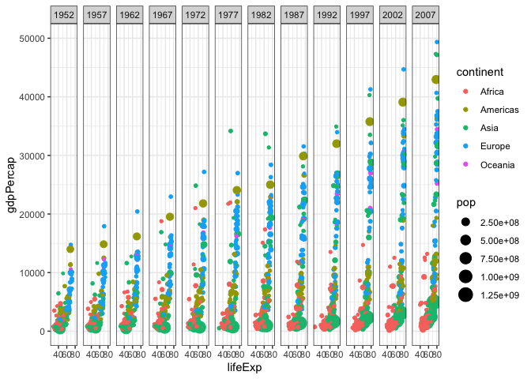

Install Packages/Libraries

```r
library(gapminder)
library(tidyverse)
```

```
## ── Attaching packages ─────────────────────────────────────── tidyverse 1.3.2 ──
## ✔ ggplot2 3.3.6     ✔ purrr   0.3.4
## ✔ tibble  3.1.8     ✔ dplyr   1.0.9
## ✔ tidyr   1.2.0     ✔ stringr 1.4.1
## ✔ readr   2.1.2     ✔ forcats 0.5.2
## ── Conflicts ────────────────────────────────────────── tidyverse_conflicts() ──
## ✖ dplyr::filter() masks stats::filter()
## ✖ dplyr::lag()    masks stats::lag()
```

```r
library(ggplot2)
```

Plot1

```r
ggplot(data = gapminder) + 
  geom_point(mapping = aes(x = lifeExp, y = gdpPercap, color = continent, size = pop)) +
  scale_y_continuous(trans = "sqrt") +
  facet_wrap(~ year, nrow = 1) +
  theme_bw() +
  ylim(0, 50000)
```

```
## Scale for 'y' is already present. Adding another scale for 'y', which will
## replace the existing scale.
```

```
## Warning: Removed 6 rows containing missing values (geom_point).
```

<!-- -->

New Data Set With Weighted Mean of GDP

```r
gapminder <- group_by(gapminder, continent, year)
WMGDP <- summarise(gapminder,
                   WM = weighted.mean(gdpPercap),
                   population1 = sum(pop)
)
```

```
## `summarise()` has grouped output by 'continent'. You can override using the
## `.groups` argument.
```

Plot2 Part1

```r
Plot2 <- ggplot(data = gapminder) + 
  geom_point(mapping = aes(x = year, y = gdpPercap, color = continent, size = pop)) +
  facet_wrap(~ continent) +
  geom_line(aes(x= year, y = gdpPercap, color = continent, group = country))
```

Plot2 Part2

```r
Plot2 +
  geom_line(data = WMGDP, aes(x = year, y = WM)) +
  geom_point(data = WMGDP, mapping = aes(x = year, y = WM, size = population1)) +
  theme_bw() +
  ylim(0, 50000)
```

```
## Warning: Removed 6 rows containing missing values (geom_point).
```

```
## Warning: Removed 6 row(s) containing missing values (geom_path).
```

<!-- -->

