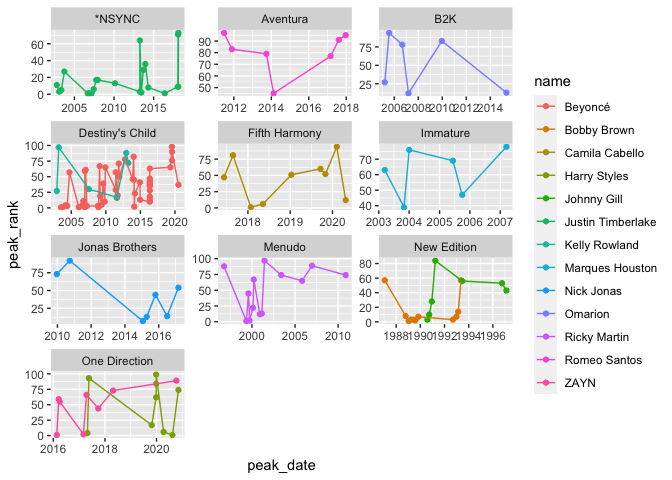

Libraries

```r
library(tidyverse)
```

```
## ── Attaching packages ─────────────────────────────────────── tidyverse 1.3.2 ──
## ✔ ggplot2 3.3.6     ✔ purrr   0.3.4
## ✔ tibble  3.1.8     ✔ dplyr   1.0.9
## ✔ tidyr   1.2.0     ✔ stringr 1.4.1
## ✔ readr   2.1.2     ✔ forcats 0.5.2
## ── Conflicts ────────────────────────────────────────── tidyverse_conflicts() ──
## ✖ dplyr::filter() masks stats::filter()
## ✖ dplyr::lag()    masks stats::lag()
```

```r
library(downloader)
library(readxl)
```

Read Data

```r
SoloData <- read_csv("solo-artist-followers.csv")
```

```
## Rows: 139 Columns: 5
## ── Column specification ────────────────────────────────────────────────────────
## Delimiter: ","
## chr (5): name, band, followers, band_followers, follower_difference
## 
## ℹ Use `spec()` to retrieve the full column specification for this data.
## ℹ Specify the column types or set `show_col_types = FALSE` to quiet this message.
```

```r
BillboardData <- read_csv("billboard-hits.csv")
```

```
## Rows: 456 Columns: 5
## ── Column specification ────────────────────────────────────────────────────────
## Delimiter: ","
## chr  (3): name, band, title
## dbl  (1): peak_rank
## date (1): peak_date
## 
## ℹ Use `spec()` to retrieve the full column specification for this data.
## ℹ Specify the column types or set `show_col_types = FALSE` to quiet this message.
```

Yes Data imported correctly. I had to pull from git and use read_csv because it didn't work using the git URL. It was very easy to pull from git though.


Remove singers who who do not have at least 6 times they had a top 100 hit.

```r
BillboardData1 <- 
  group_by(BillboardData, name) %>% 
  mutate(count = n()) %>%
  filter(count > 5) %>%
  select(name:peak_rank)
```


Find the corresponding data in the data set for the top singers’ bands.

```r
BillboardData2 <- 
  group_by(BillboardData1, band) %>% 
  mutate(count = n()) %>%
  filter(count > 5, !is.na(band))
```

Plot

```r
ggplot(data = BillboardData2) +
  geom_point(mapping = aes(x = peak_date, y = peak_rank, color = name)) +
  geom_line(aes(x= peak_date, y = peak_rank, color = name)) + 
  facet_wrap(~ band, nrow = 4, scales = "free")
```

<!-- -->


