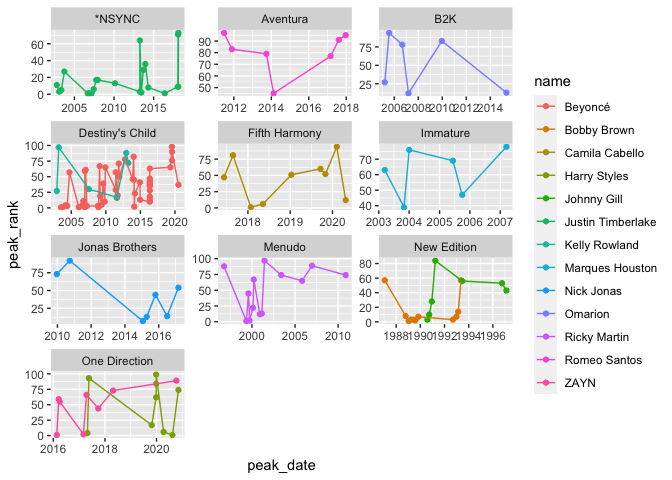

Libraries

```r
library(tidyverse)
```

```
## ── Attaching packages ─────────────────────────────────────── tidyverse 1.3.2 ──
## ✔ ggplot2 3.3.6     ✔ purrr   0.3.4
## ✔ tibble  3.1.8     ✔ dplyr   1.0.9
## ✔ tidyr   1.2.0     ✔ stringr 1.4.1
## ✔ readr   2.1.2     ✔ forcats 0.5.2
## ── Conflicts ────────────────────────────────────────── tidyverse_conflicts() ──
## ✖ dplyr::filter() masks stats::filter()
## ✖ dplyr::lag()    masks stats::lag()
```

```r
library(downloader)
library(readxl)
```

BillboardData

```r
download.file("https://raw.githubusercontent.com/DTS350Fall2022/ChapmanM/main/Week3/Task5/billboard-hits.csv","billboard-hits.csv")
BillboardData <- read_csv("billboard-hits.csv")
```

```
## Rows: 456 Columns: 5
## ── Column specification ────────────────────────────────────────────────────────
## Delimiter: ","
## chr  (3): name, band, title
## dbl  (1): peak_rank
## date (1): peak_date
## 
## ℹ Use `spec()` to retrieve the full column specification for this data.
## ℹ Specify the column types or set `show_col_types = FALSE` to quiet this message.
```

SoloData

```r
download.file("https://raw.githubusercontent.com/DTS350Fall2022/ChapmanM/main/Week3/Task5/solo-artist-followers.csv","solo-artist-followers.csv")
SoloData <- read_csv("solo-artist-followers.csv")
```

```
## Rows: 139 Columns: 5
## ── Column specification ────────────────────────────────────────────────────────
## Delimiter: ","
## chr (5): name, band, followers, band_followers, follower_difference
## 
## ℹ Use `spec()` to retrieve the full column specification for this data.
## ℹ Specify the column types or set `show_col_types = FALSE` to quiet this message.
```

#Comment on Data Types:
Yes, Data imported correctly. I had to use the github raw URL to make it work. When I look at each data set, it is a tibble.


Remove singers who who do not have at least 6 times they had a top 100 hit.

```r
BillboardData1 <- 
  group_by(BillboardData, name) %>% 
  mutate(count = n()) %>%
  filter(count > 5) %>%
  select(name:peak_rank)
```


Find the corresponding data in the data set for the top singers’ bands.

```r
BillboardData2 <- 
  group_by(BillboardData1, band) %>% 
  mutate(count = n()) %>%
  filter(count > 5, !is.na(band))
```

Plot

```r
ggplot(data = BillboardData2) +
  geom_point(mapping = aes(x = peak_date, y = peak_rank, color = name)) +
  geom_line(aes(x= peak_date, y = peak_rank, color = name)) + 
  facet_wrap(~ band, nrow = 4, scales = "free")
```

<!-- -->

TITANIC

```r
download.file("https://raw.githubusercontent.com/rashida048/Datasets/master/titanic_data.csv","titanic_data.csv")
TitanicData <- read_csv("titanic_data.csv")
```

```
## Rows: 891 Columns: 12
## ── Column specification ────────────────────────────────────────────────────────
## Delimiter: ","
## chr (5): Name, Sex, Ticket, Cabin, Embarked
## dbl (7): PassengerId, Survived, Pclass, Age, SibSp, Parch, Fare
## 
## ℹ Use `spec()` to retrieve the full column specification for this data.
## ℹ Specify the column types or set `show_col_types = FALSE` to quiet this message.
```

CENSUS

```r
download.file("https://raw.githubusercontent.com/rashida048/Datasets/master/census.csv","census.csv")
CensusData <- read_csv("census.csv")
```

```
## Rows: 3193 Columns: 100
## ── Column specification ────────────────────────────────────────────────────────
## Delimiter: ","
## chr  (2): STNAME, CTYNAME
## dbl (98): SUMLEV, REGION, DIVISION, STATE, COUNTY, CENSUS2010POP, ESTIMATESB...
## 
## ℹ Use `spec()` to retrieve the full column specification for this data.
## ℹ Specify the column types or set `show_col_types = FALSE` to quiet this message.
```

MOVIE

```r
download.file("https://raw.githubusercontent.com/rashida048/Datasets/master/movie_dataset.csv","movie_dataset.csv")
MovieData <- read_csv("movie_dataset.csv")
```

```
## Rows: 4803 Columns: 24
## ── Column specification ────────────────────────────────────────────────────────
## Delimiter: ","
## chr  (15): genres, homepage, keywords, original_language, original_title, ov...
## dbl   (8): index, budget, id, popularity, revenue, runtime, vote_average, vo...
## date  (1): release_date
## 
## ℹ Use `spec()` to retrieve the full column specification for this data.
## ℹ Specify the column types or set `show_col_types = FALSE` to quiet this message.
```

HOUSING PRICES

```r
download.file("https://raw.githubusercontent.com/rashida048/Datasets/master/home_data.csv","home_data.csv")
HomeData <- read_csv("home_data.csv")
```

```
## Rows: 21613 Columns: 21
## ── Column specification ────────────────────────────────────────────────────────
## Delimiter: ","
## chr   (1): id
## dbl  (19): price, bedrooms, bathrooms, sqft_living, sqft_lot, floors, waterf...
## dttm  (1): date
## 
## ℹ Use `spec()` to retrieve the full column specification for this data.
## ℹ Specify the column types or set `show_col_types = FALSE` to quiet this message.
```

CREDIT CARD FRUAD DATA

```r
download.file("https://raw.githubusercontent.com/rashida048/Datasets/master/fraud_data.csv","fraud_data.csv")
CCFruadData <- read_csv("fraud_data.csv")
```

```
## Rows: 21693 Columns: 30
## ── Column specification ────────────────────────────────────────────────────────
## Delimiter: ","
## dbl (30): V1, V2, V3, V4, V5, V6, V7, V8, V9, V10, V11, V12, V13, V14, V15, ...
## 
## ℹ Use `spec()` to retrieve the full column specification for this data.
## ℹ Specify the column types or set `show_col_types = FALSE` to quiet this message.
```

