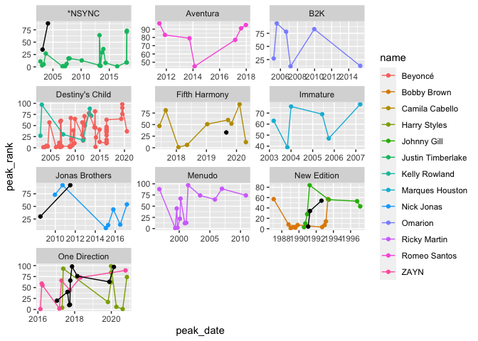

Libraries

```r
library(tidyverse)
```

```
## ── Attaching packages ─────────────────────────────────────── tidyverse 1.3.2 ──
## ✔ ggplot2 3.3.6     ✔ purrr   0.3.4
## ✔ tibble  3.1.8     ✔ dplyr   1.0.9
## ✔ tidyr   1.2.0     ✔ stringr 1.4.1
## ✔ readr   2.1.2     ✔ forcats 0.5.2
## ── Conflicts ────────────────────────────────────────── tidyverse_conflicts() ──
## ✖ dplyr::filter() masks stats::filter()
## ✖ dplyr::lag()    masks stats::lag()
```

```r
library(downloader)
library(readxl)
```

BillboardData

```r
download.file("https://raw.githubusercontent.com/DTS350Fall2022/ChapmanM/main/Week3/Task5/billboard-hits.csv","billboard-hits.csv")
BillboardData <- read_csv("billboard-hits.csv")
```

```
## Rows: 456 Columns: 5
## ── Column specification ────────────────────────────────────────────────────────
## Delimiter: ","
## chr  (3): name, band, title
## dbl  (1): peak_rank
## date (1): peak_date
## 
## ℹ Use `spec()` to retrieve the full column specification for this data.
## ℹ Specify the column types or set `show_col_types = FALSE` to quiet this message.
```

SoloData

```r
download.file("https://raw.githubusercontent.com/DTS350Fall2022/ChapmanM/main/Week3/Task5/solo-artist-followers.csv","solo-artist-followers.csv")
SoloData <- read_csv("solo-artist-followers.csv")
```

```
## Rows: 139 Columns: 5
## ── Column specification ────────────────────────────────────────────────────────
## Delimiter: ","
## chr (5): name, band, followers, band_followers, follower_difference
## 
## ℹ Use `spec()` to retrieve the full column specification for this data.
## ℹ Specify the column types or set `show_col_types = FALSE` to quiet this message.
```

#Comment on Data Types:
Yes, Data imported correctly. I had to use the github raw URL to make it work. When I look at each data set, it is a tibble.


Remove singers who who do not have at least 6 times they had a top 100 hit.

```r
BillboardData1 <- 
  group_by(BillboardData, name) %>% 
  mutate(count = n()) %>%
  filter(count > 5) %>%
  select(name:peak_rank)
```

ALL names mentioned 6+ times & ALL bands mentioned 6+ times

```r
BillboardData2 <- 
  group_by(BillboardData1, band) %>% 
  mutate(count = n()) %>%
  filter(count > 5, !is.na(band))
BillboardData2
```

```
## # A tibble: 162 × 6
## # Groups:   band [10]
##    name              band   title                       peak_date  peak_…¹ count
##    <chr>             <chr>  <chr>                       <date>       <dbl> <int>
##  1 Justin Timberlake *NSYNC SexyBack                    2006-09-08       1    22
##  2 Justin Timberlake *NSYNC My Love                     2006-11-10       1    22
##  3 Justin Timberlake *NSYNC What Goes Around...Comes A… 2007-03-02       1    22
##  4 Justin Timberlake *NSYNC Can't Stop The Feeling!     2016-05-27       1    22
##  5 Justin Timberlake *NSYNC Mirrors                     2013-06-14       2    22
##  6 Justin Timberlake *NSYNC Cry Me A River              2003-01-31       3    22
##  7 Justin Timberlake *NSYNC Suit & Tie                  2013-04-05       3    22
##  8 Justin Timberlake *NSYNC Rock Your Body              2003-05-09       5    22
##  9 Justin Timberlake *NSYNC Summer Love                 2007-06-08       6    22
## 10 Justin Timberlake *NSYNC Not A Bad Thing             2014-05-02       8    22
## # … with 152 more rows, and abbreviated variable name ¹​peak_rank
```

ALL bands mentioned 6+ times

```r
BillboardData3 <- 
  group_by(BillboardData, band) %>% 
  mutate(count = n()) %>%
  filter(count > 5, !is.na(band))
BillboardData3
```

```
## # A tibble: 179 × 6
## # Groups:   band [10]
##    name              band   title                       peak_date  peak_…¹ count
##    <chr>             <chr>  <chr>                       <date>       <dbl> <int>
##  1 JC Chasez         *NSYNC Blowin' Me Up               2003-02-28      35    24
##  2 JC Chasez         *NSYNC Some Girls                  2004-02-13      88    24
##  3 Justin Timberlake *NSYNC SexyBack                    2006-09-08       1    24
##  4 Justin Timberlake *NSYNC My Love                     2006-11-10       1    24
##  5 Justin Timberlake *NSYNC What Goes Around...Comes A… 2007-03-02       1    24
##  6 Justin Timberlake *NSYNC Can't Stop The Feeling!     2016-05-27       1    24
##  7 Justin Timberlake *NSYNC Mirrors                     2013-06-14       2    24
##  8 Justin Timberlake *NSYNC Cry Me A River              2003-01-31       3    24
##  9 Justin Timberlake *NSYNC Suit & Tie                  2013-04-05       3    24
## 10 Justin Timberlake *NSYNC Rock Your Body              2003-05-09       5    24
## # … with 169 more rows, and abbreviated variable name ¹​peak_rank
```

ALL bands mentioned 6+ times & Excluding names mentioned 6+ times

```r
BillboardData4 <- 
  group_by(BillboardData3, name) %>% 
  mutate(count = n()) %>%
  filter(count <= 5, !is.na(name))
BillboardData4
```

```
## # A tibble: 17 × 6
## # Groups:   name [7]
##    name            band           title                 peak_date  peak_…¹ count
##    <chr>           <chr>          <chr>                 <date>       <dbl> <int>
##  1 JC Chasez       *NSYNC         Blowin' Me Up         2003-02-28      35     2
##  2 JC Chasez       *NSYNC         Some Girls            2004-02-13      88     2
##  3 Normani         Fifth Harmony  Motivation            2019-08-30      33     1
##  4 Joe Jonas       Jonas Brothers Gotta Find You        2008-07-04      30     2
##  5 Joe Jonas       Jonas Brothers See No More           2011-07-01      92     2
##  6 Ralph Tresvant  New Edition    Sensitivity           1991-01-25       4     3
##  7 Ralph Tresvant  New Edition    Stone Cold Gentleman  1991-04-12      34     3
##  8 Ralph Tresvant  New Edition    Money Can't Buy You … 1992-08-14      54     3
##  9 Liam Payne      One Direction  Strip That Down       2017-09-15      10     3
## 10 Liam Payne      One Direction  For You               2018-02-23      76     3
## 11 Liam Payne      One Direction  Bedroom Floor         2017-11-10      98     3
## 12 Louis Tomlinson One Direction  Back To You           2017-08-11      40     1
## 13 Niall Horan     One Direction  Slow Hands            2017-09-29      11     5
## 14 Niall Horan     One Direction  This Town             2017-01-13      20     5
## 15 Niall Horan     One Direction  Nice To Meet Ya       2019-11-22      63     5
## 16 Niall Horan     One Direction  Too Much To Ask       2017-10-06      66     5
## 17 Niall Horan     One Direction  No Judgement          2020-02-21      97     5
## # … with abbreviated variable name ¹​peak_rank
```


Find the corresponding data in the data set for the top singers’ bands.

```r
BillboardData2 <- 
  group_by(BillboardData1, band) %>% 
  mutate(count = n()) %>%
  filter(count > 5, !is.na(band))
```

Plot1 Part1

```r
Plot1 <- ggplot(data = BillboardData2) +
  geom_point(mapping = aes(x = peak_date, y = peak_rank, color = name)) +
  geom_line(aes(x= peak_date, y = peak_rank, color = name)) + 
  facet_wrap(~ band, nrow = 4, scales = "free")
```

Plot1 Part2

```r
Plot1 +
  geom_point(data = BillboardData4, mapping = aes(x = peak_date, y = peak_rank)) +
  geom_line(data = BillboardData4, aes(x= peak_date, y = peak_rank))  
```

```
## geom_path: Each group consists of only one observation. Do you need to adjust
## the group aesthetic?
```

<!-- -->

TITANIC

```r
download.file("https://raw.githubusercontent.com/rashida048/Datasets/master/titanic_data.csv","titanic_data.csv")
TitanicData <- read_csv("titanic_data.csv")
```

```
## Rows: 891 Columns: 12
## ── Column specification ────────────────────────────────────────────────────────
## Delimiter: ","
## chr (5): Name, Sex, Ticket, Cabin, Embarked
## dbl (7): PassengerId, Survived, Pclass, Age, SibSp, Parch, Fare
## 
## ℹ Use `spec()` to retrieve the full column specification for this data.
## ℹ Specify the column types or set `show_col_types = FALSE` to quiet this message.
```

CENSUS

```r
download.file("https://raw.githubusercontent.com/rashida048/Datasets/master/census.csv","census.csv")
CensusData <- read_csv("census.csv")
```

```
## Rows: 3193 Columns: 100
## ── Column specification ────────────────────────────────────────────────────────
## Delimiter: ","
## chr  (2): STNAME, CTYNAME
## dbl (98): SUMLEV, REGION, DIVISION, STATE, COUNTY, CENSUS2010POP, ESTIMATESB...
## 
## ℹ Use `spec()` to retrieve the full column specification for this data.
## ℹ Specify the column types or set `show_col_types = FALSE` to quiet this message.
```

MOVIE

```r
download.file("https://raw.githubusercontent.com/rashida048/Datasets/master/movie_dataset.csv","movie_dataset.csv")
MovieData <- read_csv("movie_dataset.csv")
```

```
## Rows: 4803 Columns: 24
## ── Column specification ────────────────────────────────────────────────────────
## Delimiter: ","
## chr  (15): genres, homepage, keywords, original_language, original_title, ov...
## dbl   (8): index, budget, id, popularity, revenue, runtime, vote_average, vo...
## date  (1): release_date
## 
## ℹ Use `spec()` to retrieve the full column specification for this data.
## ℹ Specify the column types or set `show_col_types = FALSE` to quiet this message.
```

HOUSING PRICES

```r
download.file("https://raw.githubusercontent.com/rashida048/Datasets/master/home_data.csv","home_data.csv")
HomeData <- read_csv("home_data.csv")
```

```
## Rows: 21613 Columns: 21
## ── Column specification ────────────────────────────────────────────────────────
## Delimiter: ","
## chr   (1): id
## dbl  (19): price, bedrooms, bathrooms, sqft_living, sqft_lot, floors, waterf...
## dttm  (1): date
## 
## ℹ Use `spec()` to retrieve the full column specification for this data.
## ℹ Specify the column types or set `show_col_types = FALSE` to quiet this message.
```

CREDIT CARD FRUAD DATA

```r
download.file("https://raw.githubusercontent.com/rashida048/Datasets/master/fraud_data.csv","fraud_data.csv")
CCFruadData <- read_csv("fraud_data.csv")
```

```
## Rows: 21693 Columns: 30
## ── Column specification ────────────────────────────────────────────────────────
## Delimiter: ","
## dbl (30): V1, V2, V3, V4, V5, V6, V7, V8, V9, V10, V11, V12, V13, V14, V15, ...
## 
## ℹ Use `spec()` to retrieve the full column specification for this data.
## ℹ Specify the column types or set `show_col_types = FALSE` to quiet this message.
```

