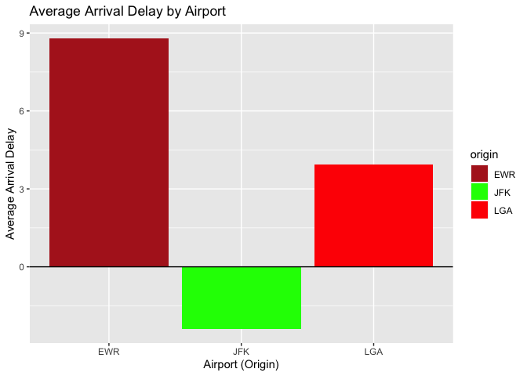

#### Load Libraries

```r
library(tidyverse)
```

```
## ── Attaching packages ─────────────────────────────────────── tidyverse 1.3.2 ──
## ✔ ggplot2 3.3.6     ✔ purrr   0.3.4
## ✔ tibble  3.1.8     ✔ dplyr   1.0.9
## ✔ tidyr   1.2.0     ✔ stringr 1.4.1
## ✔ readr   2.1.2     ✔ forcats 0.5.2
## ── Conflicts ────────────────────────────────────────── tidyverse_conflicts() ──
## ✖ dplyr::filter() masks stats::filter()
## ✖ dplyr::lag()    masks stats::lag()
```

```r
library(dplyr)
library(ggplot2)
library(downloader)
```

#### Load Data

```r
library(nycflights13)
x <- flights
```

## Q1: If I am leaving before noon, which two airlines do you recommend at each airport (JFK, LGA, EWR) that will have the lowest delay time at the 75th percentile?
#### Introduction
I filtered the time so that it is less than 1200 (before noon). I then ranked each line by percentile, and filtered so that only flights in the 75th percentile are in the data. I then counted how many times each carrier was mentioned and ranked them again based grouped by orgin and how many times the airline was mentioned. Lastly, I took the top 2 ranked airlines from each origin (aka airport). In the end, I had a dataset with the 2 most frequently mentioned airlines that were scheduled to leave before noon and had the lowest delay time at the 75th percentile. For the origin EWR, carriers EV and B6 were what I recommended. For the origin JFK, DL and EV were what I recommended. Lastly, for LGA, DL and EV were what I recommended. Once again, I recommended them based off of count after all the other conditions were met.
#### Manipulate Data

```r
Q1 <- x %>%
  filter(dep_time < 1200) %>%
  mutate(percentile_rank = ntile(dep_delay, 100)) %>%
  select(origin, carrier, dep_delay, percentile_rank) %>%
  drop_na() %>%
  filter(percentile_rank == 25) %>%
  group_by(carrier) %>%
  mutate(count_airline = n()) %>%
  group_by(origin, carrier,count_airline) %>%
  summarise() %>%
  arrange(origin,desc(count_airline)) %>%
  ungroup() %>%
  group_by(origin) %>%
  mutate(count_rank = ntile(count_airline, 100)) %>%
  filter(count_rank == 10 | count_rank == 9) %>%
  summarise(origin,carrier,count_airline)
```

```
## `summarise()` has grouped output by 'origin', 'carrier'. You can override using
## the `.groups` argument.
## `summarise()` has grouped output by 'origin'. You can override using the
## `.groups` argument.
```
#### Plot

```r
ggplot(data = Q1, mapping = aes(x = origin, y = count_airline, fill = carrier)) +
  geom_col() +
  labs(x = "Airport (Origin)",
       y = "Count of Airline",
       title = "Top 2 carriers at each aiport")
```

<!-- -->


## Q2: Which origin airport is best to minimize my chances of a late arrival when I am using Delta Airlines?
#### Introduction
I started off by filtering out all flights that are not DL. I found DL to be Delta through a quick google search. I then did a grouped summary to see each origins average arrival delay. The output showed JFK to have the best average delay at -2.38. In other words, people flying out of JFK get to there destination 2.38 minutes before their scheduled time, which is quicker than any of the other airports. It actually is the only airport that is on time mostly. LGA is second at 3.93 minutes as an average delayed arrival time. EWR is the worst with 8.78 minutes as the average delayed arrival time. To answer the question, JFK is the airport that has the lowest chances of a late arrival.
#### Manipulate Data

```r
Q2 <- x %>%
  filter(carrier == "DL") %>%
  select(arr_delay, origin) %>%
  drop_na() %>%
  group_by(origin) %>%
  summarise(avg_delay = mean(arr_delay)) %>%
  arrange(avg_delay)
```
#### Plot

```r
ggplot(data = Q2, mapping = aes(x = origin, y = avg_delay, fill = origin)) +
  geom_col() +
  labs(x = "Airport (Origin)",
       y = "Average Arrival Delay",
       title = "Average Arrival Delay by Airport") +
  scale_fill_manual(values = c("#B22222",
                             "green",
                             "#FF0000")) +
  geom_hline(aes(yintercept = 0))
```

<!-- -->

