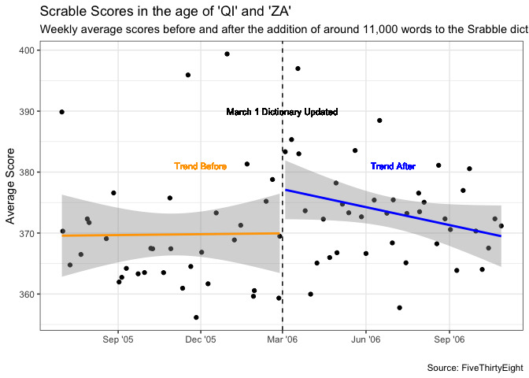

#### Load Libraries

```r
library(lubridate)
```

```
## 
## Attaching package: 'lubridate'
```

```
## The following objects are masked from 'package:base':
## 
##     date, intersect, setdiff, union
```

```r
library(ggplot2)
library(dplyr)
```

```
## 
## Attaching package: 'dplyr'
```

```
## The following objects are masked from 'package:stats':
## 
##     filter, lag
```

```
## The following objects are masked from 'package:base':
## 
##     intersect, setdiff, setequal, union
```

```r
library(tidyverse)
```

```
## ── Attaching packages
## ───────────────────────────────────────
## tidyverse 1.3.2 ──
```

```
## ✔ tibble  3.1.8     ✔ purrr   0.3.4
## ✔ tidyr   1.2.0     ✔ stringr 1.4.1
## ✔ readr   2.1.2     ✔ forcats 0.5.2
## ── Conflicts ────────────────────────────────────────── tidyverse_conflicts() ──
## ✖ lubridate::as.difftime() masks base::as.difftime()
## ✖ lubridate::date()        masks base::date()
## ✖ dplyr::filter()          masks stats::filter()
## ✖ lubridate::intersect()   masks base::intersect()
## ✖ dplyr::lag()             masks stats::lag()
## ✖ lubridate::setdiff()     masks base::setdiff()
## ✖ lubridate::union()       masks base::union()
```

```r
library(ggrepel)
library(downloader)
```

## Different Iris Species Have Different Sizes
#### Petal Length (Max)

```r
max_flower <- iris %>%
  group_by(Species) %>%
  summarise(Sepal.Length, Sepal.Width, Petal.Length, Petal.Width, max = max(Petal.Length, na.rm=TRUE)) %>%
  filter(max == Petal.Length, Petal.Width != 0.2)
```

```
## `summarise()` has grouped output by 'Species'. You can override using the
## `.groups` argument.
```
#### Petal Width (Max)

```r
max_flower_width <- iris %>%
  group_by(Species) %>%
  summarise(Sepal.Length, Sepal.Width, Petal.Length, Petal.Width, max = max(Petal.Width, na.rm=TRUE)) %>%
  filter(max == Petal.Width) %>%
  filter(Petal.Length != 6, Petal.Length != 5.7)
```

```
## `summarise()` has grouped output by 'Species'. You can override using the
## `.groups` argument.
```
## PLOT

```r
ggplot(data = iris, mapping = aes(x = Sepal.Length, 
                                  y = Sepal.Width)) +
  geom_point(aes(color = Species, shape = Species)) +
  geom_point(size = 3, shape = 1, color = "black", data = max_flower) +
  geom_text(aes(color = Species, label = "Largest Petal Length"), data = max_flower) +
  geom_point(size = 3, shape = 1, color = "black", data = max_flower_width) +
  geom_text(aes(color = Species, label = "Largest Petal Width"), data = max_flower_width) +
  labs(x = "Sepal Length (cm)",
       y = "Sepal Width (cm)",
       title = "Different Iris Species Have Different Sepal Sizes",
       subtitle = "The Largest Petal Sizes For Each Species Do Not Correspond To The Largest Sepal Sizes",
       caption = "Source: iris") +
  theme(legend.position="bottom")
```

<!-- -->


## Scrabble Scores in Age of 'QI' and 'ZA'
#### Import Data

```r
ScrabbleData <- read_csv("https://media.githubusercontent.com/media/fivethirtyeight/data/master/scrabble-games/scrabble_games.csv")
```

```
## Rows: 1542642 Columns: 19
## ── Column specification ────────────────────────────────────────────────────────
## Delimiter: ","
## chr   (2): winnername, losername
## dbl  (14): gameid, tourneyid, winnerid, winnerscore, winneroldrating, winner...
## lgl   (2): tie, lexicon
## date  (1): date
## 
## ℹ Use `spec()` to retrieve the full column specification for this data.
## ℹ Specify the column types or set `show_col_types = FALSE` to quiet this message.
```

```r
ScrabbleData
```

```
## # A tibble: 1,542,642 × 19
##    gameid tourne…¹ tie   winne…² winne…³ winne…⁴ winne…⁵ winne…⁶ winne…⁷ loserid
##     <dbl>    <dbl> <lgl>   <dbl> <chr>     <dbl>   <dbl>   <dbl>   <dbl>   <dbl>
##  1      1        1 FALSE     268 Harrie…       0    1568    1684       1     429
##  2      2        1 FALSE     268 Harrie…       0    1568    1684       1     435
##  3      3        1 FALSE     268 Harrie…       0    1568    1684       1     441
##  4      4        1 FALSE     268 Harrie…       0    1568    1684       1     456
##  5      5        1 FALSE     268 Harrie…       0    1568    1684       1    1334
##  6      6        1 FALSE     268 Harrie…       0    1568    1684       1     454
##  7      7        1 FALSE     268 Harrie…       0    1568    1684       1    5766
##  8      8        1 FALSE     268 Harrie…       0    1568    1684       1     442
##  9      9        1 FALSE     429 Patric…       0    1915    1872       3     456
## 10     10        1 FALSE     429 Patric…       0    1915    1872       3    1334
## # … with 1,542,632 more rows, 9 more variables: losername <chr>,
## #   loserscore <dbl>, loseroldrating <dbl>, losernewrating <dbl>,
## #   loserpos <dbl>, round <dbl>, division <dbl>, date <date>, lexicon <lgl>,
## #   and abbreviated variable names ¹​tourneyid, ²​winnerid, ³​winnername,
## #   ⁴​winnerscore, ⁵​winneroldrating, ⁶​winnernewrating, ⁷​winnerpos
```
#### Manipulate data

```r
ScrabbleAll <- ScrabbleData %>%
  select(date, winnerscore, loserscore) %>%
  pivot_longer(c("winnerscore","loserscore"), names_to = "win-loss", values_to = "score") %>%
  filter(score > 0) %>%
  mutate(year = year(date),
         week = week(date),
         month = month(date)
  )
```
#### Get average scores for each week within time frame

```r
SA <- ScrabbleAll %>%
  filter((year == 2005 & month >= 7) | (year == 2006 & month <= 10)) %>%
  group_by(year,month,week) %>%
  summarise(date = max(date), AvgScore = mean(score))
```

```
## `summarise()` has grouped output by 'year', 'month'. You can override using the
## `.groups` argument.
```
#### Datasets for Trend Before and Trend After linear lines

```r
SA_B4_11K <- SA %>%
  filter((year == 2005 & month >= 6) | (year == 2006 & month <= 2))

SA_AFTER_11K <- SA %>%
  filter(year == 2006 & month <= 10 & month >= 3)
```
#### Plot

```r
ggplot(data = SA, mapping = aes(x= date, y = AvgScore)) +
  geom_point() +
  labs(x = "",
       y = "Average Score",
       title = "Scrable Scores in the age of 'QI' and 'ZA'",
       subtitle = "Weekly average scores before and after the addition of around 11,000 words to the Srabble dictionary",
       caption = "Source: FiveThirtyEight") +
  geom_vline(xintercept = as.Date("2006-03-01"),linetype= "dashed") +
  scale_x_date(date_labels = "%b '%y", date_breaks = "3 months", minor_breaks = NULL) +
  geom_text(aes(label = "March 1 Dictionary Updated", x = as.Date("2006-03-01"), y = 390), size =3) +
  theme_bw() +
  geom_text(aes(label = "Trend Before", x = as.Date("2005-12-01"), y = 381), size =3, color="orange") +
  geom_text(aes(label = "Trend After", x = as.Date("2006-07-01"), y = 381), size =3, color="blue") +
  geom_smooth(data = SA_B4_11K, mapping = aes(x = date, y = AvgScore),method='lm',color="orange") +
  geom_smooth(data = SA_AFTER_11K, mapping = aes(x = date, y = AvgScore),method='lm',color="blue")
```

```
## `geom_smooth()` using formula 'y ~ x'
## `geom_smooth()` using formula 'y ~ x'
```

<!-- -->

