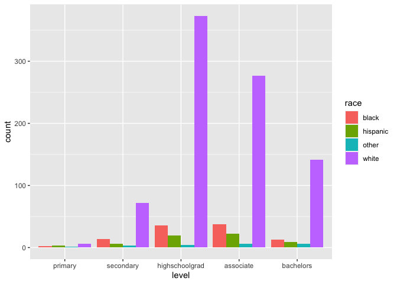
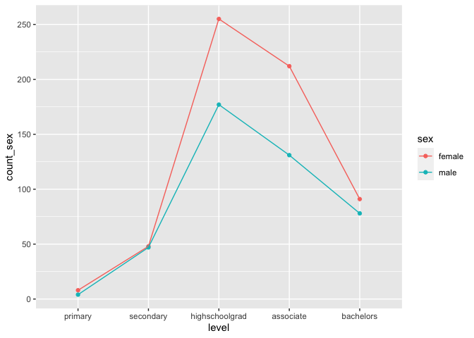
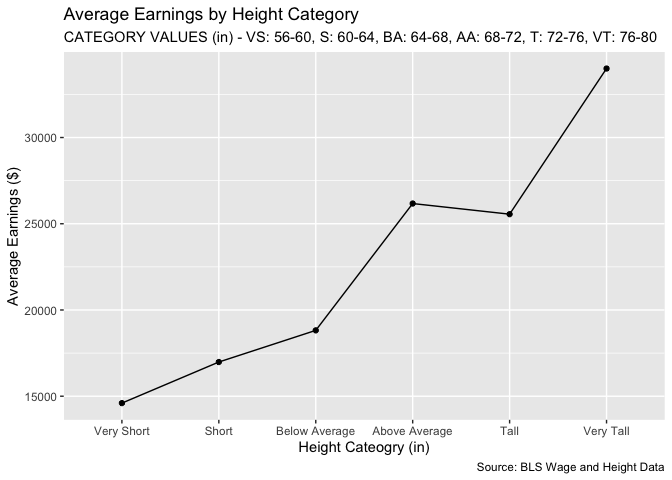

#### Load Libraries

```r
library(downloader)
library(readxl)
library(tidyverse)
```

```
## ── Attaching packages ─────────────────────────────────────── tidyverse 1.3.2 ──
## ✔ ggplot2 3.3.6     ✔ purrr   0.3.4
## ✔ tibble  3.1.8     ✔ dplyr   1.0.9
## ✔ tidyr   1.2.0     ✔ stringr 1.4.1
## ✔ readr   2.1.2     ✔ forcats 0.5.2
## ── Conflicts ────────────────────────────────────────── tidyverse_conflicts() ──
## ✖ dplyr::filter() masks stats::filter()
## ✖ dplyr::lag()    masks stats::lag()
```

```r
library(ggplot2)
library(dplyr)
```

#### Download BLS Wage and Height Data

```r
download.file("https://raw.githubusercontent.com/hadley/r4ds/master/data/heights.csv", "heights.csv")
Data <- read_csv("heights.csv")
```

```
## Rows: 1192 Columns: 6
## ── Column specification ────────────────────────────────────────────────────────
## Delimiter: ","
## chr (2): sex, race
## dbl (4): earn, height, ed, age
## 
## ℹ Use `spec()` to retrieve the full column specification for this data.
## ℹ Specify the column types or set `show_col_types = FALSE` to quiet this message.
```

#### Create new dataset called HeightEd

```r
HeightEd <-
  mutate(Data, level = case_when(
    ed >= 3 & ed <=6 ~ "primary",
    ed >= 7 & ed <=11 ~ "secondary",
    ed == 12 ~ "highschoolgrad",
    ed >=13 & ed <=15 ~ "associate",
    ed == 16 ~ "bachelors",
    ed >= 17 & ed <= 18 ~ "mastersdoctorate"
  ))
```

### Make a graphic that shows relationship between education and race
#### Make vector with categories ordered for factoring

```r
OrderedLevels <- c('primary', 'secondary', 'highschoolgrad', 'associate', 'bachelors', 'masterdpctorate')
```
#### Factor data and drop nulls

```r
HeightEd <- HeightEd %>% 
  mutate(level = factor(level, levels = OrderedLevels)) %>%
  drop_na()
```
#### Plot

```r
ggplot(data = HeightEd, mapping = aes(x = level, fill = race)) +
  geom_bar(position = "dodge")
```

<!-- -->

### Make another graphic to show the relationship between education and sex
#### Create data set for with sex, level, and count of sex for each level

```r
HeightEd1 <- HeightEd %>%
  group_by(sex,level) %>% 
  mutate(count_sex = n()) %>%
  select(sex,level,count_sex) %>%
  group_by(sex,level,count_sex) %>%
  summarise()
```

```
## `summarise()` has grouped output by 'sex', 'level'. You can override using the
## `.groups` argument.
```
#### Plot

```r
ggplot(data = HeightEd1, aes(x = level, y = count_sex, color = sex, group = sex)) + 
  geom_point() +
  geom_line()
```

<!-- -->

### Make another graph that incorporates good labels and good placement of objects on the graph and write a brief paragraph to explain what you learned in the process
#### Find min and max of height to create categories

```r
x <- (HeightEd) %>%
  summarise(max(height))
```

```r
y <- (HeightEd) %>%
  summarise(min(height))
```
#### Create vector with height categories for facotring

```r
OrderedHeights <- c('Very Short', 'Short', 'Below Average', 'Above Average', 'Tall', 'Very Tall')
```
#### Create dataset with height cateogories and average earnings of those categories, with factoring.

```r
HighEd2 <- HeightEd %>%
  mutate(height_cat = case_when(
    height >= 56 & height <= 60.0 ~ "Very Short",
    height >= 60.0 & height <= 64.0 ~ "Short",
    height >= 64.0 & height <= 68.0 ~ "Below Average",
    height >= 68.0 & height <= 72.0 ~ "Above Average",
    height >= 72.0 & height <= 76.0 ~ "Tall",
    height >= 76.0 & height <= 80.0 ~ "Very Tall"
    
  )) %>%
  mutate(height_cat = factor(height_cat, levels = OrderedHeights)) %>%
  group_by(height_cat) %>%
  mutate(AvgEarn = mean(earn)) %>%
  summarise(height_cat, AvgEarn) %>%
  group_by(height_cat,AvgEarn) %>%
  summarise()
```

```
## `summarise()` has grouped output by 'height_cat'. You can override using the
## `.groups` argument.
## `summarise()` has grouped output by 'height_cat'. You can override using the
## `.groups` argument.
```
#### Plot

```r
ggplot(HighEd2, aes(height_cat,AvgEarn, group = 1)) +
  geom_point() +
  geom_line() +
  labs(x = "Height Cateogry (in)",
       y = "Average Earnings ($)",
       title = "Average Earnings by Height Category",
       subtitle = "CATEGORY VALUES (in) - VS: 56-60, S: 60-64, BA: 64-68, AA: 68-72, T: 72-76, VT: 76-80",
       caption = "Source: BLS Wage and Height Data") +
  theme(legend.position="bottom")
```

<!-- -->


#### Paragraph:
This graphic shows the relationship between height and earnings. The outcome shows strong evidence that as height increases so does earnings. During the process I learned how to use factors and grew in my ability to manipulate data - specifically grouped summaries and mutates. I also gained valuable experience in changing the lables of a visualization (as seen in this last visualization).
