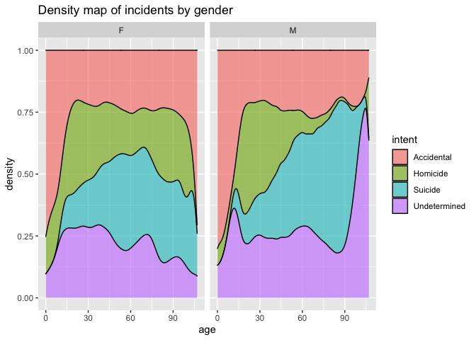

#### Summary for FiveThirtyEight Article
The article describes the data which is more than 33k annual gun deaths in America. The data is only for US residents and excludes non-citizens. It pulled its data from various sources to create the intent category. Homicides is death by assault and legal intervention. Mass shootings are when 3 or more people are killed. Terrorism is data taken from the Global Terrorism Database. Population totals are from Minnesota's IPUMS project and is based off 2012-2014 survery results.

#### Libararies

```r
library(downloader)
library(dplyr)
```

```
## 
## Attaching package: 'dplyr'
```

```
## The following objects are masked from 'package:stats':
## 
##     filter, lag
```

```
## The following objects are masked from 'package:base':
## 
##     intersect, setdiff, setequal, union
```

```r
library(tidyverse)
```

```
## ── Attaching packages
## ───────────────────────────────────────
## tidyverse 1.3.2 ──
```

```
## ✔ ggplot2 3.3.6     ✔ purrr   0.3.4
## ✔ tibble  3.1.8     ✔ stringr 1.4.1
## ✔ tidyr   1.2.0     ✔ forcats 0.5.2
## ✔ readr   2.1.2     
## ── Conflicts ────────────────────────────────────────── tidyverse_conflicts() ──
## ✖ dplyr::filter() masks stats::filter()
## ✖ dplyr::lag()    masks stats::lag()
```
#### Download Data

```r
data <- read_csv("https://raw.githubusercontent.com/fivethirtyeight/guns-data/master/full_data.csv")
```

```
## New names:
## Rows: 100798 Columns: 11
## ── Column specification
## ──────────────────────────────────────────────────────── Delimiter: "," chr
## (6): month, intent, sex, race, place, education dbl (5): ...1, year, police,
## age, hispanic
## ℹ Use `spec()` to retrieve the full column specification for this data. ℹ
## Specify the column types or set `show_col_types = FALSE` to quiet this message.
## • `` -> `...1`
```

```r
data
```

```
## # A tibble: 100,798 × 11
##     ...1  year month intent       police sex     age race  hispa…¹ place educa…²
##    <dbl> <dbl> <chr> <chr>         <dbl> <chr> <dbl> <chr>   <dbl> <chr> <chr>  
##  1     1  2012 01    Suicide           0 M        34 Asia…     100 Home  BA+    
##  2     2  2012 01    Suicide           0 F        21 White     100 Stre… Some c…
##  3     3  2012 01    Suicide           0 M        60 White     100 Othe… BA+    
##  4     4  2012 02    Suicide           0 M        64 White     100 Home  BA+    
##  5     5  2012 02    Suicide           0 M        31 White     100 Othe… HS/GED 
##  6     6  2012 02    Suicide           0 M        17 Nati…     100 Home  Less t…
##  7     7  2012 02    Undetermined      0 M        48 White     100 Home  HS/GED 
##  8     8  2012 03    Suicide           0 M        41 Nati…     100 Home  HS/GED 
##  9     9  2012 02    Accidental        0 M        50 White     100 Othe… Some c…
## 10    10  2012 02    Suicide           0 M        NA Black     998 Home  <NA>   
## # … with 100,788 more rows, and abbreviated variable names ¹​hispanic,
## #   ²​education
```
#### Add Age Group to Data

```r
d1 <- data %>%
  mutate(agegroup = case_when(
    age < 15 ~ "under 15",
    age >=15 & age <=34 ~ "15-34",
    age >=35 & age <=64 ~ "35-64",
    age >= 65 ~ "65+"
  )) %>%
  drop_na() %>%
  mutate(agegroup = factor(agegroup, levels=c("under 15", "15-34", "35-64", "65+")))
```


## Plot1

```r
p1 <- ggplot(data = d1, mapping = aes(x = agegroup, fill = sex)) +
  geom_bar() +
  facet_wrap(~ intent, nrow = 2, scales = "free") +
  labs(title = "Count of Incidents by Intent by Sex and by Age Group", fill = "Sex")
p1
```

<!-- -->
## Plot2

```r
p2 <- ggplot(data = d1, mapping = aes(x=age,fill=intent)) +
  geom_density(alpha = .6,position="fill") +
  facet_wrap(~ sex) +
  labs(title = "Density map of incidents by gender")
p2
```

<!-- -->


#### Add seasons to data set for commerical (Plot3)

```r
data1 <- data %>%
  mutate(month = as.integer(month), season = case_when(
    month == "12" | month =="1" | month == "2" ~ "Winter",
    month == "3" | month =="4" | month == "5" ~ "Spring",
    month == "6" | month =="7" | month == "8" ~ "Summer",
    month == "9" | month =="10" | month == "11" ~ "Fall"
  )) %>%
  drop_na()
data1
```

```
## # A tibble: 98,015 × 12
##     ...1  year month intent       police sex     age race  hispa…¹ place educa…²
##    <dbl> <dbl> <int> <chr>         <dbl> <chr> <dbl> <chr>   <dbl> <chr> <chr>  
##  1     1  2012     1 Suicide           0 M        34 Asia…     100 Home  BA+    
##  2     2  2012     1 Suicide           0 F        21 White     100 Stre… Some c…
##  3     3  2012     1 Suicide           0 M        60 White     100 Othe… BA+    
##  4     4  2012     2 Suicide           0 M        64 White     100 Home  BA+    
##  5     5  2012     2 Suicide           0 M        31 White     100 Othe… HS/GED 
##  6     6  2012     2 Suicide           0 M        17 Nati…     100 Home  Less t…
##  7     7  2012     2 Undetermined      0 M        48 White     100 Home  HS/GED 
##  8     8  2012     3 Suicide           0 M        41 Nati…     100 Home  HS/GED 
##  9     9  2012     2 Accidental        0 M        50 White     100 Othe… Some c…
## 10    11  2012     2 Suicide           0 M        30 White     100 Home  Some c…
## # … with 98,005 more rows, 1 more variable: season <chr>, and abbreviated
## #   variable names ¹​hispanic, ²​education
```
## Plot3

```r
p3 <- ggplot(data = data1, mapping = aes(x = season, fill = race)) +
  geom_bar(position = "dodge")
p3
```

<!-- -->

Plot 3 shows the count of incidents by season and race. The plot shows that their is not a  significant difference between total number of incidents and the season. Each race also has a simiolar number of incidents in each season. The data does show that white people were involved in more incidents than anybody. Next was black, and then hispanic.

#### Only Use winter and summer data (Plot 4)

```r
d2 <- data1 %>%
  filter(season == "Winter" | season == "Summer")
d2
```

```
## # A tibble: 48,805 × 12
##     ...1  year month intent       police sex     age race  hispa…¹ place educa…²
##    <dbl> <dbl> <int> <chr>         <dbl> <chr> <dbl> <chr>   <dbl> <chr> <chr>  
##  1     1  2012     1 Suicide           0 M        34 Asia…     100 Home  BA+    
##  2     2  2012     1 Suicide           0 F        21 White     100 Stre… Some c…
##  3     3  2012     1 Suicide           0 M        60 White     100 Othe… BA+    
##  4     4  2012     2 Suicide           0 M        64 White     100 Home  BA+    
##  5     5  2012     2 Suicide           0 M        31 White     100 Othe… HS/GED 
##  6     6  2012     2 Suicide           0 M        17 Nati…     100 Home  Less t…
##  7     7  2012     2 Undetermined      0 M        48 White     100 Home  HS/GED 
##  8     9  2012     2 Accidental        0 M        50 White     100 Othe… Some c…
##  9    11  2012     2 Suicide           0 M        30 White     100 Home  Some c…
## 10    12  2012     1 Suicide           0 M        21 Nati…     100 Home  HS/GED 
## # … with 48,795 more rows, 1 more variable: season <chr>, and abbreviated
## #   variable names ¹​hispanic, ²​education
```
## Plot4

```r
p4 <- ggplot(data = d2, mapping = aes(x = intent, fill = sex)) +
  geom_bar() +
  facet_wrap(~ season)
p4
```

<!-- -->

Plot 4 shows the months summer and winter and the count of incidents by intent and sex. The number of incidents look to be slightly greater for every intent cateogry in the summer. It is also clear that men are involved in the majority of every cateogry of intent. In both seasons, suicide has the largest count by a significant number. Homicide is second largest, accidental is third, and undetermined is last.
