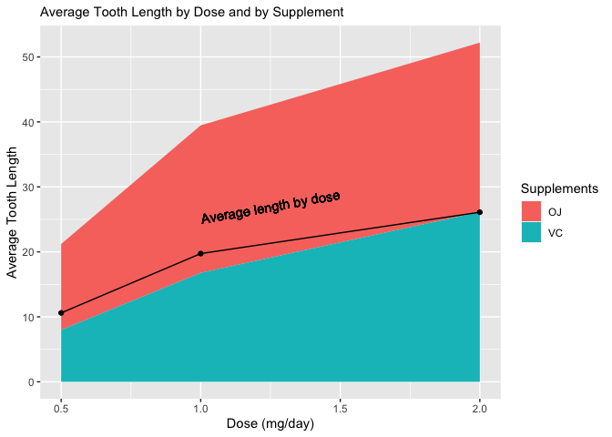
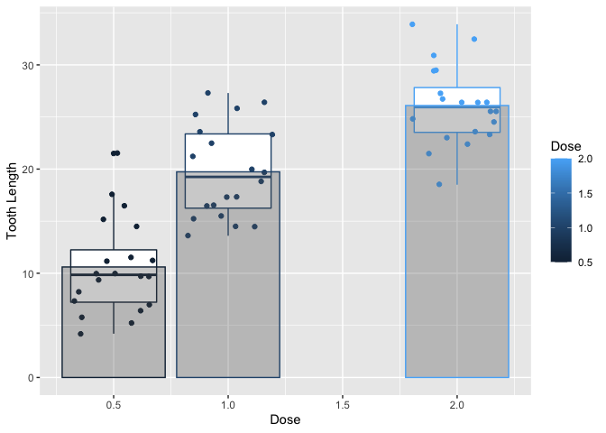
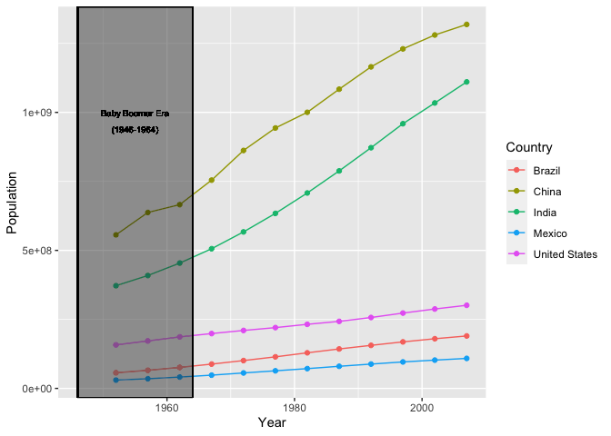
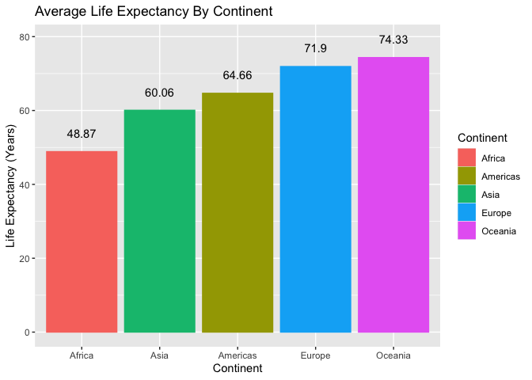

#### Load Libraries

```r
library(ggplot2)
library(tidyverse)
```

```
## ── Attaching packages ─────────────────────────────────────── tidyverse 1.3.2 ──
## ✔ tibble  3.1.8     ✔ dplyr   1.0.9
## ✔ tidyr   1.2.0     ✔ stringr 1.4.1
## ✔ readr   2.1.2     ✔ forcats 0.5.2
## ✔ purrr   0.3.4     
## ── Conflicts ────────────────────────────────────────── tidyverse_conflicts() ──
## ✖ dplyr::filter() masks stats::filter()
## ✖ dplyr::lag()    masks stats::lag()
```

```r
library(dplyr)
library(forcats)
library(gapminder)
```

## ToothGrowth
#### Plot 1

```r
T1 <- ToothGrowth %>%
  group_by(supp, dose) %>%
  summarise(len = mean(len))
```

```
## `summarise()` has grouped output by 'supp'. You can override using the
## `.groups` argument.
```

```r
T1
```

```
## # A tibble: 6 × 3
## # Groups:   supp [2]
##   supp   dose   len
##   <fct> <dbl> <dbl>
## 1 OJ      0.5 13.2 
## 2 OJ      1   22.7 
## 3 OJ      2   26.1 
## 4 VC      0.5  7.98
## 5 VC      1   16.8 
## 6 VC      2   26.1
```

```r
avg <- T1 %>%
  group_by(dose) %>%
  summarise(len = mean(len))
avg
```

```
## # A tibble: 3 × 2
##    dose   len
##   <dbl> <dbl>
## 1   0.5  10.6
## 2   1    19.7
## 3   2    26.1
```

```r
P1 <- ggplot(data= T1) +
  geom_area(aes(x = dose, y = len, fill = supp)) +
  geom_line(data = avg, mapping = aes(x = dose, y = len)) +
  geom_point(data = avg, mapping = aes(x = dose, y = len)) +
  geom_text(label = "Average length by dose", x=1.25, y=27, angle = 10) +
  labs(x = "Dose (mg/day)",
       y = "Average Tooth Length",
       subtitle = "Average Tooth Length by Dose and by Supplement",
       fill = "Supplements") 
P1
```

<!-- -->

Plot 1 demonstrates the relationship between Dosage and Average Tooth Length. It is clear that as dosage increases, so does Average Tooth Length. It also shows that the supplement "OJ" has larger average length. This is why I used an area graph, it shows the dosage and average length relationship as well as their relationships with supplements.

#### Plot 2

```r
P2 <- ggplot(data = ToothGrowth, mapping = aes(x=dose,y=len,group = dose,color = dose)) +
  geom_boxplot() +
  geom_jitter() +
  geom_col(data = avg, mapping = aes(x= dose, y = len), alpha = 0.3) +
  labs(x = "Dose", y = "Tooth Length", color="Dose")
P2
```

<!-- -->

Plot 2 is a box plot with the length of each "tooth" at each dose. The data points are also present to see how the box plot was created. There is also a translucent column in each dose category that shows the average tooth length for each dose. This plot also shows that as dose increases so does tooth length.

## gapminder
#### Plot3

```r
gm <- gapminder %>%
  arrange(year) %>%
  filter(country == "United States" | country == "Mexico"| country == "China" | country == "India" | country == "Brazil") %>%
  group_by(year,country) %>%
  mutate(pop1 = mean(pop))
gm
```

```
## # A tibble: 60 × 7
## # Groups:   year, country [60]
##    country       continent  year lifeExp       pop gdpPercap      pop1
##    <fct>         <fct>     <int>   <dbl>     <int>     <dbl>     <dbl>
##  1 Brazil        Americas   1952    50.9  56602560     2109.  56602560
##  2 China         Asia       1952    44   556263527      400. 556263527
##  3 India         Asia       1952    37.4 372000000      547. 372000000
##  4 Mexico        Americas   1952    50.8  30144317     3478.  30144317
##  5 United States Americas   1952    68.4 157553000    13990. 157553000
##  6 Brazil        Americas   1957    53.3  65551171     2487.  65551171
##  7 China         Asia       1957    50.5 637408000      576. 637408000
##  8 India         Asia       1957    40.2 409000000      590. 409000000
##  9 Mexico        Americas   1957    55.2  35015548     4132.  35015548
## 10 United States Americas   1957    69.5 171984000    14847. 171984000
## # … with 50 more rows
```

```r
P3 <- ggplot(data = gm, mapping = aes(x= year, y = pop,color = country)) +
  geom_point() +
  geom_line() +
  geom_rect(aes(xmin=1946,
                xmax = 1964,
                ymin = -Inf,
                ymax = Inf),color = "black", alpha = 0.01) +
  geom_text(aes(y = 1000000000, x = 1955, label = "Baby Boomer Era"), color = "black", size = 2.5) +
  geom_text(aes(y = 940000000, x = 1955, label = "(1946-1964)"), color = "black", size = 2.5) +
  labs(x = "Year", y = "Population", color = "Country")
P3
```

<!-- -->

Plot 3 shows the countries Brazil, China, India, Mexico, and the US and their populations by year. The baby boomer era is also highlighted. It appears that after the era, there was a steady population increase in all countries, especially China and India. I chose this plot to see how population increases over time.

#### Plot 4

```r
gm1 <- gapminder %>%
  group_by(continent) %>%
  summarise(lifeExp = mean(lifeExp)) %>%
  arrange(lifeExp)
print(gm1,n=100)
```

```
## # A tibble: 5 × 2
##   continent lifeExp
##   <fct>       <dbl>
## 1 Africa       48.9
## 2 Asia         60.1
## 3 Americas     64.7
## 4 Europe       71.9
## 5 Oceania      74.3
```

```r
P4 <- ggplot(data = gm1, mapping = aes(x = fct_reorder(continent,lifeExp),y=lifeExp)) +
  geom_col(aes(color = continent, fill = continent)) +
  geom_text(aes(label = round(lifeExp, digits = 2)),nudge_y = 5) +
  labs(x = "Continent", y = "Life Expectancy (Years)", title = "Average Life Expectancy By Continent",fill="Continent",color="Continent")
P4
```

<!-- -->

Plot 4 is a column graph showing the average life expectancy over the entire span of the data by continent. I chose it because it allows a side by side comparison with each continents aaverage Life Expectancy. The labels also make reading it much more clear.
