#### Libraries

```r
library(downloader)
library(tidyverse)
library(dplyr)
library(ggplot2)
library(RColorBrewer)
library(ggcorrplot)
```

#### Clean Data
No NULL or 0 values

```r
d <- diamonds %>%
  drop_na() %>%
  filter(carat != 0, depth != 0, table != 0, price != 0, x != 0, y != 0, z != 0)
```

## Explore x, y, z variables and their distributions
### X = Length, Y = Width, Z = Depth
#### Length
Find frequency of each length and the relationship between length and price.

```r
LengthFreq <- ggplot(data=d,mapping = aes(x = x)) +
  geom_bar() +
  xlim(3,10) +
  labs(x = "Length (mm)", y = "Frequency", title = "Frequency of Diamond Length")
LengthFreq
```

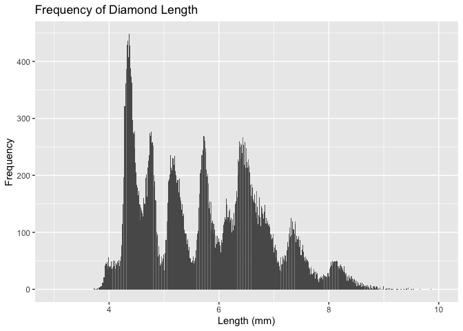<!-- -->

```r
LengthPrice <- ggplot(data = d,mapping = aes(x = x, y = price)) +
  geom_point() +
  geom_smooth(method = "lm") +
  labs(x = "Length (mm)", y = "Price", title = "Diamond Length by Price")
LengthPrice
```

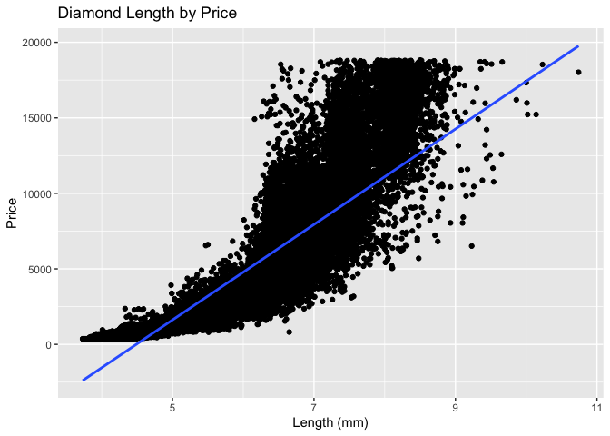<!-- -->

#### Width
Find frequency of each width and the relationship between width and price.

```r
WidthFreq <- ggplot(data=d,mapping = aes(x = y)) +
  geom_bar() +
  xlim(3,10) +
  labs(x = "Width (mm)", y = "Frequency", title = "Frequency of Diamond Width")
WidthFreq
```

<!-- -->

```r
WidthPrice <- ggplot(data = d,mapping = aes(x = y, y = price)) +
  geom_point() +
  geom_smooth(method = "lm") +
  labs(x = "Width (mm)", y = "Price", title = "Diamond Width by Price") +
  xlim(3,10)
WidthPrice
```

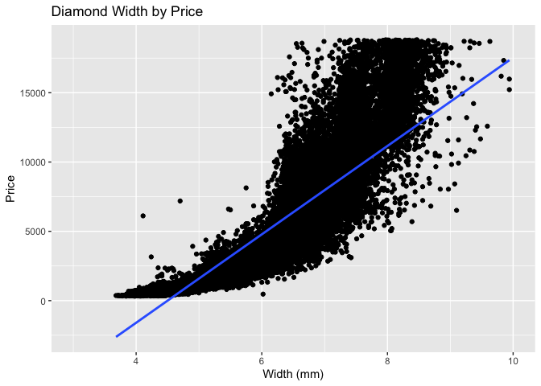<!-- -->

#### Depth
Find frequency of each depth and the relationship between depth and price.

```r
DepthFreq <- ggplot(data=d,mapping = aes(x = z)) +
  geom_bar() +
  xlim(2,6) +
  labs(x = "Depth (mm)", y = "Frequency", title = "Frequency of Diamond Depth")
DepthFreq
```

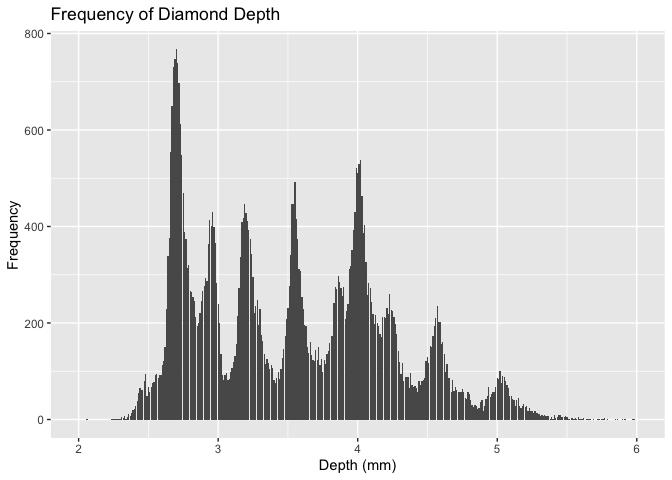<!-- -->

```r
DepthPrice <- ggplot(data = d,mapping = aes(x = z, y = price)) +
  geom_point() +
  geom_smooth(method = "lm") +
  labs(x = "Depth (mm)", y = "Price", title = "Diamond Depth by Price") +
  xlim(0,8)
DepthPrice
```

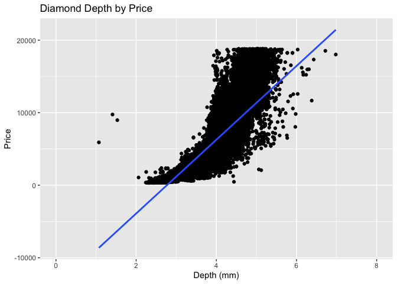<!-- -->

## Explore the distribution of price

```r
ggplot(data=d,mapping=aes(x=price)) +
  geom_histogram(fill = "orange",color = "black") +
  labs(x = "Price", y = "Frequency", title = "Frequency of Diamonds by Price")
```

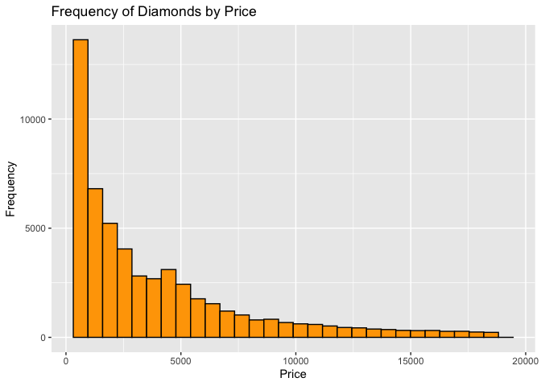<!-- -->

After exploring the distribution of price, I found it quite interesting that most of the diamonds are lower in price. In fact, it is a near linear distribtuion where frequency decreases as price increases.

## What variable is most important for price?

```r
d1 <- d %>%
  select(carat,depth,table,price,x,y,z)
d2 <- cor(d1)
d2
```

```
##            carat       depth      table       price           x           y
## carat 1.00000000  0.02825919  0.1816460  0.92159206  0.97777862  0.95399074
## depth 0.02825919  1.00000000 -0.2957335 -0.01072892 -0.02501673 -0.02906877
## table 0.18164596 -0.29573346  1.0000000  0.12724530  0.19609736  0.18449347
## price 0.92159206 -0.01072892  0.1272453  1.00000000  0.88723137  0.86786424
## x     0.97777862 -0.02501673  0.1960974  0.88723137  1.00000000  0.97491827
## y     0.95399074 -0.02906877  0.1844935  0.86786424  0.97491827  1.00000000
## z     0.96104758  0.09502252  0.1524834  0.86820640  0.97543508  0.95674373
##                z
## carat 0.96104758
## depth 0.09502252
## table 0.15248337
## price 0.86820640
## x     0.97543508
## y     0.95674373
## z     1.00000000
```

```r
ggcorrplot(d2)
```

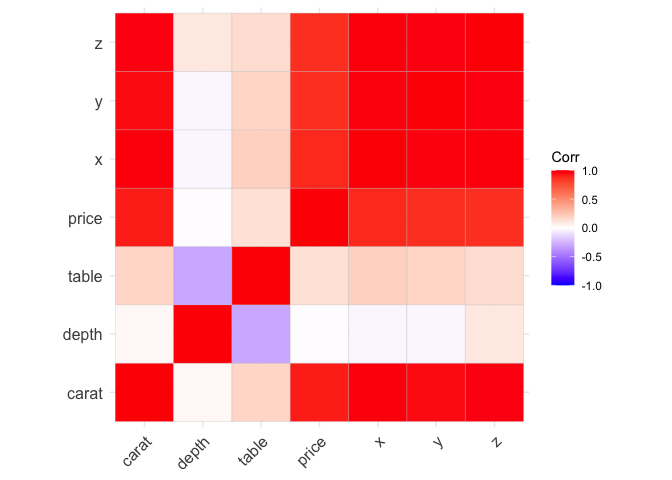<!-- -->

### How does that variable correlat with cut?

```r
d3 <- d %>%
  group_by(cut) %>%
  summarise(carat = mean(carat))
ggplot(data = d3, mapping = aes(x = cut, y = carat)) +
  geom_col() +
  labs(x = "Cut", y = "Average Carats")
```

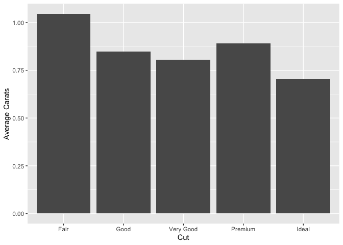<!-- -->

### How is price correlated with cut?

```r
d4 <- d %>%
  group_by(cut) %>%
  summarise(price = mean(price))
ggplot(d4, mapping = aes(x = cut, y = price)) +
  geom_col() +
  labs(x = "Cut", y = "Average Price")
```

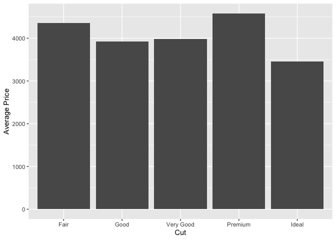<!-- -->

After looking at the correlations between the variables, I found that carat has the strongest correlation with price. Length turned out to be the most important of the 3 (x,y,z). When comparing carat with cut, there is a small relationship where carats go down as cut quality increases. However, this relationship is very little. When comparing cut and price, there is not much of a correlation. A "Fair" cut has the second highest average price, with "Ideal" having the lowest average price. This suggests there is not any relationship with price and cut. Therefore, the relationships can lead a lopwer quality diamond to having a higher price because a low quality diamond can have a high price if the diamond has high carats.

## Carot vs Price

```r
ggplot(data=d, mapping = aes(x = carat, y = price)) +
  geom_point(aes(color = cut),alpha=3/5) +
  geom_smooth(method = "lm") +
  ylim(0, 20000)
```

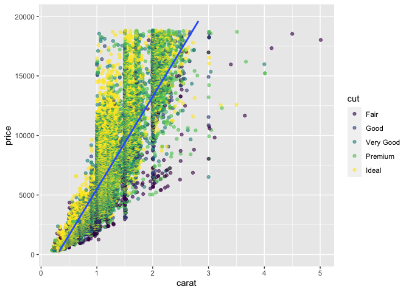<!-- -->

## Price for Very Large vs Small Diamonds

```r
d9 <- d %>%
  arrange(carat) %>%
  mutate(perc = ntile(carat, 10)) %>%
  mutate(size = case_when(
    perc == 10 ~ "Large",
    perc == 1 ~ "Small"
  )) %>%
  group_by(size) %>%
  summarise(price = mean(price)) %>%
  drop_na()
d9
```

```
## # A tibble: 2 × 2
##   size   price
##   <chr>  <dbl>
## 1 Large 12631.
## 2 Small   631.
```

```r
ggplot(d9,mapping=aes(x = size, y = price)) +
  geom_col()
```

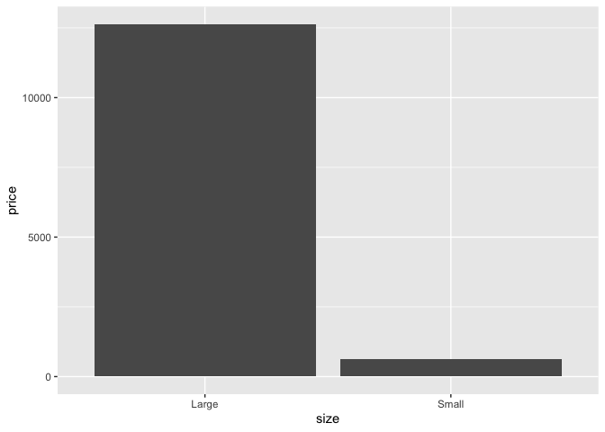<!-- -->

Yes, the data does agree with my expectations. I compared the 10% largest and 10% smallest diamonds. Large diamonds had a significantly larger price.

## Combined distribution of Price, Carat, and Cut

```r
ggplot(d,mapping = aes(x = carat,y = price, color = cut)) +
  geom_point() +
  geom_smooth(method = "lm", color = "black") +
  facet_wrap(~ cut, nrow = 2, scales = "free_x") +
  labs(x = "Carat", y = "Price", title = "Price of Diamond by Carat and Cut")
```

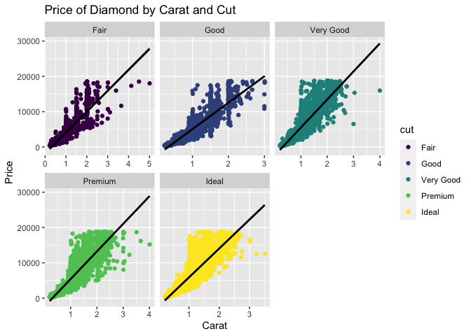<!-- -->

