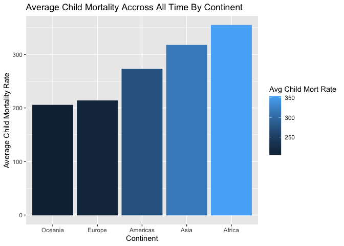
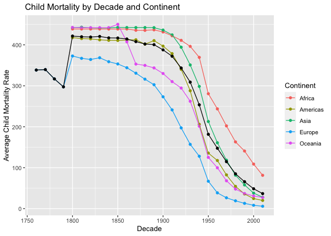

#### Libraries

```r
library(devtools)
library(tidyverse)
library(dplyr)
library(ggplot2)
```

#### Download Data

```r
devtools::install_github("drsimonj/ourworldindata")
fh <- ourworldindata::financing_healthcare
fh
```

```
## # A tibble: 36,873 × 17
##     year country conti…¹ healt…² healt…³ healt…⁴ nhs_exp healt…⁵ healt…⁶ healt…⁷
##    <int> <chr>   <chr>     <dbl>   <dbl>   <int>   <dbl>   <dbl>   <dbl>   <dbl>
##  1  2015 Abkhaz… <NA>         NA      NA      NA      NA      NA      NA      NA
##  2  1800 Afghan… Asia         NA      NA      NA      NA      NA      NA      NA
##  3  1801 Afghan… Asia         NA      NA      NA      NA      NA      NA      NA
##  4  1802 Afghan… Asia         NA      NA      NA      NA      NA      NA      NA
##  5  1803 Afghan… Asia         NA      NA      NA      NA      NA      NA      NA
##  6  1804 Afghan… Asia         NA      NA      NA      NA      NA      NA      NA
##  7  1805 Afghan… Asia         NA      NA      NA      NA      NA      NA      NA
##  8  1806 Afghan… Asia         NA      NA      NA      NA      NA      NA      NA
##  9  1807 Afghan… Asia         NA      NA      NA      NA      NA      NA      NA
## 10  1808 Afghan… Asia         NA      NA      NA      NA      NA      NA      NA
## # … with 36,863 more rows, 7 more variables: health_insurance_any <dbl>,
## #   health_exp_public_percent <dbl>, health_exp_oop_percent <dbl>,
## #   no_health_insurance <dbl>, gdp <dbl>, life_expectancy <dbl>,
## #   child_mort <dbl>, and abbreviated variable names ¹​continent,
## #   ²​health_exp_total, ³​health_exp_public, ⁴​health_insurance,
## #   ⁵​health_exp_private, ⁶​health_insurance_govt, ⁷​health_insurance_private
```

#### Manipulate Data - fh1
Dataset fh1 gives average child mortality for each continent

```r
fh1 <- fh %>%
  select(year, country, continent, child_mort) %>%
  drop_na() %>%
  mutate(continent = fct_reorder(continent, child_mort)) %>%
  group_by(continent) %>%
  summarise(child_mort = mean(child_mort))
fh1
```

```
## # A tibble: 5 × 2
##   continent child_mort
##   <fct>          <dbl>
## 1 Oceania         205.
## 2 Europe          213.
## 3 Americas        272.
## 4 Asia            317.
## 5 Africa          354.
```

## Plot1

```r
require(scales)

ggplot(data = fh1, mapping = aes(x = continent, y = child_mort, color = child_mort, fill = child_mort)) +
  geom_col() +
  scale_y_continuous(labels = comma) +
  labs(x = "Continent", y = "Average Child Mortality Rate", fill = "Avg Child Mort Rate",color = "Avg Child Mort Rate", title = "Average Child Mortality Accross All Time By Continent")
```

<!-- -->


#### Manipulate Data - fh2
Dataset fh2 gives average child mortality rate by decade and continent

```r
fh2 <- fh %>%
  select(year, country, continent, child_mort) %>%
  drop_na() %>%
  group_by(year, continent) %>%
  summarise(year, continent, child_mort = mean(child_mort)) %>%
  mutate(decade = case_when(
    year >= 1760 & year <=1769 ~ 1760,
    year >= 1770 & year <=1779 ~ 1770,
    year >= 1780 & year <=1789 ~ 1780,
    year >= 1790 & year <=1799 ~ 1790,
    year >= 1800 & year <=1809 ~ 1800,
    year >= 1810 & year <=1819 ~ 1810,
    year >= 1820 & year <=1829 ~ 1820,
    year >= 1830 & year <=1839 ~ 1830,
    year >= 1840 & year <=1849 ~ 1840,
    year >= 1850 & year <=1859 ~ 1850,
    year >= 1860 & year <=1869 ~ 1860,
    year >= 1870 & year <=1879 ~ 1870,
    year >= 1880 & year <=1889 ~ 1880,
    year >= 1890 & year <=1899 ~ 1890,
    year >= 1900 & year <=1909 ~ 1900,
    year >= 1910 & year <=1919 ~ 1910,
    year >= 1920 & year <=1929 ~ 1920,
    year >= 1930 & year <=1939 ~ 1930,
    year >= 1940 & year <=1949 ~ 1940,
    year >= 1950 & year <=1959 ~ 1950,
    year >= 1960 & year <=1969 ~ 1960,
    year >= 1970 & year <=1979 ~ 1970,
    year >= 1980 & year <=1989 ~ 1980,
    year >= 1990 & year <=1999 ~ 1990,
    year >= 2000 & year <=2009 ~ 2000,
    year >= 2010 & year <=2019 ~ 2010
  )) %>%
  group_by(decade, continent) %>%
  summarise(child_mort = mean(child_mort))
fh2
```

```
## # A tibble: 114 × 3
## # Groups:   decade [26]
##    decade continent child_mort
##     <dbl> <chr>          <dbl>
##  1   1760 Europe          338.
##  2   1770 Europe          340.
##  3   1780 Europe          317.
##  4   1790 Europe          297.
##  5   1800 Africa          439.
##  6   1800 Americas        418.
##  7   1800 Asia            442.
##  8   1800 Europe          373.
##  9   1800 Oceania         443.
## 10   1810 Africa          439.
## # … with 104 more rows
```

#### Manipulate Data - fh3
Dataset fh3 gives average child mortality rate across each decade for the whole world

```r
fh3 <- fh %>%
  select(year, country, continent, child_mort) %>%
  drop_na() %>%
  group_by(year) %>%
  summarise(year, child_mort = mean(child_mort)) %>%
  mutate(decade = case_when(
    year >= 1760 & year <=1769 ~ 1760,
    year >= 1770 & year <=1779 ~ 1770,
    year >= 1780 & year <=1789 ~ 1780,
    year >= 1790 & year <=1799 ~ 1790,
    year >= 1800 & year <=1809 ~ 1800,
    year >= 1810 & year <=1819 ~ 1810,
    year >= 1820 & year <=1829 ~ 1820,
    year >= 1830 & year <=1839 ~ 1830,
    year >= 1840 & year <=1849 ~ 1840,
    year >= 1850 & year <=1859 ~ 1850,
    year >= 1860 & year <=1869 ~ 1860,
    year >= 1870 & year <=1879 ~ 1870,
    year >= 1880 & year <=1889 ~ 1880,
    year >= 1890 & year <=1899 ~ 1890,
    year >= 1900 & year <=1909 ~ 1900,
    year >= 1910 & year <=1919 ~ 1910,
    year >= 1920 & year <=1929 ~ 1920,
    year >= 1930 & year <=1939 ~ 1930,
    year >= 1940 & year <=1949 ~ 1940,
    year >= 1950 & year <=1959 ~ 1950,
    year >= 1960 & year <=1969 ~ 1960,
    year >= 1970 & year <=1979 ~ 1970,
    year >= 1980 & year <=1989 ~ 1980,
    year >= 1990 & year <=1999 ~ 1990,
    year >= 2000 & year <=2009 ~ 2000,
    year >= 2010 & year <=2019 ~ 2010
  )) %>%
  group_by(decade) %>%
  summarise(child_mort = mean(child_mort))
fh3
```

```
## # A tibble: 26 × 2
##    decade child_mort
##     <dbl>      <dbl>
##  1   1760       338.
##  2   1770       340.
##  3   1780       317.
##  4   1790       297.
##  5   1800       422.
##  6   1810       420.
##  7   1820       419.
##  8   1830       421.
##  9   1840       417.
## 10   1850       417.
## # … with 16 more rows
```

## Plot 2

```r
ggplot() +
  geom_point(data = fh2, mapping = aes(x = decade,y=child_mort, color = continent)) +
  geom_line(data = fh2, mapping = aes(x = decade,y=child_mort, color = continent)) +
  geom_point(data = fh3, mapping = aes(x = decade, y = child_mort)) +
  geom_line(data = fh3, mapping = aes(x = decade, y = child_mort)) +
  labs(x = "Decade",y = "Average Child Mortality Rate",color = "Continent",title = "Child Mortality by Decade and Continent")
```

<!-- -->

