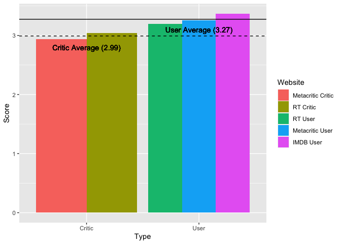

#### Libararies

```r
library(downloader)
library(tidyverse)
library(dplyr)
library(ggplot2)
library(RColorBrewer)
library(tidyr)
```

#### Download Data

```r
data <- read_csv("https://raw.githubusercontent.com/fivethirtyeight/data/master/fandango/fandango_score_comparison.csv")
data
```

```
## # A tibble: 146 × 22
##    FILM    Rotte…¹ Rotte…² Metac…³ Metac…⁴  IMDB Fanda…⁵ Fanda…⁶ RT_norm RT_us…⁷
##    <chr>     <dbl>   <dbl>   <dbl>   <dbl> <dbl>   <dbl>   <dbl>   <dbl>   <dbl>
##  1 Avenge…      74      86      66     7.1   7.8     5       4.5    3.7     4.3 
##  2 Cinder…      85      80      67     7.5   7.1     5       4.5    4.25    4   
##  3 Ant-Ma…      80      90      64     8.1   7.8     5       4.5    4       4.5 
##  4 Do You…      18      84      22     4.7   5.4     5       4.5    0.9     4.2 
##  5 Hot Tu…      14      28      29     3.4   5.1     3.5     3      0.7     1.4 
##  6 The Wa…      63      62      50     6.8   7.2     4.5     4      3.15    3.1 
##  7 Irrati…      42      53      53     7.6   6.9     4       3.5    2.1     2.65
##  8 Top Fi…      86      64      81     6.8   6.5     4       3.5    4.3     3.2 
##  9 Shaun …      99      82      81     8.8   7.4     4.5     4      4.95    4.1 
## 10 Love &…      89      87      80     8.5   7.8     4.5     4      4.45    4.35
## # … with 136 more rows, 12 more variables: Metacritic_norm <dbl>,
## #   Metacritic_user_nom <dbl>, IMDB_norm <dbl>, RT_norm_round <dbl>,
## #   RT_user_norm_round <dbl>, Metacritic_norm_round <dbl>,
## #   Metacritic_user_norm_round <dbl>, IMDB_norm_round <dbl>,
## #   Metacritic_user_vote_count <dbl>, IMDB_user_vote_count <dbl>,
## #   Fandango_votes <dbl>, Fandango_Difference <dbl>, and abbreviated variable
## #   names ¹​RottenTomatoes, ²​RottenTomatoes_User, ³​Metacritic, …
```

#### Tidy Data

```r
d1 <- data %>%
  select(FILM, RT_norm, RT_user_norm, Metacritic_norm, Metacritic_user_nom, IMDB_norm) %>%
  pivot_longer(c('RT_norm', 'RT_user_norm','Metacritic_norm','Metacritic_user_nom','IMDB_norm'),names_to = "Website",values_to = "Score") %>%
  group_by(Website) %>%
  summarise(Score = mean(Score)) %>%
  mutate(Website = fct_reorder(Website, Score)) %>%
  mutate(Type = case_when(
    Website == 'RT_norm' | Website == 'Metacritic_norm' ~ "Critic",
    Website == 'RT_user_norm' | Website == 'Metacritic_user_nom' | Website == 'IMDB_norm' ~ "User"
  ))
d1
```

```
## # A tibble: 5 × 3
##   Website             Score Type  
##   <fct>               <dbl> <chr> 
## 1 IMDB_norm            3.37 User  
## 2 Metacritic_norm      2.94 Critic
## 3 Metacritic_user_nom  3.26 User  
## 4 RT_norm              3.04 Critic
## 5 RT_user_norm         3.19 User
```


#### Critic vs User Data

```r
critic <- d1 %>%
  filter(Website == "RT_norm" | Website == "Metacritic_norm") %>%
  summarise(Type,Score = mean(Score)) %>%
  group_by(Type,Score) %>%
  summarise()
critic
```

```
## # A tibble: 1 × 2
## # Groups:   Type [1]
##   Type   Score
##   <chr>  <dbl>
## 1 Critic  2.99
```

```r
user <- d1 %>%
  filter(Website == "RT_user_norm" | Website == "Metacritic_user_nom" | Website == "IMDB_norm") %>%
  summarise(Type,Score = mean(Score)) %>%
  group_by(Type,Score) %>%
  summarise()
user
```

```
## # A tibble: 1 × 2
## # Groups:   Type [1]
##   Type  Score
##   <chr> <dbl>
## 1 User   3.27
```

#### Plot 1

```r
plot1 <- ggplot(data = d1,mapping = aes(x = Type, y = Score, fill = Website)) +
  geom_col(position = "dodge") +
  geom_text(aes(x = 'Critic', y = 2.8, label = "Critic Average (2.99)",group = "Critic")) +
  geom_text(aes(x = 'User', y = 3.1, label = "User Average (3.27)")) +
  scale_fill_discrete(labels=c('Metacritic Critic', 'RT Critic', 'RT User','Metacritic User','IMDB User')) +
  geom_hline(aes(yintercept = Score), critic,linetype = "dashed") +
  geom_hline(aes(yintercept = Score), user)
plot1
```

<!-- -->

#### First 20 rows of tidy data

```r
d2 <- data %>%
  select(FILM, RT_norm, RT_user_norm, Metacritic_norm, Metacritic_user_nom, IMDB_norm) %>%
  pivot_longer(c('RT_norm', 'RT_user_norm','Metacritic_norm','Metacritic_user_nom','IMDB_norm'),names_to = "Website",values_to = "Score")

d2 <- head(d2,n=20)
d2
```

```
## # A tibble: 20 × 3
##    FILM                           Website             Score
##    <chr>                          <chr>               <dbl>
##  1 Avengers: Age of Ultron (2015) RT_norm              3.7 
##  2 Avengers: Age of Ultron (2015) RT_user_norm         4.3 
##  3 Avengers: Age of Ultron (2015) Metacritic_norm      3.3 
##  4 Avengers: Age of Ultron (2015) Metacritic_user_nom  3.55
##  5 Avengers: Age of Ultron (2015) IMDB_norm            3.9 
##  6 Cinderella (2015)              RT_norm              4.25
##  7 Cinderella (2015)              RT_user_norm         4   
##  8 Cinderella (2015)              Metacritic_norm      3.35
##  9 Cinderella (2015)              Metacritic_user_nom  3.75
## 10 Cinderella (2015)              IMDB_norm            3.55
## 11 Ant-Man (2015)                 RT_norm              4   
## 12 Ant-Man (2015)                 RT_user_norm         4.5 
## 13 Ant-Man (2015)                 Metacritic_norm      3.2 
## 14 Ant-Man (2015)                 Metacritic_user_nom  4.05
## 15 Ant-Man (2015)                 IMDB_norm            3.9 
## 16 Do You Believe? (2015)         RT_norm              0.9 
## 17 Do You Believe? (2015)         RT_user_norm         4.2 
## 18 Do You Believe? (2015)         Metacritic_norm      1.1 
## 19 Do You Believe? (2015)         Metacritic_user_nom  2.35
## 20 Do You Believe? (2015)         IMDB_norm            2.7
```


The graph shows the average rating for the websites on a 5 star scale. Metacritic and Rotten Tomatoes both have a critic and user score, while IMDB only has user scores. I grouped them together by type and it turns out that users give a higher score than critics. The lowest average user score (RT User) is still higher than the highest critic score.
