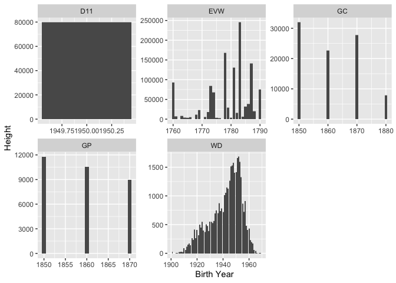

## Libraries

```r
library(readr)
library(tidyverse)
library(readxl)
library(tidyr)
library(downloader)
library(haven)
library(foreign)
```

## Import Data

```r
GC <- read_dta("https://github.com/WJC-Data-Science/DTS350/blob/master/germanconscr.dta?raw=true")


GP <- read_dta("https://github.com/WJC-Data-Science/DTS350/blob/master/germanprison.dta?raw=true")


EVW <- tempfile()
download("https://github.com/WJC-Data-Science/DTS350/raw/master/Heights_south-east/B6090.DBF?raw=true", EVW,mode = "wb")
EVW <- read.dbf(EVW)


heightscsv <- read_csv("https://raw.githubusercontent.com/hadley/r4ds/master/data/heights.csv",skip = 2,col_names = FALSE)
d1 <- heightscsv %>%
  mutate(earn = X1, height = X2, sex = X3, ed = X4, age = X5, race = X6) %>%
  select(earn,height,sex,ed,age,race)


WD=read.spss("http://www.ssc.wisc.edu/nsfh/wave3/NSFH3%20Apr%202005%20release/main05022005.sav", to.data.frame=TRUE)
write.table(WD,"WD.csv")


readLines("https://github.com/WJC-Data-Science/DTS350/raw/master/CaseStudy7Data/heights.csv",n=5)
```

```
## [1] "bplist00\xd1\001\002_\020\017WebMainResource\xd5\003\004\005\006\a\b\t"                                                                                                                                                                                                                                                                                                    
## [2] "\v\f^WebResourceURL_\020\024WebResourceFrameName_\020\017WebResourceData_\020\023WebResourceMIMEType_\020\033WebResourceTextEncodingName_\020Ehttps://raw.githubusercontent.com/hadley/r4ds/master/data/heights.csvPO\021\xd1\xec<html><head></head><body><pre style=\"word-wrap: break-word; white-space: pre-wrap;\">\"earn\",\"height\",\"sex\",\"ed\",\"age\",\"race\""
## [3] "50000,74.4244387818035,\"male\",16,45,\"white\""                                                                                                                                                                                                                                                                                                                           
## [4] "60000,65.5375428255647,\"female\",16,58,\"white\""                                                                                                                                                                                                                                                                                                                         
## [5] "30000,63.6291977374349,\"female\",16,29,\"white\""
```

```r
exceldata <- read_xlsx('Height.xlsx',skip = 2)
```


## Tidy World Estimate Data

```r
d <- exceldata %>%
  pivot_longer(cols =  ('1800':'2011'), names_to = "Year",values_to = "Height") %>%
  filter(!is.na(Height))
names(d)[2] <- 'Country'

dd <- d %>%
  separate(Year, into = c("Century","Decade"),sep = -2) %>%
  separate(Decade, into = c('Decade','Year'),sep=-1) %>%
  mutate(height.cm = Height, height.in = Height/2.54) %>%
  select(-Height) %>%
  arrange(Century,Decade,Year)

write.csv(dd, "WorldEstimates", row.names = TRUE)
```

## Join Individual Datasets

```r
GC1 <- GC %>%
  mutate(height.cm = height, height.in = height/2.54,bYear = bdec, dataset = 'GC') %>%
  select(height.cm,height.in, bYear, dataset)

GP1 <- GP %>%
  mutate(height.cm = height,height.in=height/2.54,bYear = bdec, dataset = 'GP') %>%
  select(height.cm,height.in, bYear, dataset)

  
EVW1 <- EVW %>%
  mutate(bYear = SJ, height.cm = CMETER, height.in = CMETER/2.54, dataset = 'EVW') %>%
  select(height.cm,height.in, bYear, dataset)


WD1 <- WD %>%
  mutate(height.cm = RT216I*2.54, height.in = RT216I, bYear = as.numeric(DOBY)+1900, dataset = 'WD') %>%
  select(height.cm,height.in, bYear, dataset)


D11 <- d1 %>%
  mutate(height.in = height, height.cm = height*2.54, bYear = 1950, dataset = 'D11') %>%
  select(height.cm,height.in, bYear, dataset)


joined <- bind_rows(GC1,GP1,EVW1,WD1,D11)


write.csv(joined, "Individual.csv", row.names = TRUE)
```


## Plot1

```r
dd1 <- dd %>%
  filter(Country == "Germany") %>%
  unite(Year,Century,Decade,Year,sep = "")
dd1
```

```
## # A tibble: 18 × 5
##     Code Country Year  height.cm height.in
##    <dbl> <chr>   <chr>     <dbl>     <dbl>
##  1   276 Germany 1810       168.      66.1
##  2   276 Germany 1820       167.      65.9
##  3   276 Germany 1830       167.      65.7
##  4   276 Germany 1840       167.      65.6
##  5   276 Germany 1850       164.      64.5
##  6   276 Germany 1860       166.      65.2
##  7   276 Germany 1870       167.      65.7
##  8   276 Germany 1880       168.      66.1
##  9   276 Germany 1890       169.      66.4
## 10   276 Germany 1900       169.      66.6
## 11   276 Germany 1910       170.      67.1
## 12   276 Germany 1920       173.      68.2
## 13   276 Germany 1930       174       68.5
## 14   276 Germany 1940       175.      69.0
## 15   276 Germany 1950       177.      69.6
## 16   276 Germany 1960       179.      70.4
## 17   276 Germany 1970       179.      70.6
## 18   276 Germany 1980       180.      71.1
```

```r
ggplot(data = dd1,mapping = aes(x = Year, y = height.in,group=1)) +
  geom_point() +
  geom_line() +
  labs(x = "Decade", y = "Height (in)", title = "Germany Height in inches by Decade")
```

<!-- -->

## Plot2

```r
joined1 <- joined %>%
  group_by(bYear,dataset) %>%
  summarise(height = mean(height.in))
joined1
```

```
## # A tibble: 103 × 3
## # Groups:   bYear [99]
##    bYear dataset height
##    <dbl> <chr>    <dbl>
##  1  1760 EVW       66.1
##  2  1761 EVW       67.1
##  3  1763 EVW       64.6
##  4  1764 EVW       65.6
##  5  1765 EVW       65.6
##  6  1766 EVW       67.8
##  7  1768 EVW       68.1
##  8  1769 EVW       66.8
##  9  1771 EVW       65.3
## 10  1772 EVW       67.3
## # … with 93 more rows
```

```r
ggplot(data = joined, mapping = aes(x = bYear, y = height.in)) +
  geom_col() +
  facet_wrap(~dataset,scales="free") +
  labs(x = "Birth Year",y = 'Height')
```

<!-- -->


My first graphic with the World Estimates data shows a strong supporting arguement for the claim that people get taller throughout time. Besides the drop off in the mid-1800's, everything is in a upward, almost linear trend as time goes on. My second visualization however did not support this claim. For the second visual, it can be observed in the Wisconsin Data table that there is indeed a correlation throughout time.
