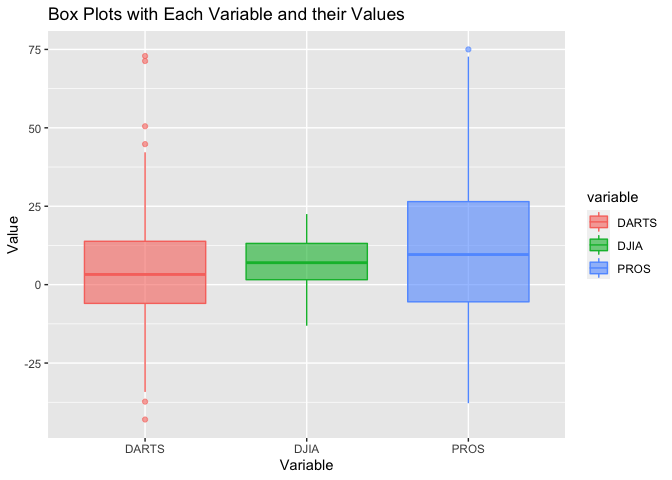
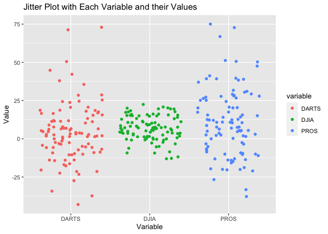
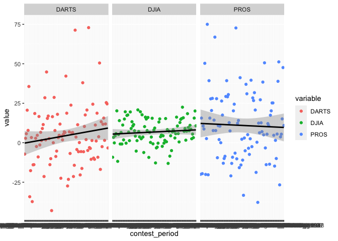
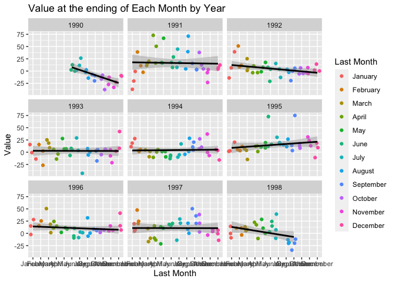

### Libraries

```r
library(dplyr)
library(ggplot2)
library(tidyr)
library(lubridate)
library(downloader)
library(readr)
library(haven)
library(readxl)
library(forcats)
library(knitr)
library(tidyverse)
```

## Read in 5 files as temp files

```r
rds <- tempfile()
download.file("https://github.com/WJC-Data-Science/DTS350/raw/master/Dart_Expert_Dow_6month_anova/Dart_Expert_Dow_6month_anova.RDS", rds, mode = "wb")
rds <- readRDS(rds)

csv <- tempfile()
download.file("https://raw.githubusercontent.com/WJC-Data-Science/DTS350/master/Dart_Expert_Dow_6month_anova/Dart_Expert_Dow_6month_anova.csv", csv, mode = "wb")
csv <- read_csv(csv)

dta <- tempfile()
download.file("https://github.com/WJC-Data-Science/DTS350/raw/master/Dart_Expert_Dow_6month_anova/Dart_Expert_Dow_6month_anova.dta", dta, mode = "wb")
dta <- read_dta(dta)

sav <- tempfile()
download.file("https://github.com/WJC-Data-Science/DTS350/raw/master/Dart_Expert_Dow_6month_anova/Dart_Expert_Dow_6month_anova.sav", sav, mode = "wb")
sav <- read_sav(sav)

xl <- tempfile()
download.file("https://github.com/WJC-Data-Science/DTS350/raw/master/Dart_Expert_Dow_6month_anova/Dart_Expert_Dow_6month_anova.xlsx", xl, mode = "wb")
xl <- read_xlsx(xl)
```

### Confirm all 5 files are all_equal()

```r
all_equal(rds,csv,dta,convert = TRUE)
```

```
## [1] TRUE
```

```r
all_equal(rds,sav,xl,convert = TRUE)
```

```
## [1] TRUE
```

## Performance Visualizations
### Box Plot

```r
ggplot(xl,mapping = aes(x = variable,y = value, color = variable,fill=variable)) +
  geom_boxplot(alpha=3/5) +
  labs(x = "Variable",y="Value",title="Box Plots with Each Variable and their Values")
```

<!-- -->
### Jittered Returns

```r
ggplot(xl, mapping = aes(x=variable,y=value)) +
  geom_jitter(aes(color=variable)) +
  labs(x = "Variable",y="Value",title="Jitter Plot with Each Variable and their Values")
```

<!-- -->
### Average Return

```r
ggplot(xl,mapping = aes(x=contest_period,y=value,color = variable,group = variable)) +
  geom_point() +
  geom_smooth(method = "lm",color = "black") +
  facet_wrap(~ variable)
```

<!-- -->

## Tidy the Data

```r
months <- c("January", "February", "March", "April", "May", "June", "July", "August", "September", "October", "November", "December")

data <- xl %>%
  mutate(contest_period = str_replace_all(contest_period, "19", "_19"),
         contest_period = str_replace_all(contest_period, 'Dec._1993', 'December_1993'),
         contest_period = str_replace_all(contest_period, 'Febuary', 'February')) %>%
  separate(contest_period, into = c("Month", 'year_end'),sep="-") %>%
  separate(year_end, into = c("Month_end", 'Year_end'),sep="_") %>%
  select(-Month) %>%
  mutate(Month_end = factor(Month_end, levels = months))
data
```

```
## # A tibble: 300 × 4
##    Month_end Year_end variable value
##    <fct>     <chr>    <chr>    <dbl>
##  1 June      1990     PROS      12.7
##  2 July      1990     PROS      26.4
##  3 August    1990     PROS       2.5
##  4 September 1990     PROS     -20  
##  5 October   1990     PROS     -37.8
##  6 November  1990     PROS     -33.3
##  7 December  1990     PROS     -10.2
##  8 January   1991     PROS     -20.3
##  9 February  1991     PROS      38.9
## 10 March     1991     PROS      20.2
## # … with 290 more rows
```
### Save tidied data as rds object

```r
saveRDS(data, file = "data.rsd")
```

## Visualize 6-month returns

```r
ggplot(data = data, aes(x = Month_end, y = value,group = Year_end)) +
  geom_jitter(aes(color = Month_end)) +
  geom_smooth(method = "lm",color="black") +
  facet_wrap(~Year_end) +
  labs(x="Last Month",y = "Value",title = "Value at the ending of Each Month by Year",color = "Last Month")
```

<!-- -->

## Match table below

```r
data1 <- data %>%
  filter(variable == "DJIA") %>%
  pivot_wider(names_from = "Year_end", values_from = "value") %>%
  arrange(factor(Month_end, levels = months))
data1
```

```
## # A tibble: 12 × 11
##    Month_end variable `1990` `1991` `1992` `1993` `1994` `1995` `1996` `1997`
##    <fct>     <chr>     <dbl>  <dbl>  <dbl>  <dbl>  <dbl>  <dbl>  <dbl>  <dbl>
##  1 January   DJIA       NA     -0.8    6.5   -0.8   11.2    1.8   15     19.6
##  2 February  DJIA       NA     11      8.6    2.5    5.5    3.2   15.6   20.1
##  3 March     DJIA       NA     15.8    7.2    9      1.6    7.3   18.4    9.6
##  4 April     DJIA       NA     16.2   10.6    5.8    0.5   12.8   14.8   15.3
##  5 May       DJIA       NA     17.3   17.6    6.7    1.3   19.5    9     13.3
##  6 June      DJIA        2.5   17.7    3.6    7.7   -6.2   16     10.2   16.2
##  7 July      DJIA       11.5    7.6    4.2    3.7   -5.3   19.6    1.3   20.8
##  8 August    DJIA       -2.3    4.4   -0.3    7.3    1.5   15.3    0.6    8.3
##  9 September DJIA       -9.2    3.4   -0.1    5.2    4.4   14      5.8   20.2
## 10 October   DJIA       -8.5    4.4   -5      5.7    6.9    8.2    7.2    3  
## 11 November  DJIA      -12.8   -3.3   -2.8    4.9   -0.3   13.1   15.1    3.8
## 12 December  DJIA       -9.3    6.6    0.2    8      3.6    9.3   15.5   -0.7
## # … with 1 more variable: `1998` <dbl>
```

This visualization shows the value for each month, for each variable, faceted by year. There isn't too much that can be taken from this visualization, as there are not many noticeable trends. It appears that the months of May - Septembers are the furthest away from the line in a lot of cases.
