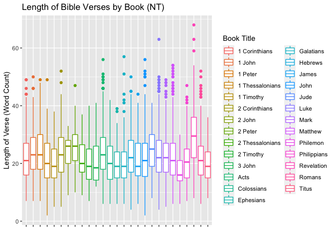

### Libraries

```r
library(tidyverse)
library(downloader)
library(dplyr)
library(tidyr)
library(stringi)
library(stringr)
library(ggplot2)
```

### Import Bible Data

```r
bible <- read_csv("https://raw.githubusercontent.com/WJC-Data-Science/DTS350/master/bible.csv")
head(bible)
```

```
## # A tibble: 6 × 17
##   volume_id book_id chapter_id verse_id volume…¹ book_…² volum…³ book_…⁴ volum…⁵
##       <dbl>   <dbl>      <dbl>    <dbl> <chr>    <chr>   <chr>   <chr>   <lgl>  
## 1         1       1          1        1 Old Tes… Genesis The Ol… The Fi… NA     
## 2         1       1          1        2 Old Tes… Genesis The Ol… The Fi… NA     
## 3         1       1          1        3 Old Tes… Genesis The Ol… The Fi… NA     
## 4         1       1          1        4 Old Tes… Genesis The Ol… The Fi… NA     
## 5         1       1          1        5 Old Tes… Genesis The Ol… The Fi… NA     
## 6         1       1          1        6 Old Tes… Genesis The Ol… The Fi… NA     
## # … with 8 more variables: book_subtitle <lgl>, volume_short_title <chr>,
## #   book_short_title <chr>, chapter_number <dbl>, verse_number <dbl>,
## #   scripture_text <chr>, verse_title <chr>, verse_short_title <chr>, and
## #   abbreviated variable names ¹​volume_title, ²​book_title, ³​volume_long_title,
## #   ⁴​book_long_title, ⁵​volume_subtitle
```


## Average verse length (Old Testament vs New Testament)
### Function that returns the average verse length of a data set

```r
length.function <- function(df, f) {
  word_length <- vector("integer",length(df[[f]]))
  for (i in seq_along(word_length)) {
    word_length[[i]] <- str_count(df[[f]][i],'\\w+')
  }
  word_avg <- sum(word_length)/length(df[[f]])
  word_avg
}
```
### Create Data sets to input into function

```r
Old_Test <- bible %>%
  filter(volume_title == "Old Testament")
Old_Test
```

```
## # A tibble: 23,145 × 17
##    volume_id book_id chapter_id verse_id volum…¹ book_…² volum…³ book_…⁴ volum…⁵
##        <dbl>   <dbl>      <dbl>    <dbl> <chr>   <chr>   <chr>   <chr>   <lgl>  
##  1         1       1          1        1 Old Te… Genesis The Ol… The Fi… NA     
##  2         1       1          1        2 Old Te… Genesis The Ol… The Fi… NA     
##  3         1       1          1        3 Old Te… Genesis The Ol… The Fi… NA     
##  4         1       1          1        4 Old Te… Genesis The Ol… The Fi… NA     
##  5         1       1          1        5 Old Te… Genesis The Ol… The Fi… NA     
##  6         1       1          1        6 Old Te… Genesis The Ol… The Fi… NA     
##  7         1       1          1        7 Old Te… Genesis The Ol… The Fi… NA     
##  8         1       1          1        8 Old Te… Genesis The Ol… The Fi… NA     
##  9         1       1          1        9 Old Te… Genesis The Ol… The Fi… NA     
## 10         1       1          1       10 Old Te… Genesis The Ol… The Fi… NA     
## # … with 23,135 more rows, 8 more variables: book_subtitle <lgl>,
## #   volume_short_title <chr>, book_short_title <chr>, chapter_number <dbl>,
## #   verse_number <dbl>, scripture_text <chr>, verse_title <chr>,
## #   verse_short_title <chr>, and abbreviated variable names ¹​volume_title,
## #   ²​book_title, ³​volume_long_title, ⁴​book_long_title, ⁵​volume_subtitle
```

```r
New_Test <- bible %>%
  filter(volume_title == "New Testament")
New_Test
```

```
## # A tibble: 7,957 × 17
##    volume_id book_id chapter_id verse_id volum…¹ book_…² volum…³ book_…⁴ volum…⁵
##        <dbl>   <dbl>      <dbl>    <dbl> <chr>   <chr>   <chr>   <chr>   <lgl>  
##  1         2      40        930    23146 New Te… Matthew The Ne… The Go… NA     
##  2         2      40        930    23147 New Te… Matthew The Ne… The Go… NA     
##  3         2      40        930    23148 New Te… Matthew The Ne… The Go… NA     
##  4         2      40        930    23149 New Te… Matthew The Ne… The Go… NA     
##  5         2      40        930    23150 New Te… Matthew The Ne… The Go… NA     
##  6         2      40        930    23151 New Te… Matthew The Ne… The Go… NA     
##  7         2      40        930    23152 New Te… Matthew The Ne… The Go… NA     
##  8         2      40        930    23153 New Te… Matthew The Ne… The Go… NA     
##  9         2      40        930    23154 New Te… Matthew The Ne… The Go… NA     
## 10         2      40        930    23155 New Te… Matthew The Ne… The Go… NA     
## # … with 7,947 more rows, 8 more variables: book_subtitle <lgl>,
## #   volume_short_title <chr>, book_short_title <chr>, chapter_number <dbl>,
## #   verse_number <dbl>, scripture_text <chr>, verse_title <chr>,
## #   verse_short_title <chr>, and abbreviated variable names ¹​volume_title,
## #   ²​book_title, ³​volume_long_title, ⁴​book_long_title, ⁵​volume_subtitle
```
### Find Average Verse Length for each testament

```r
length.function(Old_Test,15)
```

```
## [1] 26.42074
```

```r
length.function(New_Test,15)
```

```
## [1] 22.70517
```


## LORD Frequency (Old Testament vs New Testament)

```r
bible2 <- bible %>%
  select(volume_title,scripture_text) %>%
  mutate(lord_count = str_count(scripture_text, coll("lord",ignore_case = TRUE))) %>%
  group_by(volume_title) %>%
  summarise(LORD_count = sum(lord_count))
bible2
```

```
## # A tibble: 2 × 2
##   volume_title  LORD_count
##   <chr>              <int>
## 1 New Testament        736
## 2 Old Testament       7273
```

```r
bible21 <- bible %>%
  select(volume_title,scripture_text) %>%
  mutate(lord_count = str_count(scripture_text, coll("lord",ignore_case = TRUE))) %>%
  group_by(volume_title) %>%
  summarise(LORD_count = mean(lord_count))
bible21
```

```
## # A tibble: 2 × 2
##   volume_title  LORD_count
##   <chr>              <dbl>
## 1 New Testament     0.0925
## 2 Old Testament     0.314
```


## Word count (by verse) for each book in New Testament
### Prepare Data for Visualization 

```r
bible3 <- bible %>%
  filter(volume_title == "New Testament") %>%
  select(book_title,verse_id,scripture_text) %>%
  mutate(word_count = str_count(scripture_text,'\\w+')) %>%
  group_by(book_title) %>%
  mutate(avg_word_count = mean(word_count)) 
bible3
```

```
## # A tibble: 7,957 × 5
## # Groups:   book_title [27]
##    book_title verse_id scripture_text                            word_…¹ avg_w…²
##    <chr>         <dbl> <chr>                                       <int>   <dbl>
##  1 Matthew       23146 THE book of the generation of Jesus Chri…      16    22.2
##  2 Matthew       23147 Abraham begat Isaac; and Isaac begat Jac…      14    22.2
##  3 Matthew       23148 And Judas begat Phares and Zara of Thama…      16    22.2
##  4 Matthew       23149 And Aram begat Aminadab; and Aminadab be…      12    22.2
##  5 Matthew       23150 And Salmon begat Booz of Rachab; and Boo…      16    22.2
##  6 Matthew       23151 And Jesse begat David the king; and Davi…      21    22.2
##  7 Matthew       23152 And Solomon begat Roboam; and Roboam beg…      12    22.2
##  8 Matthew       23153 And Asa begat Josaphat; and Josaphat beg…      12    22.2
##  9 Matthew       23154 And Ozias begat Joatham; and Joatham beg…      12    22.2
## 10 Matthew       23155 And Ezekias begat Manasses; and Manasses…      12    22.2
## # … with 7,947 more rows, and abbreviated variable names ¹​word_count,
## #   ²​avg_word_count
```
### Plot

```r
ggplot(data=bible3, mapping = aes(x = book_title,y = word_count)) +
  geom_boxplot(aes(color = book_title)) +
  theme(axis.text.x=element_blank()) +
  labs(x = "", y = "Length of Verse (Word Count)", color = "Book Title", title = "Length of Bible Verses by Book (NT)")
```

<!-- -->

For the first question, I found that the Old Testament has an average verse length of 26.4 words, which is longer compared to the New Testament at 22.7 words per verse. For the second question, I found that LORD is much more frequent in the Old Testament (7273 total), compared to the New Testament (736 total). The Old Testament also has an average of 0.314 "LORD"s per verse, and the New Testament has an average of 0.0925 "LORD"s per verse. For the last question, I created a box plot to show the distribution of length of verses for each book in the New Testament. The plot shown confirms that the average verse length is roughly 22-23. There is not much variance among each book, they are all in the same general area. Revelations is the only book that really sticks out to me, with the largest average length per verse.
