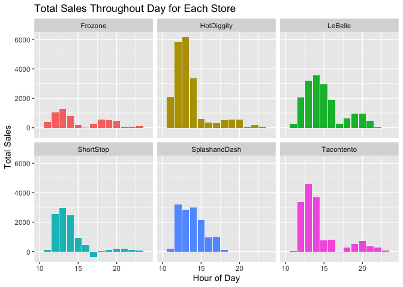
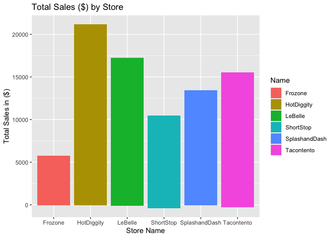
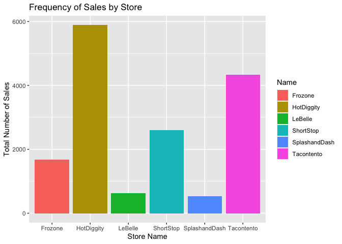
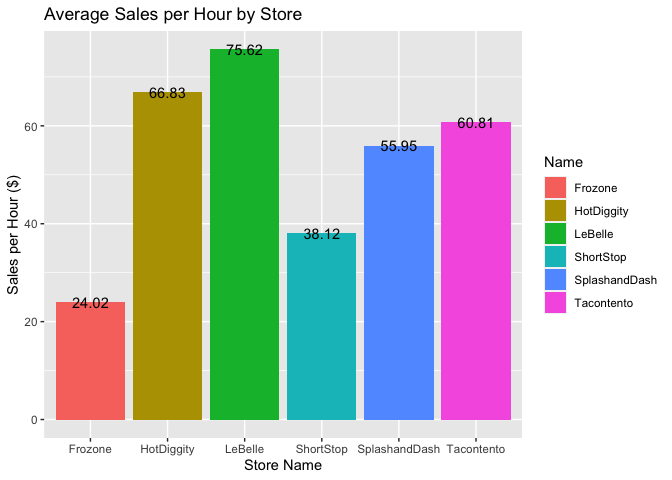

### Libraries

```r
library(tidyverse) 
library(downloader)
library(dplyr)
library(tidyr)
library(stringi)
library(stringr)
library(ggplot2)
library(lubridate)
library(riem)
```


### Import Sales Data

```r
sales <- read_csv("https://github.com/WJC-Data-Science/DTS350/raw/master/sales.csv")
head(sales)
```

```
## # A tibble: 6 × 4
##   Name       Type           Time                Amount
##   <chr>      <chr>          <dttm>               <dbl>
## 1 Tacontento Food(prepared) 2016-05-16 19:01:00    3  
## 2 Tacontento Food(prepared) 2016-05-16 19:01:00    1.5
## 3 Tacontento Food(prepared) 2016-05-16 19:04:00    3  
## 4 Tacontento Food(prepared) 2016-05-16 19:04:00    3  
## 5 Tacontento Food(prepared) 2016-05-16 19:04:00    1.5
## 6 Tacontento Food(prepared) 2016-05-16 19:04:00    1
```

```r
tail(sales)
```

```
## # A tibble: 6 × 4
##   Name    Type               Time                Amount
##   <chr>   <chr>              <dttm>               <dbl>
## 1 Frozone Food(pre-packaged) 2016-07-09 23:58:00   5   
## 2 Frozone Food(pre-packaged) 2016-07-10 00:33:00   5   
## 3 Frozone Food(pre-packaged) 2016-07-10 00:37:00   5   
## 4 Frozone Food(pre-packaged) 2016-07-10 00:47:00   5   
## 5 Missing Missing            2016-06-17 21:12:00 150   
## 6 Missing Missing            2016-04-20 19:01:00  -3.07
```

## Format Data for Analysis

```r
sales1 <- sales %>%
  with_tz(tz = "US/Mountain") %>%
  mutate(day = ceiling_date(Time, "day"),
         week = ceiling_date(Time, "week"),
         month = ceiling_date(Time, "month"),
         hour = ceiling_date(Time, "hour")) %>%
  filter(Name != "Missing")
head(sales1)
```

```
## # A tibble: 6 × 8
##   Name  Type  Time                Amount day                 week               
##   <chr> <chr> <dttm>               <dbl> <dttm>              <dttm>             
## 1 Taco… Food… 2016-05-16 13:01:00    3   2016-05-17 00:00:00 2016-05-22 00:00:00
## 2 Taco… Food… 2016-05-16 13:01:00    1.5 2016-05-17 00:00:00 2016-05-22 00:00:00
## 3 Taco… Food… 2016-05-16 13:04:00    3   2016-05-17 00:00:00 2016-05-22 00:00:00
## 4 Taco… Food… 2016-05-16 13:04:00    3   2016-05-17 00:00:00 2016-05-22 00:00:00
## 5 Taco… Food… 2016-05-16 13:04:00    1.5 2016-05-17 00:00:00 2016-05-22 00:00:00
## 6 Taco… Food… 2016-05-16 13:04:00    1   2016-05-17 00:00:00 2016-05-22 00:00:00
## # … with 2 more variables: month <dttm>, hour <dttm>
```

## Which Business is the best investment?
#### Hours of Operation

```r
ho2 <- sales1 %>%
  select(Name, Amount, hour) %>%
  mutate(hour = hour(hour)) %>%
  group_by(Name,hour) %>%
  summarise(Amount = sum(Amount)) %>%
  arrange(Name,hour)
head(ho2)
```

```
## # A tibble: 6 × 3
## # Groups:   Name [1]
##   Name     hour Amount
##   <chr>   <int>  <dbl>
## 1 Frozone     0   32  
## 2 Frozone     9   14.1
## 3 Frozone    10  -26.7
## 4 Frozone    11  376. 
## 5 Frozone    12 1033. 
## 6 Frozone    13 1287.
```

```r
ggplot(ho2,mapping = aes(x = hour,y=Amount,fill=Name)) +
  geom_col() +
  xlim(10,24) +
  facet_wrap(~ Name) +
  labs(x = "Hour of Day",y="Total Sales",title = "Total Sales Throughout Day for Each Store") +
  theme(legend.position = "none")
```

<!-- -->

The plot indicates the stores all have their the bulk of their sales around noon. 11 AM to 4 PM seems to be the range with the most sales.
#### Customer Traffic

```r
ggplot(ho2,mapping = aes(x = Name, y = Amount,fill = Name)) +
  geom_col() +
  labs(x = "Store Name",y = "Total Sales in ($)",title = "Total Sales ($) by Store")
```

<!-- -->

```r
ggplot(sales1,mapping = aes(x = Name,fill = Name)) +
  geom_bar(stat = "count") +
  labs(x = "Store Name",y="Total Number of Sales",title = "Frequency of Sales by Store")
```

<!-- -->

```r
ho3 <- sales1 %>%
  select(Name, Amount, month) %>%
  mutate(month = month(month)) %>%
  group_by(Name,month) %>%
  summarise(Amount = sum(Amount)) %>%
  arrange(Name,month) %>%
  filter(month > 5)
print(ho3,n=100)
```

```
## # A tibble: 18 × 3
## # Groups:   Name [6]
##    Name          month Amount
##    <chr>         <dbl>  <dbl>
##  1 Frozone           6   415.
##  2 Frozone           7  2898.
##  3 Frozone           8  2427.
##  4 HotDiggity        6  5951.
##  5 HotDiggity        7  9343.
##  6 HotDiggity        8  5913.
##  7 LeBelle           6  2183.
##  8 LeBelle           7  7048.
##  9 LeBelle           8  7858.
## 10 ShortStop         6  2979.
## 11 ShortStop         7  4429.
## 12 ShortStop         8  2692.
## 13 SplashandDash     6  3232.
## 14 SplashandDash     7  6444.
## 15 SplashandDash     8  3752.
## 16 Tacontento        6  2953.
## 17 Tacontento        7  6319.
## 18 Tacontento        8  5992.
```

```r
head(ho3)
```

```
## # A tibble: 6 × 3
## # Groups:   Name [2]
##   Name       month Amount
##   <chr>      <dbl>  <dbl>
## 1 Frozone        6   415.
## 2 Frozone        7  2898.
## 3 Frozone        8  2427.
## 4 HotDiggity     6  5951.
## 5 HotDiggity     7  9343.
## 6 HotDiggity     8  5913.
```

```r
ggplot(ho3,mapping = aes(x=month,y=Amount,fill=Name)) +
  geom_col(position = "dodge") +
  labs(x = "Month",y="Total Sales ($)",title = "Total Sales ($) for Each Store by Month")
```

<!-- -->

The first plot shows that HotDiggity has the most sales in $. Frozone is the worst. LeBelle is a close second and the others are kind of in the middle. The second plot shows HotDiggity as the store with the most number of sales. However, LeBelle is almost last, this indicates that LeBelle has the most expensive prices. Other's are in somewhat similar spots. It is very insightful to see which stores make the most sales in dollars and which stores make the most sales in general. The last plot shows that July has the most sales. The stores seem to have similar numbers accross the months when compared to the other stores
#### Final Comparison

```r
storehours <- sales1 %>%
  mutate(hour = hour(hour),
         day = day(day),
         month = month(month)) %>%
  select(Name,month,day,hour,Amount) %>%
  group_by(Name,month,day,hour) %>%
  summarise() %>%
  arrange(Name,month,day,hour) %>%
  ungroup() %>%
  add_count(Name,name = 'StoreHoursTotal') %>%
  group_by(Name,StoreHoursTotal) %>%
  summarise()
head(storehours) 
```

```
## # A tibble: 6 × 2
## # Groups:   Name [6]
##   Name          StoreHoursTotal
##   <chr>                   <int>
## 1 Frozone                   239
## 2 HotDiggity                316
## 3 LeBelle                   226
## 4 ShortStop                 265
## 5 SplashandDash             240
## 6 Tacontento                251
```

```r
totalsales <- sales1 %>%
  select(Name,Amount) %>%
  group_by(Name) %>%
  summarise(SalesTotal = sum(Amount))
head(totalsales)
```

```
## # A tibble: 6 × 2
##   Name          SalesTotal
##   <chr>              <dbl>
## 1 Frozone            5741.
## 2 HotDiggity        21119.
## 3 LeBelle           17089.
## 4 ShortStop         10101.
## 5 SplashandDash     13428.
## 6 Tacontento        15264.
```

```r
merge1 <- merge(storehours,totalsales,by = 'Name') %>%
  mutate(SalesPerHour = SalesTotal/StoreHoursTotal) %>%
  select(Name,SalesPerHour)
merge1 
```

```
##            Name SalesPerHour
## 1       Frozone     24.01895
## 2    HotDiggity     66.83244
## 3       LeBelle     75.61637
## 4     ShortStop     38.11626
## 5 SplashandDash     55.94867
## 6    Tacontento     60.81371
```

```r
ggplot(merge1,mapping = aes(x=Name,y=SalesPerHour,fill = Name)) +
  geom_col() +
  geom_text(label = round(merge1$SalesPerHour,digits = 2)) +
  labs(x = "Store Name",y = "Sales per Hour ($)",title = "Average Sales per Hour by Store")
```

<!-- -->

After analyzing the data, I found that LeBelle was the most efficient of the stores. They had the second most total sales dollars, but the most in sales dollars per hour of business. I did this by taking each stores total sales and counting the number of hours each business had recorded got the average for each store. At 75.62 per hour, LaBelle is makes the most per hour of operation by almost a margin of 10 compared to the second best of HotDiggity.
