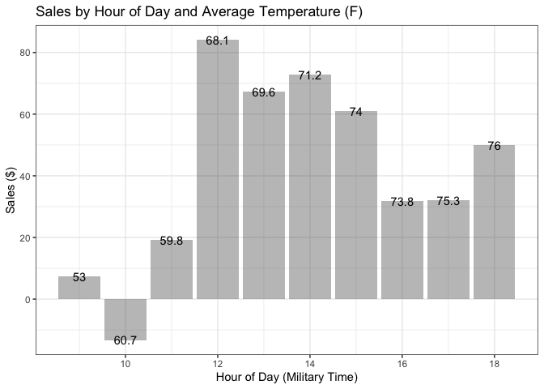

### Libraries

```r
library(tidyverse)
library(downloader)
library(dplyr)
library(tidyr)
library(stringi)
library(stringr)
library(ggplot2)
library(lubridate)
library(riem)
```

### Read in Car Wash Data

```r
cw <- read_csv("https://github.com/WJC-Data-Science/DTS350/raw/master/carwash.csv")
head(cw)
```

```
## # A tibble: 6 × 4
##   name          type     time                amount
##   <chr>         <chr>    <dttm>               <dbl>
## 1 SplashandDash Services 2016-05-13 20:27:00    1  
## 2 SplashandDash Services 2016-05-13 20:27:00    0  
## 3 SplashandDash Services 2016-05-16 19:31:00   23.6
## 4 SplashandDash Services 2016-05-16 17:09:00   18.9
## 5 SplashandDash Services 2016-05-16 17:47:00   23.6
## 6 SplashandDash Services 2016-05-16 17:50:00   23.6
```


### Format Data for Needs of the Task

```r
cw2 <- with_tz(cw, tzone = "US/Mountain") %>%
  mutate(hour = (ceiling_date(time, "hour"))) %>%
  group_by(hour) %>%
  summarise(total_sales = sum(amount))
head(cw2)
```

```
## # A tibble: 6 × 2
##   hour                total_sales
##   <dttm>                    <dbl>
## 1 2016-05-13 15:00:00         1  
## 2 2016-05-16 09:00:00        -1  
## 3 2016-05-16 12:00:00        66.0
## 4 2016-05-16 14:00:00        23.6
## 5 2016-05-16 16:00:00       127. 
## 6 2016-05-17 10:00:00         5
```


### Create dataset with matching temperatures and time

```r
weather <- riem_measures(station = "RXE",  date_start  = '2016-05-13',  date_end  = '2016-07-08' ) %>%
  with_tz(tzone = 'US/Mountain') %>%
  drop_na(tmpf) %>%
  mutate(hour = (ceiling_date(valid, "hour"))) %>%
  select(hour,tmpf)
head(weather)
```

```
## # A tibble: 6 × 2
##   hour                 tmpf
##   <dttm>              <dbl>
## 1 2016-05-12 19:00:00  68  
## 2 2016-05-12 20:00:00  66.0
## 3 2016-05-12 21:00:00  63.0
## 4 2016-05-12 22:00:00  59  
## 5 2016-05-12 23:00:00  57.9
## 6 2016-05-13 00:00:00  55.0
```


### Merge

```r
merge1 <- merge(weather, cw2, by = 'hour') %>%
  mutate(hour_number = hour(hour)) %>%
  group_by(hour_number) %>%
  summarise(sales = mean(total_sales), temp = round(mean(tmpf),digits = 1)) %>%
  arrange(hour_number) %>%
  mutate(profit = case_when(
    sales < 0 ~ "negative",
    sales > 0 ~ "positive"
  ))
head(merge1)
```

```
## # A tibble: 6 × 4
##   hour_number  sales  temp profit  
##         <int>  <dbl> <dbl> <chr>   
## 1           9   7.39  53   positive
## 2          10 -13.3   60.7 negative
## 3          11  19.2   59.8 positive
## 4          12  84.0   68.1 positive
## 5          13  67.4   69.6 positive
## 6          14  72.9   71.2 positive
```


###Plot

```r
p2 <- ggplot(merge1, mapping = aes(x = hour_number, y = sales)) +
  geom_col(alpha=2/5) +
  geom_text(label = merge1$temp) +
  theme_bw() +
  labs(x = "Hour of Day (Military Time)", y = "Sales ($)", title = "Sales by Hour of Day and Average Temperature (F)")
p2
```

<!-- -->

